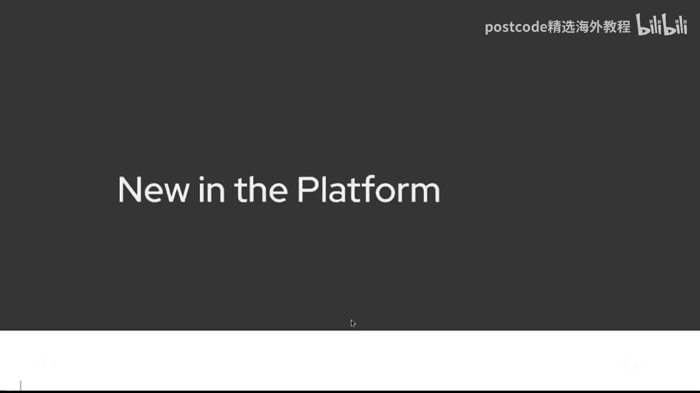
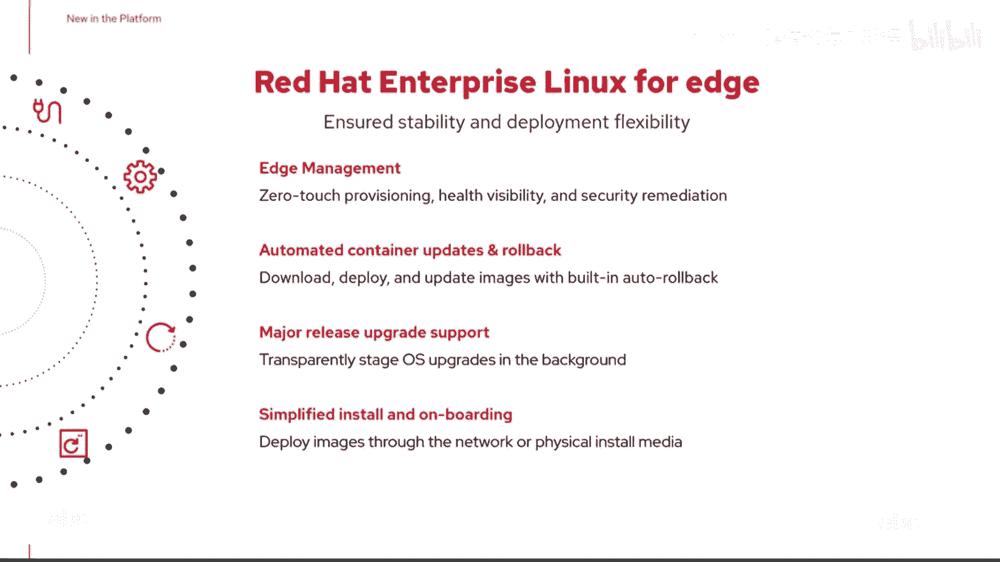
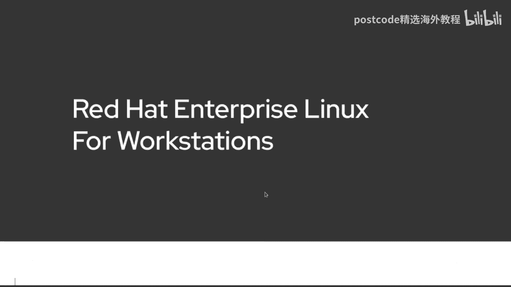
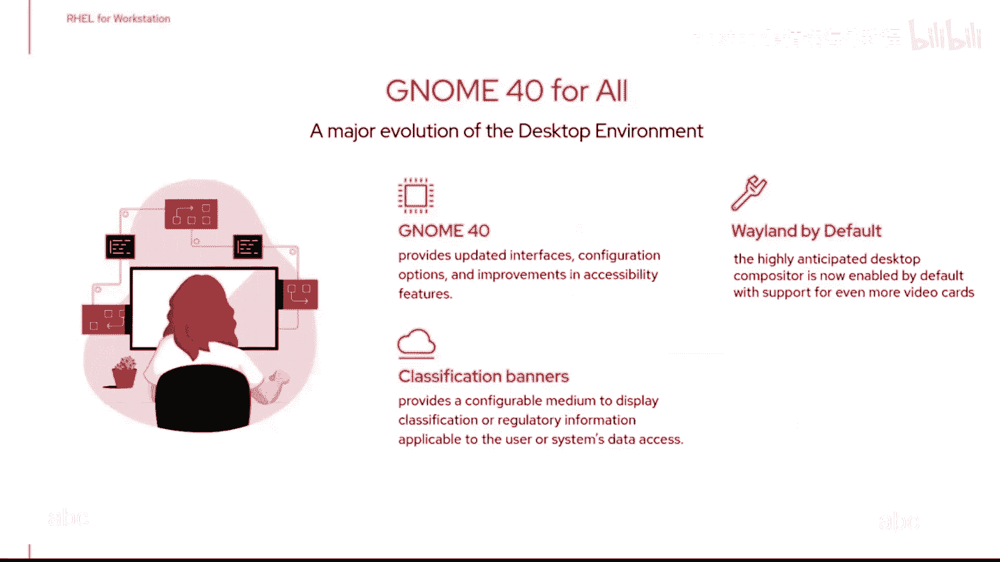
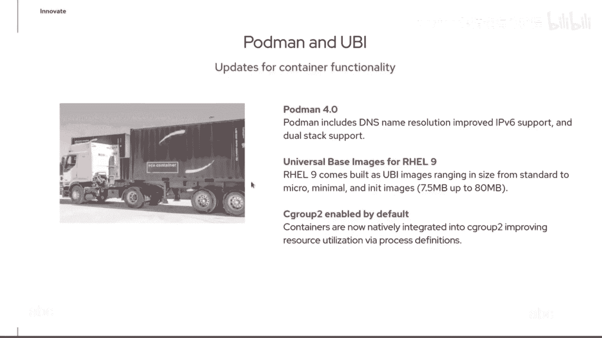
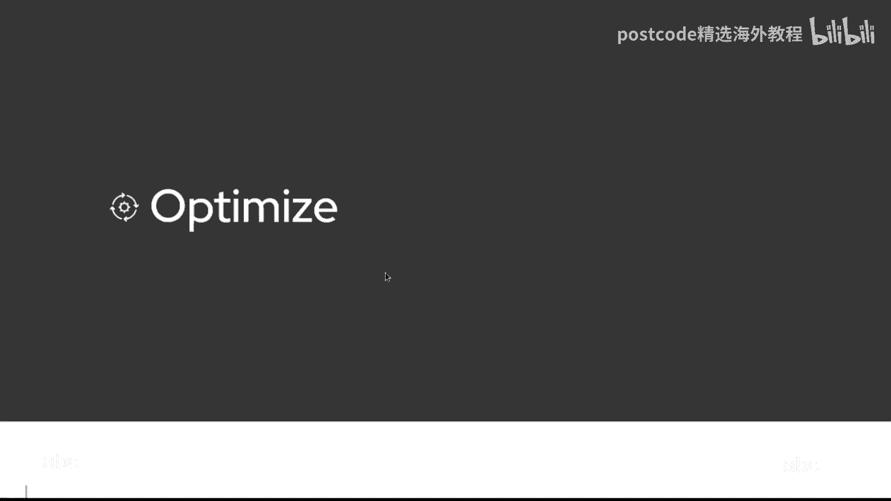
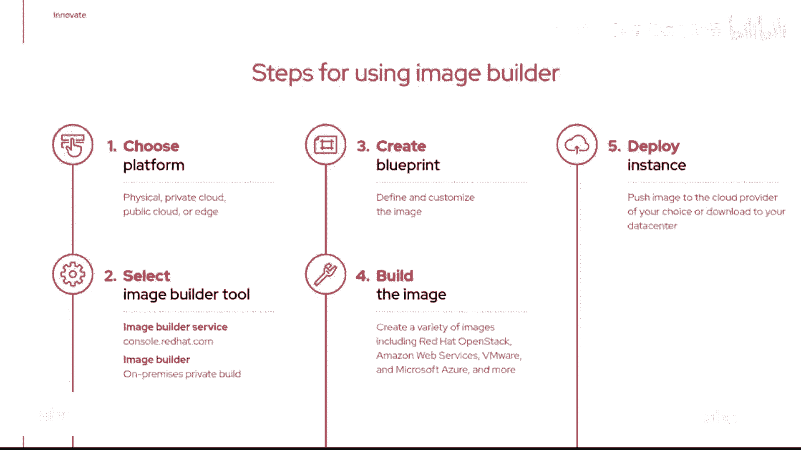

# 红帽企业Linux RHEL 9精通课程：P2：01-01-002 rhcsa-1 - 核心特性与更新概述 🚀

在本节课中，我们将要学习红帽企业Linux 9（RHEL 9）的核心特性与重要更新。我们将从内核升级开始，探讨其对硬件和性能的支持，然后了解RHEL 9在架构支持、边缘计算和工作站应用方面的扩展。最后，我们会深入研究其面向开发者和系统管理的技术特性，例如应用程序流、容器技术和镜像构建服务。

## 内核与硬件支持升级 💻

上一节我们介绍了课程概述，本节中我们来看看RHEL 9在系统核心层面的重大更新。

RHEL 9的内核已更新至版本 **5.14**。内核是操作系统的核心，是应用程序与系统硬件之间的桥梁。

以下是本次内核升级带来的几个关键功能：

*   **硬件支持**：新内核为最新硬件提供了支持，例如改进了 **USB 4** 的支持。
*   **WireGuard VPN**：启用了 **WireGuard** 支持。传统的VPN支持是运行在Linux环境之上的用户空间应用程序，而WireGuard是一个实际的内核模块。这意味着现在可以拥有一个更轻量级、与内核相关的服务，从而提供更好的加密支持和更快的VPN响应时间。在RHEL 9.0中，此功能为技术预览版。
*   **调度改进**：内核5.14改变了课程调度，启用了跨CPU进程的同时多线程。这有望改善大多数工作负载的性能，并有助于减轻一些诸如“幽灵”（Spectre）和“崩溃”（Meltdown）的漏洞影响。

## 架构与产品线扩展 🌐

在了解了内核更新后，我们来看看RHEL 9在支持的平台和产品形态上的扩展。

RHEL 9宣布了对 **ARM** 架构的支持。这意味着现在可以在ARM平台上运行相同的操作系统。RHEL 9官方支持的架构包括传统的 **x86_64**、**Power** 处理器、**IBM Z系列**，以及新增的 **ARM** 架构。

**请注意**：此ARM支持并不适用于树莓派（Raspberry Pi），而是针对边缘计算环境和一些云服务器中使用的ARM架构。

以下是RHEL产品线的扩展：

*   **面向边缘的RHEL**：该版本现在更加专注于边缘计算场景，支持将系统部署在边缘环境，并提供了额外的管理功能，如远程更新、主要版本升级等，实现了零接触配置，并能更好地监控边缘设备的健康状况和执行安全修复。
*   **RHEL工作站版**：红帽推出了面向工作站的RHEL版本。这里的工作站并非指普通Linux桌面，而是指运行高要求、密集型应用的场景，例如建筑动画、视觉特效或科学计算领域。RHEL工作站版提供了完整的10年生命周期支持、经过认证的硬件兼容性、企业级支持以及完整的合作伙伴生态系统。其桌面环境也升级到了 **GNOME 40**。

## 开发者体验与容器技术革新 🔧

上一节我们介绍了产品线的扩展，本节中我们来看看RHEL 9如何简化开发者体验并革新容器技术。

RHEL 9致力于简化开发者体验，确保能跟上技术潮流。

以下是相关的技术特性：

*   **应用程序流（Application Streams）**：延续自RHEL 8，应用程序流将用户空间工具和应用程序与基础操作系统分离。这允许同时安装不同版本的软件（例如Python 3和Python 2），便于环境过渡。RHEL 9已完全迁移至 **Python 3**，不再默认包含Python 2。
*   **开发工具**：提供了最新版本的开发工具。通过 **Red Hat Developer** 网站，开发者可以获取大量学习资源、博客文章和操作指南，内容涵盖容器采用等多种主题。
*   **容器更新**：包含了 **Podman 4.0**，提供了更好的DNS名称解析和改进的IPv6支持。同时，通用基础镜像（UBI）也得到了扩展，有从微型（仅7.5MB）到标准版（约80MB）的不同风味，比RHEL 8中的更小、更智能。
*   **控制组（cgroups）**：默认启用了 **cgroups版本2**。与版本1相比，cgroups v2在资源限制的定义上更加标准化和清晰，使得资源控制更容易理解和管理。

## 系统管理与部署优化 ⚙️

在探讨了开发者工具后，我们最后来关注RHEL 9在系统管理和部署自动化方面的优化。

RHEL 9引入了镜像构建器服务，极大地简化了系统镜像的创建和部署。

以下是镜像构建器服务的关键点：

*   **服务化**：在RHEL 9中，镜像构建器（Image Builder）作为一种服务由红帽提供。用户无需自建基础设施，可以直接利用红帽的服务来创建镜像。
*   **多格式支持**：可以通过该服务构建多种格式的镜像，包括裸机安装镜像、虚拟机镜像和容器镜像。
*   **增强的裸机部署**：镜像构建器得到增强，支持更好的裸机部署。可以创建包含自动化安装过程的启动介质，实现插入即用的自动化部署。
*   **定制文件系统**：支持定制文件系统，允许创建多个安装点，而不仅仅是传统的大型单一根文件系统。

使用镜像构建器服务的流程通常如下：
1.  选择目标平台（如物理机、私有云、公共云或边缘设备）。
2.  通过红帽控制台（console.redhat.com）或本地私有构建环境使用镜像构建器服务。
3.  创建一个蓝图（Blueprint），定义镜像的所有组成元素。
4.  触发构建过程。
5.  下载生成的镜像，或将其直接推送到目标平台。

这项服务的目的是让镜像创建和系统部署更加自动化、简便。

## 总结 📝

本节课中我们一起学习了红帽企业Linux 9的核心更新与特性。我们从**内核升级到5.14**及其带来的新功能（如WireGuard）开始，了解了RHEL 9对**ARM架构**的支持以及**面向边缘**和**工作站**的产品线扩展。接着，我们深入探讨了其**开发者友好特性**，如应用程序流、最新的容器工具（Podman 4.0）和默认启用的cgroups v2。最后，我们介绍了**镜像构建器服务**，它代表了在系统部署自动化方面的重要优化。这些更新共同使RHEL 9成为一个更强大、更灵活且更易于管理的企业级操作系统平台。