# 红帽企业Linux RHEL 9精通课程 — RHCSA与RHCE 2023认证全指南 - P30：04-04-006 Delete - 精选海外教程postcode - BV1j64y1j7Zg

好吧，让我们开始在我们的主目录中创建一个名为“Delete Me”的文件，这样我们就可以看到。

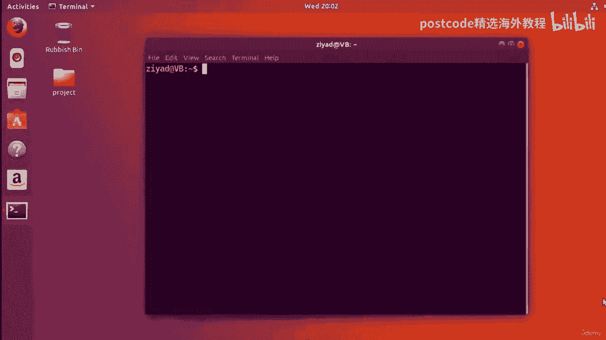

我们已经在我们的主目录中了。通过查看 shell 提示符，我们可以看到波浪线，即上面的波浪线，这意味着我们正处于，外壳提示符。但为了确认，我们可以输入命令打印工作目录，看看我们确实在。

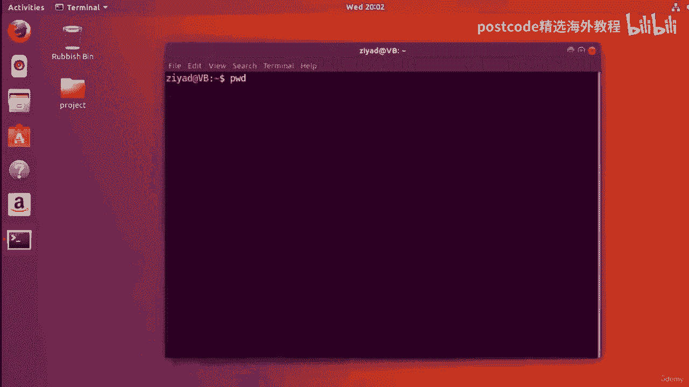

我们的主文件夹。因此，让我们创建一个名为“Delete Me”的文件。我们将使用 touch 命令并输入“delete me”并按 Enter 键。现在，如果我们使用 RLS 命令。

我们将看到确实创建了一个名为“Delete Me”的文件。

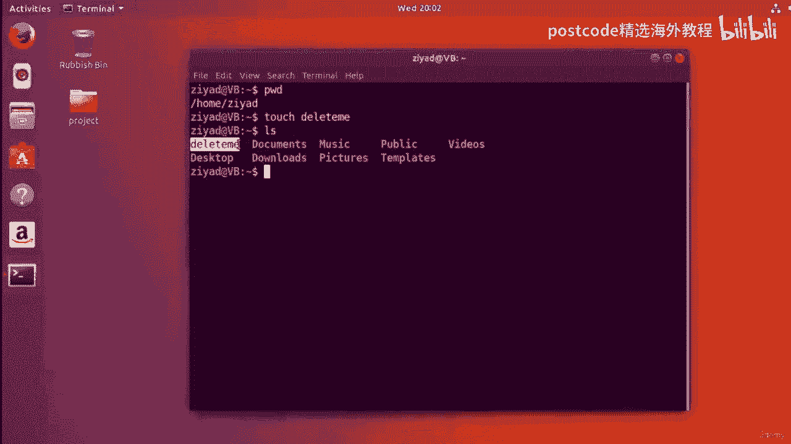

当然，我们可以通过打开图形文件浏览器来确认这一点，我们将看到一个名为“删除”的文件。

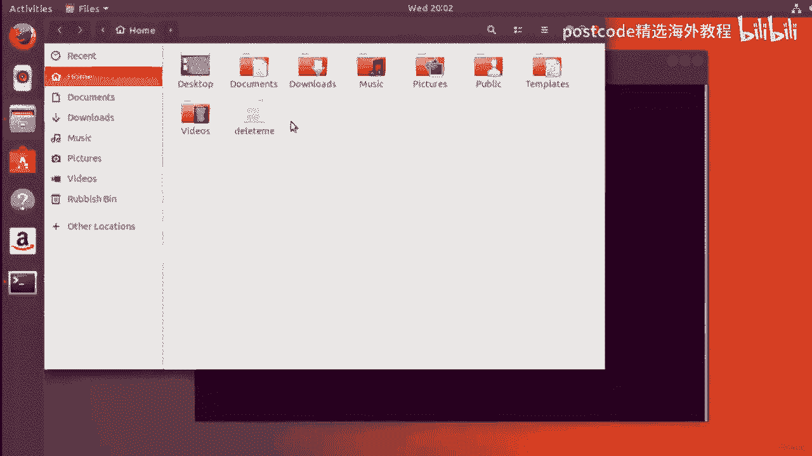

我。好的，到目前为止清理屏幕效果很好。既然我们已经创建了“删除我”，那么我们如何才能真正删除它呢？好的。嗯，实际删除或删除该文件的方法是使用 Ram 命令。现在RAM命令是RAM代表删除。

你所要做的就是给RAM命令一个集合，您实际要删除的文件的路径。这些可以是绝对路径或相对路径。因此，如果我们打开 RAM 命令的主页，它会说您可以给它多个文件。

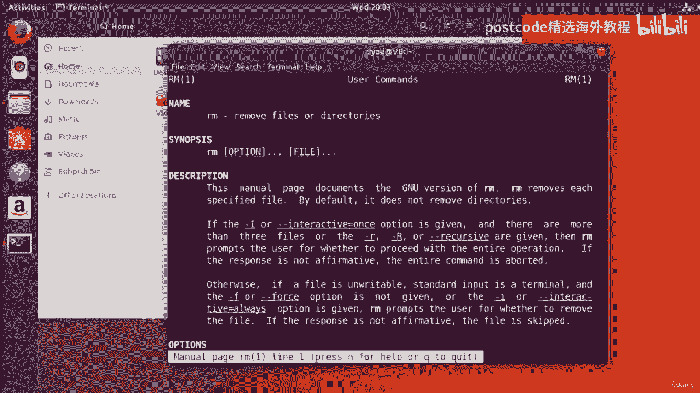

你看，你可以给它一个文件，然后它后面有三个点。从我们对命令行语法或命令行布局的讨论中我们知道这三个点，意味着您可以拥有多个。如果您需要复习一下，请查看上一节中的备忘单。它为您提供了所有信息。

所以让我们继续删除我，这样我就可以了，因为我已经在同一个文件夹中了，我可以，使用像 ram 那样的相对路径删除我，当我按 Enter 键时，我们会看到删除我确实，已被删除。

这次我可以在我们的文档文件夹中创建删除我。好的。因此，如果我们查看文档文件夹，我们会看到删除我已在此时创建，命令行。我只是在主文件夹中，所以如果我尝试执行 RAM 删除我，那将不起作用，因为没有。

比如在这个目录中删除我。所以删除它。我必须做ram文件斜线删除我。所以我必须给它相对于我们现在所在位置的路径，即主文件夹。

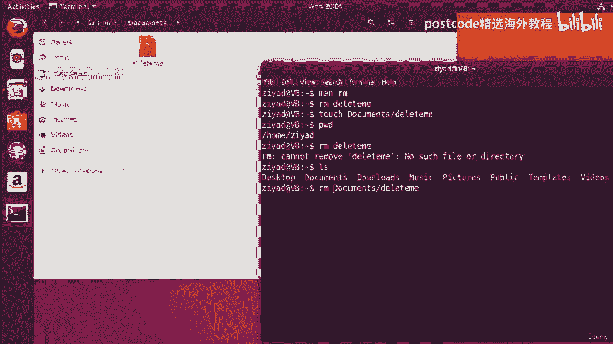

因此，我在主文件夹中要删除我，我必须先处理文档，然后再删除我。

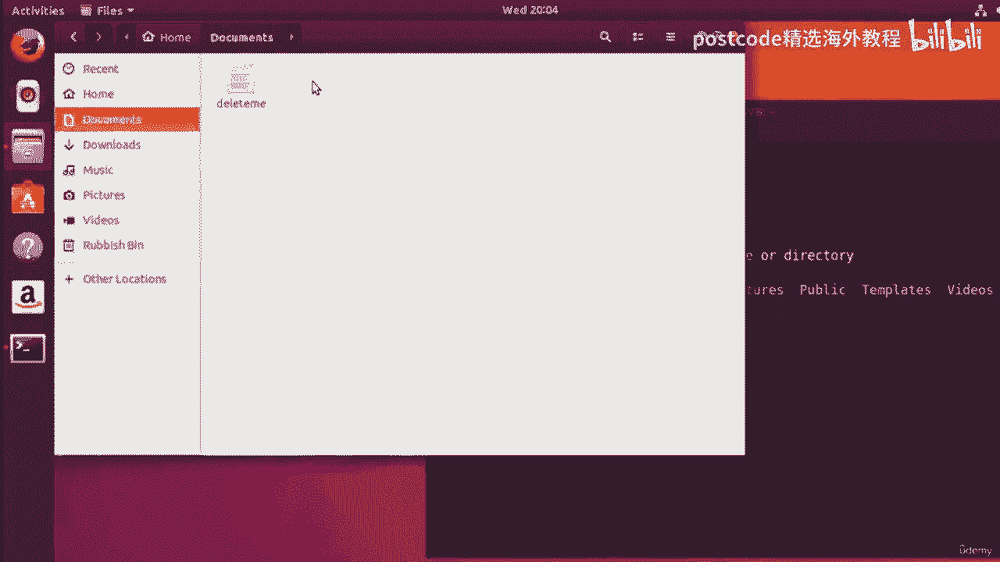

好的。所以文档斜线，删除我，然后我按 Enter 键，然后它就会被删除，你可以拥有多个，一。因此，如果我继续创建一个名为 file one dot txt 的文件，该文件位于我们的主目录中。

我在我们的文档中创建了一个名为文件二的文件。因此，在我们的文档中归档两点 txt，并在我们的下载中创建一个名为文件三点 txt 的文件。

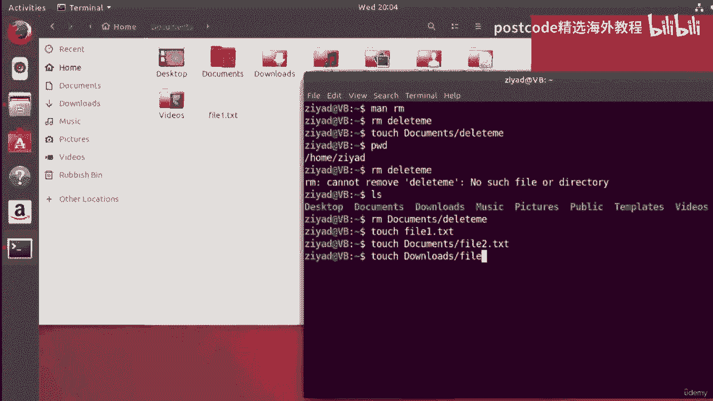

因此，我在主文件夹中保存了一份，在文档中保存了一份，在下载中保存了一份。

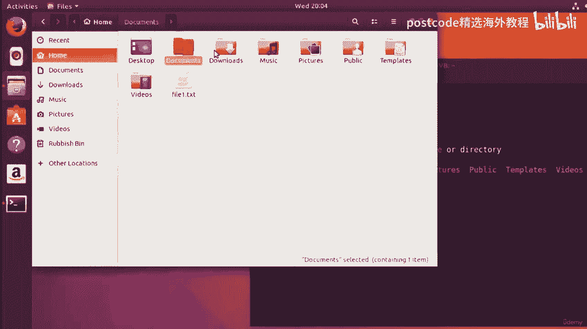

所以删除所有这些。我可以一个接一个地输入它们。所以我做了一份txt文件。我不需要做任何事情，因为那样就可以了，因为我已经在主目录中了。与它记录斜杠文件二和下载斜杠文件三的文件夹相同。

如果我按 Enter 键，您会看到文件消失了。

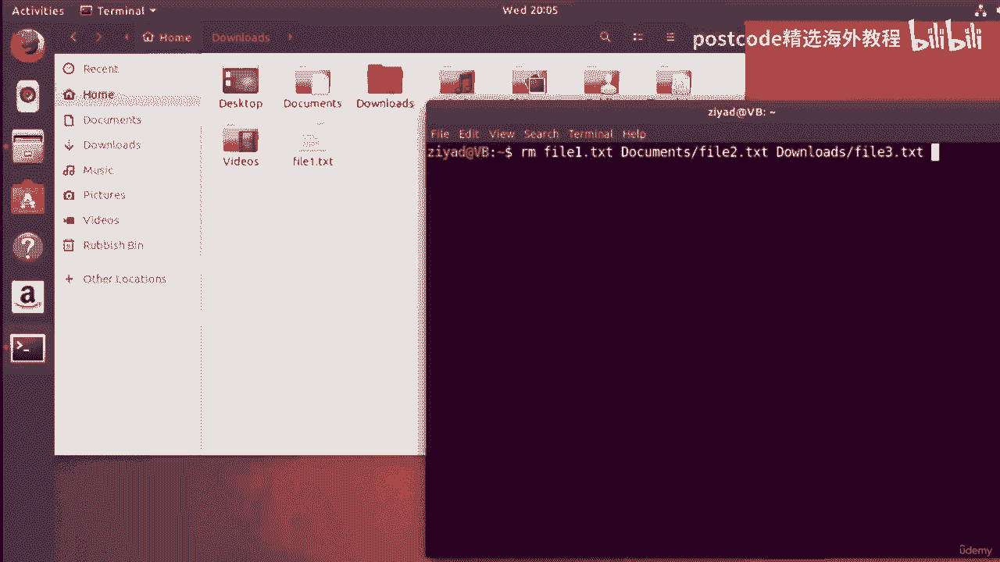

文件二已从文档中消失，文件三已从下载中消失。

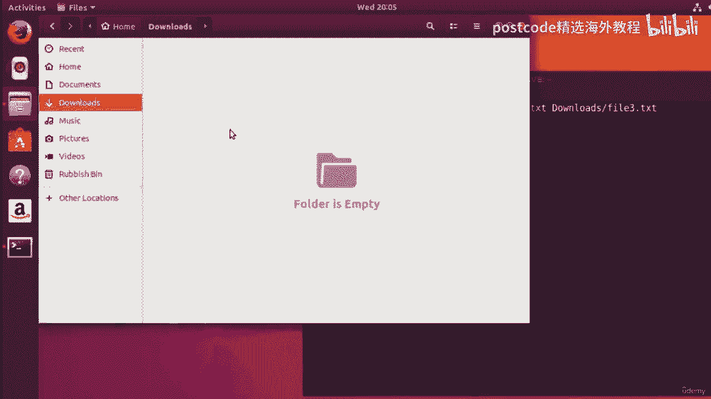

所以M命令是一个非常简单的用于文件的命令。只需将其视为触摸命令的相反命令即可。因此，如果您想创建一个文件，只需触摸文件一即可。如果你想删除它 REM 到 REM 文件一，它就会像这样工作。

现在我们已经了解了如何以基本方式使用 REM 命令，让我们更进一步并使用，它与通配符一起。现在，通配符确实可以提升你的命令的威力。那么让我们看看吧。了解我们如何使用 REM 命令执行此操作。

让我们创建一些新文件。让我们创建一个文件一点 txt，让我们创建文件两点 pmg 和文件三点 jpg。

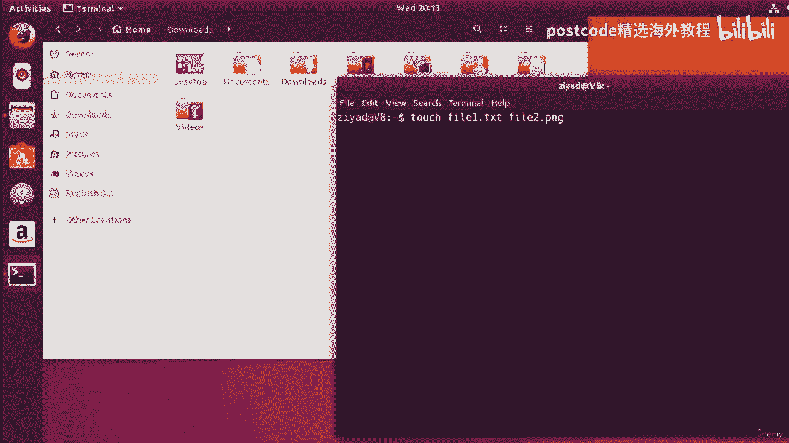

因此，当我按 Enter 时，您会看到所有这三个都已在我们的主文件夹中创建。好的，现在我们如何删除每一个以 。txt 结尾的内容呢？所以这实际上只是现在。让我们再创建一个txt 文件。好的。

这样我们就得到了以 txt 结尾的文件，还有一个以 PNG 结尾的文件和一个以 jpg 结尾的文件。我们如何删除它们？他们就是最终成为txt的人。嗯，首先，我们可以手动完成。

我们可以说我们的 RM 文件 txt 和文件夹 TC 可以工作，但我想要更聪明的，解决方案比那。我想说删除所有以 txt 结尾的文件。现在我们这样做的方法是给命令一个模式，任何与该模式匹配的东西都会。

作为命令行参数添加到它。因此，如果我要使用的模式是这个星点 txt。

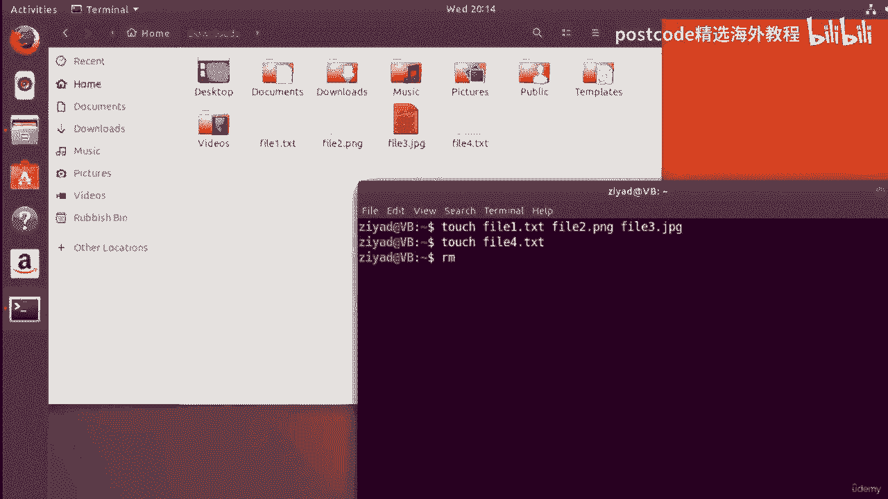

现在让我们来分解一下。所以星星意味着任何事情。任何东西都可以去那里。所以这整件事就是我们的模式。好吧，星星意味着什么。然后点txt。所以呢？这。手段是任何与该模式匹配的东西。

因为它所要做的就是以文本结尾。

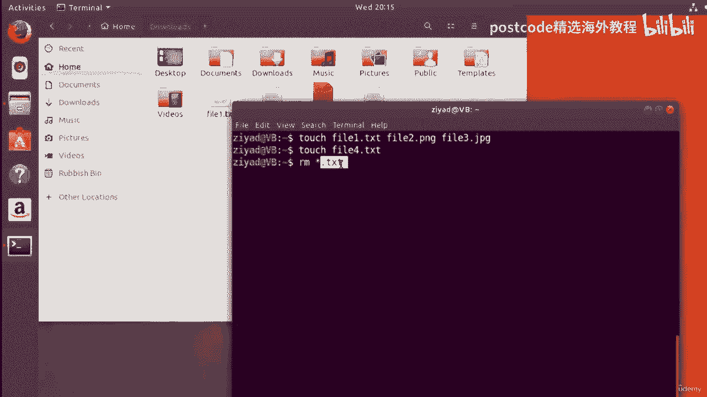

所以基本上这意味着删除所有以点文本结尾的内容，然后我们按 Enter 键。您会看到文件一和文件四已被删除，因为它们以文本结尾。好的。那么让我们尝试看看是否可以制作一些其他文件。

让我们再次制作文件一点txt并归档txt。让我们恢复这些文件，然后创建一些文件。好的，让我们创建一些名为 qibla dot txt 的文件，然后将其称为 qibla one 。

然后将其称为 qibla Two dot png，和朝拜三点 jpg。所以我们有一些以朝拜开头的。还有一些以单词文件开头。好的。那么我们该如何删除那些以word文件开头的文件呢？好吧。

我们这样做的方法当然是再次使用 item 命令，因为我们需要，要删除，那么我们需要给它另一个模式。因此，让我们考虑如何创建一个可以匹配任何内容的模式，只要它以，单词文件？好吧。

我们可以这样做的方法是我们可以取出单词文件，然后放一个星号，因为这意味着，只要它以 file 开头，后面有任何内容，它就会匹配。所以它所要做的就是从单词文件开始。如果我按 Enter 键。

我们会看到文件一、二、三和四。与文件扩展名或其他任何内容无关。只要它们以文件开头，它们就被删除了。但所有的名字都保留在那里。让我们再次创建文件一、二、三和四。因此。

我们将创建触摸文件一txt、二点png文件、三点jpg文件和txt文件，让他们再次回来。好的。现在我们要删除所有包含数字 2 的文件。好的。那么我们该怎么做呢？好吧，我们可能会说，好吧，让我们删除它。

从什么开始并不重要，但必须有两个在那里，并且什么都不重要，它结束于。所以我们到了。我们说它可以有任何东西，然后是数字二，然后是任何东西。因此，如果我们这样做，我们会看到问题二中的文件二已被删除，但所有。

其他人都还好。去掉那些以 jpg 结尾的怎么样？好吧，要做到这一点，你只需将我们的 m 结尾放在 jpg 中即可。我按回车键文件三点jpg，三个已被删除，但所有其他以txt结尾的都是，还在那儿。

删除那些怎么样？我将把所有以 txt 结尾的内容按回车键删除，它们也都被删除了。所以你可以在这里看到通配符如何真正使你的命令变得更加强大和，更具体。我还想给你看一个。我们就到这里上去吧。我想。

我们已经恢复了我们的文件，让我们将 ash blam ash 文件恢复为 dot png。是的。还有精美的三点 jpg。现在，如果我们想去掉那些有两三个的东西怎么办？好吧，要做到这一点。

还记得我们是如何摆脱其中有两个的吗？正确的。我们说过它可以从任何东西开始，然后有两个，然后结束任何东西。好吧，现在我们想给它一些选择。这就是方括号的用武之地。所以如果我说，好吧，类似的事情。

那就是说它可以从任何东西开始，然后要么，两个或三个，然后以任何方式结束。

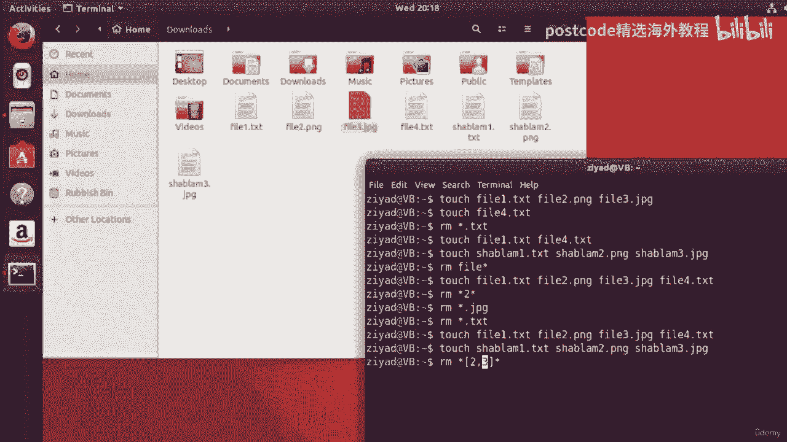

所以这应该摆脱文件二、文件三以及问题二和问题三。

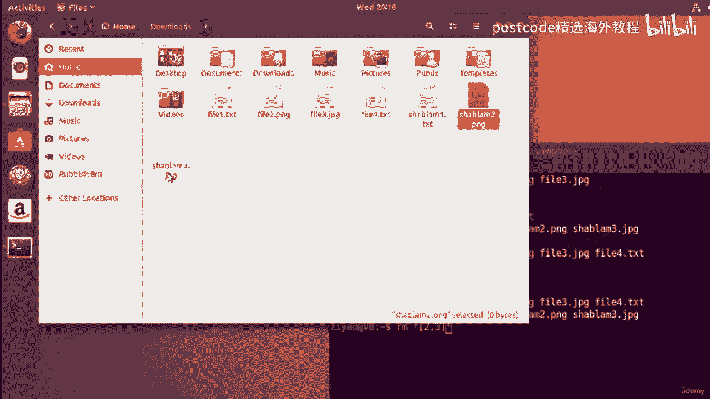

那么，如果我按回车键，达达文件二和文件三以及问题二和责备三是否应该被删除？因此，通配符是令人难以置信的工具，它确实可以让您控制使用时发生的情况，命令和任何与此模式匹配的内容都将作为命令行参数传递给命令。

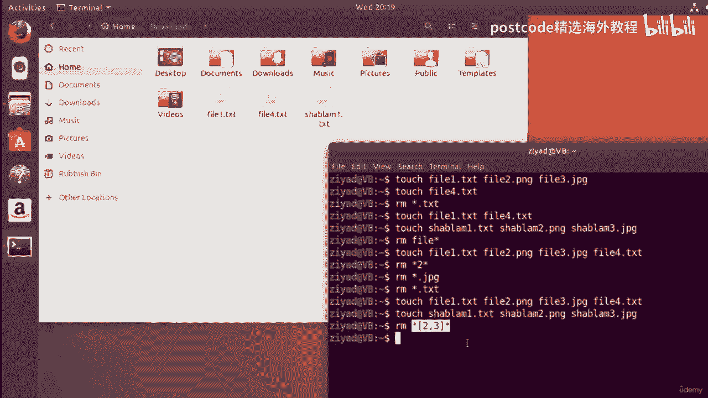

您使用通配符的目的。所以这有点通配符的作用。好的。因此，让我们首先在主目录中创建一个名为 Dell 文件夹的文件夹。因此，如果我使用 mkdir 命令并输入 del 文件夹。

我们将看到我们在我们的文件夹中创建了一个新文件夹，主目录称为 del 文件夹。好的，那么让我们将其删除。好的。现在我们实际上要做的就是再次使用 m 命令来删除它。因此。

如果我使用 rme 并使用 del 文件夹并按 Enter 键。唔。我们实际上得到了一个错误。现在，这是因为，是的，我们将使用 RGM 命令，但为了让该命令删除文件夹。

我们需要为 rm 命令提供 r 选项。现在，R 选项代表递归或递归地。现在，如果您递归地删除某些内容，则意味着您要删除该内容以及所有内容，其他在里面。因此，如果我们现在尝试 M 斜杠 R。

然后 del 文件夹并按 Enter 键，我们就会看到。现在 del 文件夹确实被删除了。那么让我们再做一次吧。再做一次。让我们创建 Del 文件夹，并在其中创建更多文件夹。

所以我们将为此使用大括号扩展。现在我们可以做make make目录del文件夹。在里面我们将创建三个文件夹，分别称为“删除我一”、“二”和“三”。因此，如果我按 Enter 并查看 Del 文件夹。

我们可以看到我们已删除我一个，删除我两个，并删除我三个。这就是我们所做的工作，首先它删除了 Del 文件夹中的一个，然后它可能会删除，我两。然后它让我删除了三个。这又是大括号扩展。因此。

让我们在每个文件中创建一些文件。所以如果我们触摸del文件夹，删除我，删除我，一，二和三，然后在里面，使，文件一、二、三。

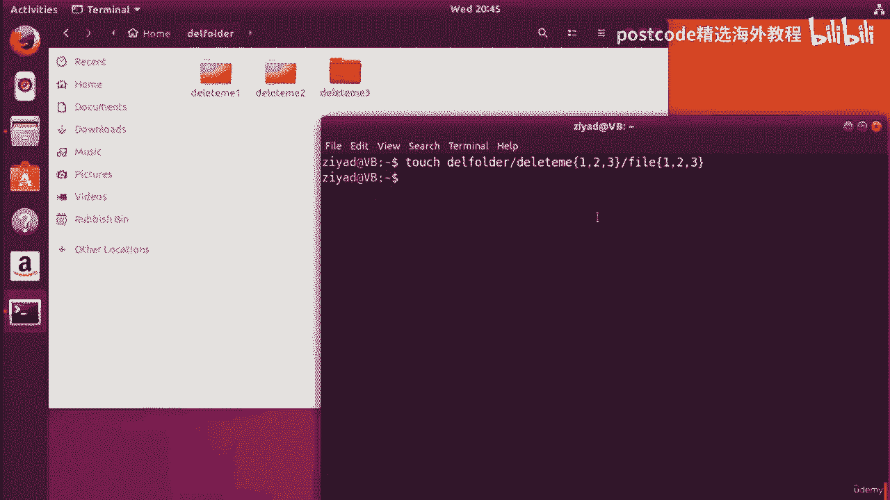

现在，如果我们看一下，我们可以看到并删除我的一个。我们有文件一、二和三，删除我两个文件一、二和三，然后删除我三。我们有文件一、文件二和文件三。所以现在如果我们，如果我们继续，如果我们只是看看。

我们这里有 Del 文件夹，我们有 Del 文件夹。

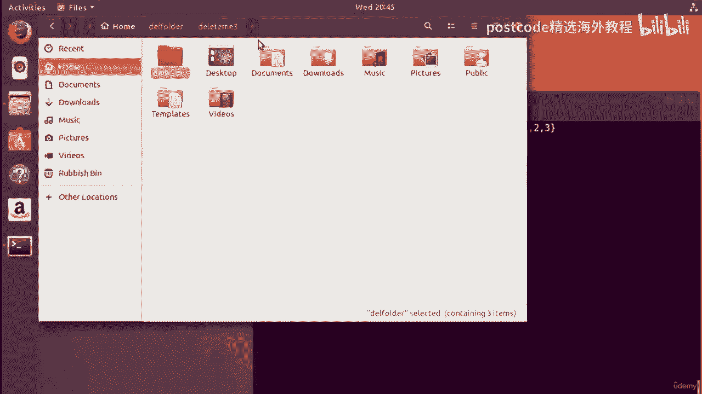

在我们的主目录中。现在，如果我们使用 M 和选项来删除 del 文件夹，请记住递归删除某些内容，意味着删除它以及其中的其他所有内容。因此，如果我将 M 与 R 选项一起使用。

并给它 del 文件夹并按 Enter 键，我们就会看到。del 文件夹确实已被删除，其中的其他所有内容也已被删除。现在，您可能会注意到的一件事是 rm 命令，当它执行此操作时，实际上并没有给出。

我们任何警告。它只是继续删除 DEL 文件夹中的所有内容。现在，正因为如此，我们的 m dash rm 和 r 选项是一个非常强大的命令，应该处理，非常小心，尤其是当您也开始使用星号通配符时。

所有事情都可能出错，你会发现自己只是删除所有内容而无法获取，你的文件回来了，这是悲伤、悲伤的时刻。举例来说，如果我现在就这样做，如果我只是删除我们系统上所有内容上的内容，现在，我不打算这样做。

我是在开玩笑。因此，让 R 命令更安全的一种方法实际上是为其提供 AI 选项。所以 AI 选项代表交互式，这将使 rm 命令交互式地询问您是否，是否删除每个文件。现在，目前我们没有 del 文件夹了。

因此，要创建 del 文件夹并同时删除一个、两个和三个文件夹，我将使用 mkdir 命令。给它 p 选项，它允许您创建整个路径并执行 delta 并告诉它。创建删除我一、二、三。因此，如果我这样做。

实际上不会删除两个抱歉的 del 文件夹，那么如果我这样做，我会在里面得到 del 文件夹，删我一，删我二，删我三。现在有点酷，让我们在里面创建文件。所以 del 文件夹正斜杠删除我一、二和三。

我们将创建文件一、二和，每个里面有三个。

在每一个里面我们都拿回了我们的文件。所以我们就到了。

根本没花太长时间。我们已经拿回我们的文件了。顺便说一句，您能看出这比指向和单击快多少吗？我们创建了所有这些文件，甚至不需要输入正确创建它们的文件夹，从我们的主目录。所以，太酷了。因此。

现在如果我们尝试再次删除所有内容，请尝试通过向命令提供 r 来删除 del 文件夹，和我的选择。无论您按哪个顺序执行都没有关系。所以我们给它del文件夹。我们会看到，现在它正在请求允许我们实际删除内容。

所以它说我可以进入 del 文件夹吗？我们来说说吧。是的，它现在会说我可以删除我的一个吗？假设是，我也可以删除文件吗？是的你可以。我可以删除文件三吗？是的你可以。我可以删除里面的文件一吗？

给我删掉一张吧，是的你可以。我可以删除该目录吗？给我删掉一张吧，是的你可以。我可以删除任意三个吗？你看，它并不是特别按照任何顺序执行，而是在执行之前询问你。

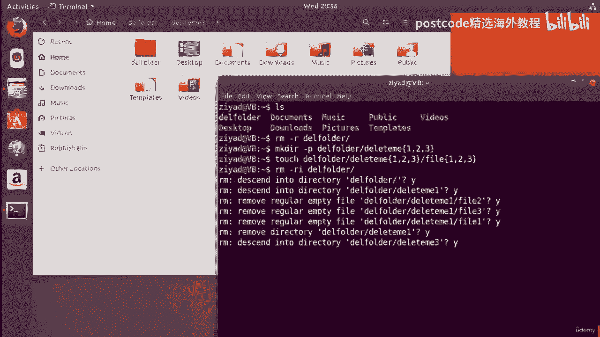

好吧，我们就说是吧。你可以删除它。你可以删除它，你可以删除它。现在我们离开吧。让我们把文件二留在里面。把我也删了，这样你就可以删我三个了。要把我删掉两个，不，不要删除文件二。是的。删除文件三。是的。

删除文件一。不，不要删除整个文件夹。不，不要删除戴尔文件夹，仅此而已。因此，如果我们查看 Dell 文件夹（即 C），删除我的两个文件夹，并留下两个文件。好的。所以这很酷。正确的。

您可以控制 r 命令删除的内容，但这有点乏味，对吧？

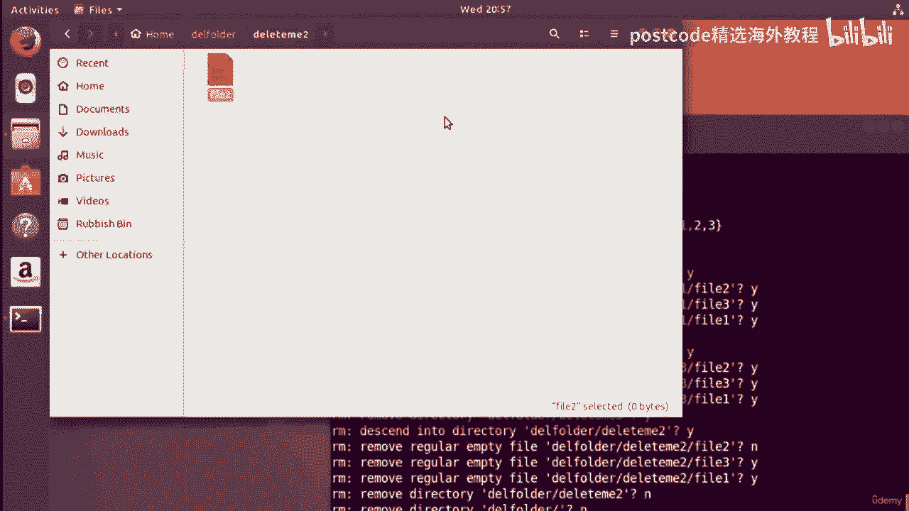

每次都说“是”和“否”，如果您有很多文件，那真的会很庞大，麻烦。幸运的是，还有另一个命令专门用于仅删除空目录，现在因为此命令仅删除空目录。这意味着您可以告诉它删除所有内容。它只会删除实际上为空的文件夹。

这意味着您永远不会意外删除文件。该命令称为 MDR，即删除目录命令。因此，要首先查看删除目录命令的作用，让我们继续删除戴尔内部的所有内容，文件夹。因此，递归删除 Dell 文件夹即可。

Dell 文件夹已被删除。现在让我们继续创建一些文件夹。因此，我们将使用 mkdir 和 P 选项来创建一个我们称之为 Dell 的文件夹，然后创建一个文件夹，1 至 3。这是另一种方法。顺便说一下。

你不必输入一、逗号二、逗号三，你可以只输入 1。3。

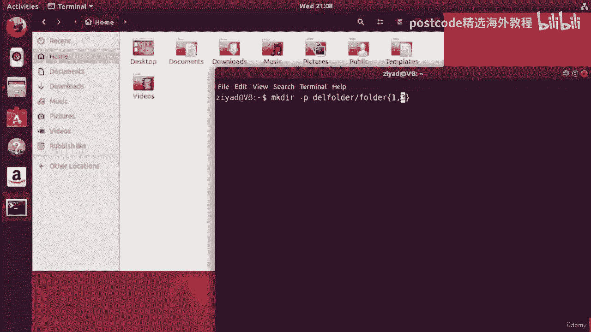

如果我们查看戴尔文件夹，我们会看到文件夹一、文件夹二和文件夹三。

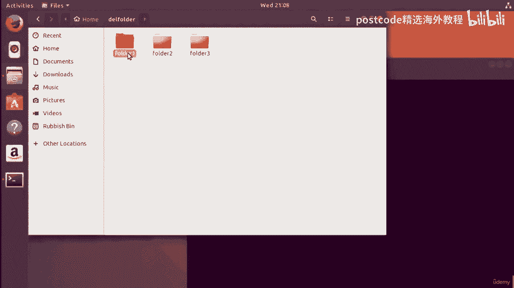

好的，让我们将十个文件夹放入文件夹一和文件夹二中，但不要放在文件夹一中，不要放在文件夹中，三。这是两个触摸戴尔文件夹一、二，然后将文件 1 到 10 点 txt 放入其中。因此。

如果我们查看文件夹一的内部，我们现在有十个文本文件。

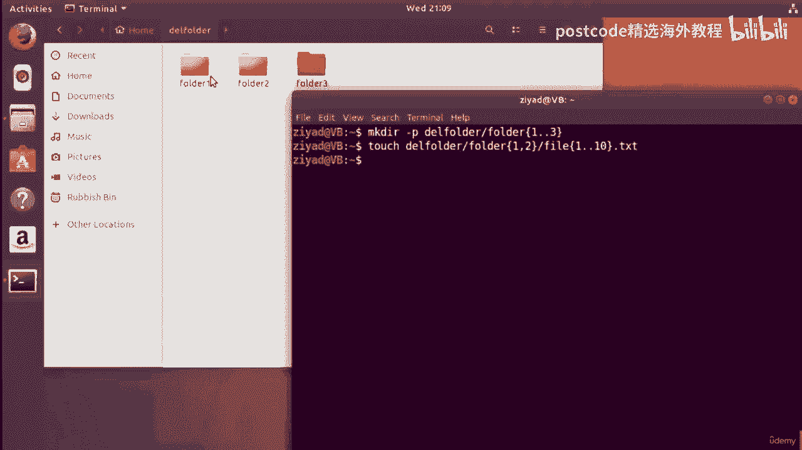

我们将查看文件夹二的内部，我们有十个文本文件，但在文件夹三中我们没有任何文本文件。

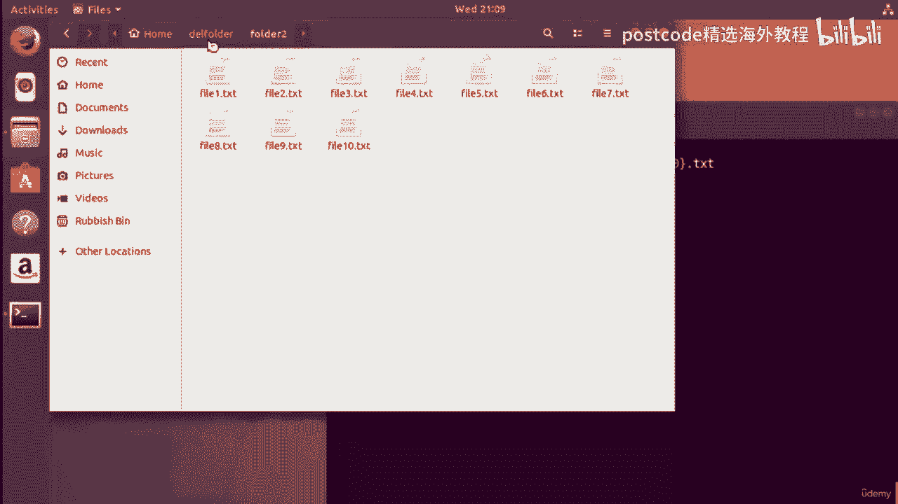

好的。现在我们在戴尔文件夹中已经有了三个文件夹，文件夹一和文件夹中有十个文件，但文件夹三完全是空的。现在，如果我尝试删除目录并说删除目录戴尔文件夹，请删除所有内容。好的。

我们这里说的是删除Dell文件夹内的所有内容，删除里面的空文件夹，基本上是戴尔文件夹。所以如果我这样做，我们会看到的。无法删除文件夹一，因为该目录不为空。

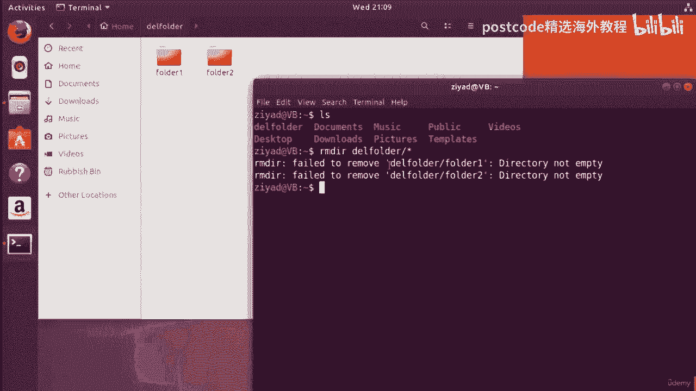

删除文件夹二失败，因为director不为空，但文件夹三确实已被删除。

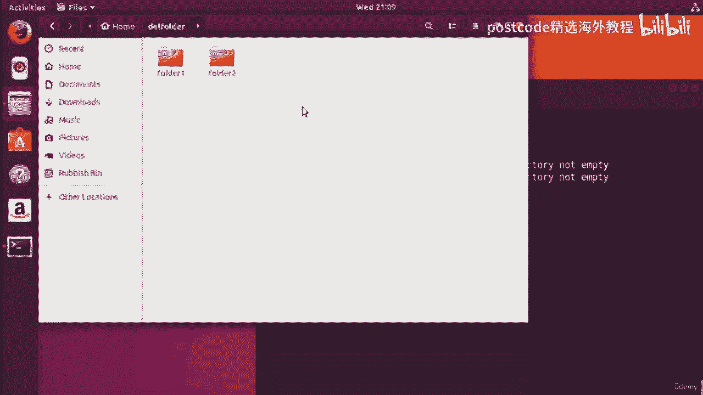

已删除。所以请您知道，如果我们只是删除 Dell 文件夹的目录而没有，放置星星。所以你看我们这里有星号通配符。如果我们刚刚删除了 Dell 文件夹，shell 会提示但 Dell 文件夹不为空。

我怎样才能删除它？但我们所做的是删除戴尔文件夹中的所有空文件夹。好的。所以我们必须要有明星才能让这项工作成功。所以这只是需要记住的事情。

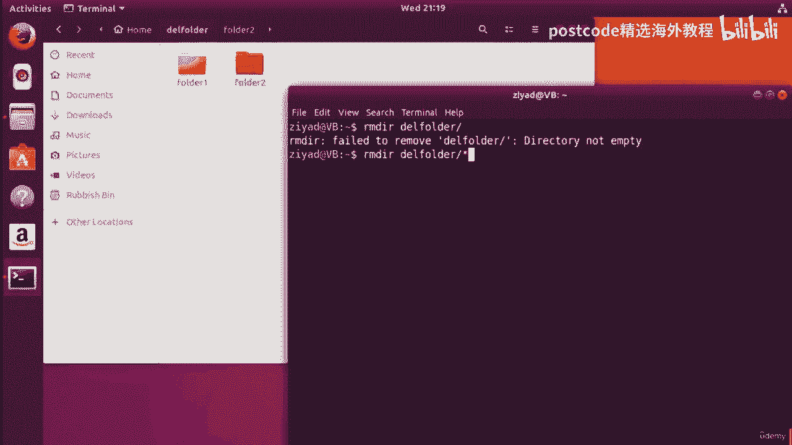

好的。因此，作为最后一个挑战，在上一个视频中，我们创建了一个项目文件夹，其中包含一大堆。

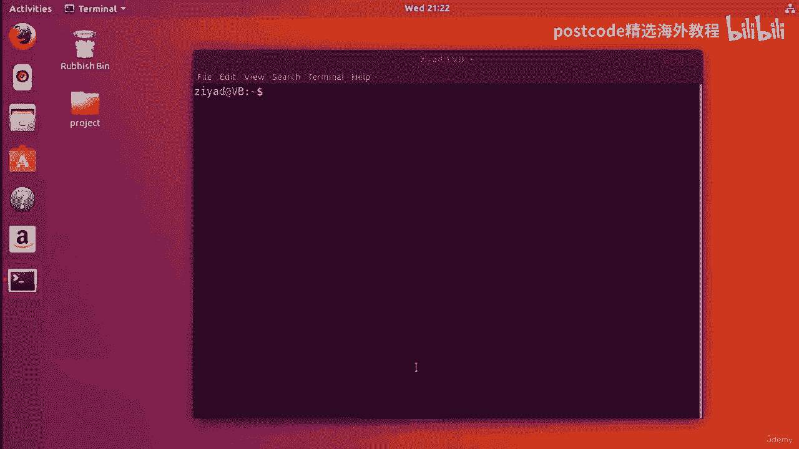

其他文件夹里面有无数的文件。好吧，你一定记得最近几个视频中的这一点。现在，我希望你尝试删除所有这些文件夹和目录，然后，文件和东西在一个命令中。这就是你的挑战？你，这就是你的挑战。

您必须尝试删除整个项目文件夹以及其中的所有内容。一个命令中包含所有数千个文件。所以现在暂停视频，看看你是否能弄清楚。弄清楚如何去做。然后回来看看你做得怎么样。你做到了吗？如果是这样，干得好。

你学得超级非常快。我是这样做的。好的。现在，该文件夹名为 Project，对吗？它在桌面上。那么我们就转移到那里吧。这就是所谓的项目。所以我们想删除所有内容。所以我们不想使用 RMD 命令。

因为它只会删除空目录。我们想使用 rm 命令，因为我们想删除其中包含内容的目录。现在我们要删除项目文件夹及其中的所有内容。所以我们需要递归删除。为此，我们将使用 R 选项。

并将它们放在一起基本上意味着我们只需，递归删除项目文件夹。或者，如果我在像这样的主目录中，我会递归地删除桌面斜线项目，给出该文件夹的路径。当我像变魔术一样按回车键时，无论文件夹有多少，数千个文件都已。

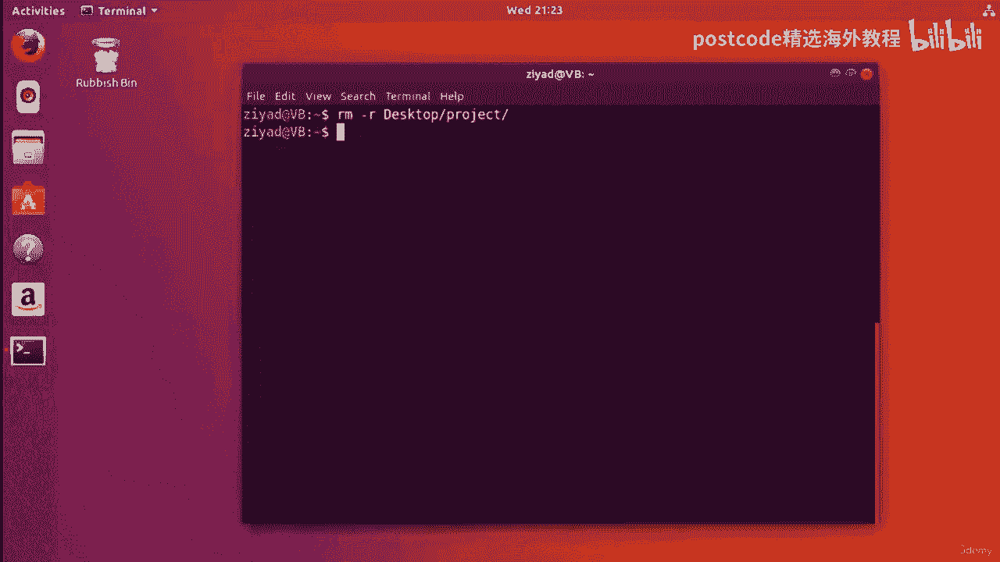