# RHEL 9 精通课程：P30：04-04-006 删除文件与目录 🗑️

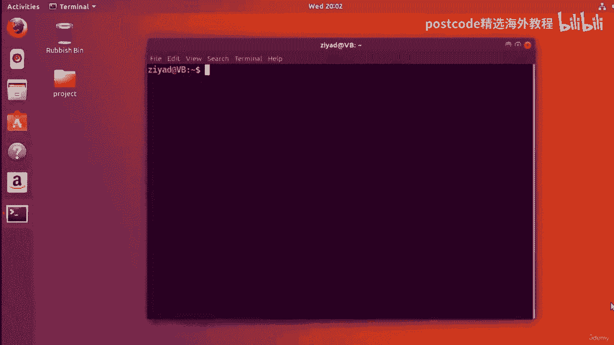

在本节课中，我们将学习如何在 Linux 系统中删除文件和目录。我们将从基本的删除命令开始，逐步深入到使用通配符进行模式匹配删除，以及安全地删除包含内容的目录。

## 创建用于练习的文件

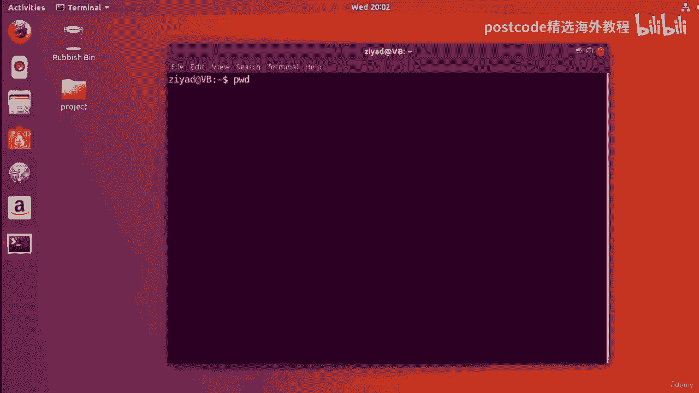

首先，我们需要创建一个用于练习删除操作的文件。让我们在主目录中创建一个名为 `Delete Me` 的文件。

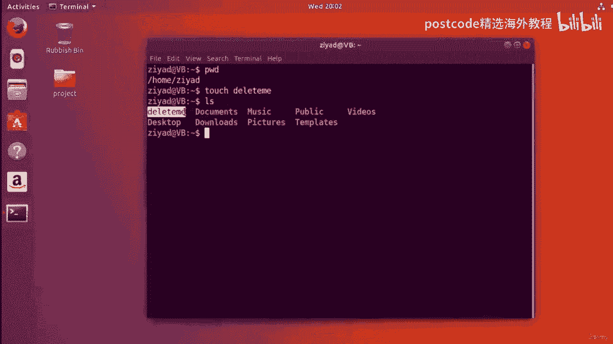

我们已经处于主目录中。可以通过查看 Shell 提示符中的波浪线 `~` 来确认，或者使用 `pwd` 命令打印当前工作目录。

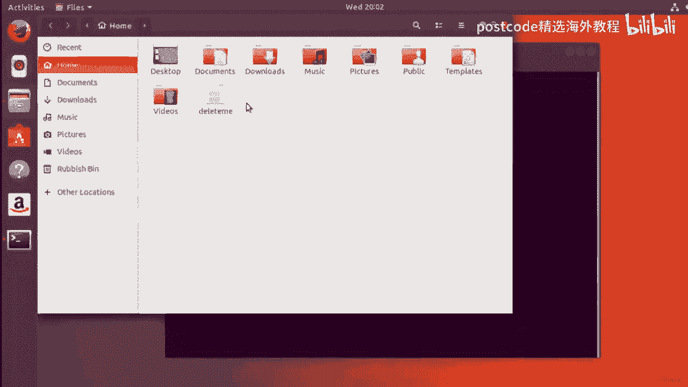

```bash
pwd
```

确认在主目录后，使用 `touch` 命令创建文件。

```bash
touch "Delete Me"
```

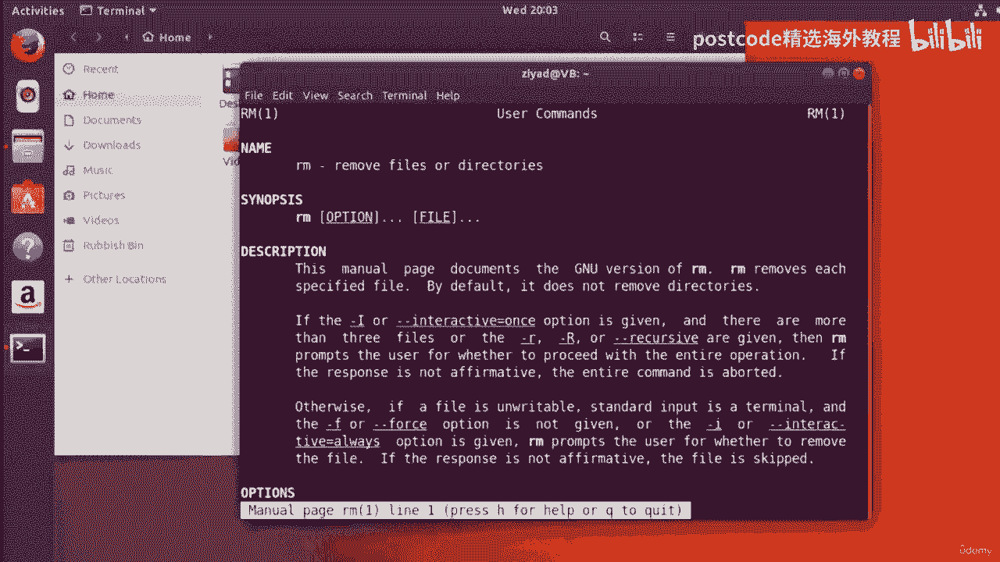

使用 `ls` 命令可以确认文件已成功创建。

```bash
ls
```

当然，我们也可以通过图形文件管理器来查看这个名为“Delete Me”的文件。

## 使用 `rm` 命令删除文件

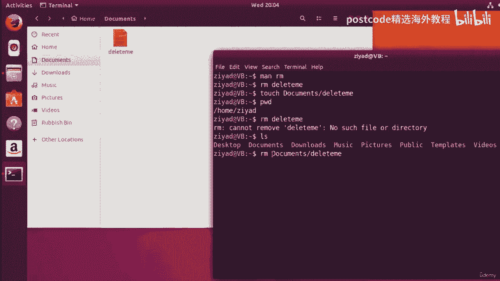

既然我们已经创建了“Delete Me”文件，那么如何删除它呢？删除或移除文件的方法是使用 `rm` 命令。`rm` 代表移除（remove）。

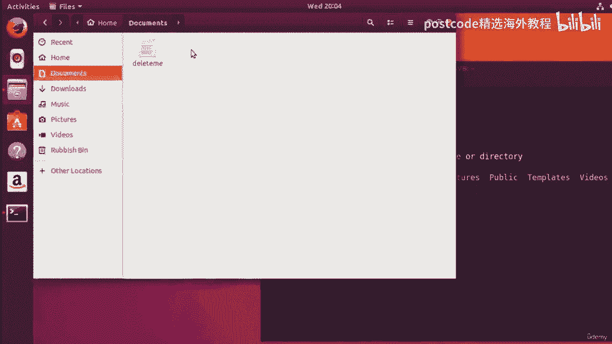

你需要为 `rm` 命令提供一个或多个要删除的文件的路径，可以是绝对路径或相对路径。查看 `rm` 命令的手册页（`man rm`）可以看到，它可以接受多个文件参数。

因为我们已经在文件所在的目录中，所以可以使用相对路径来删除它。

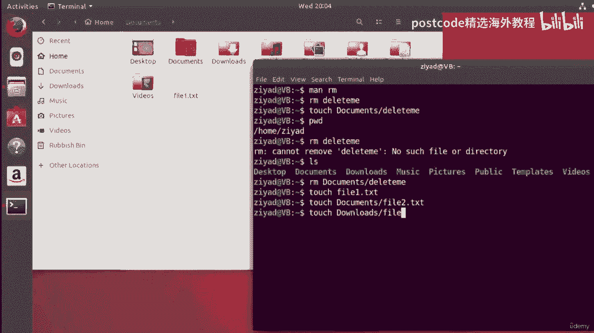

```bash
rm "Delete Me"
```

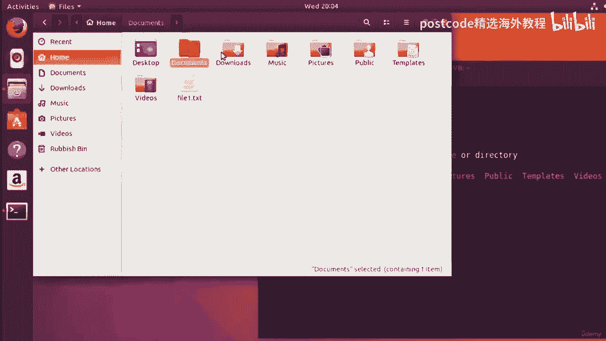

执行后，“Delete Me”文件就被删除了。

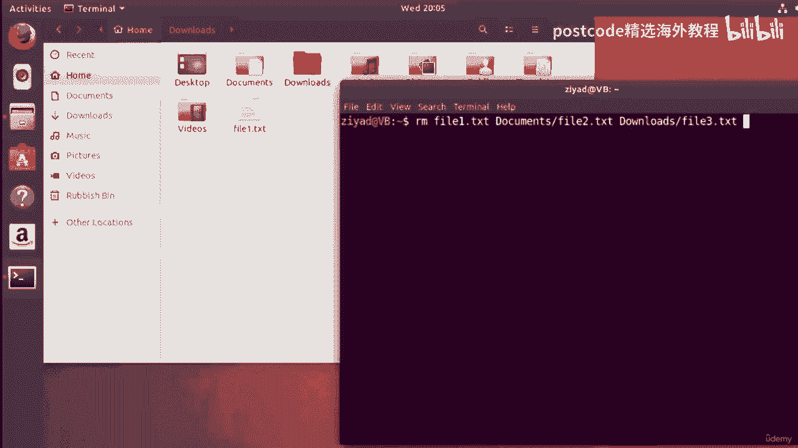

接下来，我们在 `Documents` 文件夹中创建一个“Delete Me”文件。

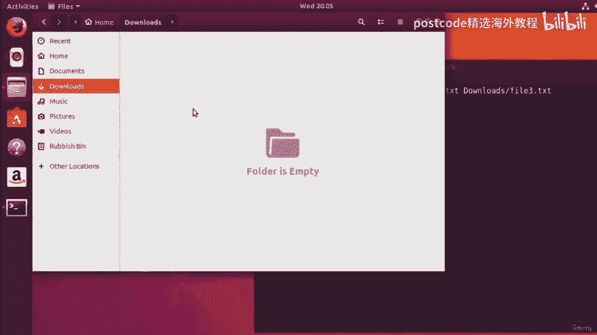

```bash
touch Documents/"Delete Me"
```

现在，如果我们尝试在主目录直接执行 `rm "Delete Me"`，会失败，因为当前目录下没有这个文件。要删除它，必须提供相对于当前位置的路径。

```bash
rm Documents/"Delete Me"
```

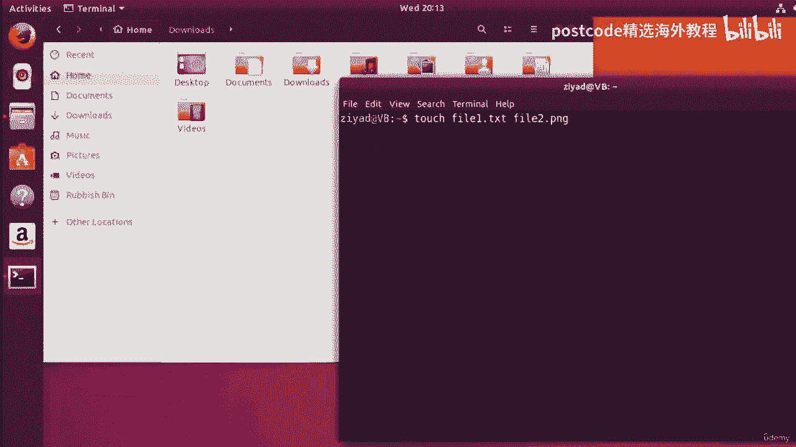

`rm` 命令可以同时删除多个文件。例如，我们在不同位置创建三个文件：

```bash
touch file1.txt
touch Documents/file2.txt
touch Downloads/file3.txt
```

要一次性删除这三个文件，可以依次列出它们的路径。

```bash
rm file1.txt Documents/file2.txt Downloads/file3.txt
```

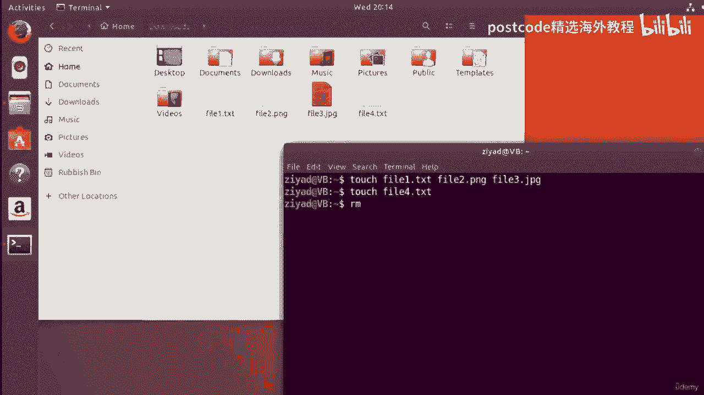

执行后，这三个文件都会消失。`rm` 命令非常简单，可以看作是 `touch` 命令的反向操作：`touch` 创建文件，`rm` 删除文件。

## 使用通配符进行模式删除

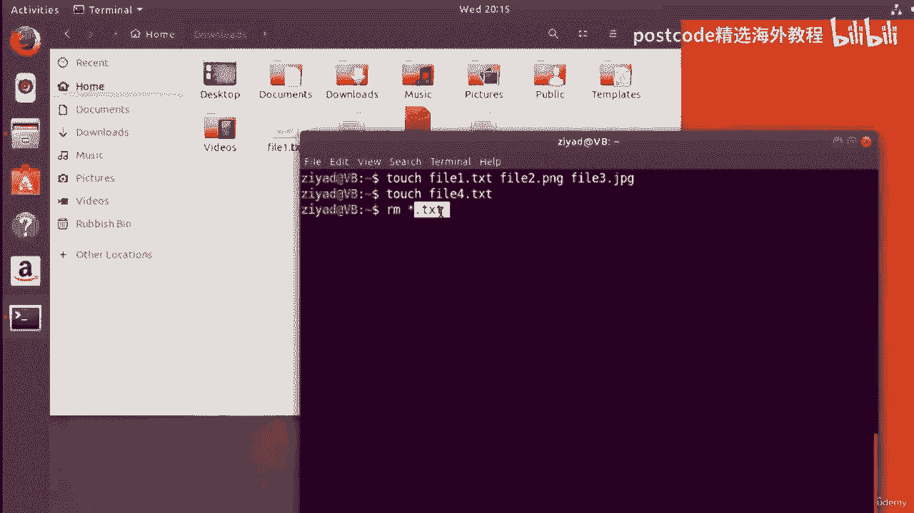

上一节我们介绍了 `rm` 命令的基本用法，本节我们来看看如何利用通配符来提升命令的威力。通配符允许我们根据模式来匹配和删除文件。

首先，创建一些具有不同扩展名的新文件。

```bash
touch file1.txt file2.png file3.jpg
```

现在，我们如何删除所有以 `.txt` 结尾的文件呢？让我们再创建一个 `.txt` 文件以便演示。

```bash
touch file4.txt
```

现在我们有以 `.txt`、`.png`、`.jpg` 结尾的文件。要删除所有 `.txt` 文件，我们可以使用模式 `*.txt`。

*   `*` 星号代表“任何字符”。
*   `.txt` 代表文件扩展名。
*   因此 `*.txt` 匹配所有以 `.txt` 结尾的文件。

```bash
rm *.txt
```

执行后，`file1.txt` 和 `file4.txt` 被删除。

让我们恢复这些文件，并创建一些新文件来演示更复杂的模式。

```bash
touch file1.txt file2.txt
touch qibla.txt qibla1.png qibla2.jpg
```

现在，如何删除所有以“file”开头的文件？我们可以使用模式 `file*`。

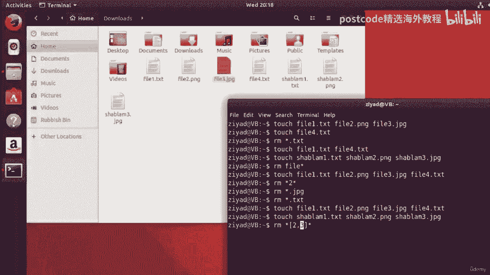

```bash
rm file*
```

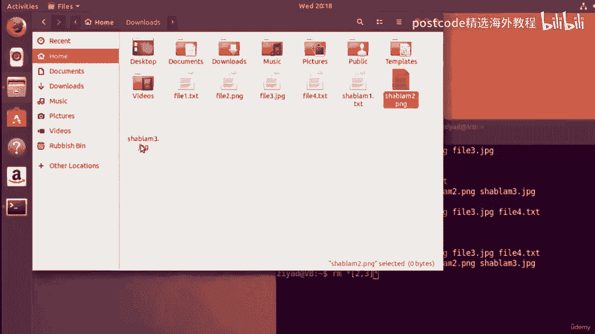

这个命令会删除所有以“file”开头的文件，无论其扩展名是什么。

再次创建文件一、二、三、四。

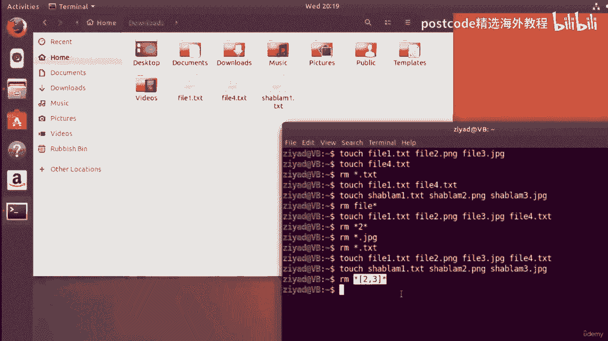

```bash
touch file1.txt file2.png file3.jpg file4.txt
```

现在，删除所有文件名中包含数字“2”的文件。模式 `*2*` 表示：开头可以是任何字符，中间必须有“2”，结尾也可以是任何字符。

```bash
rm *2*
```

执行后，`file2.png` 被删除。

删除所有以 `.jpg` 结尾的文件。

```bash
rm *.jpg
```

删除所有以 `.txt` 结尾的文件。

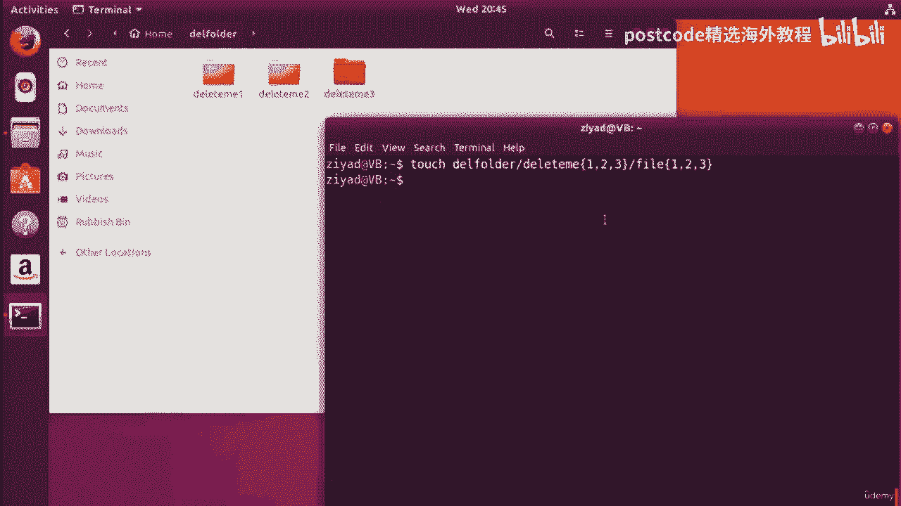

```bash
rm *.txt
```

通配符让命令变得更强大和精确。我们还可以使用方括号 `[]` 来指定一个字符集。例如，恢复文件后，我们想删除文件名中包含数字“2”或“3”的文件。

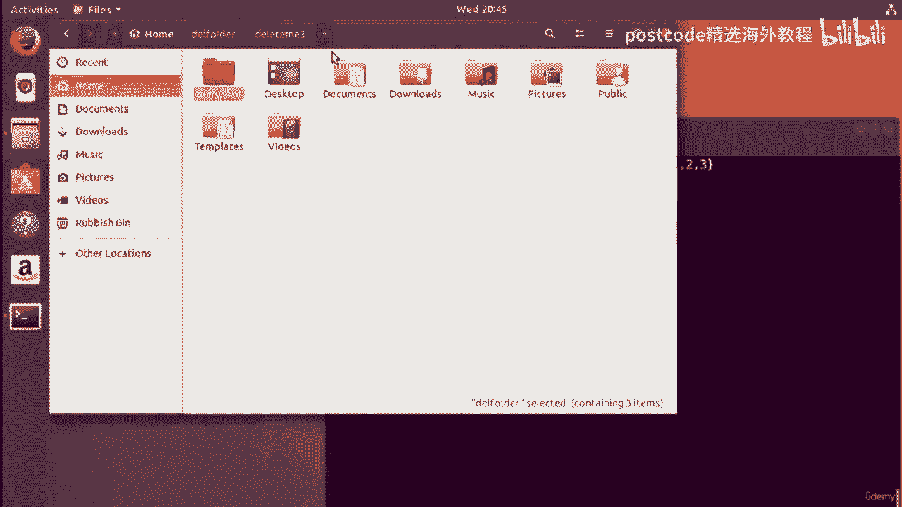

模式 `*[23]*` 表示：以任何字符开头，中间是“2”或“3”，以任何字符结尾。

```bash
rm *[23]*
```

这个命令会删除 `file2.png`、`file3.jpg`、`qibla2.jpg` 等文件。通配符是与命令配合使用的强大工具，任何匹配模式的文件名都会作为参数传递给命令。

## 删除目录

上一节我们专注于删除文件，本节我们来看看如何删除目录。首先，在主目录创建一个名为 `del_folder` 的文件夹。

```bash
mkdir del_folder
```

现在尝试删除它。如果直接使用 `rm del_folder`，会得到一个错误，因为 `rm` 默认不能删除目录。

为了让 `rm` 命令删除目录及其内部所有内容，需要使用 `-r` 选项（代表递归 recursive）。

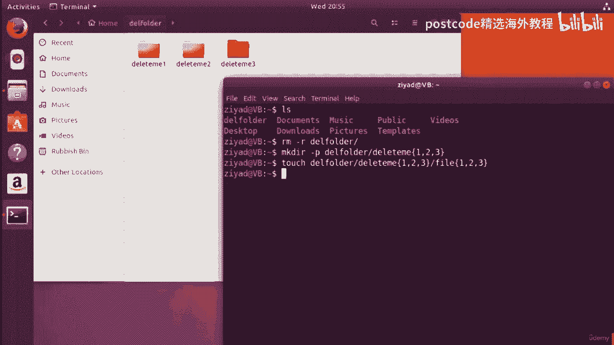

```bash
rm -r del_folder
```

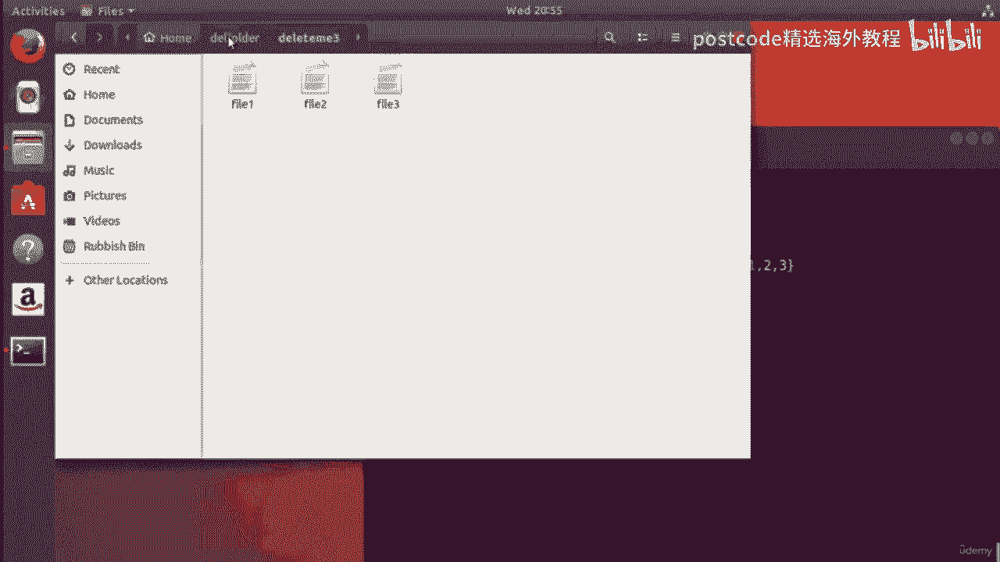

`del_folder` 就被删除了。让我们再创建一个更复杂的目录结构来演示。

```bash
mkdir -p del_folder/del_me_{1..3}
```

这会在 `del_folder` 内创建 `del_me_1`、`del_me_2`、`del_me_3` 三个文件夹。然后在每个文件夹里创建一些文件。

```bash
touch del_folder/del_me_{1..3}/file_{1..3}
```

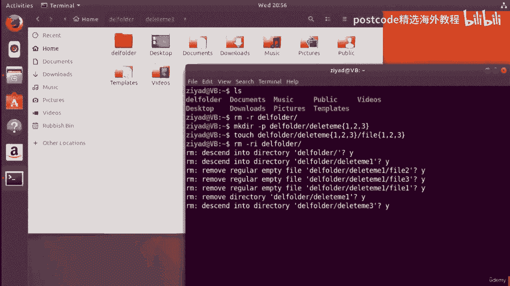

现在，如果我们使用 `rm -r del_folder`，它会递归地删除 `del_folder` 及其内部所有文件和子文件夹，且不会给出任何警告。这是一个非常强大的命令，需要谨慎使用。

## 安全删除选项

由于 `rm -r` 命令的破坏性，我们可以使用 `-i`（交互式 interactive）选项来增加安全性。这个选项会让 `rm` 在删除每个项目前询问确认。

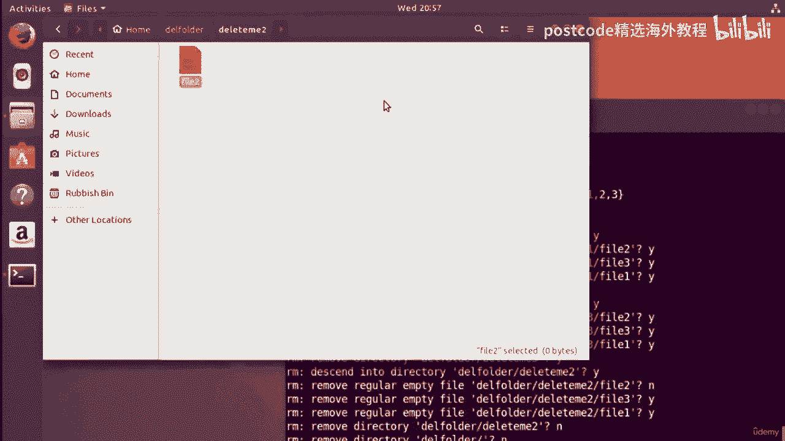

让我们再次创建目录结构。

```bash
mkdir -p del_folder/del_me_{1..3}
touch del_folder/del_me_{1..3}/file_{1..3}
```

现在使用交互式递归删除。

```bash
rm -ri del_folder
```

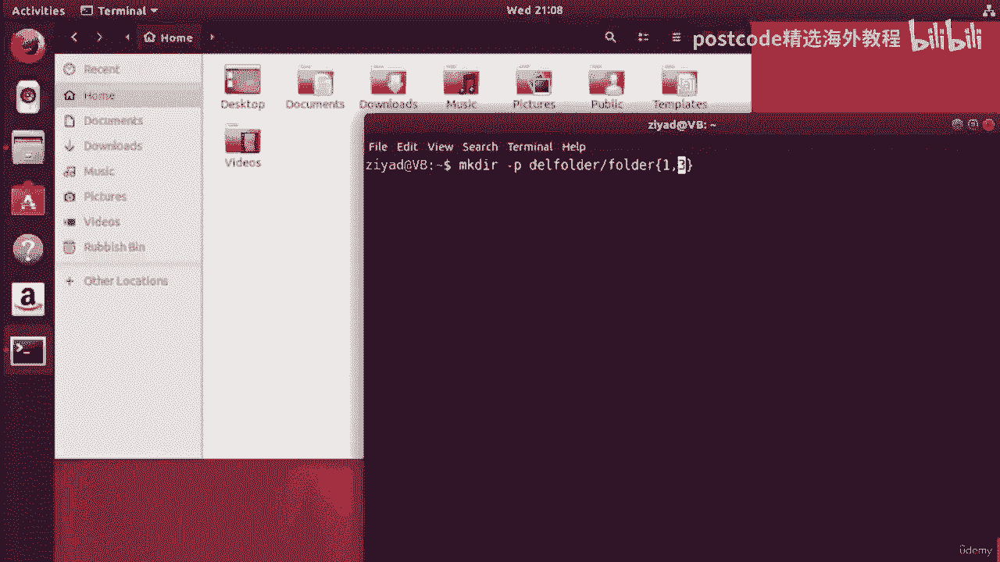

系统会为每个文件和目录询问是否删除，你可以选择 `y`（是）或 `n`（否）。虽然安全，但如果文件很多，这会非常繁琐。

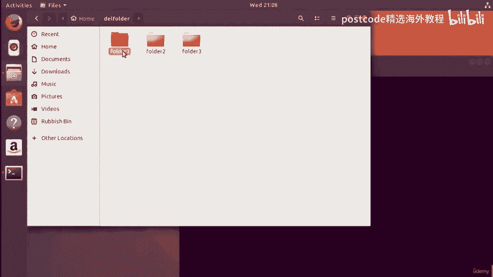

幸运的是，有一个专门用于删除**空目录**的命令：`rmdir`。因为它只删除空目录，所以永远不会意外删除文件。

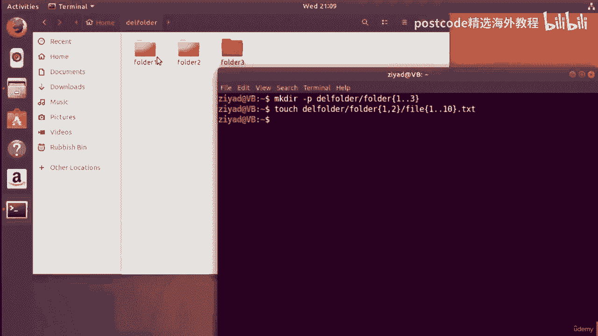

首先，删除之前的目录，然后创建新的结构，并在其中两个文件夹内放入文件。

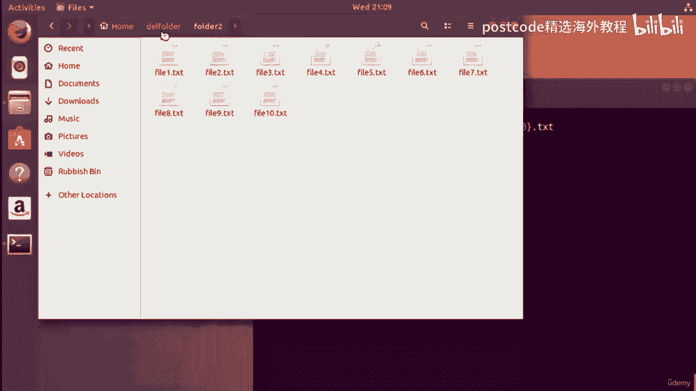

```bash
rm -r del_folder
mkdir -p del_folder/folder_{1..3}
touch del_folder/folder_{1,2}/file_{1..10}.txt
```

现在，`folder_1` 和 `folder_2` 内有文件，`folder_3` 是空的。尝试使用 `rmdir` 删除 `del_folder` 内的所有空目录。

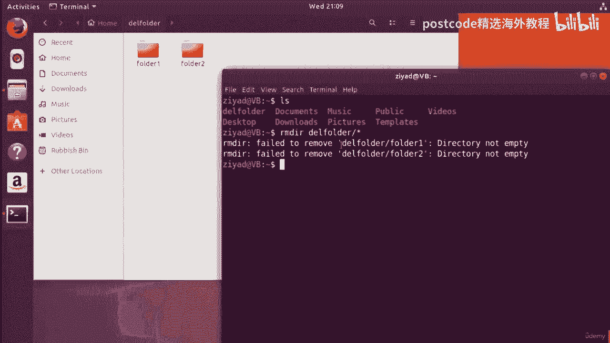

```bash
rmdir del_folder/*
```

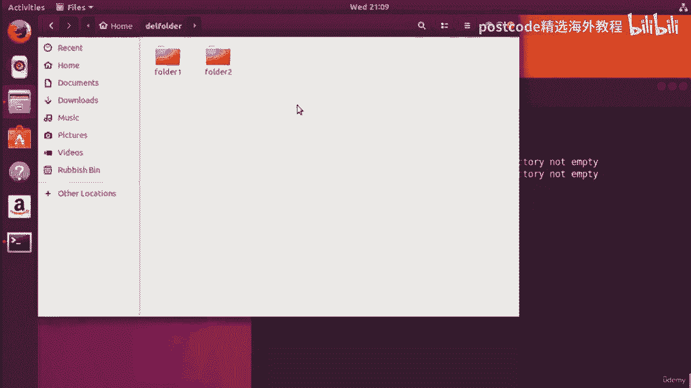

这个命令会失败于 `folder_1` 和 `folder_2`（因为它们不为空），但会成功删除空的 `folder_3`。请注意，我们需要使用通配符 `*` 来匹配 `del_folder` 内的所有子目录。如果只写 `rmdir del_folder`，会提示目录非空。

## 综合挑战

在之前的课程中，我们可能在桌面上创建了一个包含大量文件和子文件夹的 `project` 文件夹。现在，你的挑战是：使用一个命令删除整个 `project` 文件夹及其内部所有内容。

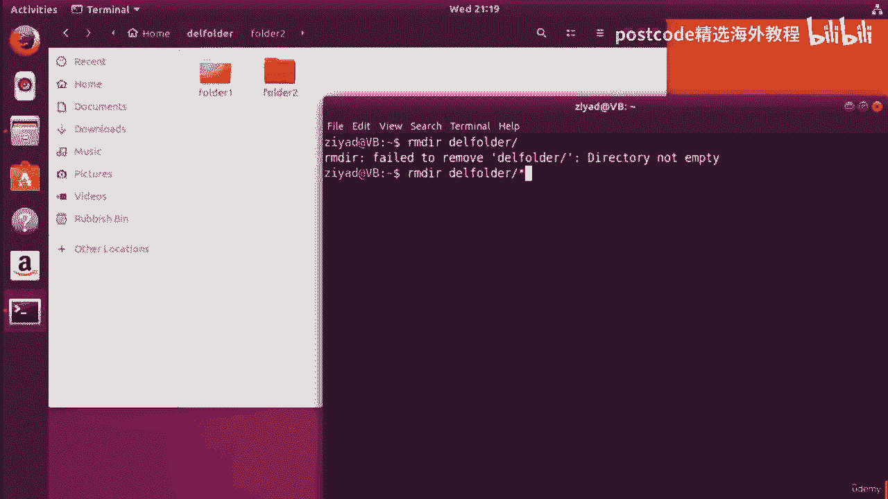

**提示**：你需要递归地删除一个非空目录。

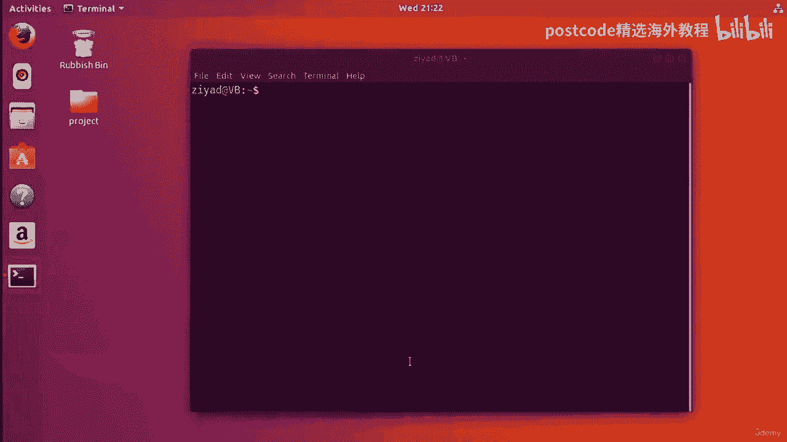

**答案**：切换到桌面目录，或使用其路径，然后使用 `rm -r` 命令。

```bash
rm -r ~/Desktop/project
# 或者如果你已在桌面目录
rm -r project
```

这个命令会瞬间删除 `project` 文件夹及其所有内容，无论里面有多少文件。

## 总结

本节课中，我们一起学习了在 Linux 中删除文件和目录的核心操作：
1.  使用 `rm <文件名>` 删除文件。
2.  使用通配符（如 `*`, `?`, `[]`）进行模式匹配删除，例如 `rm *.txt`。
3.  使用 `rm -r <目录名>` 递归删除目录及其所有内容。
4.  使用 `rm -ri` 进行交互式删除以增加安全性。
5.  使用 `rmdir` 命令安全地删除空目录。

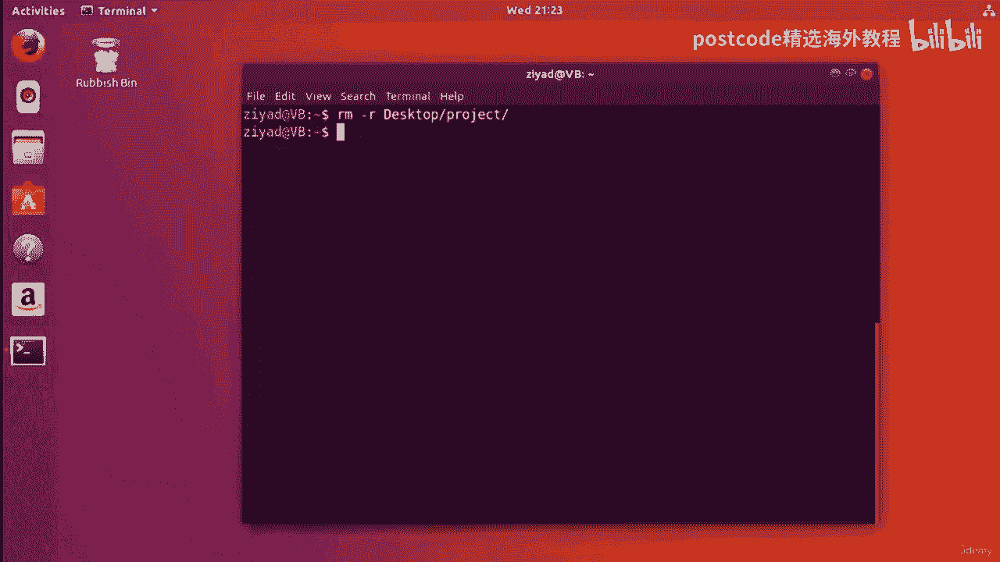

记住，尤其是 `rm -r` 命令威力巨大，请务必在确认路径和模式正确后再执行。