# 红帽企业Linux RHEL 9精通课程 — RHCSA与RHCE 2023认证全指南 - P31：04-04-007 Copy and move - 精选海外教程postcode - BV1j64y1j7Zg

通过Shell提示符可以看到，我当前在桌面上，并且在桌面上。我这里有一个名为 file one point txt 的文件，如果我打开它，它会说你好，你很漂亮，人们。我想知道那是怎么到那里的。

假设我们想将该文件复制到另一个名为“文件两点 txt”的文件，因为我非常，非常有想象力。因此，要复制它，我们需要使用 cp 命令，而 cp 是 copy 的缩写。

现在我们只需要告诉复制命令我们要复制什么以及要将其复制到哪里。那么我们要复制什么。好吧，我们要复制文件一txt。请记住，我已经在 shell 中的桌面上，所以我可以在 txt 中写入文件一。

如果我在主文件夹中，我会说复制桌面斜杠文件一个 txt 只是为了让您知道。那么让我们再次回到桌面。所以我们需要告诉它我们想要复制什么以及我们想要将其复制到哪里。所以我们想要复制远一个txt。

并且想要将其复制到另一个名为file to txt的文件中。这就是我们所需要输入的所有内容，将远一个复制到另一个名为 file to txt 的文件中。当我这样做时。

我们会看到我们在这里得到一个名为文件二的文件。

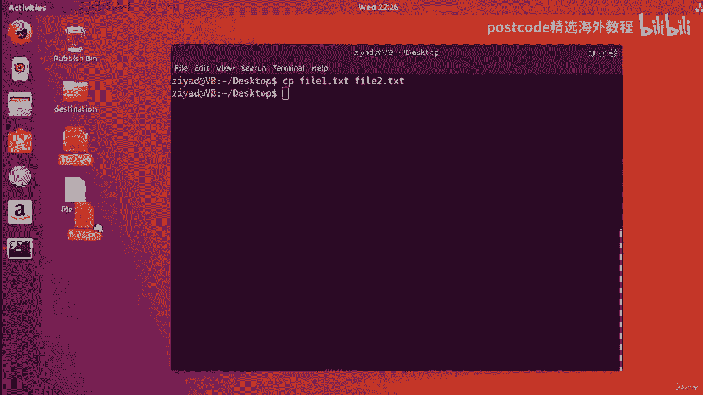

当我打开它时，这也向你们打招呼，你们这些美丽的人。

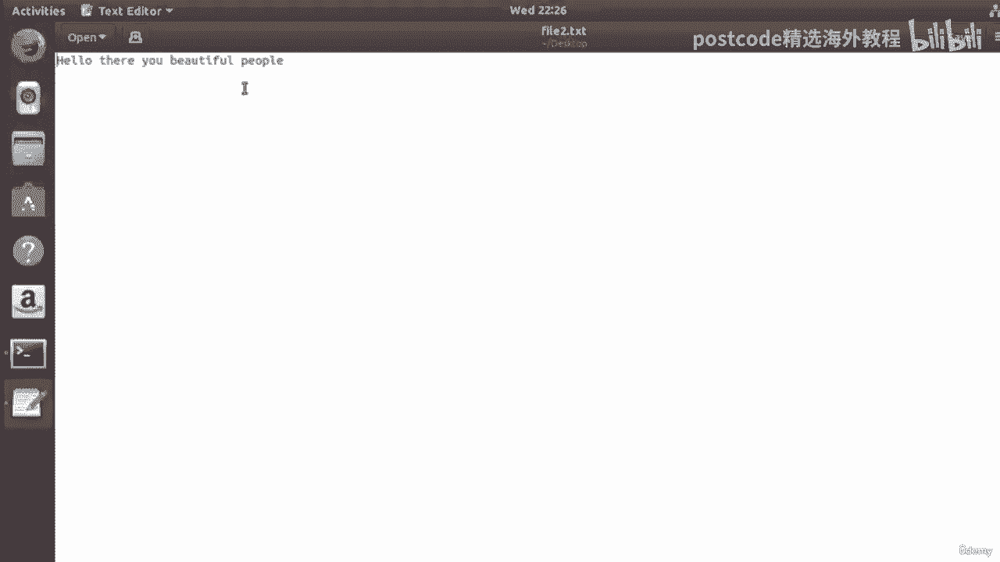

好的。这就是将一个文件复制到另一个文件的方法，非常简单。那么如何将文件复制到另一个文件夹到其中一个目录呢？嗯，这也很简单。正如我所说的复制命令，您所要做的就是告诉它您要复制什么以及复制到哪里。

想要将其复制到。好的。假设我想将文件一复制到名为 Destination 的文件夹中。所以我所要做的就是复制文件一到目前为止一txt并将其复制到目的地。假设我也想同时复制文件两个。

所以我想将远一和文件二复制到目标文件夹中。因此，您可以在这里看到，作为命令行参数输入的最后一个内容是目的地，并且，在此之前的所有其他内容都是您要复制的内容。

所以我可以有很多很多不同的命令和很多很多不同的文件，复制到这里。但最后一个是我想将它们全部复制到的地方。好的，那么，让我们继续并按 Enter 键。

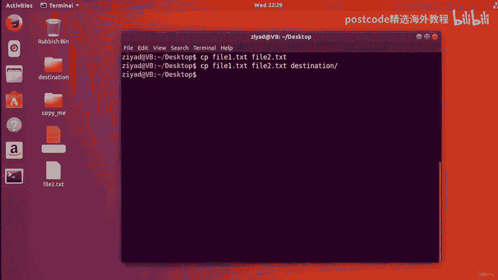

当我查看目的地内部时，我们可以看到我们已经到达了远一和文件二。

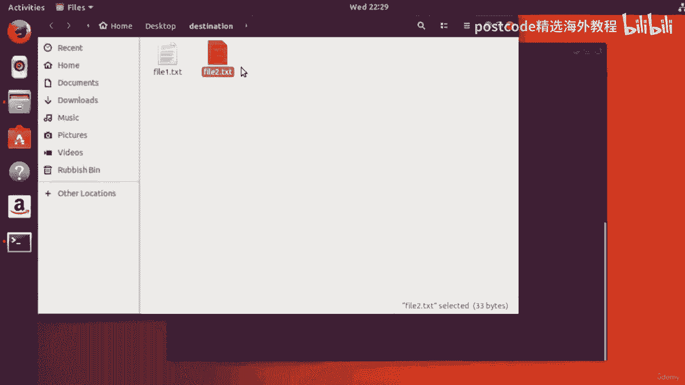

它们都被复制到那里。正如您所看到的，整个复制和粘贴操作实际上非常简单，只需使用命令，线。当然你也可以使用通配符来做到这一点。所以我现在在桌面上。假设我想删除以单词 file 开头的所有内容。因此。

如果我这样做，两个文本文件都应该消失，因为它们都以单词文件开头。所以如果我这么做了，他们就会这么做。他们俩都消失了。现在我可以将目标文件夹中的所有内容复制并粘贴到桌面，只需说，复制目的地。

将所有内容剪切到该文件夹​​中。现在我该如何选择这个文件夹？好吧，如果您还记得的话，每个位置总会有一个引用该文件夹的隐藏文件夹，这是。所以如果我这么做了，那就结束了。因此，如果我这样做，那个点。

意味着复制目标文件夹中的所有内容，进入这个文件夹，这是桌面，这就是我们当前所在的位置。因此，如果我这样做，如果我按 Enter 键，您将看到文件一和文件二已被复制并粘贴，到此位置。

该位置由此处的句号表示。如果你不记得了，如果我只是使用 a 选项执行 ls 。您可以在这里看到我们有这两个隐藏文件夹，带有一个点的文件夹指的是这个，文件夹，带有双点的文件夹指的是它上面的文件夹。

这是我们的主文件夹。好的。例如，我可以将目标文件夹中的所有内容复制到我们所在位置的父文件夹中，目前是，这是主文件夹。因此，如果我这样做，然后查看我们的主文件夹，我们可以看到文件一和文件二已创建。

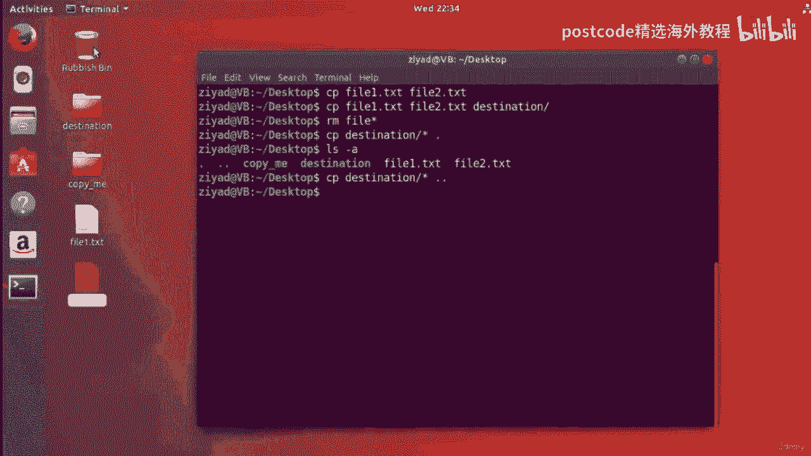

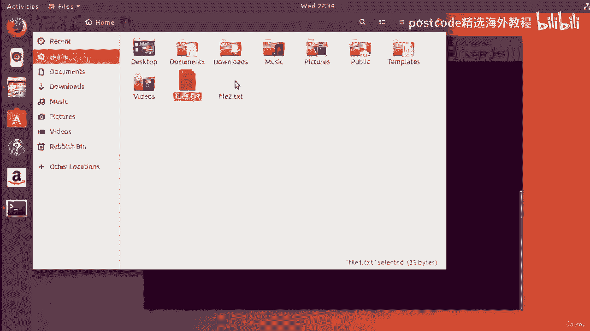

在那里。所以看，通配符对于任何命令都非常有效，甚至复制命令也是如此。那么让我们清除屏幕。我们已经了解了如何将一个文件复制并粘贴到另一个文件中。我们已经了解了如何将文件复制并粘贴到文件夹中。

并且了解了如何从文件夹复制并粘贴文件，文件夹到其他文件夹中。我们唯一需要知道的是如何复制和粘贴整个文件夹。

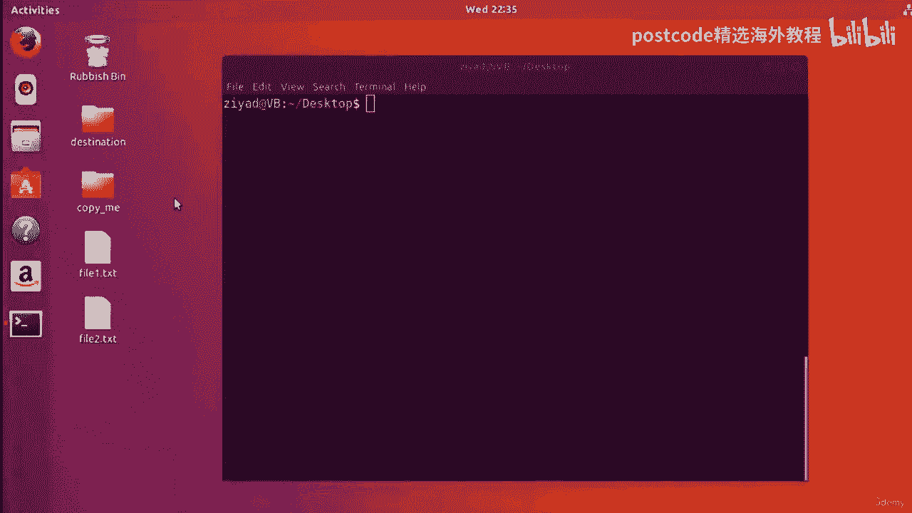

所以我们在桌面上有这个“复制我”文件夹，其中包含三个文件。

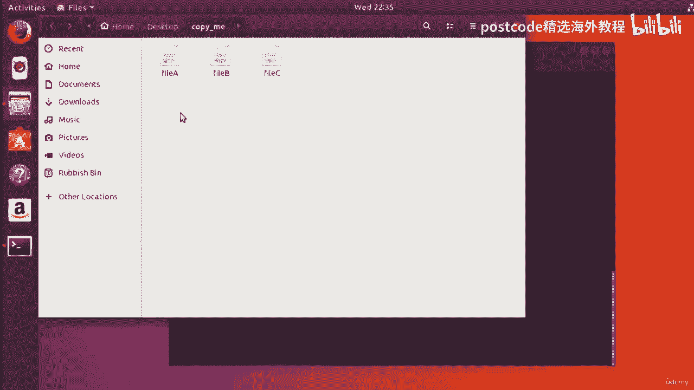

它有文件 A、文件 B 和文件 C，我们要将整个文件夹复制到目标文件夹中。

所以我们不仅想要文件，还想要文件夹。

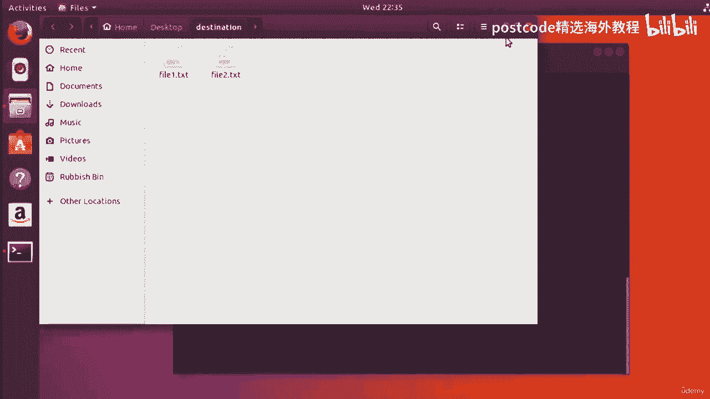

所以我们不仅想要巧克力，还想要包装纸。好的。因此，我们可以做到这一点的方法是为 C p 命令提供 R 选项，它也代表递归。现在，如果您还记得我们在最后几个视频中使用 m 删除文件和文件夹时的情况吗？

选项，递归删除意味着删除该文件夹及其内部的所有内容，它非常相似，对于复制命令。我们所说的是复制文件夹及其中的所有内容。因此，要将 MI 文件夹实际复制到目标文件夹中，我们只需将其键入即可。我们说。

我们说使用 R 选项复制，然后将我复制到目标文件夹中。如果我这样做，然后我们查看目标内部，我们将看到复制我的文件夹已被。

复制并粘贴，所有不同的文件也都在里面，一切都安全无虞。

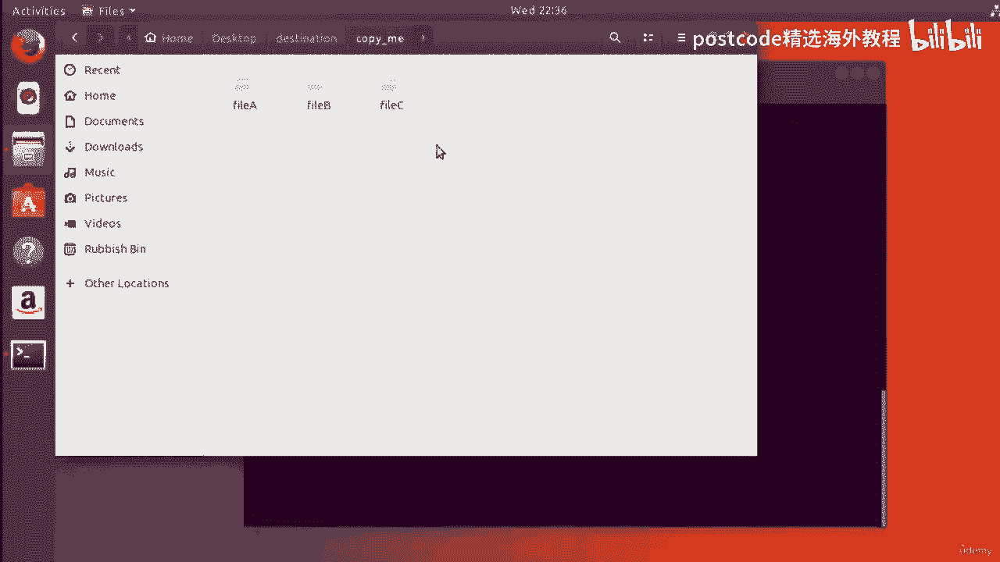

因此，我们首先讨论现在在桌面上重命名文件。我有一个名为 Old Name txt 的文件，我想将其重命名为 New Name txt。非常有想象力。我现在知道要对这个重命名执行此操作。

使用 MV 命令确实非常简单。首先让我进入桌面。所以现在我在文件实际所在的桌面上并将旧名称重命名为新名称，我所要做的就是，所要做的就是执行 env 然后旧名称 dot txt 这是文件的当前名称。

然后给出，它的新名称是新名称 dot txt。当我按下回车键时。您将看到该文件已被重命名，我们也可以使用 RLS 命令看到这一点。现在是新名字了。TXT。简单的。同样的事情也适用于目录。

所以我这里有一个名为旧文件夹的文件夹。正如我们所看到的，旧文件夹实际上包含一些文件。

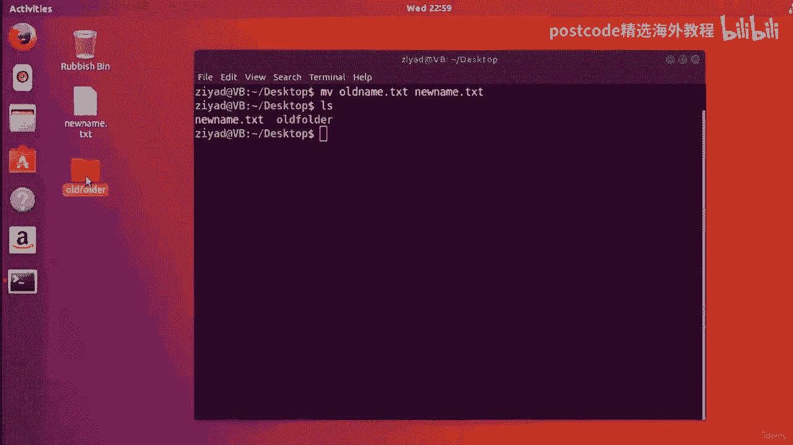

所以现在里面有文件一到文件十，将旧文件夹重命名为新文件夹。

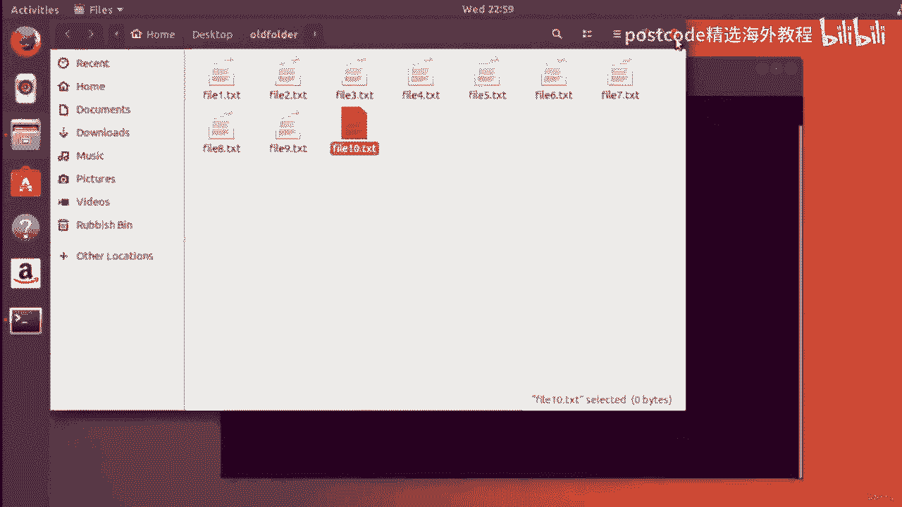

如果我清除屏幕，我需要做的就是移动旧文件夹、新文件夹，然后按 Enter 键，我们可以看到该文件夹​​已被重命名，就这么简单。即使我们刚刚更改了文件夹的名称，如果我们打开它，所有文件仍然存在。

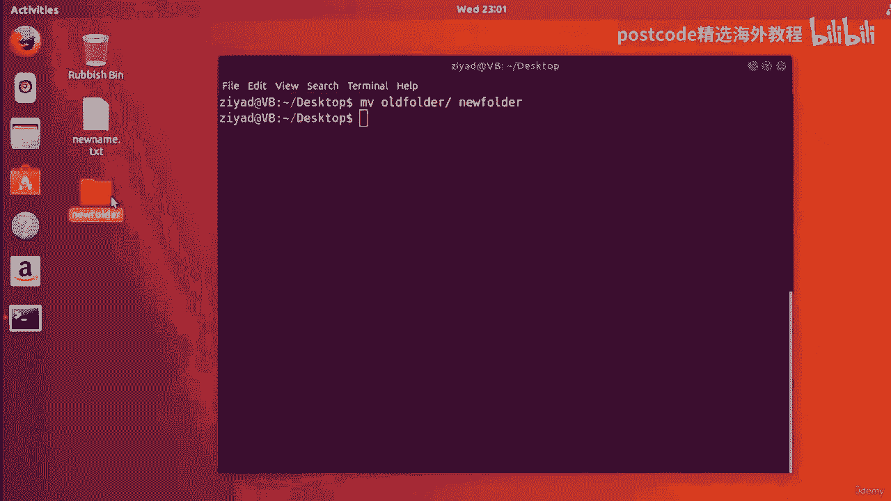

那里和以前一模一样。因此，重命名文件夹不会损坏其中的任何内容。

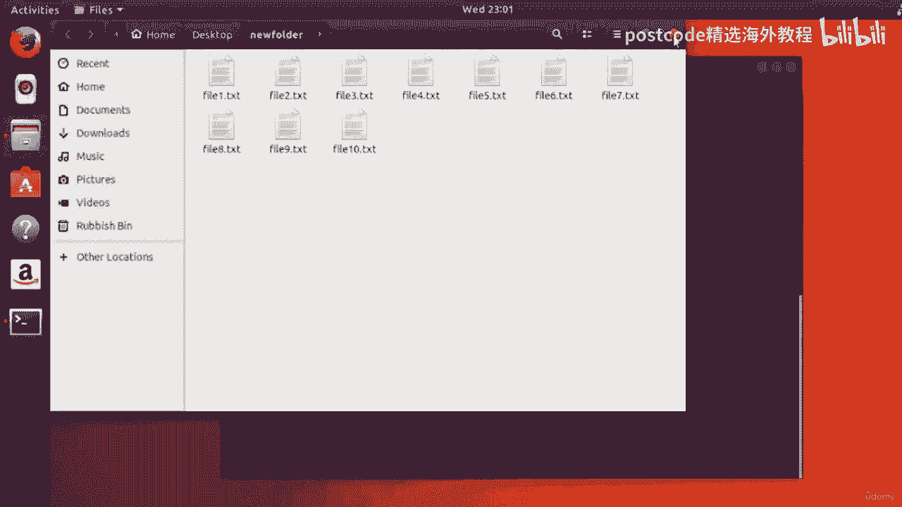

那么话虽如此，我们如何将文件从一个文件夹移动到另一个文件夹呢？这其实也很简单。我们需要做的就是给 move 命令我们想要移动的内容，然后是我们想要移动的目录，将它们移至。所以这与复制命令非常相似。

使用复制命令，您可以为其提供要复制的所有内容的列表。然后你给出的最后一个命令行参数就是你想要将其移动到的位置，将其复制到，对不起。MOVE 命令也是同样的想法。因此。

如果我们想将新文件夹中的所有内容移动到桌面上，那么我们所要做的就是说，从新文件夹移动，移动新文件夹，将其中的所有内容移动到此处，即桌面。因此，点记住表示当前工作目录。

正如您从 shell 提示符中看到的那样，是桌面。所以我们所说的是将新文件夹中的所有内容移动到当前工作目录，这，是桌面。因此，如果我按 Enter 键，您会看到所有文件都已转移到桌面上，这。

我们可以使用LRS看到。我们有文件 1 到 10，如果我们查看新文件夹，我们可以看到它们并没有被复制。

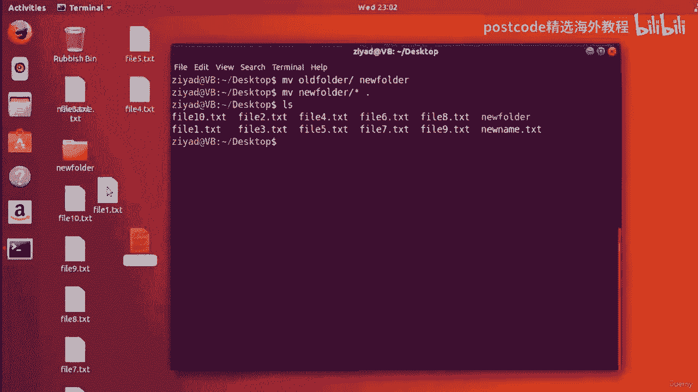

它们确实已被移动，因为该文件夹完全是空的。

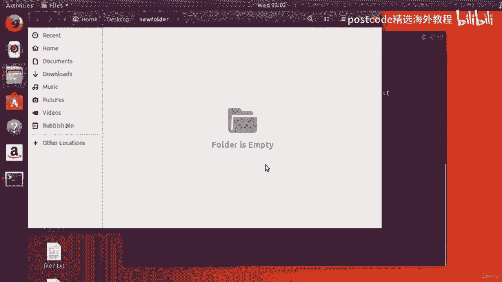

好的。因此，让我们将所有这些文件移回到新文件夹中。因此，如果我将所有以 file 开头的内容移回新文件夹，那么应该可以解决所有问题。

我们就这样吧。我们已将它们全部移回到这个新文件夹中。

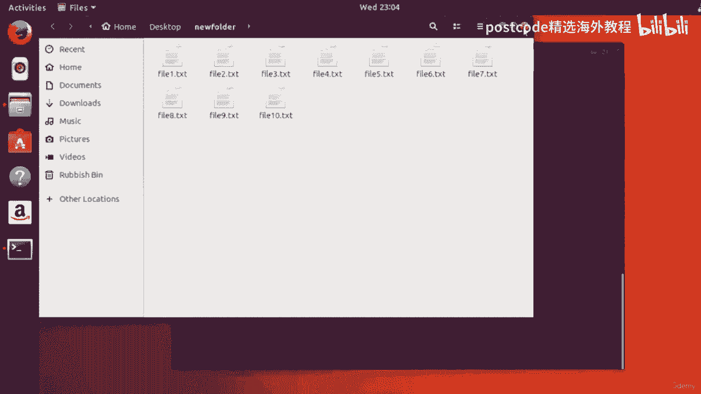

现在，我们如何才能一次性移动整个新文件夹呢？例如，我们如何将其移动到我们的文档文件夹中？嗯，这也很容易做到。它的工作原理正如您所期望的那样。我们只是移动新文件夹，我们希望它进入文档文件夹的目的地在哪里。

它位于我们的主目录中。所以我们用波浪号来表示我们的主目录斜杠然后是文件。因此，我们的主目录中的文档文件夹，我们按 Enter 键。现在，当我们查看主目录并进入文档文件夹时，我们就到了。

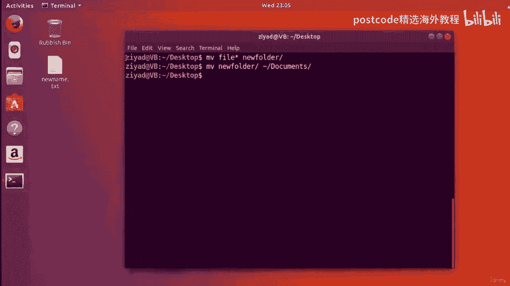

那里有一个新文件夹，完好无损。现在是为了大奖。如何将新文件夹移动到文档内或将其移动到某个位置并同时重命名？

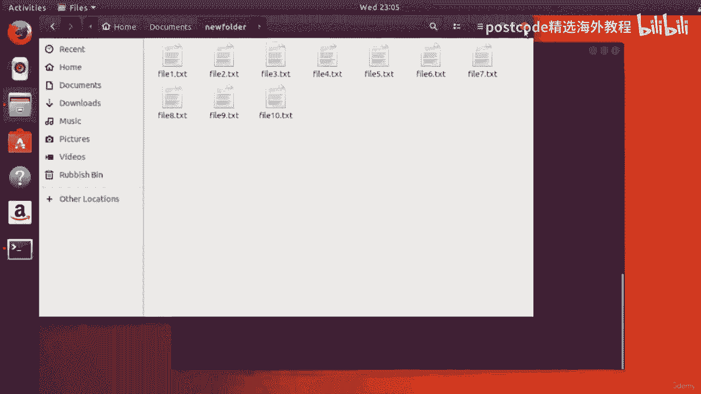

假设我想将其从我们的文档文件夹移动到桌面并将其重命名为 B jackpot，同一时间。那么我们该怎么做呢？好吧，首先我们需要卖掉它。我们需要告诉移动命令我们要移动什么。

假设我们想要将新文件夹移动到文档文件夹中。顺便说一下，这是您应该感到满意的事情，使用波形符来表示，您的主文件夹，然后是文档，然后是新文件夹。末尾的斜杠是可选的，但我认为它带有选项卡自动完成功能。

所以我们会把它留在那里。好的。现在我们想把它移到哪里？我们想将其移至桌面，这样我们就可以说当前工作目录，因为您可以，看到我们在桌面上，所以我们要将其移动到当前工作目录，但我们要，称之为大奖。对不起。

现在中奖了，因为中奖文件夹不存在。新文件夹将成为大奖。因此，如果我按 Enter 键，我们将看到累积奖金已创建。

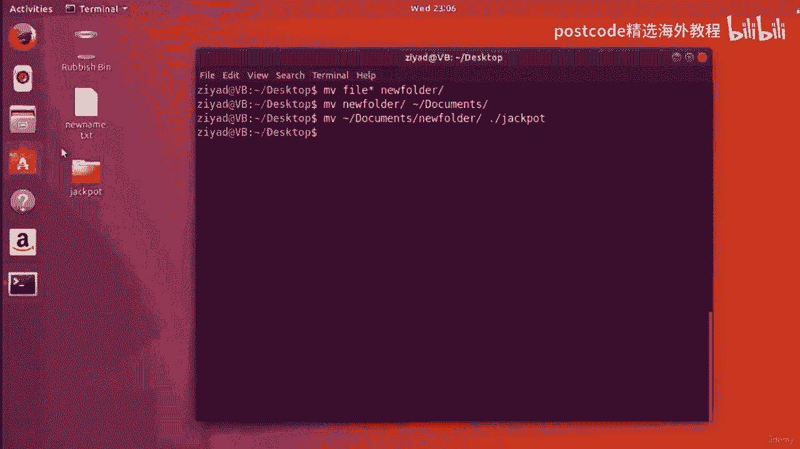

里面有新文件夹中每个文件的所有内容。如果我们返回到我们的文档，我们将看到新文件夹不再存在。

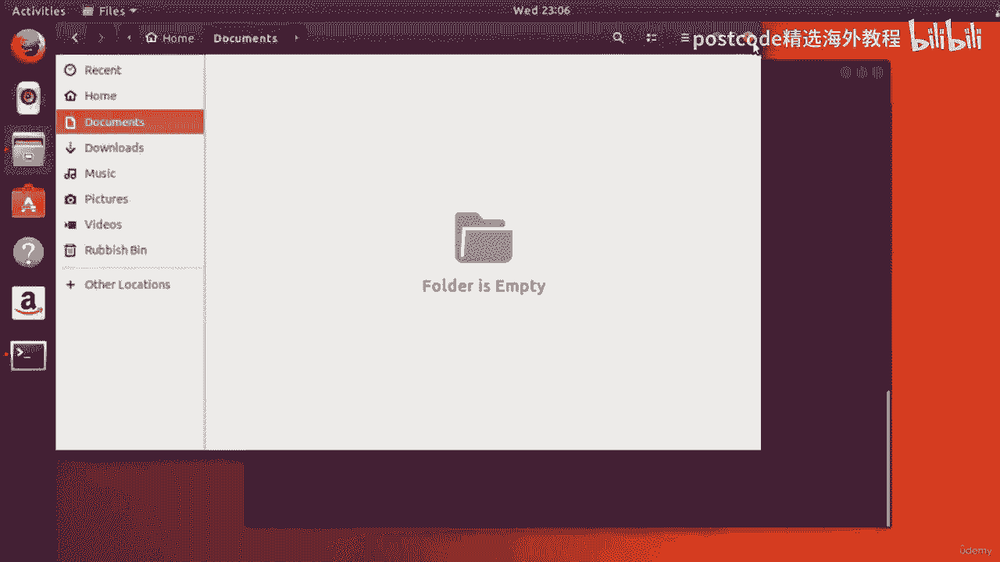

所以发生了什么事？我们说从我们的文档文件夹中移动新文件夹并将其放入此目录中，是桌面，但作为一个名为 jackpot 的文件夹。

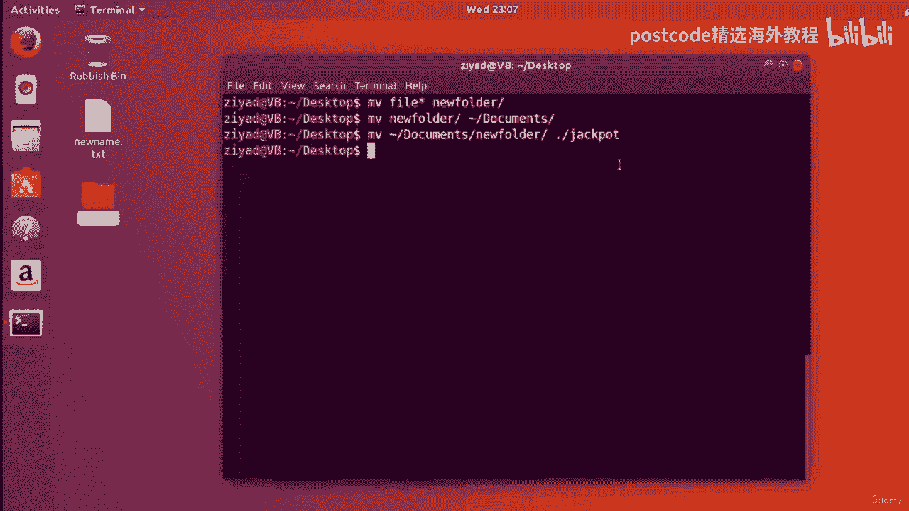