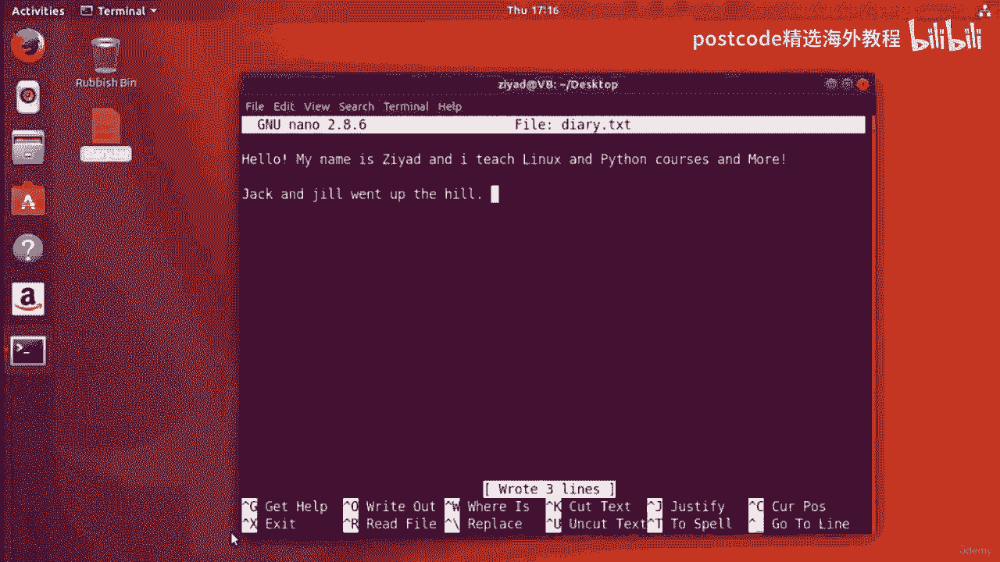

# 红帽企业Linux RHEL 9精通课程 — RHCSA与RHCE 2023认证全指南 - P32：04-04-008 Edit - 精选海外教程postcode - BV1j64y1j7Zg

正确的。因此，在本次讲座中，我们将使用 nano 命令创建一个名为 diary dot txt 的文件。现在日记文本文件实际上还不存在，但是没关系。我们还可以使用 nano 创建文件。因此。

如果我们打字，我们首先进入桌面。让我们转到桌面，然后如果我们输入 nano diary、点文本并按 Enter 键，您将，请注意，我们的终端已经改变了外观。

我们现在实际上正在编辑一个名为 direct txt 的文件，正如您在 Nano 编辑器顶部看到的，如您在此处看到的，nano 版本 2。8。6。显然现在我们可以在这里输入任何我们想要的内容。例如。

我可以输入 hello，我的名字是 Ziad，我教授 Linux 和 Python 课程等等，它的工作方式就像您以前使用过的任何其他图形文本编辑器一样。您可以直接在 shell 中输入。

现在在底部你可以看到实际上有一个小工具栏可以告诉你一些事情，你可以在 Nano 中执行此操作，选项位于白色方块中，并且采用键盘形式，快捷方式。所以从字面上看，你必须阅读它们。好的，在《Nano》中。

你在这里看到的小箭头、小帽子或胡萝卜符号，指键盘上的控制键。例如，这里我们有 get help 命令，我猜我们有 get help，选项来自，工具栏。这里给出了这个快捷方式，它有箭头，然后是大写的 G。

因此，如果我们按下键盘上的 control 并按下 G，这正是我们要做的，只需控制，和 G 一起执行该命令。我们可以在这里看到我们现在位于“获取帮助”菜单中，我们可以向下滚动并查看一些。

有关使用 Nano 的帮助。好的。我们可以在这里看到有一些要关闭它的东西，我们需要按 control 和 X 因为你，可以看到小箭头，然后是 X。因此，如果是 control 和 x。

我们就会离开那里并重新开始写作。好的。我们还可以关闭nano，例如，按control和X，它会说，你想保存吗，是还是不是？我们只需按控件单击取消即可查看。就这样，我们取消了。我们还是回来了。

那么我们该如何保存这个文件呢？怎样才能保存这本日记呢？在我们的主文件夹中点 txt。抱歉在我们的桌面上。抱歉，您可以在此处看到我们的 shell 提示符，表明我们位于桌面中。那么。

要在 nano 中执行此操作，您将使用 write out 函数。因此，写入文件是保存文件的一种奇特方式。所以保存和写入基本上是同一件事。因此，要写入文件，我们需要按下 Control 键。哦。

我们有箭头，这里的小胡萝卜符号，这意味着控制键，哦，所以这意味着我们按下控制键，哦，现在它问我们你想保存什么，让我们，将其另存为日记点 txt，然后按 Enter 键，它会说它写了三行。

但您可以在这里看到，我们实际上已经有了日记点txt。因此，如果我们在任何其他编辑器中打开该文件，我们可以看到该文件确实已创建。所以我可以在这里写点东西。我可以说就像杰克和吉尔上山一样。好吧。

然后按 control 键，哦，按 Enter 键。如果我按 control 和 X 退出，它就会消失。

但是如果我查看 txt 的日记，它会将该数据保存在那里。

杰克和吉尔上了山。所以 Nano 是一个可以从命令行控制的文本编辑器。那么这不是不可思议吗？您现在可以编辑文件，无需加载图形密集型编辑器，也无需使用，像这样的文件几乎可以在任何地方使用。

即使您远程访问了可能未安装图形用户界面的服务器，Nano 等文本编辑器仍然可以工作。那么 Nano 还能做什么呢？好吧，让我们来研究一下这些选项。

现在我们已经了解了如何获取帮助、如何退出使用 control 和 X 以及如何使用写入或保存文件，控制。现在这里的读取文件选项怎么样？控件和啊，读得好文件允许您从另一个文件获取内容并基本上放置。

它在这个里面。因此，如果我回到我们的 shell，如果我们退出并尝试创建一个文件，其中包含生日快乐和，我们将“生日快乐”回显到一个名为“生日”的文件中。TXT 我们可以看到生日点txt已经创建了。现在。

如果我们再次打开日记点 txt，我们向下移动到底部，然后按 control 和 r control，r 表示读取文件，它会说明您要插入哪个文件？请注意，它是从点斜线开始的。这意味着来自这个目录。好吧。

让我们试着告诉它。这就是我们实际上想要的。数据来自生日文本。如果我按 Enter 键，您可以看到刚刚插入了生日快乐，所以这就是阅读内容，文件 where is 选项怎么样？好吧。

where is 选项是 control 和 W，其作用基本上是在文件中搜索单词。因此，如果我们返回到文件顶部并按下 Control 键和 w 现在我们可以搜索一个单词，那么让我们搜索“生日”这个词。

因此，如果我们输入生日并按 Enter 键，我们现在会看到 Nano 已将我们直接跳转到生日所在的位置，单词生日开始，因此我们可以从那里开始编辑它。现在默认情况下。

where is 选项搜索在文件中向前搜索，并且不区分大小写进行搜索，方式。所以这意味着大写和小写并不重要。因此，如果我到这里并用大写字母搜索生日，实际上您可以注意到它，显示您之前搜索的内容。

所以我要把生日改成大写。我们可以看到，它实际上并不重要，它找到了生日，尽管生日都是小写的。因此 where 是以不区分大小写的方式搜索的，并且默认情况下搜索是向前的。但是如果我们向下移动到文件的底部。

那么如果我们向下移动并再次使用 control w，您。

可以看到底部，如果我最大化屏幕，也许会更清楚地看到，实际上还会弹出其他选项。好的。现在，其中一些选项以胡萝卜符号、帽子开头，这意味着控制，钥匙。但有些是从M减开始的，你可以看到M减C，M减R。

M减B和减J。那么这个减号是什么意思呢？那么，M 减号代表修改，这通常是键盘上的 alt 键。所以 alt 键。所以你可以在这里看到我们有 mm 减去 C 选项，它代表区分大小写。因此。

对于 Press Alton C，您现在可以看到它已更改，因此我们现在正在区分大小写进行搜索，方式。好的，所以如果我现在搜索实际上也坚持一下，因为这只会向前搜索。因此。

如果我同时按 Alt 和 B 向后搜索，您会看到我们现在将搜索区分大小写，生日用大写字母倒过来，我们会发现什么也没找到，你看。但如果我只是喜欢那个控件，你会看到它被保存为设置，它将是，区分大小写且向后。

但现在如果我搜索生日全小写，我们会看到已经找到了。所以这真是太棒了。正确的。您还可以修改这些命令的行为方式。因此，如果您看到 M 减号，则表示按下 alt 键，即键盘上的 alt 键。

如果您看到三角形、帽子、小箭头，那就是键盘上的控制键。这将涵盖您在 Nano 中要做的几乎所有事情。那么让我们回到我们的正常菜单。因此，为了节省时间，我们将在这里剪辑视频，然后立即将其拾取，下一个视频。

我们将介绍 Nano 中的其余选项。所以我希望这是有用的。您已经看到 Nano 是一个文本编辑器，您可以从命令行打开它，它允许您执行以下操作，您无需离开命令行即可编辑所有文件。所以我只能说，我们开始吧。

我们有日记、文本编辑器，进行一些更改，保存，退出，然后我们回到命令行。因此，它为您提供了一种非常好的编辑文件并返回到您正在做的事情的方法。因此，让我们摆脱它，保存退出，清除屏幕，然后我们就可以开始了。

继续我们的工作。因此，让我们在下一个视频中继续讨论 Nano 提供的其他选项。你好，美丽的人们。欢迎回到我们关于如何使用 nano 命令行文本编辑器来完成您的工作的讨论，完毕。所以我们在上一个视频中。

我们讨论了 Nano 的一些选项，我们讨论了，写出选项、读取文件选项、位置选项以及替换选项。因此，让我们实际使用读取文件选项再次读取生日文本。所以我们要说生日点文本，你可以看到我们已经读到了生日快乐。

再次归档。我这样做的原因是我们现在可以使用替换命令。你可以在这里看到，这里的替换命令或替换选项是通过按control激活的，和一个反斜杠。现在我在键盘上的字母 Z 旁边找到了反斜杠。

但它可能在您的计算机上的任何位置，在你的电脑。在你的键盘上。好的。所以我要按下 Control 和反斜杠，现在它询问我要替换什么。因此，让我们替换生日，然后将其替换为代码日。当我按下回车键时。

它现在将遍历找到生日这个词的每个实例，并询问您是否要更换它。现在你可以看到底部，它会说，你想放置这个实例吗？我可以说“是”，我可以说“否”，或者我可以说“全部”，或者我可以说“对照”和“C”代表癌症。

所以我们只需按 A 即可将其替换为全部。我们看到生日的每个实例都已替换为单词代码日。祝你代码日快乐，你这个美丽的人。这就是替换文本。剪切文本怎么样？剪切文本是下一个。所以切割非常容易。

您可以在这里看到这行代码，上面写着“快乐代码日”。如果我按 Control 和 K 进行剪切，则基本上会删除该行，如果我想粘贴该行。所以基本上这就像您日常使用计算机时的剪切和粘贴一样。

所以如果我想把它剪下来，我可以按你的控制键，然后我可以按照我的意愿多次这样做。所以这是一个非常非常快乐的代码日。我们还可以使用 control 和 j 来调整文本。因此。

如果我按 control 和 J，我们会看到文本已设置为占据整个宽度，屏幕的所以我可以按新的控制现在不合理。但你可以看到我是否按下 control 和 j 来调整文本。我所在的段落占据了整个宽度。

它可以在屏幕的整个宽度上显示文本。对于媒体控制你，我可以证明它是合理的。所以这是需要牢记的事情。如果你看一下控制 J 是对齐的，在对齐控制 u 之前是未剪切的文本。

但是如果我按下 control 和 j 你会发现控制你现在已经切换到了 justify 并且它告诉，你在这里，你现在可以被无理的媒体控制。它又回到了原来的样子。接下来，我们有两个拼写选项。

它基本上是一个拼写检查器。现在，默认情况下，没有为 Nano 设置拼写检查器。因此，如果我按下 Control t，它会显示拼写检查，调用拼写失败的错误。好的。这意味着实际上并没有设置一个拼写检查器。

但我们可以设置一个。因此，让我们通过按 O 上的 Control 来写入文件来保存文件。是的，就可以了。然后按control X退出并用control清屏，我看到很多键盘快捷键，正在这里进行。因此。

要实际编辑文本，抱歉，用于 Nano 的拼写检查器位于 nano 中，配置文件，它实际上位于我们的 Etsy 文件夹中名为 Nano。config 的文件中。RC 因此。

让我们以具有讽刺意味的方式用 Nano 来打开这个话题。因此，如果我们这样做了，我们现在就打开了 Nano。RC 所以它是斜线 ETSI Slash Nano。RC 因此。

如果我以图形方式向您展示我们要去的地方，我们将进入我们的基本目录。

到其他位置和计算机。所以这是斜杠文件夹，然后你去etsi，所以斜杠etsi，然后在这里的某个地方会有，一个名为。

不，不，不，不，纳米 RC 就是这样。所以如果我们点击 Nano。RC 这基本上就是我们打开的内容，但我们要确保在此处打开它。

实际上，目前这个文件实际上是不可读的，因为我们没有编辑权限，它。因此，为了使其实际上可编辑，我们需要执行 sudo nanolashesketsislashnanoRC。

所以这个伪位基本上允许您以管理员身份运行这个命令，但是我们会谈到，稍后再讲。在课堂中。您输入通常用于登录的密码，现在您可以编辑该文件。现在这里有一行包含“咒语”或“咒语”一词。因此。

让我们使用 where is 命令找到它。那么让我们使用。阿斯佩尔在哪里？按回车键就找到了。所以这一行在这里说，使用这个拼写检查器而不是内部的。该选项没有正确的默认值。所以为了摆脱这个，实际上。

为了真正实现这一点，我们只需要摆脱这个哈希，符号并去掉前导空格。所以现在没有，没有哈希，只需设置拼写器 aspell dash ecstasy 就这样。现在，如果我们写出并关闭。

现在如果我们回到 Nano 中查看日记点文本，如果我们按，控制 T 实际启动拼写检查器，我们现在有一个拼写检查器正在工作。那么这不是很酷吗？正确的。我们只是使用Nano来编辑Nano。这很棒。

所以我们到了。它正在检查我们的拼写检查，它告诉我我的名字是错误的。嗯，这很迷人，不是吗？但就这样吧。这就是您实际上可以设置拼写检查器的方式，您只需在其中输入内容即可，这里。

所以如果我想把我的名字改成尤达（Yoda），我当然会这么做，因为那完全是，惊人的。我只要输入五，你就会看到我的名字现在是尤达，这是事实，因为它出现在视频上。好吧。

如果我现在也可以选择这些选项中的任何一个。您可以忽略、替换、添加到字典、全部替换或忽略全部或任何可能的内容，但是，我们只需按 X 退出即可。我们又恢复正常了。因此，一旦您编辑了该内容。

您所要做的就是添加了该内容，以便您的拼写检查器，成功了，你就可以走了。并且还可以添加不同的字典和类似的东西。您也可以在网上找到该信息。所以我们就到了。这就是您进行拼写检查的方式。

并且 C 中的控件显然会告诉您当前的位置。因此，如果我按 Control 和 C，它会告诉我们我在 19 人中就有 1 人在线，第一栏已完成 5%，满分 70 个，字符零满分 275 个。

所以如果我现在移到这里并按下控制键看看，情况就会改变。我现在在第七行，第十列之类的地方。所以这就是这很好。如果您正在处理一个文件，并且想将其交给某人，并且您说，哦，嘿，您可以更改吗。

这个文件在这个给定的位置？或者您正在向人们提供有关如何使用文件的说明，并且您在第 11 列中说“在线七”，更改，本文。所以事实上，只是为了向你展示让我让我真正保存它。是的。

如果我去编辑我们的斜杠etsi斜杠nano RC文件，我可以搜索那个咒语在哪里？现在，我可以告诉你我们到了。我中了咒语。如果我按下 Control 并查看，我可以在这里看到我在线 172。因此。

如果您想设置拼写检查器，请转到第 172 行。例如，这就是您需要编辑的行。那是一种方法，对吧？所以我可以关闭它，回到日记点文本。现在我们正在渡过难关。下一个选项是控制和下划线，它允许我们转到一行。

所以如果我按下控制键和下划线，然后按下控制键和下划线，哦，抱歉，我按下了，这里按钮错误。哦，我们开始了。因为下划线在我的计算机上的位置有点奇怪。所以我按下控制键和下划线，它表示行号和列号结束。

让我们转到第十行第二列。现在我们就到了。我在第十行列，看看我是否真的可以让这些东西变得更大一点。我们开始吧。我把字体调大了一点。所以 Control Underscore 做到了。

因为我必须按下 Control 键、Shift 键和下划线。无论如何，我们继续我的。现在您可以输入行号和列号。假设是第九行，第 12 列。我们开始吧。我们在第 9 行第 12 列。

并且列之间没有空格分隔。它们由字母分隔。这是他的专栏。一、二、三、四、五、六、七、八、九、十、十一、十二。这就是我们通过任何方式转到第 12 列时可能到达的位置。所以，如果我对你说。

让我们编辑我们的斜线 Etsy 斜线 RC 文件，我会使用 where 来查找 using，是命令，我控制 W 并搜索咒语，然后到达这一行。我想，哈，C 中的行控件在哪里，即当前位置。

它说第 172 行。好的。现在，在您的计算机上，当您打开该文件时，您会看到，哈，z 表示第 172 行。因此，请按 Control 键并在第 172 行末尾添加下划线，然后按 Enter 键。

我最终找到了正确的路线，因此您可以看到如果您正在合作，这可能会有多有用，和某人一起做某事。那么让我们回到我们的日记文本。然后我们就可以撤消和重做。因此，如果我把这里所有这些东西都删掉，然后我就想，哦。

我不想这样，发生了，让我撤消。你可以看到我刚刚撤消了所有这些删除的内容。我也可以按 Alt 和 E。请记住，这可能是转义或命令，具体取决于您的键盘布局，只是修改键，无论那对你来说是什么。

在我的键盘上它是 alt，但如果我按 alt 和 e 应该重做更改新的撤消重做。哎呀。替代 e 替代 a 新的。是的。是的，我现在已经打破了它，但你明白了。所以。这就是您撤消和重做事情的方法。

而不是切割，你能看一下，如果我现在切割，我可以不切割。实际上，您可以直接复制，而不是剪切。所以在这里你只需要做 alt 和数字 6。因此，如果我现在按更改数字 6，我可以按控制键，然后开始粘贴。

所以也许如果我，如果我在这里交替六个然后按控制你，现在我正在复制和粘贴，就这样。因此，据我所知，这可以让您免于实际剪切和标记文本，或者我不太使用它，经常发生，但据我所知，这样做只是让你能够突出显示内容。

所以是的，它只是让你可以突出显示一些东西。

