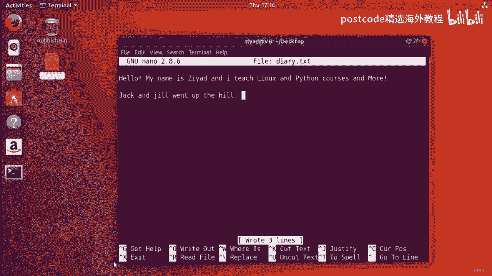
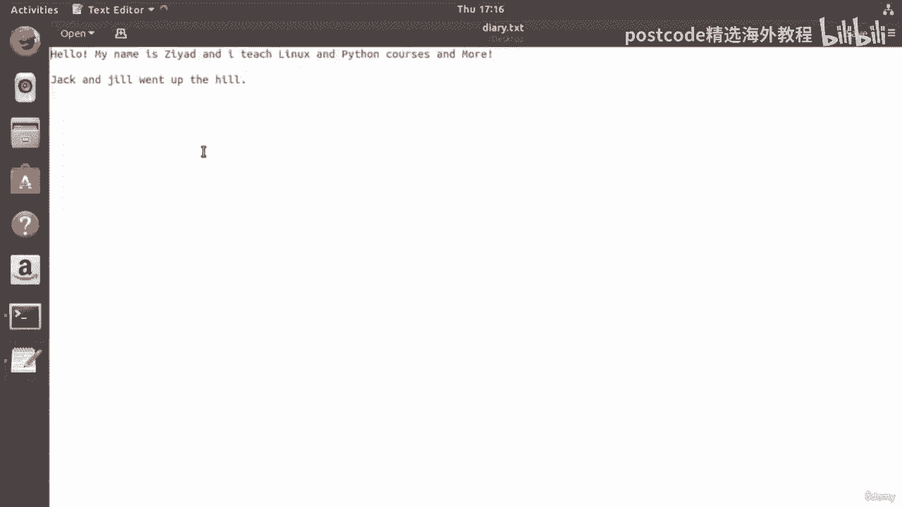
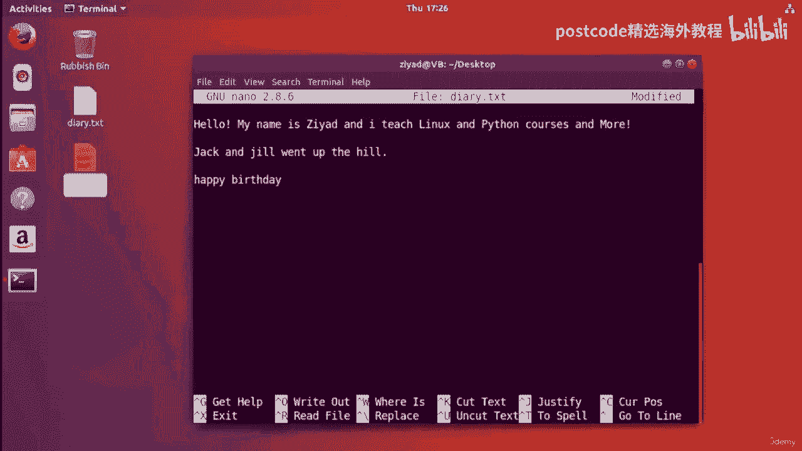
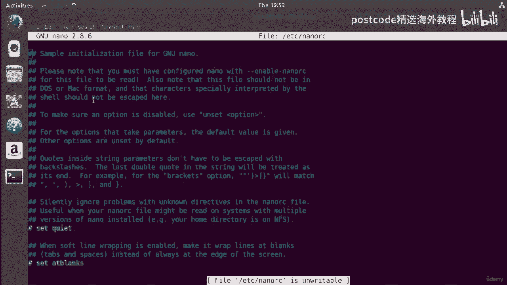
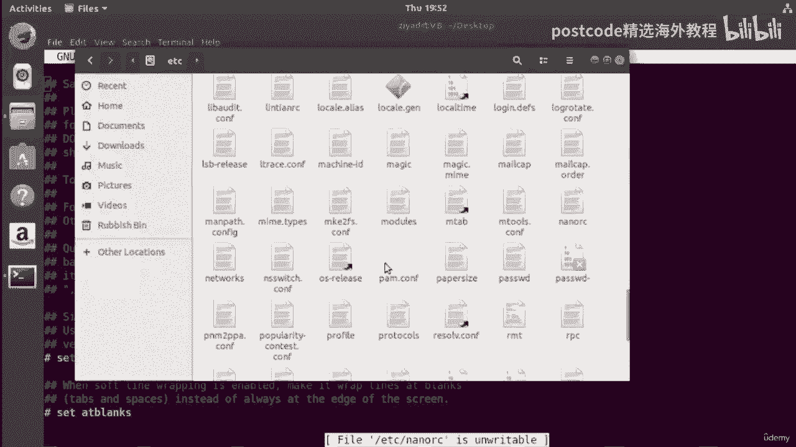
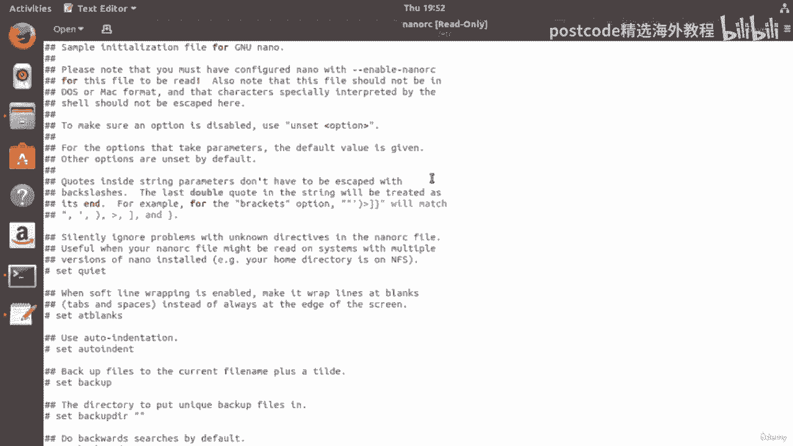
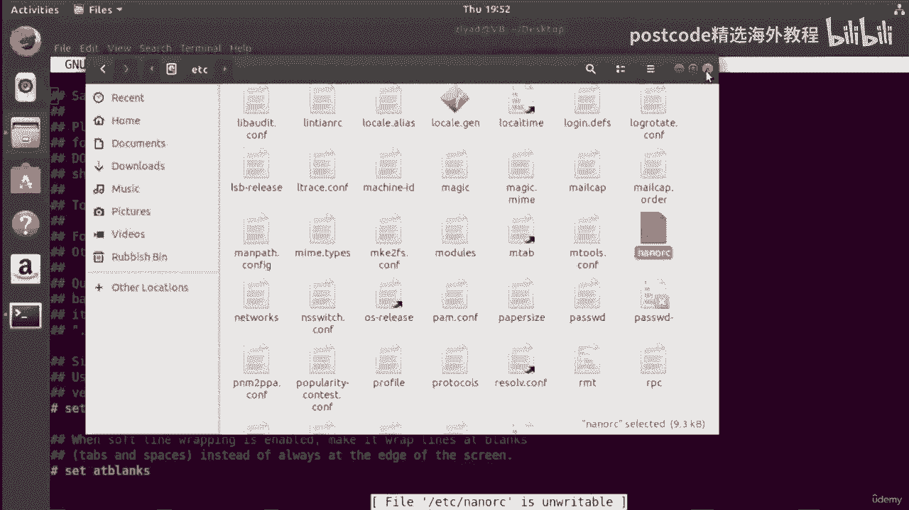
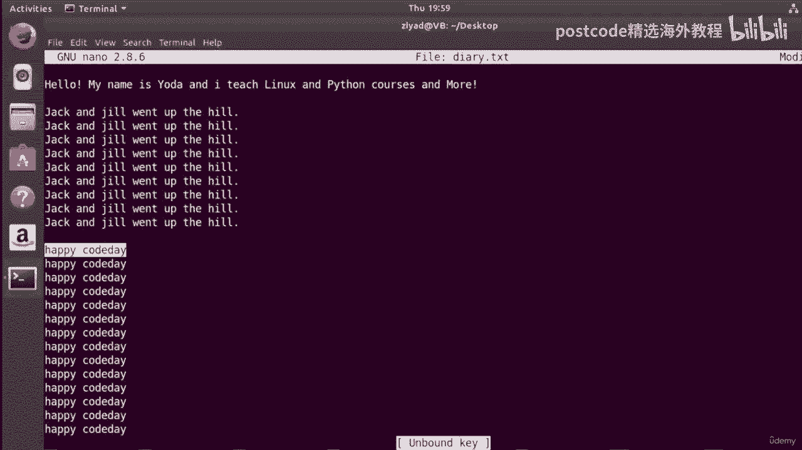

# Linux命令行文本编辑：04-04-008：使用Nano编辑器

## 概述
在本节课中，我们将学习如何使用Nano命令行文本编辑器。Nano是一个简单易用的文本编辑器，允许你直接在终端中创建和编辑文件，无需图形界面。这对于在服务器或远程连接环境中工作尤其有用。

---

## 启动Nano并创建文件
首先，我们使用`nano`命令创建一个名为`diary.txt`的文件。即使文件不存在，Nano也能创建它。

```bash
cd Desktop
nano diary.txt
```

执行上述命令后，终端界面会发生变化，进入Nano编辑器。编辑器顶部会显示当前编辑的文件名和Nano版本信息。

---

## Nano编辑器界面与基本操作
现在，你可以在编辑器中输入任何内容。例如，输入“Hello, my name is Ziad. I teach Linux and Python courses.”。它的工作方式类似于你使用过的其他图形文本编辑器。



在编辑器底部，有一个工具栏，显示了可用的快捷键。快捷键前的`^`符号代表键盘上的**Control**键。



例如，`^G`表示按下`Control`键和`G`键。让我们按下`Control+G`来查看帮助菜单。

---

## 获取帮助与退出
按下`Control+G`后，会进入帮助菜单。你可以滚动查看Nano的使用说明。

要关闭帮助菜单并返回编辑界面，按下`Control+X`。此时，如果你有未保存的更改，Nano会询问你是否要保存。你可以选择“是”、“否”或按`Control+C`取消。

---

## 保存文件
要保存文件，你需要使用“写入”功能，这相当于保存文件。快捷键是`Control+O`。



按下`Control+O`后，Nano会询问文件名。输入`diary.txt`并按回车，它会显示写入的行数。此时，文件已保存到你的桌面目录。

---

## 读取其他文件内容
Nano允许你将其他文件的内容插入到当前编辑的文件中。快捷键是`Control+R`。

例如，我们先创建一个包含“Happy Birthday”的文件：
```bash
echo "Happy Birthday" > birthday.txt
```

然后，在`diary.txt`中，将光标移动到想要插入内容的位置，按下`Control+R`。Nano会询问要插入哪个文件。输入`birthday.txt`并按回车，“Happy Birthday”就会被插入到当前光标位置。

---

## 在文件中搜索文本
要在文件中搜索特定单词，使用`Control+W`快捷键。

按下`Control+W`，输入要搜索的单词，例如“Birthday”，然后按回车。Nano会将光标跳转到该单词首次出现的位置。

默认情况下，搜索是向前进行的，并且不区分大小写。但你可以修改搜索行为。

---

## 修改搜索行为
在搜索时，屏幕底部会显示更多选项。例如：
*   `M-C`：按下`Alt+C`可以切换为**区分大小写**的搜索模式。
*   `M-B`：按下`Alt+B`可以切换为**向后**搜索。

这里的`M-`代表**Modifier**键，通常是键盘上的`Alt`键。

---

## 替换文本
要替换文件中的文本，使用`Control+\`快捷键。





按下`Control+\`，输入要被替换的单词（例如“Birthday”），然后输入替换后的单词（例如“Code Day”）。Nano会逐个找到匹配项并询问你是否替换。你可以选择：
*   `Y`：替换当前实例。
*   `N`：跳过当前实例。
*   `A`：替换所有实例。
*   `Control+C`：取消替换操作。





---

## 剪切、粘贴与调整文本
*   **剪切行**：将光标移动到要剪切的行，按下`Control+K`。
*   **粘贴**：将光标移动到要粘贴的位置，按下`Control+U`。
*   **调整文本**：将光标移动到段落中，按下`Control+J`可以使文本在屏幕宽度内两端对齐。再次按下`Control+J`可以取消对齐。

---

## 设置拼写检查器
默认情况下，Nano可能没有启用拼写检查。要启用它，需要编辑Nano的配置文件。

首先，以管理员权限打开配置文件：
```bash
sudo nano /etc/nanorc
```

在文件中，搜索包含“speller”或“aspell”的行。通常，会有一行被注释掉（以`#`开头）。移除行首的`#`号和空格，使其生效。例如，将：
```
# set speller "aspell -c"
```
修改为：
```
set speller "aspell -c"
```

然后，按下`Control+O`保存文件，再按下`Control+X`退出。

现在，在Nano中编辑任何文件时，按下`Control+T`就会启动拼写检查器。它会提示你可能的拼写错误，并提供忽略、替换等选项。

---

## 查看当前位置与跳转到指定行
*   **查看当前位置**：按下`Control+C`，Nano会显示当前光标所在的行号、列号以及文件的总行数等信息。这在协作或提供文件修改指示时非常有用。
*   **跳转到指定行**：按下`Control+_`（Control加下划线），然后输入目标行号和列号（用逗号分隔），例如`10,5`，然后按回车，光标就会跳转到第10行第5列。

---

## 撤销与重做操作
*   **撤销**：按下`Alt+U`可以撤销上一次操作。
*   **重做**：按下`Alt+E`可以重做被撤销的操作。

---

## 复制文本（不剪切）
除了剪切，你也可以直接复制文本。将光标移动到要复制的文本起始处，按下`Alt+6`开始标记，然后移动光标选择文本区域。选择完成后，按下`Control+K`会剪切，但如果你只是想复制，可以跳过剪切步骤，直接使用`Control+U`在你标记的区域进行粘贴（这实际上复制了内容）。更常见的做法是，标记区域后，使用`Alt+6`完成标记，然后移动光标到新位置，使用`Control+U`粘贴。

---



## 总结
本节课我们一起学习了Nano命令行文本编辑器的核心用法。我们掌握了如何启动Nano、创建和编辑文件、保存更改、搜索和替换文本、剪切粘贴、启用拼写检查以及使用各种导航快捷键。Nano是一个强大且高效的工具，能让你在不离开终端的情况下完成大部分文本编辑任务，非常适合在服务器或命令行环境中使用。