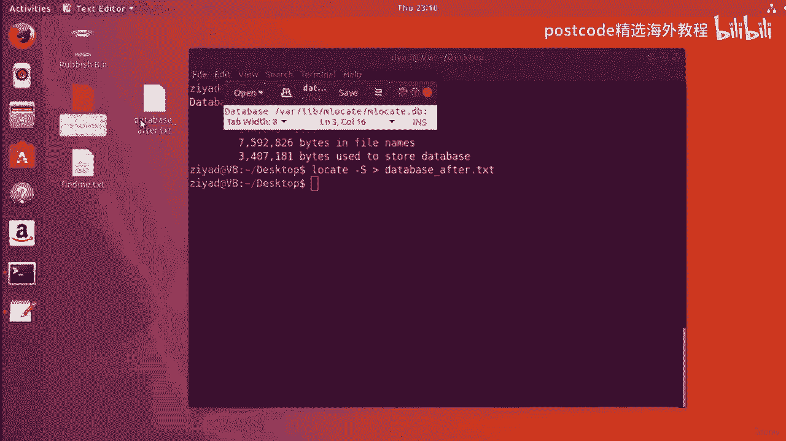

# 红帽企业Linux RHEL 9精通课程 — RHCSA与RHCE 2023认证全指南 - P33：04-04-009 Locate - 精选海外教程postcode - BV1j64y1j7Zg

好的。因此，locate 命令实际上使用起来非常简单，但非常非常有用。现在，您需要了解的关于locate命令的第一件事是它的工作原理是搜索，您系统上的数据库文件。现在。

该数据库保存有关系统上每个文件的位置信息。locate 命令的工作方式是，您将给它一些要查找的模式，然后，locate 将在数据库中搜索与该模式匹配的每个路径，并将其返回给您，标准输出。

现在这实际上非常简单，所以让我们直接开始并感受一下它是如何工作的。好的。例如，让我们尝试查找系统上以点、C、O 和 F 结尾的每个文件，现在是点，C on F 是 Linux 上常见的文件扩展名。

表示该文件是可编辑的配置，文件。因为文件扩展名对于 Linux 来说并不重要。Linux 用户和开发人员通常会留下有意义的文件扩展名，例如 。com，以便您能够理解。

仅通过读取文件扩展名即可了解该文件的内容。点日志是另一个常见的示例，它用于存储程序错误消息的日志文件，和服务器应用程序。所以你知道，你可以稍后查看这些日志文件，以防出现任何问题并查看内容去了哪里。

错误的。但是我们现在要查看以 。conf 结尾的文件，以搜索我们的 。conf 上的所有 。com 文件，系统。我们需要做的就是输入locate命令，然后给它我们想要搜索的模式。

现在您应该开始记住我们对正则表达式和通配符所做的事情。请想一想。如何制作一个与任何以 。com 结尾的文件相匹配的模式？想一想。您可能还记得，也许您需要星号通配符，然后是。com。

这表示与此模式匹配的任何内容，因此这意味着它可以从任何内容开始，然后，以 dotcom 结尾。所以这个模式将检查以 。conf 结尾的文件，这实际上就是我们需要做的。正确的。因此。

如果我们这样做并按 Enter 键。哇哦。正确的。您会看到，就像出现了一大堆不同的文件路径，但您会看到每个文件路径，这些文件之一以 dotcom 结尾。现在，值得注意的是，默认情况下。

Linux 区分大小写，但您可以使用以下命令进行搜索，通过为locate 命令提供AI 选项，使locate 命令不区分大小写。因此，举例来说，如果我们只是清除屏幕，我们确实找到并只说点conf。

但拼写所有内容，大写，现在你会看到我们实际上没有得到任何结果，因为 linux 搜索区分大小写。它必须完全是大写的，但为了以不区分大小写的方式进行定位搜索，我们，可以为locate 命令提供IE 选项。

这就是说，嘿，别担心这个案子。我只是在寻找这些字母，当我这样做时，我们会再次得到以 。conf 结尾的文件。所以这是需要牢记的事情。您还可以限制获得的结果数量。所以我们从这个结果中得到了数百个结果。

看看有多少。有很多配置文件，但是如果我们清除屏幕，我们可以说，好吧，让我们搜索一下，以不区分大小写的方式，但让我们限制它，将输出限制为仅三个结果。好的。您可以在这里看到我正在使用长格式限制选项。

所以我们有两个破折号，然后是字数限制，然后我们给它命令行参数，这是三个。所以这个限制选项的输入为三。因此，当我这样做时，您可以看到我们只是将其限制为三个结果。如果我将其更改为 5。

我们将得到 5 个结果；如果将其更改为 10，我们将得到 10 个结果，等等等等。因此，如果您只想获得前几个结果或只想找到几个结果，这非常有用，你也可以这样限制它。现在。

使用locate 命令时要考虑的关键是了解它使用数据库。事实上，您实际上可以使用大写的 s 选项找到有关数据库的信息。因此，如果我单击屏幕并使用locate 并为其提供大写的大写选项，我可以。

按 Enter 键，您会看到我们获得了有关数据库本身的一些信息。所以它告诉我们数据库文件的路径以及一些关于一般的大小，一些信息，关于数据库的一般大小和复杂性。所以我实际上将使用重定向来保存此信息。因此。

如果我使用locate，我将把它保存到桌面上的某个东西中，我们称之为数据库，在文本之前。好吧，我们在桌面上的 txt 之前有一个名为数据库的文件，其中保存了所有信息，在里面。

所以你可以看到重定向实际上是一个非常有用的技能，你会一直使用它，并且你，应该感到自豪。现在你明白如何像没事一样使用它了吧？所以这个数据库，就像任何数据库一样，只有当其中的信息符合要求时才有用。日期。

好的。现在数据库默认每天更新一次。所以这意味着在此期间发生的任何事情都不会被登录。数据库文件可能已被创建、移动、删除，除非更新数据库，然后locate命令将开始给出不正确的结果。现在。

locate 命令附带了一些选项来帮助最大限度地减少此问题。他们无法让数据库列出尚未添加到其中的文件，因为这是不可能的。但它们可以阻止locate命令显示同时已删除的文件或，不再有效的链接。例如。

有一个选项需要locate命令来检查文件是否存在，在它报告回来之前。例如，如果我们确实使用 e 选项定位以 dotcom 结尾的所有内容，那么这将，检查数据库中以 。com 结尾的所有文件。

同时还要进行检查以确保这些文件，文件在报告之前实际上已经存在，而不是直接从数据库中获取。它将从数据库中获取它们，但也会进行检查以确保它们在那里。所以它给了你额外的保证。选项有一个长格式的选项。

您可以键入现有的双破折号，而不是键入破折号 E，这会执行完全相同的操作。所以这是非常非常有用的东西。有时，您的系统上存在称为符号链接的快捷方式和链接，这些快捷方式和链接可能会损坏，如果现在移动文件。

请检查这些快捷方式和链接在之前是否仍然有效，定位命令将它们报告回来。您可以使用大写 L 或像这样的以下选项。因此，请查找以 。 com 结尾的所有内容。因此，如果存在任何符号链接或存在任何文件链接。

它将检查它们是否存在，只是悬而未决。他们实际上到达了某个地方，到达了正确的地方。为了回报。这是另一个保证。当然，您可以同时进行这两项操作。因此，存在并遵循基本上可以为您提供实现目标的最大保证。同样。

您可以将其与敏感度大小写结合起来，并将其限制为仅显示五个。您可以结合所有这些选项，向您展示 Linux 命令行的强大功能，是同时具有多个不同的功能。现在，这些安全功能都很好，但我们真正需要解决的问题是。

有办法随时更新数据库。有一个叫做更新数据库命令。出于时间考虑，我们将在这里剪切视频并学习如何更新，下一个视频中的数据库。那么我们在那里见。好的。那么让我们开始学习update DB命令。

它是update database的缩写，如何命名，正确的。因此，让我们在桌面上创建一个新文件。因此，我将转到桌面，然后创建一个名为 Find Me Dot txt 的新文件。

所以我们将使用 touch 命令，find me txt。现在我们就到了。我们在桌面上有一个名为 find me not txt 的文件。现在，如果我尝试运行locate命令。

因为这个find me文件是在我们的数据库之前创建的，已经升级。locate 命令将无法在数据库中找到它。因此，如果我尝试找到 find me not txt，我们会发现我们绝对没有得到任何回报。好的。

即使文件存在，但它尚未输入数据库，因此需要使用locate命令，通过搜索数据库找不到它。好的。因此，要更新数据库，将其添加到数据库中，我们需要更新数据库，这就是，更新数据库命令出现。因此。

如果我们尝试一下，我们会发现实际上出现了错误。该错误表明 shell 无法打开实际的数据库文件。原因就是更新。DB命令需要管理员权限才能运行，我们可以通过查看，更新数据库命令的主页。

我们在更新数据库命令的顶部看到它位于，系统管理器部分。它位于手册的第八节中，这意味着它需要提升的权限才能运行。您可以在这里看到我所说的关于每天运行更新数据库的内容。因此，如果您愿意。

可以阅读更多相关内容。但这里重要的是它在手册的第八节中，因此需要管理员，权限以便运行并参考有关手册结构的备忘单。如果您需要一点提醒以及手册各部分的作用，好的。

那么我们怎样才能获得管理员权限来运行这个命令呢？那么，为此，您可以使用 sudo 命令。我不确定它是否发音为pseudo或pseudo，但我，我喜欢pseudo，所以我们会坚持下去。所以伪命令很简单。

您只需将其写在要以管理员身份运行的任何命令之前即可。所以我要输入更新。DB 就是这样。好的。现在，当我这样做时，因为我们正在尝试获得管理员权限，所以伪命令将会执行，向我们询问密码。所以我要输入我的密码。

这是我平时登录Linux时使用的密码，计算机，但您会注意到我们没有看到任何密码被输入。现在，这是一个内置于 shell 中的安全功能，可以阻止人们知道长度，您的密码。原因是，如果人们知道你的密码长度。

破解它就会变得容易得多。因此，不必担心您看不到任何反馈。只需输入您的密码。您输入密码。它正在被 shell 接受。完成后，按 Enter 键，我们会看到 shell 在更新时会暂停一会儿，数据库。

然后我们会看到 shell 提示符，这让我们知道命令已完成。现在我们已经更新了数据库，“查找我”文件现在应该位于数据库中。那么我们来试试locate命令是否能找到它。

让我们输入“locate find me， find me”点文本。我想按 Enter 键你就会看到。是的，这次它确实找到了它，它告诉我们它在我们的桌面上，名为“查找我文本”，我们不必在桌面上。

我们可以在我们的文档文件夹中。我们可以按打印工作目录。我们看到我们在我们的文档中。但如果我找到了，请给我找到类似的东西。你会看到它带有斜线，主页斜线是广告斜线，桌面斜线找到我点文本。

所以它告诉我们实际文件在哪里。现在，如果我们也看一下数据库文件，让我们回到桌面一分钟，让我们看一下数据库文件。所以我们使用locate 和大写的C 选项。我们可以看到。

如果我将其保存为txt之后的数据库，实际上这已经改变了。所以我们到了。我们有之前的数据库和之后的数据库。如果我在看到我们有什么之前打开数据库，16，008 个目录，144，853 个文件等等。

别的。现在，如果我稍后尝试打开，我们可以在这里看到我们已经得到了 144，853 个文件之前的内容。

随后有 144，848 个文件。所以看起来有些文件实际上已经从系统中删除了或者类似的东西。七、之后有多少个得到 7，580，826 字节？是的。实际上看起来自从我们上次更新数据库以来。

一些文件确实被删除了。所以也许有一些临时文件正在运行或类似的东西。但您可以看到，当您更新数据库时，数据库的大小确实发生了变化。

但如果我再这样做一次，那么如果我在 to 之后做数据库并看一下，应该绝对没有。

这两者之间的区别。这是之后的数据库，我查看两个之后的数据库，我们会发现它们实际上是完全一样的，相同。

因此，当您更新数据库时，它现在确实发生了变化，因为更新数据库命令需要管理员，权限或者root权限才能运行，可以看到为什么存在existing和follow选项，对于定位命令。

所以你可以明白为什么这些存在。您已经存在并按照那里进行操作，以便当您等待管理员更新时，数据库，您作为普通用户仍然可以继续您的工作。即使您没有管理员权限。

