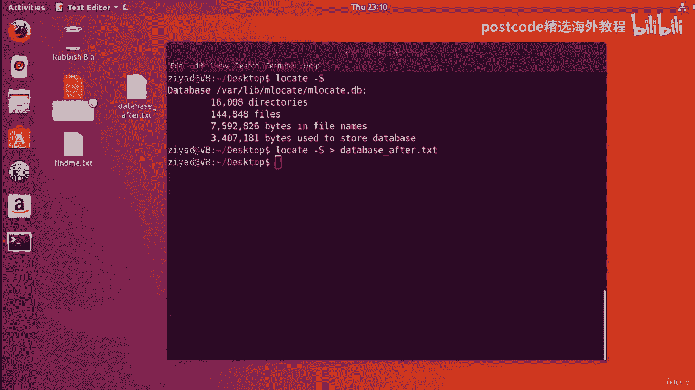
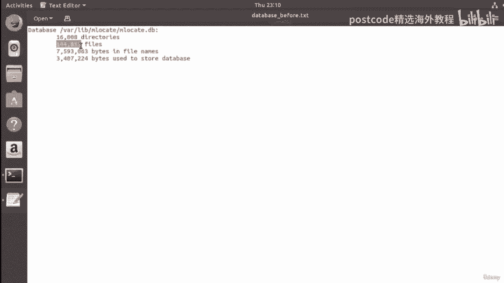
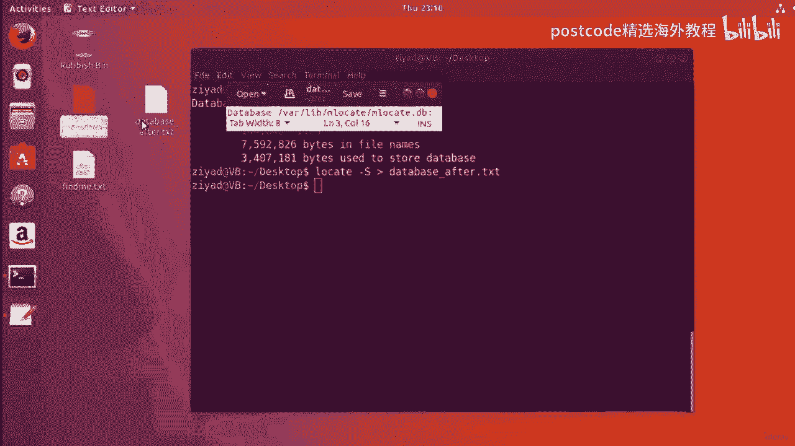
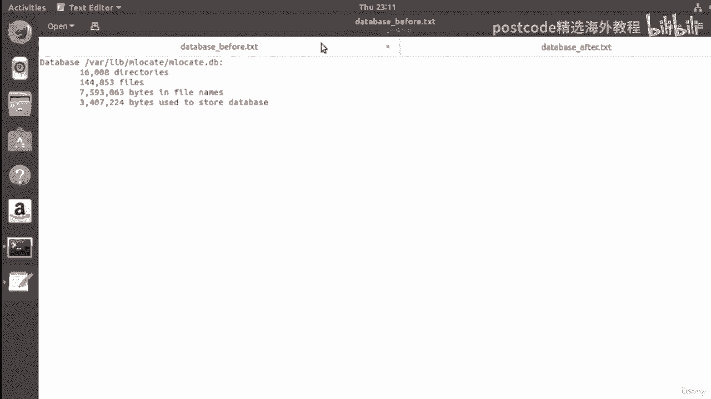
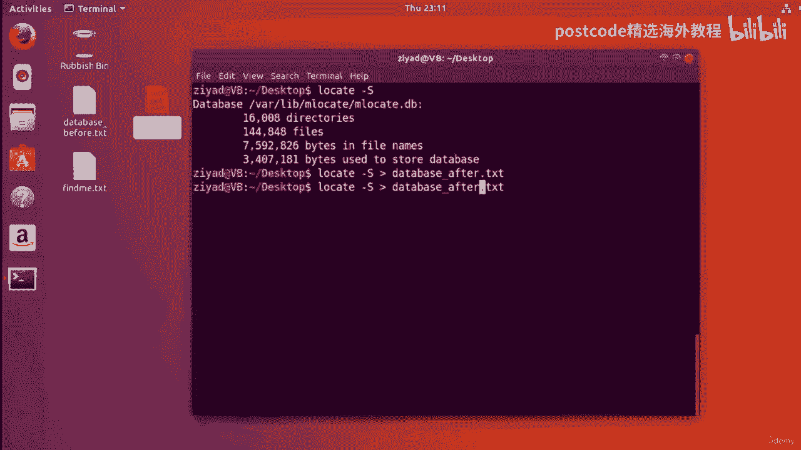
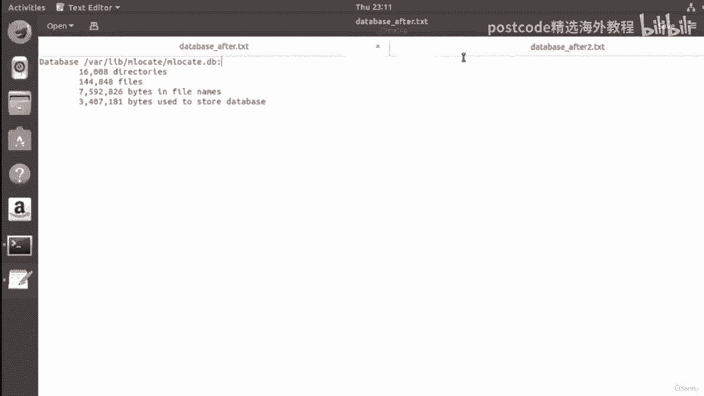
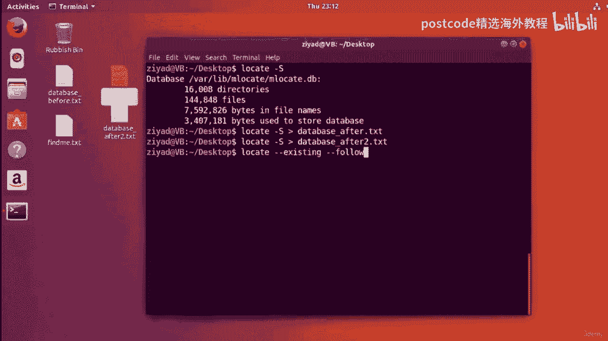

# Linux文件搜索：04-04-009：Locate命令详解 🗂️

在本节课中，我们将要学习一个非常实用的Linux命令——`locate`。这个命令能够帮助你在系统中快速搜索文件，其核心原理是查询一个预先生成的文件路径数据库。我们将学习它的基本用法、关键选项以及如何更新其背后的数据库。

## 工作原理概述

`locate`命令的工作原理是搜索系统上的一个数据库文件。该数据库保存了系统上每个文件的位置信息。当你给`locate`命令提供一个搜索模式时，它会在数据库中搜索所有与该模式匹配的路径，并将结果输出到标准输出。

## 基础用法

现在，让我们直接开始，感受一下`locate`命令是如何工作的。

例如，我们尝试查找系统上所有以`.conf`结尾的文件。`.conf`是Linux上常见的文件扩展名，表示该文件是一个可编辑的配置文件。在Linux中，文件扩展名本身并不重要，但用户和开发者通常会使用有意义的扩展名（如`.conf`或`.log`）来帮助理解文件内容。

以下是搜索所有`.conf`文件的步骤：

1.  输入`locate`命令。
2.  提供想要搜索的模式。我们需要一个能匹配“以`.conf`结尾的任何内容”的模式。这可以通过星号通配符`*`实现，模式`*.conf`表示匹配任何以`.conf`结尾的内容。

**命令示例：**
```bash
locate *.conf
```
执行此命令后，你会看到屏幕上输出大量以`.conf`结尾的文件路径。

## 关键选项与技巧

上一节我们介绍了`locate`的基础搜索，本节中我们来看看如何通过选项来优化和控制搜索结果。

### 不区分大小写搜索

默认情况下，Linux的搜索是区分大小写的。例如，搜索`*.CONF`（大写）可能得不到任何结果。为了使`locate`命令不区分大小写，可以使用`-i`选项。

**命令示例：**
```bash
locate -i *.CONF
```
这个命令会忽略大小写，搜索所有以`.conf`结尾的文件。

### 限制搜索结果数量

有时搜索结果可能非常多。你可以使用`--limit`选项（或其简写`-n`）来限制输出的结果数量。

**命令示例：**
```bash
locate -i *.conf --limit 5
```
这个命令将以不区分大小写的方式搜索`.conf`文件，并只显示前5个结果。

### 查看数据库信息

`locate`命令依赖一个数据库。你可以使用`-S`选项来查看这个数据库的信息。

**命令示例：**
```bash
locate -S
```
这个命令会显示数据库文件的路径、大小和复杂度等信息。你可以使用重定向操作符`>`将这些信息保存到文件中。

**命令示例：**
```bash
locate -S > ~/Desktop/database_info.txt
```

## 数据库的时效性与安全选项

数据库像任何数据库一样，只有在信息是最新的时候才有用。它默认每天更新一次。这意味着在此期间新创建或移动的文件可能无法被`locate`找到。

`locate`命令提供了一些选项来帮助减少因数据库过时而导致的问题。

### 检查文件是否存在 (`-e`)

`-e`（或`--existing`）选项会让`locate`在报告结果前，先检查文件是否真实存在于磁盘上，而不仅仅是存在于数据库中。这可以避免报告已被删除的文件。

**命令示例：**
```bash
locate -e *.conf
```

### 检查符号链接有效性 (`-L`)

`-L`（或`--follow`）选项会检查数据库中的符号链接（快捷方式）是否仍然指向有效的目标文件。

**命令示例：**
```bash
locate -L *.conf
```

### 组合使用选项

你可以组合使用多个选项，这是Linux命令行强大功能的体现。

**命令示例：**
```bash
locate -i -e -L *.conf --limit 10
```
这个命令组合了不区分大小写(`-i`)、检查文件存在(`-e`)、检查链接有效性(`-L`)和限制结果数量(`--limit`)的功能。





## 手动更新数据库



虽然安全选项很有用，但解决数据库过时问题的根本方法是手动更新它。这需要使用`updatedb`命令。

**注意：** `updatedb`命令需要管理员权限才能运行。



1.  **创建一个新文件用于测试。**
    ```bash
    touch ~/Desktop/findme.txt
    ```
2.  **尝试用`locate`搜索新文件。** 由于数据库未更新，此时可能搜不到。
    ```bash
    locate findme.txt
    ```
3.  **使用`sudo`以管理员权限运行`updatedb`命令更新数据库。**
    ```bash
    sudo updatedb
    ```
    系统会提示你输入密码。输入时屏幕上不会有显示（这是安全特性），输入完成后按回车即可。
4.  **再次使用`locate`搜索。** 现在应该可以找到新创建的文件了。
    ```bash
    locate findme.txt
    ```





更新数据库后，你可以再次使用`locate -S`命令并重定向输出，对比更新前后数据库信息的变化，观察文件数量的增减。

## 总结



本节课中我们一起学习了`locate`命令。我们了解到它是一个通过查询预建数据库来快速定位文件的工具。我们学习了其基础语法、如何使用通配符`*`进行模式匹配，以及`-i`、`--limit`、`-e`、`-L`等关键选项来控制搜索的精确性和安全性。最后，我们掌握了在需要时如何使用`sudo updatedb`命令来手动更新数据库，确保搜索结果的时效性。`locate`是日常文件管理中的一个高效工具。