# 红帽企业Linux RHEL 9精通课程 — RHCSA与RHCE 2023认证全指南 - P34：04-04-010 Find - 精选海外教程postcode - BV1j64y1j7Zg

正确的。所以我们现在在我们的主目录中。那么让我们继续看看 find 命令在默认情况下如何工作。因此，如果我们继续运行 find，find 命令的默认行为就是列出每一个。

文件以及文件系统中比我们当前文件夹低的每个文件夹，以及我们所在文件夹内的所有内容。因为我们当前位于工作目录中，所以如果我只是点击，如果我只是键入，查找并按，输入。

我们会看到主目录中每个文件和每个文件夹的长长列表，并在其下方。所以它将进入每个文件夹、每个隐藏文件夹并展开、展开、展开、，列出一切。例如，这里有我们的图片文件夹。它不仅会显示我们的图片文件夹。

还会显示我们在图片中有一个文件夹，名为 Holiday 的文件夹。我们必须在图片文件夹中有一个名为 Find me 6 txt 的文件，例如，我们有桌面。

我们已经找到我一点txt和我们的桌面本身视频以及我们的视频找到我三点txt。因此，我们将列出文件夹及其内部的所有内容，以及这些文件夹内是否有文件夹，然后它会做完全相同的事情。它将进入这些文件夹。

将其展开，如果其中还有其他文件夹，它将进入，进入这些文件夹并将其扩展到无限深度。它会从哪里开始尽可能深入到您的文件系统？从当前目录开始。好的。因此，这对我们来说是定位命令和查找命令之间的直接区别。

所以find命令会列出文件和文件夹，但locate命令只会列出文件和文件夹，find 命令不需要数据库即可工作。find 命令就可以立即起作用。因此它始终是最新的，因为它直接在您的文件系统上运行。

它不使用数据库，因此始终是最新的。但它的一个缺点是它比使用数据库稍微慢一些。所以这是一个需要记住的权衡。因为 find 命令会在您提供的位置列出下面的每个文件，所以您实际上也可以，例如，给它斜杠文件夹。

整个系统的基本文件夹。这将列出整个系统上的每个文件和每个文件夹。因此，如果您感到无聊并且可能想砸毁计算机，那么尝试一下是一件很有趣的事情。但你知道，如果你给它 find 斜杠 Etsy。

那么它会列出 Etsy 下面系统上的所有内容。您可以看到它为我们提供了文件和文件夹。例如，如果我给出 find、slash home、slash Ziad、slash Documents。

它会列出所有内容，在文档文件夹下方，这样我们就可以看到它为我们提供了文档文件夹并找到我，里面有txt。

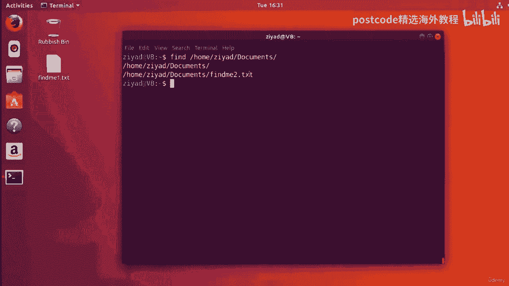

如果我做的话。伊朗文件文件夹。如果我再创建一个文件夹，我们就称之为“等等”。我们就这么称呼它并复制并粘贴到那里。我们将称之为“测试”。TXT 如果我确实再次在家庭斜线 Ziad 的文档文件夹中找到文件。

那么我们就这样做。

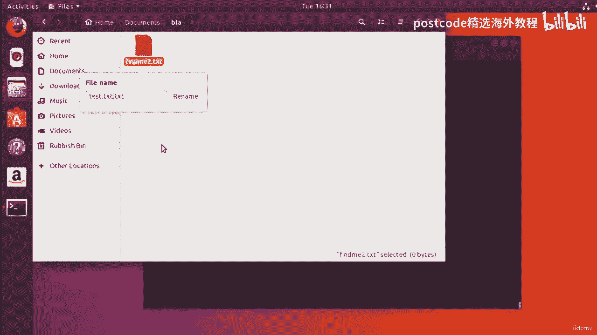

让我们做波浪号。好的。这里将要发生的事情是，您现在会看到它也完成了 blah 文件夹，并且它是，进入 blah 文件夹找到 test txt。

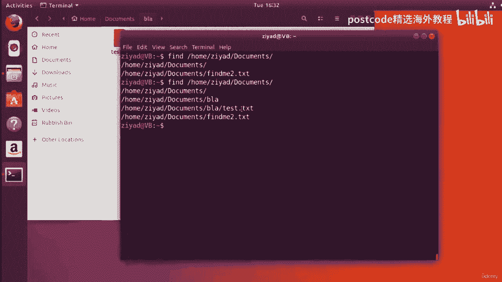

所以它说我们卖掉了它，在它列出的文档文件夹中找到我两个，它看到了另一个文件夹，这里叫“blah”，它打开了它并列出了里面的所有内容。如果我创建另一个名为 blah blah 的文件夹。

并在其中复制并粘贴它，那么它会显示 test to txt。

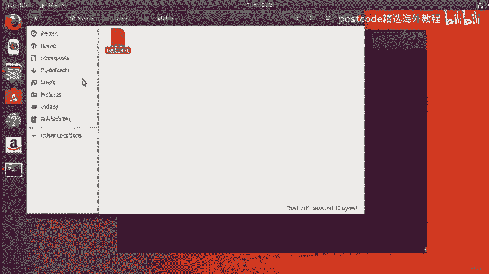

现在我只是说找到文档文件夹中的所有内容。您会看到它还列出了等等和测试二。因此，最好的命令是在文件系统中越来越深地搜索，直到无限的深度。好的，这是需要记住的事情。它从当前目录开始，所以我可以从主目录开始。

这是，无论您何时何地，我们都会及时赶到。因此，如果我开始告诉它从文档文件夹开始，它就会从那里开始并不断挖掘，深入文件系统，直到显示每个文件和每个文件夹。不管它们是否隐藏，都没关系。

它会向您显示文件系统上比该点更深的每个文件夹中的每个文件。因此，为了清楚起见，如果我转到文档文件夹，因为我当前位于文档中，文件夹，正如你可以通过P命令看到的。

如果现在我只是运行find命令并且因为find命令，默认情况下将从我们当前所在的文件夹开始。如果我这样做，你现在可以看到它开始列出与这里相同的内容，它开始，告诉我们我们已经有了 blah 文件夹。

blah blah blah，它将向我们展示测试二，并测试并找到我我们在此处的文档文件夹中得到的确切内容，因为我们是，当我们运行 find 命令时，在文档文件夹中。因此，您可以位于要开始搜索的目录中。

或者如果不在目录中，例如，我们不在斜杠等文件夹中。我们可以从那里开始搜索，它会从EDC文件夹开始搜索，并继续无限下去，从该点开始的深度。好的。这就是 find 命令的含义。它不使用数据库。

而是直接在您的文件系统上运行。所以它比locate命令慢一点，但是它非常强大。现在您已经了解了下一个视频中“查找命令”的基本功能，我们将继续，向您展示如何自定义其某些行为，从如何控制开始。

它搜索的深度以及搜索的内容。好的。因此，最终的命令搜索是从您指定的位置或默认情况下从当前目录开始。在下一个视频中，我们将了解如何控制它的某些搜索方式。

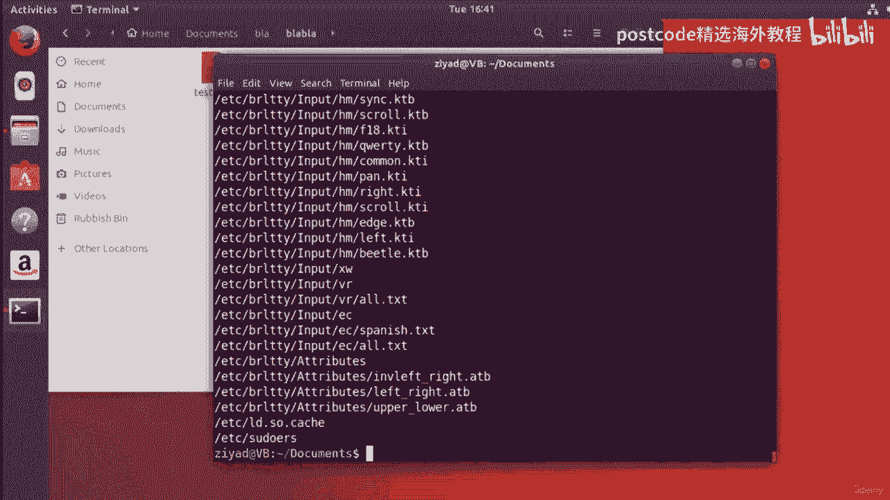

那么我们将在下一个视频中见到您。你好。谢谢你们，美丽的人们。欢迎回到我们将继续讨论 find 命令以及我们如何，控制 find 命令搜索的搜索深度。因此，如果我打开文件资源管理器，我会创建一些新文件夹。

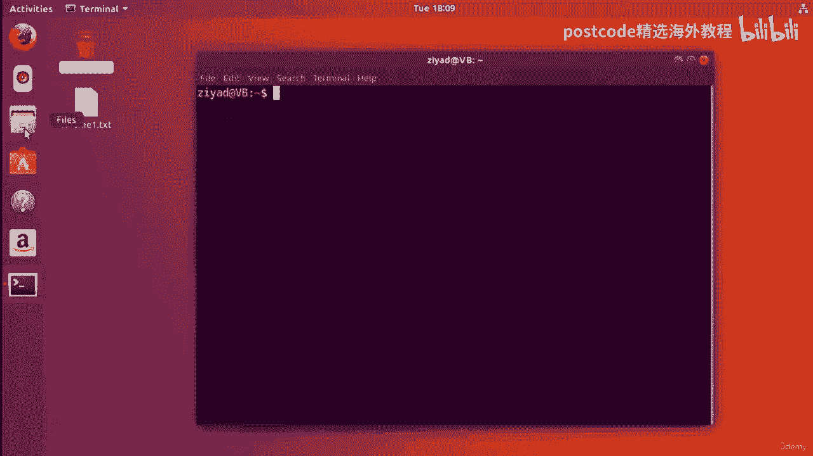

因此，在我们的文档文件夹中，我创建了一个名为“二级”的文件夹。在里面我有一个名为“two dot txt”的文件，然后是一个名为“level 3”的文件夹。

里面有一个名为三点 tfsi then level 44。txt level 5 和 5 txt 的文件，其中，它结束了。我们将使用它来看看如何控制查找的搜索深度，命令搜索到。

所以所有这些东西都在我们的文档文件夹中，正如您在此处看到的。

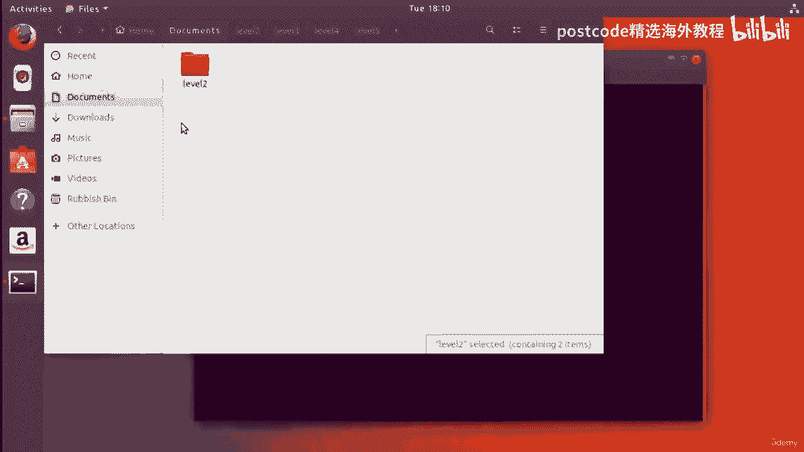

所以我要切换到我们的文档文件夹并使用LZ，你可以看到第二级是。

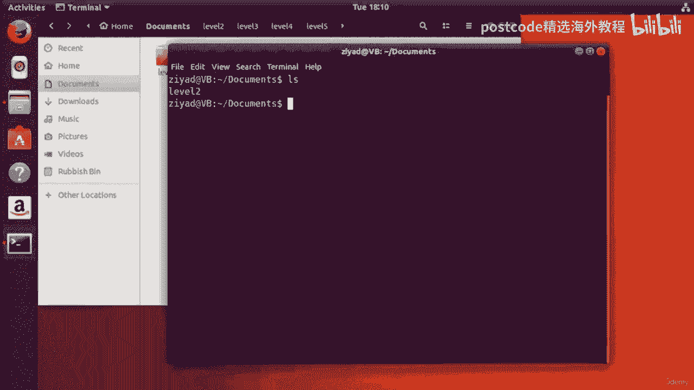

在那里。这就是我们目前看到的情况。这就是我们目前所处的情况。那么屏幕就清了，开始我们的讨论。如果我只是从这里运行 find 命令，find 命令将搜索到无限深度。

它将列出文件系统中此时的每个文件和每个文件夹。

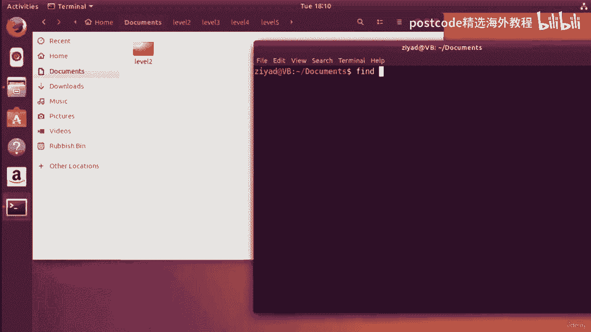

所以从这里开始向下。

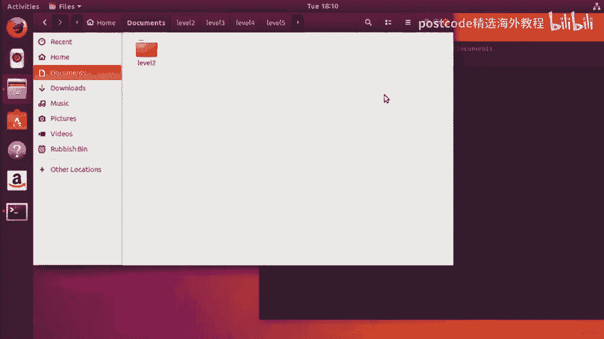

因此，如果我运行它，您会看到它向我们显示了第二级，并且它会向我们显示其中的所有内容。所以你会看到我们到达了 dot txt，它向我们显示了 level 33。txt、level 4、4。

2 SDA level 5 和，五个 SDA。所有内容都显示在那里，但我们也可以通过使用来控制 find 命令搜索的深度，最大深度选项。那么让我向您展示我们是如何做到这一点的。因此。

如果我们输入 find 我们将再次从当前工作目录开始，我们实际上可以指定，通过使用点使其更清晰。顺便说一句，记住点意味着这个目录，所以我实际上从现在开始就使用它。我总是首先说，好吧。

使用点从这个目录开始。因此，在最大深度选项中，您键入一个破折号，然后键入最大深度，然后您可以在此处指定深度。假设我们放了一个。所以你可能知道的第一件事是，Ziad，为什么只有一个破折号？

我以为你说过对于长格式选项你需要有两个破折号。嗯，没错。但对于精细命令，您只需用一个破折号来选择这些选项，因为选项太多了。有很多长格式选项。我猜他们试图通过将其减少为一个破折号来节省您的打字时间。好的。

我们到了。我们只有一个破折号最大深度，然后是一个。这表示仅搜索最大深度为 1 的深度。真的。因此，如果我们看到这一点，让我们看看会发生什么。你看这里我们只看到二级文件夹。

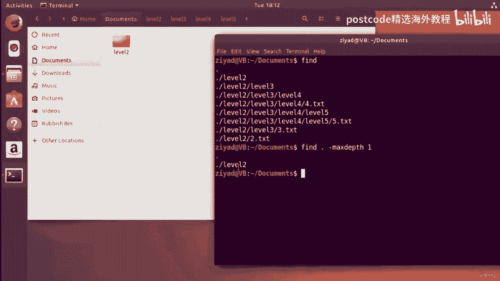

所以最大深度为 1 就像看到你在这里看到的一样。它只显示当前目录中的内容。好的，现在如果我将最大深度设置为 2，这就像是向您展示这里的内容以及下一层的内容。好的。所以如果我们看这里。

我们应该看到的是我们应该看到第二级，然后它就会消失，里面会显示TXT和三级文件夹。

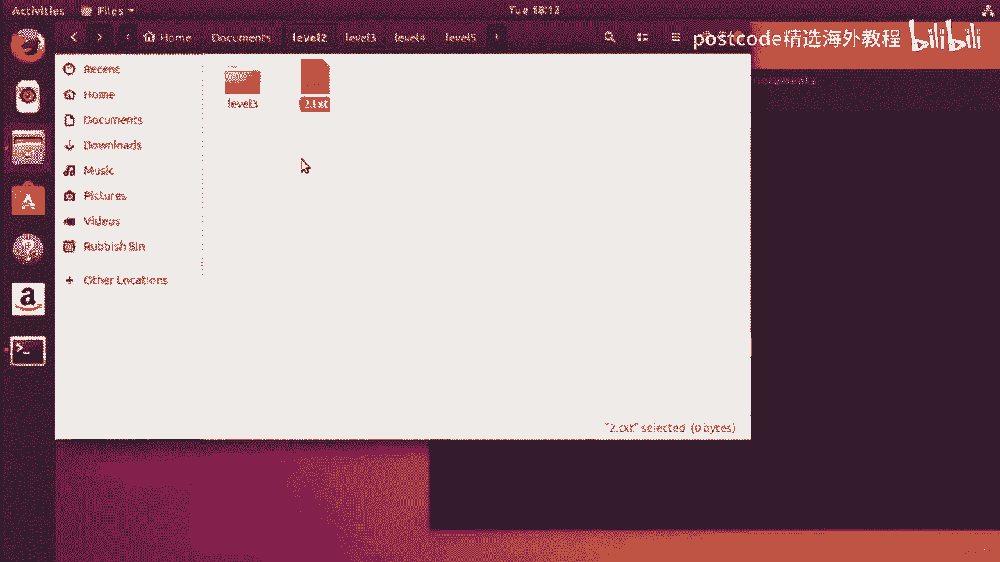

因此，如果我们运行最大深度为二，我们就在这里，我们看到第二级，它向我们展示。

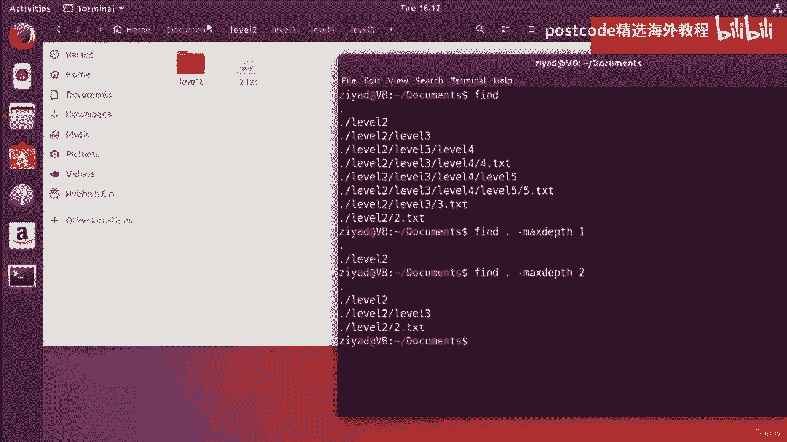

二级文件夹。这就是我们开始的地方。所以它向我们展示了二级文件夹，其中向我们展示了两个点 txt 和三级文件夹。

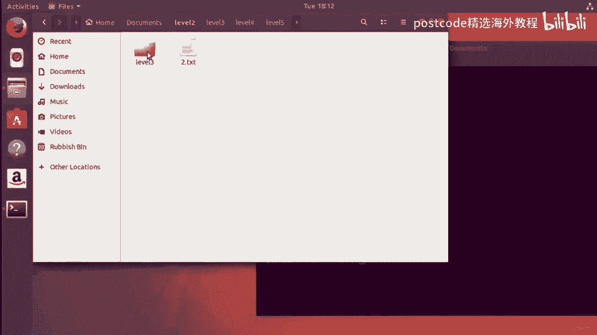

这样我们就看到了二级文件夹二、txt和三级文件夹。好的。现在，如果我们想要达到最大深度三，那就需要再下降一个级别到第三级。因此，如果我运行它。

我们现在会看到我们看到三点 txt 并将四级文件夹级别显示为，出色地。如果我们继续深入，如果我们确实达到了四个上限，我们现在就开始看看内部水平。

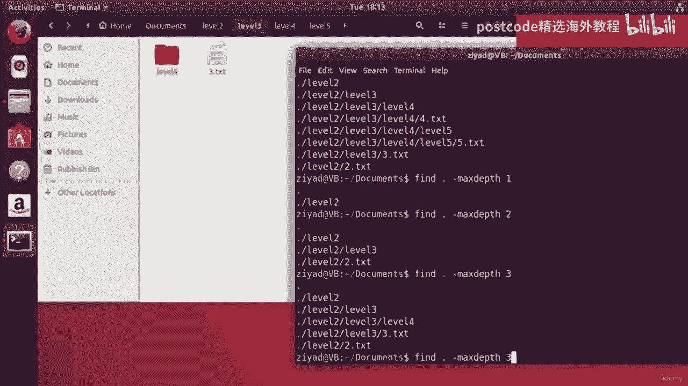

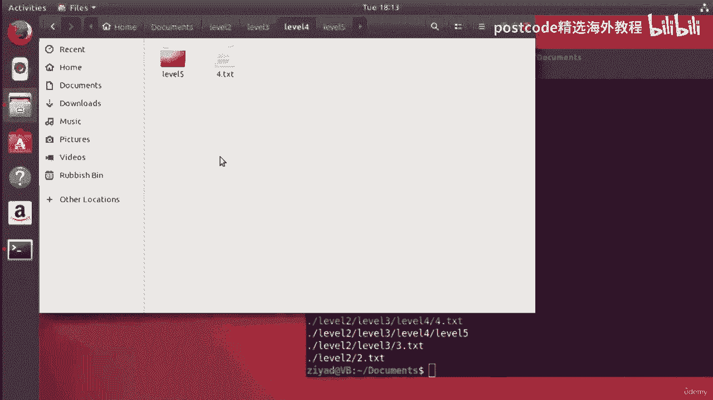

四，我们看到四点txt和五级文件夹，如果我们的最大深度为五，它就会。

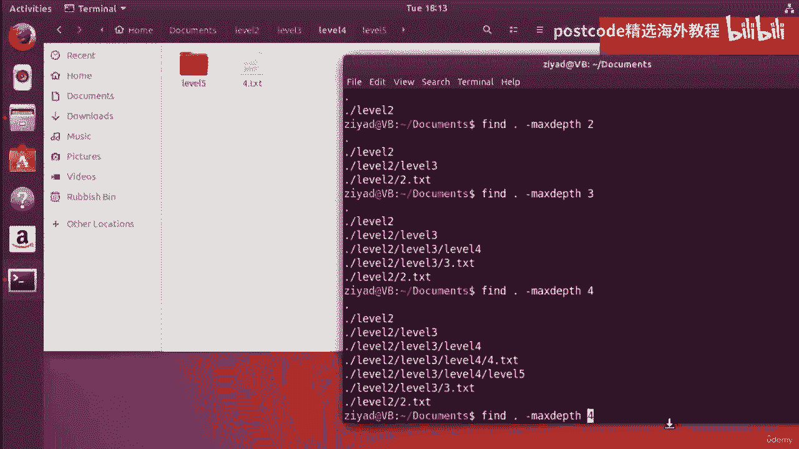

一直往下走，直到我们看到五个 txt，你可以像你知道的那样给出它，最大。

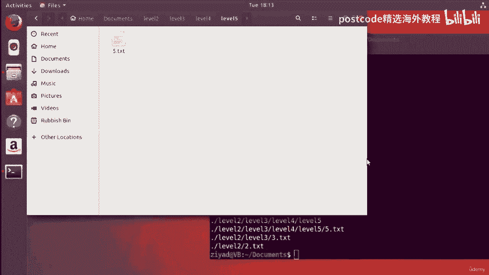

深度为 100，它仍然有效，因为您定义的只是最大深度。好的？这并不意味着事情会一直这样发展。如果可能的话，这只是它所能做到的。现在默认情况下没有最大深度，因此它将在此处列出所有内容。

如果您想一直进入文件树，我们不必指定最大深度。但如果你想限制它的移动距离，那就是当你使用最大深度选项时，你会说，嘿，我只想让你告诉我这个文件夹里有什么。当您使用最大深度为 1 时。

它对于列出当前内容非常有用，文件夹。现在，如果我们只是清除屏幕，则fine命令还有另一个非常好的选项。

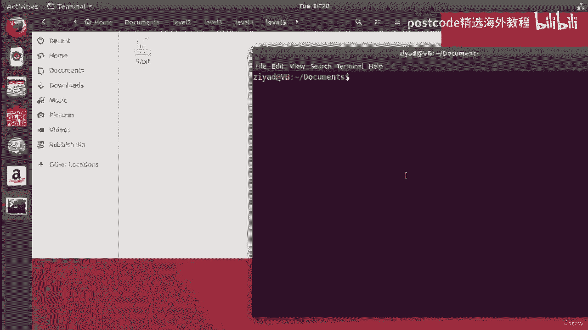

这是类型选项。因此，如果我们一直回到此处的文档，则类型选项允许您搜索。

只是文件或目录。请注意，默认情况下 find 命令列出了两者。它列出了文件和目录，但 type 选项允许您仅指定其中之一。因此，如果我从我们的文档文件夹开始，列出从此文件夹开始的所有内容，您会看到。

我们列出文件夹及其文件。但如果我说，好吧，我只想列出文件，我要做的就是再次键入 type 选项，注意到只有一个破折号，如果我只想要文件，我会输入 ff 作为文件。好的。所以如果我现在按回车键。

现在你会看到我们只得到了 4。5。文本、三点文本和两点文本。我们只是获取文件。同样地。我可以通过按而不是让 f 有 dx 来获取文件夹。所以如果我输入 d，你知道，我们现在就得到文件夹。

所以二级文件夹、三级文件夹、四级文件夹和五级文件夹开始，在此目录中。当然，您可以将其与最大深度选项结合起来。因此，如果我现在将最大深度设置为 1，那么我们所做的就是将最大深度设置为 1，然后仅显示。

文件夹。现在我这样做是故意向您展示，如果您这样放置它们，您会收到警告并，它说警告。您已在非选项参数类型后指定了最大深度选项，但选项不是位置性的。我很快就会告诉你这意味着什么。真的很快。好的。

这意味着将最大深度放在第一位。这就是你所要做的。

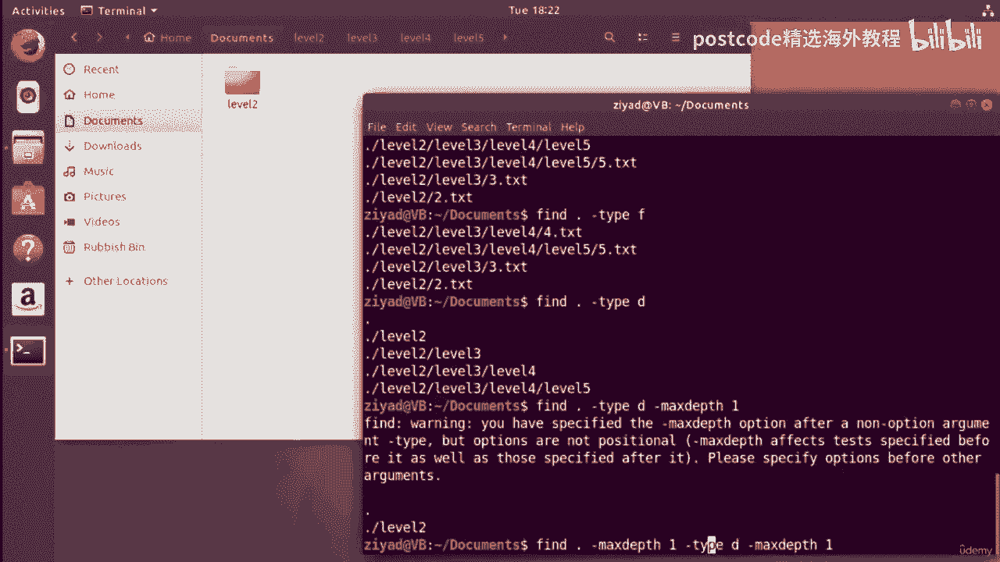

好的。这个警告就消失了。因此，如果您要指定多个选项，只需将最大深度放在第一位即可。如果我清除屏幕，您会看到警告消失。

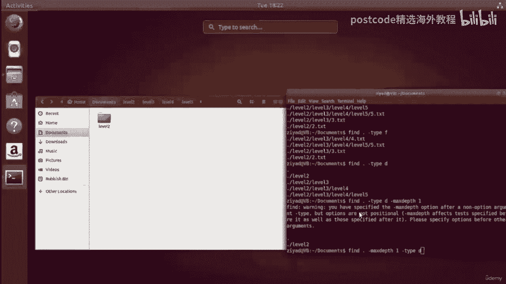

所以现在我们搜索的最大深度为 1 并显示所有目录。让我们设置最大深度为 2。我们现在看到的是三级文件夹，最大深度为四，哎呀，最大深度不是 42，今天无法输入四的深度为二三，最大深度为三。

我们将进入第三级，我们将看到第四级文件夹。如果我们进入第四级文件夹，我们将看到第五级文件夹。如果我们进入第五级并进入第五级，那不会有任何区别，因为所有这些都是。

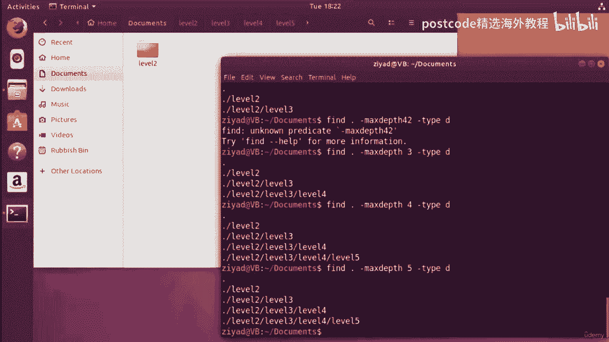

第五级是另一个未显示的文件，因为我们要查找的只是目录。

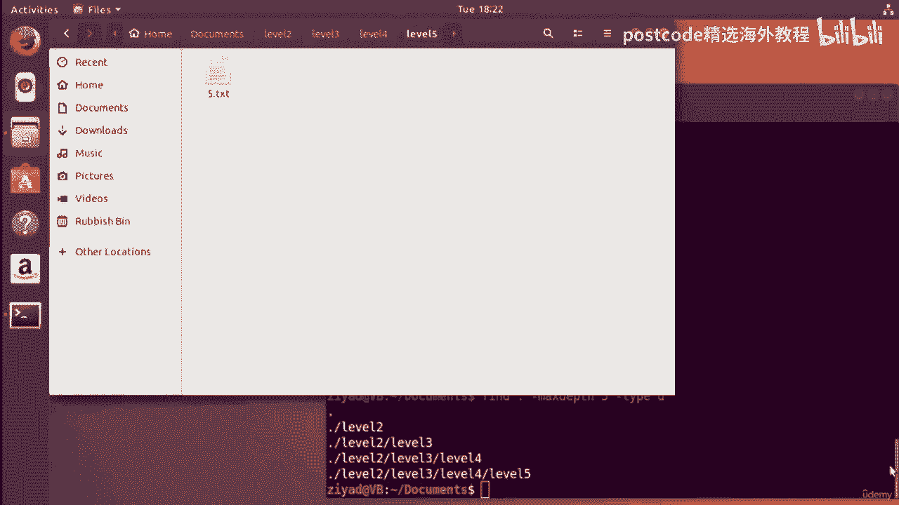

因此，如果我现在将其更改为 F，您会看到我们列出了所有文件，您知道，它完全有效，相同。因此，这些确实是组合在一起的好选择，并且您可以做很多事情，自定义 find 命令实际搜索的方式。但快速总结一下。

类型选项有两个可能的输入。您可以给它 F 代表文件或 D 代表目录。如果您打算将其与 find 命令一起使用，请确保为其提供最大深度选项，第一的。如果我们要指定从哪里开始，请确保也指定从哪里开始。因此。

如果我们要在 C 文件夹中执行操作，并且要列出 Z 文件夹中的每个文件，比方说，但最大深度仅为一。你在这。这是 Z 文件夹中的每个文件。哎呀。让我清除屏幕并执行此操作。这是 Z 文件夹中的每个文件。

没有任何目录。如果我们只想查看目录，那么它们就在这里。因此，这是一个非常有用的命令组合，它将在您的作业中非常有用。所以我要在这里打破这个视频，保持它的美好、简短和甜蜜。在下一个视频中。

我们将介绍一些您可以用罚款做的更棒的事情，命令。你好，你们这些美丽的人。欢迎回来。我们将继续讨论本视频中的 find 命令，首先展示，您如何通过名称搜索事物。

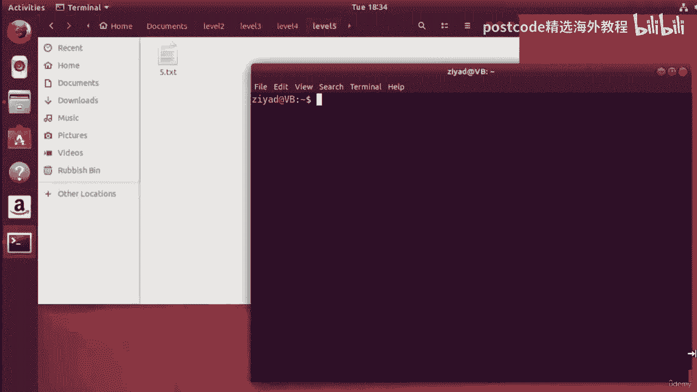

假设我们想在这里找到这个名为 Five-test 的文件，然后我们回到主文件夹。

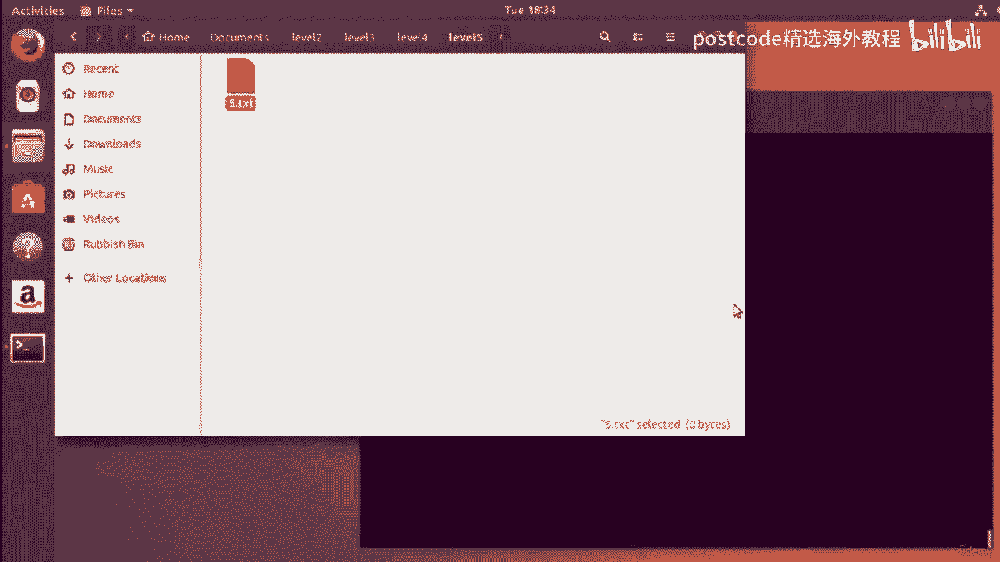

我们不再位于文档文件夹中，而是位于主文件夹中。我们知道这个五项测试位于我们的主目录中的某个位置。它位于文件系统中低于此点的某个位置，但我们不确定它在哪里以及我们要去哪里，使用find命令为我们找到它。

因此，如果我们清除屏幕，那么我们可以使用 find 命令。我们将从文件系统的这一点开始，顺便说一句，这只是个人的问题，偏爱。实际上有这个点，你不需要它，但我想把它放在那里只是为了让它更丰富一点，完全的。

好的。所以我们发现我们从文件目录中的这个位置开始，我们想要搜索，姓名。因此，我们再次为其提供名称选项，只需用一个破折号，然后在语音中即可。所以用双引号标记，我们要搜索。我们将放置我们正在搜索的模式。

我们将放置五个点的 txt，它确实需要用引号引起来，否则 find 命令会播放，起来一段时间。因此，请确保您只是将其放在双引号中的语音标记中，并且您知道那就是那样，会好很多。因此。

如果我们这样做并按 Enter 键，我们会看到精细命令确实找到了五个，dot txt ，它为我们提供了从当前工作目录开始的一路路径。那么如果我们想查找三点txt怎么办？那也会起作用。

这样就找到了三点txt的路径。您可以在此处构建正则表达式。因此，如果我加一个星号，它将在文件系统中找到从此时开始的每个点 txt 文件。所以我们看到我们在音乐方面有一个，我们在两个位置找到我。

我忘记了之前创建的，在，在，在过程中。我们在一些隐藏文件夹中有一些，我们到处都有它们。实际上，我们还可以限制搜索的深度。因此，如果我们达到最大深度，比如说两个，请记住我们将把最大深度。

选项作为第一个选项，否则我们会收到一个很大的警告，不是吗？因此，如果我使用最大深度来命名任何以 txt 结尾的名称，我们可以看到我们找到了所有，结局不在于超越，而在于深入。所以这真的非常非常酷，对吧？

您可以像这样按名称搜索，也可以使用通配符。所以我可以先做 file，然后做一个数字 txt，但什么也没有出现。如果我这么做了怎么办？如果我做了像问号点txt 这样的事情，什么也没有出现怎么办？但是。

如果我进入一个大深度，比如现在十个，我们会看到我们只得到 4。5。23。2 和两个点 txt，但这些找到我一找到我找到我四等等都被忽略了，因为它们与这个世界不匹配，这个正则表达式。

所以这是一个非常强大的能力。只需根据您对正则表达式和通配符的了解，您就可以真正定制，很好地满足您的需求。我在这里应该注意的一件事是，你不能在 name 命令内部进行 Bray 扩展。

所以这只是需要记住的事情。好的？至少，至少在双引号内。让我们把它留在那里吧。好的。所以另一件事是，您可以通过搜索名称中的点来以不区分大小写的方式进行搜索。因此，如果我在这里将其更改为 txt 全部大写。

请让我清除屏幕。现在将匹配大写的 TXT。好的。我可能做错了。如果我这样做，只需搜索名称即可。好的。现在您将看到没有任何匹配项，因为现在它正在搜索区分大小写，但如果我将其更改为我的名字。

所以搜索名称时不区分大小写，所以大写和小写现在并不重要，匹配，因为它不关心该文本是否为大写。所以这样很好。如果你不确定文件名是否大写，最好用IE名称搜索，使搜索更加笼统。现在。

使用 find 命令搜索文件的另一种有趣方法是按文件大小。假设我们想要在整个文件系统中搜索每个大于 100 的文件，千字节。那么让我们清除屏幕。我们该怎么做呢？好吧，我们要做的就是输入 find 命令。

当然，我们需要给它一个开始搜索的地方。因此，让我们从文件系统的最底层开始，因为我们想要找到系统上的每个文件。那么让我们从系统的最基础开始。我们想要搜索大于 100 KB 的文件。假设我们想要文件。因此。

让我们指定 F 的类型，因为我们只是查找文件，而不是文件夹，并且我们想要一个，尺寸。所以我们要给它尺寸选项。再次，一划。现在，这就是大于 100 KB 的说法。因此，如果加号小于减号，则加号的意义更大。

所以不到 100 KB。但我们想要的不仅仅是 100，然后是小写 k 表示千字节。因此，如果我按 Enter 键，您会看到我们得到一大堆。当我们从文件的最底部开始查找所有大于 100 KB 的文件时。

系统。但如果你快速滚动到顶部，你可能会注意到一件事，那就是我们得到了一个，很多权限被拒绝错误。如果我可以通过一直向上滚动来向您展示什么。我们开始吧。

你可以看到我们有很多权限被拒绝、权限被拒绝、权限被拒绝。原因是因为我们从文件系统的基础开始，记住 find 命令，将尝试进入每个文件夹，但无法进入，因为它没有进入所需的权限。

我们的基本目录中的一些文件夹只能由 root 用户、超级用户访问，给管理员。好的。因此，为了解决这个问题，我们只需在命令前面加上 sudo 命令即可。因此，我们将使用 sudo，然后执行其余操作。

这样错误就会少很多，因为我们，在此之前不会出现这些访问错误。我们可以通过将整个事情输送到其中来计算我们实际上从中得到的结果数量，带有 WL 选项的字命令。它的作用是计算您提供的输出中的行数。因此。

如果您注意到当我们运行此命令时，我们每行都会得到一个结果。因此，如果我们将所有这些输入到单词命令中并为其提供 WL 选项，这将计算有多少，线路有。如果我们这样做，我们会得到 3144 个结果。

这是一大堆结果。现在，有趣的一件事是将不同尺寸链接在一起的方式。所以在这里我们说它需要大于 100 KB，这就是我们所说的，小于五兆字节。因此，我们正在做的就是将所有这些不同的需求链接在一起。

我们说它必须是一个文件，并且文件大小必须大于 100 KB，并且，文件大小必须小于五兆字节。如果我们数一下它们的数量，我们会发现数量少了很多。现在我们将获得 3030 个文件，而不是 3144 个。

因此，大约有 114 个文件不再显示，因为它们大于 5 兆字节。因此，如果我清除屏幕，我真正想强调的一件事是我们链接的方式，在一起不同的要求。好的。

所以这里我们说它必须是一个文件并且大小必须大于 100 KB 并且大小，必须小于 5 MB 才能包含在我们的要求中。好的。那么我们该怎么说，好吧，我想找到所有小于 100 KB 的文件，或大于五兆字节。

好吧，我们这样做的方式，我的意思是，首先，如果我们想说小于 100 KB，我们会这么做的。如果我们想说大于 5 MB，我们需要将其更改为加号。但此刻，让我们看看我们得到了多少结果。我们将得到零结果。

因为文件不可能小于 100 KB，并且，大于五兆字节。小于 100 KB 的同时不能大于 5 MB。那是不可能的。我们想说的是，它必须小于 100 KB，也不能大于 5 MB。

并且它需要小于 100 GB 或大于 100 大于 5 MB。执行此操作的方法是在两个要求之间键入 a-0。所以我们在这里所说的是它必须是一个文件并且其大小必须小于 100 KB，或大于五个。因此。

如果我们这样做，您现在可以看到我们得到了一大堆结果，199，112 个结果。现在，你可以对这个、这个和忽略感到非常疯狂，但我认为这会起到我认为的作用，暂时就可以了。如果您熟悉布尔值。

您也可以不进行其他不同的逻辑运算，逻辑，但如果您想通过查看手册页找到更多信息，我将把它留给您，它会，只是通过视频来展示有点混乱。我们在这段视频中介绍了很多内容。

我们已经了解了如何使用 Fine 命令的 name 选项。因此，您按名称搜索事物，因此您使用破折号名称，然后用双引号将其括起来，例如，您希望文件名匹配的正则表达式。

这样我就可以做任何以点 txt 结尾的事情，例如，使用星号通配符，这将为我们提供所有以 txt 结尾的文件。您可以使搜索不区分大小写，这样大小写就无关紧要了，通过使用名称选项。

所以现在即使我们用大写形式表示 dot txt，但这并不重要，因为我们使用的是名称，选项。因此，我们首先研究的是如何按名称查找文件。然后我们研究了如何通过文件大小查找文件，您发现您使用了大小，选项。

然后给它一个特定的文件大小，加号表示上面，减号表示下面。或者你实际上可以准确地给出它。例如，500 兆字节。这正好是 500 兆字节。这超过了 500 兆字节。这低于 500 兆字节。顺便说一下。

大写的 G 是千兆字节。您可以在 Find 命令的手册页中找到更多相关信息。但在下一个视频中，我们要做的是我们将跳到一些非常令人兴奋的内容，东西。

我们将向您展示如何使用 find 命令不仅可以为您提供整个，一堆结果，但在同一个命令中还执行另一个命令，甚至另一个管道，这些结果中的每一个。所以这是一个让你在 Linux 命令行上工作的涡轮增压器。

我希望你非常，很兴奋。因此，让我们在这里剪切视频并跳到下一个视频，我们将学习如何获得均匀的结果，更多超能力。

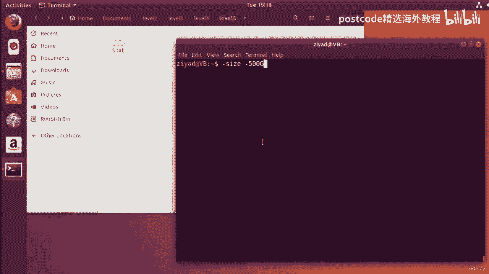

你好，美丽的人们。欢迎回来。现在在本视频中，我们将讨论 find 命令最强大的功能之一，老实说，对于一般的命令行来说。这就是当你从精细命令中获得大量结果后，你可以如何。

可以获取这些结果并对每个结果执行另一个命令。这是一种非常强大的能力。所以我希望你非常非常非常兴奋。所以你可以在这里看到我在桌面上使用 PW 命令，我们将创建一个目录，这里称为复制复制。好的。

注意到我有一个下划线来代表空间，这是很好的做法，正如我所提到的，之前给你，停止命令行混乱。好的。那么我们要做的，好吧，假设我们要在整个文件系统中搜索每个，大于 100 KB 且小于 5 MB 的文件。

所以我希望你尝试写出该命令。那么，您如何从最基础的目录开始，找到系统上的每个文件，然后，大于 100 兆字节且小于 5 兆字节。好的，现在暂停视频，尝试一下，然后回来看看你做得如何。你过得怎么样？

你做到了吗？如果你这样做了，我为你感到骄傲。这就像您在使用命令行时经常使用的一种技术。我真的非常非常自豪你拥有这项技能，如果你没有，熟能生巧。不用担心，稍后您在完成作业时会得到大量练习。好的。

但这就是我要采取的方式。好的。我将使用 Fine 命令，我们从基本目录开始。所以我们要按，我们要输入斜杠，我们要指定我们只需要文件，通过使用 type 选项。

那么我们会说大小必须大于 100 KB 并且大小必须小于，超过五兆字节。现在，因为我们从这里的基本目录开始，以确保我们的 find 命令具有以下能力，要进入每个文件夹，我们将为整个命令添加伪前缀，否则。

我们获得许可、访问错误，但我们不想要这些。因此，让我们以管理员身份运行整个命令。好的。所以如果我们运行它，好吧。我们将找到一个大的结果列表，我在密码中给出的内容，我将找到一个，大量结果列表出来了。好的。

顺便说一句，当这些东西运行时，您实际上可以取消它运行任何命令，在命令行上按住 Ctrl 键并按 C。好的。如果您知道命令花费的时间太长或者您输入了某些内容，这将停止命令运行，错了，你意识到了这一点。

并且你不想等到事情结束。但我们得到了一大堆结果，实际上我们可以告诉你有多少结果，当它让我们，通过将其通过管道输送到字数统计命令来查看 C。您可以看到我们有 3031 个结果。所以这是相当多的结果。好的。

现在假设我们想要复制这些文件中的每一个，每一个文件 3031，与我们的查找命令条件相匹配的结果到此复制此处文件夹。我们该怎么做呢？好吧，我们这样做的方法是使用另一种选择。如果我清除屏幕。

请使用 find 命令的另一个选项（称为 exec 选项）。现在确切的选项代表执行。

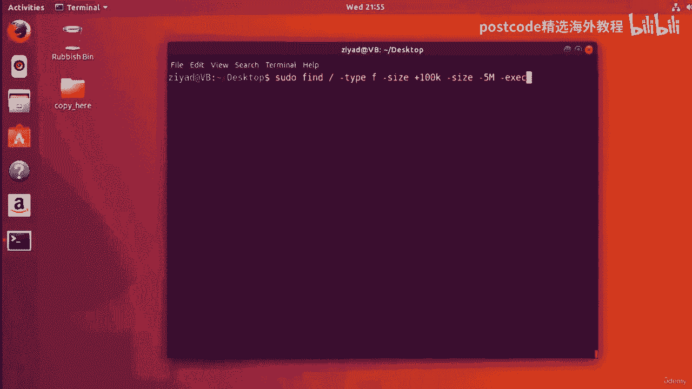

我要做的是最大化屏幕，以便更容易看到。所以我们说，好吧，一旦您对每个结果进行了搜索，就执行一些操作。现在，您只需像平常一样键入命令即可。所以我们会说复制，因为我们将使用 CP 命令来复制，你知道，就像。

我们通常会的。现在，如果您首先记住复制命令的工作原理，您要做的就是说出要复制的内容，然后你说在哪里，好吗？所以你说你想复制什么，然后你说在哪里。好吧，我们知道我们想要将其复制到哪里，它将在我们的桌面上。

它将在，复制此处文件夹。这就是我们复制此处文件夹的路径，斜线主页，斜线广告，斜线桌面，斜线副本，这里。我们可以把它写得短一些，只需将波浪号也放在那里即可。那就好了。好的。但我们要复制什么？好吧。

我们想要复制这些文件中的每一个。表示的方式是使用一对方括号。因此，您输入一些波形括号，填充该空间的是这些文件中的每一个。所以反过来它会说将文件一复制到此目录，然后它将文件二复制到此目录。

目录并将文件三复制到该目录。这样我们就得到了全部 3000 个结果。当您构建这些表达式时，如果您需要的话，您可以拥有多个这些表达式，无论出于何种原因你的命令。但是一旦你像我们一样创建了它，我们就会说。

好吧，找到每个更大的文件，大于 100 KB 且小于 5 MB。找到所有这些后，对其执行复制命令并将其复制到我们的“复制此处”目录，在我们的桌面上。然后，一旦你完成了所有结束命令的操作。

你不只是按 Enter 键，你还可以，当你完成执行选项时告诉它。执行此操作的方法是按反斜杠，然后按分号。所以你看到反斜杠和分号，这就是命令完全完成的情况。因此，如果我继续运行它，然后等待一会儿。

直到 shell 提示符返回，会发生什么。

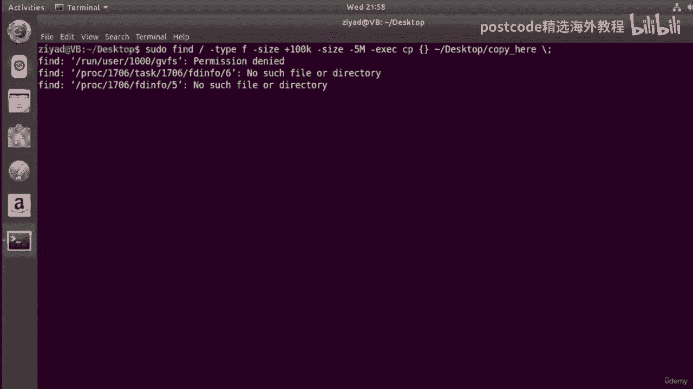

它所做的是将这些选项中的每一个复制并粘贴到我们的“复制此处”文件夹中。所以我想如果我现在停止它然后关闭它并转到复制此处文件夹。

我们开始吧。您会看到我们实际上已将这些文件中的每一个都复制并粘贴到我们的副本中，目录，或者至少与我停止运行命令之前一样多。那么，我们成功地使用 find 命令不仅找到了我们想要的东西，这不是很棒吗。

不仅可以对整个系统执行命令，还可以对每个结果执行命令。顺便说一句，根据您运行的硬件类型，运行此命令，整个过程可能会给您的计算机带来一些麻烦。因此，如果您发现虚拟机崩溃，只需尝试运行整个命令即可。

最大深度为四来保存它，你知道，找到文件系统上的每个文件，这应该，无论如何，都可以显着减少计算机上的负载，并且最大深度为三和，如果您发现虚拟机崩溃，您应该知道停止任何问题。但首先。

我希望您现在做的就是看一下这个命令。那不是很棒吗？我的意思是，考虑到你可能对 Linux 命令行一无所知，几个视频前。现在你看到这个命令时，你可能会想，哇，如果我真的走到那么远并且，事情就是这样。

Linux 命令行并不复杂得令人难以置信。这只是一些概念，如果向你解释得不好或者你不太明白它们的意思，这意味着，这绝对是一场噩梦。但是一旦你理解了它们，就很容易理解，你知道，这里只需要几个构建块。

构建一些极其强大的东西。因此，您在这里找到了一种搜索系统中 100 KB 到 5 MB 之间的每个文件的方法，大小，然后只需一个命令即可将它们全部复制到特定文件夹。但现在你知道该怎么做了。

所以我认为这太棒了。我真的只是想在这段视频中暂停一下，只是想说我为你所做的一切感到非常非常自豪，就到此为止了。在本节的第四部分的结论中，您将获得更多的祝贺，当然。现在。

我想做的是在这里继续讨论这个 exec 选项。这个 exec 选项很棒。它允许我们执行命令，但这并不是最安全的。因此，如果您可以做的不是使用确切的选项，您实际上可以键入 OC 选项。这将会做同样的事情。

它的工作原理完全相同。你不需要改变任何东西。但不是直接采取行动。所以如果我尝试这个，它现在每次尝试复制某些东西时都会问我是否是，好与不好。所以如果我输入 Y，它就会继续。如果我输入 Y，它就会继续。

如果我打字，不，不会。等等。所以我在这里可以选择它对每个文件的作用。现在，如果您有数千个文件，这显然会是一个巨大的痛苦，但这是一件好事，请记住，如果您正在对几个文件执行某些操作。

并且您正在执行一些破坏性的操作，例如，删除或移动文件而不仅仅是复制，就像在本例中一样，并且您需要双重确保，确保没有出现问题，您可以使用 OC 选项而不是 exec 选项来准确执行，同样的东西。

所以OC选项和execute选项是完全一样的。从现在开始，您无需更改任何其他内容。只是，请记住，你知道，它比使用确切的选项更安全，但是，您知道，如果您有数千个文件需要这样做，那将是一个巨大的痛苦。

正如我所说，我真的非常为你在本节中取得的进展感到自豪，在这个视频中。顺便说一句，您可以通过按 control 和 c 来取消退出 OC 选项，你看我刚刚在这里完成了。

当然你可以通过按 control 和 l 来清除屏幕，但是什么，我想在下一个视频中做到的是我们要把这个发挥到极致，好吗？我们将通过一些发现来真正地向您展示精细命令的强大功能，大海捞针之类的活动。

在下一个视频中，我们将创建一个名为 Haystack 的文件夹，其中包含 500 个其他文件夹。在每个文件夹中，我们将创建另外 100 个文件。利用我们对大括号展开的了解和知识，这将非常容易。

但在其中一个随机文件夹中，我们将创建一个名为 Needle Dot txt 的文件，并且，然后我们将使用find命令大海捞针，并将其移入我们的家，目录。好的。因此，我们将从大约 50。

000 个可能的文件中找到一个并将其准确复制到我们需要的位置。这将是很容易做到的。你不会相信的。所以我们要做的是转到下一个视频，我们在那里见。

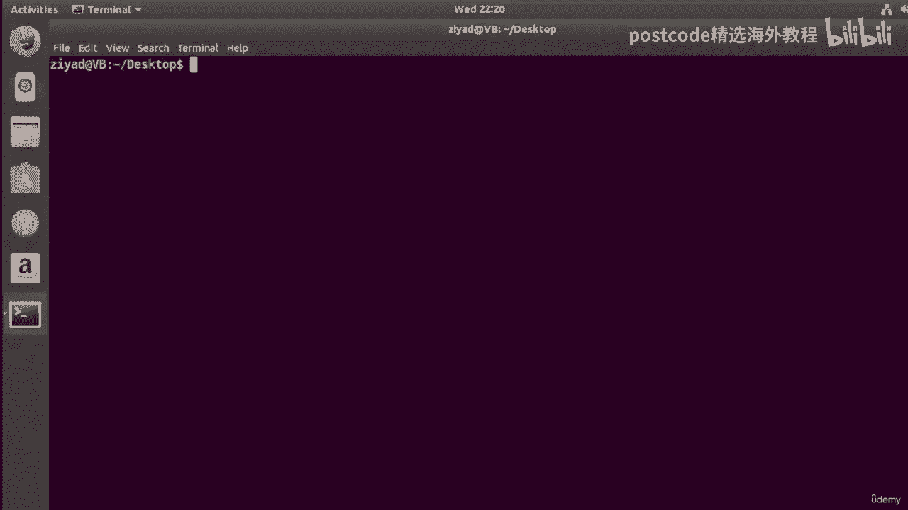

大海捞针。你好，美丽的人们。欢迎回来。那么让我们继续使用 find 命令进行工作。完全极端。好的。因此，让我们继续在桌面上创建一个名为 Haystack 的文件夹。好的。所以它就出现了。

我们在这里要做的是制作 500 个文件夹。现在，我想看看你是否能记住如何做到这一点。如果您还记得如何使用大括号扩展来创建 500 个文件夹，这些文件夹称为文件夹一、文件夹。

2、文件夹3一直到文件夹500。所以继续暂停视频。现在尝试使用大括号扩展将文件夹 1 变为 haystack 文件夹内的文件夹 500，然后，回来看看你过得怎么样。你过得怎么样？你做到了吗？如果是的话。

记忆力真好。如果没有，别担心。有一阵子了。因此，让我们实际尝试一下，看看我们能否正确地做到这一点。我们要做的是 make directory haystack斜线文件夹 1。 500。

这就是说在 haystack 文件夹中创建文件夹 1 到 500。当我按下回车键时，我们会在干草堆中查找。和。我们那里有 100 个文件夹，我可能应该更改布局。我们开始吧。文件夹一二，文件夹500个。

尝试用鼠标执行此操作，然后指向并单击它将永远持续下去。我们就这样吧。我们已经做到了。现在，我们需要在每个文件夹中创建 100 个文件。500 个文件夹中的 100 个文件。这是正确的。事实上。

这并不难做到。因此，挑战数字，看看您是否能记住如何使用带大括号扩展的 touch 命令来，创建 100 个文件，称为文件一，文件到文件三，直到 500 个文件中的每个文件创建 100 个文件，文件夹。

所以，继续尝试一下，然后回来看看你做得如何。好的。你是怎么做到的？那有点难。希望你明白了。如果没有，别担心。我本来就是这样做的。所以我会使用 touch 命令，因为这是我们用来创建文件的命令。我会说。

好吧，在 haystack 文件夹中，在文件夹 1 到 500 中，我希望你制作文件 1 到 100。因此，如果我继续这样做，我们将在每个文件夹中看到它。

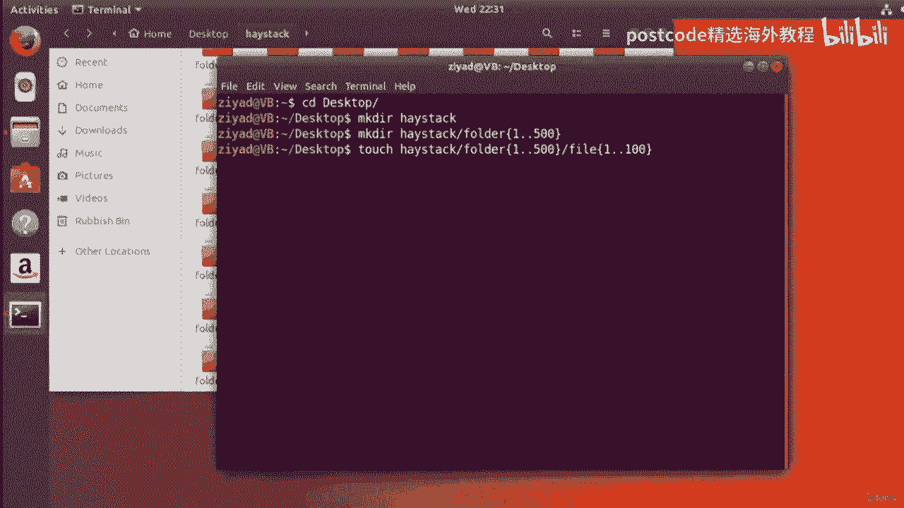

现在，我们应该有 100 个文件。所以我们就到了。文件夹一现在有文件一、二、100。

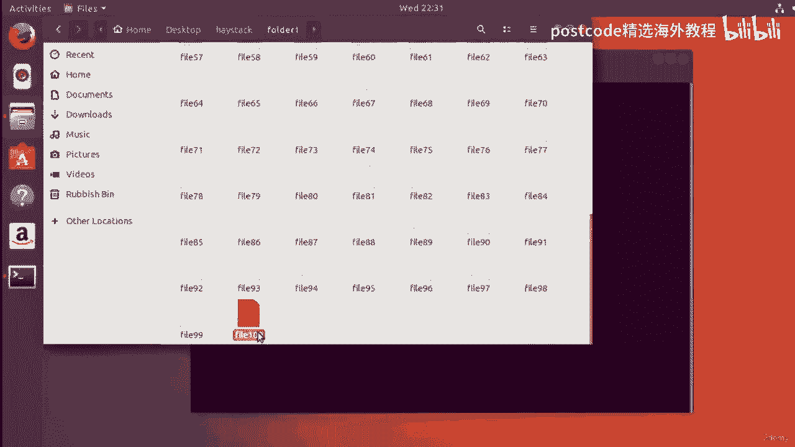

如果我在这里再选一个，文件夹26，文件1到100等等。如果我们一路向下查看文件夹 402，就会打开 100 个文件。因此，当您获得所有这些不同的部件时，您现在就可以真正开始了解外壳的威力有多大。

您可以一起使用。好的，现在我们所做的就是在这 100 个文件中的每一个中创建一个名为 Haystack 500 的文件夹。如果我没算错的话，大约有 50，000 个文件。

现在我们要做的就是在这里输入一些内容。不用担心它是如何工作的，但我将在这里输入一些代码，在其中一个文件夹之一中创建，在 1 到 500 的文件夹之一中创建。嗯，我们要做的是找到一个文件。

我们要创建一个名为needle的文件，TXT。所以这意味着触摸随机文件夹。可以是文件夹 1 到 500。该文件中的任何随机数称为needle dot txt。

所以我们在大海捞针的某个地方创建了一个名为needle的txt文件，但我们不知道在哪里。现在我们的工作是使用 find 命令来找到它。那么我们怎样才能找到针呢？让我们通过这件事来解决一下吧。

清除屏幕并将其最大化。

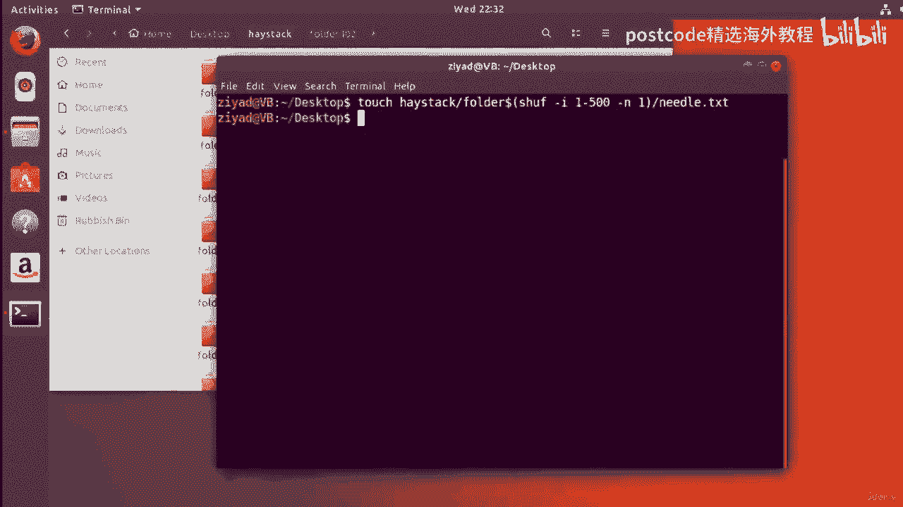

那么让我们看看如何做到这一点。首先，我们将使用 find 命令并开始。我们要从哪里开始呢？我们可能从 haystack 文件夹开始。好的。我们知道它在干草堆里。所以我们将从那一点开始搜索。

我们知道这是一个文件，对吧？所以我们不需要查看所有目录，但请记住 find 命令默认情况下会。

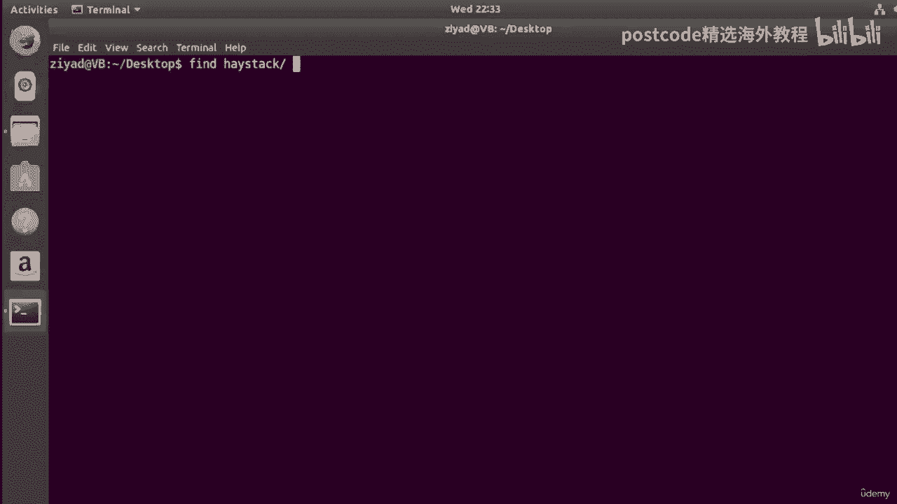

列出文件和目录。所以我们需要担心搜索所有搜索和返回的文件夹。

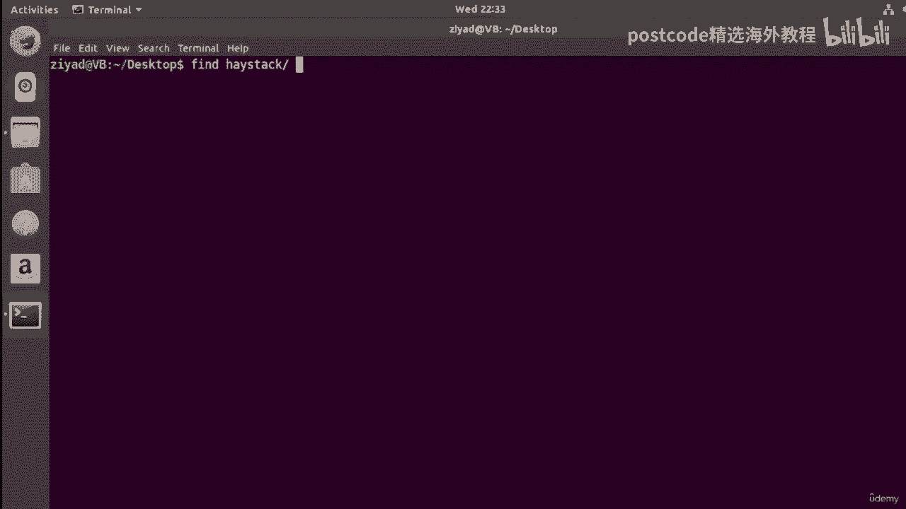

让我们查找文件，我们知道它的名称是needle dot txt，不是吗？好的。因此，如果我们这样做并按 Enter 键，让我们看看它是否有效，并且里面有找到的针点 txt。

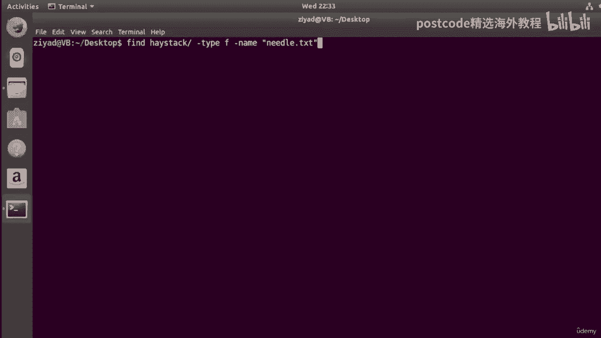

文件夹 449。那有多棒呢？正确的。我们已经大海捞针了，但现在让我们尝试将其移至桌面。好的。为此，现在我们已经得到了结果，我们将使用 exec 选项来执行某些操作，它。现在要移动一些东西。请记住。

您需要输入 move，然后输入要移动的内容以及要将其移动到的位置。当然，请记住，我们必须以反斜杠分号结束所有内容。好的？这就是结束 exec 选项的方式。所以我们现在要把一些东西搬到某个地方。

我们想把它移到我们的桌面上。因此，我们只放置一个波形符斜线桌面。好的？这就是我们的桌面。这就是我们要移动它的地方。我们要移动什么？好吧，在该文件中，我们只需放置一个正方形，一组花括号。

它的工作原理与一个相同，文件就像 100，000 份文件一样。所以手指交叉。如果我们继续这样做，我们按 Enter 键。现在，如果我关闭终端并查看我们的桌面，哇。

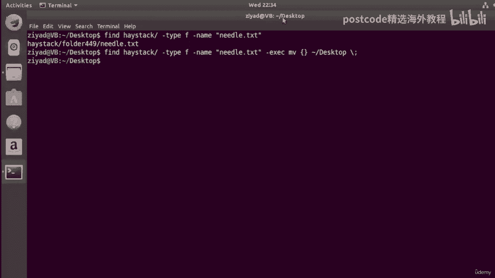

我们实际上已经做到了。我们已经成功地从潜在的干草堆中的某个地方一直移动针点文本，50，000 个文件。

