# 红帽企业Linux RHEL 9精通课程 — RHCSA与RHCE 2023认证全指南 - P35：04-04-011 View - 精选海外教程postcode - BV1j64y1j7Zg

因此，我们要查看的第一个命令是 cat 命令。现在，你还记得我之前跟你讲过的那些小猫笑话吗？嗯，喵。现在您实际上已经见过 cat 命令了。所以这将是一个相当不错的复习。

所以你可以在我们的桌面上看到我们有一些文件。我们已经得到了文件一、文件二、文件三、文件四和文件五点txt。那么让我们看看第一个文件里面有什么。但我们不是打开它，而是在终端中查看文件内的内容。好的。

所以如果我们输入 cat 然后 file。哦，我需要在桌面上，不是吗？那我就换个桌面吧。我单击屏幕，然后输入 cat 并归档 one dot txt。我要按 Enter 键。

我们将看到文件的内容已被写入标准输出，并且我们可以看到，文件包含单词 hello。

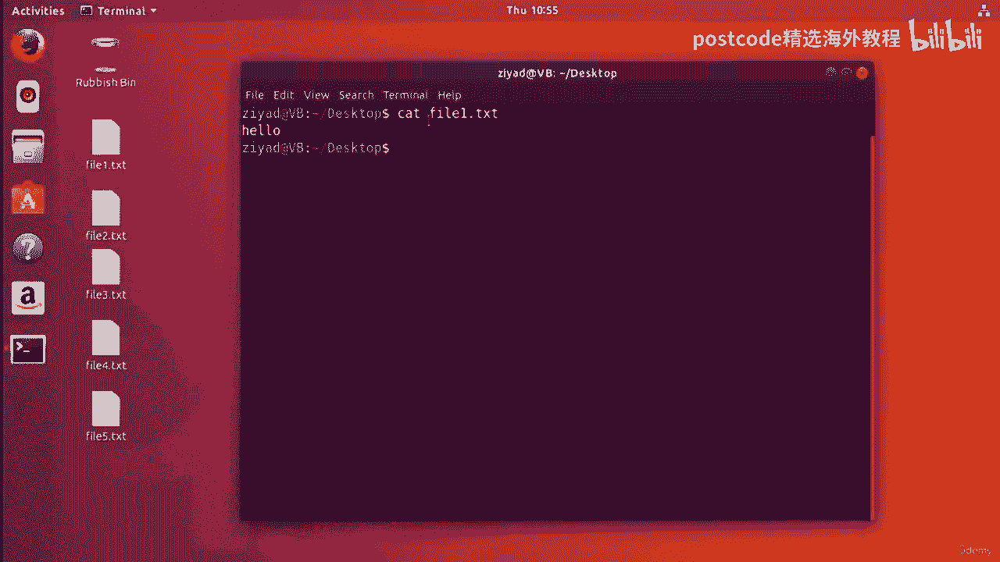

现在，如果我双击它并以图形方式打开它，我们就可以看到它。是的，该文件仅包含单词 hello。好的。因此，使用 cat 命令，我们设法将文件的内容打印到标准输出。

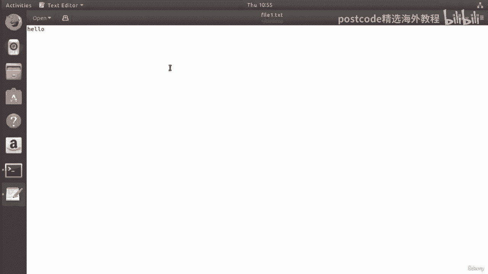

好的。那么让我们尝试看看第二个文件中有什么内容。好的。所以如果我们对txt进行cat文件，我们可以看到里面有这个单词。唔。我想你可以想象这是怎么回事。正确的。所以如果我去归档三，它会说你归档。查看文件。

它说美丽。我打赌我们都能猜到第五号文件里有什么。所以如果我按 5，它会说“人”。好吧，如果你把所有五个文件放在一起，它就会说你好，你们这些美丽的人。嗯，真是巧合啊。我想知道这是怎么发生的。所以，事实上。

您实际上可以使用 cat 命令将文件粘在一起。这实际上通常就是它的用途。Cat 是“concatenate”一词的缩写，是“粘在一起”的一个奇特词。所以 cat 所做的就是将所有输入文件粘在一起。

然后传递粘在一起的东西，到标准输出。因此，如果我们这样做，如果我单击屏幕，如果我们执行 cat 文件一 ​​txt 文件二 txt 文件三 txt 文件，txt 和文件五点 txt，然后按 Enter。

你可以看到这一点。你好，你们这些美丽的人是通过将五个不同的文件粘在一起制成的，然后，已打印到我们的标准输出。但是我们当然可以将其重定向到桌面上名为 Beautiful txt 的新文件。

我们会看到该文件，已在这里创建。当我们打开它时，我们现在看到我们有一个新文件，上面写着“Hello，are you beautiful people”。

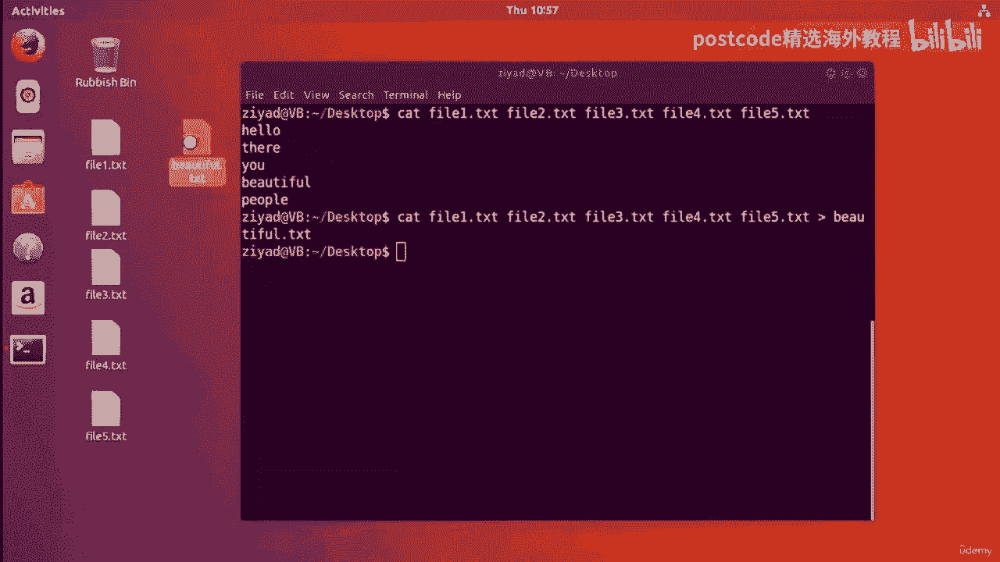

它是通过将其他五个文件粘在一起创建的。

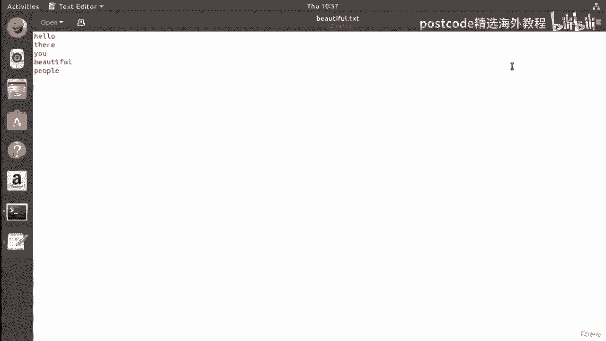

现在我们实际上可以看到这里的命令行相当长，对吧？好吧，我们实际上可以利用我们的通配符知识来简化它。因此，不要使用 cat 文件 1。2，而是查看文件两点文本、文件三点文本、文件 4。2 和 55。

TXT。你可以像这只猫一样使用通配符将 1 到 5 点的 txt 文件一起添加到 beautiful。txt 文件中。因此，如果我删除漂亮的 txt 并运行该通配符，它​​会再次创建，我们可以看到。

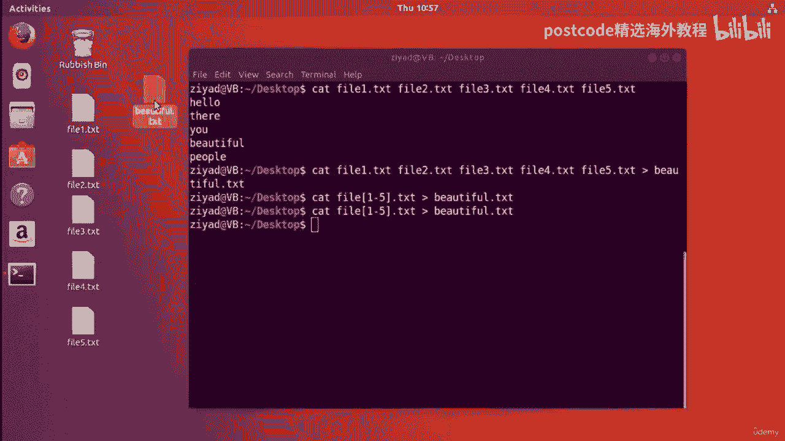

是的，我们得到了完全相同的结果。你好，你们这些漂亮的人，但打字少了很多。

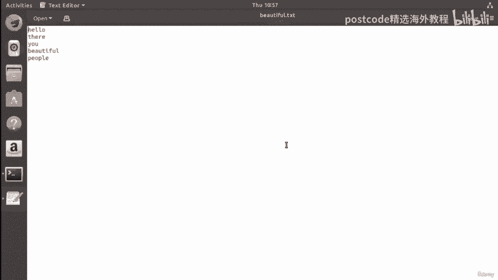

所以这很酷。现在cat命令，当你想像这样把文件粘在一起时，它对于粘在一起很有用，显然，它可以将文本文件放在一起，但在处理音频或 MP3 文件时非常有用，例如，例子。

所以你可以有多个不同的单个 MP3 文件，例如，不同的歌曲，但是，您实际上可以将它们连接在一起，将这些不同的文件粘在一起以创建一个长文件，包含所有音乐的文件。所以这真是史诗般的。

所以 cat 命令用于将文件粘在一起，或者实际上，如果您愿意，只需读取内容，一个文件，这样我们就可以做 cat beautiful dot txt 所以 cat beautiful cd 我们可以看到内容。

任何非常非常有用的文件。但我想看的另一个命令是 tac 命令。那么让我在这里清除屏幕。所以 tac 命令只是 cat 向后拼写，它用于反转它收到的任何内容，输入。因此。

如果我们通过回显 ABC 到 Alpha txt 来创建一个名为 Alpha txt 的文件，我们还将，echo def 到 alpha 并注意我们这里有两个箭头，因为我们要追加。

到同一个文件而不是覆盖它。

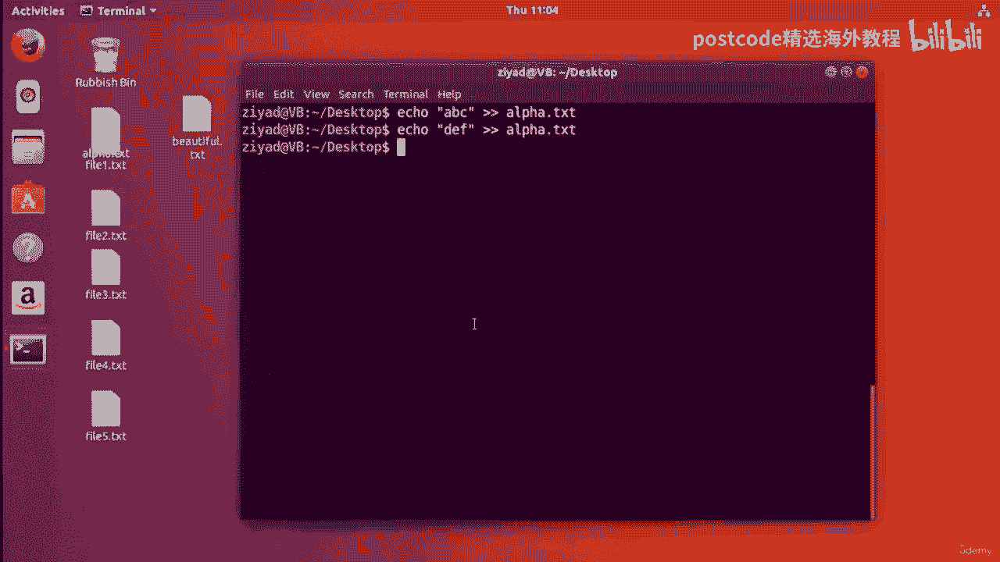

所以现在如果我查看 alpha txt，我们会在一行上看到 ABC，在另一行上看到 def。

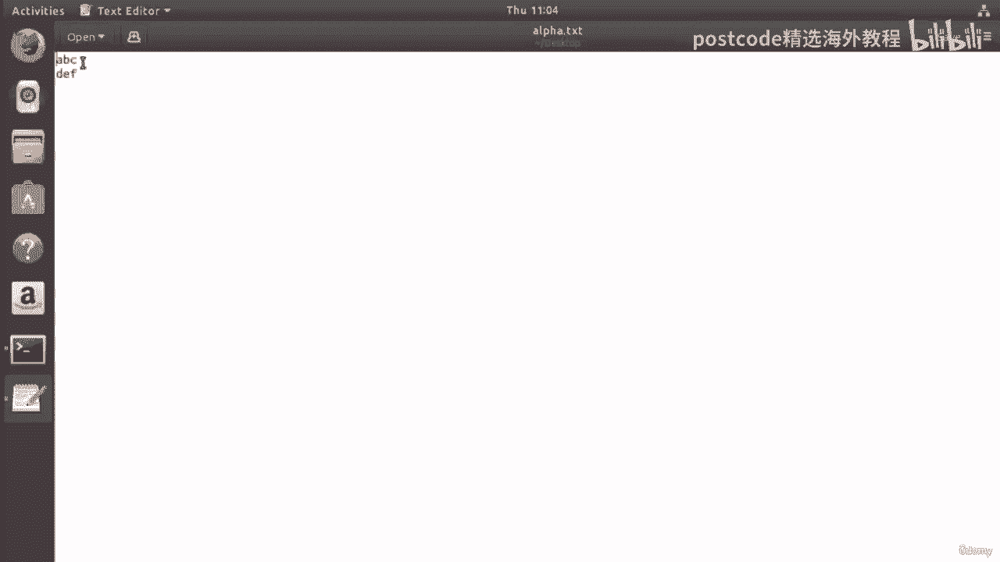

因此，如果我们读取文件，我们使用 cat 读取文件，我们起诉 cat alpha txt 我们得到 abc 然后 def 好吧，但让我们看看如果我们使用 tac 读取它会发生什么。因此。

我们不使用 cat 来读取它，而是使用 tac 来读取它，tac 是倒写的 cat。你现在看到了，我们先得到 def，然后得到 ABC。所以你可以看到 tac 命令实际上反向读取整个文件。

但将文件保留为，线相同。所以它只是先写最后一行，然后写第一行。是的，但它并没有影响每行上的任何文本。因此，如果我们在这里将各种不同的文件粘在一起，文件 1 到 5 使用 cats。

如果我们将 1 到 5 点的 txt 文件归档，您会看到我们在那里得到了输出。但现在我想让你想想，如果我们将其输入 TAC 会发生什么？现在 TAC 将按行反转文件。所以最后一行将首先打印。

第一行将最后打印。那么你认为这可能会产生什么结果？只需花几秒钟。要么考虑一下。所以可能发生的是最后一行，即人们会先来，第一行会来，最后的。那么什么样的结果才是人们美丽的呢？你在那里？你好？好吧。

让我们来看看。我们开始吧。是的，人很漂亮。你在那里？你好。因此，可以将 tac 命令视为垂直反转文件，因此它只是将其上下翻转。它不会影响任何线条，只是将其颠倒过来。当然，因为这一切都被打印到标准输出。

所以您当然可以重定向，它到另一个称为反向文本的文件中。我们在这里，这是反向txt。

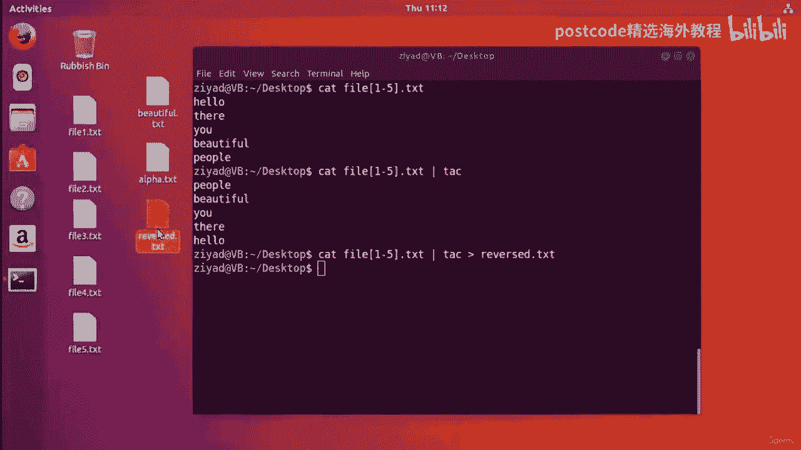

当我们打开它时，我们会看到我们已将输出保存在该文件中。

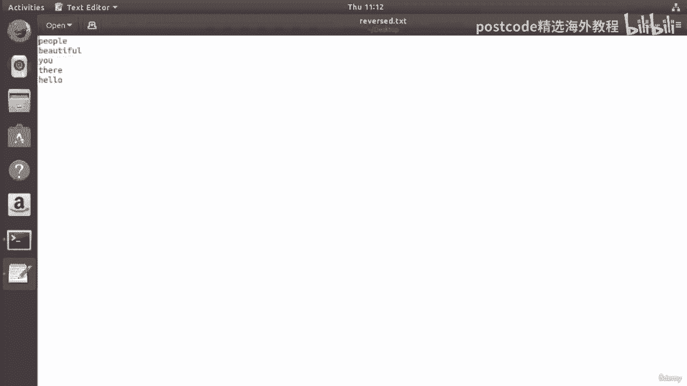

因此，如果我们举个例子，tac 命令的一个好处就是可以使用它，MP 三个文件，我不知道你是否曾经在网上看过那些视频，人们说，哦，看，这首歌倒放时唱的是什么。就像，你知道。

他们试图说文件中有一些隐藏的消息。也许你看过这类视频。好吧，也许它们是使用 tag 命令制作的，因为如果您通过运行 MP 3 文件，TAC 命令。

如果我做了类似将我的文件固定到 MP 3 并将其保存到另一个我的反向文件中的操作，文件点 MP 3 然后这个文件，这里的这个文件将是同一首歌，但向后播放。所以如果你愿意的话，这是一个可以尝试的事情。

好的，这就是 tac 命令。tac 命令将垂直反转文件。我还想看看另外一个，叫做 Rev Command。因此 Rev 命令允许您反转每一行的内容。因此，如果我清除屏幕并将各种不同的文件剪切在一起。

我们会再次打招呼，你们这些美丽的人。但如果我将其输入 rev 命令，看看这里会发生什么。它仍然说如果你能读懂它，它仍然说你好，你们这些美丽的人。因此，这些线在垂直方向上是相同的，但在水平方向上却相反。

所以每行的最后一个字母。所以这里的 o 现在变成了第一个字母，你知道，它沿着线颠倒了它们，但如果有意义的话，每行的顺序是相同的。如果我们输入 tac 命令，您可以看到 people 是第一行。

而这里 people，是最后一行。但字母已经颠倒过来了。这就是您可以考虑转速和航向的方式。Tack 垂直反转文件，而 rev 水平反转文件。好的。现在，您可以通过管道将文件通过这两个文件真正搞乱。

所以如果我把它穿过大头钉，它就会垂直反转。但是如果我也通过转速来传输，你现在就得到了垂直反转和水平反转，文件，如果您发现它特别有用，那么这是一种混淆内容的好方法。但是，是的，为了让事情变得更容易。

只需将大头钉视为按列垂直反转文件，然后，您可以将 Rev 视为跨行水平反转文件。所以所有这些命令，无论是 cat 还是 be tit 或者 rev，它们所做的就是它们。

正在获取一个文件并将其读入标准输入，进行一些处理，然后只是吐出，即输出到标准输出。所以它们是一种好方法，或者 cat 是一种读取文件的好方法，而其他方法是一种混乱的好方法，起来的东西。

但问题是当你像这样读取文件到终端时，如果文件特别长，它真的会堵塞你的屏幕，而且它不是很有用，你会发现自己滚动了很长一段时间，很长的路要走。因此，如果我们尝试查找一个非常大的文件，例如。

让我们使用 find 命令，让我们搜索我们的系统，假设最大深度为四。我们不需要对任何配置文件走得太远。因此，名称以 conf 结尾，大小超过 20 KB。所以我们只得到，我们实际上只得到两个。

但是这里有一个叫做cups 的浏览器。这与打印服务有关，显然这是一个相当大的文件。因此，如果我复制它，复制它并尝试将其剪掉。好的。所以如果我试图限制这一点，哎呀，你看，你看它就在那里发生了。

如果我试图限制它并按回车键，你会发现我们刚刚删除了一些愚蠢的行。你知道吗？现在，如果我想看一下，我就一直滚动到这里。这不太好，对吧？所以当你在命令行上处理东西时这是一个问题。

我们想要一个更优雅的解决方案来处理相对较大的文件。有时，你知道，如果我只是想读出我可能不想要所有文件，也许我只想要其中的某个片段。也许我只想要前十行或后十行或类似的东西。

我们需要有一种更好的方法来在命令行上处理文件内容。总而言之，这就是我们将在下一个视频中介绍的内容。但总结一下这个视频。我们已经看到 cat 命令可用于实际读取文件。因此。

如果我在桌面上查看 Beautiful，如果我读出漂亮的文本，我们就可以读出它。如果我们想垂直翻转文件，我们可以使用tack。如果我们想水平反转文件，可以使用 rev。但无论哪种方式，所有这些。

他们所做的只是读取文件的内容并将其输出到标准输出，当然，您可以将其通过管道传输到其他命令中以进行其他处理或类似操作，在命令行上工作，如果您只想快速查看文件中的内容，您可以。

只需使用 cat come 执行 cat 命令，然后很快就能看到并继续您的工作，正在做。好的。因此，我们就是这些命令，即“猫头钉”和“转速”命令。但在下一个视频中。

我们将看看如何提高这种能力以完成更复杂的任务，事物。因此，我将在此中断视频，并在下一个视频中与您见面。你好，美丽的人们。欢迎回来。因此，在上一个视频中，您学习了如何使用多个命令打开文件并读取其内容。

行命令。例如，cat 命令将打开一个文件并允许我们读取其内容。因此，如果我们使用文件 one dot txt，我们可以看到它包含单词 hello。当我们打开这样的文件时，所有内容都会立即显示出来。因此。

无论文件有多长，它都会直接输出到我们的终端中。这可能有点痛苦。例如，如果我们尝试打开一个非常长的文件，例如我在，最后一个视频，这与打印机和系统上的东西有关。因此，如果我输入这样的内容，让警察浏览 。

com，然后我尝试将其打印出来，您可以看到我们刚刚，屏蔽掉一大堆信息，如果我们想阅读它，我们必须像这样上下滚动，这就在我们的命令行中。有点痛苦吧，就这样。这确实不是一个好方法。您希望能够处理长文件。

因此，为了解决这个问题，Linux 上有一些称为分页程序的程序，可以让您进行分页，大输出使其更易于阅读。我们将在本视频中介绍的命令称为“Less Command”。因此，如果我们只是做而不是 cat。

如果我们做的更少，然后给它我们想要读取的文件，你，现在可以看到发生的事情是我们首先从文件的顶部开始，然后，只需使用我们的键盘键、箭头键、向上和向下，我们就可以滚动浏览此内容并。

通过上下滚动来阅读它比我们只在命令行上阅读要容易得多。如果我按 Q，你可以看到底部有这两个冒号。如果我输入 Q，它就会关闭，现在我们回到命令行，没有任何需要滚动的混乱。所以这是一个很好的方法。

实际上你可以通过管道传输到 less 命令。因此，我可以使用 Cat 打开文件，然后通过管道输入，而不是像那样直接打开它，left 命令，它会给我们相同的结果。现在。

这种通过管道传输到 less 命令的能力非常有用，因为它不仅必须是，您正在处理的文件。例如，如果我说，好吧，让我们进入我们的主目录，然后找到所有文本，文件。好的？因此，我们将按名称查找以 。

txt 结尾的所有内容，我们会发现我们得到了一大堆，这里的信息。现在这可能会很长。它可以，它可以是很多东西。但我们要做的是，实际上，我们要做的不仅仅是文本，而是，试着找到一切，好吗？

它打印出了一大堆我们现在必须滚动浏览的内容。相反，我们可以将其通过管道传输到 less 中，现在我们可以逐行滚动。因此，最后一个命令在使用命令行时非常有用，因为它可以节省您的时间，从有很多混乱。

填满你的屏幕和管道到它真的非常非常有用，因为现在我们可以按提示，所有混乱都消失了。现在有时您不需要整个输出或整个文件，而只想对其中一部分进行操作，它的。因此。

也许您想从文件中取出一小部分并将其通过管道传递。而不是将整个文件显示在屏幕上。您只想在继续工作之前看一小部分。为此，我们可以使用 head 和 tail 命令。

现在 head 命令将允许您查看从顶部或头部开始的一小部分文件，文件的。而 tail 命令会起到相反的作用。它将允许您从文件的底部或尾部开始看到文件的一小部分。好的。例如。

让我们再次将这五个文件连接在一起。所以我要转到桌面并清除屏幕，然后将文件剪切在一起。哎呀，点击屏幕，将文件1到5剪切在一起。好吧，点 txt，我们看到我们得到了五行。好的。现在。

如果我将其通过管道传输到 head 命令中。我们只是得到相同的输出。那么这是为什么呢？嗯，那是因为 head 命令默认情况下会显示文件的前十行。由于只有五个，我们会看到全部。

但是我们可以通过指定我们想要看到的行数来编辑此行为。因此，如果我只需按 Opera 键即可获得我们想要的内容，我可以给出 H、head 命令、，N 选项并指定我们想要查看的行数。现在我们只要看看前两行。

你就会明白了。我们开始吧。我们只看到你好。它们是输出的前两行。现在 head 命令在管道中非常有用。再次，假设我们正在执行 find 命令，然后回到主目录，然后运行，查找命令。我们将得到一大堆输出。

假设您只想要其中的前五个选项，您可以将其通过管道传输到 head 命令，给它一个选项，然后说，哦，嘿，我只想要五行，让我按 Enter 键。你看，我们开始了。我们得到前五个结果。

然后你可以将这些结果通过管道输送出去，无论你想要什么原因。所以也许我想，你知道，然后将它们传递到 tac 命令并反转它们的顺序，或任何可能的东西。好的。所以这是 head 命令的一个非常有用的应用。

它的工作原理与 tail 命令相同，但 tail 命令只会从底部显示，比从顶部。但我想向您展示，实际上您不需要只通过管道传输到 head 命令。您可以直接对文件进行操作。所以我们有那么长的文件，不是吗？

我们有什么是斜线 Etsy 警察警察浏览的 。 com。你看，我们现在已经得到了这个非常非常长的文件，如果我们实际上可以通过管道看到它有多长，给字数统计命令并为其提供 URL 选项。

就像您在课程前面看到的那样，我可以看到我们有 673 行。这是相当多的行。但是如果我们只想要前 20 行怎么办？好吧，我们不必这样做，而不是通过管道来实现。我们能做的就是直接说 head。

给它一个前 20 个选项，然后给它，文件并直接对其进行操作。我们将只得到前 20 行，我们可以通过按确认我们确实有 20 行，此处的向上箭头键并将其输入到字数统计命令中，并提供计算金额的选项，的线路。

我们将会看到这一点。是的，我们现在只有 20 行输出，所以这很完美。现在 tail 命令的工作方式与 head 命令基本相同，只是它从底部开始，一个文件的。因此，如果我们再次进行剪切。

我们将返回桌面并剪切文件 1 到 5 点 txt 并，我们将会看到这一点。是的。我们向你们这些美丽的人问好。现在，如果我们将其输入 tail 命令并说我们只需要底部两行，那么我们只需，得到美丽的人。

所以下面两行，如果我们再次对非常非常长的文件进行操作，那么就不用，CAD 没有头部，而是有尾部。最后去掉这个字数。现在，如果我们按 Enter 键，您可以看到我们只获取了最后 20 行。

我们可以再次通过管道传输，那就算一下字数吧。是的，我们确实有 20 条线路。因此 head 和 tail 允许您分别剪切文件的顶部或底部，准确控制您想要的内容。您可以将它们一起使用来过滤掉特定的行。

假设我们确实剪掉了前 20 行。这些是这个大长文件的前 20 行。然后，如果我将其输入到 tail 命令中，它会说，好吧，从底部开始只给我一行。好的，那么这里的空白位将是文件的第 20 行。

也许这并不那么令人兴奋。假设我得到了，比如说，三，好吧，那么这将给我文件的第 18、19 和 20 行。您可以通过这种方式使用命令来剪切特定的行。所以这是一个非常有用的组合。

但这些东西真正发挥作用的地方是当你构建管道时。因此，我一直使用和依赖的示例是 find 命令，因为它为我们提供了大量输出。

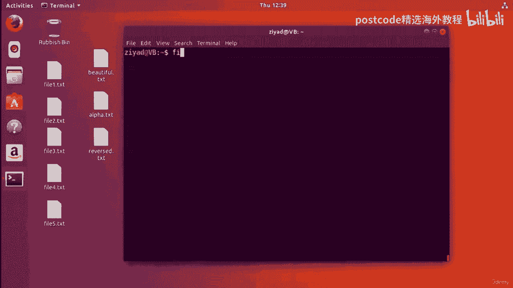

但如果你只想获得一组特定的行，那么假设我想要最后三行，我可以将它们通过管道传输到 tail 命令中，然后说，好吧，只需给我最后三行，然后继续将其向下传输，甚至将其导出，比如说，导出到桌面上的导出文本中。

然后你可以保存它并只保留你想要的行，而不必拥有整个行。

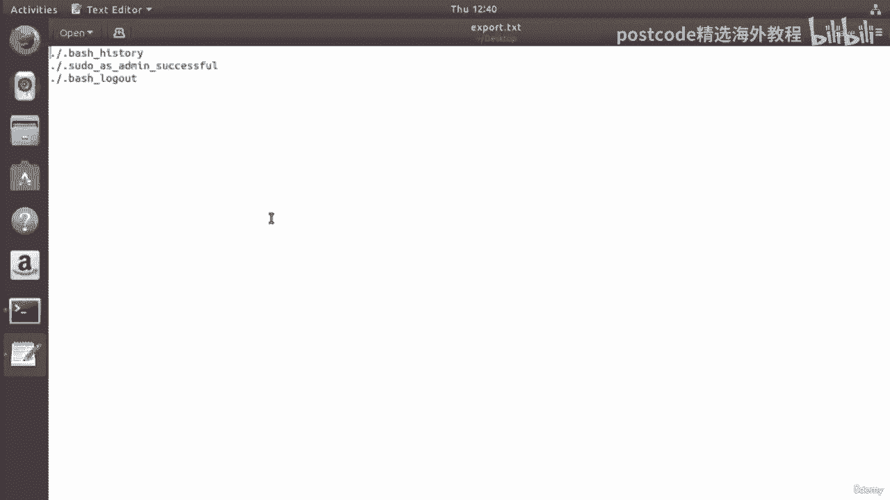

一堆你不需要的输出。所以它就像一个过滤器。

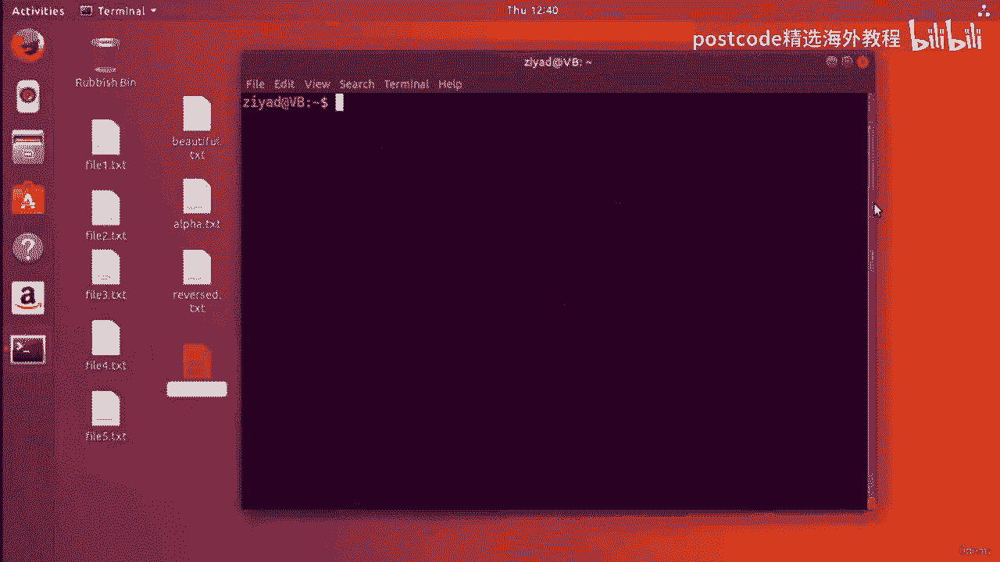