# Linux文件查看与处理：04-04-011：查看文件内容

## 概述

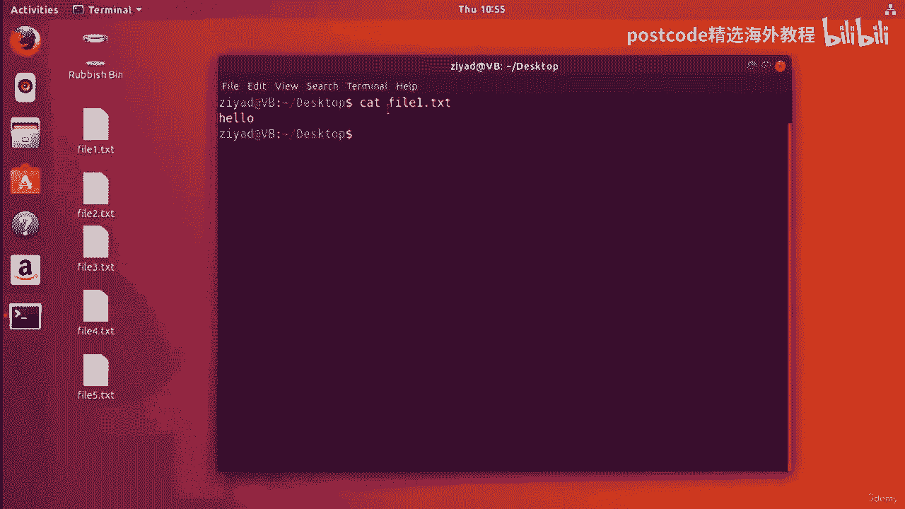

在本节课程中，我们将学习如何在Linux命令行中查看和处理文件内容。我们将重点介绍几个核心命令：`cat`、`tac`、`rev`、`less`、`head`和`tail`。这些命令是日常文件操作的基础，能帮助你高效地读取、组合和筛选文件信息。

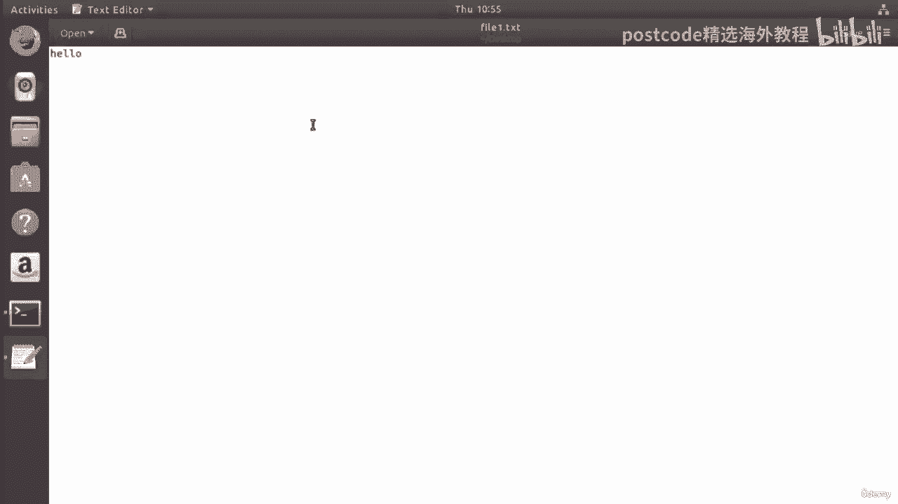

---

## 使用 `cat` 命令查看与合并文件

我们要查看的第一个命令是 `cat` 命令。你之前可能已经见过这个命令，现在我们来做一个复习。

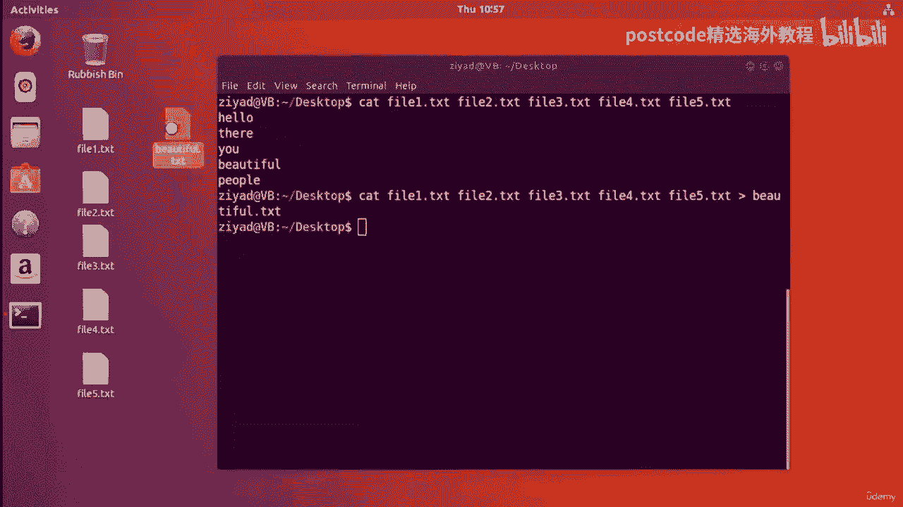

在桌面上，我们有几个文件：`file1.txt`、`file2.txt`、`file3.txt`、`file4.txt` 和 `file5.txt`。我们首先看看第一个文件里有什么。我们不在图形界面中打开它，而是在终端中查看其内容。

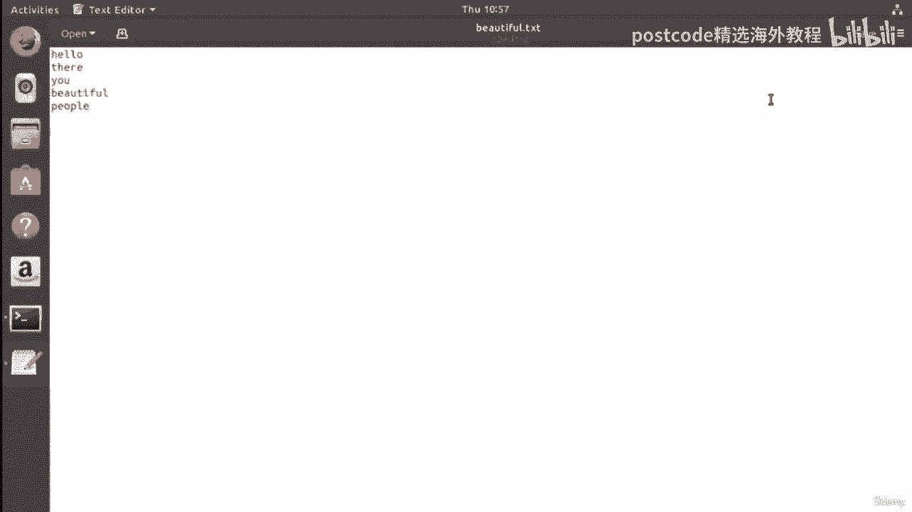

如果我们输入 `cat` 命令，然后跟上文件名，例如：
```bash
cat file1.txt
```
按回车后，文件的内容会被写入标准输出。我们可以看到，`file1.txt` 文件包含单词 “hello”。

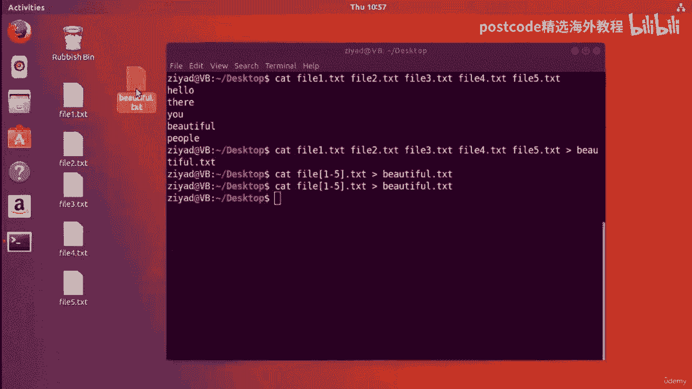

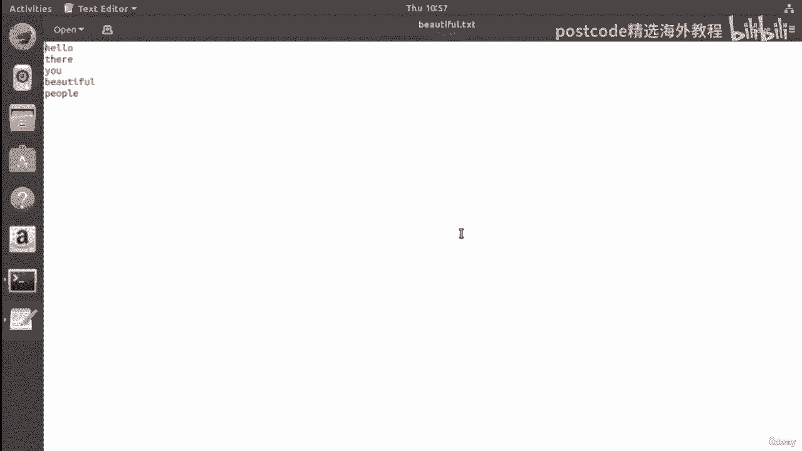

使用 `cat` 命令，我们成功将文件的内容打印到了标准输出。

接下来，我们看看第二个文件的内容。输入：
```bash
cat file2.txt
```
可以看到里面是单词 “you”。以此类推，`file3.txt` 是 “beautiful”，`file4.txt` 是 “people”。如果把五个文件的内容按顺序连起来，就是 “hello you beautiful people”。

实际上，`cat` 命令的主要用途之一就是合并文件。`cat` 是 “concatenate”（连接）的缩写。它的作用是将所有输入文件的内容连接在一起，然后输出到标准输出。

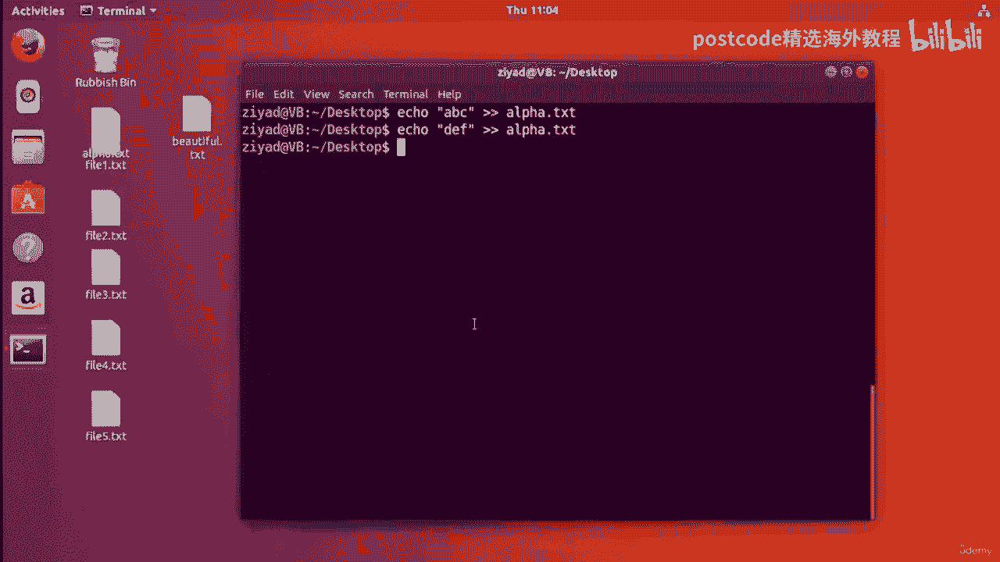

我们可以通过以下命令将五个文件合并：
```bash
cat file1.txt file2.txt file3.txt file4.txt file5.txt
```
执行后，屏幕上会输出 “hello you beautiful people”。

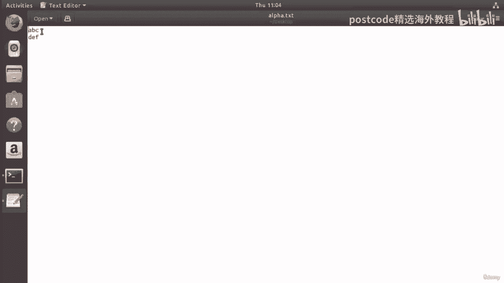

我们还可以将这个输出重定向到一个新文件中：
```bash
cat file1.txt file2.txt file3.txt file4.txt file5.txt > beautiful.txt
```
这样就在桌面上创建了一个名为 `beautiful.txt` 的新文件，其内容就是合并后的句子。

上面的命令行很长，我们可以利用通配符知识来简化它。不必逐个列出所有文件名，可以这样写：
```bash
cat file*.txt > beautiful.txt
```
或者更精确地：
```bash
cat file[1-5].txt > beautiful.txt
```
这样打字更少，效果相同。

`cat` 命令在合并文本文件时很有用，同样也适用于合并其他类型的文件，例如音频文件。你可以将多个MP3文件连接在一起，创建一个包含所有音乐的长文件。

---

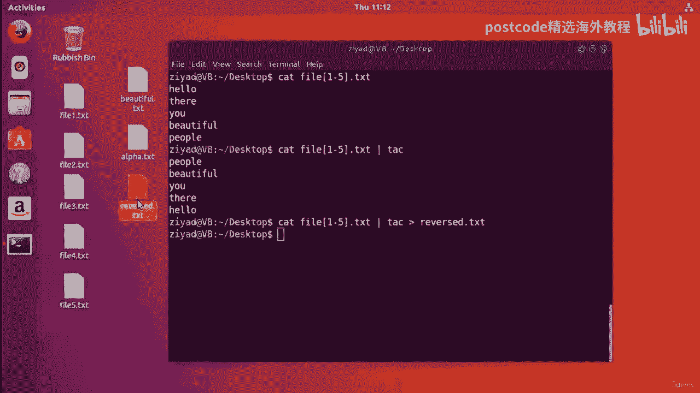

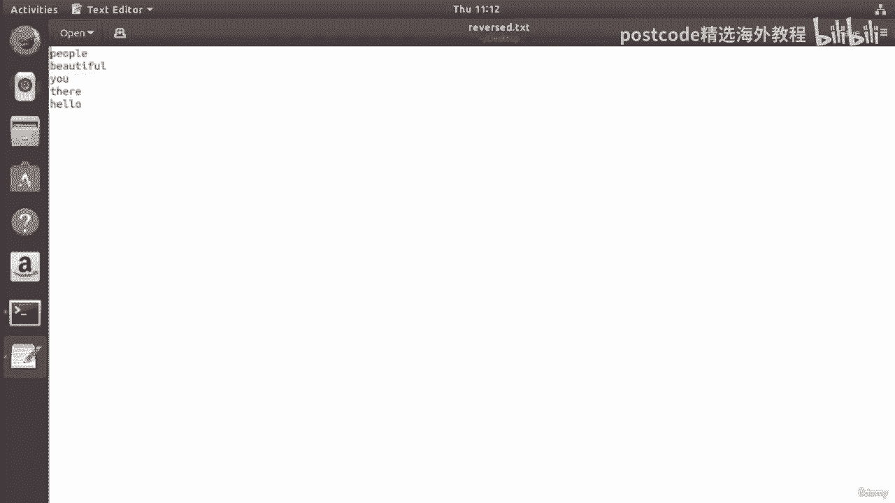

## 使用 `tac` 和 `rev` 命令反转文件内容

现在，我们来看另一个命令：`tac`。`tac` 就是 `cat` 倒过来拼写，它用于反转输入内容的行序。

首先，我们创建一个名为 `alpha.txt` 的文件：
```bash
echo “abc” > alpha.txt
echo “def” >> alpha.txt
```
注意，第二个 `echo` 使用了两个箭头 `>>`，这表示追加内容到文件，而不是覆盖。

现在，如果我们用 `cat` 查看文件：
```bash
cat alpha.txt
```
会看到第一行是 “abc”，第二行是 “def”。

如果我们用 `tac` 命令查看：
```bash
tac alpha.txt
```
则会先看到 “def”，然后才是 “abc”。`tac` 命令将文件的行序进行了垂直反转（最后一行变第一行），但每行内的文字顺序不变。

如果我们把之前合并的句子通过 `tac` 命令处理：
```bash
cat file[1-5].txt | tac
```
输出会变成 “people beautiful you hello”。我们可以将这个结果保存到新文件：
```bash
cat file[1-5].txt | tac > reversed.txt
```
`tac` 命令的一个有趣用途是可以用来反向播放MP3文件，生成所谓的“倒放”效果。

接下来，我们看看 `rev` 命令。`rev` 命令用于水平反转每一行的内容，即颠倒每行内字符的顺序。

如果我们对合并的句子使用 `rev` 命令：
```bash
cat file[1-5].txt | rev
```
输出会变成 “olleh uoy lufituaeb elpoep”。行的上下顺序没有变，但每行内的字母被反向了。

我们可以把 `tac` 和 `rev` 组合使用，同时进行垂直和水平反转：
```bash
cat file[1-5].txt | tac | rev
```
这会得到完全反转的内容。`tac` 负责垂直反转行序，`rev` 负责水平反转每行的字符。

这些命令（`cat`、`tac`、`rev`）都是读取文件内容，进行一些处理，然后输出到标准输出。`cat` 是查看文件的好方法，而 `tac` 和 `rev` 则可以用来“打乱”内容。

---

## 处理长文件：`less`、`head` 和 `tail` 命令

当使用 `cat` 查看很长的文件时，所有内容会瞬间输出到终端，导致屏幕被刷满，需要不断滚动，这很不方便。例如，查看一个系统配置文件：
```bash
cat /etc/cups/cups-browsed.conf
```
输出会非常长。

为了解决这个问题，Linux 提供了分页程序，让大文件的输出更易于阅读。我们将介绍的命令是 `less`。

使用 `less` 命令查看文件：
```bash
less /etc/cups/cups-browsed.conf
```
现在，我们从文件顶部开始，可以使用键盘的上下箭头键逐行滚动阅读。按 `q` 键可以退出 `less` 视图，返回干净的命令行。

你也可以将其他命令的输出通过管道传递给 `less`：
```bash
find ~ -name “*.txt” | less
```
这样，即使 `find` 命令的结果很多，你也可以方便地逐页查看。`less` 在命令行工作中非常有用，可以避免屏幕被大量输出填满。

有时，你不需要查看整个文件，而只想看其中一部分。为此，我们可以使用 `head` 和 `tail` 命令。

`head` 命令用于查看文件开头（头部）的若干行，默认显示前10行。
`tail` 命令用于查看文件末尾（尾部）的若干行，默认显示后10行。

例如，查看合并文件的前两行：
```bash
cat file[1-5].txt | head -n 2
```
输出是 “hello” 和 “you”。

查看一个长文件的前20行：
```bash
head -n 20 /etc/cups/cups-browsed.conf
```

查看文件末尾的两行：
```bash
cat file[1-5].txt | tail -n 2
```
输出是 “beautiful people”。

查看长文件的最后20行：
```bash
tail -n 20 /etc/cups/cups-browsed.conf
```

你可以组合使用 `head` 和 `tail` 来截取文件的特定行。例如，先取前20行，再从这20行中取最后3行，这就得到了原文件的第18、19、20行：
```bash
head -n 20 /etc/cups/cups-browsed.conf | tail -n 3
```

这些命令在构建管道时尤其强大。例如，使用 `find` 命令搜索时，结果可能很多，你只想要最后几条记录：
```bash
find / -maxdepth 4 -name “*.conf” -size +20k | tail -n 3 > ~/Desktop/output.txt
```
这样，你就只将最后3个结果保存到了文件中，过滤掉了不需要的输出。

---

## 总结

在本节课中，我们一起学习了在Linux命令行中查看和处理文件内容的核心命令。

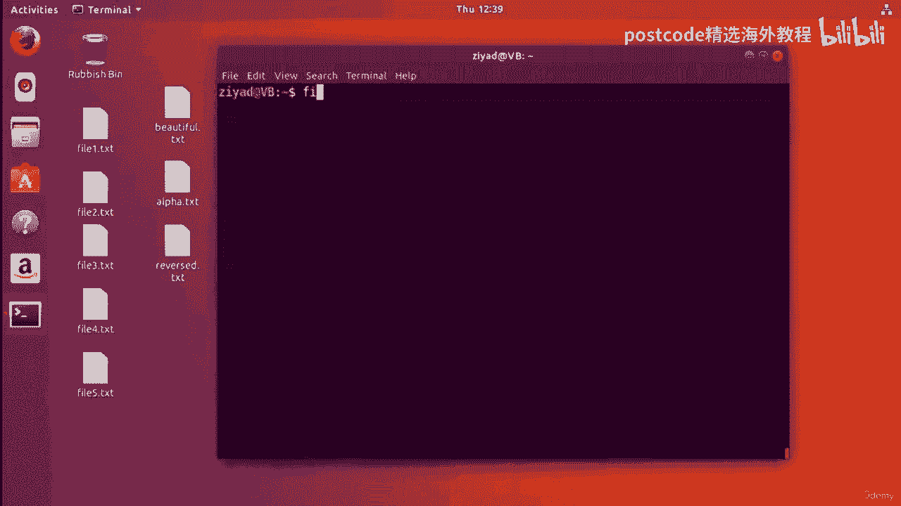

*   **`cat`**：用于查看文件内容或将多个文件连接（合并）在一起。
*   **`tac`**：垂直反转文件的行序（最后一行变第一行）。
*   **`rev`**：水平反转每一行的字符顺序。
*   **`less`**：分页查看长文件，避免屏幕混乱，支持上下滚动。
*   **`head`**：查看文件开头的若干行。
*   **`tail`**：查看文件末尾的若干行。

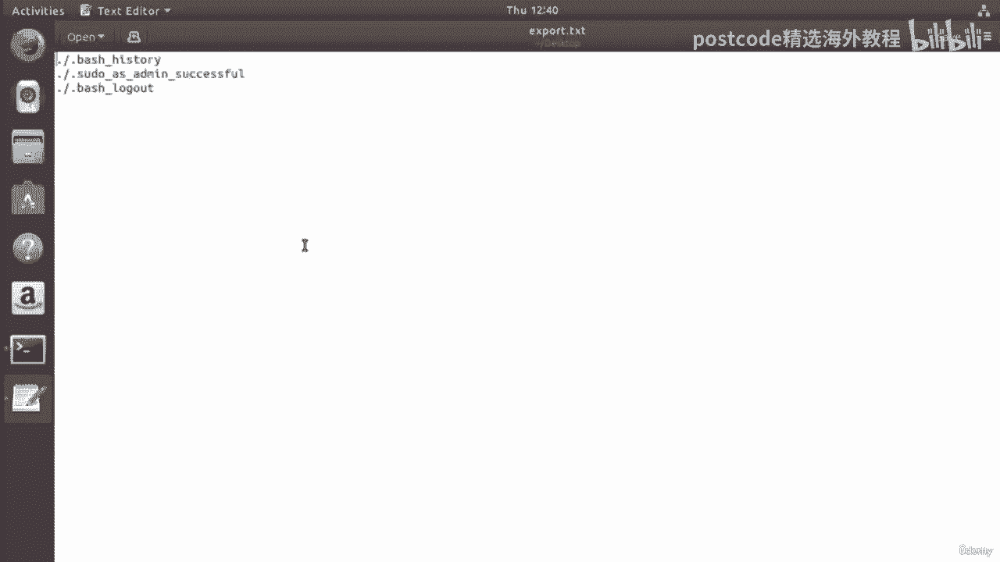

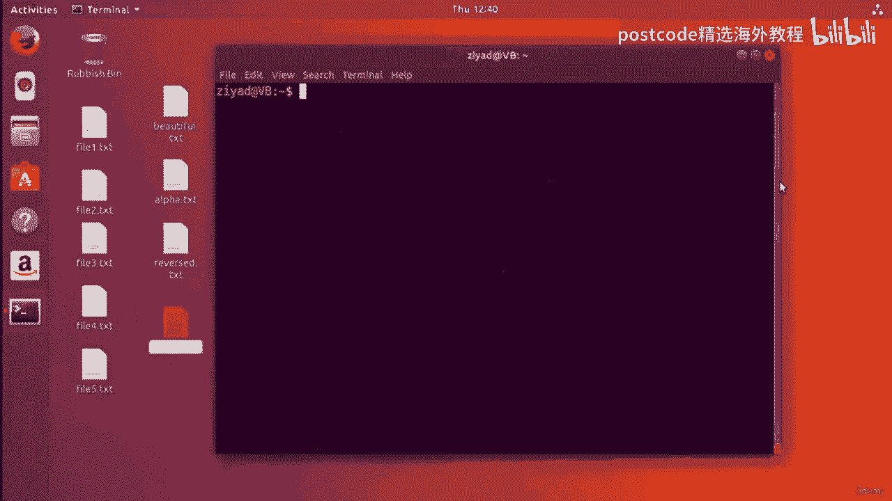

这些命令都遵循“读取输入 -> 处理 -> 输出到标准输出”的模式，并且可以灵活地通过管道（`|`）组合使用，或通过重定向（`>`、`>>`）保存结果。掌握它们能极大地提升你在命令行下处理文件的效率和灵活性。在接下来的课程中，我们将探索更复杂的文件操作任务。