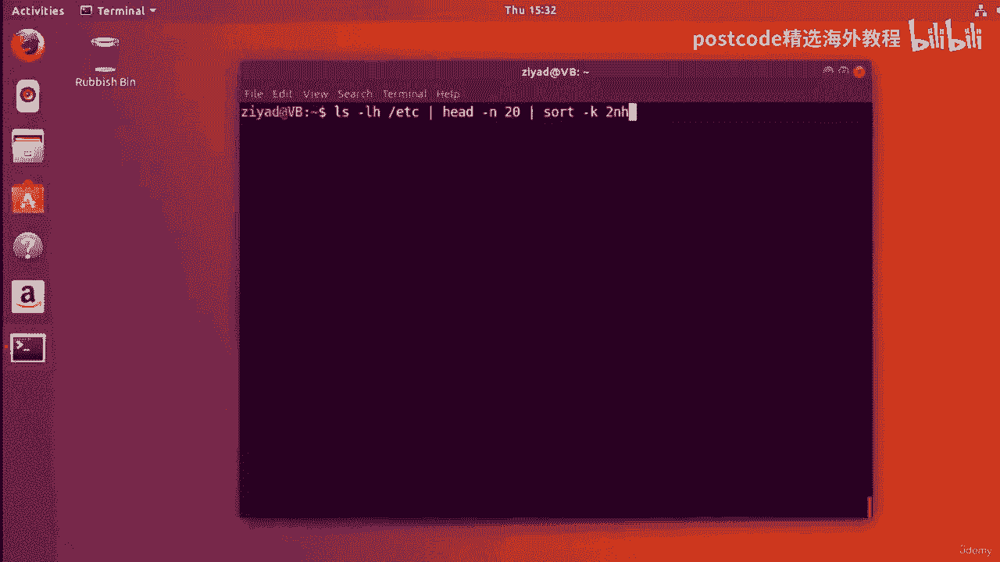

# 红帽企业Linux RHEL 9精通课程 — RHCSA与RHCE 2023认证全指南 - P36：04-04-012 Sort - 精选海外教程postcode - BV1j64y1j7Zg

好的。所以我应该说的第一件事是我已经在桌面上放置了三个文件。我有单词文本，其中包含 100 个随机单词，未按特定顺序排序。

它们只是该文件中的 100 个随机单词。我们已经得到了 0 到 9 点的数字文本，这是一个包含大量数字的文件。

我认为有 100 个数字，每个数字都在 0 到 9 之间。我们还在这里找到了另一个文件，名为numbers dot txt，我认为这是另外一百个随机文件。

数字。但他们不知道，他们不属于特定范围。

它们只是一百个随机数，没有具体限制。我已在资源部分中提供了这些文件以及有关我如何进行操作的一些信息，创造了他们。因此，如果您想获取这些内容并亲自尝试一下，那么您可以继续下载，他们并尝试一下。好的。

让我们首先看一下这个单词txt，它是随机包含100个单词的文件，生成的单词。

正如我所说，如果我们再次打开它，里面就会有 100 个随机单词，没有特别的意义，顺序，没有特定的长度，只是 100 个随机生成的单词。

好的。首先，我们如何对该文件进行排序，以便按字母顺序排序？因此，以 A 开头的所有内容都位于顶部，以 Z 开头的所有内容都位于底部。嗯，这实际上是 sort 命令的默认行为，这是一个完美命名的命令。

对于这种事情。所以使用起来也非常简单。如果我们只输入 sort Words dot txt，我们现在就得到了从 A 到 Z 的排序单词列表。所以你可以看到所有以A开头的单词都在顶部。

所有以A开头的单词都在顶部，Y 在底部。而且看起来我们没有任何以 Z 开头的东西。所以它们都是按字母顺序排序的。所以这很酷。当然，我们可以将此标准输出写入文件或 T 命令。我们也可以使用它。

就像我们可以说的那样，在此处称为排序的 txt 的文件中说，该文件将在那里输出。

我们可以将其通过管道输送出去。你知道，它只是写在标准输出上。

所有相同的规则均适用。那么，如果我们不想将其从 A 到 Z 排序，而是想反向排序呢？我们该如何排序呢？所以 Z 位于顶部。嗯，我想到了两个选择。首先，你可以做的是你可以像平常一样对单词进行排序。

然后用管道管道，进入 tac 命令。正如你在这里看到的，发生的事情是字母、以 a 或现在开头的单词，底部和以接近 Z 开头的单词现在位于顶部。其原因是，正如我们所知， tac 命令将垂直排序或翻转输出。

因此，原本位于底部的内容现在位于顶部，而位于顶部的内容现在位于底部。所以这实际上就像我们刚刚颠倒了排序一样。正确的。但更好的方法是，我认为一种更内置、更有效的方法就是直接给出，sort命令有R选项。

R选项代表反向。因此，如果我这样做，我们可以再次看到底部以 R 开头的字母。底部以 R 开头的单词。对不起。以接近 Z 开头的单词现在位于顶部。现在您可能会注意到，当我向您展示此输出时。

我正在上下滚动 shell，相当多。所以这就是 less 命令的用武之地。我可以将其通过管道传输到 less 命令中，以使输出更容易查看，因为现在我正在使用，方向键而不是用鼠标垫滚动。所以，你知道。

这是一种更好的方式来处理新闻问题中的事情。所以只是在我们之前所做的基础上进行构建。好棒。请注意，您现在拥有足够的构建块，可以在多个过程中解决相同的问题，方法。您知道现在可以使用 R 选项来反转它。或者。

如果您不想这样做，也可以将其通过管道传输到 tac 命令中。这是 Linux 的一大优点。它为您提供了多种不同的方法来解决同一问题，因为您有很多不同的方法，建筑模块。因此。

解决这些问题的方式有很大的发挥创造力的空间。不一定有一种正确的方法可以做到这一点。所以我们就这样了。现在，对数字进行排序怎么样？嗯，我，我这里有 100 个数字的列表，称为数字文本。

如果我们看一下，里面有 100 个数字，没有任何特定的大小限制。它们可以是任意数量，但有 100 个。

好的。那么我们如何对它们进行排序呢？嗯，用字母排序。因此，按字母顺序对 8 个 AZ 进行排序不同于按数字排序，后者按数字顺序进行排序。因此，如果我们尝试像那样对数字 txt 进行排序。

您会发现它并没有真正发挥作用。如果你注意到的话，这里发生了什么，我们将其输入到最后一个命令中，这样我们就可以使，更容易看到您注意到所有以 1 开头的数字都已到达顶部并且，然后就像你现在看到的那样。

我们得到了所有以 2 开头的数字。然后我们将输入所有以 3 开头的数字，依此类推。但我们不是四、五、六、七、八、九。您可以看到它按第一个数字排序，但不是按该数字的值排序。例如，160 16。

029 比 1641 大得多。那为什么它在上面呢？正确的。没有真正意义上的数字大小。事实上，它从数字 1 开始，并且按照数字顺序排序。只需查看数字即可进行排序。它不看数字的值，而只看数字。

但如果要使用数字的值进行排序，则需要为排序命令提供 RN 选项。所以 RN 选项允许它按数字排序。当我们现在看一下时，您可以看到我们在顶部得到了最小的数字。所以我们从 123 开始。

然后数字随着减少而变大。所以这是需要牢记的重要事情。仅按数字排序与按整数值排序不同。如果你想按整数的值搜索，你需要给它N选项。当然，您可以通过使用 R 选项来反转这一点，以便最大的位于顶部，以及反向。

现在我们看到最大的数字位于顶部，当我们向下滚动时，数字会变小。所以这非常非常好。现在您已经了解了如何按字母顺序对文本进行排序，并且您已经看到了她的两个按数字排序的数字。

但非常有用的一件事是只显示独特的结果，而不是一遍又一遍地显示相同的结果。

一遍又一遍地。所以我们这里有一个名为数字 0 到 9 点文本的文件。其中有 100 行数据，但只有这些行只包含 0 到 0 之间的数字之一，9。所以你必然会有一些重复项。例如，这里我们有 000。

这不仅仅是独特的结果。有重复的结果。

因此，如果我们看一下这里并尝试对其进行排序，如果我们尝试对数字 0 到 9。2 进行排序，让我们，将其输送到 less 中。你会看到所有的零都在前面，然后是所有的一、所有的二、所有的三。

所有四、五、六或 7/8 和九。就是这样，有点烦人。好吧，也许我们只想得到一次结果。好吧，你要做的就是给排序选项排序命令 you 选项和 you 选项，代表独特。当你现在运行它时。

你会发现我们只得到一次结果。因此，让我不要将其传递到 less 中，就这样吧。您可以看到，您只获得一次结果。所以 0 到 9 这很有用。有时您不想一遍又一遍地重复相同的结果。您只希望结果出现一次。

这就是为什么您要使用 you 选项来进行唯一排序。当然，这仍然适用于其他选项，例如相反，现在我们正在向后排序，您仍然可以按数字排序以及执行其他任何操作。但这就是如何确保每次获得很多结果时只获得一次结果。

您的命令中的数据。其中一个示例是带有 L 选项的 RLS 命令。所以 ls dash l 命令。例如，如果我们在 Z 文件夹上执行此操作。所以这是包含所有系统配置文件的文件夹。

你可以看到我们从中得到了一大堆结果。你只会从那里得到大量的东西。但为了让这个更容易看到，让我们将其传递到 head 命令并获取第一个，20行。现在我们就到了。这是前 20 行输出。好吧。

如果我们想按列对这些数据进行排序怎么办？那么如果我们想按某些列排序怎么办？现在您实际上可以使用 K 选项在排序命令中执行此操作。例如，如果我们想排序，我不知道，我猜这个列是关于文件的，大小。

所以你在这里看到这一列是关于文件大小的，或者我们可能想按，例如，日期，我们想按日期排序，即这几列或其他什么。您知道，您可以在排序命令中完成所有这些操作。那么让我们看看如何去做这件事。

那么我们如何做到这一点，如果我只是清除屏幕，您可以将其通过管道传输到排序命令或将数据传输到，sort 命令并给它 K 选项。现在，在 K 选项之后，您需要告诉排序命令如何使用排序命令对此输入进行排序。

命令调用键定义或键定义。顺便说一句，这一切都在主页上，但让我向您展示它是如何工作的。首先，你告诉它应该按哪一列进行排序。因此，如果我向上滚动一点，您就可以看到我们之前得到的结果。

我们想按此处包含这些大数字的列进行排序。好的。现在，正如我所说，这些数字实际上是以字节为单位的文件大小。假设我们想要将文件从最大到最小排序。因此，首先我们需要给出键 def，即我们要排序的列号。因此。

如果我们将这里算作第一列，那就是第一列。这是第二栏，这是第三栏。那是第四栏，那是第五栏。所以列号是五。因此，如果我们回到命令行，我们将输入 5。然后你需要告诉它。

然后你基本上可以将我们喜欢的任何其他选项传递给它。例如，如果我们想按数字排序，我们会输入“ok”，您可以传递任何选项，你喜欢。因此，如果您想反向排序，您也可以在那里键入 R，就像您在上一篇中看到的那样。

视频。如果你想要独特，你可以输入一个 U 就可以了。这就是您制定关键定义的方式。但现在我们只使用 N。所以我们在这里所说的是，好吧，列出 Etsy 文件夹中的所有内容，取第一个，20行。

然后按第五列排序。当我们按下回车键时，我们就会看到这一点。是的，实际上，数据已经按第五列排序了。您可以看到，我们首先从最小的文件开始，一直到最大的文件。但实际上我们想要的是相反的，不是吗？

我们首先想要最大的文件。因此，如果我们想实现这一点，只需在此处键入 R 即可。所以我们说的是数字，但顺序相反。所以从最大到最小而不是从最小到最大，记住默认情况下排序命令，从小到大。现在我们要从大到小。

所以当我们这样做时，我们看到，是的，现在我们从大 4096 开始，然后逐渐变小，向下。这太酷了，对吧？就像我们刚刚获取了大量数据并按列对其进行排序一样，这是一种令人惊奇的能力，能够从命令行执行。请注意。

我们不必打开 Microsoft Excel 之类的任何东西。我们只是直接从命令行对数据进行排序。但您可能会注意到的一件事，尤其是 LZ 输出，是这些文件大小，这些，文件大小有点难以解释，对吧？

这些都是以字节为单位的。我不了解你，但我倾向于以千字节或兆字节或类似的单位阅读内容。我不倾向于直接以字节为单位读取它。如您所知，LZ 命令有一个选项，允许您读取、给出数据，以人类可读的格式。因此。

如果我们这样做，我们就会采用人类可读的格式。您现在可以看到，我们正在获取它告诉我们的千字节数。所以它说这是四千字节，千字节，千兆字节，三千字节，2。2 千字节，然后其余的只是以字节为单位，它会说兆字节。

千兆字节或任何它的意思，我们正在处理的文件。这就是 LZ 命令的高度选项。它为您提供人类可读的输出，但您可能已经注意到这完全搞砸了，我们的排序。正确的。就像之前我们完美排序一样，最大的在最上面。

最小的在最上面，在底部。但现在它只是为所欲为。原因是 Sorte 命令，当你告诉它用 end 选项按数字排序时，那就是，与使用人类可读数据进行排序完全不同。好的。因此。

为了使其真正按照人类可读的数据进行排序，您需要为其提供哈希选项，而不是，N，你给它哈希选项，你不能同时拥有两者。好的。因此，如果我清除屏幕，而不是结束选项，我们现在可以选择并按，进入。

现在您可以看到它正在工作，我们在顶部获得了最大尺寸，在，底部，同时仍然以人类可读的格式获取数据。所以我们真正做到了两全其美。所以请记住，如果您想按人类可读的数据进行排序。

您只需为 Sorte Command 提供，hat 选项在其关键定义中，或者如果您只有一列要处理，则只是一般情况。但在这里我们把它放在一个键定义中，所以我们在那里输入选项。现在您还可以按月份排序。因此。

让我们看看如何按此列进行排序，该列全部与日期和文件有关，最后编辑。那么让我们清空屏幕，看看这里。所以我们说以长格式为我们打印出具有人类可读文件大小的列表，一切，文件夹中仅提供前 20 行。

并按第五列进行排序。人类可读、可逆。好吧，反过来了。嗯，实际上，日期是这一列之后的一列。所以我们需要第六列而不是第五列。所以我们要做的就是在我们的 key def 中，将 5 更改为 6。

我们只需输入大写的 M，而不是人类可读的。现在这将允许我们按月份排序，如果我现在按 Enter 键，您可以看到是的，我们有，确实按月份排序，一月位于顶部，然后是五月、八月和十月，一直到底部。

所以这真的非常非常酷。正确的。您也可以将其与 oops 结合起来，您可以通过在其中放入 R 将其与可逆结合起来，那里。现在我们会发现，如果我清除屏幕并再次运行它，您会看到十月位于顶部。

现在一月已经处于底部。那么，就这样吧。就像一旦你理解了这几种不同的选择，它实际上并没有那么困难，按某些列排序。你所要做的就是排序。它只是在关键定义中。告诉它您想要哪一列。现在给你一个挑战。

我想看看你是否可以告诉我如何按此列进行排序，以便你知道最小的，数字是第一位的。好的。那么，您将如何按此列进行排序，该列现在有这些数字，您将如何排序，按该列，以便最小的数字排在第一位？现在继续并暂停视频。

然后回来看看您的表现如何。你过得怎么样？你做到了吗？好吧，如果你这样做了，干得好。这真的是非常非常快的学习。以下是我的做法。好吧，所以我要做的就是保持一切不变，Liz，Etsy 会剔除前 20 行。

现在唯一的区别是我们的关键def。所以第一个问题我们知道我们已经为 source 命令提供了 K 选项。第一个问题是列号是多少？好吧，列号好吧，这是第一列。这是第二栏。正确的。那么让我们放两个。

我们想按数字排序，对吧？所以我们要按数字排序。现在默认情况下，排序命令将首先对最小的进行排序，对吧？所以这意味着我们不必扭转任何事情。默认情况下，它将首先从最小的数字开始。因此，如果我清除屏幕并尝试。

现在我们会看到它已按最小的列排序，数字先出现，如果我们想反转它，我们只需给它 N 选项，它就会，反过来，这样现在你就得到了顶部的八和最小的数字，那些在底部的。因此，有很多不同的方法可以做到这一点。

但就是这样。这就是您如何使用此排序命令对列中的数据进行排序。和往常一样，我应该注意的一件事是，我们在一小时内就到了，这并不重要，如果我写了那个或一个结尾，那根本不重要，就像你在这些中写东西的顺序一样。

