# 红帽企业Linux RHEL 9精通课程：P36：04-04-012 Sort 📊

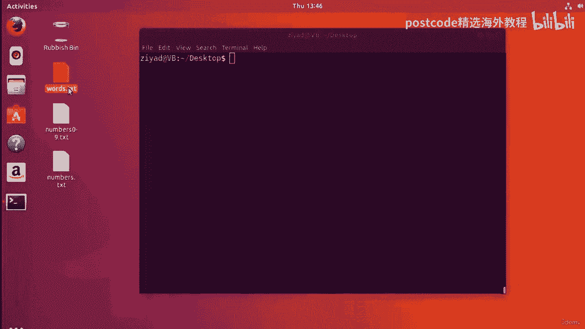

在本节课中，我们将学习如何使用 `sort` 命令对文本和数字数据进行排序。`sort` 是一个功能强大的命令行工具，可以按字母顺序、数字大小、特定列等多种方式对数据进行排序和整理。我们将通过具体的例子来掌握其核心用法。

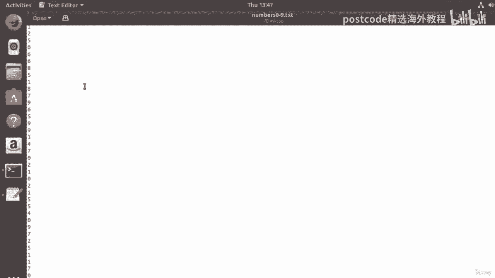

---

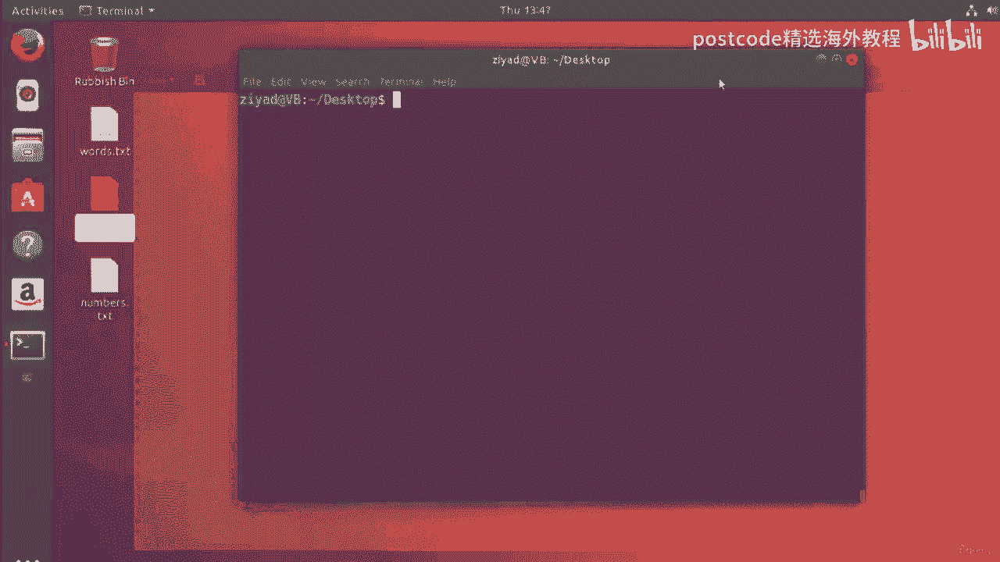

## 准备工作

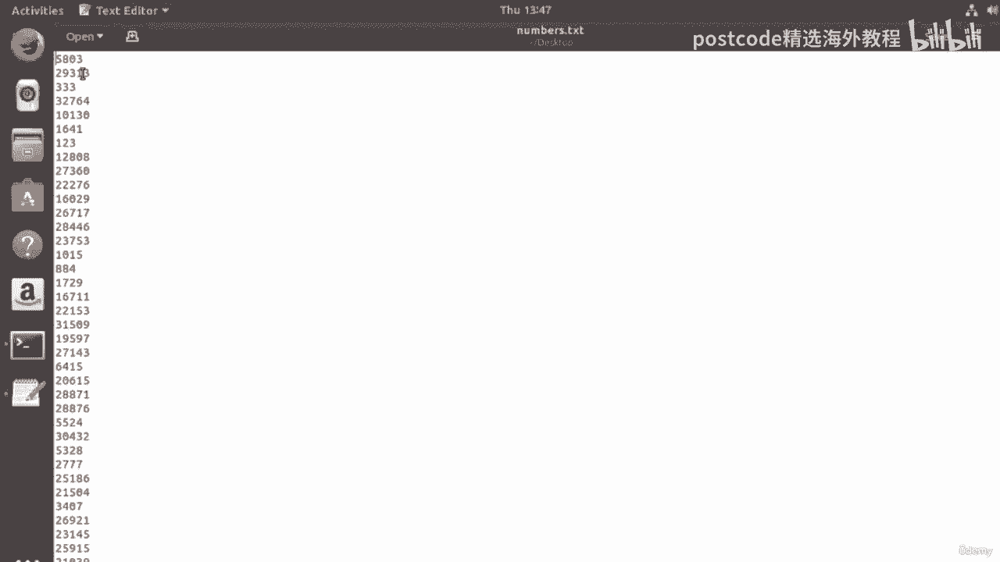

首先，我们准备了三个用于练习的文件：
*   `words.txt`：包含100个随机单词，无特定顺序。
*   `numbers.txt`：包含100个随机数字，无特定范围限制。
*   `numbers0to9.txt`：包含100个数字，每个数字都在0到9之间，因此会有重复项。

你可以下载这些文件并跟随教程一起操作。

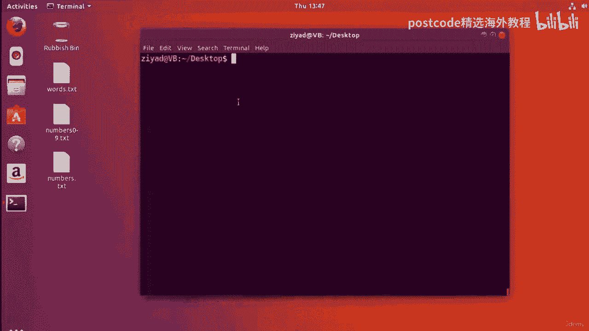

---

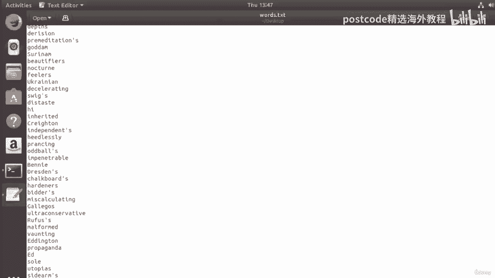

## 按字母顺序排序

上一节我们介绍了练习文件，本节中我们来看看如何对文本进行排序。

`sort` 命令的默认行为就是按字母顺序（A到Z）排序。要排序 `words.txt` 文件，只需执行：

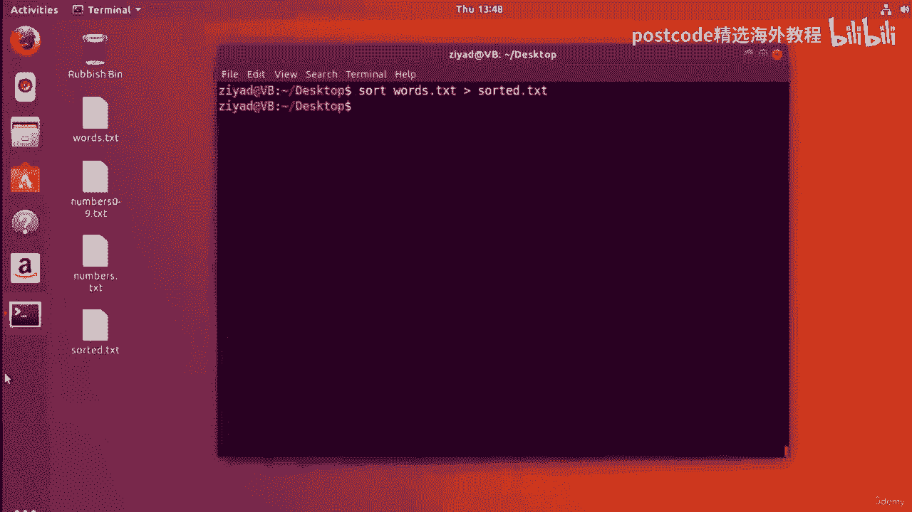

```bash
sort words.txt
```

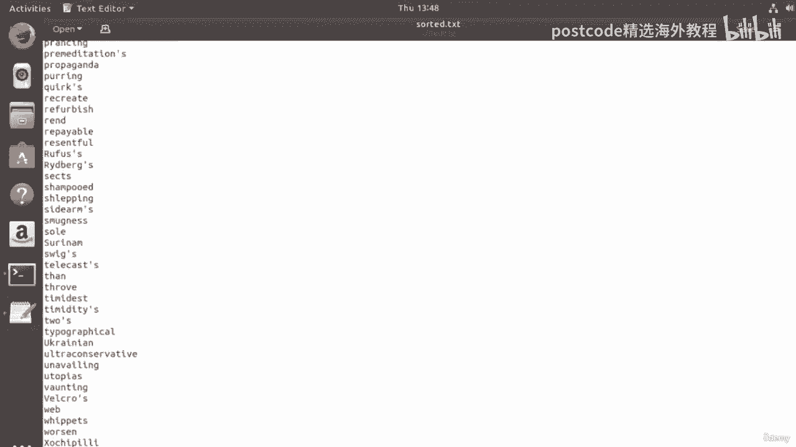

执行后，所有以A开头的单词会出现在顶部，以Z开头的单词（如果有）会出现在底部。你可以将排序结果重定向到一个新文件：

```bash
sort words.txt > sorted_words.txt
```

---

## 反向排序

有时我们需要反向排序（Z到A）。有两种方法可以实现：

**方法一：** 使用 `tac` 命令反转 `sort` 的输出。
```bash
sort words.txt | tac
```

**方法二（推荐）：** 使用 `sort` 命令内置的 `-r` 选项。
```bash
sort -r words.txt
```

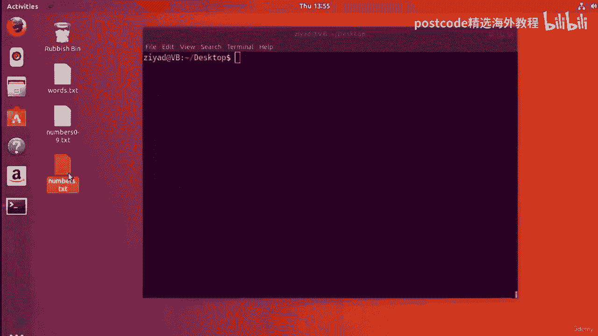

两种方法都能让接近Z的字母出现在顶部。为了更方便地查看长输出，可以将其通过管道传递给 `less` 命令：

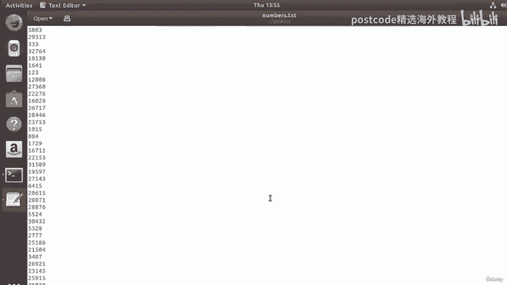

```bash
sort -r words.txt | less
```

---

## 按数字值排序

上一节我们介绍了文本排序，本节中我们来看看数字排序。按字母顺序排序数字与按数字值排序是不同的。

如果直接对 `numbers.txt` 使用 `sort`，它会根据数字的**第一个字符**进行字母排序（例如，`160` 会排在 `29` 前面，因为 `1` 在 `2` 之前）。

```bash
sort numbers.txt
```

要按数字的**整数值**进行排序，需要使用 `-n` 选项：

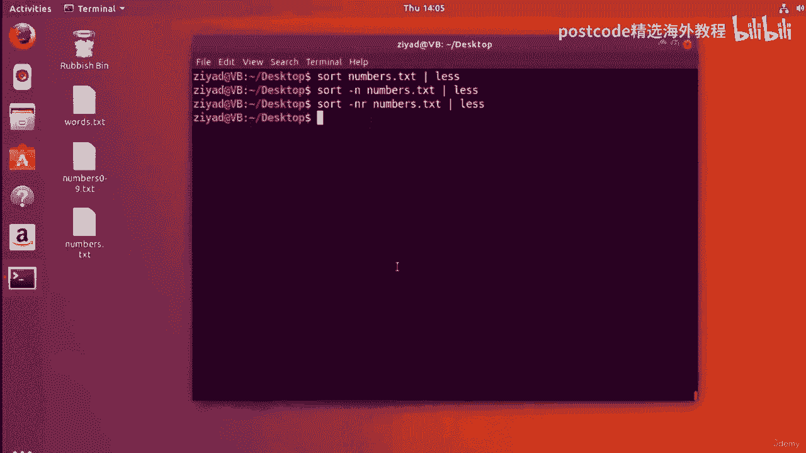

```bash
sort -n numbers.txt
```

现在，最小的数字会出现在顶部。同样，可以结合 `-r` 选项进行反向数字排序：

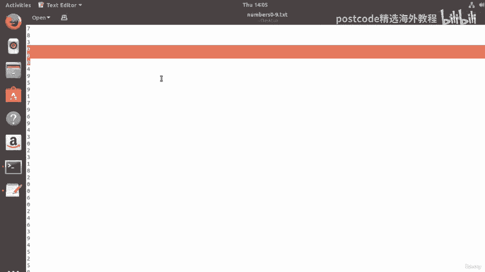

```bash
sort -rn numbers.txt
```

---

## 显示唯一结果

当数据中存在重复项时，我们可能只想看到每个值出现一次。`numbers0to9.txt` 文件就是一个很好的例子。

如果直接排序，会看到很多重复的数字：

```bash
sort numbers0to9.txt
```

使用 `-u` 选项可以只显示唯一的结果：

```bash
sort -u numbers0to9.txt
```

现在输出中每个数字（0-9）只会出现一次。`-u` 选项可以和其他选项（如 `-r`, `-n`）结合使用。

---

## 按特定列排序

`sort` 命令的强大之处在于可以对结构化数据（如 `ls -l` 的输出）按特定列排序。这需要使用 `-k` 选项来指定“键定义”。

以下是 `ls -l` 命令输出的前20行示例，我们将学习如何按不同列对其排序。

```bash
ls -l /etc | head -20
```

### 按文件大小排序（第五列）

假设我们想按文件大小（第五列）从大到小排序。以下是具体步骤：

1.  **确定列号**：从左到右数，文件大小在第五列。
2.  **使用键定义**：`-k5` 表示按第五列排序。
3.  **指定排序类型**：`-n` 表示按数字值排序。
4.  **指定顺序**：`-r` 表示反向（从大到小）。

组合命令如下：

```bash
ls -l /etc | head -20 | sort -k5 -rn
```

### 按人类可读格式的大小排序

`ls -lh` 能以人类可读的格式（如K、M）显示文件大小，但直接使用 `-n` 选项排序会出错。此时应使用 `-h` 选项进行排序。

```bash
ls -lh /etc | head -20 | sort -k5 -hr
```

### 按修改日期排序（第六列）

如果想按文件的修改月份（第六列的一部分）排序，可以使用 `-M` 选项。

```bash
ls -lh /etc | head -20 | sort -k6 -M
```

同样，可以加上 `-r` 进行反向排序。

### 小挑战：按链接数排序

现在，尝试按第二列（链接数）进行排序，让最小的数字排在最前面。请暂停视频思考一下。

**答案：**
```bash
ls -l /etc | head -20 | sort -k2 -n
```
因为默认就是从小到大排序，所以只需指定按第二列 (`-k2`) 进行数字排序 (`-n`) 即可。如果想从大到小排序，则加上 `-r` 选项。

---

## 总结

本节课中我们一起学习了 `sort` 命令的核心功能：
*   **基本排序**：`sort <file>` 默认按字母顺序排序。
*   **反向排序**：使用 `-r` 选项。
*   **数字排序**：使用 `-n` 选项按数值大小排序。
*   **唯一值**：使用 `-u` 选项去除重复行。
*   **按列排序**：使用 `-k` 选项指定列号，并可结合 `-n`（数字）、`-h`（人类可读大小）、`-M`（月份）等选项进行复杂排序。

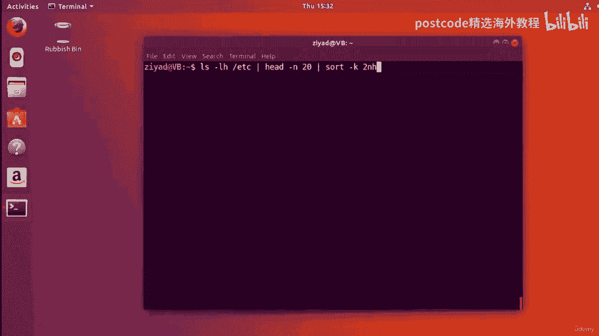

通过组合这些简单的“构建块”，你可以在命令行中高效地处理和排序各种数据，无需依赖图形界面工具。