# 红帽企业Linux RHEL 9精通课程 — RHCSA与RHCE 2023认证全指南 - P37：04-04-013 Search - 精选海外教程postcode - BV1j64y1j7Zg

因此，首先我想谈谈 grep 命令的实际作用，在我们开始讨论它是如何工作之前。因此 grep 命令将搜索您提供的任何输入，以查找包含特定内容的行，您告诉它要搜索的一段文本。好的。例如。

我的桌面上有一个名为 hello dot txt 的文件，如果我转到桌面，然后使用 cat 命令看看里面有什么，惊喜，惊喜，它在那里打招呼，你们这些美丽的人，每个词都独占一行。

现在让我们使用 grep 命令查找其中包含字母 e 的所有行。现在，我们这样做的方法是输入 grep，然后输入我们要搜索的内容。字母 E 以及我们要查找的内容。

所以我们会在 hello dot 文本中说。好的，所以我们在这里说的是嘿 grep 找到 hello 中的每一行。文本包含字母 e，现在默认情况下 grep 命令区分大小写。所以大写和小写很重要。因此。

如果我按 Enter 键，您会在这里看到包含字母 E 的行，甚至，字母本身也被突出显示。所以这很酷。有趣的是，在 1939 年，有一个叫欧内斯特·文森特（右）的人写了一本小说。

名为Gadsby的那篇文章大约有50，000字长。现在，《盖茨比》的特别之处在于，尽管它有五万字长，但没有一次是，使用字母 E。现在，这不是令人难以置信吗？

特别是如果您认为字母 E 显然是英语中最常用的字母，字母。所以，不用字母就能写出一本像故事一样的五万字书，这真是一项了不起的成就，E 和我只是碰巧我不知道怎么会在这个随机的地方有一本盖茨比的副本。

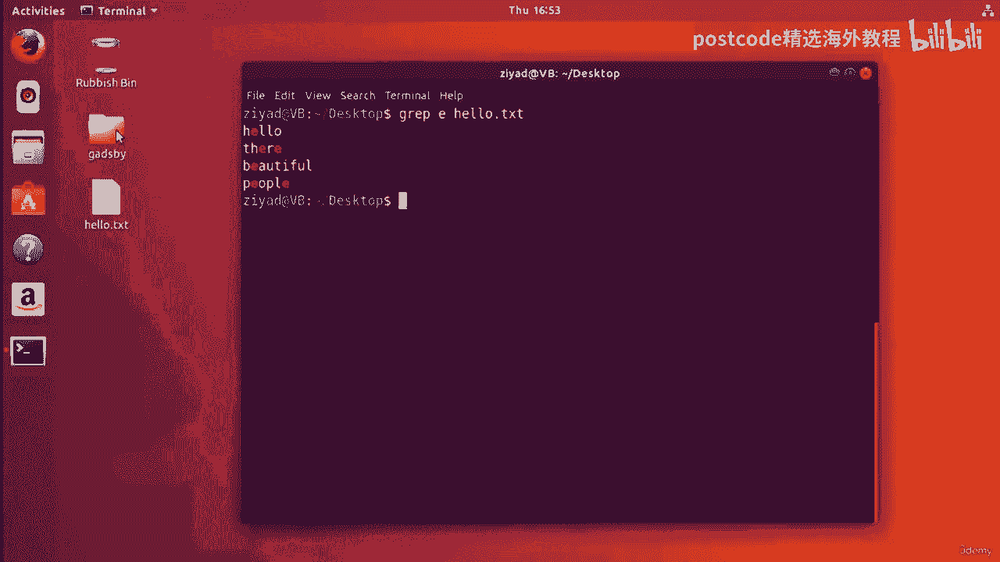

在我们的桌面上创建了名为 Gadsby 的文件夹。这是盖茨比手稿文本。现在这本书已经很老了，可以在公共领域免费获得，您可以访问，也可以使用我将放在资源中的链接。无论如何。

这样做的原因是我们可以使用 grep 命令来计算所包含的行数，出现一段特定的文字。例如，我们看到当我们在 hello 文本中搜索字母 E 时，我们得到四个结果，对吧？

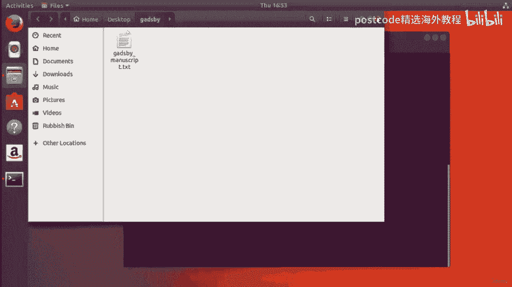

所以我们在那里打招呼，那里的人很漂亮。所以我们实际上可以确认这一点。我们可以通过为 grep 命令提供 C 选项来查看，这将告诉您有多少行。它只会告诉您找到的行数，并告诉我们有四行。好的。所以它说，嘿。

我在 hello 文本中发现了四行包含字母 E 的行。现在我们有了名为 Gadsby Manuscript Text 的文本文件，如果我们打开它。

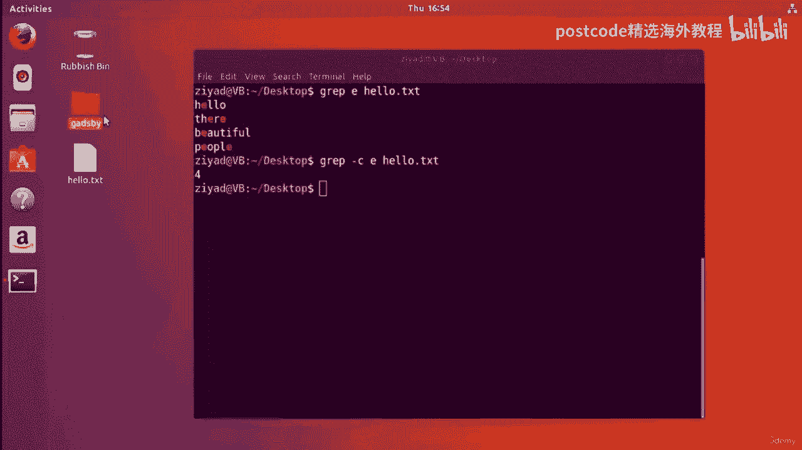

你可以看到这里有很多东西。好的。事实上，这本书约有43章，5万多字。实际上，我可以通过进入 Gadsby 文件夹并使用来告诉您其中有多少行。

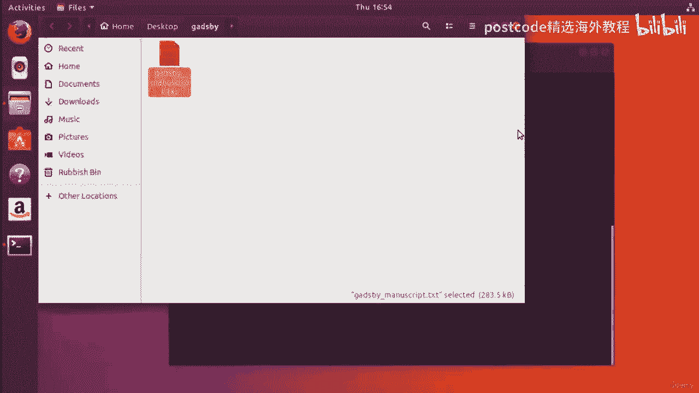

盖茨比手稿上使用 L 命令的字数统计。它告诉我们，它告诉我们有 1914 行，这是相当多的行。那么让我们尝试在书中搜索“Gadsby”这个词。盖茨比。因此。

如果我在 Gadsby 手稿文本中执行 grep Gadsby，您会发现什么也没有显示。没有显示任何内容的原因是 Gadsby 以大写 G 开头，而我们将其拼写为，这里是小写的 g。

现在我们可以以不区分大小写的方式进行搜索，这样大小写就完全不重要了，为 grep 命令提供 AI 选项。因此，当我们这样做时，我们会看到它向我们展示了它向我们展示了不同数量的结果。

盖茨比在《盖茨比》一书中出现过很多次，所以屏幕上很清楚。您还可以在盖茨比书中搜索字母 A，只需将字母 A 放在这里，我们就会，看到我们得到一大堆使用字母 A 的行，如果我们，按 see 选项。

我们会看到有 951 行包含字母 A，所以这相当多，很多。现在让我们尝试一下，看看这本书使用了该字母多少次。E 因此，无论我们是否这样做，我们都不关心它是大写还是小写。我们不需要任何 E。

因此我们将使其不区分大小写，并且我们将计算有多少个，线路有。我们要把字母 E 放在那里！如果我们现在继续并按 Enter 键，我们可以看到答案是零。所以 Gadsby 手稿没有使用字母 E，这已被批准。

Linux 批准了它，不使用字母 E，因此请在资源部分下载手稿并亲自尝试一下。现在，您实际上还可以搜索完整的句子，只要将它们用引号引起来即可。所以书中经常使用的一个短语是“我们的男孩”这句话。

这样我们就可以在那里寻找我们的孩子。我们将把它放在引号中。因此请确保它作为一个参数输入。当我们按 Enter 键时，您可以看到有九行包含它。但让我们也来看看它们。

所以你可以看到文本应用程序男孩有很多结果。现在您还可以搜索与特定文本片段不匹配的行，这样您就可以看到有多少行，使用字数统计命令在整个 Gadsby 文档中显示行数。

所以如果我计算一下 Gadsby 手稿的字数，现在有 1914 行，因为没有字母，Gadsby 中的 E 应该有 1914 行没有字母 E 现在我们可以使用 V 检查，选项。现在。

V 选项基本上执行相反的操作或反转搜索。因此，如果我们执行 grep，我们会在 Gadsby 手稿文本中使用 e OC 的 V 选项执行 grep。我们正在做的就是尝试找到所有没有字母 E 的行，他们。

因此，如果没有 V，您将找到所有包含 E 的行。使用 V 选项，它将找到所有不含字母 V 的行。那么让我们这样做吧。所以现在我们看到了一大堆东西出来了，但是其中有多少，有多少有，真的出来了吗？好吧。

我们可以使用 C 选项来计算它们，我将引用它。我要把它剪掉。会是1914线吗？盖茨比真的没有信吗？E哦，为了节省时间，请在下一个视频中回来查找答案。欢迎回来。女士们先生们。

我相信你们的期待已经快要窒息了。所以我们到了。我们试图查明盖茨比是否确实使用了字母 E。现在 Gadsby 的长度是 1914 行。因此，如果在这里使用此命令我们得到答案 1914。

那么我们知道每一行都不包含，这封信。E 好吧，让我们继续按 Enter 键，让我们看看。正如我们预期的那样，我们得到了 1914 行。人群变得疯狂。所以我们就到了。是的。

grep 命令也能以这种方式工作。两种方式我们都得到了相同的答案。顺便说一句，现在您可以使用 grep 命令一次在多个文件中搜索。所以我有一个我在桌面上有一个文件，我不叫你好文本。因此。

如果我稍微返回桌面并将其剪切掉，它会说你好，你启动了，人们。令人惊讶的是，现在如果我们想比较我的 hello txt 文件和盖茨比的文学天才，手稿，那么我们可以使用 grep dash。

我会在盖茨比手稿中寻找字母 e。所以这将位于 Gadsby 文件夹中 gadsby 手稿和我的 hello 文件中。我们可以看到它向我们展示了“我的你好”。TXT 文件在这里有结果。这里有结果。

这里有结果，那里有结果。但你在这段文字中看不到任何关于盖茨比的内容，你也可以数数。因此，如果我这样做，您可以看到盖茨比手稿对字母 e 返回零结果，我的 txt 文件返回 4。因此，尽管我有五行文本。

而盖茨比的文本有 1914 年，我还是设置了五行中的四行。我的文本中 80% 都有字母 E，而有的则没有。所以我认为盖茨比只是在炫耀。现在您已经知道如何使用 grep 命令来分析文学名著了。

实际使用它的最常见方法是在通过管道传递给它的数据中进行搜索。因此，如果我只是清除此命令行，我们将向您展示如何清除，屏幕。我们将向您展示如何使用 grep 命令进行查找来完成一些更繁重的任务。

假设您想查看一个大文件夹的内部，看看里面是否有文件。好的。是的，我们可以使用 find 命令，但也许我们认为 find 命令有点繁重，进行如此快速的检查。

所以让我们在桌面上创建一个名为 hello 的文件夹，然后移动 hello 点，txt 放入该 hello 文件夹中。当我们观察时，我们应该看到情况确实如此。

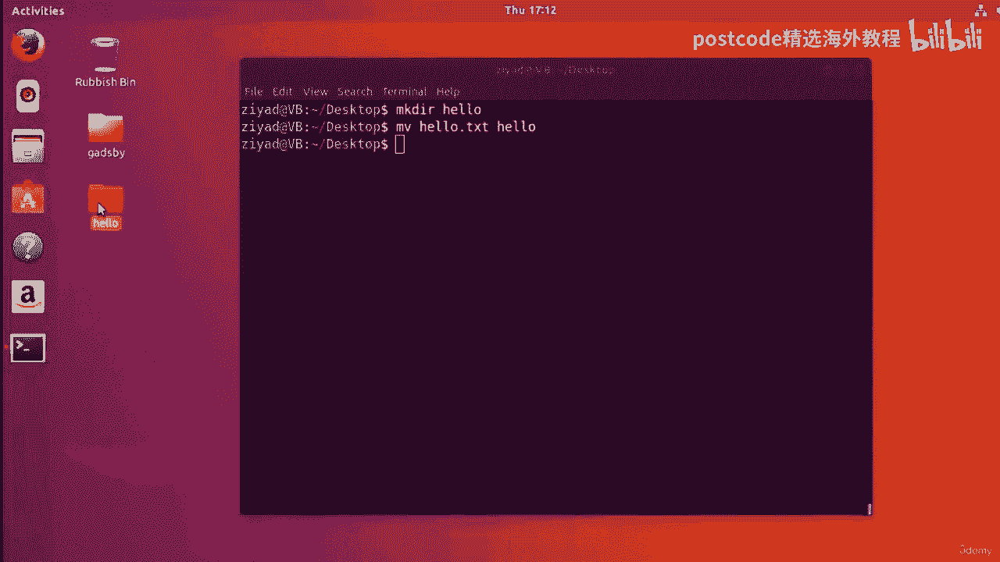

是的。我们里面有txt。现在让我们在里面创建更多文件。

让我们触摸 hello 文件夹内部。我不知道。我想就像文件一样，比方说 100 个文件。

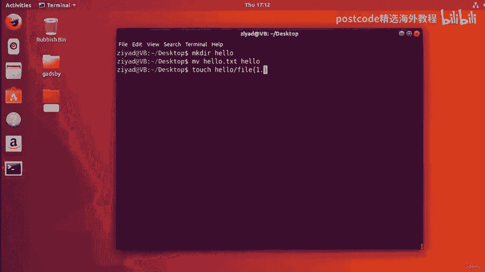

现在我们可以看到其中有 100 个文件，并且其中某处有 hello 文本。

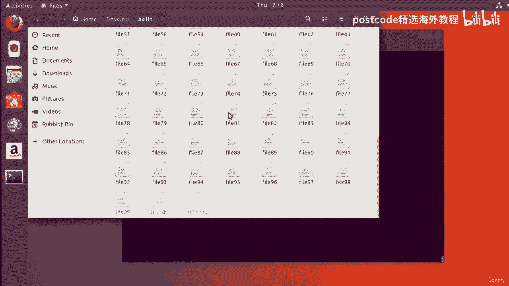

好的，假设我们想使用 RLS 命令列出其中的内容。你好。您看，您会从 LRS 命令中获得相当多的信息，特别是如果我们有，L 选项。肯定有很多信息出来。

但你可以做的是你可以使用 LRS 选项并将其通过管道传递给 grep 命令并说，嘿，我们正在寻找 hello txt，您会看到它已将 hello 文本突出显示为，在场，这样可以帮助您搜索那里的东西。

他们经常使用的另一个例子是当我查找有关特定文件或文件夹的详细信息时，使用 LS 命令获得权限。例如，如果我想查看路由主目录的权限，我可以使用 ls 执行，L 和大写 F 选项。

与 和 正斜杠一起查看所有内容，所有权限，对于基本目录中的所有内容。好的。但假设我想专门查看名为 Root 的文件夹。好吧，那么我可以将其输入 grep 并输入 root，它会告诉我们您将能够看到。

这里的根文件夹就是这样出来的。或者，如果我们想查看的话，我们可以查看 opt up，可选文件夹。我们只需查看 OPPT，它就会为您剪下该行，您就可以看到它。所以您知道。

您可以看到如何过滤出您正在寻找的内容。所以这是一个非常非常有用的选项。假设我们正在查找，比如说，我想要所有文件，而不是 ETSI 中的文件夹，目录，比方说。

然后我可以做的是我可以对 FC 文件夹说 LRS 并带有 F 选项，您可以看到它，向我们展示了这里的一切。所有文件夹后面都有斜杠，而所有文件则没有。所以如果我想找到所有文件。

我只需要找到所有没有斜杠的文件，对吗？因此，如果我获取所有这些数据，将其传递给 grep，为其提供 V 选项和斜杠。这就是说，好吧，获取所有数据并给我每一行没有斜线的行。现在我们就到了。我们有。

所有文件，然后我可以将其重定向到文件列表中。TXT。现在我得到了 NC 文件夹中的文件列表。

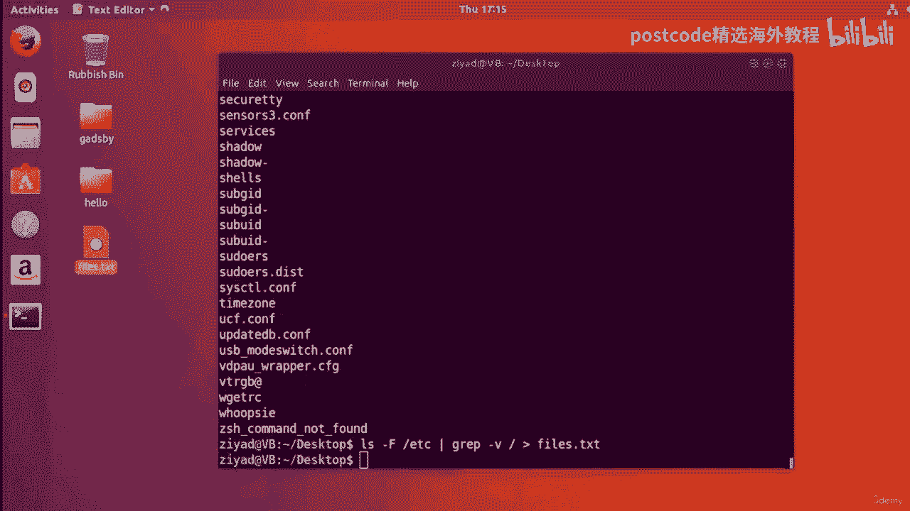

当然，如果您想要的话，我们可以对所有这些以及其他任何内容进行排序，这样我们就可以从。

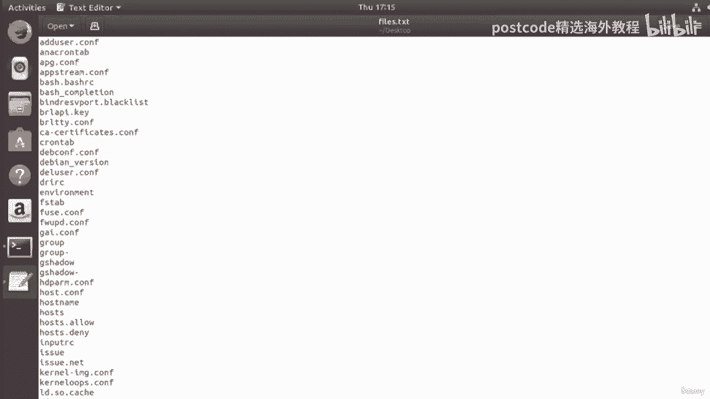

在那里然后对其进行排序。撤销。假设我们希望它们向后，然后将其放入文件中。

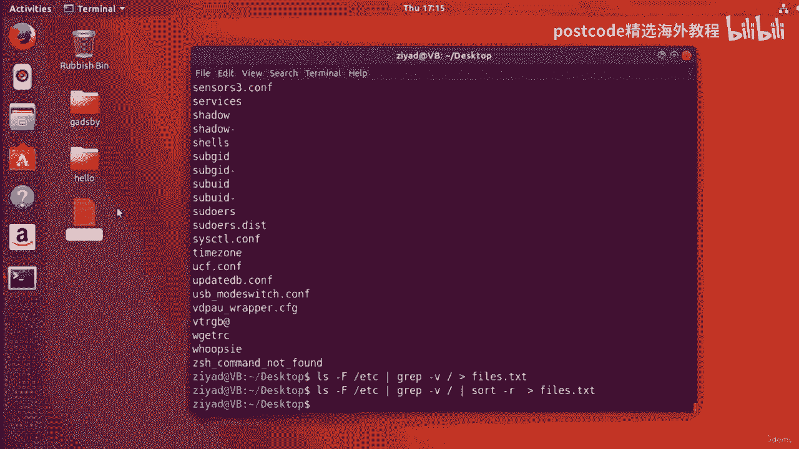

TXT，我们会看到一切现在都向后了，Z 在顶部，字母 A 在底部。

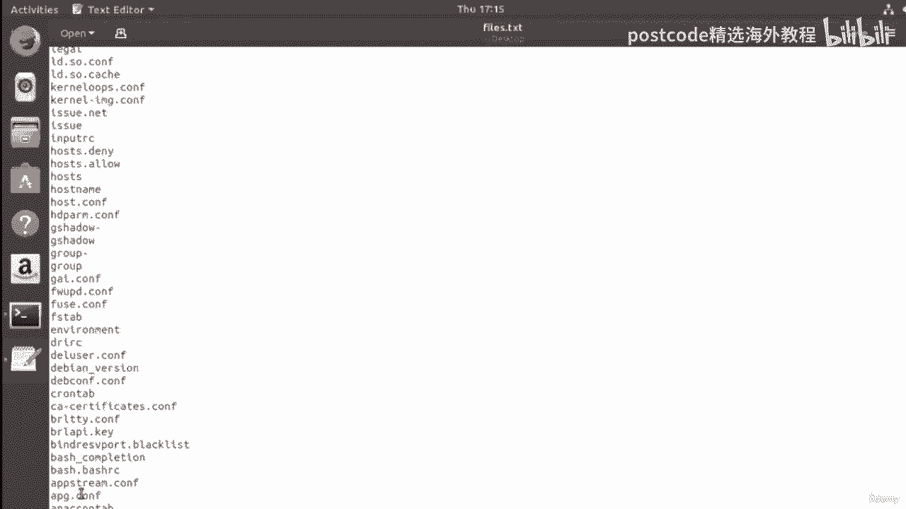

所以你可以看到使用所有这些东西是如何真正很好地联系在一起的。如果你明白这一点，你就是专业人士了，好吗？因为就像，你知道，如果你是，你知道，就在不久前，所有这一切都会发生，对你来说完全是胡言乱语。

但现在你明白了，嘿，我们只是使用 LS 命令，我们正在对即将发生的事情进行分类，与 F 选项一起退出。所以它在目录周围给了我们一个斜杠，而在文件周围没有任何内容。我们正在 C 文件夹中查找。

我们正在里面寻找。他们使用所有内部数据，对所有没有斜杠的内容使用 grep 命令，这给了我们所有的文件。然后假设我们对它们进行反向排序，然后将其保存在一个名为 files 的文件中。TXT 因此。

您可以看到我们如何使用多个不同的命令来更轻松地构建这些管道，当我们完成课程时会变得更容易。现在，另一个真正常见的用途是当您使用 man Dash K 命令时。因此，您知道何时想在手册页中搜索内容。

假设我们想要搜索打印，我们可以看到有很多不同的选项来打印它。您可以自己读出所有这些内容，但这有点痛苦。如果您想搜索更具体的内容怎么办？好吧，你知道，你可以 grep 并说，好吧，好吧。

我正在专门寻找文件，然后。

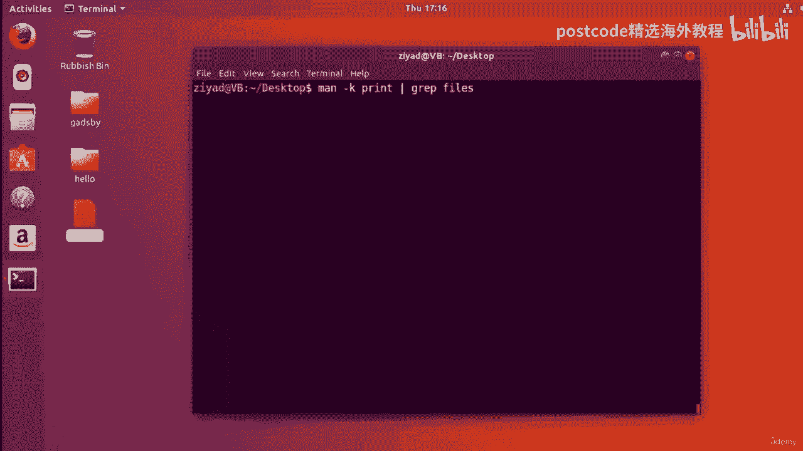

它会告诉我，你知道，它会找到所有提到的文件，这使得它变得更容易，给我们看。然后我们可能会注意到打印文件的 LPR 命令。这里还有 cat 命令可以连接，它可以连接文件，尝试说，速度快三倍。

可以将文件连接到标准输出。好的。