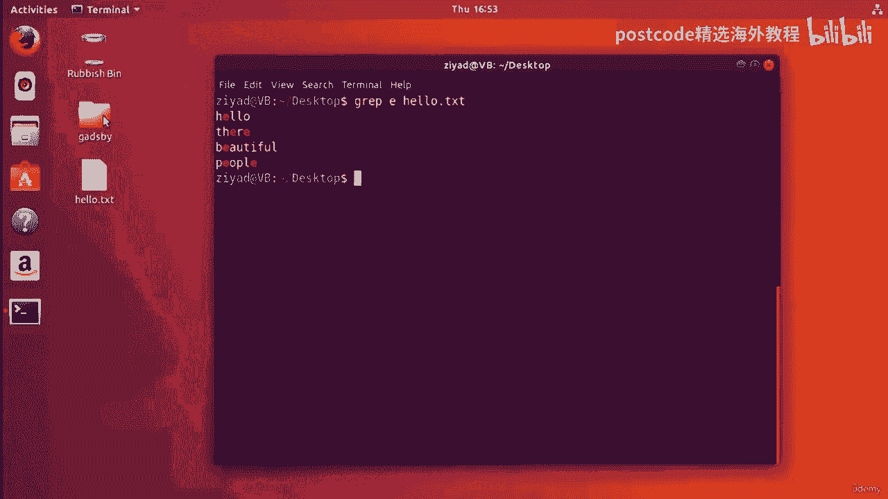
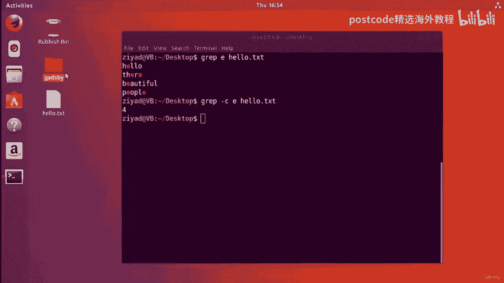
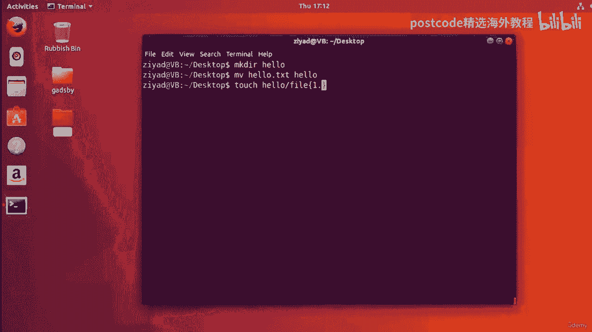
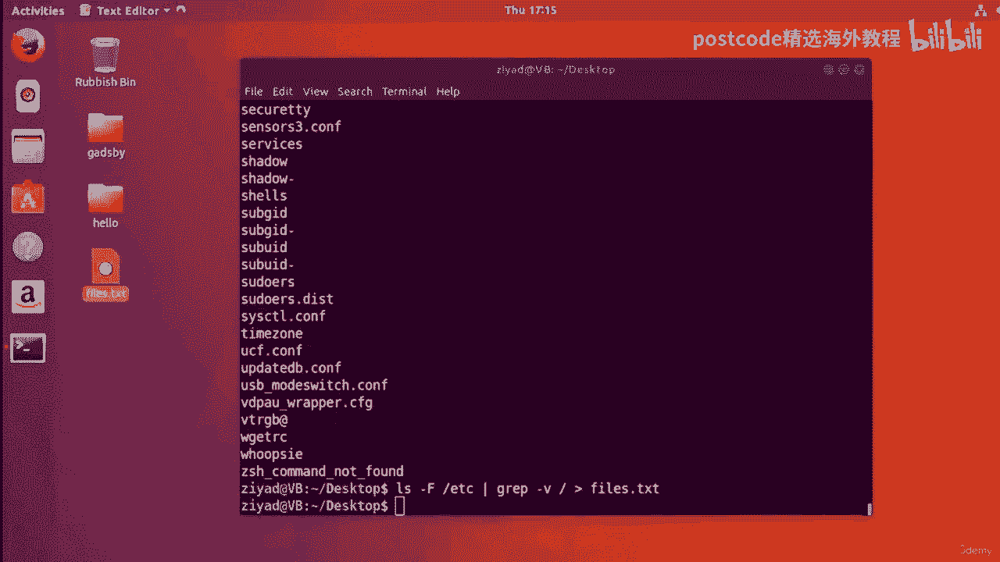
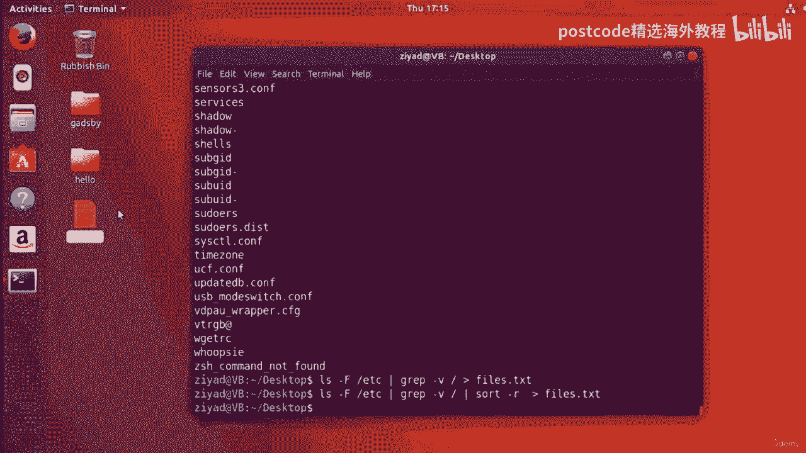
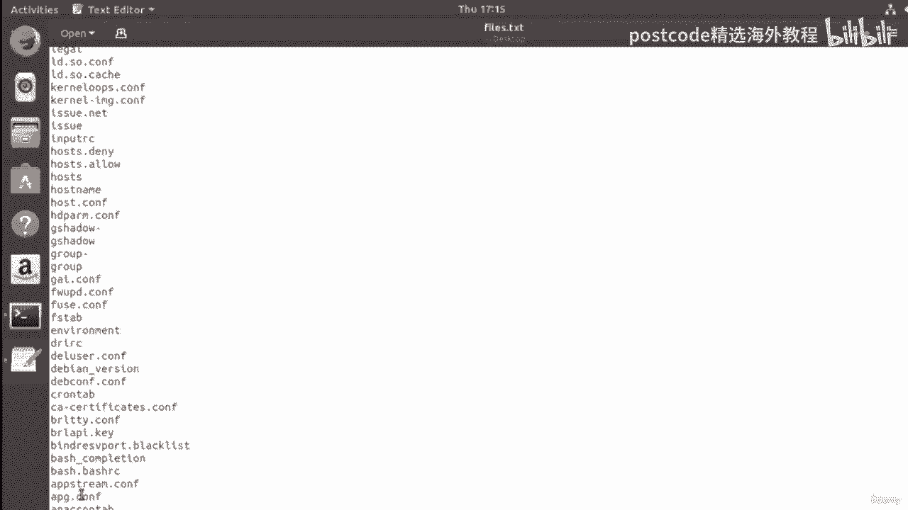
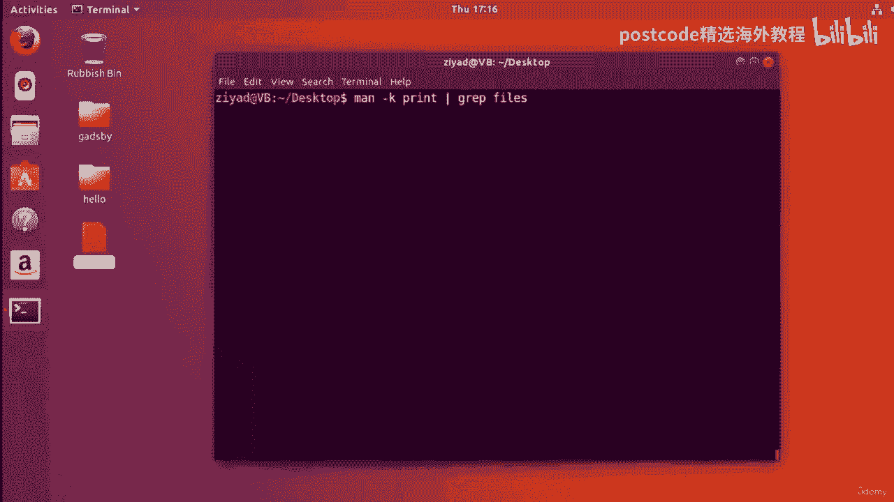

# Linux命令行工具精通课程：04-04-013：使用grep命令进行文本搜索 🔍

在本节课中，我们将学习如何使用 `grep` 命令在文本和文件系统中进行高效搜索。`grep` 是 Linux 系统中一个非常强大的文本搜索工具，能够帮助我们从大量数据中快速定位所需信息。

## 概述

`grep` 命令的核心功能是搜索您提供的任何输入，以查找包含特定文本模式的行。它通过逐行扫描文件或输入流，并输出匹配指定模式的行来实现这一功能。

## grep命令的基本用法

首先，我们通过一个简单的例子来了解 `grep` 命令是如何工作的。

我的桌面上有一个名为 `hello.txt` 的文件。使用 `cat` 命令查看其内容，可以看到里面有几行文本，每个单词独占一行。



```bash
cat hello.txt
```

现在，让我们使用 `grep` 命令查找其中包含字母 `e` 的所有行。基本语法是输入 `grep`，后跟要搜索的模式，然后是目标文件名。

```bash
grep e hello.txt
```


默认情况下，`grep` 命令是区分大小写的。因此，上述命令只会匹配小写字母 `e`。执行后，包含字母 `e` 的行会被显示出来，并且匹配的字母会被高亮显示。

## 一个有趣的案例：小说《Gadsby》



为了更深入地探索 `grep`，我们引入一个有趣的案例。1939年，一位名叫欧内斯特·文森特·赖特的人写了一本名为《Gadsby》的小说。这本书的特殊之处在于，尽管它有大约五万字，但全书没有使用一次字母 `E`。


在我们的桌面上，我们有一个名为 `Gadsby` 的文件夹，里面包含了 `Gadsby` 手稿的文本文件。这本书已进入公共领域，可以免费获取。

## 使用选项增强搜索

`grep` 命令提供了多个选项来定制搜索行为，使其更加强大和灵活。

### 统计匹配行数（`-c` 选项）

我们可以使用 `-c` 选项来统计匹配模式的行数，而不是显示所有匹配行。

```bash
grep -c e hello.txt
```
此命令会输出 `hello.txt` 中包含字母 `e` 的行数。

### 进行不区分大小写的搜索（`-i` 选项）

如果我们想忽略大小写进行搜索，可以使用 `-i` 选项。例如，在 `Gadsby` 手稿中搜索单词 “gadsby”：

```bash
grep -i "gadsby" Gadsby/Gadsby_Manuscript.txt
```

### 搜索完整短语

`grep` 也可以搜索完整的句子或短语，只需将它们用引号括起来。

```bash
grep -i "our boy" Gadsby/Gadsby_Manuscript.txt
```

### 反向搜索（`-v` 选项）

`-v` 选项用于执行反向搜索，即输出所有**不**匹配模式的行。这对于排除某些内容非常有用。

```bash
grep -v e hello.txt
```

## 验证《Gadsby》的独特性

现在，让我们运用所学知识来验证《Gadsby》是否真的没有使用字母 `E`。

首先，使用 `wc` 命令查看文件总行数：

```bash
wc -l Gadsby/Gadsby_Manuscript.txt
```
假设输出显示有1914行。

接着，我们搜索包含字母 `E`（不区分大小写）的行数：

```bash
grep -i -c e Gadsby/Gadsby_Manuscript.txt
```
如果输出为 `0`，则证实了书中确实没有使用字母 `E`。

最后，我们使用反向搜索来验证所有行都不包含字母 `E`：

```bash
grep -i -v -c e Gadsby/Gadsby_Manuscript.txt
```
如果输出同样是 `1914`，则与总行数一致，双重验证了我们的发现。


## 在多个文件中搜索


`grep` 命令可以同时在多个文件中进行搜索。例如，比较 `hello.txt` 和 `Gadsby` 手稿：



```bash
grep -i e hello.txt Gadsby/Gadsby_Manuscript.txt
```
要分别统计每个文件的结果，可以结合 `-c` 选项：


```bash
grep -i -c e hello.txt Gadsby/Gadsby_Manuscript.txt
```

## 结合管道进行高级过滤

`grep` 最常见的用法之一是与其他命令通过管道（`|`）结合，对输出进行过滤。

### 在文件列表中查找特定文件

假设我们在一个包含许多文件的目录中，想快速找到某个特定文件：

```bash
ls -l /path/to/directory | grep filename
```

### 过滤命令输出的特定信息

例如，查看根目录（`/`）下所有项目的详细信息，但只显示与 `root` 相关的行：



```bash
ls -lF / | grep root
```


### 区分文件和目录



`ls -F` 命令会在目录名后添加斜杠（`/`）。我们可以利用这一点，结合 `grep -v` 来只列出文件（排除目录）：



```bash
ls -F /etc | grep -v /
```
这个命令会列出 `/etc` 目录下的所有文件（不包括子目录）。

我们可以进一步将结果排序并保存到文件：

```bash
ls -F /etc | grep -v / | sort -r > files.txt
```
这个管道操作的含义是：列出 `/etc` 下的内容，标记目录，过滤掉目录（即保留文件），将文件名反向排序，最后将结果保存到 `files.txt` 中。

### 在手册页中搜索

当使用 `man -k`（相当于 `apropos`）进行模糊搜索后，结果可能很多。我们可以用 `grep` 进行二次过滤，找到更精确的信息：

```bash
man -k print | grep file
```



## 总结

在本节课中，我们一起学习了 `grep` 命令的强大功能。我们从基础的单文件搜索开始，了解了其区分大小写的默认行为。接着，我们通过《Gadsby》小说的案例，探索了 `-c`（计数）、`-i`（忽略大小写）和 `-v`（反向搜索）等关键选项。我们还学习了如何在多个文件中进行搜索，以及最重要的——如何将 `grep` 与管道（`|`）结合，对其他命令的输出进行过滤，从而完成复杂的文本处理任务。掌握 `grep` 是成为 Linux 命令行高手的关键一步。