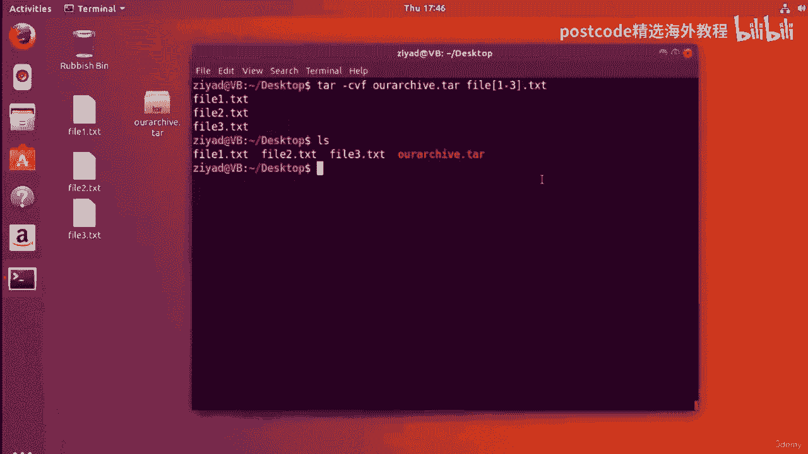
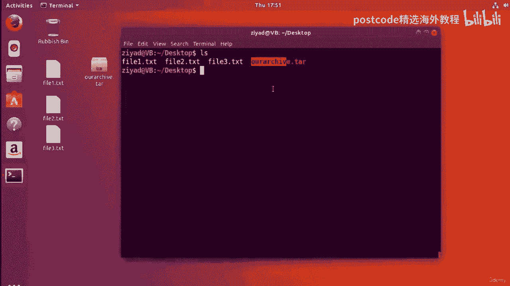
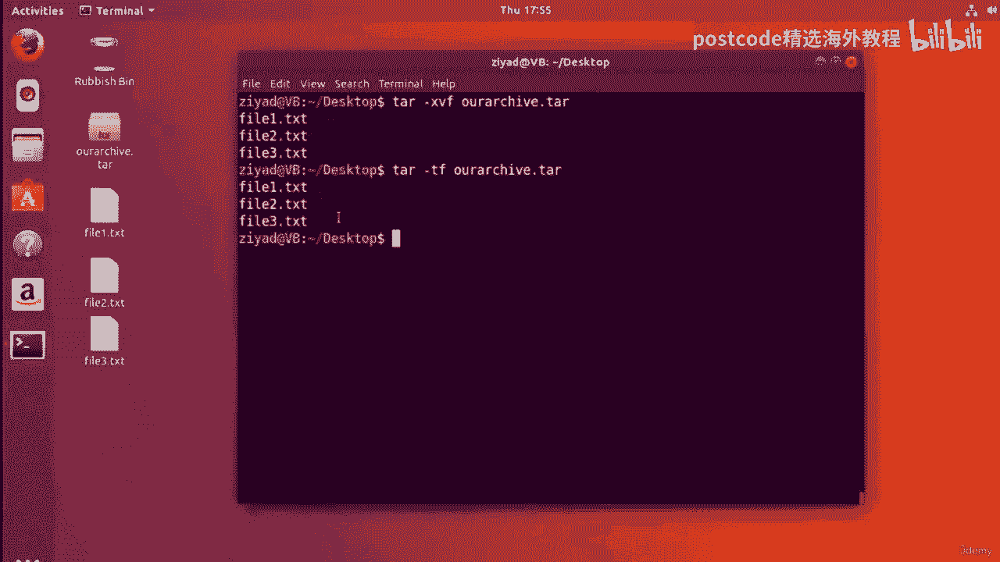
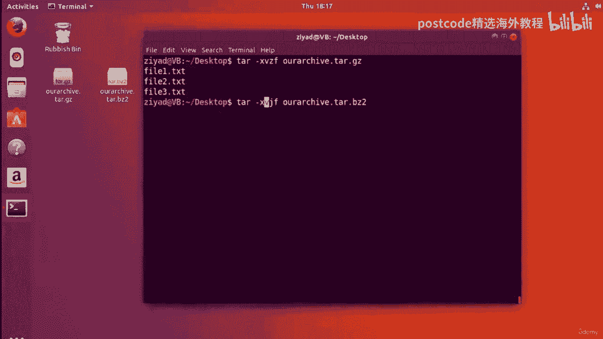

# 红帽企业Linux RHEL 9精通课程 — RHCSA与RHCE 2023认证全指南 - P38：04-04-014 Archive - 精选海外教程postcode - BV1j64y1j7Zg

因此，当您在 Linux 中压缩和归档文件时，您首先需要了解的是，称为 tarball 的东西。

现在我想让你想象一下你在购物中心或当地的商店，你正在买一些东西。

苹果。现在，让我问你一个问题。摘下这些苹果后，你会如何制作它们？

更容易携带。你会把它们放进袋子里吗？正确的。这就是创建 tarball 的基本过程。

好的。因此，创建 tarball 基本上是一种将文件放入包中以便更容易压缩的方法。

并使它们更容易存储。

当您将文件添加到 tarball 时，您就可以将所有文件存储在一个位置。

tar 球本身不进行任何压缩，但可以使用压缩算法来压缩 tar 球。

因此，归档文件基本上是一个两步过程。

首先，你制作一张桌子。

你制作一个 tarball。其次，使用某种压缩算法来压缩 tarball。

好的。那么让我们继续创建我们的第一个 tarball。

因此，我们在桌面上可以看到文件一 txt、文件到 txt 和文件三点。

txt，我们将把它们放在一个表中。现在如果我对这些文件做一个LZ并看看它们，你会发现它们都是关于。

大小为 10 KB。9。8 KB 的大小约为 10 KB。

我们将把所有这些放入一个 tarball 中。为此，我们将使用 tar 命令。

焦油命令。现在，tar 命令需要很多不同的选项才能使其正常工作。

所以首先我们输入 tar，然后我们需要给它三个选项。那么让我们输入一个破折号。

第一个选项是C选项。现在，C 选项让 tar 命令知道我们要创建一个新的存档。

接下来是 V，它让 tar 命令知道我们想要这样做。

我们希望它能对我们说话。

我们希望它能够给我们一些反馈，以便我们了解它的表现。现在 V 代表 Verbose，它基本上是说，嘿，tar 命令，不要默默地执行此操作。

跟我说话并让我知道发生了什么事。

好的。现在 V 选项完全是可选的。您不需要它来制作存档，但将其保留在那里是一个很好的做法。

最后的选项是F选项。现在，F 选项允许 tar 命令接受文件。

所以现在我们需要告诉 tar 命令我们要如何称呼我们的表。

好的，现在，按照惯例，我们以点 tar 文件扩展名结束 tar ball 文件。这只是一个约定，所以我们稍后就知道它们叫什么了。

因此，我们将其称为我们的存档点 tar。

最后，我们现在需要做的是告诉 tar 命令里面要放什么。

我们的压缩包。

所以我们要归档一个txt文件指向thc并归档三点txt。

因此，让我们使用通配符来节省一些输入并放置文件 123。txt。

这样我们就准备好了。所以我们要说的是，嘿，tar 命令，我们希望您创建一个新的存档。

所以我们给它C选项。我们说和我们说话。

我们知道发生了什么事。这就是 V 选项，我们将给它 F 选项，以便它可以接受新文件并创建。

一个新的档案。因此，让我们继续并按 Enter 键，我们看到它告诉我们发生了什么事，现在我们已经得到了。

这个新的 tar 文件实际上已经创建了。

你可以看到它看起来像一个小盒子，就像一个会移动的盒子。所以，你知道它是一个档案。

如果LZ我们做一下，我们实际上可以看到tar ball文件实际上已经以红色突出显示了。

只是为了让它更加突出，这非常好。万岁，我们实际上已经成功创建了我们的第一个焦油球。

现在这个命令，这个 tar 命令有很多不同的选项。

所以我所做的是针对所有处理归档的命令。

因此，在这个视频和下一个视频中，我制作了一份备忘单供您下载，其中详细介绍了如何。

执行不同的归档任务。所以不用担心记不住。现在，当我们完成存档处理后，您可以在下一个视频的资源部分中找到该内容。

好的，让我们通过使用 LHS 和 L 选项来看看文件有多大。

实际上我们要做的是使用以下命令来查找其中含有点焦油的内容。

使用 grep。所以我们只是看看里面有什么焦油来集中我们的结果。

我们看到实际上大约有 40，960 字节。

嗯，这很奇怪，因为我们有三个大约 10，000 字节的文件，现在我们有 40，960 字节。

焦油球。难道不应该是 30，000 字节或附近吗？嗯，不完全是。

好吧，想想苹果的例子。如果每个苹果重 100 克，你有 3 个苹果，然后你把它们装进一个袋子，里面装满了苹果。

袋，重300克。

不，因为袋子也有一定的重量。正确的。所以我们在这里看到的是，为了创建 tar 球，我们需要添加一些数据。

因此，只需将额外的尺寸想象为当您将苹果放入袋子时就会产生额外的重量。

这只是构建 tarball 的便利性的一部分。

但不用担心，当我们压缩 tar 球时，它会比文件小得多。

已经靠自己了。好的。现在我们可以通过查看点 tar 文件扩展名来判断这是一个 tar 球。

正确的。但请记住，在 Linux 中，文件扩展名实际上没有任何意义。

它们通常只是一种方便，以便我们可以将其视为人类，但它们没有任何意义。

必然到系统。因此，为了仔细检查它是否是一个 tar 球，我们可以使用您之前了解的 file 命令。

在课堂中。因此，如果我们确实文件干净地清除屏幕文件存档点 tar，您会看到它告诉我们。

它确实是一个 tar 存档。

现在，如果我们重命名这个 tarball，那么我们将其重命名为我们的存档 dot slam 让我们现在说，如果我们这样做。

如果我们对我们的存档的 so 文件执行 file 命令，您会发现 Linux 系统不是。

被骗了，它仍然知道它是一个 tar 存档，即使它没有 tar 文件扩展名。

因此，让我们把它改回来，因为我们不需要更多的混乱。

但这只是为了让您知道 tar 文件扩展名并不是特别特殊。

到系统。但同样，它可能是您安装在其上的其他程序，但您可以随时检查。

使用 file 命令的真正本质是什么。

但点 tar 文件扩展名只是让您和潜在的其他用户知道。

什么类型的文件一目了然。

现在您实际上可以查看焦油球中的内容，而无需将其提取。

假设您从互联网上下载了这个存档并且您想看一下。

在里面的东西。好的。好吧，您可以使用 tar 命令来做到这一点。

你要做的就是给它两个选择。您执行 T 选项和 F 选项，然后告诉它我们的档案。

TAR 好的，所以 T 选项意味着测试标签，它基本上可以让你检查 tar 文件中的内容。

和F选项。

这只是将文件传递给 tar 命令所必需的。因此，当我们这样做时，它会告诉我们文件一、文件二和文件三位于 tarball 内。

所以现在这很酷。我们稍后会讨论压缩，但首先，让我们看看如何。

再次将这些文件移出我们的 tar 球。嗯，其实很简单。

首先，我们删除该文件。无论点 txt。所以它们都消失了，我们这里只有我们的桌子，我们要把文件提取出来。

的。

好的，现在让我们尝试这样做。我们要做的方法其实很简单，对吧？

因此，您将拥有 tar 命令并记住创建存档。

你有 CVS，然后你将增长我们的归档 tar，然后我们给它一些文件。

好了，现在来提取，很简单。

您可以使用 X 进行提取，而不是使用 C 进行创建，其他一切都是相同的。

但您甚至不必向其提供任何文件，因为您没有将任何文件放入存档中。

只是用 tar x 来提取 v 以获取详细信息。

所以它告诉我们它实际上在做什么，并且 f 是必需的，这样您就可以将文件传递给 tar 命令。

当我们按下回车键时，我们会看到它是这样的。它确实为我们从档案中提取出了文件一、文件二和文件三。

我们将它们放回到运行命令时所在的目录中。

我们就这样吧。挺容易。正确的。再说一次，所有这些都在我们的备忘单中。

所以现在您可能会想，好吧，我们刚刚从 tar。gz 文件中提取了这些文件。

来自焦油球。焦油球现在是空的吗？嗯，事实上，事实并非如此。

你可以通过告诉它来检查文件是否仍然在那里，就像你一样，以前看过。

使用 TNF 选项检查内部，可以检查文件一、文件二和文件三仍然存在。

桌子里面。因此，无论您从表中提取多少次，该表仍然包含其内部的内容。

所以它就像一个 A，它是一个可重复使用的袋子，也许你可以从商店买到。

好吧，这真是太棒了。现在。为了节省时间，我将在这里中断视频。

在下一个视频中，我们将讨论如何压缩焦油球来制作它们。

较小。因此，尽管如此，我们还是会在下一个视频中见到您。

你好，你们这些美丽的人。欢迎回来。现在，在上一个视频中，我们将文件放入 tar 球中，现在我们想了解如何压缩。

该表可以节省我们的硬盘空间。

现在，压缩是使用压缩算法进行的，有两种主要的压缩算法。

在 Linux 世界中使用的，第一个是 GZIP 算法，第二个是 zip zip 两种。

它们之间的主要区别通常是 GZIP 速度更快，但压缩能力较低，并且 b。

压缩。另一方面，两个通常可以将文件压缩到比 GZIP 更小的大小，但确实需要更多。

计算时间。所以这两种压缩算法都非常易于使用。

那么我们先从谈论 GZIP 开始吧。

因此，要使用 GZIP 压缩 tarball，您所需要做的就是键入 gzip，然后键入存档名称。

那么我们的存档是谁，然后按 Enter 键，我们会看到该文件已被压缩到位。

使用GZIP算法我们可以看到它已经实现了。

如果我们在这里使用LZ命令，我们可以看到点GZ文件扩展名已经自动添加了。

我们可以使用 file 命令来确认这一点。

是的。这确实是 GZIP 压缩数据，它是存档点 tar，它会告诉您上次修改的时间。

以及。

所以这真的很酷。我们可以看到很多这方面的信息。现在让我们看一下文件大小。

因此，如果我使用 L 选项执行 LZ 命令，实际上，这只是 URL 选项。

我们会看到这一点。文件一、文件二和文件三的大小为 10，000 字节。

但压缩后的存档只有 23，000 字节，因此大约有 7000 字节或 7 KB。

小于文件原来的大小。所以我们实际上已经成功压缩了大约 23%。

所以这还不错。现在，这会因文件类型和实际压缩的内容而异。

但在本例中，我们使用 GZIP 获得了 23% 的压缩率。

所以请注意压缩是一个两阶段的事情。

首先我们制作一个 tarball，然后使用压缩算法压缩该 tarball，在此。

案例是GZIP。好吧，酷。那么反转 GZIP 怎么样？

我们怎样才能把焦油球找回来呢？嗯，这很容易。我们需要做的只是清空屏幕，将我们的存档解压到 GZ。

好的，所以你只要使用 g unzip 就可以了。

当您这样做时，您会看到它现在又回到了 tar 文件。如果我们查看，我们可以看到它是一个 tar 文件。

我们使用的是归档 tar 的文件命令，它告诉您这是一个 POSIX tar 归档。

万岁。好的，我们已经成功撤消了 GZIP 操作。

好吧，那么 B 的 zip 2 呢？嗯，B，zip 2 是一种更重负载的压缩算法。

虽然它比 GZIP 需要更多的计算时间，但通常并不总是，但通常会返回。

比使用 GZIP 获得的压缩文件更多。

所以这是一个权衡。现在让我们用 B 的 zip 2 压缩我们的 tarball，看看我们会得到什么。

所以这很容易。我们所要做的就是压缩到我们的存档 tar，当我们看到它时，我们现在发现它已经消失了。

bzr 为文件扩展名，如果我们对其使用 file 命令，我们可以看到它说它是 b zip。

来压缩数据。它不会告诉您压缩之前它是什么。所以我们丢失了一些信息。

但它确实已经被压缩并且 file 命令知道它已经被压缩。

那么它有多大呢？好吧，如果我们用 URL 选项看一下，我们就可以看一下，我们可以看到。

这是 23，137 字节。

所以比GC版本的23，023字节稍大一些。

现在，通常最好保存 zip 2，直到您有非常大的文件。现在，对于这些相对较小的文本文件，使用 B 的 Zip 2 并没有那么好，但是。

诸如视频之类的大文件，您肯定会看到压缩结果之间存在很大差异，通过B的YP 2和G zip实现。

现在要撤消 B 的 YP 压缩，实际上非常简单。我们所要做的就是解压缩到 B 所要归档的内容。

所以在我们的例子中，这个存档启动起来也很容易。

当我们按下回车键时，我们看到我们已经回到了 tar 文件，我们可以再次使用 file 命令。

检查一下，我们已经恢复了 tar 存档。

现在还有其他压缩算法，例如 xz 压缩算法。

如果您想查看 G、Zip B、YP 两者之间的性能更深入的比较。

Z算法，我在资源部分放了一个链接供您查找。

然而，现在您应该记住一件事，那就是如何创建 zip 文件？

现在，zip 文件是 Windows 或 Mac 上常用的文件，并且是压缩文件。

档案。现在他们不在了。

我不，我不认为它们像 GZIP 或 zip 2 那样压缩。

它们通常用于其他操作系统。因此，如果您想创建 zip 文件，这实际上是一个一步过程。

您只需输入 zip 即可。好的？

然后你将放置该文件。所以，让我们称它为我们的东西，zip，然后我们将放置文件 1。42。253。 txt 当我们按下回车键时。

我们会看到其中现在有一个 zip 文件。所以如果我按归档，我就会归档一个又一个的东西。对不起，拉链。它告诉我们这是一个 zip 存档数据，您可以在其他操作系统上使用它，例如，作为Windows。

而且您通常不能使用 g zip 文件或 b zip 来压缩文件。默认情况下，它们在其他操作系统上的运行效果不太好。您往往必须安装其他软件，例如 7 zip 或 winrar 或任何可能要解压的软件。

他们。当然，你可以解压该 zip 文件，它会问你，你想把它们全部解压吗？然后你就可以将它们全部提取出来。这只是问我们，因为它就像，哦，你可能必须覆盖一些东西，但这就是，没问题。我们只是答应了。

然后就成功了。因此，如果你想制作 zip 文件，zip 和 unzip 就是最佳选择。因此，如果我们现在清除屏幕，到目前为止我们一直将压缩视为一个两步过程。

首先，我们使用 tar 命令创建一个 tar 球，然后使用。

zip 或 B、zip 2 或者任何其他压缩算法。

但有没有什么办法可以一步完成呢？嗯，因为创建备份是一件很常见的事情，所以答案是肯定的，您实际上可以，创建一个 tarball 并直接使用 tar 命令中的压缩算法对其进行压缩。因此。

我们暂时删除 tarball 和 zip 文件夹。

因此，为了归档 tar，我们将删除它和我们的手指拉链。因此，我们将删除所有我们拥有的所有档案，然后我们将采取正确的做法。

仅从这里的原始数据，将这些原始文件一次性直接转换为压缩存档。

好的。那么要创建焦油来创建焦油球本身，我们该怎么做呢？

好吧，我们所做的就是创建 tar CBF，因此创建 verbose 并允许它接受文件。

我们将在那里创建存档 tar 并保存文件 1 到 3。

这就是我们通常的做法。但现在要压缩文件，我们只需要给它多一个选项。

因此，要使用 GZIP 来完成此操作，只需为其指定 Z 选项即可。

如果我们这样做的话，就会使用 GZIP 进行压缩，我们应该记住这一点，而不是命名。

它作为我们的档案。TAR 因为这将是 ag zip 文件，所以我们也应该在末尾添加 gz 以方便约定。

因为当您在使用此方法之前对其运行 GZIP 时，它不会自动添加。

自动添加 GZ 文件扩展名。

但现在因为我们一步完成这一切，所以我们必须提供文件名，所以我们需要添加。

它在那儿。如您所知，可以更轻松地了解正在发生的情况。当我们按下回车键时，我们会看到我们的存档 GZ 已经被创建并且。

我们可以使用 file 命令检查它实际上是一个 GC 文件，它说它是 GZIP 压缩的。

数据。所以这太酷了。好的。现在您将如何使用 B zip 2 来做到这一点。

好吧，如果我们点击屏幕 B，它也完全相同，只是不是 Z，而是。

J。因此，如果您按下，如果您有 J 并且现在记住了，我们将把扩展名更改为 B zip 2。

当我们按下回车键时，我们会看到我们的压缩包 Zip 2 已经创建，我们可以检查一下。

通过使用 file 命令，这确实是有效的，告诉它查看要存档的 b zip，它会告诉。

我们知道它是 b zip 压缩数据。

这就是您可以一次性压缩的方法。

我们如何一次性从这些压缩档案中提取出来呢？

嗯，这也很容易。好吧，让我们再次删除它们。事实上，不，这不是删除它们，因为我们需要它们。正确的。下面是我们通常如何从 tar 文件中提取内容。

好吧，如果你还记得的话，通常会怎么做，是 tar 然后 x vrf ，所以 x 代表提取，v 代表详细。

和 f 接受文件，您将给它 tar 文件。

但我们首先尝试提取 GZIP 选项。让我们删除这些原始文件，然后尝试先提取 GZIP 选项。

因此，要提取 GZIP 选项，我们需要再次键入 Z，因为 Z 代表 GZIP。

好的，所以压缩时有 Z，解压时有 Z，所有你需要的。

只需将 C 更改为 X 即可。

因此，当我们按下该键时，我们会看到现在我们已经将它们全部提取出来并且我们已经获得了数据。

后退。因此，如果我们在这里删除这些文件，如果我们在那里删除它们。

现在使用 B zip 解压怎么样？好吧，您还记得 J 代表 B zip。

因此，我们不用 Z，而是只输入 J，然后我们只需要告诉它存档是什么，然后，请记住，它是 ab zip 来存档，因此需要实际更改名称。

因此，我们通过 b zip 2 来 tar 提取详细信息，然后将文件提供给它。

我们到了。

我们已经使用蜜蜂进行了提取。所以这非常非常容易。只要您记住 Z 代表 GZIP 即可。

