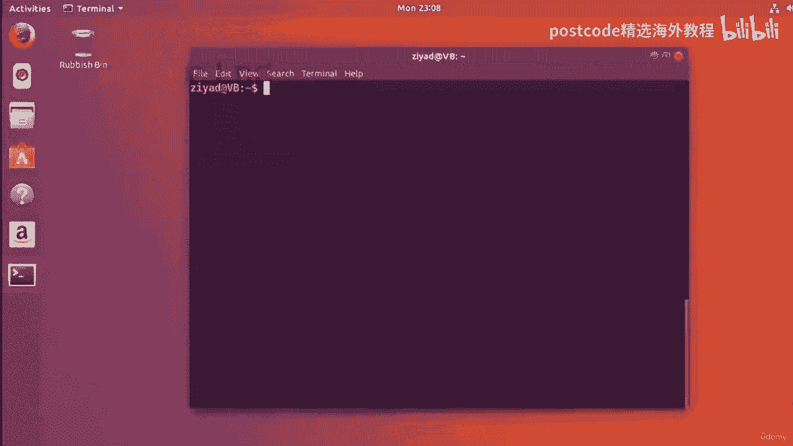
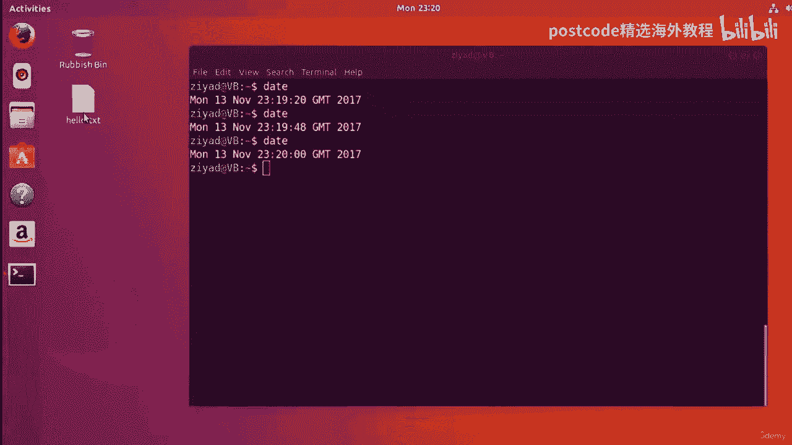
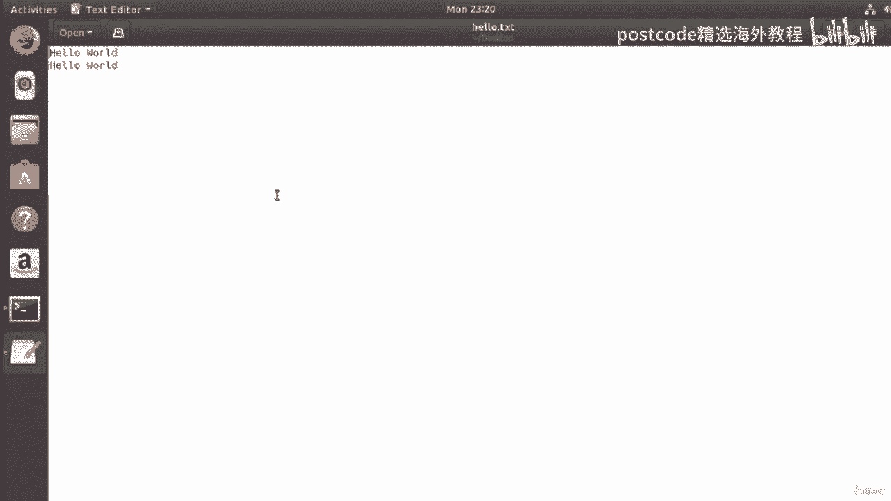
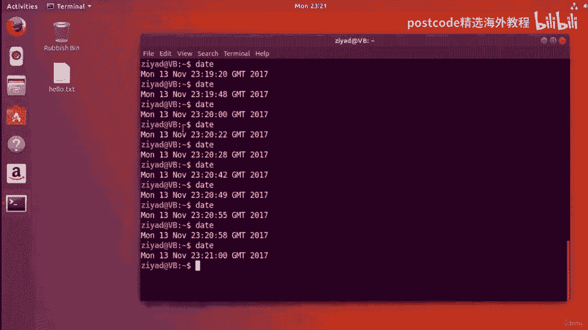
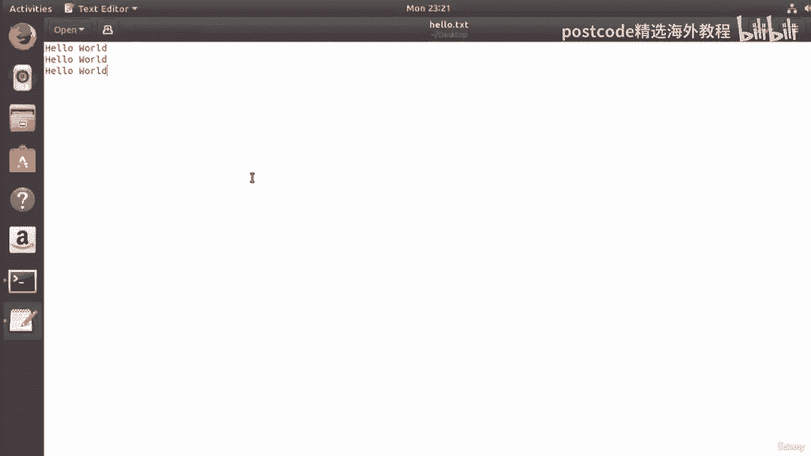
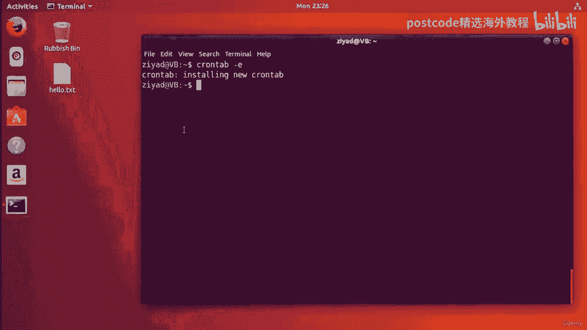
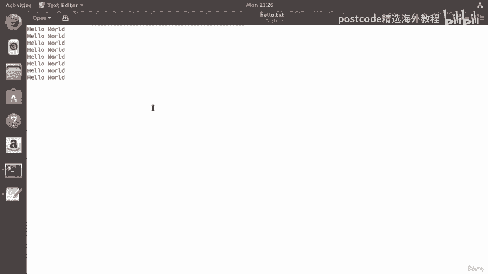
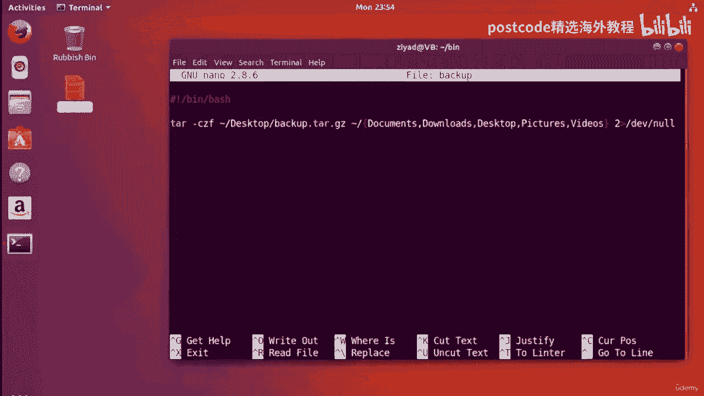
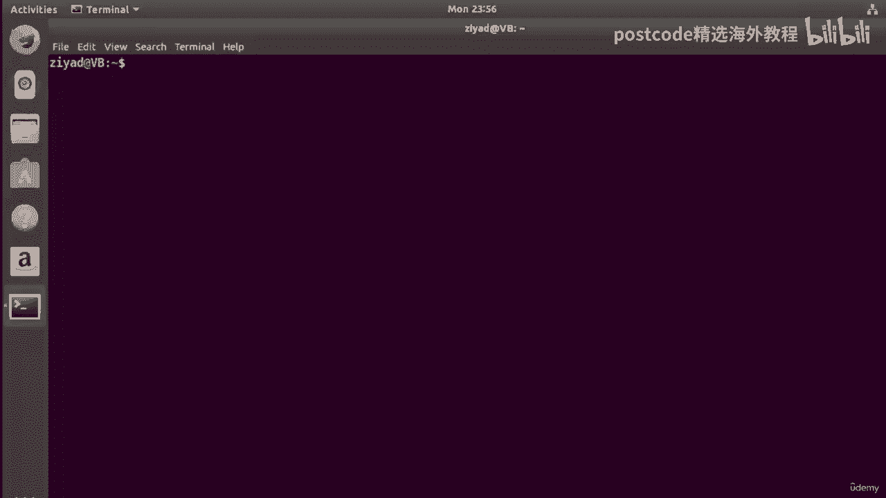
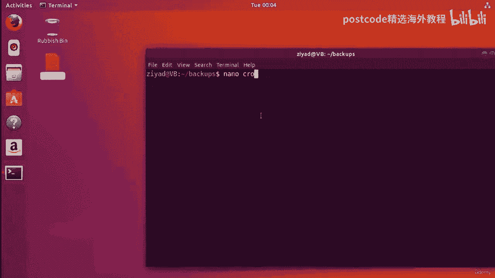

# 红帽企业Linux RHEL 9精通课程 — RHCSA与RHCE 2023认证全指南 - P39：04-04-015 Cron - 精选海外教程postcode - BV1j64y1j7Zg

好的。所以 Cron 是一个基于命令行的程序，用于安排任务。现在，Chrome 的名字来源于希腊语 Chronos，如果你想知道的话，意思是时间。所以凯伦实际上有一个很好的调度程序名字，对吧？

现在每个用户都有一个所谓的 cron 选项卡，它基本上只是一个文本文件。每个 cron 选项卡都会列出该用户将自动运行的命令或脚本。它还列出了它们计划运行的时间。现在要为您的用户编辑 cron 选项卡。

只需打开命令，打开终端并输入 cron tab，破折号 E 和 E 选项用于编辑。当您打开它时，您会看到 cron 选项卡开始打开。但如果这是您第一次打开 cron 选项卡。

它可能会询问您想要什么编辑器，使用。因此，我们只需按 nano 之一，然后按 Enter 键，我们就会看到现在我们已经打开了我们的，Nano 中的 cron 选项卡。

现在你会注意到的第一件事是这里有很多文字，这是一种介绍，了解 cron 选项卡的工作原理。但这些是注释行，我的意思是它们不会被 cron 类型解释为，真正有价值的信息。你可以看出这一点。

因为它们以哈希值开始每一行，这使得人们可以，像一些笔记一样在文件中写下他们想要的内容，但它不会被实际的实际解释，cron 实用程序。但在底部，每个 cron 选项卡都是每个 cron 选项卡分为几行。

每一行对应一个，您想要安排的命令或脚本，每行有六列。所以前五列是调度信息，最后第六列是命令或，在预定时间运行的脚本。因此，您需要进入底部并输入您的信息。好吧。

现在这确实是那些更容易展示而不是解释的事情之一。那么让我向您展示这是如何工作的。假设我们要运行一个仅输出文本的命令。Hello world 到我们桌面上一个名为 hello txt 的文件。

我们希望该命令每分钟运行一次，一年四季的每一天，因为出于某种原因，我们真的很喜欢打招呼。好的，为了实现这一点，我们需要在当前的应用程序中输入一个新行。我们就到这里了。我们在一个新行上，该行中有六列。

每列由一些空格分隔，空间。那么让我们一步一步来吧。现在，该行的第一列代表您想要命令的小时中的分钟，继续运行。那么让我们转到第一列。我们可以在这里输入任何我们想要的数字，只要它是有效的分钟即可。例如。

我们可以输入 15。现在，这将使命令在整点 15 分钟运行。所以像 12、15、二、15、九、15、七、15 等等。好的，现在分钟数可以从 0 到 59，因为这就是分钟数的作用，一个普通的时钟。正确的。

现在您可以从 0 到 59，因为我们希望该命令每分钟运行一次。我们会在那里放一颗星，表示现在随时运行。不，这并不完全像通配符。在这种情况下，星号恰好意味着任何，但交叉表并不真正支持其他通配符，所以。

不要将问号或方括号等符号放在那里，因为它们不起作用。星星只是被接受的东西，它只意味着任何价值。我们真的不在乎。所以第一列是一小时中的分钟。下一列是小时数。我们可以输入数字，例如 11。

所以这将使它成为命令或其他什么。我们计划每天只在上午 11 点运行。我们可以设置 14，这样它只在每天下午 2 点运行。现在，这里的数字基于 24 小时制，可以从 0 到 23。

但我们并不特别介意我们的命令运行的内容。所以我们也在那里放一颗星。但是，例如，如果我在小时列中输入 11，在分钟列中输入 20，那么我们的，命令将在上午 11：20 运行。所以第一列是分钟。

第二列是小时。顺便说一句，只要有一些空间，我们将这些列放在哪里并不重要，它们之间。所以我们可以像这样用多个空间将它们分开。但只要每列之间有一些空白，cron 就不会太挑剔，这些东西是如何布置的。因此。

让我尝试让我们更清楚地了解我们要填写的栏目。第一列是分钟、秒，第一列是小时，依此类推。我只是想在这里稍微展开一下我们的东西。所以我们有一个更好的布局，但我们并不真正关心分钟，所以我们会放一颗星，那里。

我们并不真正关心时间，所以我们会在那里加一颗星。现在我们在这里看到第三列。Dom 是一个月中的某一天。因此，如果我们在这里放置一个，那么它只会在该月的第一天运行。举例来说，如果分钟列中有 20。

而小时列中有 20，那么我们就有，11 在这里，我们在第三列中有一个 10。然后这个，然后我们发出的任何命令都只会在第 10 天运行。一个月为 1120，但会运行一年中的所有月份。

但仅在该月的 10 日运行，上午 11：20。但同样，我们并不真正介意这个月的哪一天。因此，我们将在那里放置一颗星星，并且我们也会在其他列中放置一颗星星。我们开始吧。所以让我们把它布置得更好一点。好吧。

酷。现在，第四列实际上是月份本身。现在，在这里，我们可以输入数字，因此我们可以输入 1 月、12 表示 12 月以及所有，其间的其他月份。但您也可以使用文本来完成。例如，用大写字母。

我可以将 Jan 表示一月，二月表示二月，我可以，十二月做五月或十二月。因此，月份也可以使用三个字母的月份。如果你用大写字母写它们。但在这里我们并不真正关心月份，所以我们也只是开始。因此。

为了看看这一切是如何结合在一起的，如果我们在第一列中添加 20 并且我们有，我们的专栏在 11 月份有一个 10，在该月我们有一个 6 月，六月。然后该命令将在该月的 10 日运行，抱歉。

是 6 月 10 日，地址为 10 日，上午 11：20。这就是它的工作原理。但我们将再次用星星取代它们。正如我所说， cron 选项卡并不真正关心空间量，只是每列，至少由一个空格分隔。好的，那么。

我们就这样吧。下一栏是星期几。现在，星期几可以包含从 0 到 6 的数字，其中 0 表示星期日，6 表示星期六。但同样，您也可以使用三个字母来表示一周中的每一天。所以很快就会是周日 周一就是周一。

THG就是周四，周六就是周六，所以，在。假设我们那里有一个太阳，月份是六月，该月的日期是十号，然后，小时是 11 点，分钟是 20 点。那么这将在6月10日上午11点20分运行，直到6月10日为止。

那年的那天是星期日。因此，您可以看到如何在安排命令运行方面变得极其具体。但你也可以非常笼统、非常放松。cron 选项卡，cron 实用程序对于这类东西来说是令人惊奇的。您的日程安排可以非常富有表现力。

我们就这样吧。我们将把它们设置回星星，因为我们不在乎今天是星期几。我们希望这个命令全年、每分钟、全天运行，所以我们并不关心。现在，这些是前五列，前五列是调度信息。现在。

最后一点实际上是您告诉它您希望它运行的命令或脚本的地方。好的。所以第六列也是最后一列是实际运行的命令。现在我们说我们想要一个将 hello world 输出到名为 hello txt 的文件的命令。

在我们的桌面上。那么我们该怎么写呢。好吧，我们可以写 echo。好吧。你好世界。然后我们将其附加到桌面上的某个位置。一个名为 hello txt 的文件。因此，如果我放大此处的窗口。

您就能看得更清楚一些。我们开始吧。所以你可以在这里看到，我们只是说这只是命令，基本上 echo hello world 并把，它位于我们桌面上名为 Hello Text 的文件中。

但是我们在这里使用两个箭头来允许每当此命令运行时它都会将数据附加到文件中，因此我们可以看到每次命令运行时都会添加额外的数据。所以当我们保存 cron 选项卡时。

因此 cron 将确保该命令现在在每一天的每一小时的每一分钟运行，每个月的月份，无论星期几。所以这个命令将全年每分钟运行一次。因此，如果我按 O 中的 Control 键保存该文件并退出。

您可以在此处看到一条消息：它正在安装一个新的 cron 选项卡，我们可以在这里看到你好。TXT实际上刚刚被执行。好的。所以如果我们看一下，你会发现它实际上刚刚运行，对吗？然后我们可以看到它确实被执行了。

你好世界。并将其放入文件内部。现在，如果我运行 date 命令，您可以看到在该命令再次运行之前我们还有大约 40 秒的时间。所以我要做的就是把这里的视频剪掉，然后在接近那个时间的时候再回来，运行。好的。

所以我们到了。我们可以看到它已经消失了。从字面上看，当我按下日期时，这太棒了。时间刚刚过去一分钟。因此，如果我们现在查看那里，我们应该看到现在有两行数据。

所以手指交叉。是的，我们愿意。我们现在有两行数据，因为 cron 类型已经再次执行了。

小时的最高点。我们将继续等待，直到下一分钟过去，它将继续运行。它将继续一遍又一遍地运行该命令。并填写这个 hello 文本文件。好的。现在，当实际运行时，我们将看到添加了更多数据。

我们还有大约 18 秒左右的时间。所以如果你能和我一起等 18 秒，我们就会看到这一切发生。好的，我们就到这里吧。我们还会看到另外 11 秒左右。嗯，现在如果我检查这里，现在我们可以看到还剩 5 秒。

还剩 5 秒。还剩 2 秒。现在就应该这么做了。

所以如果我们看看里面，是的。它已运行，并在文件中添加了另一行，但我没有触及任何内容。

我保证。所以阿克伦选项卡正在运行。万岁！好的，我们刚刚让它一遍又一遍地运行命令。让我们再次看看我们的 cron 选项卡。让我们进入 cron 选项卡并打开它。看，大家记得 Nano 是我们的编辑。

以防万一您感兴趣，如果您进入您的主目录并查看您的，所有带有 a 的文件，这里有一个隐藏文件，称为所选编辑器，它就是该文件，存储您对四个编辑器的偏好。因此，在这里，如果我们查看点选择的编辑器。

您可以看到如果您愿意，可以通过输入来更改它，您想要的编辑器的路径。或者，您可以只键入选择编辑器命令，它会再次给您选择。但我会把它留给 Nano 并就这样保留。但这就是如果您稍后想更改编辑器。

也许使用另一个命令会更好，行编辑器。这就是你可以改变它的方法。那么让我们继续 cron tab dash e 现在我们要做的是看看一些更高级的，选项和更高级的方法，您可以进行一些安排。

我们可以在这个 cron 类型中添加任意多的行，它们的工作方式完全相同。因此，我将创建一个新行并查看一些更高级的调度机会。举例来说，假设我想在 15、30 和 45 分钟前运行某项任务。

所以我在这里不仅仅只有一种选择。我可以有零、逗号、15、逗号 30、逗号、45。这将是我的第一篇专栏。正确的？所以这将是我可以在 15 分钟过去 0 分、30 分钟过去和 45 分钟过去的时间。

几分钟过去了。请注意我是如何有逗号但没有空格的。不要有任何空格，因为空格将列分开。这就像我的第一个专栏。然后我就可以把这些东西隔开。所以我有了更多的空间，现在我可以说，好吧，每小时、每月的每一天运行它。

每个月，每周的每一天。然后我想在这里发生什么命令。例如，Hello Echo，你好。这将在整点整点运行。整点过 15 分钟。整点 30 分钟和整点 45 分钟或整点一刻。好的。或者我可以更简单地说。

每 15 分钟跑一次，我的做法是开始，然后斜线 15。现在说每 15 分钟运行一次，我可以说每 5 分钟运行一次，通过星斜杠五或每 3 分钟运行一次，每 7 分钟星斜线 3 星斜线 7 或星斜线 15。

就像我说的，每 15 分钟。但如果我想每三天、每 15 分钟跑步一次呢？咱们说吧？所以我所做的很多事情就是保持工作时间不变，然后我会选择每月的天数选项并执行，现在星斜线三。所以每三天一次。

比如说这个月的一号、四号、七号等等，在那些日子里，它将每 15 分钟运行一次。所以你可以在这里看到这种方式是如何工作的。

如果我希望该命令每周在 2359 的周日（仅在 12 月和 1 月 23 日）运行一次，该怎么办？周日为 59，但仅限 12 月和 1 月。那么，我们该怎么做呢？让我们再做一行。

我们会说让我们到23、59。所以 59 是分钟。时间将是 23 点。每月的哪一天并不重要，实际上月份并不重要，只有一月份才重要，和十二月。所以一月是十二月的一周中的某一天，只有周日。好的。我们可以说。

因为我们可以。好的，我们到了。现在我们每个月的每一天都有 23、59。但这会怎样呢，1月2359，12月，但仅限周日。所以我们就到了。它会产生回声，因为我们可以，例如，现在有一个很棒的网站。

名为 Cron Tab。点大师，您可以看看并尝试一下，看看当前的 AB 表达式有什么不同，意思是，我将在资源部分放置一个链接。这很棒，但是 cron 的一个重要用途是安排文件系统的自动备份。

假设我们希望在一年中的每个月的每个星期五 2359 运行每周备份。所以如果我删除这些，这里的这些例子，删除这些。所以一年中每个月的周五都是 2359。所以我们知道 59 是分钟。

我们知道现在是 23 点。与数字一样，月份中的哪一天并不重要，无论是第一天还是第一天都无关紧要，第七，就在一年中每个月的每个星期五，但仅限于星期五。然后我们输入命令，该命令将备份我们的东西，你知道。

这就是它的方式，工作。但我们知道如何做到这一点，因为我们可以为其制作脚本。因此，让我们像这样保存到目前为止的 cron 选项卡。你可以看到它的工作是 24 行。但如果我实际上只是顺便看看。

当我们一直在编辑它时，如果我查看文本，你。

可以看到我们已经添加了更多的 hello worlds 作为我们的 cron。

我们之前设定的她的命令一直在继续运行。这真的很酷，对吧？它是自动化的，并且在后台运行。好的。那么让我们设置我们想要运行的脚本。现在，您还记得在最后几个视频中，当我向您介绍批处理脚本时。

我们创建了一个文件夹，称为 Bin，在该 bin 文件夹内是我们开始放置脚本的地方，我们有这个，文件称为备份。让我们再次查看一下该备份脚本。好吧，在这里，它的作用是将每一个压缩到我们桌面上的存档中。

我们的文档、下载、桌面、图片和视频、文件夹的内容。它还输出一些错误，例如标准错误，例如来自的日志消息。

从命令进入 Bitbucket。所以他们只是被送到那里的虚空。它们不再打印到屏幕上。好的。所以这很好。这是将为我们做备份。实际上，我们不是将它们发送到桌面，而是在我们家里，目录。

假设我们创建了一个名为 backups 的目录。我拼写错了。因此，如果我将带有两个 S 的备份重命名为仅带有 1 s 的备份，就可以了。我们现在有一个名为 backups 的文件夹。

假设我们想在其中保存备份。因此，如果我们转到 bin 文件夹并编辑备份脚本，现在我们可以说，好吧，进入，进入我们的桌面，转到我们的备份文件夹，然后保存备份。GZ 好吧，这很好，这也有好处。

但我们还想要将创建备份的日期和时间记录到，日志档案。现在，我们可以使用 date 命令并将该数据附加到，我们的备份文件夹中的一个文件，比方说，称为备份备份日志。我们为什么不这么说呢？好的。

所以我们将其称为备份日志。这只会保留最后一次日志发生的日期和时间。好的。所以，如果我们保存它，实际上，我们可以让它更先进一些。我们现在实际上可以就这样保留它。我们不要让事情变得比需要的更复杂。好的？

因此，我们将采用该日期并将其附加到我们的备份日志文件中。您可以在这里看到，我使用箭头来确保当此脚本运行时，每次它，去它会添加它。因此，随着时间的推移，文件会变得越来越长。好的。

现在我们已经有了要运行的脚本。如果我们已经运行它，我们就可以从任何地方运行备份。如果我们运行备份，您可以看到这一点。现在，如果我将其恢复到正常大小，如果我们进入备份文件夹，我们现在就得到了备份。

star GZ，我们也有这个备份日志。如果我用纳米备份日志打开它，您可以看到它记录了日期和时间。因此，如果我使用 RAM 删除此处的所有内容，您可以看到它们都消失了。所以我们很好。我们知道脚本有效。

让我们尝试将其添加到我们的 cron 选项卡中。所以我们到了。我们说过我们希望每周五 2359 点。我们想要那个。我们希望该脚本运行。那么我们怎样才能做到这一点呢？好吧。

我们可以运行它的方式是因为它是一个 bash 脚本。我们将输入 bash 命令。因此，只需像这样进行 bash，然后我们将为其提供我们要运行的脚本的路径。因此。

我们将在主目录的 bin 文件夹中运行备份脚本。这就是我们所要做的，对吧？我们只需输入 bash，然后为其提供我们要运行的脚本的路径。然后该脚本现在将在周五的 2359 处运行。

但为了让您免于一直等到下周五的 2359，让我们继续运行此操作，分钟，以便我们可以观看它的发生。好的。那么看看我要做什么。不错的黑客，黑客，黑客。好的，所以我要剪断线并取消剪断线，然后再次剪断线。

这是一个很好的复制和粘贴。我会让这个每分钟运行一次。所以我们要把所有这些都改为星星。我们就这样吧。现在，现在应该每分钟运行一次。因此，如果我编写该文件并关闭它。

您可以看到它现在已在备份中安装了新的 cron 选项卡。这里什么也没有。但如果我查看日期，我们可以看到距离再次运行还有大约 40 秒。我确信需要非常兴奋。所以我们有大约 30 秒的时间。

所以我要在这里剪掉视频，然后在接近时间的时候再回来。所以我们应该看一下。而且时间刚刚过去一分钟。所以让我们看一下我们的备份文件夹，万岁，我们确实正确运行了我们的脚本并且，如果我们查看日志文件夹内部。

如果我们查看备份日志，我们可以看到它的运行时间刚刚过去，今天第三分钟。所以它在刚刚过去的一分钟运行的原因是，它只是一个喜欢，你知道，只是，一秒错误。我认为这只是一个时钟的事情。你知道。

计算机只能以特定的时间分辨率处理事物。一秒钟确实算不上什么严重的错误。好的。所以你会倾向于看到这样的事情。我认为它实际上确实在每分钟过去的时间运行，但 date 命令只需要大约。

运行一秒钟左右或类似的事情。所以有一点延迟，但实际上一秒也不错。所以现在我们确实运行了一个命令。看，它甚至可能再次发生。甚至有可能再次发生。因此，如果我们再多四秒，就再多一秒。是的。

现在我们查看备份日志。备份日志。我们可以看到，在第四分钟的一秒内，又运行了另一个。所以现在我们每分钟都会进行备份。但这可能会给我们的计算机带来一点负担。

因此，让我们继续 control 和 K 删除该行，然后我们可以保存 cron 选项卡并离开，以便周五只在 2359 运行。

