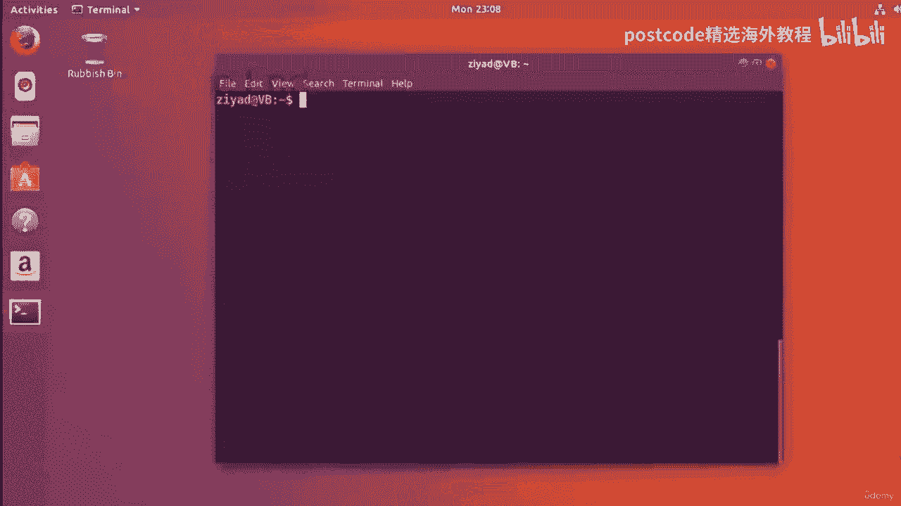
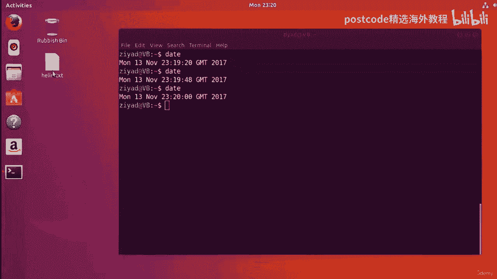
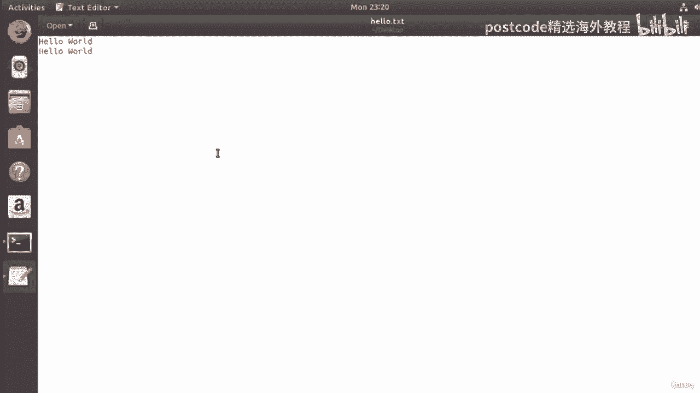
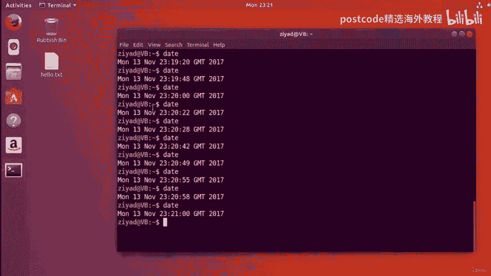
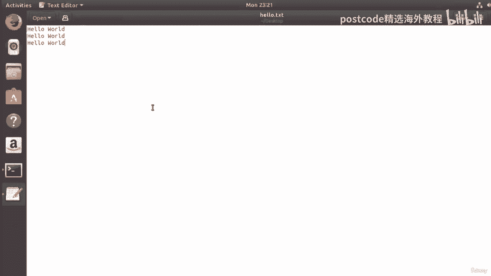
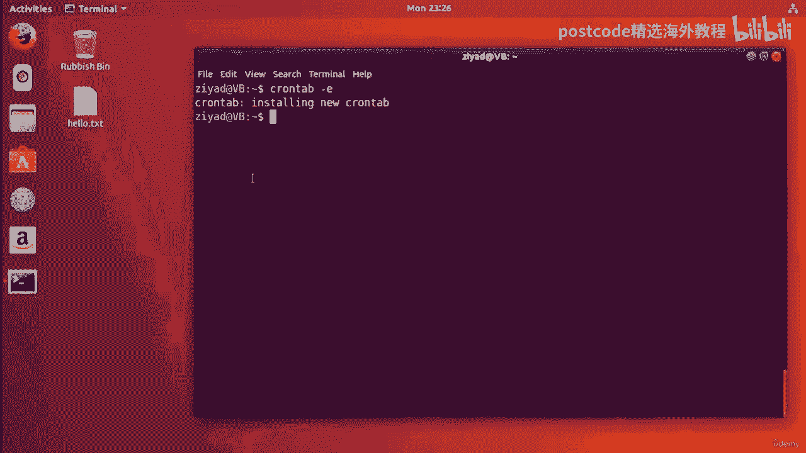
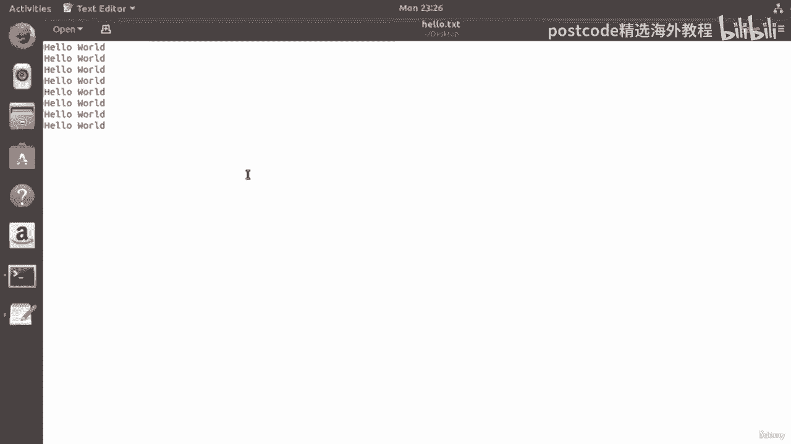
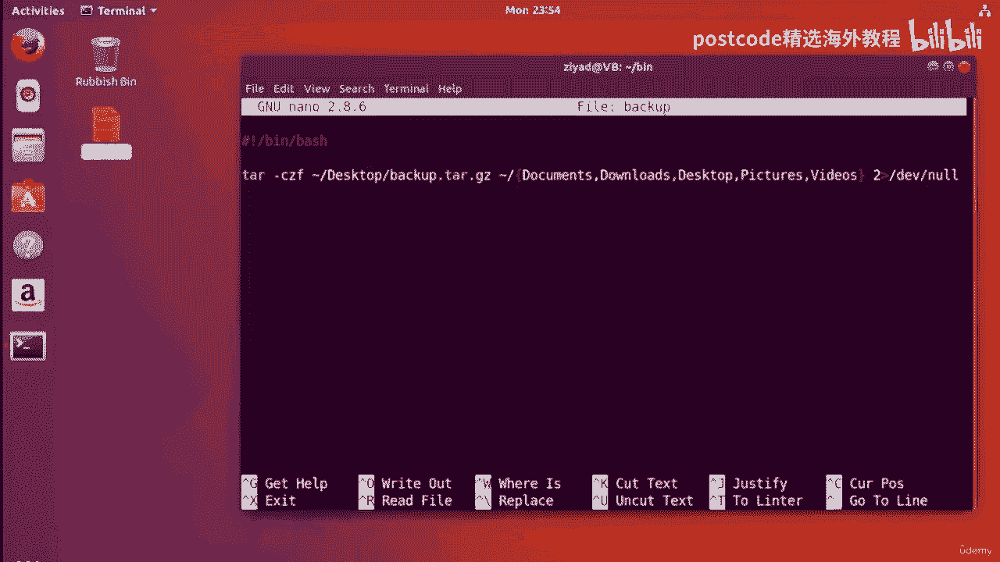
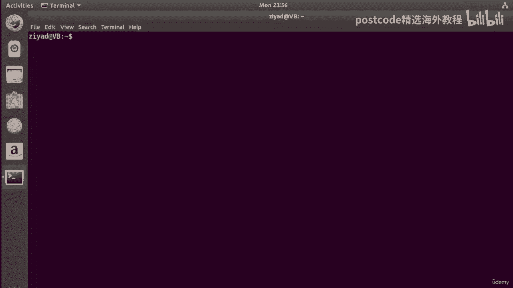
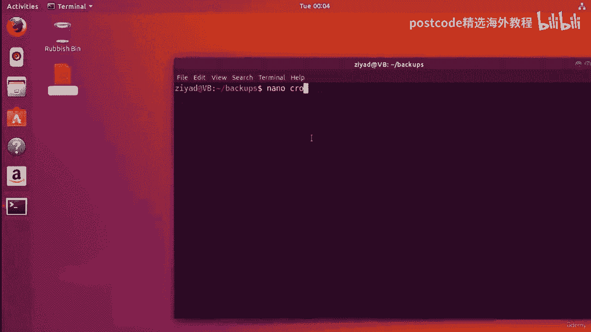

# RHEL 9 精通课程：04-04-015：Cron 任务调度详解 🕐



在本节课中，我们将要学习 Linux 系统中一个强大的任务调度工具——Cron。我们将了解它的基本概念、如何编辑用户的 Cron 任务表，并通过实例演示如何安排命令和脚本在特定时间自动运行。

## Cron 概述

Cron 是一个基于命令行的程序，用于在 Linux 系统中安排任务。它的名字来源于希腊语 Chronos，意为“时间”。每个用户都有一个称为“cron 选项卡”的文本文件，其中列出了该用户计划自动运行的命令或脚本及其运行时间。

## 编辑 Cron 选项卡

要为当前用户编辑 cron 选项卡，只需在终端中输入以下命令：

```bash
crontab -e
```

`-e` 选项表示编辑。如果是第一次使用，系统会询问您希望使用哪个文本编辑器。在本教程中，我们选择使用 `nano` 编辑器。

打开 cron 选项卡后，您会看到一些以 `#` 开头的注释行，这些是说明信息，不会被 Cron 程序执行。真正的任务配置位于文件底部。

## Cron 任务行的结构

每个 cron 选项卡由多行组成，每一行对应一个要调度的任务。每一行包含六列，前五列是调度信息，第六列是要运行的命令或脚本。

以下是各列的含义：
*   **第一列**：分钟 (0-59)
*   **第二列**：小时 (0-23，24小时制)
*   **第三列**：一个月中的第几天 (1-31)
*   **第四列**：月份 (1-12 或 JAN-DEC)
*   **第五列**：一周中的星期几 (0-6，其中 0 代表星期日，或 SUN-SAT)
*   **第六列**：要执行的命令

列与列之间至少需要一个空格分隔。星号 `*` 表示“任意值”，即不限制该时间单位。

## 基础调度示例

上一节我们介绍了 Cron 行的基本结构，本节中我们来看看如何配置一个简单的任务。

假设我们希望每分钟运行一个命令，将 “Hello World” 输出到桌面上的 `hello.txt` 文件中。以下是实现此目标的 Cron 行：

```
* * * * * echo "Hello World" >> ~/Desktop/hello.txt
```





*   **前五列**：全部是 `*`，表示每分钟、每小时、每天、每月、每周都运行。
*   **第六列**：`echo “Hello World” >> ~/Desktop/hello.txt`。`>>` 表示将输出追加到文件末尾，而不是覆盖。



保存并退出编辑器后，Cron 会立即开始调度这个任务。您可以检查 `~/Desktop/hello.txt` 文件，会发现内容每分钟都在增加。



## 高级调度语法

除了使用具体数字和星号，Cron 还支持更灵活的调度语法，让您能更精确地控制任务执行时间。

以下是几种常用的高级语法示例：

*   **列表值**：使用逗号分隔多个值。
    ```
    0,15,30,45 * * * * command
    ```
    这表示在每小时的第 0、15、30、45 分钟运行命令。

*   **步长值**：使用斜杠 `/` 指定间隔。
    ```
    */15 * * * * command
    ```
    这表示每 15 分钟运行一次命令。

*   **范围值**：使用连字符 `-` 指定一个范围。
    ```
    0 9-17 * * 1-5 command
    ```
    这表示在每个工作日的上午 9 点到下午 5 点之间，每小时运行一次命令。

*   **组合使用**：您可以组合上述语法。
    ```
    0 23 * * 1,3,5 command
    ```
    这表示在每周一、三、五的晚上 11 点运行命令。

## 调度脚本执行



Cron 不仅可以运行简单命令，更能用于调度复杂的 Shell 脚本，这是实现系统自动化的核心。



假设我们有一个备份脚本 `~/bin/backup`，我们希望它在每周五晚上 11:59 自动运行。以下是相应的 Cron 行配置：



```
59 23 * * 5 bash ~/bin/backup
```

*   **调度部分**：`59 23 * * 5` 表示在每周五的 23:59 执行。
*   **命令部分**：`bash ~/bin/backup` 使用 `bash` 解释器来执行我们位于 `~/bin` 目录下的备份脚本。

通过这种方式，您可以自动化任何重复性的系统管理任务，如日志清理、数据备份、系统更新检查等。

## 管理 Cron 任务



在配置了多个任务后，了解如何查看和管理它们非常重要。

*   **查看当前用户的 Cron 任务**：
    ```bash
    crontab -l
    ```

*   **删除当前用户的所有 Cron 任务**（请谨慎操作）：
    ```bash
    crontab -r
    ```

*   **为其他用户编辑 Cron 任务**（需要 root 权限）：
    ```bash
    sudo crontab -u username -e
    ```

## 总结



本节课中我们一起学习了 Linux 下强大的任务调度工具 Cron。我们掌握了 `crontab -e` 命令来编辑任务表，理解了由分、时、日、月、周和命令组成的六列任务行结构。我们通过实例练习了从每分钟执行简单命令，到使用列表、步长等高级语法进行复杂调度，最后实现了在特定时间自动运行备份脚本。Cron 是系统自动化的基石，熟练掌握它将极大提升您的系统管理效率。