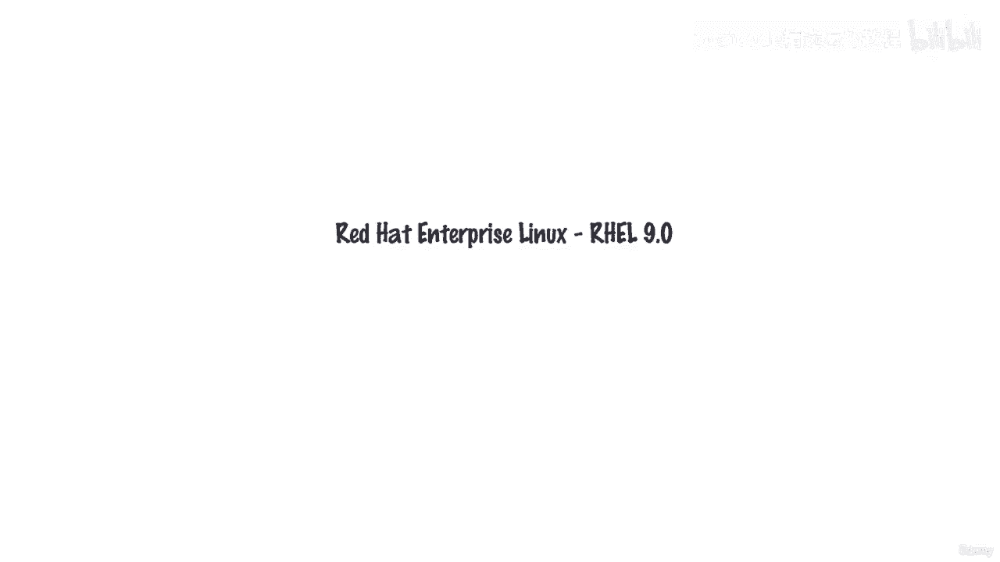
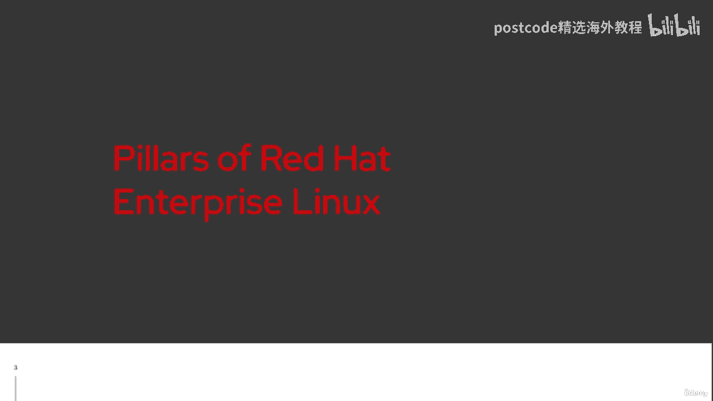
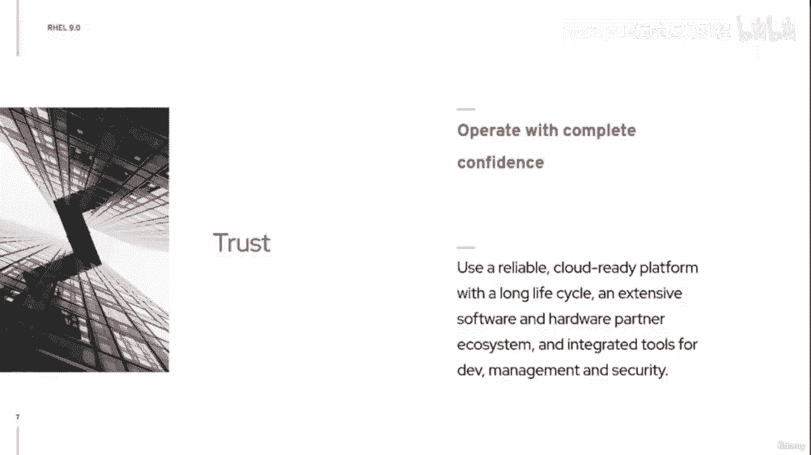

# 红帽企业Linux RHEL 9精通课程 — RHCSA与RHCE 2023认证全指南 - P3：01-01-002 RHEL 9 Philosophy - 精选海外教程postcode - BV1j64y1j7Zg

欢迎大家参加我们关于 RedHat Enterprise Linux 9 的一点讨论。我们将在这里进行对话。我们今天的目标是谈谈红帽企业 Linux 及其希望提供的功能。

您的组织以及自红帽企业 Linux 以来我们过去几年一直关注的重点，首次推出八。显然，您已经听过这些故事，以及有关我们专注于混合云之旅的大量信息，我们的许多组织目前都在这样做。因此。

作为我们今天要讨论的内容的快速概述，您会发现很多。

我们的材料现在集中于我们所说的红帽企业 Linux 的支柱。因此，我想在演讲开始时花一些时间来确定这些支柱，以便您了解我们如何定位我们的一些技术功能和程序更新，即将到来的。然后在最后。

给你一个亲眼看看的机会。我将启动一个九号线虚拟机。我们将了解一些关于培训如何为我们提供开始实验的机会，九号铁路为您服务。首先，正如我提到的，我们将讨论一下红帽的支柱，企业Linux。

现在让我们记住红帽订阅的价值是什么？您知道，我们会提供支持、专业知识以及各种安全资源等。有一个围绕领域、生命周期支持和灵活性的大型合作伙伴生态系统。稍后我们将在这里详细讨论生命周期。

我们还可以为您提供一些路线图。您会看到我们传达有关即将发生的事情、我们一直在做的事情等信息。但新事物之一确实是大量主动分析，我们将讨论一些，我们如何将其绑定到我们的系统中。

因此，沿着这些思路，我想谈论的第一个支柱是使您能够在内部进行创新，你的环境。有些人声称 RedHat Enterprise Linux 有点古板，不一定发展得足够快，之类的东西。好吧。

我们来这里是为了稍微改变一下这种说法，给你一个加速的机会，你的创新。我们需要让您更轻松地构建、部署、扩展和管理云原生应用程序。那么我们如何做到这一点呢？出色地。好吧。

九号是随最新的编译器集合版本 11 最新版本的 VM Rust 一起发布的，去编译器吧。我们已经完成了向 Python 3 的过渡，为您提供了 Python 3 9。

这里的目标是我们希望有一个更快的发布时间表，性能提升所有这些，仍然为您维护更加一致和稳定的内部 API。我们的第二个支柱是简化您的基础设施。我们如何优化您的环境？例如。

我们可以通过提供我们首先引入的新图像生成器功能来进行优化，与雷利。因此，此环境可以让您节省时间，确保部署时的一致性，无论是，它是在本地的，无论是虚拟化的，无论是在云端还是在边缘。

我们的第三个支柱让我们在转向混合云时谈论保护。这给我们很多人带来了一系列的安全问题。因此，我们希望能够保护您，建立一致的安全基础，是否有Web控制台支持智能卡身份验证的功能，是否有变化。

SSH 默认保护您免受 root 登录、改进 SELinux 性能、更好的配合，打开景观配置文件等。所有这一切都集中在能够保护您的环境。然后我们将把所有这些都放在背景中的最后一个支柱是底线。

我们每一天的努力都是为了赢得您的信任，让您放心经营，在一个平台上。您可以确信 RedHat Enterprise Linux 将在您的大型基础设施中运行。

其中包括通过我们的 Web 控制台进行内核生命补丁管理等内容，我们拥有新系统，角色，让您可以更轻松地自动执行手动任务。Performance Copilot 可以为您提供更大的可扩展性。

