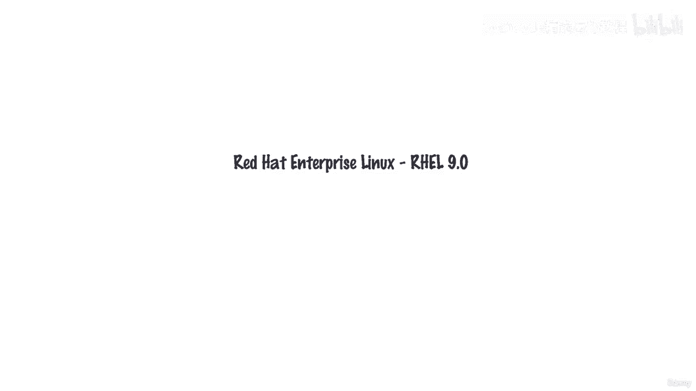
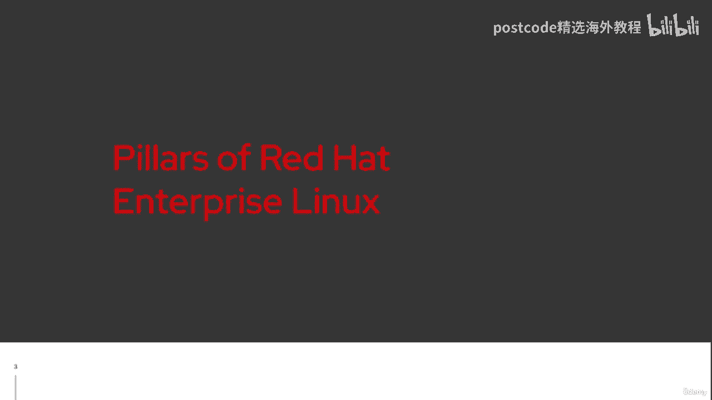
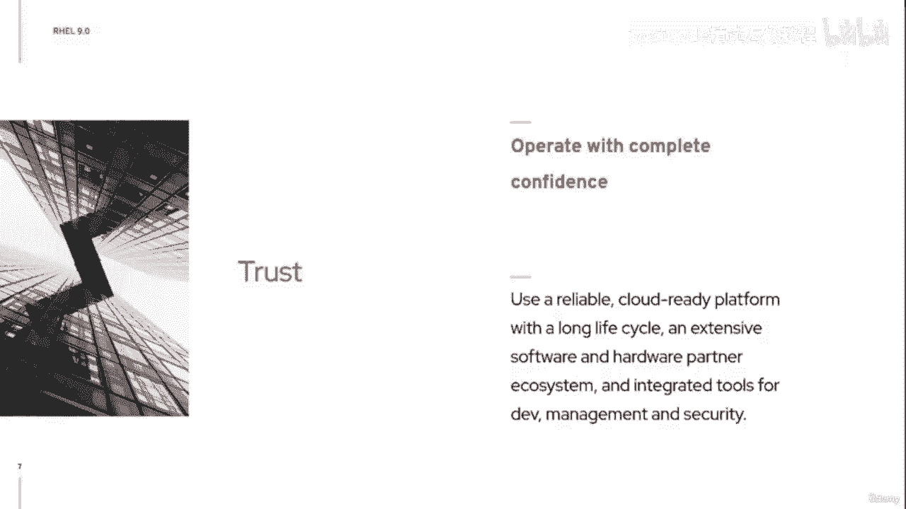

# 红帽企业Linux RHEL 9精通课程：P3：01-01-002 RHEL 9 核心理念

在本节课中，我们将要学习 Red Hat Enterprise Linux 9 的设计哲学与核心支柱。我们将探讨 RHEL 9 如何通过一系列技术更新和功能增强，来支持企业在混合云环境中的创新、简化、安全与运营。

## 课程概述

欢迎参加关于 Red Hat Enterprise Linux 9 的讨论。本次课程的目标是阐述红帽企业 Linux 9 的设计理念及其旨在提供的核心功能。我们将重点关注自 RHEL 8 发布以来，红帽在支持企业混合云转型旅程中所做的努力。

## 红帽企业 Linux 的支柱

上一节我们介绍了课程概述，本节中我们来看看构成 RHEL 9 基础的四大核心支柱。理解这些支柱有助于我们定位其技术功能和未来的更新方向。

### 支柱一：赋能内部环境创新

有些人认为 Red Hat Enterprise Linux 较为保守，演进速度不够快。RHEL 9 旨在改变这一看法，加速您的创新进程。其目标是让构建、部署、扩展和管理云原生应用变得更加容易。

以下是实现这一目标的关键技术组件：

*   **编译器集合**：随附最新的 GCC 11。
*   **编程语言支持**：包含最新版本的 Rust 和 Go 编译器。
*   **Python 环境**：已完成向 Python 3 的过渡，提供 Python 3.9。

其核心是在提供更快的发布节奏和性能提升的同时，**`maintain_stable_API()`**，为您维护一致且稳定的内部 API。

### 支柱二：简化基础设施

我们的第二个目标是优化您的环境。RHEL 9 通过引入新的工具和功能来简化部署与管理。

一个主要的优化工具是首次在 RHEL 8 中引入的**镜像构建器**。此功能可以为您节省时间，并确保部署环境的一致性，无论其部署在本地、虚拟化平台、云端还是边缘。

### 支柱三：保护混合云安全

向混合云转型带来了新的安全挑战。第三个支柱致力于建立一致的安全基础，保护您的环境。

以下是增强安全性的关键特性列表：

*   Web 控制台支持智能卡身份验证。
*   默认 SSH 配置增强，保护系统免受 root 账户直接登录。
*   改进的 SELinux 性能。
*   更好的 OpenSCAP 安全配置文件兼容性。

### 支柱四：赢得信任，保障运营

最后一个支柱是所有工作的基础：赢得您的信任，让您能在一个可靠的平台上放心运营。您可以确信 RHEL 9 能够在您的大规模基础设施中稳定运行。

以下是支撑这一信任的具体功能：

*   通过 Web 控制台进行内核实时补丁管理。
*   新的系统角色，让自动化手动任务变得更简单。
*   Performance Co-Pilot (PCP)，为您提供更强的可扩展性洞察和性能监控能力。

## 实践预览

在理论讲解之后，我们将在课程最后启动一个 RHEL 9 虚拟机，让您有机会亲眼查看其界面，并了解如何利用培训环境开始您的实验。

## 课程总结

本节课中，我们一起学习了 Red Hat Enterprise Linux 9 的四大设计支柱：**赋能创新**、**简化基础架构**、**强化安全防护**以及**建立可靠信任**。这些支柱共同构成了 RHEL 9 支持企业现代化混合云之旅的坚实基础。理解这些理念，将帮助我们更好地掌握后续的具体技术内容。