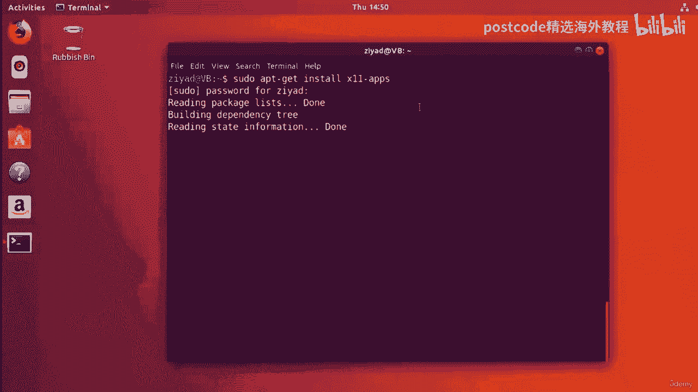
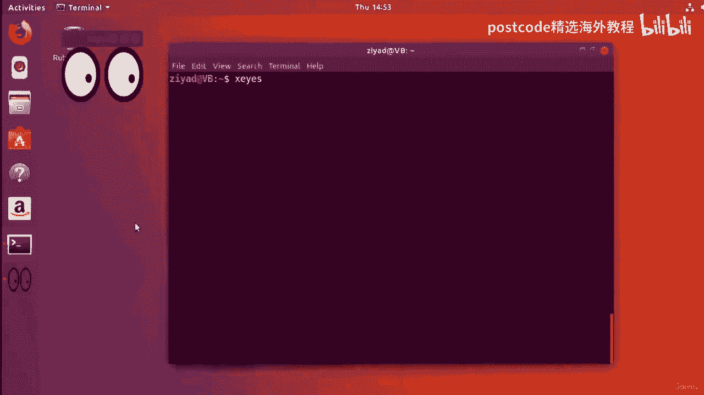
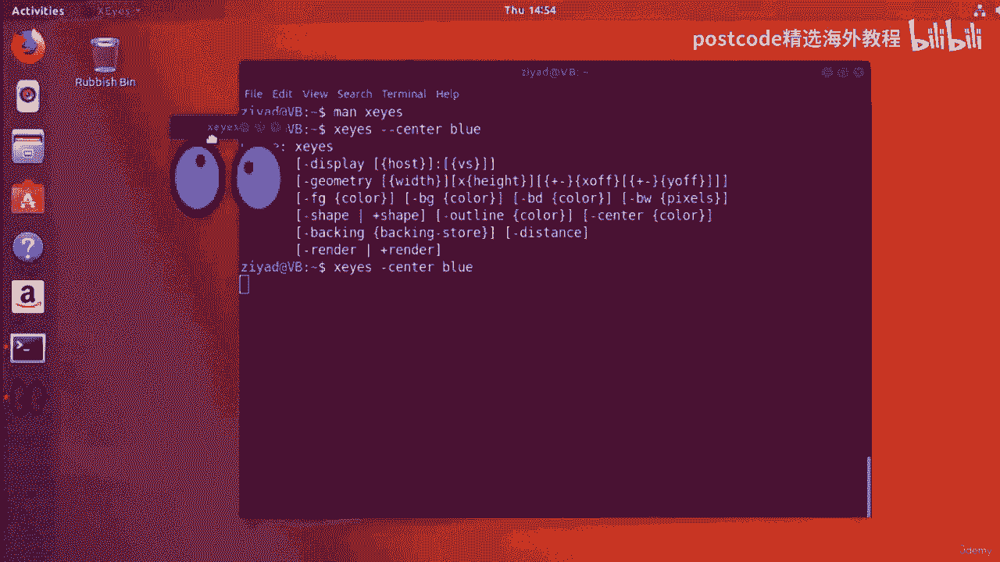
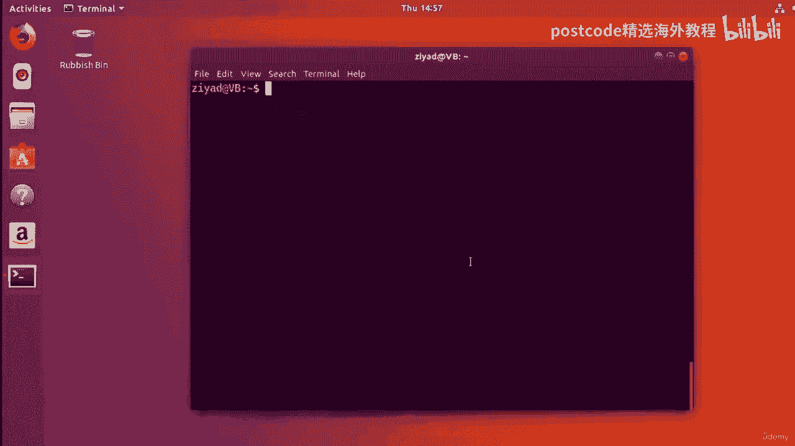
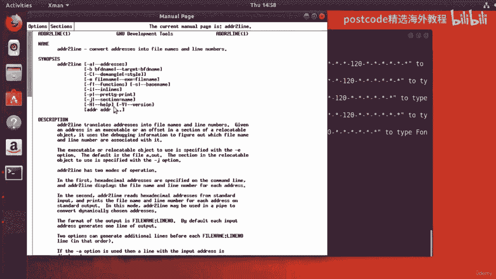
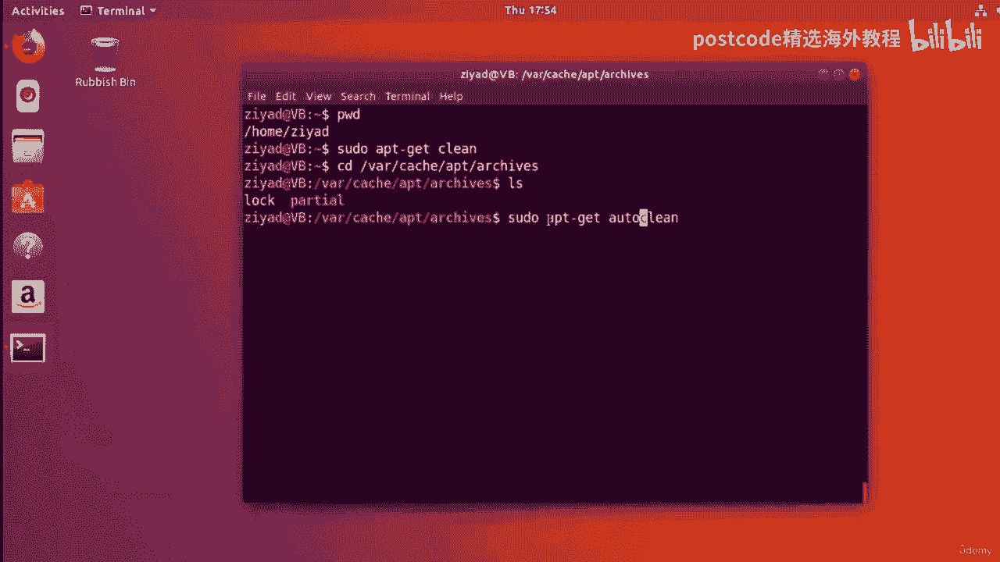

# 红帽企业Linux RHEL 9精通课程 — RHCSA与RHCE 2023认证全指南 - P40：04-04-016 Package management - 精选海外教程postcode - BV1j64y1j7Zg

缓存中的列表首先是如何到达那里的，嗯，这些列表实际上是从互联网上的某个服务器上下载的，这些服务器是由可靠的消息来源维护的，并包含所有现有包的最新列表，就像我们在上一期视频中提到的，为了使缓存发挥作用。

缓存中的文件必须与服务器上的文件相同，现在呢，这对于软件存储库尤其重要，因此，请和我一起思考一下gnu linux社区，世界上有数以百万计的人，所有这些都为这个庞大的软件体系做出了贡献。

并一直在创造东西，同时为软件存储库和项目做出贡献的大量人员，意味着软件改变了很多，经常，错误得到修复，安全漏洞得到修补，添加新功能，文档得到澄清等等，现在以此类推，有时程序开发得太多了。

以至于它们需要新的依赖关系才能工作，尽管有这些变化，使系统上的所有软件保持最新，并手动管理所有内容，会是一场彻头彻尾的噩梦，好啦，就是不行，一个人犯错误的余地太大了，还有太多的东西要跟踪。

但幸运的是你不必，贴切的，包管理器有一种使用缓存的方法，确保系统上的所有软件都是完全最新的，它是这样工作的，所以你需要做的第一件事是更新你的缓存，要做到这一点，您需要运行pseudo以获得更新，好啦。

这就是你现在运行的命令，注意我们需要在这里的开头使用pseudo命令，现在呢，这是因为我们要对文件系统中的重要文件进行更改，我们需要管理员权限才能这样做，而不是正确的缓存，我们正在使用apt get。

因为我们要从仓库里获取数据，所以我们会得到更新的名单和更新，会更新缓存中的列表，以确保，其中的包版本与存储库中的包版本相同，但当然为了让它起作用，我们需要连接到互联网，所以在录制这个视频之前。

我启用了我们的互联网连接，所以如果你跟着，确保你也启用了你的，如果我们运行它，以获得更新，它会要求我们输入密码，因为我们用的是伪命令，所以我们输入然后按回车键，你可以看到。

它从ubuntu存储库中获得了大量不同的列表，它下载并安装它们，现在它将更新我们的缓存，这可能需要不同的时间，这取决于你有多长时间没有更新，但既然它已经过去了，现在已经完成了，所以现在我们已经更新了。

那个，我们的缓存将拥有最新的包号和依赖项，对于缓存中的所有包，所以现在我们有了一个最新的缓存，如果我们电脑上的某些软件过时了怎么办，我们怎样才能把软件升级到最新版本，在新版本的包列表中，嗯。

这其实很简单，也很神奇，说实话，所以要升级系统上的每一个软件，从存储库安装的，你现在只需要打字，如果我清除屏幕，伪，好啦，现在这将贯穿，所以如果我按回车键，这将贯穿所有包列表，看看我们系统上的所有软件。

它会告诉我们什么是过时的，什么需要更新，它还会告诉你需要安装多少等等，它请求允许继续，所以如果我按是，所以这将通过更新的缓存运行一个，并查看其背后的系统上的包，然后找出哪些新的依赖项需要安装。

哪些不再需要，它会告诉你需要多少空间等等，所以在请求你允许继续之前，但现在我们已经允许了，它将继续更新系统上的每一个软件，所以它会下载所需的软件包，把它们打开，安装它们，并删除旧版本。

所有自动为每一个单独的软件在整个，使用存储库安装的系统，所以这是一个非常强大的自动化系统，这就是使用包管理器的美妙之处，你不必去网站手动下载每一件作品，每个新包裹。

就像你在Windows或Mac上可能要做的那样，我们得下载新的安装程序，或者点击查看每个不同软件的更新，不，你所要做的就是画一个伪升级，所有通过仓库安装的东西，将升级到最新版本级别，这有助于您的安全。

它帮助您拥有最现代的功能，这绝对令人惊讶，如果你用克朗，你也可以定期安排这些事情发生，所以这是一个有用的事情要记住，现在这可能需要不同的时间，得看有多久了，嗯，因为我们升级了软件。

因为我还没有在这个虚拟机上做过，所以要花点时间，所以我要做的是，我要把这里的视频剪了，剪完了再回来，就像那样，在两个命令中，我们系统上的所有软件都升级了，我们可以看到火狐的标志已经更新了。

看上去更像史诗，所以请注意系统也不需要重新启动，我们通过仓库安装的所有软件都升级了，它已经准备好了，所以我们所要做的就是使用pseudo apt get update来更新包列表，一旦我们更新了它。

我们要做的就是让伪APT升级，然后我们把所有的软件都升级到新版本，所以你要知道有时候，不过，在进行这些更新时，您需要重新启动系统，但这有点不寻常，但有时这需要发生，但是需要注意的是，您应该始终更新缓存。

在执行升级之前，这可以确保升级使用正确的软件版本，一切都统一更新，知道我们的缓存和系统是完全最新的，让我们继续安装一些新软件吧，假设我听说过一个叫做X和X的程序，眼睛显然是一扇窗户。

随着鼠标光标在屏幕上弹出一些有趣的眼睛，我觉得这很有趣，我想安装它，所以首先要做的是，我们需要知道消费税计划有什么一揽子计划，所以让我们在缓存中搜索它，我们做的方式，那就是，我们做缓存搜索附加。

它会给我们每一个与消费税有关的包裹，我们听说过这个叫做X11应用程序的包，让我们说，我们就像啊，那是我听说过的，让我过去仔细看看，所以我们所做的，我们有，APT缓存，好啦，所以你在这里给它包的名字。

会给我们很多信息，但让我们清理屏幕，少通过管道，所以我们仔细看看，好的我们打开这个的时候，我们可以看到实际上我们得到了很多关于包裹的信息，但在下面的描述中，它说这个包提供了各种各样的x应用程序。

x窗口系统包括，它会告诉我们我们得到了一些东西，操作位图图像的工具，一个工具的东西，告诉你什么时候你有新的电子邮件等等，然后这里有一个叫x i和x眼，是一个演示程序，其中一双眼睛跟踪指针。

所以这就是我们想要的，我们意识到实际上我们想看看，这也是另一个叫x人的，它是一个手动页面浏览器，你知道我们可能也有用，好啦，所以现在我们非常确信我们想安装XEleven应用程序包，我们怎样才能做好呢。

其实很简单，我们想做的是，如果我们得到更少的只是，嗯，当我们清空屏幕，我们要做的就是，X11应用程序，所以我们只需输入包的名称，现在请注意，我们使用apt来再次得到，嗯，安装包。

因为我们希望我们的包管理器从互联网上获取数据，不仅仅是从本地缓存，我们还传递要安装的包名，因为我们想安装X11个应用程序，我们现在在里面输入了11个应用程序，当我们按回车键时。

我们看到它会要求我们的密码，我们进入。

然后包管理器将继续安装新的包，使用现在实际需要的任何依赖项，有时它可能会请求您的许可，如果它需要安装很多，但因为它只安装了大约600千字节，就像是的，我先安装一下，这么小的东西我不需要征得同意，好啦。

但我们不需要做什么，包安装好了，现在就这么简单，XEleven应用程序是一个预编译包，也称为二进制包，现在大多数包都是二进制包，这意味着制造软件的代码已经预先编译好了，事先准备好了。

所以你不必做任何配置，制作和安装我们几个视频前自己做的东西，好吧，只要把仓库里的包安装好，你就完蛋了，什么更好，还将跟踪该包的更新，所以你可以更新包，如果提供了新的更新，多棒啊。

现在让我们试用一下我们的新软件，所以我们想用x i的程序，所以如果我们清空屏幕，键入x，我在里面按回车键，我们会看到我们得到这些有趣的大眼睛。

在屏幕上弹出跟随我们的鼠标，所以如果我把鼠标放在这里，嗯哦，它走了吗，我把眼睛都吓跑了，如果我把他带过来，然后它就会跟着，嗯，可能没有我想要的那么流畅，但我要把这归因于我们在虚拟机中运行这个。

但如果就像你知道的那样，它确实遵循了它，好多了，但现在这很酷，最棒的是你，您安装的所有内容都将有自己的手册页，所以如果我闭上X眼，嗯，那么如果我做男人X，我是，你会看到它实际上现在也安装了一个手动页面。

上面写着跟随鼠标X演示，它也有一些选择，所以你甚至可以从命令行控制附加程序，我们可以看到这里有一个，这里有一个选项叫中心，它允许你为眼睛中心选择不同的颜色，例如，如果我们做x，然后我给它中间的选项。

告诉它，我想是两个破折号中间的蓝色，哎呀不行，也许就一个。

也许只要冲一下，我们现在就去，眼睛的中心是蓝色的，但我想让你注意到。

这是看起来的样子，当你以图形方式打开附加程序时，你没有选择改变眼睛的颜色，但是从命令行中，您可以改变这一点，甚至更多，因此，这为您强调了命令行有多强大，以及它如何给你比图形编辑器更多的能力。

如果你不能编辑大眼睛的颜色，那告诉我拥有一台电脑到底有什么意义，现在X11应用程序包中包含了相当多的其他软件，其中一个叫X人，你现在可能会发现有用，X man是一个用于查看手册页的图形窗口。

所以如果我们把这里的X眼拿开然后关上它，然后我们打x人。

我们会看到一个窗口弹出这里，现在您可以使用以下命令搜索手册页。

所以如果我们点击那里的手册页，会打开一扇更大的窗，如果我们点击，上面的选项，嗯，如果我们按住鼠标键，它显示菜单，所以你需要按住鼠标按钮，你会看到这个下拉菜单，如果你继续搜索，放开鼠标。

就好像我们点击了搜索一样，现在我们可以在这里搜索一些东西，例如，这是，如果我们看一下ls，我们试着把它看成一个手动页面，然后它就会打开LS手册页面，你可以在这里浏览，所以这是一种语法，嗯。

我猜图形化的方式来看看手册页，比使用命令行所能做到的还要多，但你知道，我想这只是让它看起来更漂亮一点，您也可以查看部分，所以您可以查看用户命令，您可以在这里看到所有的用户命令，如果我想看看。

让我们说地址到行命令，我只要按一下，它就会打开，所以这是一个很好的浏览手册的图形方式。

所以这是你可以玩的东西，嗯，如果你喜欢，我还想强调的一件事是我们如何通过安装一个软件包，X11应用程序包，我们实际上已经安装了多个不同的软件，非常酷，我们不需要做任何汇编，我们不需要做任何配置。

我们所要做的就是确保我们的包裹清单是最新的，然后我们要做的就是用sudo安装，然后是一个包名，就这样我们可以，我们可以放心，我们有那个包的最新版本，一切都解决了，我们甚至不需要知道。

如果软件包适合我们计算机的体系结构，并在两者之间做出决定，你知道的，呃，我三八六或六十四，在前几期视频中，我们一直在搞X11应用程序包，我们将继续使用它，作为我们这个视频的豚鼠。

所以要卸载Ubuntu中的软件包，最基本的方法是键入pseudo t get remove，然后包名，好啦，因为我们谈论的是X11应用程序包，我们只需键入伪应用程序就可以删除，然后X11个应用程序。

这将删除它，但这不是最好的方法，好啦，原因是当你安装包时，有时包附带配置文件，如果你把包裹拿走，使用pseudo apt删除，然后配置文件就会留在系统上，占用空间不帮忙，现在呢，这可能很有用。

如果以后要再次安装包，希望你所有的设置都是一样的，但这仍然不是最好的方法，而是删除一个包及其所有配置文件，我们所做的不是输入sudo应用程序，而是删除，我们输入伪APT，得到清洗，然后包名，好啦。

所以伪应用程序得到清除，X11应用程序，现在清除将删除包及其配置文件，所以一定要用净化，每当要卸载软件包时，所以如果我继续这么做，它会去打招呼，我想把这个拿掉，可以吗，我按是，所以你可以在这里看到。

上面写着，好啦，所以它继续前进，做到了这一点，现在，X11应用程序将百分之百地从系统中删除，但有时当你安装软件包时，您需要安装十个不同的软件包作为依赖项，好啦，因此，为了使要安装的包工作，您需要。

你需要10个其他的包裹，甚至可能是一百个包裹，为了让那个包裹起作用，我们称这些额外的包为依赖项，如果不再需要这些依赖关系怎么办，但你不知道他们叫什么，你怎么能很好地去除它们。

您很幸运可以删除作为依赖项安装的包，但系统上的任何其他包都不再需要，你可以做sudo，如果我清除屏幕，伪APT得到自动删除，就这样，所以sudo apt得到自动删除。

现在自动删除将自动删除不再需要的任何悬空依赖项，这有助于节省系统空间，所以如果我这么做，嗯，它会告诉我实际上没有任何需要移除的，但是你可以在这个里面节省很多空间，所以请记住。

这一切都发生在系统上数百甚至数千个不同的包中，让包管理器自动保持一切有序是一项非常好的资产，我相信你会同意它胜过它，反正你自己做，现在呢，无论何时下载安装程序包，包的副本保存在计算机本地，现在。

这个软件包将被解压缩并安装到您的系统上，原来是这么回事，安装包时，它将自己下载为压缩存档，然后解包并将其安装到系统上，好了，现在，因为这两步过程，不仅在您的系统上安装了包，但现在也保存了它的压缩版本。

这些压缩文件通常占用空间，并不是真正必要的，如果已经安装了包，因为他们只是，你知道一个档案馆，它们就像包装纸，好的这样你就可以为自己节省大量的空间，一些事情，甚至千兆字节的空间，只是删除这些档案，好啦。

现在这些档案存放在，如果我如果我们去那里，斜杠var，削减现金，斜杠，斜线档案，所以如果我们去那里看看，我们可以看到这里有相当多的小deb文件，一些保存在里面的压缩档案，你可以看到X11应用程序的一个。

即使我们已经把它从系统中删除了，您可以通过使用lh命令执行ls来查看它们有多大，你可以看到里面总共有大约10兆字节，这不算什么，但是嗯，你知道这个可以很容易地增长到千兆字节，在系统上继续安装包后。

它会变得很生气，因为您安装的每个包都有自己的依赖项，甚至这些依赖项也被保存为副本，所以你把这些东西从这里移走真的可以节省很多空间，现在您甚至不必在文件夹中删除它们，所以如果我回到我们的主目录。

正如你所看到的，我们在我们的主目录中，如果我们做伪证，嗯，这将从该目录中删除所有包，所以如果我们回到斜线变量，削减现金，斜杠，削减档案并做一个LS，我们现在可以看到它们都被删除了。

即使我们不在那个文件夹里，所以如果你想摆脱所有的东西，做伪善，但有时无论出于什么原因，你都不想删除所有这些，你只想把东西处理掉，你想摆脱那些包裹，呃，那些那些嗯，那些档案，但是对于不能再从。

从实际的ubuntu存储库，这通常适用于非常古老的系统，想让他们的宝藏年复一年地继续下去，时不时地你知道，修剪树叶，摆脱他们的黛布，无论出于什么原因都不能再下载的包，为了做到这一点。

而不是用伪造品来清洗，您现在使用自动清洁只是为了突出清洁，删除存档缓存中的所有内容，现在这与来自列表缓存的不同，顺便说一句，那只是一个，这只是一个存储空间，嗯，保存档案和包裹之类的东西。

所以这是一个完全不同的缓存，但是清洁会清除里面的所有东西，自动清洁会检查里面的东西。

并且只删除那些您不能再从存储库下载的。