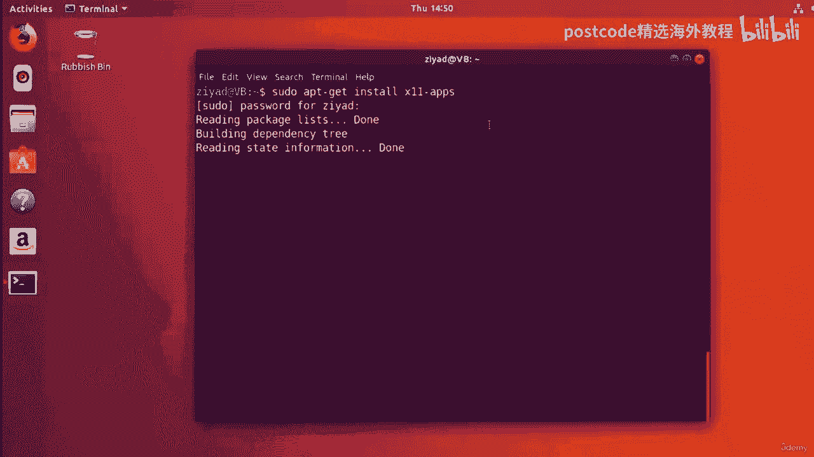
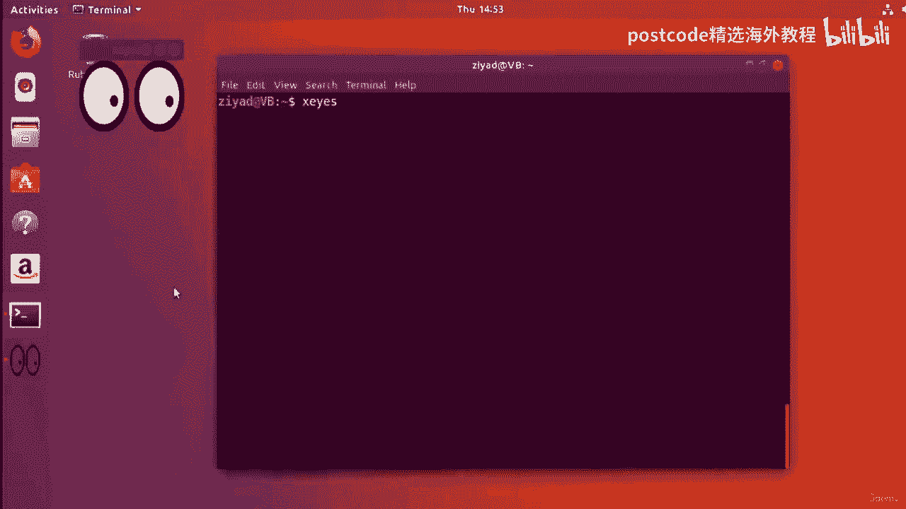
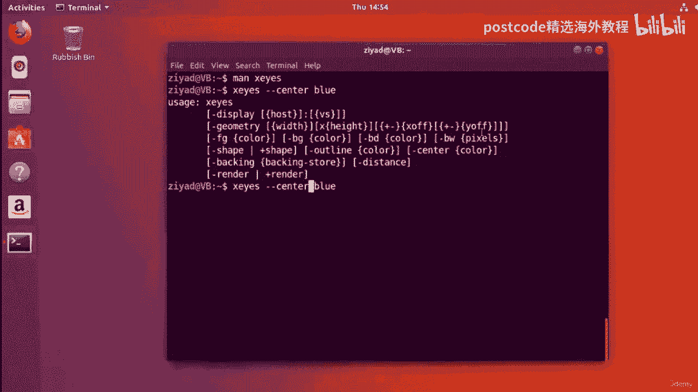
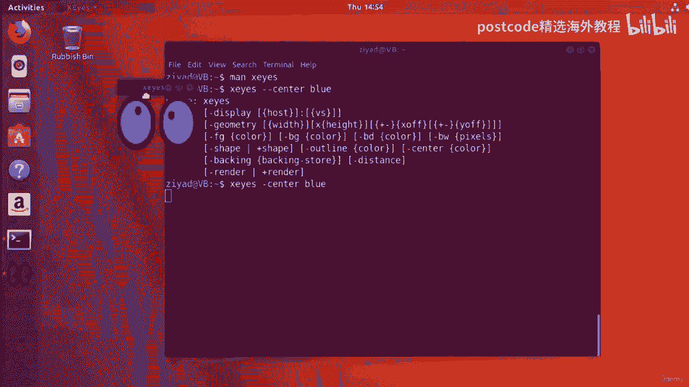
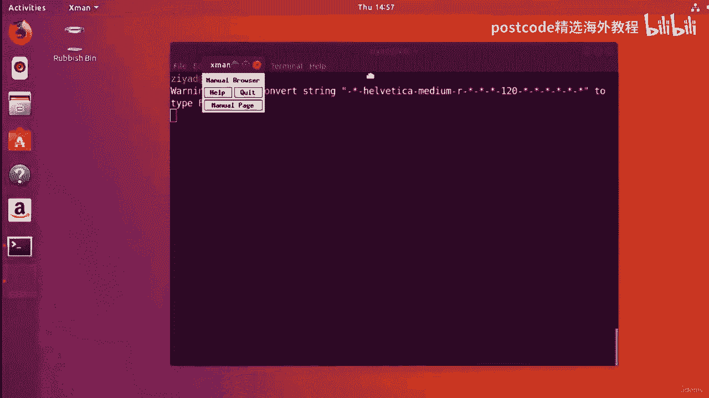
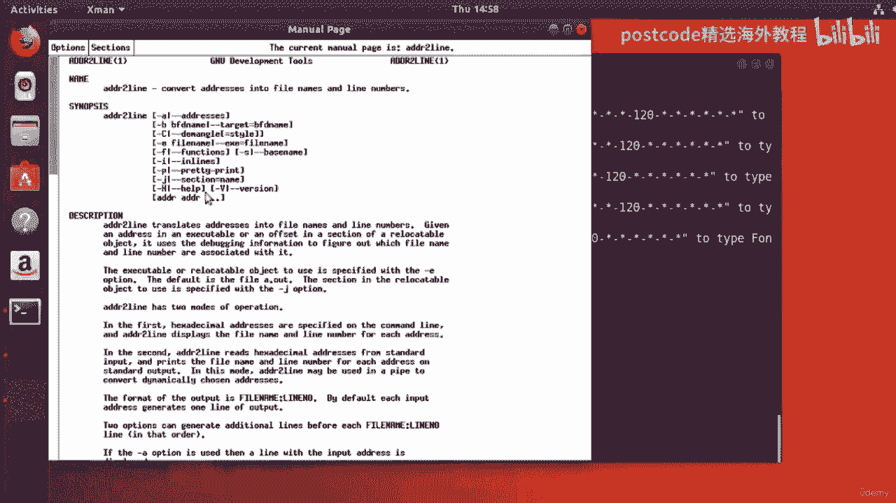

# Linux包管理精通课程：04-04-016：包管理

## 概述
在本节课中，我们将要学习Linux系统中包管理器的核心工作原理。我们将了解软件包列表如何更新、如何升级系统上的所有软件、如何搜索和安装新软件，以及如何清理不再需要的文件。掌握这些知识是高效管理系统软件的基础。

---

## 缓存列表的来源与更新

上一节我们介绍了包管理器的基本概念，本节中我们来看看包管理器缓存列表是如何工作的。

缓存中的列表是从互联网上的服务器下载的。这些服务器由可靠的来源维护，包含所有现有软件包的最新列表。为了使缓存发挥作用，缓存中的文件必须与服务器上的文件相同。这对于软件存储库尤其重要。

GNU/Linux社区有数以百万计的贡献者，他们持续为庞大的软件体系做出贡献。大量人员为软件存储库和项目工作，意味着软件会频繁改变。错误得到修复，安全漏洞得到修补，新功能被添加，文档被澄清。有时程序更新后需要新的依赖关系才能工作。

尽管有这些变化，手动保持系统上所有软件最新并管理所有内容会非常困难。一个人犯错误的余地太大，需要跟踪的东西也太多。

幸运的是，包管理器提供了一种使用缓存的方法，可以确保系统上的所有软件都是完全最新的。

### 更新缓存
以下是更新缓存的方法。

首先，你需要运行以下命令来更新你的缓存：
```bash
sudo apt-get update
```
注意，我们需要在命令开头使用 `sudo`，因为我们要对文件系统中的重要文件进行更改，这需要管理员权限。`apt-get update` 会从仓库获取数据，更新缓存中的列表，确保其中的软件包版本与存储库中的版本相同。

为了让这个命令起作用，你需要连接到互联网。运行命令后，系统会要求你输入密码。命令执行时，它会从Ubuntu存储库下载并安装大量不同的列表，从而更新我们的缓存。这个过程所需的时间取决于你有多久没有更新缓存。

更新完成后，我们的缓存将拥有所有软件包及其依赖项的最新信息。

---

## 升级系统软件

现在我们已经有了一个最新的缓存，本节我们来看看如果系统上的某些软件过时了，如何将它们升级到最新版本。

这其实是一个简单而高效的过程。要升级系统上所有从存储库安装的软件，你只需要输入：
```bash
sudo apt-get upgrade
```
这个命令会遍历所有包列表，检查我们系统上的所有软件。它会告诉我们哪些软件过时了、需要更新，以及需要安装多少更新等。在请求你确认继续之前，它会列出需要的新依赖项、不再需要的旧依赖项，以及所需的空间等信息。

确认后，它会自动下载所需的软件包，解压、安装它们，并删除旧版本。这个自动化系统会为整个系统中每一个通过存储库安装的软件执行此操作。

使用包管理器的美妙之处在于，你不必像在Windows或Mac上那样，去每个软件的网站手动下载新的安装程序或检查更新。你只需要运行 `sudo apt-get upgrade`，所有通过仓库安装的软件都会升级到最新版本。这有助于系统安全，并让你拥有最新的功能。

你可以使用 `cron` 定期安排这些更新任务。升级过程可能需要一些时间，具体取决于需要更新的软件数量。升级完成后，通常不需要重新启动系统，所有软件都已准备就绪。

**重要提示**：在执行升级之前，你应该始终先更新缓存（`sudo apt-get update`）。这可以确保升级使用正确的软件版本，使所有更新统一进行。



---

## 搜索与安装新软件

知道我们的缓存和系统是完全最新的之后，让我们继续学习如何安装一些新软件。

假设我们听说了一个叫做 `xeyes` 的程序，它是一个有趣的演示程序，屏幕上会弹出一双跟随鼠标移动的眼睛。我们想安装它。



### 在缓存中搜索软件包
首先，我们需要知道这个程序包含在哪个软件包里。我们可以在缓存中搜索它：
```bash
apt-cache search xeyes
```
这个命令会列出每一个与 `xeyes` 相关的包。假设我们看到了一个叫做 `x11-apps` 的包，这可能是我们需要的。

### 查看软件包详细信息
为了仔细查看这个包的信息，我们可以运行：
```bash
apt-cache show x11-apps | less
```
在显示的信息中，描述部分会说明这个包提供了各种X应用程序，包括 `xeyes`（一个演示程序，其中一双眼睛跟踪指针）和 `xman`（一个手册页浏览器）等。这确认了我们想安装 `x11-apps` 包。

### 安装软件包
安装软件包非常简单：
```bash
sudo apt-get install x11-apps
```
我们使用 `sudo apt-get install` 命令，并传递要安装的包名。按回车后，系统会要求输入密码。然后包管理器会从互联网获取数据，并安装该包及其所需的任何依赖项。如果安装内容较多，它可能会请求你的许可。





`x11-apps` 是一个预编译包，也称为二进制包。大多数包都是二进制包，这意味着制造软件的代码已经预先编译好了。你不需要进行任何配置、编译和安装的步骤。安装完成后，包管理器还会跟踪该包的更新，以便未来可以轻松升级。

### 使用新软件
现在让我们试用一下新安装的软件。运行 `xeyes` 程序：
```bash
xeyes
```
屏幕上会弹出那双有趣的大眼睛，并跟随鼠标移动。


所有安装的软件都会有自己的手册页。我们可以查看 `xeyes` 的手册页：
```bash
man xeyes
```
手册页会说明这是一个跟随鼠标的X演示程序，并列出一些命令行选项。例如，你可以使用 `--center` 选项来改变眼睛中心的颜色：
```bash
xeyes --center blue
```
这展示了命令行的强大功能，它通常能提供比图形界面更多的控制能力。



`x11-apps` 包中还包含了其他软件，例如 `xman`，它是一个用于查看手册页的图形窗口。运行 `xman` 后，会弹出一个窗口，你可以搜索和浏览手册页，这是一种图形化查看手册页的方式。

通过安装一个软件包（`x11-apps`），我们实际上安装了多个不同的软件。我们不需要进行任何编译或配置，只需要确保包列表是最新的，然后运行 `sudo apt-get install` 加上包名即可。

---



## 卸载软件与清理系统

在前几节中，我们一直在使用 `x11-apps` 包作为示例，本节我们将学习如何卸载它并清理系统。

### 卸载软件包
在Ubuntu中卸载软件包最基本的方法是：
```bash
sudo apt-get remove x11-apps
```
但这并不是最好的方法。原因是当你安装一个包时，它有时会附带配置文件。如果使用 `sudo apt-get remove` 卸载，配置文件会留在系统上，占用空间。

更好的方法是删除一个包及其所有配置文件，使用 `purge` 命令：
```bash
sudo apt-get purge x11-apps
```
`purge` 会删除软件包及其配置文件。因此，每当要卸载软件包时，建议使用 `purge`。

### 清理不再需要的依赖项
有时安装一个软件包需要安装许多其他包作为依赖项。如果这些依赖项不再被系统上的任何其他包需要，它们就成了“悬空依赖项”。

你可以自动删除这些不再需要的依赖项来节省空间：
```bash
sudo apt-get autoremove
```
`autoremove` 命令会自动删除任何不再需要的悬空依赖项。这在管理数百甚至数千个包的系统上非常有用，可以让包管理器自动保持一切有序。

### 清理已下载的软件包存档
每当下载并安装一个软件包时，该软件包的压缩副本会保存在计算机本地。安装过程包括下载压缩存档，然后解压并安装到系统上。安装完成后，压缩版本通常不再必要，但会占用空间。

这些压缩存档存放在 `/var/cache/apt/archives/` 目录中。你可以查看它们的大小：
```bash
ls -lh /var/cache/apt/archives/
```
随着安装的软件包增多，这个目录可能会增长到占用数GB的空间。删除这些存档可以节省大量空间。

你可以使用以下命令删除该目录中的所有存档包：
```bash
sudo apt-get clean
```
`clean` 命令会清除 `/var/cache/apt/archives/` 目录中的所有内容。

如果你只想删除那些无法再从Ubuntu存储库下载的旧存档包（例如在非常古老的系统上），可以使用：
```bash
sudo apt-get autoclean
```
`autoclean` 命令会检查存档缓存，并只删除那些你无法再从存储库下载的包。

**请注意**：这与之前提到的列表缓存（`/var/lib/apt/lists/`）是不同的。列表缓存存储的是软件包列表信息，而存档缓存存储的是已下载的软件包 `.deb` 文件。

---

## 总结
本节课中我们一起学习了Linux包管理的核心操作。

我们首先了解了包管理器缓存列表的来源和更新机制，学会了使用 `sudo apt-get update` 来同步本地与远程仓库的软件包信息。

接着，我们掌握了如何通过 `sudo apt-get upgrade` 一键升级系统上所有从仓库安装的软件，确保系统安全和功能现代。

然后，我们探索了如何搜索（`apt-cache search`）、查看详情（`apt-cache show`）和安装（`sudo apt-get install`）新软件，体验了包管理器带来的便捷。

最后，我们学习了如何正确卸载软件（`sudo apt-get purge`）、清理悬空依赖项（`sudo apt-get autoremove`）以及管理已下载的软件包存档（`sudo apt-get clean` / `autoclean`），以保持系统整洁高效。


通过掌握这些命令和概念，你可以自信地管理任何基于Debian/Ubuntu的Linux系统上的软件。