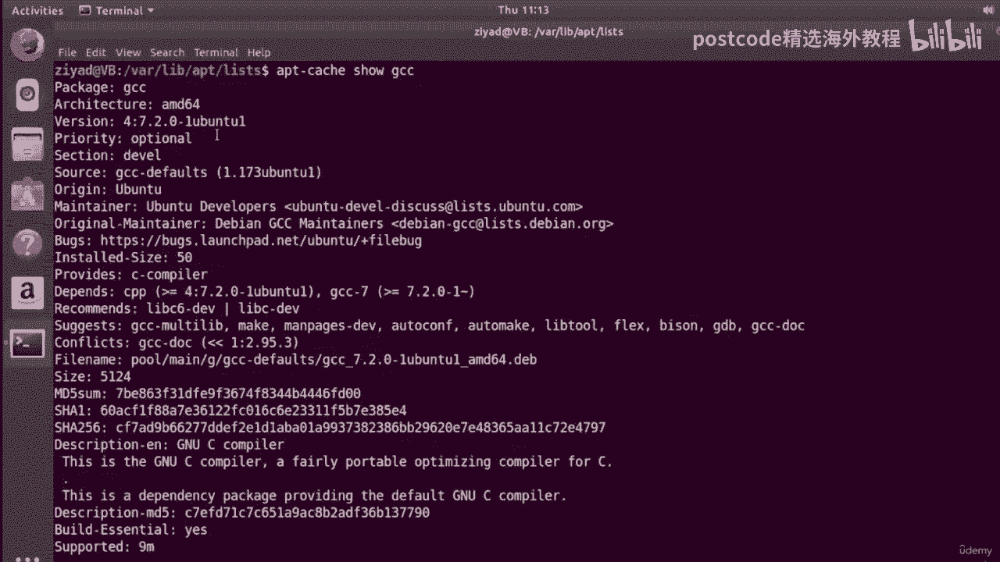

# 红帽企业Linux RHEL 9精通课程 — RHCSA与RHCE 2023认证全指南 - P41：04-04-017 Cache - 精选海外教程postcode - BV1j64y1j7Zg

因此，到目前为止，我们了解到存在大量软件包，并且将使用，包管理器调用 APT 来下载并安装它们。到目前为止，一切都很好。因此，让我们首先让 APT 程序搜索软件包。

假设我们想要搜索在使用 Microsoft Word 时对我们有帮助的包，文件。现在，Microsoft Word 文件通常具有扩展名点、dock x，因此让我们查找所有，与文本停靠 x 相关的软件包。

好的。为此，我们需要输入命令 apt dash cache OC Search Dock X，当我们这样做时，我们会看到，我们得到了一些结果，每行一个包，我们看到对于每个包，我们得到，左侧的包名称。

所以你可以看到我们这里有一个名为“dock x 2 to txt”的项目，我们这里有一个名为“Lib Apache”的项目，很快。然后在右侧我们会得到有关该包的简短描述。因此。

这会将 Microsoft 的 XML 文件转换为纯文本，这是一个通用标记转换器，它是通用标记转换器的库。这样您就可以一目了然地看到有什么、有什么可用。例如，如果我们想搜索与文本有关的内容。

我们总是可以使用 grep 和 search，对于文本这个词，我们只会得到一些结果。所以你也可以使用 grep 来缩小范围。好的。所以看起来我们可能对这里称为“dock x to txt”的这个感兴趣。

好的。那么我们如何获得更多相关信息呢？如果我们清除屏幕，我们可以做的是使用 apt cash show dock x 来发送文本。因此，我们将使用 apt cash show，然后使用软件包。

而不是 aptcast search 然后使用关键字，姓名。当我们输入该内容时，您可以看到我们获得了有关该包的大量信息。现在，这正是通过 less 命令传递的信息。

比较容易对付一点。我们可以看到包名称是 Dock X to txt。它适用于所有架构。它为您提供版本号，还告诉您它来自哪里。所以它来自宇宙存储库，其中的文本部分。它告诉您维护人员的联系信息。

告诉您在哪里报告任何错误，并且它，告诉你很多其他的东西。但下面还有一个描述，它说它将 Microsoft XML 文件转换为纯文本，它为您提供更多信息。

Doc Doctor TXT 是一个尝试从 Microsoft Doc 生成等效 ASCII 文本文件的工具，X 文档，如果您愿意，您可以阅读该文档。所以你可以看到，通过使用APT Cash show。

我们可以看到大量关于doc x to text包的信息。所以这是一个非常有用的能力。现在让我给你看一些东西。那么我们已经通过访问互联网完成了这一切，对吧？因此，如果我单击此处。

您可以看到我已连接到互联网。好吧，让我尝试断开虚拟机与 Internet 的连接，然后重试。所以我要关闭我的连接。你可以看到我现在没有任何互联网连接。如果我打开 Firefox，我们可能会看到它。

告诉我们没有互联网连接。

如果我去某个我不知道的地方，比如说 YouTube。com，但没有找到服务器。

好的，因为没有互联网连接。那么，让我们再尝试一次。好的。让我们搜索术语 Web 服务器。因此，如果我进行 apt 缓存搜索，并且我想要术语 Web 服务器，因为有，因为有两个词，在这里。

我将把它们用引号引起来。因此，它们作为一个搜索词而不是两个单独的搜索词进行搜索。如果我没有引号并且使用了网络服务器，则会显示“如果我自行搜索网络，然后搜索服务器”，单独搜索，但我想一起搜索网络服务器。

好的，所以 apt 缓存搜索。你看我们实际上得到了一大堆结果。因此，让我清除屏幕并通过更少的管道来使其更容易处理。但实际上。等一下。这不是很奇怪吗？

apt 如何在没有任何互联网连接的情况下搜索所有这些软件包？唔。这里似乎有一个名为 Apache 2 的软件包，它为我们提供了非常流行的 Apache Web 服务器。好的，让我们尝试获取更多相关信息。

所以它被称为阿帕奇二号。让我们执行 apt cash show Apache 2 并通过 less 进行管道传输，以使其更易于阅读。是的，我们设法获得了相关信息，甚至获得详细信息是多么奇怪，关于包裹。

那么，如果我们没有互联网连接，这怎么可能呢？好吧，如果信息没有存储在互联网上并且没有从互联网上下载，那么它必须存储在这台计算机上的某个位置。确实如此。所以这些信息存储在称为缓存的东西中。现在。

什么是缓存？嗯，遇到过，您可能在浏览网站时遇到过缓存这个词，您知道，当您的浏览器变得有点慢时。因此，您决定清除浏览器的缓存以提高性能。但缓存到底是什么？嗯，缓存是一种信息存储位置，应该高效且易于访问。

使用权。为了解释这一点，让我告诉你一个小故事。假设您想继续浏览某个网站，它的名字叫“ww”，太棒了，网站。com。现在，如果没有缓存，每次您想要访问很棒的网站时，您的计算机都会发送一个。

通过 Internet 向保存所有文件的称为 Web 服务器的计算机发出请求，对于 ww-多么棒的 Slate。com。该网络服务器可能位于世界的另一端。来回发送消息可能需要一些时间。但是。

假设您访问了一个很棒的网站，并且您的计算机将一条消息一路发送到网络服务器，那恰好是在世界的另一边。经过漫长的旅程，您的请求到达，它在所有其他请求后面耐心地排队等待，首先到达那里的请求。因此。

在处理完所有其他请求以及队列中排在您之前的请求之后，Web 服务器，会问，我能帮忙吗？您的请求会是：您能给我一份您的主页副本吗？网络服务器会回复。当然。让我给你找一下。就比如跑了一会儿然后就说哦，给你。

然后一点一点地传输一份副本，该文件通过互联网，跨越整个世界，一路传回您的计算机。现在，您可以想象整个过程可能需要一些时间，不是吗？现在，如果没有缓存，下次您想要访问 WWE 或精彩的情景喜剧时。

同样的事情，一切都会再次发生。你的请求传到世界的这一边，排队等待，文件一点一点地发送出去，回到世界各地。这种情况一而再、再而三地发生。现在，想象一下，不仅仅是你，还有成千上万的人同时参与。

请求很棒的网站。我的意思是，这毕竟太棒了。如果世界上每个人都必须一遍又一遍地重复相同的过程，你可以想象，Web 服务器可能开始变得有点负担过重。队伍真的很长。数据高速公路上有备份。

您的网络体验就会大大减慢。为了解决这个问题，缓存就派上用场了。这就是缓存出现的原因。好的。因此，它不是存储在 Web 服务器上的文件的唯一副本，而是，当您的请求第一次返回时。

它会在本地计算机上保留一个副本，内容如下，称为缓存。现在，缓存只不过是本地存储文件的地方，以便您获得性能优势，之后。现在，当您第二次想要访问或访问精彩的网站时，您的计算机不需要，在互联网上拍摄消息。

它意识到精彩的情景喜剧文件已经在您的缓存中，然后它只是在缓存中查找，在您的本地计算机上并加载页面，这要快得多。现在，唯一的问题是缓存必须与实际 Web 服务器上的内容保持同步。否则。

您将继续查看文件的过时副本。这就是缓存。现在我们了解了缓存是什么，我们现在也了解了该命令称为 apt 的原因，缓存。当我们运行 apt 缓存搜索时，我们所做的是告诉 APT 包管理器查找。

在缓存中查找与您提供的文本匹配的任何包。因此，如果我们执行 apt 缓存搜索文本，它会在缓存中查找与该单词匹配的所有包，文本。如果我们运行 apt cache show Apache 2。

它将在其缓存中查找 Apache 2 包，并调出它所掌握的所有信息。那么这个缓存在哪里呢？那么，在 ubuntu 上，缓存位于斜杠 var 斜杠 apt 斜杠列表中。因此，如果我们对此有所了解。

那么让我们继续看一下。好的，斜杠 var 斜杠，apt 斜杠，抱歉，斜杠，var 斜杠 lib 斜杠 apt 斜杠列表。好的，现在我们就在那里。如果我们看一下，我们可以看到这里有一大堆不同的列表。

让我将它们列出到最后一个命令中，我们可以看到我们有一大堆文件，这里实际上只是软件包列表。现在，这些是所有可用软件包的列表。我在系统上启用的存储库和列表还涵盖了特定类型的包。

让我清除屏幕并最大化它并再次列出它，但是管道。

它通过带有大写结尾选项的 less 命令。这使我们能够进行一些行编号，这将使我们更容易解释我在说什么，关于。所以我们到了。现在我们已经为每一行添加了一些行编号。

现在你可以看到这个文件夹中有很多不同的列表，每个列表都有一个特定的，每个包含，特定类型包的列表，具体取决于它的来源和计算机体系结构的类型，是。目前。

我的很多都是从 GB dot archive dot ubuntu dot com 开始的。现在，这是因为我最近的开放存档服务器将在英国，因为我来自英国。好的。In GB 代表大不列颠，因为我在英国。

所以这就是它发送请求的地方，因为它是，将您的请求发送到离您较近的服务器会更有效。但根据您所在的位置，您的情况可能会有所不同。好的，如果您在美国，它可能会显示“US”、“。archive”、“。

com”等内容。所以不用担心那里没有 GB。但其他一切应该或多或少相同。现在在第三行，有一个可用的 artful 包的列表。因此，对于 Ubuntu 的巧妙代号版本，您可以看到我们已经获得了二进制包。

因此，来自主存储库的适用于 AMD 64 计算机架构的预编译包。好的。如果我们在网上查看 15，我们可以看到我们再次得到了巧妙的版本，我们得到了，针对 AMD 64 计算机架构的二进制预编译包。

因此 64 位架构具有，来自受限存储库。你可以在这里看到我们有一些来自多元宇宙等等。好的。因此，这些列表根据它们的来源和用途进行了非常具体的划分。好的。现在这些不是我的计算机上安装的软件包，但它们是。

在我选择访问的软件存储库中可用。所以我不喜欢这些不是我已安装的软件包列表，但它们是软件包列表，我可以从软件存储库安装。好的。因此，让我们快速浏览一下其中一个文件，它是一个条目。好的。

假设我们要编辑下载了几个视频的 GCC 包的条目，前。好吧，我们知道它将位于主存储库中，因为它是开源的并且是免费软件，但它不是由社区维护的。所以我们知道 GCC 应该是主存储库。我们还知道它是预编译的。

因此它是一个二进制包。我们不必下载 GTC 然后编译它。我们在最后几个视频中直接安装了它，这意味着它是预编译的。因此，如果我们查找我们看到的列表，那就是主目录的 art、主存储库以及。

预配置 预配置 64 位二进制文​​件。现在让我们来看看。所以我们很巧妙，我们在这里看到四个主要的，我们是主要的二进制 AMD 64。所以它应该在这个列表中。因此，如果我只是复制它并添加它。

然后用 Nano 打开它，那么我会执行 nano 并粘贴它，如果，我可以。我们开始吧。所以现在如果我按 Enter 键，您可以看到我们已经打开了列表，并且我们有一大堆不同的，包裹在这里。您可以看到。

这开始看起来像 APT 现金秀的结果，这正是，会发生什么。该缓存显示将仅搜索文件并打印出有关该文件的信息，包裹。现在我们已经在这个文件中了，为什么我们不继续搜索名为 GTC 的包呢？因此。

我们可以更轻松地找到这一点，而不是仅仅搜索 GTC，您可以注意到，实际的包位以单词 package 开头，然后是冒号，然后是空格，然后是实际的包，姓名。因此，让我们尝试为 GCC 执行此操作。

所以我们要打包冒号空间，GCC，如果我按回车键，我们会看到我们已经结束了，在GCC包中，您可以看到我们获取了有关我们安装的GCC包的所有信息，几分钟前，在最后一个视频中，它出现了。因此。

让我们将优先级从此处的“可选”更改为“可选，但很棒”。好的。所以如果我把它保存起来就好了。

那个文件。糟糕，同样的权限被拒绝，因为这是一个特殊文件，我们需要使用 sudo 打开它。好的。所以它是用 sudo nano 打开它的，只需按向上箭头键，然后输入 sudo 即可。

并输入您的密码。然后我们要搜索package 包colon DCC。我们到了。然后我们不会让它说可选，而是让它说可选，但带有感叹号太棒了，标记。当然，保存文件并退出。

好的，现在，如果我们关闭终端并再次打开它。好吧，现在如果我们确实 apt cash 显示 GCC 并最大化该术语并通过更少的管道进行传输。

我们可以在这里看到它提取了 GCSE 的信息，现在优先级是可选的，但很棒，这太棒了。好吧，那有多酷？所以你可以在这里看到，实际发生的是你有一个缓存，我猜是一个地方，一个文件夹，在您的计算机上存储列表。

您的包管理器可以搜索这些列表，无论是否，您是否有互联网连接。它位于斜杠、var、斜杠、lib、slap、斜杠、apt 斜杠列表中。所以如果我们去，那就很难说了。如果您查看那里。

您会看到所有这些不同的列表，每个列表都有特定的用途。因为我们想要寻找 GCC 包，所以我们使用了一些我们对存储库的理解，要了解 GCSE 包将位于主存储库中，因为它可能是。

它由 Canonical 维护，因为它太老了，你看，而且你已经得到了，它是预编译的，它已准备就绪，因此它将是二进制的，我们使用的是 amd64 计算机架构。这就是我们正在查看的列表。

所以我们有点采取这个，这个文件在这里，这个文件名很长，但它是一个文件名，尽管如此。我们用 Nano 查看了它，然后打开它，哎呀，我需要输入密码。所以我们打开它，我们看到当你尝试显示有关包裹的更多信息时。

包管理器获取此信息，然后我们寻找 GCSE 包，好吧。我们发现这就是它所在的地方。然后我们编辑了其中一些信息以证明这正是信息的所在，是来自。因此，如果我们现在看一下 APT 现金秀 GCSE。

我们可以看到现在信息不再是可选的，但很棒，但它只是可选的。

