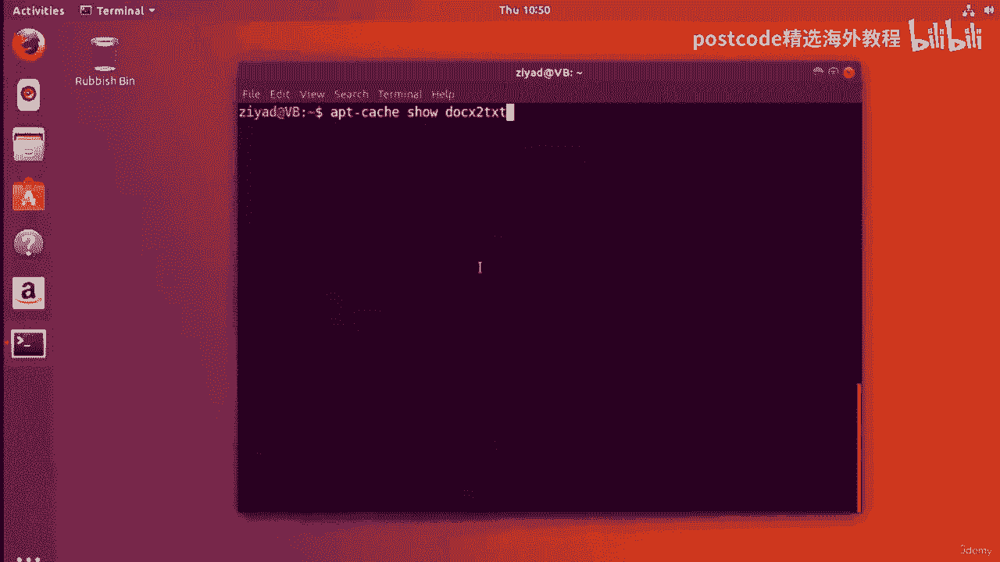
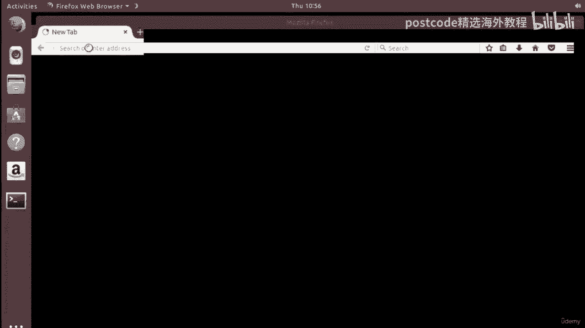
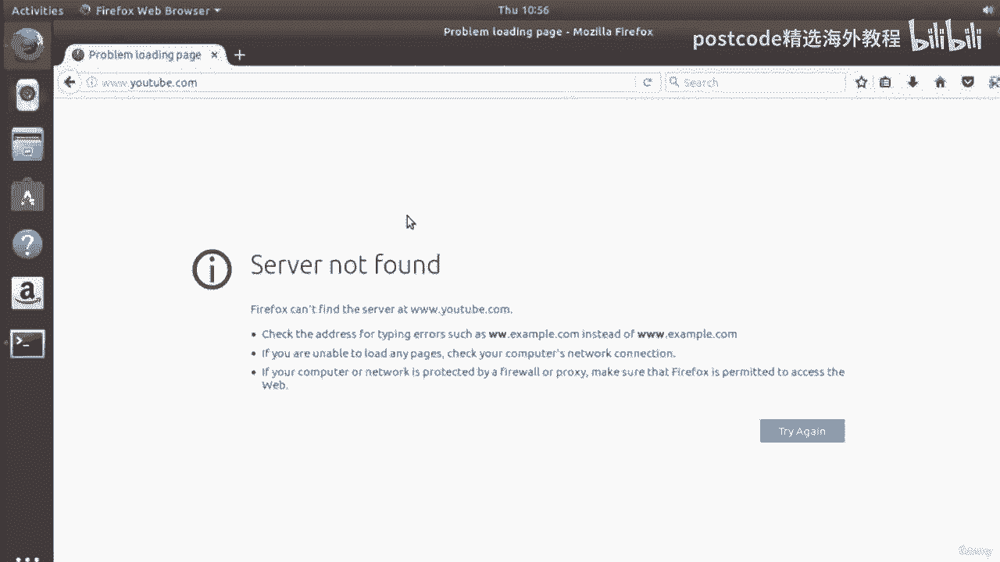
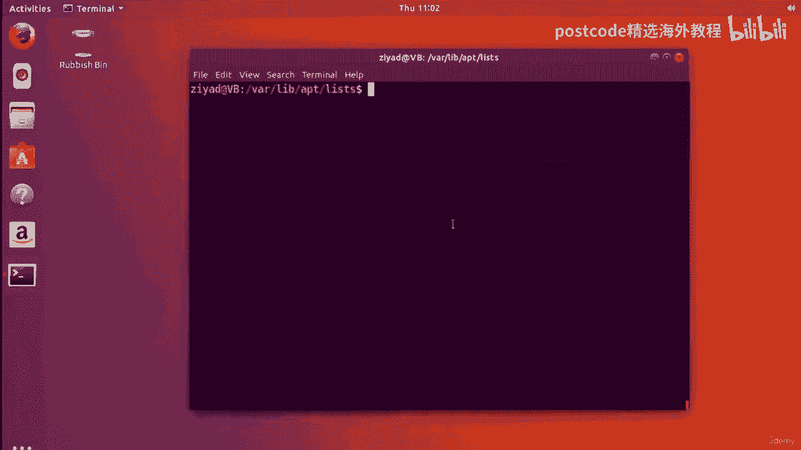
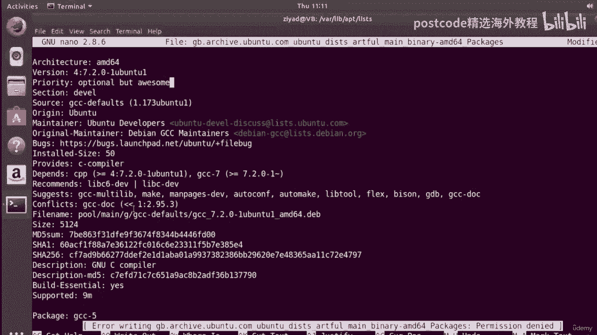
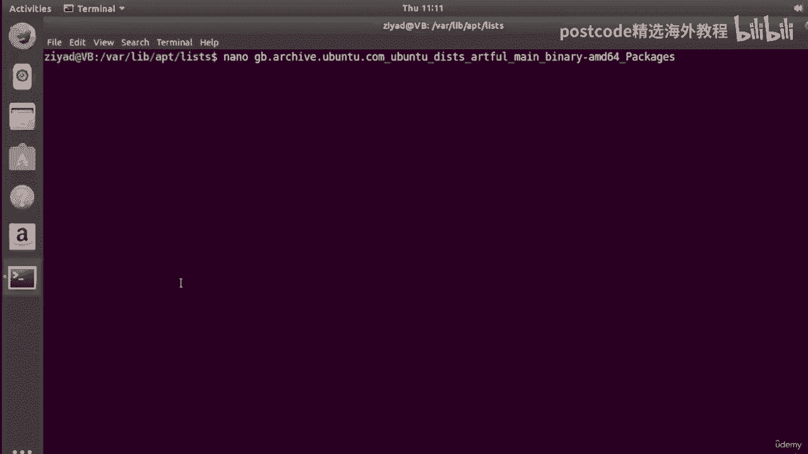
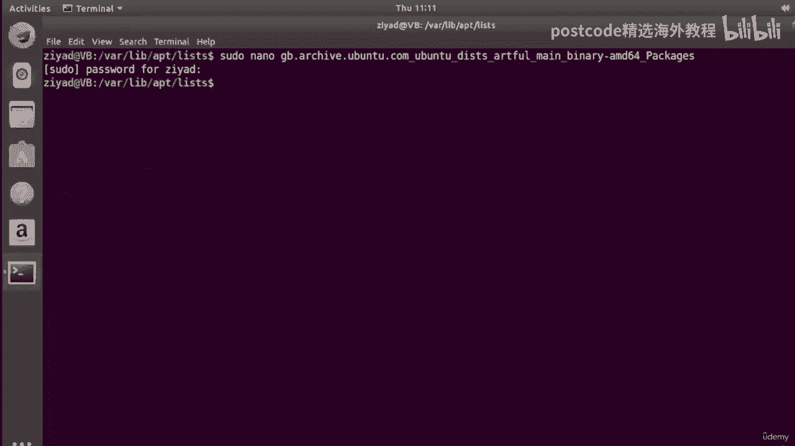
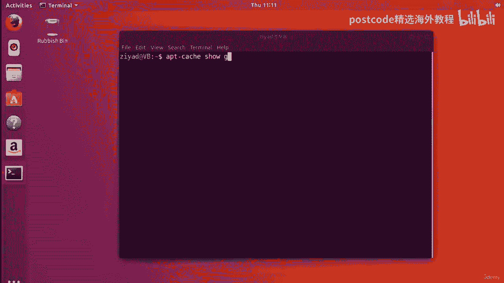
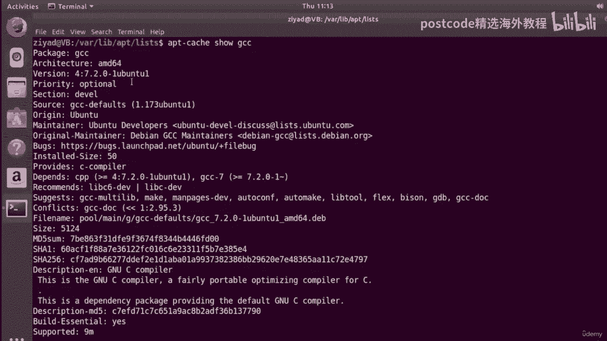

# 红帽企业Linux RHEL 9精通课程：04-04-017：APT包管理器缓存详解

在本节课中，我们将要学习APT包管理器的一个重要组成部分——缓存。我们将了解缓存是什么，它如何工作，以及如何使用`apt-cache`命令来搜索和查看软件包信息，即使在没有互联网连接的情况下。

## 什么是APT缓存？

上一节我们介绍了使用APT来管理软件包。本节中我们来看看APT如何在没有网络时也能提供软件包信息，这得益于其缓存机制。

缓存是一种用于高效存储和快速访问信息的本地存储位置。在APT的上下文中，缓存存储了从配置的软件源（存储库）下载的软件包列表及其元数据（如描述、版本、依赖关系等）。当您执行`apt update`命令时，系统就会从远程服务器获取这些列表并更新本地缓存。



因此，即使断开网络连接，`apt-cache`命令依然可以查询这些本地存储的信息。

## 使用`apt-cache`搜索软件包

我们可以使用`apt-cache search`命令在本地缓存中搜索包含特定关键词的软件包。





例如，假设我们需要处理Microsoft Word文档（通常以`.docx`为扩展名），并想查找相关工具。以下是搜索命令：

```bash
apt-cache search docx
```

执行该命令后，会列出所有名称或描述中包含“docx”的软件包。每行显示一个包，左侧是包名，右侧是简短描述。

如果想进一步筛选结果，可以将`apt-cache search`的输出通过管道传递给`grep`命令。例如，只查看描述中包含“text”的`docx`相关包：

```bash
apt-cache search docx | grep text
```

## 查看软件包的详细信息

搜索到感兴趣的软件包后，可以使用`apt-cache show`命令查看其详细信息。

例如，查看名为`docx2txt`的软件包的详细信息：

```bash
apt-cache show docx2txt
```

该命令会输出大量信息，包括：
*   **包名**（Package）
*   **适用架构**（Architecture）
*   **版本号**（Version）
*   **所属软件源**（来自哪个存储库，如`universe`）
*   **维护者信息**
*   **详细描述**（Description）

为了使输出更易于阅读，可以将其通过管道传递给`less`命令：

```bash
apt-cache show docx2txt | less
```

## 缓存的位置与工作原理

我们已经看到，即使断开网络，`apt-cache`命令依然有效。这是因为相关信息存储在本地计算机的缓存中。



在Ubuntu/Debian系统中，APT的包列表缓存位于以下目录：

```
/var/lib/apt/lists/
```

这个目录下存放着许多文件，每个文件对应一个已启用软件源的包列表。这些文件根据软件源地址、发行版版本和系统架构进行组织。

例如，一个典型的列表文件名可能类似于：
`archive.ubuntu.com_ubuntu_dists_jammy_main_binary-amd64_Packages`

这个文件包含了来自Ubuntu主（main）软件源、适用于amd64架构的所有可用二进制软件包的详细信息。

当我们运行`apt-cache show <包名>`时，APT实际上是在这些本地列表文件中查找并提取对应软件包的信息。

## 动手实验：探索缓存文件

为了更直观地理解，我们可以直接查看缓存文件。

1.  首先，导航到缓存目录：
    ```bash
    cd /var/lib/apt/lists/
    ```
2.  使用`ls`命令查看目录下的文件列表。为了看得更清楚，可以将其输出通过管道传递给`less`：
    ```bash
    ls | less -N
    ```
    （`-N`选项会显示行号）



3.  假设我们想查看关于`gcc`编译器包的信息。我们知道它来自主（main）软件源，并且是预编译的二进制包（binary）。我们可以尝试用文本编辑器（如`nano`）打开对应的列表文件进行查看。**注意：这需要管理员权限。**
    ```bash
    sudo nano archive.ubuntu.com_ubuntu_dists_jammy_main_binary-amd64_Packages
    ```
    （请将文件名替换为您系统中实际存在的、对应的主软件源列表文件）



4.  在打开的文件中，您可以搜索`Package: gcc`。您会发现，这里存储的信息与`apt-cache show gcc`命令输出的信息完全一致。这证实了`apt-cache`命令的数据来源正是这些本地缓存文件。





**重要提示**：虽然可以查看和编辑这些缓存文件，但通常不建议手动修改它们。任何更改都可能被下一次`apt update`操作覆盖，或者导致包管理器出现意外行为。此处操作仅为教学演示。

## 总结

本节课中我们一起学习了APT包管理器的缓存机制。

*   我们了解到**缓存**是存储在本地的软件包信息数据库，它使得`apt-cache`命令能够快速检索信息，无需实时网络连接。
*   我们学习了使用`apt-cache search`来根据关键词查找软件包。
*   我们掌握了使用`apt-cache show`来获取指定软件包的详细元数据。
*   我们还探索了缓存的实际存储位置（`/var/lib/apt/lists/`），并理解了`apt-cache`命令的工作原理——即查询这些本地列表文件。



理解缓存机制有助于您更高效地管理和查询软件包，尤其是在网络环境受限的情况下。