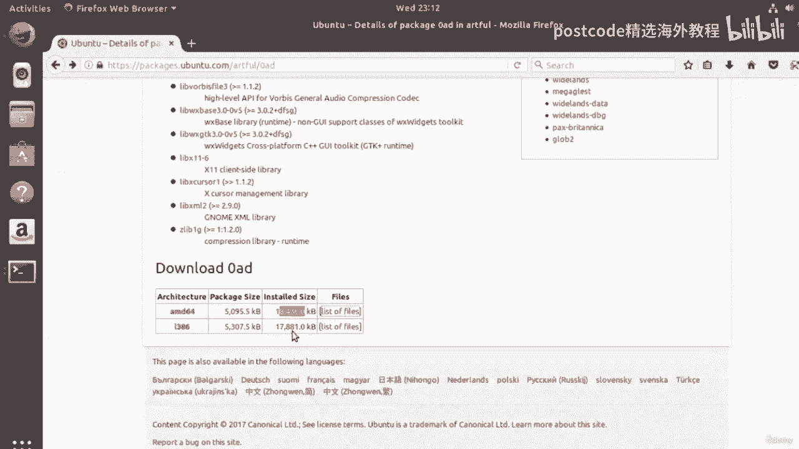

# 红帽企业Linux RHEL 9精通课程 — RHCSA与RHCE 2023认证全指南 - P42：04-04-018 Software repo - 精选海外教程postcode - BV1j64y1j7Zg

所以我们首先需要知道什么是软件存储库。因此，可以将软件存储库视为一个充满软件的大型图书馆。现在，当你去图书馆时，你可以搜索书籍，你可以阅读有关书籍的信息，你可以查看，在不同版本的书籍中。

您可以比较您可能想要借阅的书籍以及，然后在图书馆借阅它们。软件存储库就像一个图书馆，只不过您不必归还软件。更好的是，当软件有新版本时，您可以自动更新。

将某个软件以及整个系统上的所有软件升级到可用的新版本，用一个简单的命令。这有助于确保您的系统安全可靠，而且也非常出色。现在 Ubuntu 有四个不同的存储库，每个存储库存储不同类型的软件。

Ubuntu 的主网站 12。com 上对它们进行了描述。

现在，如果我们去帮助 Ubuntu 建立一个充满存储库的社区，并使用大写 R，然后转发，用大写 U 斜线 Ubuntu，顺便在资源中放一个链接。如果我们转到那里，我们将看到有关不同存储库的信息。好的。

所以你看到这里有一个部分说了什么是存储库？你也可以在很多人身上看到这一点。有四个主要存储库。现在，主存储库是保存所有主动维护的软件的存储库，并由 Canonical 更新。

Canonical 是创建 Ubuntu 的公司。现在那里的所有软件都是免费的，而且也是开源的。现在主存储库是最可靠的存储库，您应该尝试从合适的存储库中进行选择，如果可能的话，首先将软件放在主存储库中。

现在第二个 Ubuntu 存储库是 Universe 存储库。现在这个存储库中的软件也是免费的，而且它也是开源的。然而，它不是由 Canonical 维护，而是由 Ubuntu 社区维护，并且，因此。

理论上它可能比主存储库不那么严格并且更容易出现错误。但根据我的经验，大多数时候这都很棒。现在Ubuntu系统中的第三个、第三个仓库就是受限仓库。现在，受限存储库包括公司特定设备的专有软件和驱动程序。

比如无线网卡等。现在，此存储库有助于确保您计算机上的设备更有可能正常工作，盒子，我们可以说。但该软件通常是专有的，因此通常不会给您自由。所以其他软件给你。此外，您可能无法直接检查受限制的软件的源代码。

存储库。而这要花多少钱取决于具体的用例。第四个也是最后一个存储库是多元宇宙存储库。现在，多元宇宙存储库包含受版权或法律问题限制的软件。多元宇宙存储库中的软件可能有也可能没有可访问的源代码。

现在您可以在这里看到，Ubuntu 的哲学通常是让用户选择什么，他们想要使用的软件。有两个免费且开源的存储库，即主存储库和宇宙存储库。还有另外两个存储库不是免费和开源的或者软件所在的位置。

不太可能是这样。因此，对于某些人来说，使用非自由软件是令人憎恶且完全不可接受的，而对于其他人来说，如果现在能完成工作就好了。但谁把这个选择权留给你呢？

但是如果像 Fedora 这样的发行版在存储库中只包含自由软件而不包含，现在的软件不是免费的，这可能会导致便利性降低，但它还有其他好处。现在 Ubuntu 将选择权交给您，您可以选择自己喜欢的内容。

并且您已被告知，在关于自由​​软件的争论中，您可以更好地为自己做出选择。现在我们了解了 Ubuntu 存储库是什么以及它们之间的区别，让，我带你看看他们在网上闲逛的地方。现在，我指的不是社交媒体。

而是一个名为 packages dot ubuntu dot com 的链接。因此，如果我们转到这里，我们可以浏览软件包列表，我们可以看到不同的，链接取决于我们现在运行的捆绑包的版本。

Ubuntu 的每个新版本的代号都会按字母顺序更改。那么比如说现在的这个叫artful aardvark或者简称Artful，你可以看看是什么。

您的发行版的代码名称是在命令行中使用此命令。

所以你打开你的终端并输入LSB，下划线release，然后给它A选项，它会打印出有关您的按钮的所有信息以进行分发。你可以看到我的名字叫Artful Aardvark。它在底部告诉我。

代号是 Artful。

因此，我会单击巧妙的链接，您可以在此处查看该链接以打开以查看适用的软件包，大部头书，但您可以单击适合您的任何代号。当您观看此视频时，一切的工作原理基本相同。现在这里是所有包或包类别。

所以你可以在这里看到一大堆类别。例如，您可以看到我们有用于网络服务器的东西。您可以看到我们为字体提供的内容。我们有编辑。文档、数据库、管理、实用程序和许多其他编程语言，Python 和文本处理视频。

它就这样一直持续下去。有很多不同的东西，这些只是类别，所以有很多不同的包，在每个类别中。但如果我们向下滚动，我们会注意到这里有几个重要的链接。我们已经获得了所有包的链接。

并且我们已经获得了紧凑的压缩文本列表。所以这里的这个只是一个如果我在新选项卡中打开它，我们可以看到它只是一种文本文件，这里有每个包的列表。我在准备课程时下载了这个文本文件并通过字数统计命令运行它。

删掉头信息后统计一下行数，发现有74060行，软件包，这很疯狂，但你知道，它就在那里供你使用。我要结束了，但我们对此视频不感兴趣。我们感兴趣的是这里的这个链接，其中显示了所有软件包，如果我单击该链接。

它将打开，打开一个显示所有软件包的网页。因此，让我们等待加载一秒钟。所以我们就到了。现在我们得到一个网页，它为我们提供了 Ubuntu 中每个可用软件包的链接，您可能会注意到。

它在方括号中向您显示这些内容来自哪个存储库。所以我们可以在这里看到这个零添加包来自 Universe 存储库，如果我们向下滚动，我们也将能够看到一些来自其他存储库的内容。

我们看到我们从宇宙存储库中获得了很多信息，但你看这里我们有一个来自，多元宇宙。如果您发现一个包旁边的方括号中没有任何内容，则意味着它是，来自主存储库。例如，这是一个 lib bin。

您可以看到它旁边没有任何东西。这意味着它来自主存储库。所以这也是需要注意的事情。但现在，为了本视频的目的，让我们继续点击这个顶部链接，这个，这个包称为零添加。当我们单击它时，我们会注意到打开一个新网页。

并且我们看到该包被称为，零，我们可以在顶部看到包名称。然后在这些括号中我们可以看到包的版本号。然后我们可以在这些方括号中看到该包来自的存储库。正如我所说，如果没有任何此类信息，那么它来自主存储库。好的。

众所周知，宇宙存储库包含大部分免费和开源软件，但是，它由社区维护，不会从 Ubuntu 收到任何正式更新或维护，Canonical 的开发人员。然后在其下方我们可以看到一个名为与此包相关的其他包的列表。

我们，可以看到，他们在此处的括号中包含了所需的版本号。例如，这个 dpkg 包必须大于或等于版本 1。15。6。您可以看到有很多不同的软件包与此相关。你可以看到它们的前面也有一个特殊的符号。

我们可以看到红色表示依赖于这个包。所以红点意味着零援助计划依赖于这些计划。这意味着为了安装零援助，我们需要安装所有带有红点的软件包，如果我们希望零援助发挥作用，也要在他们面前。

但红点并不是唯一可以出现在其他包列表中的包旁边的符号。我们可以看到还有其他符号。因此，您可以在此处的按键上看到，包裹旁边的绿色菱形意味着零 ID 将，建议您安装另一个软件包。

所以让我们把它变得更通用一些。让我们调用您要安装的包，即我们的案例零。我们将该包称为“好的”，然后我们在其他包列表中随机调用一个包，乙 好吧。所以如果A包推荐了B包，那就意味着为了让A包能够正常运行。

我们应该得到包 B，但包 A 没有它也能运行。好的。蓝色方块会说套餐 A 向我们推荐了另一个套餐，因此推荐意味着，没有它它也能正常工作，但我们建议正常使用。取决于意味着如果您没有获得这些软件包。

它将无法工作。推荐意味着它会起作用，但不会像它应该的那样。建议包只是一些完全可选的东西，您可能想检查一下。最后一项是增强功能。现在，任何带有黑点的东西都意味着它以某种方式增强了当前的包，也许通过新功能。

但同样，这不是必需的。好的。如果我们向下滚动到此页面的底部，我们可以看到尺寸，我们可以看到包裹的尺寸，就是下载，我们可以看到解压安装后的大小。而且我们还可以看到每个包包含什么、包含什么文件，这很有用。

因此，您可以单击它，然后可以看到每个包包含的每个文件的列表。你可以看到有。不同的计算机体系结构有不同的软件包。例如，如果您的计算机架构具有 AMD 64 架构，您可以，会下载这个包。

如果您有一个用于三、八、六计算机体系结构的计算机，您可以下载此软件包。

您可以通过打开终端并输入您的名字 Dash 来查看计算机的体系结构。我们可以在虚拟机中看到这一点。我们的世界现在运行在 x 8664 架构上，amd 64 和 x 8664 是相同的。

因此，我们将在这里获得最适合我们的 AMD 64 软件包。现在，如果您刚刚获得 x 86，那么您就下载 8386 软件包，因为这可能是最重要的一个，最适合您的计算机。所以现在你可能会想，等一下，Z。

坚持住，坚持住，坚持住。你是说为了安装软件，我首先必须搜索数千个软件包，然后找出它有哪些依赖项。之后，我必须确保下载所有这些不同的软件包并满足它们的依赖关系，等等等等。但在下载所有这些之前。

我需要确保它们的版本号都是正确的，并且，这些软件包适合我的计算机架构。你一定是在开玩笑。嗯，无论如何，这就是我的想法。但不，好消息是您的计算机上安装了一个命令行工具，可以处理，所有这些东西。

它被称为你的包管理器。现在，实际的程序因发行版而异，但在捆绑包上有所不同，管理器称为APT，拼写为AP T，代表Advanced Packaging Tool。这就是我们将要做的。

用来为我们完成所有这些艰苦的工作，在下一个视频中，您将。

