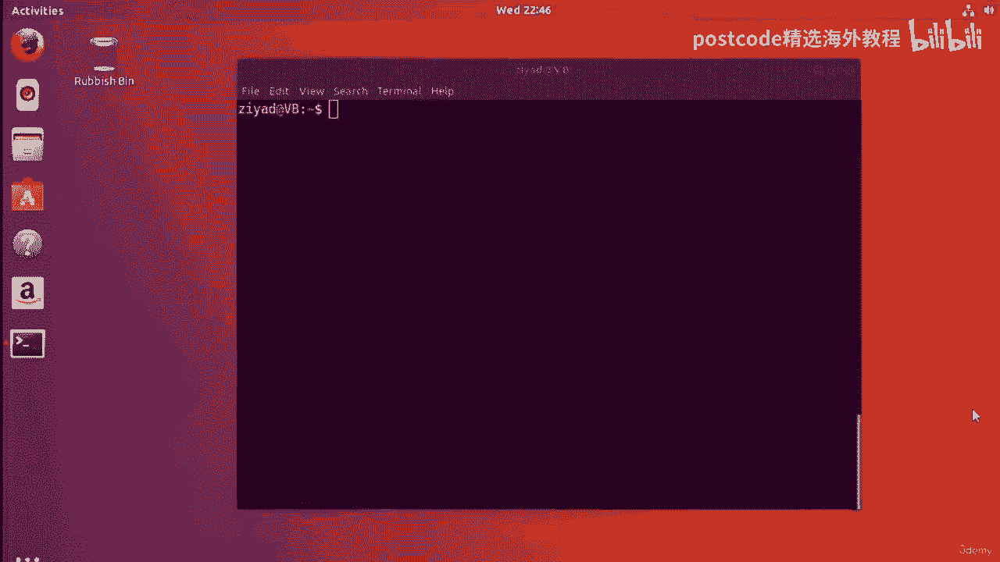
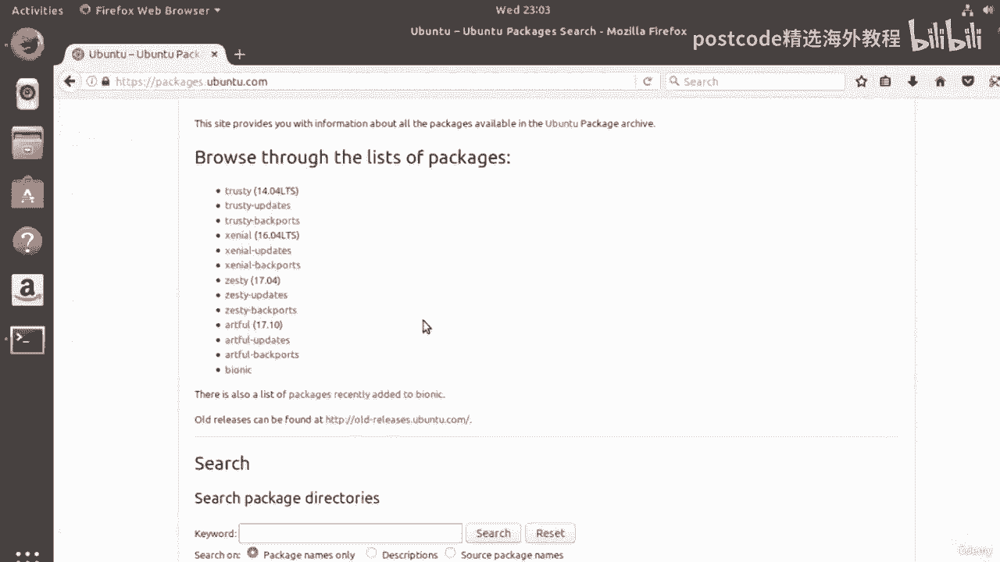
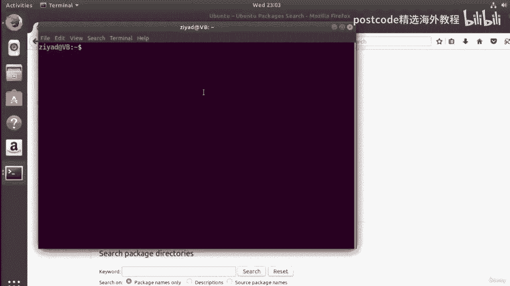
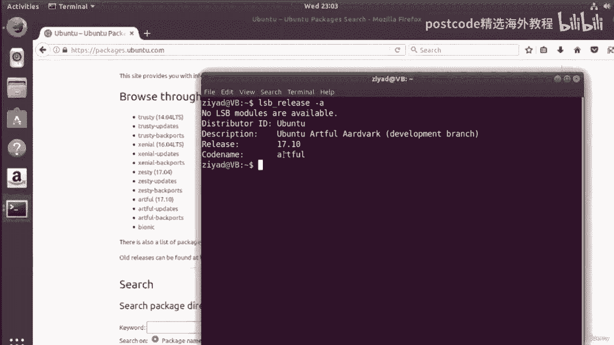
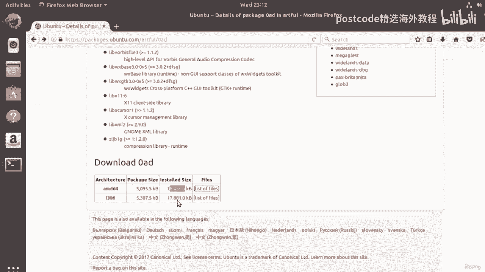
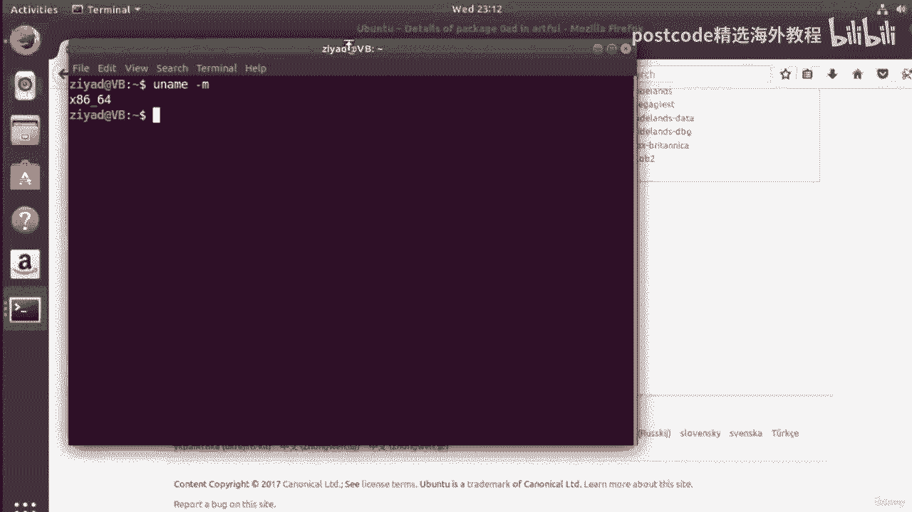
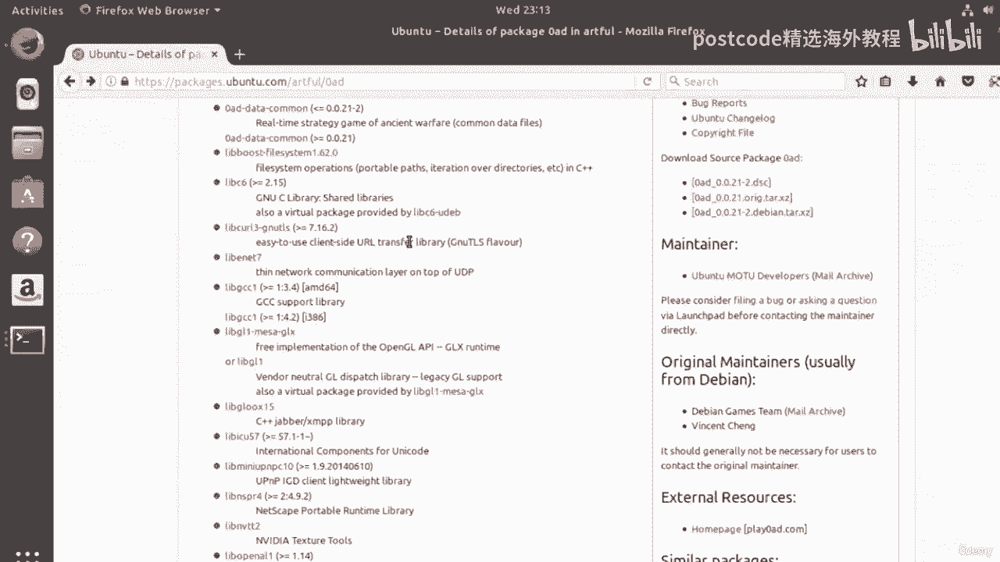

# Linux软件管理基础：04-04-018：软件仓库详解 📦

在本节课中，我们将要学习Linux系统中一个核心概念——软件仓库。我们将了解什么是软件仓库、Ubuntu系统中的四种主要仓库类型，以及如何在线浏览和解读软件包信息。



## 什么是软件仓库？

软件仓库可以被视为一个存储了大量软件的大型图书馆。当你访问图书馆时，可以搜索、查阅和比较不同版本的书籍，然后借阅。软件仓库与之类似，但用户无需归还软件。更重要的是，当软件有新版本时，你可以通过一个简单的命令，自动更新单个软件或整个系统上的所有软件。这有助于确保系统的安全性和可靠性。

## Ubuntu的四种主要软件仓库

Ubuntu系统包含四个不同的软件仓库，每个仓库存储不同类型的软件。以下是它们的详细介绍：

**主仓库**
*   该仓库包含所有由Canonical公司（Ubuntu的创建者）主动维护和更新的软件。
*   其中的所有软件都是免费且开源的。
*   主仓库是最可靠的仓库，应优先考虑从此处安装软件。

**宇宙仓库**
*   该仓库中的软件同样是免费和开源的。
*   与主仓库不同，它由Ubuntu社区维护，而非Canonical公司。
*   理论上，其软件可能不如主仓库严格，但大多数情况下运行良好。

**受限仓库**
*   此仓库包含特定设备的专有驱动程序和软件，例如无线网卡驱动。
*   它有助于确保硬件正常工作，但软件通常是专有的，用户可能无法自由使用或查看其源代码。



**多元宇宙仓库**
*   此仓库包含受版权或法律问题限制的软件。
*   其中的软件可能有也可能没有可访问的源代码。



Ubuntu的哲学是将选择权交给用户。用户可以根据自己对自由软件的看法，决定使用哪些仓库。而像Fedora这样的发行版则只包含自由软件，这可能导致便利性降低，但理念不同。



## 在线浏览软件包

上一节我们介绍了仓库的类型，本节中我们来看看如何在线浏览具体的软件包信息。我们可以访问 `packages.ubuntu.com` 网站来浏览软件包列表。

每个Ubuntu版本都有一个按字母顺序排列的代号。要查看你当前系统的代号，可以在终端中输入以下命令：
```bash
lsb_release -a
```
命令输出中会显示发行版的代号，例如 `Codename: artful`。

在网站上选择对应的代号后，可以看到按类别（如网络服务器、字体、编辑器等）组织的软件包列表。网站还提供所有软件包的压缩文本列表，其中可能包含数万个软件包。

点击“所有软件包”的链接，会打开一个显示每个可用软件包的页面。软件包名称后的方括号 `[ ]` 指明了它所属的仓库（如 `[universe]`），没有括号的则来自主仓库。

## 解读软件包详情页面

点击一个具体的软件包（例如 `0ad`）会进入其详情页面。页面顶部显示了软件包名称、版本号和所属仓库。

页面中有一个“与此包相关的其他包”列表，列出了该软件的依赖、推荐、建议等关系。这些关系通过不同的符号标识：

以下是各种关系的含义：
*   **依赖**：软件包A的正常运行**必须**安装软件包B。
*   **推荐**：软件包A在没有软件包B的情况下也能运行，但为了正常功能，**建议**安装B。
*   **建议**：软件包B为软件包A提供了一些完全**可选**的额外功能。
*   **增强**：软件包B以某种方式**增强**了软件包A的功能，例如提供新特性，但同样不是必需的。

在页面底部，可以看到软件包的下载大小、安装后的大小，以及包含的文件列表。软件包通常会为不同的计算机架构（如 `amd64`, `i386`）提供不同版本。

要查看自己计算机的架构，可以在终端中输入：
```bash
uname -m
```
常见的输出如 `x86_64`（与 `amd64` 相同）或 `i386`/`i686`。请根据结果下载对应架构的软件包。



## 包管理器的作用



你可能会觉得手动处理软件包及其复杂的依赖关系非常繁琐。幸运的是，Linux系统通过**包管理器**自动处理所有这些工作。在Ubuntu及其衍生系统上，这个工具就是 **APT**。

APT会自动处理搜索软件包、解决依赖关系、确保版本兼容性以及匹配系统架构等一系列复杂任务。我们将在后续课程中详细学习如何使用它。



本节课中我们一起学习了Linux软件仓库的基础知识。我们了解了软件仓库的概念、Ubuntu的四种仓库类型、如何在线查找和解读软件包信息，以及包管理器（如APT）在简化软件安装过程中的重要作用。掌握这些概念是有效管理Linux系统软件的基础。