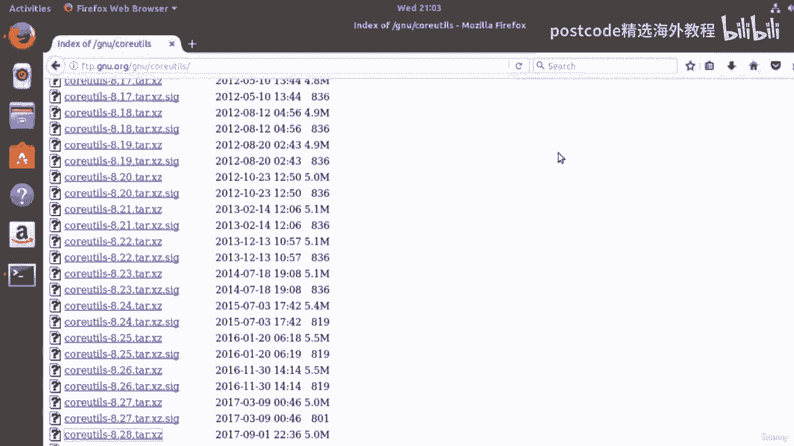
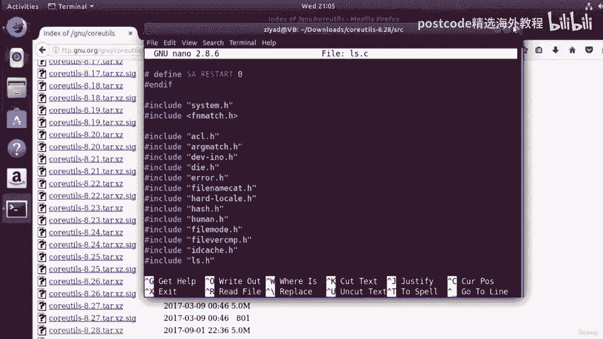
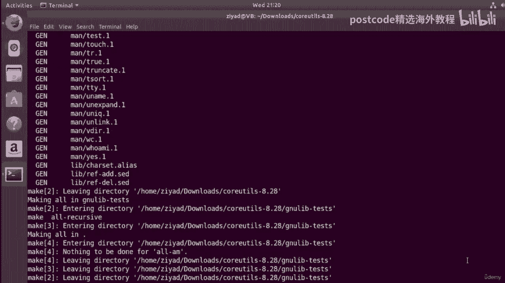
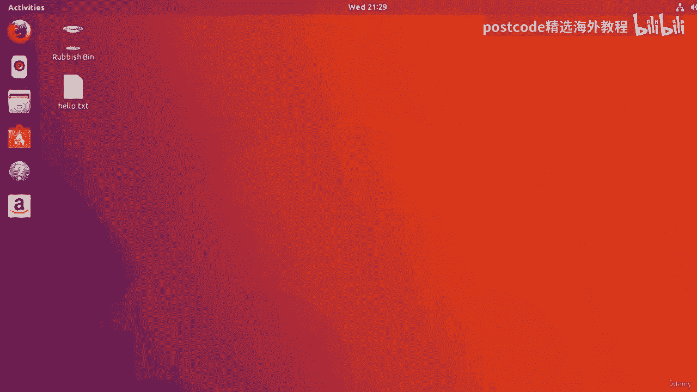
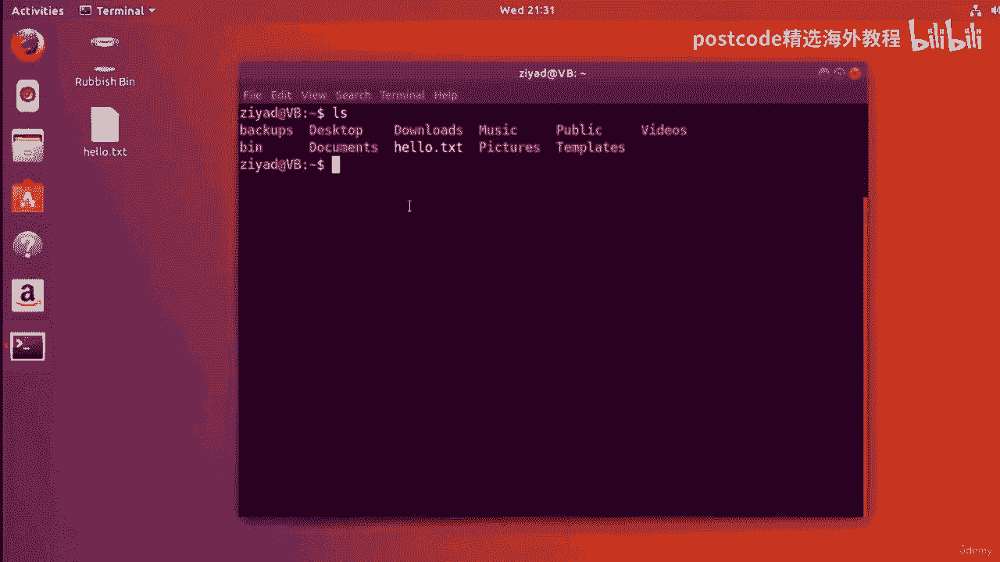

# 红帽企业Linux RHEL 9精通课程 — RHCSA与RHCE 2023认证全指南 - P43：04-04-019 Package compile - 精选海外教程postcode - BV1j64y1j7Zg

所以我们再次来到新的 dot org 网站，我们可以在软件选项卡上看到我们可以，让每个包向下滚动到底部。这是新操作系统带来的。现在是我们迄今为止运行的命令的所有源代码，例如fine命令、RLS。

命令等等，可以在这个 core utils 包中找到。那么让我们继续下载这个包并看看它。为此，我们单击链接，它将打开另一个页面。如果我们向下滚动到此处的下载部分，它会给我们几个链接并告诉我们。

可以在此链接找到稳定源版本，并且可以找到测试源版本，在这个链接。现在，稳定版和测试版之间的区别在于，稳定版源代码版本可以正常工作。他们已经过测试，而测试源版本可能是他们正在尝试新事物而你，要知道。

它并不完全稳定。可能还不是最终的。正确的。因此，我们将尝试稳定的源，然后我将单击该链接。我们可以在这里看到我们得到了一堆包，一堆在列表中的包，格式。最新版本位于列表底部。因此。

如果我们尽可能向下滚动到列表底部，我们将看到我们获得了 core utils 版本，8。28。我们要点击的是以点 z 结尾的那个。所以不是以点 z cig 结尾的，而是以点 x z 结尾的。因此。

如果我现在继续点击它，我们就会看到这一点。我们看到这里弹出一个窗口，我要单击“保存文件”，我要单击。好的。这已保存在我们的下载文件夹中。因此，如果我现在在终端中转到我们的下载文件夹，您可以在。

在我们的主目录中，我转到下载文件夹并将其列出来，您可以看到，我们已经得到了这个 core utils 版本 8。2 8xz。现在这是一个使用 xz 压缩算法压缩的压缩 tar 存档。所以如果我看一下。

我们会看到使用 Fine 命令，我们会看到它是 x、z 压缩数据。现在XZ只是一种压缩算法，就像B zip或GZIP压缩算法一样，我们非常简单地谈到了文件压缩和存档视频，因为它不是其中之一。

更常见的算法，但我们可以使用 TAA 命令将其解压。那么我们就这样做吧。我们能做的是输入 TAR，如您所知，如何提取文件，您给它 X，和 F 选项，然后你告诉它哪个存档。但要通过zip压缩算法提取。

需要给它大写的j选项。因此，小写 j 选项适用于 b zip 2，但大写 j 选项适用于 x zip。如果您想了解更多信息，请查看文件压缩和归档备忘单，我在相应的视频中给了你。好的。因此。

如果我们继续按 Enter 键，我们会发现我们没有收到任何信息，因为我们没有提供，谈论V选项。但如果现在我使用 LZ，我们会看到现在有一​​个名为 Core Utils 8。28 的新文件夹。因此。

如果我们播种到那里，那么我们播种到核心实用程序并看一下，我们可以看到我们有一个，里面有一大堆东西，但我们现在可以特别注意这个 CRC 目录，CRC 是源代码的缩写，它是保存源代码的地方。因此。

如果我们植入 CRC 并通过单击屏幕查看，看一下，我们可以看到我们已经，这里有一大堆文件。让我们将 LHS 数据通过管道传输到 less 命令中。首先，现在，现在这使得上下滚动变得更容易，你看。

我们现在可以看到，我们得到大量以点 C 结尾的文件。现在点C告诉我们这些文件都是用C编程语言编写的，即，是一种非常常见的编程语言，新软件是用它编写的，考虑到它的发布日期，你知道。

这篇文章是在 20 世纪 80 年代、90 年代写成的。那么让我们看一下 LS 命令背后的代码，例如，我们可以 ls 然后 grep，输出 ls 我们可以看到这里有 ls dot c 文件。

那么让我们来看看吧。Nano ls dot c 就到了。这实际上是这里的源代码。这是所有源代码，我们将其最大化。

LS 命令的源代码。那么现在这不是很棒吗？如果你有时间、有能力、有意愿，你可以仔细阅读这段代码并仔细研究，它正在做什么，这是自由软件运动旨在给予您的自由之一。但我们其实也可以修改这段代码。

重新编译成一个可以运行的软件，这就是我们要做的，现在要做。现在，这不是一门关于 C 编程的课程，但是在每个 C 程序中都有一个函数，称为，main 函数，它是一个非常重要且始终运行的函数。好的。

现在我要修改该函数，以便每当 LS 运行时，计算机都会打印出，大家好，银幕上美丽的人们。好的，我将在主函数中输入一些代码来实现这一点。现在，在为本次讲座做一些准备之后。

我发现该文件中的 main 函数开始于，关于第 1443 行。因此，如果我们使用 Nano，请使用 转到行功能。巨魔和下划线选项。如果我输入第一行、第四行、第四行、第三行并按 Enter 键。

您可以看到我们最终到达了，主要功能魔法。因此，我将在此处将执行打印操作的代码放在顶部。所以打印 F，我将把它放在那里。你好，你们这些美丽的人。并确保它以反斜杠 n 字符结尾的新行。我将把这件事结束。

这没有什么区别，但你知道这样更好一点，让我们尝试摆脱这个，行尾的额外空间。没关系。但好吧，我们到了。所以我们把这个函数放在那里。大家好，你们这些美丽的人，有着新的线条角色。所以这条线，它进入了一条新线。

现在，如果我们使用 control 和 O 保存文件，然后使用 X 控制退出，我们现在就修改了 LS，命令代码，所以这很酷。但是现在我们如何将这段代码变成更新程序并将其安装到我们的计算机上呢？嗯。

因为它们是用 C 编写的，所以在使用之前需要将代码编译成机器语言，可以运行。为此，我们需要一个编译器，更具体地说，一个用于 C 编程语言的编译器。

现在新的 C 编译器或 CC 是 GNU Linux 系统上使用的编译器，我们可以通过输入来获取它，以下命令和以下命令是 sudo apt get install DCC 现在，我不想。

你不用太担心这个，因为我们稍后将详细解释这个命令的含义，实际上意味着我们将在课程的这一部分中做到这一点。但简而言之，我们正在做的是告诉计算机查看可用的软件存储库，对于 Ubuntu。

下载并安装新的 C 编译器或 GCSE 软件包。同样，在接下来的几个视频中，这将变得更加清晰，但只需像我在此处所做的那样输入即可，当你高兴时按 Enter 键，因为我们使用了伪，它会询问我们的密码。

就像我们之前使用 sudo 一样。所以我只是希望能正确地输入它。手指交叉。没有。让我们再试一次。我们开始吧。现在它说，嘿，我们必须安装一大堆软件包才能获得 GCSE，包裹。

大约需要 72 MB 的额外磁盘空间。您现在想继续吗？我可以直接打字。是的。所以我只是要打字。为什么按 Enter 键，它就会继续执行该操作。这可能需要一些时间，具体取决于您的互联网连接。

但它似乎已经下载，就我而言，现在它只是在进行安装。它将开始解压所下载的每个不同的软件包，我们实际上是，看到安装过程正在发生。我们将在课程后面更详细地研究这个问题，但你可以看到我们没有。

必须下载任何向导并单击下一步，下一步，下一步，下一步，下一步，同意任何条件条款，或类似的东西。因为所有这些软件都在新的公共许可证下，并且它都为您提供相同的相同的不同的，彼此享有相同的自由。好的。

现在已经完成并安装了，我们不需要做任何事情。我们现在已经安装了新的 C 编译器和一大堆其他东西。现在我们准备编译我们的代码了。好吧，让我们把注意力转向我们漂亮的源代码。现在。

因为不同的计算机有不同的架构，所以我们需要配置安装，将此代码添加到我们的特定机器上。现在有一个名为“配置”的脚本。现在我们在源代码中，我们在源文件夹中。所以让我们用 CD 备份一个文件夹。

点点备份一个文件夹，清除屏幕并采取，再看看。您可以在这里看到一个名为“配置”的脚本，我们知道它是一个脚本，因为它是绿色的。好的，让我们通过输入 bash configure 来运行它。

然后按 Enter 键。它所做的就是配置新的 C 编译器 DCC，以确保当它，编译所有这些，我们告诉它的软件，它将以适当的方式完成它，针对我们计算机的架构，它正在做适当的调整。

除了配置新的 C 编译器之外，此配置脚本所做的重要事情是，它创建一个名为 Makefile 的新文件。现在Makefile负责安装这个新的软件包，但是要使它们，让文件工作，这是一个巨大的绕口令。

顺便说一句，我们需要一个名为 Make 的新命令。因此，当这个东西完成配置后，我们将以非常类似的方式安装主命令，我们刚刚安装了新的 C 编译器。因此，如果我们只是坐在这里一会儿。

当我们看到所有这些美丽的文字在屏幕上飞翔时，不过，它看起来很棒，对吧？这就像你可能会看到的东西，与黑客电影不同，你知道，诸如此类的东西。我们现在确实正在这样做。所以，要为自己感到骄傲。好的。

现在一切都结束了。如果我们只是看一下这个目录，我们应该能够在这里看到这个名为 Makefile 的新文件。现在，Makefile 是一个重要的文件，但我们需要能够运行它。我们需要有主命令。因此。

为了得到这个，我们要输入 sudo apt get install make ，当我们按 Enter 时，它会，经历非常相似的安装过程。现在一切都安装得非常快，安装起来非常容易。好的。现在。

当我们与 Makefile 位于同一文件夹中时，如果我们只运行 make 命令，您可以看到，它将经历并编译它找到的所有 C 文件，最近没有被编译进去。仍有一些未完成的更改。

实际上是此文件夹中的所有 C 代码，包括，我们的 LS 文件。所以它所做的就是将其全部编译成机器代码、二进制代码，这些代码可以，可以在电脑上运行。好的。因此，当您运行 C 编程语言等编译语言时。

这是必需的。完成后，我们将能够安装新编译的程序。但我要在这里剪掉视频，以节省时间，并且避免让您等待太多。好的。现在已经完成了。所以我们找到了 LZ 命令的代码。我们编辑了该代码。

然后安装了新的 C 编译器，这就是我们所需要的，将该代码转换为计算机运行所需的机器代码。好的。所以我们所做的就是安装 C 编译器，并且必须先配置该编译器，然后才能运行。

可以正常工作以满足我们计算机的特定要求。所以我们配置了编译器，然后当配置完成后，我们只需使用 make 命令运行它，确保每一位代码现在都转换为机器代码。好的。因此，现在我们已经获得了该机器代码。

剩下的唯一步骤就是将该机器代码安装在，我们的道路上需要它真正发挥作用的地方。我们可以做到这一点的方法是使用伪 sudo make install 命令。

因此，如果我单击屏幕类型 sudo make install，它所做的就是安装所有内容，像那样。那是非常非常快的。现在我们已经安装了 8。28 版本附带的各个不同软件，核心UTILS包。好的。

那么让我们看看它是如何工作的。好的。因此，如果我们关闭终端并重新打开它，那么现在如果我们运行 LZ 命令，我们可以看到。

每次它运行时它都会向你打招呼，你们这些美丽的人，因为我们修改了代码，并安装了它。那有多棒？正确的。开源和免费软件万岁。所以这实际上是一个比我在这里向您展示的过程要快得多的过程。因此，要改回来。

我们只需重新编辑源代码，使用 make 重新编译，然后使用，进行安装。因此，如果我回到我们的广告下载，当你变得更好一点时，这实际上是一个更快的过程，用它。所以我们到了。我们位于核心 utils 文件中。

我们将转到我们所在的源代码文件夹。好的。那么我们就来Nano lzzy吧。让我们转到第 1443 行，我们要删除这一行，我放在那里的这一行，保存，文件。好吧，现在如果我清除屏幕。

我们所要做的就是 make 和 sudo make install。一。哦。因为我在错误的文件夹中。我们开始吧。make 并 sudo make install。好的。

现在请注意 mate 命令如何真正编译 RLS 命令，因为它注意到，有什么不同。让我用我的密码运行，以便它可以安装它。现在，当我关闭终端并重新打开它并使用 LZ 命令时，现在它恢复正常了。

所以你看那速度快了多少，对吧？一旦我们配置了编译器一次，或者至少为包配置了编译器，就可以很快地，去编辑，然后编辑它。这是因为该命令也知道它只需要重新编译受影响的代码，通过我们的更改。

而不是我们第一次执行此操作时对系统来说是新的整个包。所以 Make 是一个非常聪明的程序，正如我所说，现在我们已经安装了最后一个程序的新版本，程序中，现在“Hello。

 the You Beautiful People”消息消失了，又恢复到原来的样子。

