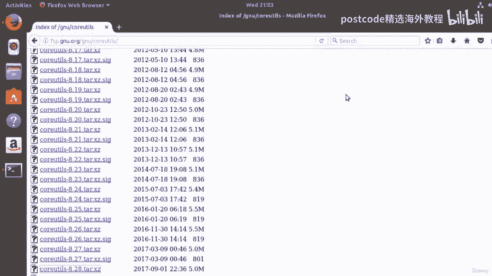
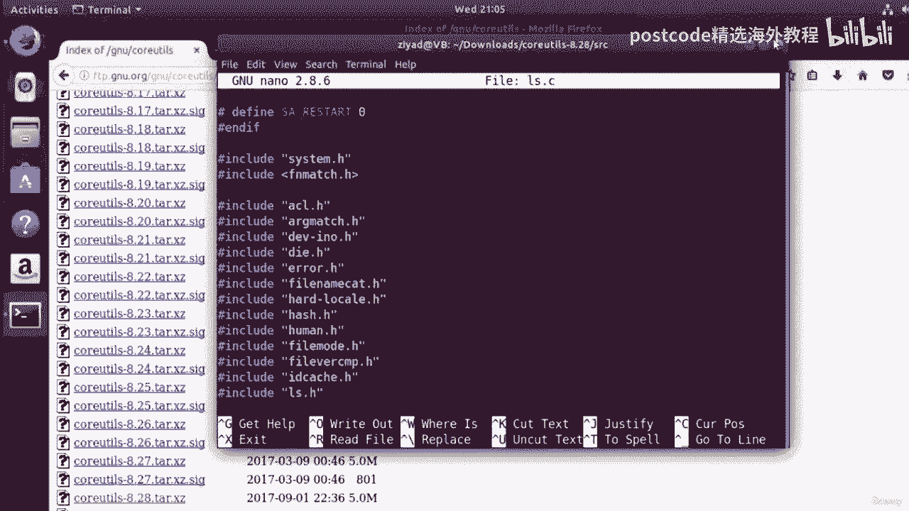
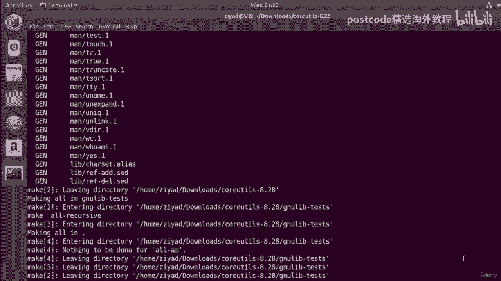
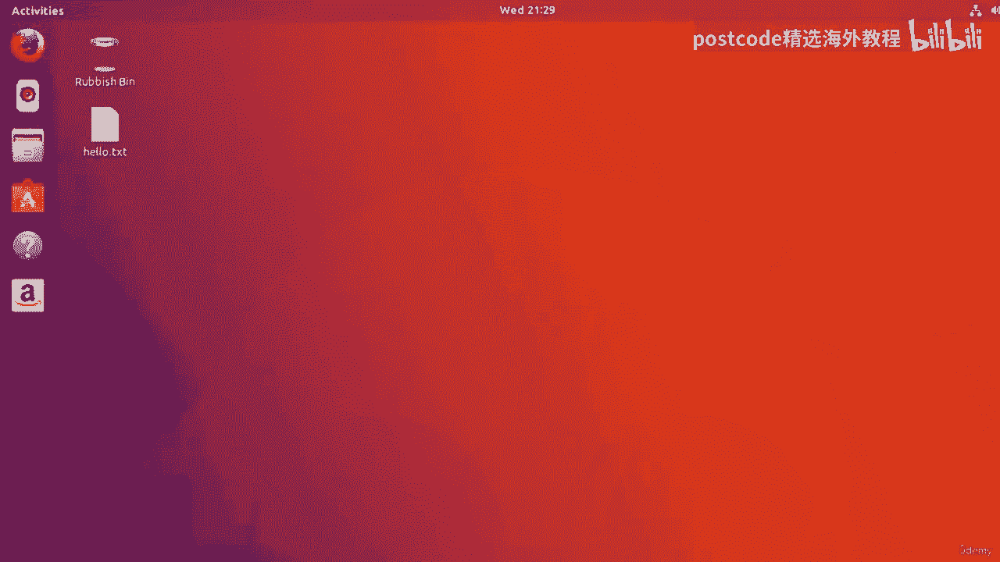
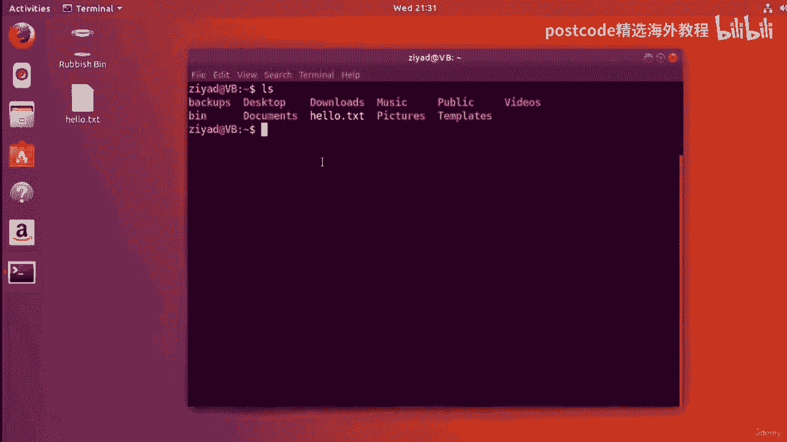

# Linux软件包编译：04-04-019：从源代码编译软件包 🛠️

在本节课中，我们将学习如何从源代码下载、修改、编译并安装一个软件包。我们将以 `coreutils` 软件包为例，它包含了 `ls`、`find` 等常用命令的源代码。通过这个过程，你将亲身体验开源软件的自由，并理解软件从源代码到可执行程序的完整流程。

## 概述

我们将访问 GNU 项目网站下载 `coreutils` 的源代码，修改 `ls` 命令的 C 语言源代码，然后使用编译器将其编译成机器码，最后安装到系统中。这个过程涵盖了配置、编译和安装三个核心步骤。



## 下载源代码

首先，我们需要获取软件的源代码。我们访问 GNU 项目的官方网站，找到 `coreutils` 软件包的页面。

以下是下载稳定版源代码的步骤：
1.  在网站上找到 `coreutils` 软件包的下载链接。
2.  在下载页面中，选择最新的稳定版本（例如 `coreutils-8.28.tar.xz`）。
3.  点击链接下载压缩包，文件通常会保存在用户的“下载”目录中。

下载完成后，我们可以在终端中进入下载目录查看文件。
```bash
cd ~/Downloads
ls -l coreutils-8.28.tar.xz
```

## 解压源代码包

下载的文件是一个使用 `xz` 算法压缩的 `tar` 归档文件。我们需要使用 `tar` 命令将其解压。



使用以下命令解压 `.tar.xz` 文件：
```bash
tar -xJf coreutils-8.28.tar.xz
```
解压后，会生成一个名为 `coreutils-8.28` 的目录，其中包含了所有的源代码文件。

## 查看与修改源代码

源代码通常存放在 `src` 目录中。我们可以查看并修改特定命令的源代码。

进入源代码目录并查看 `ls` 命令的源文件：
```bash
cd coreutils-8.28/src
ls -l | grep ls.c
```
使用文本编辑器（如 `nano`）打开 `ls.c` 文件，找到 `main` 函数。例如，我们可以在 `main` 函数的开头添加一行打印问候语的代码。
```c
printf("Hello, you beautiful people.\n");
```
保存并退出编辑器。这样，我们就完成了对 `ls` 命令源代码的修改。

## 安装编译工具

为了将 C 语言源代码编译成可执行程序，我们需要安装编译工具链，主要是 C 编译器（`gcc`）和构建工具（`make`）。

在基于 Debian/Ubuntu 的系统上，使用以下命令安装：
```bash
sudo apt-get install gcc make
```
系统会提示你确认安装，输入 `y` 并按回车继续。安装过程会自动下载并配置所有必要的依赖包。

## 配置编译环境

在编译之前，需要运行配置脚本，以根据当前系统的架构和环境生成合适的 `Makefile`。

返回源代码的根目录并运行配置脚本：
```bash
cd ..
bash configure
```
这个脚本会检查系统环境，并生成一个名为 `Makefile` 的文件，其中包含了如何编译和安装该软件包的指令。

## 编译源代码

有了 `Makefile` 之后，我们就可以使用 `make` 命令开始编译过程。`make` 工具会读取 `Makefile` 中的指令，自动调用编译器将源代码转换为机器码。

在源代码根目录执行编译命令：
```bash
make
```
这个过程可能会花费一些时间，`make` 会编译所有必需的源代码文件。它很智能，只会重新编译那些被修改过的文件。

## 安装软件包

编译完成后，生成的可执行文件还在当前目录中。我们需要将其安装到系统的标准路径（如 `/usr/local/bin`）下，以便全局使用。

使用 `sudo` 权限运行安装命令：
```bash
sudo make install
```
这个命令会将编译好的程序、库文件和文档复制到系统的相应目录中。

## 测试修改结果



安装完成后，关闭并重新打开终端，让系统识别新的可执行文件路径。然后运行 `ls` 命令，你应该能看到我们添加的问候语。
```bash
ls
```
如果输出中包含了“Hello, you beautiful people.”，说明我们的修改和安装成功了。

## 恢复原始版本



如果你想撤销修改，恢复 `ls` 命令的原始行为，只需重新编辑源代码，删除添加的那行代码，然后重新执行编译和安装步骤即可。

1.  编辑 `ls.c` 文件，删除 `printf` 语句。
2.  执行 `make` 重新编译。
3.  执行 `sudo make install` 重新安装。

再次运行 `ls` 命令，问候语就会消失，恢复成标准输出。

## 总结



本节课中我们一起学习了从源代码编译软件包的完整流程。我们首先下载了 `coreutils` 的源代码包并解压，然后查看并修改了 `ls` 命令的 C 语言源代码。接着，我们安装了必要的编译工具 `gcc` 和 `make`，并通过 `configure` 脚本配置了编译环境。使用 `make` 命令成功编译源代码后，最后通过 `sudo make install` 将软件安装到系统中。这个过程充分体现了开源软件的自由度，允许用户查看、修改并根据自己的需求重新构建软件。