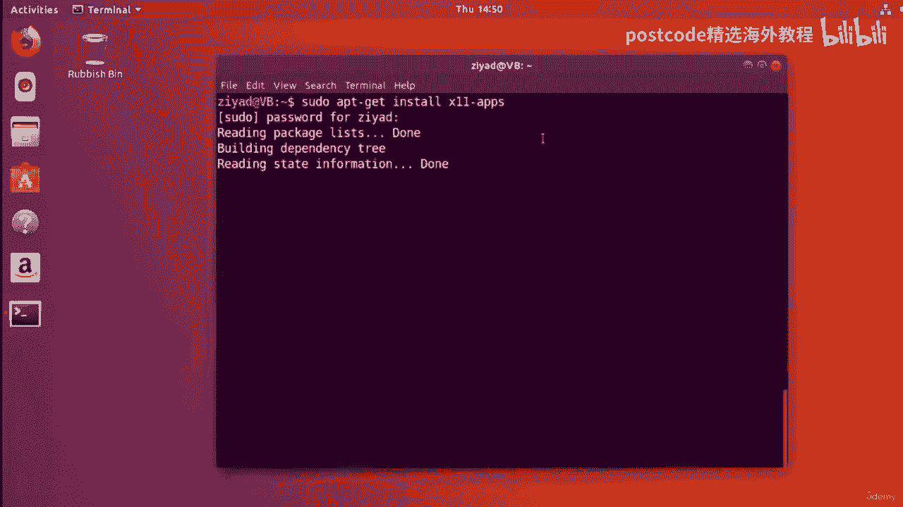
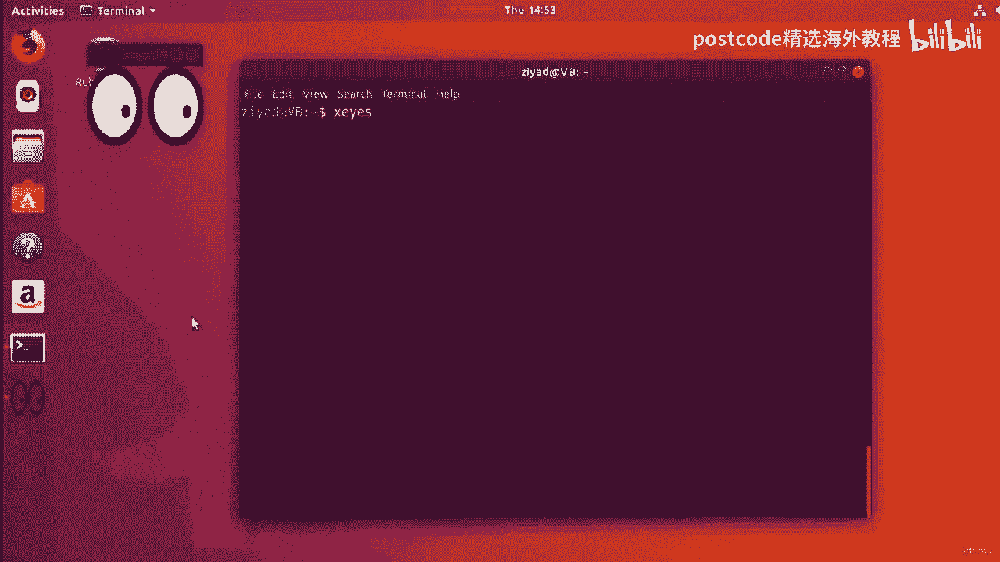
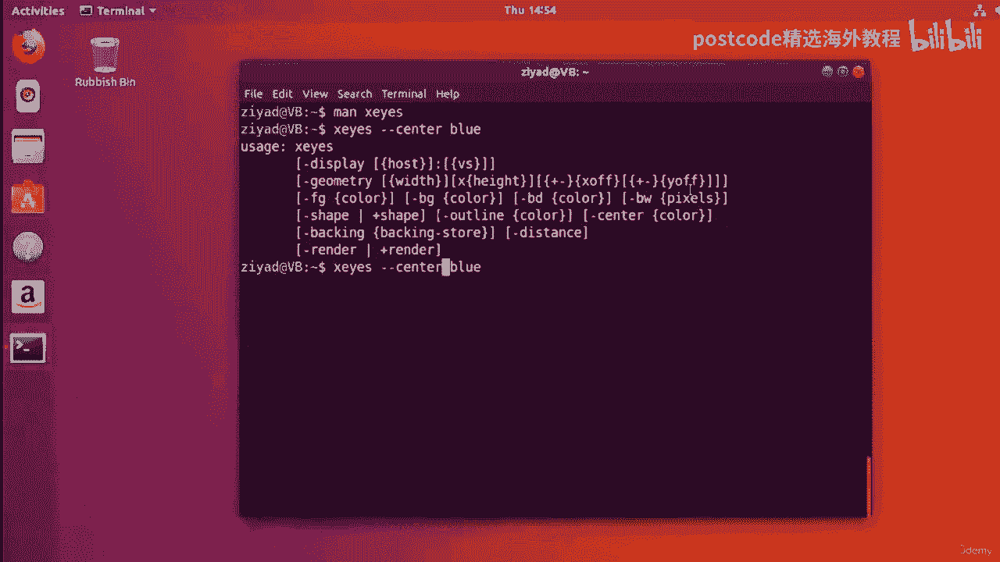
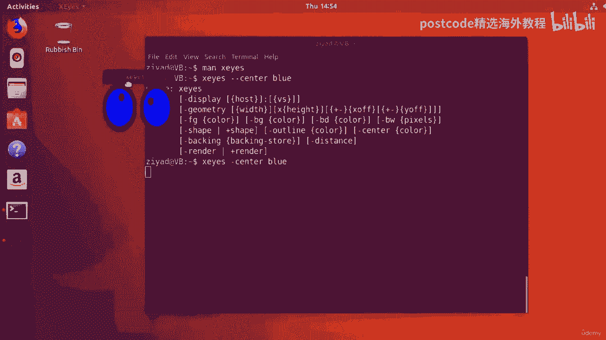
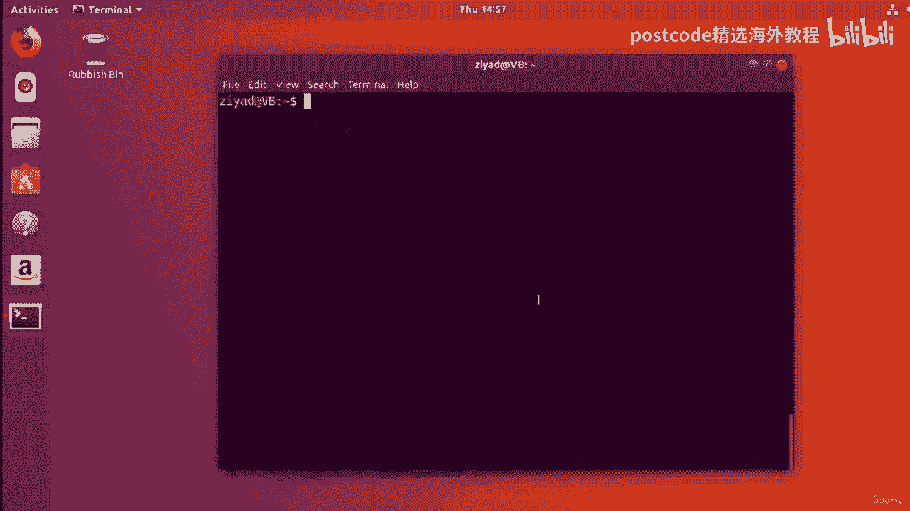
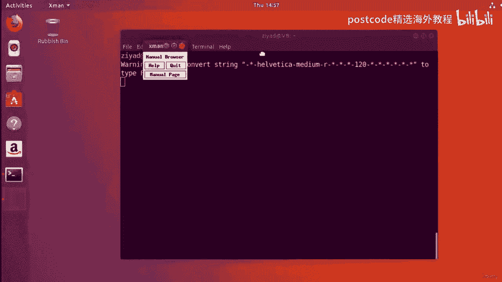
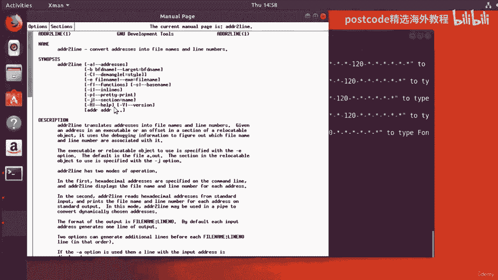
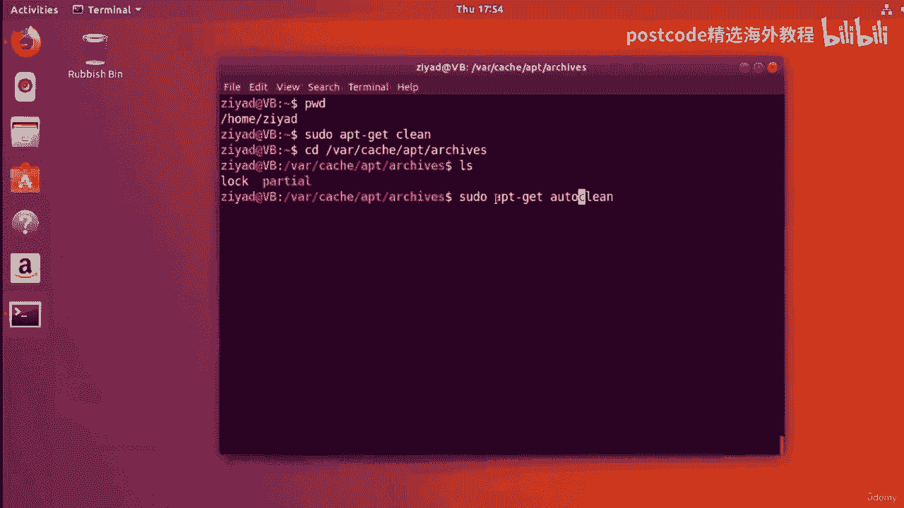

# Linux软件包管理：04-04-020：软件安装与管理 🛠️

在本节课中，我们将要学习Linux系统中软件包管理器的核心工作原理。我们将了解如何更新软件包列表、升级系统软件、搜索和安装新软件，以及如何清理系统以释放空间。通过掌握这些命令，你将能够高效、安全地管理你的Linux系统。

## 缓存列表的来源与更新 🔄

上一节我们介绍了包管理器的基本概念，本节中我们来看看缓存列表是如何工作的。

缓存中的列表最初是从互联网上的服务器下载的。这些服务器由可靠的来源维护，包含所有现有软件包的最新信息。为了使缓存发挥作用，缓存中的文件必须与服务器上的文件保持一致。

GNU/Linux社区拥有数百万贡献者，他们不断为庞大的软件体系添砖加瓦。大量人员为软件仓库和项目做贡献，意味着软件更新非常频繁：错误被修复、安全漏洞被修补、新功能被添加、文档被澄清。有时，程序更新后甚至需要新的依赖关系才能工作。

面对如此多的变化，手动保持系统上所有软件最新并管理所有内容，将是一场噩梦。人为错误的余地太大，需要跟踪的内容也太多。

但幸运的是，你不需要手动完成。包管理器通过使用缓存，确保系统上的所有软件都是完全最新的。其工作原理如下。

你需要做的第一件事是更新你的缓存。为此，你需要运行 `sudo apt-get update` 命令。

**命令示例：**
```bash
sudo apt-get update
```

注意，我们需要在命令开头使用 `sudo`，因为我们要对文件系统中的重要文件进行更改，这需要管理员权限。我们使用 `apt-get` 是因为要从仓库获取数据。`update` 会更新缓存中的列表，确保其中的软件包版本与仓库中的版本相同。

当然，为了让其生效，我们需要连接到互联网。如果你跟着操作，请确保你的网络连接已启用。

运行 `sudo apt-get update` 后，系统会要求输入密码。输入密码并按回车后，系统将从Ubuntu仓库获取大量不同的列表，下载并安装它们，从而更新我们的缓存。这个过程所需时间取决于你上次更新的间隔。更新完成后，我们的缓存将拥有所有软件包及其依赖项的最新信息。

## 升级系统软件 ⬆️

现在我们已经有了最新的缓存，那么如果系统上的某些软件过时了，我们如何将其升级到最新版本呢？这其实非常简单。

要升级系统上所有通过仓库安装的软件，你只需要输入 `sudo apt-get upgrade`。

**命令示例：**
```bash
sudo apt-get upgrade
```

这个命令会遍历所有包列表，检查我们系统上的所有软件，并告诉我们哪些已经过时、需要更新，以及需要安装多少新内容。在请求你确认继续之前，它还会告知需要多少空间等。

确认后，它将自动下载所需的软件包，解压、安装它们，并删除旧版本。整个过程为系统上每一个通过仓库安装的软件自动完成。

这就是使用包管理器的美妙之处：你不必像在Windows或Mac上那样，去每个软件的网站手动下载新的安装程序或检查更新。你只需要运行 `sudo apt-get upgrade`，所有通过仓库安装的软件都将升级到最新版本。这有助于保障系统安全，并让你拥有最新的功能。

你甚至可以使用 `cron` 定期自动安排这些更新任务。

升级过程可能需要一些时间，具体取决于需要更新的软件数量。升级完成后，通常不需要重启系统，所有软件都已准备就绪。

**核心流程总结：**
1.  使用 `sudo apt-get update` 更新软件包列表。
2.  使用 `sudo apt-get upgrade` 升级所有软件。

请注意，你应该总是在执行升级**之前**更新缓存，以确保升级使用的是正确的软件版本，并且所有内容都能统一更新。

## 搜索与安装新软件 🔍

了解了如何更新和升级后，让我们继续学习如何安装一些新软件。

假设我听说了一个叫做 `xeyes` 的程序，它会在屏幕上显示一双跟随鼠标移动的眼睛。我觉得这很有趣，想安装它。

首先，我们需要知道提供 `xeyes` 程序的软件包叫什么。我们可以在缓存中搜索它。



**搜索命令示例：**
```bash
apt-cache search xeyes
```

这会列出每一个与 `xeyes` 相关的包。假设我们看到了一个名为 `x11-apps` 的包，这似乎就是我们听说的。为了获取这个包的详细信息，我们可以运行：

**查看包信息命令示例：**
```bash
apt-cache show x11-apps | less
```

在显示的信息中，描述部分会说明这个包提供了各种X窗口系统应用程序，其中包含 `xeyes` —— 一个演示程序，其中一双眼睛会跟踪指针。这正是我们想要的。



现在我们确信要安装 `x11-apps` 包。安装方法其实很简单：

**安装命令示例：**
```bash
sudo apt-get install x11-apps
```

我们使用 `apt-get install` 让包管理器从互联网获取数据并安装指定的包。输入命令后，系统会要求输入密码。然后，包管理器将继续安装新包及其所需的任何依赖项。如果安装内容较多，它可能会请求你的许可。安装完成后，新软件就可以使用了。

`x11-apps` 是一个预编译包，也称为二进制包。大多数包都是二进制的，这意味着制造软件的代码已经预先编译好了，你不需要进行任何配置、编译 (`make`) 和安装 (`make install`) 的操作。只需从仓库安装包，就完成了。更好的是，系统还将跟踪该包的更新，当有新版本时你可以轻松升级。



现在让我们试用新软件。运行 `xeyes` 命令，屏幕上就会弹出那双有趣的大眼睛，并跟随鼠标移动。



**运行程序命令示例：**
```bash
xeyes
```

最棒的是，你安装的所有软件通常都有自己的手册页。例如，关闭 `xeyes` 后，可以运行 `man xeyes` 来查看其手册页，其中包含程序描述和可用选项。

**查看手册页命令示例：**
```bash
man xeyes
```



从命令行你甚至可以控制程序，例如使用 `--center` 选项改变眼睛瞳孔的颜色，这比图形界面提供了更多的控制能力。



**带参数运行示例：**
```bash
xeyes --center blue
```

`x11-apps` 包中还包含其他软件，例如 `xman`，它是一个用于查看手册页的图形窗口。运行 `xman` 后，会弹出一个窗口，你可以搜索和浏览手册页，这是一种更直观的查看方式。

**运行图形化手册页浏览器：**
```bash
xman
```

通过安装一个软件包（`x11-apps`），我们实际上安装了多个不同的软件。我们不需要进行任何编译或配置，只需确保包列表是最新的，然后运行 `sudo apt-get install <包名>` 即可。我们可以确信安装的是该包的最新版本，所有依赖问题都已解决，甚至无需关心软件包是否适合我们计算机的体系结构（如 i386 或 amd64）。



## 卸载软件与清理系统 🧹

在前几节中，我们一直在使用 `x11-apps` 包作为示例，现在我们将继续用它来学习如何卸载软件。

在Ubuntu中卸载软件包，最基本的方法是键入 `sudo apt-get remove` 后跟包名。

**基本卸载命令示例：**
```bash
sudo apt-get remove x11-apps
```

但这并不是最好的方法。原因是当你安装包时，有时包会附带配置文件。如果使用 `sudo apt-get remove` 移除包，配置文件会留在系统上，占用空间却不起作用。虽然这在你以后重新安装包时可能有用（可以保留设置），但仍不是最佳做法。

要删除一个包及其所有配置文件，我们应该使用 `sudo apt-get purge`。

**彻底卸载命令示例：**
```bash
sudo apt-get purge x11-apps
```

`purge` 会删除软件包及其配置文件。因此，每当要卸载软件包时，请务必考虑使用 `purge`。

有时，当你安装一个软件包时，可能需要安装十个甚至上百个其他软件包作为依赖项，才能使这个包正常工作。如果这些依赖项不再被系统上的任何其他包需要，我们称其为“悬空依赖”。你不知道它们具体叫什么，该如何移除呢？

你可以使用 `sudo apt-get autoremove` 命令自动删除这些不再需要的悬空依赖项，这有助于节省系统空间。

**自动删除悬空依赖命令示例：**
```bash
sudo apt-get autoremove
```

## 清理软件包缓存以释放空间 💾

无论何时下载并安装软件包，包的副本都会保存在计算机本地。安装时，软件包会先作为压缩存档下载，然后解压并安装到系统上。因此，系统上不仅安装了软件，还保存了它的压缩版本。

这些压缩文件通常占用空间，并且在软件安装后并非必需。它们就像包装纸一样。删除这些存档可以为你节省大量空间，甚至可能达到数GB。

这些存档存放在 `/var/cache/apt/archives/` 目录中。你可以使用 `ls -lh` 命令查看它们的大小。

**查看缓存目录命令示例：**
```bash
ls -lh /var/cache/apt/archives/
```

你不需要进入该目录手动删除文件。只需运行 `sudo apt-get clean` 命令，即可从该目录中删除所有已下载的软件包存档（`.deb` 文件）。

**清理所有软件包缓存命令示例：**
```bash
sudo apt-get clean
```

有时，你可能不想删除所有存档，而只想清理那些无法再从Ubuntu仓库下载的、非常陈旧的包存档（例如在多年未更新的老系统上）。为此，你可以使用 `sudo apt-get autoclean` 命令。

**自动清理旧缓存命令示例：**
```bash
sudo apt-get autoclean
```

`autoclean` 会检查缓存，并只删除那些你无法再从仓库下载的软件包存档。这与清理列表缓存（`apt-get update` 相关的缓存）完全不同，列表缓存是存储包列表信息的空间，而 `archives` 缓存是存储软件包存档本身的地方。

---



本节课中我们一起学习了Linux软件包管理的核心操作。我们了解了缓存的工作原理，学会了使用 `sudo apt-get update` 更新列表，使用 `sudo apt-get upgrade` 升级系统。我们掌握了如何通过 `apt-cache search` 和 `apt-cache show` 来查找软件包信息，并使用 `sudo apt-get install` 进行安装。最后，我们学习了使用 `purge` 彻底卸载软件，用 `autoremove` 清理悬空依赖，以及用 `clean` 和 `autoclean` 管理软件包缓存以释放磁盘空间。掌握这些技能将使你能够高效、自动化地维护Linux系统的软件生态。