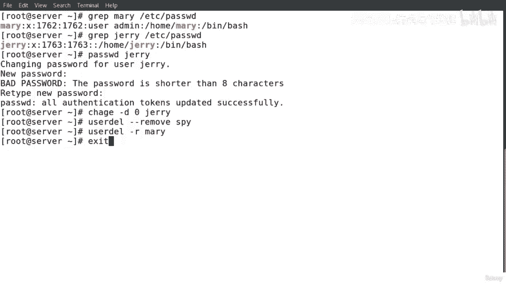
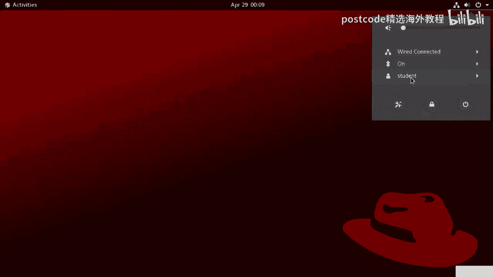
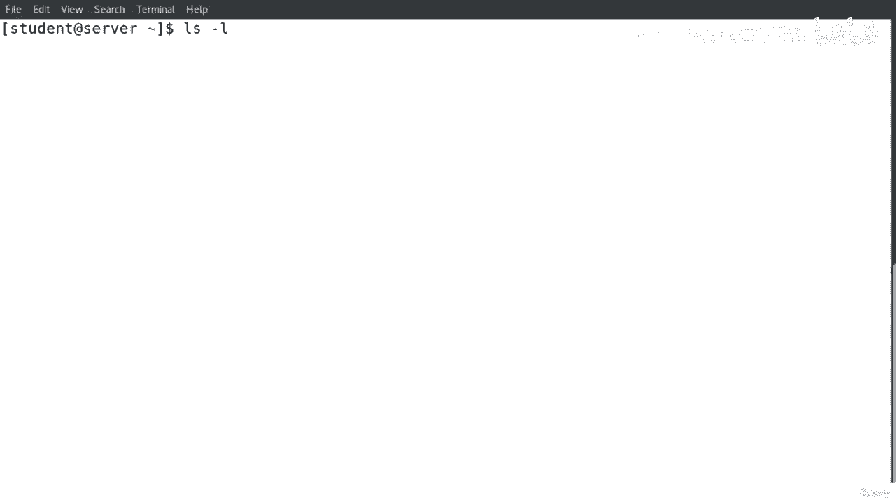
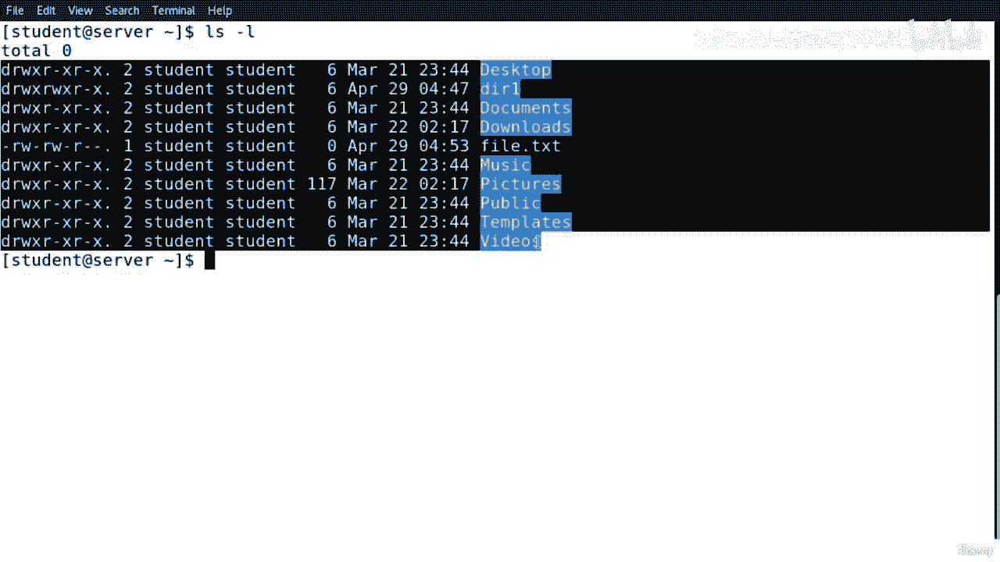
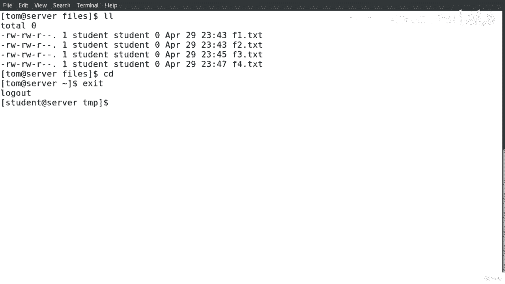

# 红帽企业Linux RHEL 9精通课程 — RHCSA与RHCE 2023认证全指南 - P45：04-04-021 Manage users and groups - 精选海外教程postcode - BV1j64y1j7Zg

大家好。本课我将向您展示如何创建用户层次结构（如果用户是 Linux）。另外，我将向您展示密码更改和用户命令。正如我们在幻灯片中看到的，为了创建一个新用户，我们运行以下命令，用户添加选项和用户名。

如果我们想列出所有用户并显示系统中的用户，我们可以运行该命令。LS 冲刺 l 斜线。以下是使用不同选项创建新用户的示例。正如我们在这里看到的，这是用户添加的命令。那么我们有四个选择。

正如我们在这里看到的，我们有破折号视图。所以破折号就是用户 ID。如果我们想为用户分配一个用户 ID，我们输入命令，破折号然后数字，如果您想向用户 Jerry 添加 shell，我们输入 dash s。

然后输入 pin 斜杠徽章。如果我们想添加到期日期，我们运行破折号 E，如果我们想添加任何评论，用户区域，我们输入破折号 C。所以选项，正如我在这个例子中提到的，有很多选项我们可以找到这些选项。

在用户的主页中。添加此处执行一些选项，因为我们可以在之前将它们写为短符号或长符号，用户名。正如我们在幻灯片中看到的，我们有 Linux 用户的层次结构。所以当我们创建一个新用户时。

该用户的目录就位于斜杠home下面。所以斜杠是根目录，我们认为斜杠是 home 的父目录，而 home 是 home 的父目录。目录的父目录。汤姆和汤姆在他的目录下、下、下有很多文件。

我们可以看到这里是目录。这样我们的home目录下就有了桌面文档、下载等。所以当，当，当我们创建一个新文件或创建一个新目录时，所有这些文件和目录，位于斜杠 home 下，每当我们创建新用户时。

这都适用于所有用户。好的。因此，如果我们想在创建用户后为用户分配密码，我们需要分配密码。我们做什么就做什么。因此，我们应用以下可能在用户名中执行的命令。如果我们还想分配一个新密码或者您想更改用户的密码。

我们运行这个命令。因此，为了列出有关用户甚至密码的详细信息，我们可以运行命令，cat斜线 Etsy斜线通行证。因此，如果我们想列出有关更改用户密码到期信息的信息，我们可以，运行命令更改，然后是选项。

然后是用户名。例如，他更改了 Dash L 和用户 Mary。如果我们想强制用户在下一个口号中更改密码，我们运行命令，更改，然后是选项破折号 D，然后是数字零，然后是用户名。如果我们想从系统中删除用户。

我们运行命令 user、delete 和选项，和用户名。这是一个很好的做法。如果我们想要删除一个用户帐户并且我们想要删除该用户帐户的所有相关文件，选项中的用户帐户。

短旋转、破折号 ah 或破折号破折号删除都可以看到，它。一个示例想要删除用户 jerry，因此用户 dell dash 确实是用户 dell dash dash 删除然后，用户名共享。

我们的会议到此结束。谢谢大家，我们下节课再见。在这个演示中，我将向您展示如何创建用户以及如何删除用户。首先，我们检查一下系统上有多少用户？我将运行命令 ls dash llash home。

正如我们在这里看到的，到目前为止我们只有一个用户。让我们以 root 用户身份登录来创建用户。我们使用命令 user add 来创建用户。如果我们想获取更多信息，可以运行命令 man user act。

我们可以获得主页，并且可以获得有关此命令的所有详细信息和信息。我们回去吧。让我们创建第一个用户，我将分配一个 ID。我们将此 ID 视为四位数字。任何您想选择的数字。我们将其视为用户的员工 ID。

我们还将添加评论用户管理员。好的。我们将称该用户为玛丽。让我们创建第二个用户。第二个用户。我们可以为该用户分配一个 shell 完美的 bash，我们将称之为 Jerry 并创建，第三个用户。

我们可以为其分配到期日期 12 零 1，我们将再次将其称为 Tom Perfect，分配的。我们将创建最后一个。我不会向该用户分配任何选项。我们称其为“完美间谍”。有一个命令。

我们可以列出有关用户 cat base WD 的信息，以便我们可以在文件末尾检查该文件。我们可以看到这里是关于用户的所有信息，关于所有用户和所有用户，这里，而是我们创建的所有用户。

如果我们只想获取特定组、有关某个用户的良好信息，例如此处，这是线索，所以如果我们想要伪造的话，我们可以做同样的事情。很好的 Etsy bash WD，所以我们获得了有关您的信息。

现在让我们创建一个密码给 Jerry。好的。一、二、三、一、二、三。同时，我将强制 Jerry 在第一次登录时更改密码。杰瑞 完美。所以它改变了边缘。这就是选项破折号d大于零的话。

所以我们要强迫杰瑞更改第一个口号中的密码。完美的。现在让我们开始吧。好的，继续执行下一个命令。用户戴尔。所以用户戴尔删除系统中的用户也是最好的做法，以便删除所有，对于任何用户的文件和相关文件。

我们使用选项破折号 r。所以所有这些都是一个简短的符号，我们也许可以像这样使用破折号三删除。这是长符号。例如，如果您想使用简短的表示法，在这里，我们选择 Mary 和已删除的用户 Mary。

现在让我们检查一下我要退出的最后一件事。

看看我们的路线，杰瑞。

好的，杰里，现在，我们记得我们运行命令更改灰仪表板，然后为零，然后是用户名。我们将输入当前用户，然后系统现在将要求我们输入新密码。完美的。我们以用户身份查看。这就是本演示的内容。

谢谢。下一课见。大家好。在本课中，我将向您展示如何添加组以及如何将用户添加到组和修改用户，属性。另外，我将解释主要组和次要组之间的区别。最后，我将向您展示如何删除群组。正如我们在幻灯片中看到的。

如果您想创建一个新组，我们运行以下命令，组，添加选项，我们可以找到所有选项以及用户添加和组的主页，姓名。如果我们想列出系统中的所有组，我们可以运行命令 cat斜线 Etsy斜线组。

我们可以形成有关该组的更多详细信息。这里有一些例子。这是 Dashi 2020 Network 上的一个示例组。因此，如果您想为该组分配一个组 ID，我们可以运行短划线，符号或长旋转破折号酸。

我们可以创建一个没有if的组并分配一个组ID，这样系统会自动分配一个随机的组，ID。因此，在这张幻灯片中，我们可以看到命令用户模式，然后是选项，然后是组名称，然后是用户名。那么什么是用户模式呢？

所以在用户模式下，如果我们想将用户添加到特定组，那么我们运行这个命令。所以我们运行用户模式，然后是选项，然后是组名，然后是用户名。我们还可以通过运行命令用户模式选项比用户来修改用户的属性，姓名。

在用户模式的主页中我们可以找到很多选项。例如，破折号 a 是一个带，破折号是组，破折号 l 大写 L 所以这就是，log dash 大写 u 这是一个锁定的破折号，可以看到评论。让我们解释更多的例子。

让我们扩展一个或多个有关这些选项的示例。例如，首先我们想知道用户 Jeri up 属于多少个组。所以我们运行命令 ID Jeri，然后它会进入系统，为我们列出所有组。然后。

如果我们想将 Jeri 添加到这两个组，我们在 Dash A 中运行命令用户模式，所以我们要像她一样添加，她是这是组，所以我们的这两个命令，将它们全部运行在一起。

这意味着我们想将其分配给组或喜欢将 Jeri 分配给这两个组的人，作为次要群体。如果我们要使用选项破折号小写 g 运行命令用户模式，则意味着我们想要，为 Jeri 分配一个主要组。

所以这是大写破折号 G 和小写破折号 g 之间的区别。因此，如果我们只想分配一个主要组，那么我们就分配破折号。如果我们想分配次要组来使用每个区域，我们可以分配破折号 a，然后分配大写破折号 g。

所以初级组和次级组之间的区别。每个用户都有一个主要组。但是，我们可以将许多次要组和迷你组分配给用户。正如我们在这里看到的，该命令解释了前面的示例。因此，破折号小写 g，然后是组名称，然后是用户名。因此。

如果您想分配次要组，那么有多少个组并不重要，要分配给用户名，我们运行命令或输入命令破折号八然后大写，短跑。这是一个示例用户模式，然后只需破折号小写 g 网络，然后是 Jerry，然后是用户模式。

对于第二组，我们想将这两个组分配给杰里。所以我们希望杰瑞成为这两个小组的成员。破折号 a，然后是大写破折号。所以在这里。Jerry 那么，当我们运行命令时，我会输入用户名，例如。嘿杰瑞。

它将为我们保存所有用户组和信息。Jerry 如果我们想删除一个组，我们运行以下命令组深入研究选项，然后，团队名字。因此，如果我们想在删除后列出组并确保删除该组，我们。

只需运行命令 cat search ETSI斜杠组，然后管道组开发人员示例如何删除，一个小组。我们只需设置一个简单、直接的命令。所以组删除然后组的名称。如果想找到有关组的更多信息。

我们运行命令 man group 然后我们，可以找到有关此命令的更多信息以及选项和其他详细信息。好的谢谢。这就是我们的课程，我们下一课再见。大家好。在此演示中。

我将向您展示如何创建组以及如何将用户添加到组以及如何，删除组。首先，让我们以 root 用户身份登录。然后我想检查他们在系统上有多少用户。我将运行命令 ls dash llash home。

我们有三个用户。杰瑞的学生汤姆。现在我想检查 Jerry 所在的组。所以在这里你可以看到 ID 命令显示了用户的用户 ID。杰瑞 1763。然后我们为杰瑞设立了一个主要小组。

Jerry 然后我们为用户 Jerry 建立了一个辅助组。杰瑞。让我们继续讨论下一个用户，Tom。这是用户 ID，我们有主要组。我们只有一组，第二组我们也有一组。让我们继续讨论下一个用户。学生。

我们有用户 ID，正如我们在这里看到的，1000。然后我们有主要组学生，然后我们有两个用于用户学生的次要组。每当我们创建一个新用户时，系统会自动为每个用户生成或创建一个组名，用户 和 将具有相同的名称。

例如，这里的学生我们有一个学生，我们有汤姆和汤姆。然后是杰瑞，然后是杰瑞。在我们创建组之后，我将向您展示如何更改主要组以及，如何将新组添加到辅助组（第一个最后创建的组）中。因此，为了创建一个组。

我们运行命令组，然后我将为此分配一个 ID，团体，例如。这就是我们要分配的想法。然后组的名称将是数据库。好的。现在我们要创建第二个第二组。我现在要使用选项、长限制、长符号。

我们在前面的示例中使用简短的表示法。现在我们要在这里做长符号。所以我们会是gg ID。我将为 G 和 Linux 提供一个随机数。它已经存在了。所以我们要改变它的真实存在。

所以我们要把地球ID改成Perfect。现在我们将创建一个没有选项的新组。我将把这个称为网络。好的。我们将创建一个新的。我将其称为 WEP。现在，如果我们想显示一个列表，我们应该列出系统中的所有组。

我们应该这样做，cat斜线，Etsy斜线组。我们将列出系统中的所有组。如果我只想获取我们系统中的特定组，例如这里的数据库斜线 Etsy，斜杠 grep。完美的。我们将为 Linux 做同样的事情。

我们将对网络执行相同的操作，以确保我们拥有系统中的所有房间，我现在拥有的。是的。完美的。现在。好的。现在，你要做什么？我们将在用户模式下运行命令。因此，让我们了解更多关于用户的信息，而不是主页。因此。

请使用它们或修改用户帐户。那么我们要做什么？我们将分配一个主要组。我们将更改主要组，因为我们无法分配多个主要组。因此，我们可以分配多个次要组。这是选项。所以这里减去了一个带，我们这里有 G。

如果我们想分配，您也可以使用它，组的 ID，或者我们也可以将其分配给主要组。我们想要改变它。这里是大写 G 或我们的大写 G，这是第二组的。让我们回到主屏幕用户模式。现在我看着。好的。首先。

在使用用户模式之前，我要进行 ID 操作。汤姆可以去检查一下。所以我们这里有汤姆的主要组和汤姆的次要组。那么我会做什么。用户用户模式破折号这个到一个乐队，这是第二组，我们将分配两个，适合汤姆的团体。

我们会做什么？ID Tom 可以注意到我们没有对主要组做任何事情。但是，我们在此处将其添加到组中。我可以看到我们以前只有一个中学组，现在我们增加了两所中学。这里有两个组，我们现在将它们添加到辅助组中。

如果我想更改用户，请继续，用户模式。如果您想将任何组添加到次要方或国家/地区组，请注意此处，我们，对乐队使用 Dash A，对主要组使用 Dash G。是的，我们使用小写的g，所以有G。

那么我们就说web，然后。所以用户模式，然后是选项，然后是组的名称，然后是用户的名称。完美的。现在看 ID，汤姆。以及你所看到的。我们更改了用户主要组的内容。好的。我们删除吧。

我想在这里向你们展示一些东西。这有点好笑。比如，如果你想删除主组，系统将不允许你删除参数，团体。所以，嘿，看看您是否要删除主要组。但我的意思是这里的主要组，用户的主要组，我们已经少了这个组，如果你。

想要删除任何组或说组删除。所以组Del，那么组的名字就会是web，但是系统不会允许我们删除web，因为 web 已被指定为主要组。如果用户破坏，系统将否认 C 无法删除主要组。

那么我们要做的就是改变用户模式。G会改变它。给汤姆。又对汤姆说。完美的。C id 汤姆。现在，如果您想删除一个组。完美的鞭子。现在。现在系统将允许我们删除该组。让我们删除另一组。例如。

让我们删除 Linux。完美的。这就是本演示的内容。谢谢。下一课再见。大家好。这节课，我将讨论文件所有权和权限。正如我们在图中看到的，这里的第一个数字代表文件的类型，我们有，D，D是目录。

如果我们有破折号，则这代表一个文本文件。但在我们的示例中，我们有 D，它是目录。然后接下来的三位数字我们拥有所有者许可。所以我们有读、写和执行。接下来的三位数字是我们拥有组权限的。我们只有读者的权利。

我们没有执行权限。第三个我们拥有另一个，我们有读取和执行权限，但我们没有，正确的许可。第二，这里我们有链接的数量，Tom 是这棵树的所有者，Linux 是，该组或者是静态树的所有者组。这是目录的大小。

这是我们创建该目录的日期，这是该目录的名称。所以它们是，它们是许多不同类型的文件和 Linux。正如我们在前面的示例中所解释的，我们有 D（目录）和 DASH（，是一个文本文件。

我们这里有设备文件和块等。因此，了解 L 代表的符号链接也非常重要。因此，在 Linux 中，我们有权限集，这些权限代表每个文件或每个目录，我们在系统中创建的。例如，他拥有我们拥有的权限系统。

我们拥有读取、写入和执行的权限。所以读代表或字符的符号。通过我们的承保，我们拥有 W 并执行，我们拥有 X 和我们非常重要的价值，了解每个权限的价值。例如，R 和权限值是数字四和。正确的。

以及许可的价值。的许可。正确的。这是真的。并执行。这里我们有第一个值。因此，如果我们没有任何权限或喜欢文件上的任何内容，那么它会由破折号和，值为零。看这里。这是一个例子。我们有第四名。

正如我们在前面的示例中所解释的，我们拥有读取权限，并且我们拥有两个权限，正确的许可和X，这是借口。我们有值，它是一，如果没有许可，它是零。当我们将权限集分配给目录时，了解其中的差异非常重要。

或者我们想要访问的文件。一个目录并且这个目录有权限。当我们运行命令时，我们可以查看目录内容的列表。LS 如果我们想要访问一个文件并且我们有正确的权限，我们可以复制该文件并查看，文件的内容。

如果我们有正确的权限，如果我们想访问目录，我们可以移动文件，重命名，创建和删除目录内容。对于文件。我们可以修改文件的内容。如果我们有访问该文件的执行权限，我们可以运行 CD 命令来访问该文件，目录。

如果我们有访问该文件的执行权限，我们就可以围绕该文件执行。例如，shell 或 bash 脚本。为了运行我们需要的文件，我们需要读取权限。并执行权限。这是针对 bash 和脚本文件的。正如我们之前所说。

如果没有许可或有法令，我们必须向，我们的会议就此结束。谢谢您，下一课再见。大家好。在本课中，我将讨论权限级别。Linux 中的权限级别分为三种类型。

我们有用户组和其他我们可以用简短的、简短的符号或字符来表示他们。所以用户你组 G 和其他所以详细信息在这里。因此，只要我们愿意，每当用户创建目录或文件时，用户就将成为该目录或文件的所有者，该目录或文件。

组是一组具有访问和共享目录的权限和权限的用户的集合，或其中的文件以及其他所有非所有者和组的其他用户，我们可以，认为这是系统上的公共用户。所以我在这张图中看到了权限级别。所以这里的前三位。

我们可以认为它是所有者或者用户的权限。接下来我们考虑的三个是组权限，最后一个我们考虑其他权限。这里是权限值的总和。因此，underwrite 的权限值为 2，execute 的值为 1。

而如果没有许可则为零。所以这里所有者或用户权限的总和是七。所以我们将所有这些数字相加，然后得到总数。所以这里用户有完整的权限读、写、执行。所以组，这里的组你可以看到该组只有读权限和执行权限。

正如我们所看到的，这里的总和是五，您可以查看以获得正确的许可。我们没有任何正确的许可。所以该值为零。最后三位数字。我们有其他许可。我们刚刚读取了一个执行，总数将是五个。

正如我们在上一张幻灯片中所解释的那样，这是权限级别的示例。这是这个文本文件。所以第一个问题就是用DX来表示文件的类型和目录。所以破折号是文本文件，它将是目录。所以前三位数字将是用户权限。

接下来的三位数字是组，最后三位数字是其他权限。谢谢。我们的课程就到此结束，我们下一课再见。大家好。这节课，我将讨论权限模式，并且我将讨论如何，我们可以更改和修改权限状态。正如我们在此表中看到的。

我们必须添加、删除和相等三种权限模式。这里有一些例子。例如，如果您想向用户添加或分配权限，您加 w，这样我们，想要为用户分配正确的权限，您可以看到第二个示例。因此，G 加 RS。

我们希望将正确的权限分配给组等等。因此，每当我们想向任一用户组分配任何权限时，如果另一个用户组我们使用，另外，删除是显而易见的，如果我们想删除用户组或其他用户的任何权限，我们使用减号。例如。

这里减去 r x 。所以我们想删除用户的读取和执行权限。如果我们想像一个整体一样分配我们可以的。这是一种不同的方式。它有点类似于 ADD，但它是一种不同的方式，如果愿意的话，也许可能是最简单的方式。

例如，喜欢分配多个权限，您加上抱歉，您等于 RW X。因此，如果我们愿意，我们想为用户分配三个权限，这里也可以分配三个权限。例如，他有所有加或等于减或不表示这个。所以都等于负。

这意味着我想删除对方的所有权限。在幻灯片中，我们想要修改权限集，因此修改它并更改的命令，或删除信息集或直接您的文件，我们运行命令更改模式，然后权限，和文件名，这里的名称很好，所以它可以是目录或文件。

例如，这里我们有更改模式。你等于 RW X 并说我们必须使用逗号，g 加或 x 然后逗号或减 w，x 和目录。所以在这里我们可以，我们可以称这个为符号尺寸。

这意味着我们使用这个重要的大小来为文件目录分配权限。如果你能在这里看到的话，他绝对是有价值的。所以我们可以改变模式，我们可以使用直接号码来分配这个号码或权限给，文件。所以如果你可以看到这里，那么第一个。

这里的第一个数字代表用户就是用户，有权WX或WX为读、写、执行，共7个。我们可以看到这里第二个是零，这意味着该组没有任何权限，而另一个也没有任何许可。这是这个表中的吗？正如我们在幻灯片中看到的。

这可以表示符号和绝对值。那么这里比如说，所以正确的读取和执行这是正确的，所以，所以读取，写入和执行。所以读的是四，写这两个，执行这一个。所以你可以在这里看到 RW X ，绝对值为 7，我们继续。

我们可以在这里做同样的事情，例子，对吗？所以正确的是四个。这意味着这是 R 和零零。那么绝对值将是四。如果我们不想向用户授予任何权限，您可以在表格末尾看到这里，组及其他。所以我们只要给出负、负、负。

绝对值就会为零。我们的会议就此结束。谢谢您，下一课见。大家好。听着。我将讨论如何更改所有权和组成员身份以进行更改，文件所有者以及用户组。我们运行以下命令。因此，如果您只想更改文件所有者。

我们可以在更改所有者上运行命令更改，然后是用户名，然后是文件或目录的名称。如果我们想更改用户名和组名，我们运行以下命令，更改所有者，然后是用户名冒号，然后是组名，然后是空格，然后是文件，然后是。

文件和目录的名称。因此，在此命令中我们可以更改用户名和组。但是，如果我们只想更改组所有权，我们可以运行以下命令来更改，group，即change group，然后是组名，然后是文件，文件名和目录。好的。

让我们看一些例子。例如，让我们更改目录示例的所有者，如下所示，示例更改，所有者，然后是 Jerry，然后是目录的名称。因此，在此示例中，我们只想更改文件或目录的所有者。在此示例中。

我们要更改此目录示例的用户名和组名称。因此，我们在 Tom Colon 网络上运行命令更改。这是组的名称，然后是目录的名称。因此，对于组更改组，我们无法应用此命令来更改文件所有者。

我们只能围绕这个命令应用这个命令。如果我们想更改组的名称，例如更改组，则组的名称，然后是目录的名称。所以我们有 Linux，那么目录的名称是 Home Work 确实结束了我们的会话。谢谢您。

下一课再见。大家好。在此演示中，我将向您展示如何更改文件所有权和权限。另外，我将向您展示如何更改所有权和组成员身份。首先，让我们运行命令 ls dash l 以列出所有文件和目录。

例如，亲爱的，我们这里有目录。

如何做。他们怎么知道这是一个目录？因为这里的第一个数字。那么d代表目录那么这里接下来的三位数字是什么呢？这是用户或我们认为其用户或所有者的权限。所以我们有读、写、执行，这里也有读、写、执行。这是组权限。

所以这里的前三位数字是所有者权限，这是组，这里是接下来的三个权限，这里是其他权限。所以其他权限我们有读取和执行的数量来表示链接字符串的数量，对于此文件，学生代表创建此目录的所有者或用户，而学生在这里是。

用户的主要组或其所有权。然后我们有大小，文件或目录的大小，然后我们这里有日期，然后，目录的名称。让我们看看这个例子，我们有文件，即文本。你怎么知道这是一个文件。文本文件，因为这里的第一个数字是破折号。

所以破折号代表文本文件并且是相同的东西。这里我们有前三位数字。这是针对用户或所有者权限组的权限，这里针对下三项。然后我们必须添加权限。好的，现在让我们做一些例子。以便更改文件权限。为了更改文件权限。

我们需要运行命令更改模式。改变什么？如何？如果您想了解有关更改模式的更多信息和详细信息，请访问主页并，我们可以找到有关此命令的更多信息。它正在改变文件模式位。让我们回到屏幕。所以现在我要做的。

首先让我们做一个列表 dash lddr1 完美，正如我们在这里看到的那样。所以我们有读、写、执行、读、写、执行。我们已经阅读并执行了。我先去改变一下。我要改变。我要删除我要删除用户的执行权限。

那么如何重写你然后减去 X，然后减去逗号。然后我也想删除。明年获得集团的正确许可。所以我要删除正确的权限。直流电同样的事情。所以减去 w 然后逗号然后我想删除其他人的执行权限。这是查看这三个权限。因此。

当全部减 x 时，我将键入目录的名称。完美的。现在让我们开始吧。这引起了这里的注意。所以我们已经删除了这里用户的执行权限，并且删除了正确的位置，对于该组，我们删除了另一个组的执行权限。我们再举一个例子。

改变模式以及这个和这个。我会。好吧，让我们来做这个例子。所以你会是plus，我要做plus plus X。所以我这里要添加execute执行权限。对于小组，我要补充一点。对方的正确许可。

我将添加正确的权限，然后添加该权限。完美的。我们开始做吧。斜线 LD 或完美。我们可以在这里看到我们做了什么。我们给用户添加了执行权限，给组添加了正确的权限，对吧，给对方的许可。还有另一种方法。

所以我们这里有一个文本文件。让我们看看文本文件，文件是完美的。所以这个文本文件，我要做什么，我要给他们我要给予完全许可，到用户和组以及其他我将如何更改模式。因此，七将代表这里的前三位数字。

所以数量是这样的，所以正确权限的值为四和正确权限。因此，权限是为了获得正确的权限并执行它。所以总数将是七个。所以我们这里会有第七个，我也会在这里给出第七个，这是同样的事情，这里是什么。

4到6并且在执行权限下是1。对于最后一个，我们已经有第四个了。所以我要做的就是把它改为四个。我要把它改成第二名。所以第二点就是这里的正确权限文件。好的。五、六、五。完美的。我们开始做吧。然后是文件名。

完美的。可以注意这里。我已经读、写、执行、读、写、执行。所以这是七、七和最后一个，另一个许可，因为我们给出了第二个和第二个，两个代表正确的许可。我们再做一个吧。我们会做五、六、一。我们可以猜测。好的。

我们会做的。好的。所以我们会是五、六一。那么第一个将被写入、执行，第二个将是什么？让我们开始吧，我将在这里阅读它。让我们看看这里。文件执行。所以我们有四五。抱歉，我们已经工作了。

正确和执行因此正确的权限为执行一。那么六点我们就有读者权利了。然后最后一个可以看到这里我们只有一个。所以这是一个执行。不。清除并返回到目录。这里，那里。现在我想做的就是改变所有权。

我们来看看我们这里的系统有多少用户？到目前为止，我们有杰瑞和汤姆。所以我想把这个改成杰瑞。首先，我要做什么，我要运行 sudo 命令，或者让我们转移到，让我们先以 root 用户身份登录。

这将是一个最佳实践，然后我们将进行 CD，然后我们去家里，然后我们将去见学生。完美的。然后让我们在这里列出所有文件。完美。现在我们要做什么？我将更改该文件的文件所有权。LD完美。我想把学生换成汤姆。

我们将如何做。我将根据命令运行更改。所以这个改变，如果你想了解更多关于这个命令的信息，你去主页。您说更改所有权变更，我们也会做同样的事情。让我们先为小组做一下。现在更改该文件的所有内容。

我要先输入 Tom，然后输入文件名。完美的。然后 ls dash ld 然后是文件名。完美的。我们可以看到这里，汤姆。现在我想改变我想要的。更改组。这是这个的主要组。我们要怎么做呢？我还可以。

我可以使用零钱。更换所有者。我会做。这次我就去做。然后是科林。那我就去组团了。汤姆。或许。我们来做个鞭子吧。不知道我有没有鞭子。例如，让我们检查一下我是否有鞭子。这是一个抓地力。Whip。

然后是 cat 和 Etsy 集团。好的，完美。不，我没有这个。让我们检查一下我是否有 Linux。明年我也没有了。我确信他们有完美的网络。所以我要改变我的改变或改变。那我就来做杰瑞吧。然后打电话给他。

然后我要把它改成网络。然后是目录的名称。完美的。并斜线L。然后是 R。人们可以在这里看到。换主人和傻瓜。因此，如果我只想改变什么，我只想改变团队。还有另一个命令。这称为更改 grep。所以改变grep。

只需更改目录的组或主要组。所以我们会说，例如，我要把你改为 Jerry，目录的名称将是，还有杰瑞。所以让我们先 ld 目录名。完美的。正如我们在这里看到的，我们有杰瑞和杰瑞，如果我们愿意。

我们可以做同样的事情。让我们转到文本文件。完美的。所以这个文件，让我们这么说吧。如果我想改变的话。改变。例如，我将更改为 Tom，并将更改为数据库。这是文件。完美的是旧文件。正如您在这里看到的。

我们将所有者更改为 Tom，从 Sterling 更改为 Tom。然后呢？我们将组从学生更改为数据库。我们的会议到此结束。谢谢您，下一课见。大家好。在本课中，我将讨论 u-mask。

那么什么是U型面膜呢？U 掩码是文件和目录的默认权限值。当用户想要创建一个新的文件或目录时，系统、操作系统会，为该文件和目录分配不同的权限值。u-mask 是四位数字。

例如U-MASK和Linux操作系统的默认值。是0022。所以第一个数字，用于设置用户ID、IT、组ID和清酒的特殊权限，它的。我们将在下一课中讨论它。第二个数字零是为用户设置的权限。

第三位数字2是组的设置权限。四位数字二是为另一个设置的权限。因此，为了显示系统的默认视图掩码，我们运行以下命令 u mask。它将向我们展示并显示默认掩码。如果我们想以简单的符号显示掩码。

我们可以运行命令 you mask dash。大写是如果我们想更改操作系统中的默认色调蒙版，我们运行以下命令，命令是 u mask 0026。了解路由的默认掩码以及默认值和路由的默认值非常重要。

用户的默认掩码值。因此，根用户的默认掩码值为 0022，用户的默认掩码值为 0002。所以我们需要知道什么时候创建文件和目录的重要概念，以 root 用户身份登录或以普通用户身份登录。

让我们看看创建目录或文件时如何计算 u-mask。所以。那么如果我们想创建一个新目录，你会为默认权限做什么呢？所以我们然后减去 u-mask。这里使用默认值。所以默认值是七、七、七。

就是七、七、七减去 U-MASK。我们想要创建一个文件，所以我们将计算它六、六、六减去 U-MASK。因此，每当我们想要创建目录或文件时，我们都需要知道这一点。所以我们在这里看看，只是默认值。

以下是如何计算 u 掩码的默认权限的示例。这里以路线为例。所以我们已经说了root用户，use用户的默认色调掩码是0022。那么在这种情况下，默认目录是什么呢？所以七，七，七-0二二。

所以我们会得到七个，五个，五个。如果我们想在 root 用户下创建一个新文件，这样我们就减去 6， 6， 6 怎么样？和022，我们将得到结果是644。但根源是用户。正如我们所说并提到的。

默认值是 0002。所以我们会做同样的事情，我们将得到目录的默认值是 777 -0 零二，我们，如果我们想在下面创建一个光纤任务，请获得七、五、五以及文件权限，订单用户，我们会的。你知道。

计算结果是六、六、六-0零二，结果是664。好吧，让我们在这里展示另一个例子。首先，我们将 u-mask 值更改并设置为 0026。那么会做什么呢？这样您就可以返回到上一张幻灯片。我们采用系统默认值。

然而，在这张幻灯片中，我们想将 u-mask 值更改为 0026 将是同样的事情。所以这里是目录，这里是文件。那么你会怎么做？七，七，七-0二六。我们将得到结果751。那么我们如何定义这些数字呢？

那是七将是四。用户将被读、写、执行，五将为组将被读、执行，一将，对于另一个只会被处决。这里的文件怎么样？所以我们将获得文件的默认值。六、六、六减去 u 型面罩的作用。

我们已经在系统上更改的 u-mask 将为 0 到 6。结果将是 640。所以640就可以了。那么这六个将被读取，对吧？这是针对用户的，组在这里是第四个，其他组没有权限，因为它是，零。

这里有一个非常重要的一点我们必须要讨论的是如果我们想保存的话。我们在系统中更改的默认值。我们必须将此默认值保存在此处的文件、bash 运行命令文件中，或者我们可以。

将默认值保存在ATC斜杠配置文件目录下。所以我们必须确切地知道，如果我们要重新启动，或者我们要登录，或者我们要，退出德语后，U 掩码将恢复为默认值 0022。但是，如果我们想保存这个默认值。

我们必须将它们保存在这两个文件中。谢谢。我们的会议到此结束。下一张幻灯片见。大家好。这次我要谈谈 U-mask 以及如何更改我们系统中的默认 u-mask。U 掩码是文件和目录的默认位置值。是四位数字。

例如，用户 Student 的 u 掩码为 0002。所以这是我们系统中任何普通用户的默认 u 掩码。如果我想以符号形式显示 u 掩码，我们只需输入选项破折号大写即可，以 root 用户身份登录。

我们必须检查那边的u-mask。您可以看到这里的 u-mask 与普通用户的 u-mask 完全不同。所以 U 掩码或路由是 002 返回这里。所以，我们要去抓东西。完美的。您可以在这里看到。

这是两个方程如何计算默认值，目录和文件 当您要创建文件目录时。这是用户的 u 掩码。学生是0002。所以目录的默认文件是 777，文件的默认值是 6， 6， 6。因此，第一个用于用户，第二个用于组。

第三个用于其他。这里同样的事情。用户组。对不起，组。然后是其他。u-mask 是系统默认的 u-mask。看，让我们提供一些例子来理解这个概念。我要创建一个文本文件。需要一个。我将其称为文本一。完美的。

现在我要做一个领导。然后是正文一。正如你在这里看到的，因为这是一个五。所以我们默认是六、六、六，这里的默认值是2比2。所以六、六、六减二 220202。所以该值将是六、六。四。让我们建立一个目录。

我称此为完美。埃利斯·达什 LD 完美。因此该目录的默认值为 777 -0 零二。所以结果将是七。七。五。所以这是针对其他用户组的。同样的事情，如果我要在这里以根用户身份登录。

根用户加上我将首先创建一个文本，文件或说文件。我将把这一文本称为文本斜线 D，即 PT 2。因此文本的默认值为六、六、六，root 用户的 u 掩码为 0022。所以我们只取这三位数字。所以0比2。

这是文本五、六、六、六 -0 到 2。所以结果将是六、四、四。如果我们要做的话，如果我们要创建一个目录，我们会做同样的事情。完美的。然后是LD。好的，完美。所以默认文件是七，七，七-0到2。

所以结果将是七、五、五。只需清除屏幕即可。我要回到学生身上。用户。不要在此处归档并保存方程式。我要将默认的 u 掩码更改为 0026。完美的。现在我要创建一个文本文件。我们首先创建一个目录。

我要做一个目录。将从目录开始。七，七，七。我们已经在这里仔细检查过。是的。我们有零0到6。我现在要创建一个目录，所以我将这个目录称为“prefect”、“slash”和“亲爱的”，为了。

正如你在这里看到的，七，七，七减二 026。结果将是751。完美的。所以这是给用户的。这是团体，这是其他团体。现在让我们创建一个文本文件。我要称呼这个。正文五。LLDF5TT，完美的。

所以我们刚刚创建了文本文件。因此文件的默认值是六、六、六减。这里的默认值是多少？是026026。所以结果是六。为了。你呢。这就是我们计算默认 u-mask 的方式。我必须提到一个非常重要的点。

一旦我们要查看或报告系统，系统将重新启动并设置默认值，再次将原始用户的默认 u 掩码值设置为 0002。同样的事情，如果我们更改根井的默认 u 掩码，系统将重置并且，将默认掩码值指定为零 0 到 2。

这就是本演示的内容。谢谢。下一课再见。大家好。在本课中，我将讨论 Linux 中的特殊权限。我们有三个特殊权限位。我们有设置的用户 ID、设置的组 ID 和粘滞位。

我们在可执行文件、批处理文件或目录上设置特殊权限位，以便更改，这些文件或目录的设置。所以原因是允许用户在不询问 root 的情况下处理这些补丁文件或目录，用户或管理员寻求任何输入密码的帮助。

所以我不需要要求 root 用户甚至管理员给他们密码来更改，设置并应用设置的用户 ID 或设置的组 ID 或将其保存在批处理文件或目录中。让我们看看这里每个特殊权限的值。

这样我们就有了设置的用户 ID 位值。这是第四名。我记得在上一次会议中，我们讨论了 U-MASK 的四位数字，所以，第一个数字是为此特殊权限设置的。因此，对于设置的用户ID。

我们在用户的权限之前获得了我们购买它们的值，以及团体和其他人。这里的安全价值是第四。所以对于种子组ID，这里的值是第二。而我们把它放在该目录的文件的U掩码的开头，粘着位和值，是第一。

我们把它放在 u-mask 的开头，如下所示。那么设置的用户ID是多少呢？因此，安全性授予并命令用户运行可执行文件或批处理文件和程序作为，所有者。这是命令。如果我们想将用户 ID 分配给批处理文件。

以便运行命令更改模式，那么，u 加 s。因此，您代表用户，原样代表设置的用户 ID，这就是文件名。Linux中有两个常用的命令来bash稳定和sudo这两个命令就像我们运行它们一样，作为所有者。

因此我们不需要 root 的任何权限来运行这些命令。因此，如果我们可以在这个例子中看到这里，如果我们运行命令 ls dash llashpanesslash 可能，d 我们可以在这里看到。

S 除了这句话之外，这里用户的权限和 sudo 问题是一样的，另请参阅此处用户权限旁边的 s。我们将转到下一个示例，这里我们有一个批处理脚本，在此补丁脚本中，如果。

我们想要将用户资产用户 ID 分配给我们所做的文件，我们运行命令更改，多于 U 加 S，这是文件名。当我们想要坐下或分配一组时，我们必须考虑一个非常重要的点，用户 ID 到文件 shell。

Linux 中有一些安全原因。例如，假设我们想要在系统中运行一个非常重要的批处理脚本文件，它可以，改变坐角的配置。而且系统自带的系统肯定会忽略城市用户ID。所以这是出于安全原因我们必须考虑到这一点。

好的，让我们继续设置组 ID。那么这是什么？组 ID 与 CIT 用户 ID 的概念类似，但是我们应用或将 CET 组 ID 分配给，文件和组的级别。请参阅此处的示例。

这里我们与之前我们使用您的 CET 用户 ID 的示例之间的差异。但这里我们使用的是设置组ID。所以改变模式，我们运行这个命令改变模式，然后G加S，然后是最终的名称。有一个非常常见的文件，我们可以使用。

例如，在 Linux 中，as，as，作为一个组。如果我们运行命令斜杠 L 斜杠使用用户斜杠窗格和右侧，我们可以在这里看到这是，除了我们分配的组ID之外，组ID位于用户旁边，组权限，而不是用户，允许。

同样的事情。还有另一个公共文件也是一个命令，即 well 命令。这也有一个设定的组ID。让我们看一下这个例子。这里我们有一个搜索组 ID 的示例。同样的，更改模式 g 加 s，我们这里就有一个文本文件。

如果您运行它并看到该示例，则说明我们没有此文本文件的 CIT 组 ID。当我们更改并为文件分配一组组 ID 并对文件运行破折号 l 时，我们可以看到，位于组权限旁边。还有一点非常重要。

当我们在系统中运行 CIT、用户 ID 或组 ID 时，我们必须非常小心，它可能，危害并授予未经授权的用户围绕批处理文件和可执行文件访问系统的权限，文件。所以我们在使用这两个权限的时候一定要非常小心。

让我们继续讨论粘性部分。那么什么是粘性位呢？粘滞位可防止系统上的任何人删除或修改文件，除非所有者是 root 用户，他们可以，删除并修改该文件。因此，我们运行相同的命令并更改模式。

所有这些都在文件名中进行了修改。那么这里有一个非常常见的，一个非常重要的，你知道，在我们的Linux系统中一个非常重要的文件就是，斜线温度。所以这。目录。我们无法删除它，因为它有一个粘滞位。

正如我们在这里看到的，它有一个粘性位。没有人可以删除此文件就是一个例子。如果愿意的话，我们这里有一个目录，我们想为这个目录分配一个粘贴。因此，更改模式或 T，当我们在将粘性位分配给之前运行它时。

您可以看到这里，目录，除了其他权限之外，我们没有任何粘性权限。当我们分配它并运行 LED 目录时，我们可以看到 T 垃圾位于另一个垃圾旁边，权限。回顾一下我们所说的，对于设置用户 ID 非常重要。

我们希望将情况分配为，它带有用户ID，我们在这里将其分配给用户权限。当我们分配设置的组ID时，我们将其分配给这里的组权限和这里的站点，因为我们，从rw x这里可以看到。所以读、写、执行。

当我们分配粘性位时，我们将粘性位分配给权限末尾的另一个。我们的会议到此结束。谢谢。下一课见。大家好。这次，我将向您展示如何使用和应用这三个特殊权限。设置用户ID，设置由 和粘性位增长。

使用特殊权限的主要原因是允许普通用户处理可执行文件，和目录，无需向 root 寻求任何帮助或输入 root 密码。我敢打赌的城市是什么 我敢打赌的城市是拨款和普通用户来运行可执行文件。

和作为所有者的程序。例如，让我们运行命令 ls dash llashbinlashvbashwd。正如我们在这里看到的，该命令在用户旁边有一个设置的用户 ID。权限意味着系统上的每个人都可以运行此命令。

让我们运行另一个命令。还有一个设置的用户 ID，因此我们将运行命令 ls dash llash userlashbinslashissue ，我们可以，看。另外，我们可以运行命令问题。

它还有一个我们已经可以在这里看到的城市，因为它位于，用户或所有者的权限。现在让我们创建一个文件。我将创建一个脚本文件，因此我将调用此文件。但它完美吗？现在让我们检查该文件的权限。正如您在这里看到的。

该文件没有用户 ID，那么我们如何将设置的用户 ID 应用于此，bash 脚本文件？所以我们将使用命令更改模式。如果我们想了解更多关于这个命令的信息。

我们运行命令 man Change mode 可以查看主要内容，该命令的页面。那么让我们回到改变模式。我们要做什么，这是代表用户，然后加上 SW，然后我们将输入名称，该文件的。你知道。

让我们再次运行该命令。LZ，破折号LD那么文件名就完美了。正如你在这里看到的。现在我们将设置的用户 ID 应用于该文件。现在，让我们继续讨论下一种类型。什么是 CIT 组 ID 位？

这与公民身份证的概念类似。但是，这是针对任何组或仅针对组的设置权限，因此我们可以仅在组级别应用，其高级用户和普通用户作为组的成员运行文件程序。有一个命令我们可以运行这个命令。

LS 破折号 l 斜杠 用户斜杠 bin 斜杠。正确的。正如我们在这里看到的，这个命令。那么它是什么？这是一个有两个命令。有正确而良好的命令。这是向终端上的其他用户发送短信。正如我们在这里看到的。

这个命令有一个集合组的想法。正如我们在这里看到的，我们在组权限上有这个。好吧，让我们创建一个文件，例如，我们将应用公民 ID。我要在这里创建一个文件。我将把这个文件称为该文本的文件。完美的。

然后我将使用 G 加 s 以上的更改，然后归档到该文本源。这里有一个LD文件。正如我们之后可以看到的。当命令改变模式时g加s，然后是文件名。现在我们已经为该文件设置了组 ID。

让我们转到最后一种特殊权限，即粘性位。那么什么是粘性位呢？粘性位可防止系统上的任何人删除和修改除所有者和根之外的文件，可以删除和修改文件和目录的用户。这里有一个。它是一个目录。我要运行命令。

LS 破折号 l 斜线温度。所以我将在这里用 D 来运行它。正如我们在这里看到的，这个文件有一个粘性位 t，我们将粘性位应用到另一个文件上。权限。在这里再次运行它。让我们先澄清一下，我要在这里清除屏幕。

你可以在这里看到T。我们这里有T。所以这个临时文件有一个粘性位。没有人可以删除该文件。现在，让我们创建一个文件。我要创建一个目录。这次我要打电话了。这是一个粘性的、完美的粘性目录。

这是简短的 make 目录。完美的。现在我要做的就是检查这个目录的权限，这样它就没有，有点粘。现在，我想在此文件上应用粘滞位。所以我将使用命令更改模式，然后我将使用所有这些代表其他加号，t 作为粘性位。

这是粘性位的缩写。因此，如果您想应用粘滞位，我们必须使用字母 T，然后使用文件名。让我们在这里运行命令来检查或查看这里。我们在这个文件上有一个粘性位。希望。希望大家能够理解这三点。三种类型的区别。

用户ID和设置组ID以及粘性位。回顾一下，我想总结一下我刚刚向您解释的内容。所以状态用户ID，我们应用这个，这个类型在用户权限或者用户级别上，设置，组 ID，我们在组级别应用此类型，仅适用于组组权限。

并且，对于粘性部分，让我们来一点。我们将它们应用到另一个，但粘滞位阻止系统上的任何人删除和修改文件，除了可以删除和修改文件或目录的所有者和 root 用户之外。我们的会议到此结束。谢谢您，下一课见。

大家好。在本课中，我将向您展示如何在 Linux 中更改文件属性。我们可以在文件或目录上分配一些属性。为什么？我们需要将文件属性分配给文件或目录。所以主要原因是防止用户删除、添加和更改文件上的任何内容。

或目录来更改和添加文件和目录的属性。在Linux中，我们运行以下命令，所以命令章节，然后是选项属性文件名，显示文件和目录属性。除了文件名之外，我们还运行命令，还有一些属性可以用来运行它们。

以 Chapter Command 为例，有两个常用的属性我们使用它们并且我们运行它们，用快门命令。因此乐队只有自己的文件，因此用户无法在文件上添加任何内容。我所以是一个多重属性。所以我们分配这个。

让用户无法删除、修改和改变。因此，如果我们想分配 A 或 I，则可以使用 Chapter 命令来分配此属性，在文件目录上。如果我们想加，可以用加号进行添加，用减号进行删除。

让我们在下一张幻灯片中展示一些示例。所以在这里。所以这里我们想为文件添加一个文件属性，并且我们不希望用户对此进行修改，文本文件。那么我们要做的就是在文本文件上运行第一个文件以确保我们没有任何属性。

在文件上。然后我们做什么，我们运行命令chatter，加a，然后文本文件，然后我们运行LZ utter，在文件上，文本文件上，只是为了确保我们在文件上附加了该内容。这是一个标志。

或者让我们在此处的文本文件中写入一些内容。因此，平等、空洞的用户，我们希望将其发送到文本文件并将其保存在那里。但系统会拒绝并说不允许操作，因为什么？由于文件属性，我们在那里有附加。因此，如果您想删除它。

非常简单。只需运行命令 Chapter，然后在文本文件上减去 a，然后删除该属性。因此，如果您想应用不可变属性，那么我们首先要做的就是检查我们是否有，文本文件上的任何文件属性。然后，如果我们没有。

那么我们运行命令章节加上“不抱歉”。再加上我的文本文件。然后让我们谈谈文本文件。您可以看到我们在文本文件上分配了一个不可变的属性。假设我们想删除这个文件。系统允许我们这样做吗？当然不是。看这里。

删除原始文件。所以呢？系统会回复。是否不允许操作？如果我们想删除它，那么简单。我们也会做同样的事情。粉碎负。然后是文本文件。然后其他之后。然后我们看到的文本文件的名称。

我们在这个文本文件上没有任何文件属性。这就是本次会议的内容。谢谢。下一课再见。哈喽，这个表里的各位。我将向您展示如何更改文件属性。我们使用文件属性来防止用户删除、添加和更改命令，我们用。

为了更改文件属性，我们使用命令设置器。如果我们想找到更多信息，我们可以转到该命令的主页。所以你可以在这里看到更改文件属性和一些信息。例如，我们使用加号来添加文件属性，使用减号来删除文件。

这是我们可以使用它们并将它们应用到文件上的一些属性。例如，仅追加我们使用字母 A，不可变我们使用字母。还有另一个命令。我们想了解更多相关信息。让我们彻底完美。所以这个命令列出了文件属性。

正如您也可以在这里看到的，我们可以使用一些选项，与此命令一起使用。我们先回去吧。我将创建文件一。这需要三个。我将创建一个文件，然后在该文件上运行列表。完美的。所以我们没有任何属性。

正如我们在这里看到的那样。现在让我们添加一个文件属性。我们必须先使用加号，然后使用 a，所以我将仅在此文件上使用附加，以便用户，无法在文件上添加任何内容。然后是文件的名称。完美的。我们来举个例子。

我想添加这段文字。您好，文件中的用户二。完美的。你们认为你们认为系统会允许我们吗？当然不是。请参阅不允许操作。那么我们现在要做什么？我需要删除它才能在此文本文件上添加文本。所以我要做的。

关闭我们要做的相同命令，点击它将继续并完成，命令，然后减 a，然后是文件，文件名，文件 1 取 T。现在让我们检查一下。咱们来说说吧。我们什么都没有。现在我要再次运行该命令。回声。你好，用户。完美的。

假设我们有 Sticks 文件中的 Sticks。是的，我们现在有了。那么让我们尝试另一个。属性。所以这次我将使用AI作为不可变属性，这样用户就无法删除、修改，并更改，我将在同一个文件中使用它。

所以喋喋不休，喋喋不休，完美。然后我将使用 plus I 然后是文件名。完美的。那么让我们输入文件的名称。完美的。所以我们有我。所以这里用户不能删除或修改和改变。如果可以的话，让我们尝试删除这个文件。

你猜到了系统允许我们做的事情。当然不是。看到这里它会问一个问题。说，你想要吗？如果我说愿意的话，我们就说当然，但是系统不允许我们删除这个，文件。那么接下来你要做什么。如果我想消除喋喋不休，那就完美了。

然后减去 I，然后是文本文件。我们这里有。让我们运行命令。喋喋不休。完美的。然后是文件名，所以我们什么都没有。所以现在我们要删除该文件。是的。完美的。现在，我们这里没有该文件。我们的会议到此结束。谢谢。

下一课再见。大家好。在本课中，我将讨论超级用户和 VI 等命令。我们可以编辑并授予普通用户和我们的系统首选项以运行超级超级用户 do 命令，通过 VI sudo 命令或者我们进行更改。

该诉讼是根据 ETSI 提起的。有三点非常重要。我们应该在这里讨论什么是改变 vi 的最佳实践和最佳方法，sudo 命令或 sudo 是我们可以直接更改和编辑 ETSI 斜线软件文件的文件。但是。

直接在服务器文件中更改是危险的，因为系统不会检查，任何语法错误或我们在文件中犯的任何错误。那么这样做的最佳实践是什么？我们直接在 vi sudo 命令上进行更改，这样系统将检查是否有任何语法错误或。

如果我们在文件中输入有任何错误。所以一旦我们。签证文件发生变化。系统会自动更新。我们诉讼中的原始文件是文件。只需解释一下这里的一些示例，以便了解我们想要什么特权，分配或给予普通用户。这是第一个例子。

我们想授予用户术语权限，以便在没有密码的情况下运行 if this 命令。因此，我们所做的就是直接运行 VI 伪命令，然后将这一行添加到我们的文件中。那么界限是什么呢？我们首先从 Tom 开始。

然后在空格之后，全部大写，在括号根之间相等，然后是空格，没有密码，所有这些都没有横杠和大写冒号。那么这就是f这个命令的路径。那么我们怎么才能得到这个路径呢，我们可以在终端运行wish f盘。

然后就可以得到路径了，只需复制并粘贴它，然后将其添加到这片土地上。因此，在这张幻灯片中，我们可以在添加用户 Tom 后看到。有点像在没有密码的情况下运行 f 这个命令。这是我们看到的下一个例子。

Jerry 我们想给 Jerry 超级适当的命令来在系统中的任何地方运行而无需密码。所以我们做的就是这个。我们对命令执行相同的操作并添加这一行。因此，在这一行中，正如我们在这里看到的。

我们添加用户 Jerry，然后在括号之间添加所有相等的内容。全部，全部。但是，我们必须非常小心，确保不要授予系统中的任何人运行任何服务器，系统中任何位置的用户命令。所以我们需要非常小心。

因为这会授予用户做任何事情的完整权限，与系统。这是第三个例子。正如我们在这里看到的，Mary，我们希望授予用户 Mary 无需密码即可切换到 root 用户，但我们也应该做同样的事情。我们运行 VI。

以便我们在此处和文件中添加该行命令。所以玛丽，用户空间的名称全部大写，括号之间全部相等，然后没有 bash WD 调用，斜线销斜线问题然后破折号，这样我们就可以得到这个。我们可以像您一样运行命令。

然后我们给出路径以便复制和粘贴它，然后添加，它在行中。这是最后一个例子。在这个例子中，有三件事，我们可以看到这里的区别是如果我们想要的话，授予组权限。所以这里的区别我们添加百分号，回到这里。

所以我们添加用户。我们没有在用户名前添加任何百分号。我们又回到这里了。所以我们得到的第一个想要授予网络组无需密码即可切换到 root 用户的权限，请参阅，我们做了什么。因此，百分号表示组的名称。

正如我们所看到的，括号之间的所有值都相等，所有这些都是最好的，德科隆 然后呢？那么这就是你冲刺的路径。因为我们要切换到没有密码的root用户，所以我们来看第二个例子。

我们所做的就是授予 Linux 组运行任何服务器用户的权限。执行命令、组的百分比名称。全部，全部，全部。第三件事我们需要授予数据库组对磁盘的伪访问权限，而无需密码。百分号表示组的名称。

或者我们可以看到相同的东西。没有可能。以及光盘的诞生。这是我们知道的一个非常重要的提示。我们建议您感受一下 man vipseudo 或 manfighters 以便阅读更多信息。

通过一些示例来了解超级用户用户所做的文件和评论，从而结束我们的会议。谢谢您，下一课再见。大家好。在这个演示中，我将讨论超级用户和 VI 伪命令。我们可以编辑并授予刷新来运行超级用户执行命令。

方法是我们在文件上更改士兵，在斜杠 ETSI 下或在 VI 伪命令上。最好更改和编辑 VI 伪命令以检查什么？对于错误和/或任何语法错误。一旦我们完成了 VI 伪文件的编辑和更改，系统就会自动更新。

原始文件。原始文件是什么？这是源文件。让我们检查。我们这里的系统有多少用户？我有四个用户。因此，第一个示例我想授予用户 Tom F 磁盘命令而无需密码。第二个例子。

我想授予用户 Mary 无需密码即可切换到 root 用户。我们首先以top用户身份登录。现在我想运行 F 这个命令并输入密码。我们没有任何权限。

因为我们必须在 Southwest 文件上添加用户 Tom 才能拥有，运行此命令的权限。让我们回到root用户。我现在要以用户 Mary 身份登录。我想立即登录并切换到 root 用户，无需密码。

密码时间到了。没有密码我们无法切换到root用户。让我们回去澄清一下。完美的。我要去 vi sudo。现在这是我们需要更改和添加的文件。该简报已发送至用户并在此处查看。

因此允许规则在任何地方运行任何命令。所以这是针对 root 用户的。现在我想给用户 Tom 一个偏好。然后我将在括号之间输入 all all equal。一切都很完美，没有。最佳品种。然后是科林。

然后是斜线s本，然后是f盘。玛丽。我现在将授予 Mary 无需密码即可切换到哪个用户的权限。我将输入全部都相等或全部或全部必须是。就我们而言。现在我们要输入 no、D 冒号，然后用破折号输入斜线。

保存最后的 X。完美的。现在我要去。有。有命令。希望如果我想知道这个命令的路径，我们可以在这里看到我们可以使用我们不知道的，必须输入用户，此处开头的用户。

所以我们只需输入斜线 espeon 和斜线 of disk 即可。这里还有 sudo，正如我们所看到的，这是我们可以在 V sudo 上输入的路径，文件让我们现在登录到用户 Tom Perfect。

现在我要运行的是f desc斜杠def斜杠。因为正如我们现在在这里看到的那样，我们有权限运行 f 这个命令。完美的。现在，我想回到 root 用户。现在我想在用户 Mary 中做。

现在我们要做的是使用电子邮件。我们想要授予无需密码即可切换到 root 用户的权限。我们可以这样做吗？完美的。让我们回到威盛。好的。我要先回到 root 用户。完美的。现在我想回到你的伪文件。

如果我们愿意的话，这里也有。添加组来运行任何商业。例如，我们有团体意愿。因此，该组中的任何人都可以执行任何命令。例如，如果您想添加另一个组，则系统。那会太过分了。所以这里唯一的区别是。

我们必须在这里添加百分号。你可以看到这里对于用户，我们没有添加任何百分号，但是对于组，我们添加了百分比，符号。然后我将给出一个偏好，例如对数据库进行分组。然后全部。全部，全部，全部。

那么我们就会成为同样的人。没有吧wd假设如果我想给组数据库运行ff这个命令的权限。好的。保存文件。回去。我只想在这里向您展示有关用户学生的信息。正如您在这里看到的，用户学生。用户学生是小组的成员。因此。

学生用户可以运行 sudo 或无法在系统中的任何位置运行命令。我们的会议到此结束。谢谢您，下一课见。大家好。在本课中，我将讨论访问控制列表、访问控制、授予、权限。

供特定用户和组访问我们系统中的文件和目录。对文件和目录应用访问控制列表的主要原因是限制其他人访问，这些文件和目录。有时，如果我们的系统中没有软件包、ACL、访问控制列表，我们只需安装，我们运行以下命令。

安装 ACL 以显示文件名信息，还可以了解，文件或目录的所有者组和访问控制列表。我们运行以下命令，获取 f ACL，然后是名称（文件名或目录名）。我们可以看到这里列出了有关该文件或目录的所有信息。

它们是两种类型的访问控制列表。有访问控制列表和默认访问控制列表。因此，让我们从访问控制器开始，它与我们在前面引用的定义相同，滑动。我们可以将访问控制列表应用于系统上的特定文件、目录，以便授予。

特定用户和组访问此文件或目录的权限。默认访问控制列表与访问控制的访问是相同的概念和相同的思想，列表。但是，我们只能对目录及其子目录应用默认访问控制列表，为了继承默认的访问控制器。因此。

如果您想将其应用于目录，并且我们还想继承访问控制，列表和子目录。所以我们应用访问权限，默认的访问控制列表。让我们看看这里，这是命令，我们如何应用访问控制列表和默认控制，列表。所以在这里，同样的事情。

掀起一道密封破折号。那么 dash m dash 选项是什么？修改文件或目录的访问控制列表，然后修改规则，然后修改目录。所以这里是命令，默认访问控制列表下有一个 set ef ACL dash rm。

即：正如我所说，修改任一文件目录的访问控制，然后破折号 dx。因此，请参阅此处的不同之处以获取访问权限。我们不访问控制列表。我们这里没有破折号 DX，我们有破折号 G，然后是冒号，然后是规则和目录。

让我们看看，这是一个访问控制列表的示例。冲刺坐面部冲刺，然后做你。为什么我们使用U。所以这就是用户的 U。还有科林。汤姆。然后是科林。科林，然后 rw x。这意味着，你在做什么x？

即文件检查的文件访问的读、写、执行。所以我们想通知一下。抱歉，这是目录。所以我们想在这个目录上应用访问控制列表。让我们到这里默认是一样的。唯一的区别是我们为单元格破折号所做的设置。

因此这是用于选项修改访问权限，控制列表，然后是 D，​​因此对于默认列，这是用户，然后是冒号，然后是名称，用户名，然后是冒号。RW 所以这个目录的读写权限，即测试目录。看。让我们看看这里。

这是访问控制列表和默认控制列表的另一个示例。因此，我们将在这里看到访问与我们运行它的内容相同。所以我们想授予用户tom对该目录的读、写、执行权限，考试。那么我们要做的就是运行这个命令。

然后我们如何获取有关该目录的信息，他们得到，ASL，然后我们得到更多关于它的信息，我们可以在这里看到，你可以在这里注意到用户 Tom Read，写入，执行，你可以在这里看到它，这里也是用户。

让我们进入这里的默认目录。默认默认访问控制列表。这就是集合。如果都是破折号 D，然后是冒号，然后是冒号，然后是 RW，然后是测试。因此，如果您可以获得更多信息，请获取一个单元格。

我们可以看到这里是默认、默认、默认。所以这是默认的。所以我们赋予该文件读写权限。我们的会议到此结束。谢谢您，下一课见。大家好。在本课中，我将讨论访问、控制、更少的递归。我还将向您展示如何删除访问控制。

假设我们已经有一个目录，并且它们是该目录下的子目录和文件。因此，我们想在主目录和子目录上应用访问控制列表，和文件。所以我们需要做的就是添加那个破折号。啊，这是大写的。啊，这就是递归。

它将应用主目录、子目录和文件的所有访问控制列表。同样的事情也会发生，就像我们在上一届会议中解释的那样。Dash 这是用于修改访问控制列表的。您使用冒号，然后是用户名 Tom，然后是冒号。

RW 这是读过的吧？这是目录的名称。所以我们想为用户应用访问控制列表权限或读者写权限。汤姆 在目录考试中，如果我们还想应用旁边的默认访问控制集，递归的，我们只需要在此命令上添加 dash d 选项。

正如您所看到的，这就是结果。如果我们可以进行 ACL 考试，那么我们可以看到这里我们授予 Tom 用户读写权限。我们如何删除访问控制列表就这么简单。一个简单的。我们只需要运行 SQL 命令。

然后运行这些选项之一。例如，破折号 x 短符号或破折号破折号，删除长符号即可删除整个访问，我们可以看到特定用户的控制列表。

下面是 set f acl dash x 然后在 tom exam 中调用的示例。在这里，对于我们想要的破折号牛肉或破折号破折号删除破折号我们想要删除整个 ACL。

访问控制列出组所有者和其他人的 ACL，这是一个关键，如果我们，如果没有默认访问控制，则希望删除访问控制器的默认选项，列表存在于文件中，没有人有问题。所以系统不会显示任何东西。

这是 ACL Dash K 考试的命令集。这是一个例子。我们在 CIT 上。如果是 ACL Dash B 考试。所以我们想删除整个 ACL、荣誉组的访问控制列表和其他。你可以在这里看到。

我们删除了所有内容，因此我们没有任何许可或理由来承担，访问控制列表。我们的会议到此结束。谢谢您，下一课再见。大家好。在这个演示中，我将向您展示如何对文件和目录应用访问控制列表。

使用访问控制的主要目的是为特定用户和组授予权限，命令访问文件和指令。同时，我们希望限制其他人访问这些文件和目录。首先，我想引入当前目录。因此，在斜杠拇指下，我现在要创建一个文件。文本文件。

为了应用访问控制列表，我们使用命令 set EF ACL。我们想找到更多信息。但是这个命令，我们不能去Manbij，我们可以在这里看到我们有所有的选项。我们可以将它们与访问控制列表一起使用。

然后回到这里，我们还可以使用另一个命令，获得印章。另外，如果您想获取有关该命令的更多信息，我们可以访问主页。您可以在这里看到我们可以获取文件或目录上的访问控制列表的输出。现在。

让我们获取该文本文件的 FA。正如我们在这里看到的，我们没有任何权限。所以我想做的是，我想给用户 Tom Ridge 权利。并对该文件执行权限。因此，我现在要输入破折号 M 来访问和更改访问控制列表。

而不是您，这是针对用户的，然后是用户的冒号名称。Tom 然后再读、写、执行，然后是文件名。完美的。我们可以在此处获取此文件的信息。您可以在这里看到我们授予用户 Tom Ridge 写入执行权限。

现在让我们递归应用访问控制列表。因此，我们对现有文件和目录递归应用访问控制列表。首先，我想要做什么，我想创建一个目录目录。我将调用这个文件。我要进入这个文件。我将创建两个文本文件。完美的。这是第一个。

第二篇文字。完美的。我现在要回去了。所以我现在就在下。斜杠临时目录。现在我想要。首先，我们看这里。获取文件的 SQL。完美的。我们这里没有任何许可。我想应用访问控制列表。递归。我要做什么。

所以设置f ACL。然后我们要做什么。破折号啊。或者大写。啊，那就冲他们吧。那我们就，你怎么称呼它？汤姆，我也会做同样的事情。对文件的读、写、执行权限。对不起。文件。完美的。还有这些目录。因此。

该目录将获取 ACL，然后您可以在我们拥有的这棵树上看到文件。用户的读、写、执行权限。我现在要进入该文件进行检查。为 F 一件出售 F 一件，正如我们在这里所看到的。所以我们所做的是递归的，我们可以说。

我们在现有文件上递归应用访问控制器，和子目录。我们检查下一个文件的 get f ACL，同样的事情让我们创建另一个文本文件，f 三个txt。让我们获取 faclf3。哇。

我们没有 Tom 在此文件中的权限。为什么？因为我们对现有文件和子目录应用了访问控制列表请求。当我们应用递归时，我们没有三个文本，所以我们在应用后创建了这个文件，访问控制列表。递归。

现在我要做的就是应用默认的访问控制列表。我们对订单中的新文件和目录使用默认访问控制。顺序是什么？为了继承默认的访问控制列表，这里也是一样的。设置 ef ACL。我们要做的唯一区别是。我们要去。做破折号。

这是针对默认用户和 dash m 用户的。那么汤姆·里德也会做同样的事情。那么我们是否要对此进行读取、写入、执行，或者抱歉，我要再返回一个，那就迈一步吧。现在我正处于斜线之下，蒂姆。完美的。

CIT ef ACL dash dx dash m 比你，汤姆。在此目录上读取、写入、执行。完美的。现在我要做什么。我将获取这些文件的 SQL 并查看。在这里，我们有。默认。

现在我们使用默认的访问控制列表。正如您所看到的，正如您所提到的，对于任何新文件和目录，我们将继承，默认访问控制器。现在让我们进入目录文件。我将创建一个新文件 if for txt。完美的。

我将获取该文件的 ACL。完美的。正如我们在这里看到的，我们拥有用户对话的读、写、执行权限，然后您返回，这里。现在我要在温度和我现在要做的事情下再退一步。我也想给予。默认目录，如默认访问。

我将为组数据库应用默认访问控制列表。所以这里的差异，我们要添加并输入。我们过去常常输入“you”代表用户，“g”代表组，然后输入组数据库。完美的。然后给出、读、写、执行。然后是文件的名称。完美的。

我将获取 SQL，然后获取文件。正如我们在这里看到的，我们拥有组数据库，并且授予了权限和读取执行权限，用于组数据库。现在，让我们回到主屏幕，我想要做什么，我想要删除访问控制，列表。我们回到这里。

设置 F，设置 SQL 完美，我们可以转到这里，例如，您会看到，我们可以使用的选项。因此，对于破折号 B，我们删除或删除所有现有的 ACL 和 char。因此，对于破折号 K，我们删除了默认值。

并且还有破折号 x。让我检查一下 x 在哪里？哪里是xx。接下来我们就在这里进行。是的。好的。删除这里的一个选项。也是同样的事情。在这里是为了在这里，因为您可以在此处看到，在没有权限的情况下输入失败。

用于删除整个，选项。破折号 X 并破折号。所以我们要回到这里。我将把 Dash 全部删除。如果您想添加的话，还有其他内容，如果破折号是，我们可以这样说 ah 与，所以这是递归的。

我想删除该文件中的所有内容。我将删除访问控制列表，让我们在这里显示它。文件。正如我们在这里看到的，我们没有用户的任何权限。但我想做的另一件事是如果 CL 我要为此目录执行默认的破折号 m。

那你汤姆说得对。读读读过。对此文本文件写入执行。完美的。这是给用户 tom 的，并获取 CL。对于文件。完美的。我们在这里拥有汤姆·希尔弗蒂的权限。让我进去，我想以用户 Tom 身份登录。完美的。

现在我要讲一下限制。正如我们在这里看到的，我们有目录文件。我们有权限访问这个目录，因为用户与我们拥有的权限交谈，我们，有读、写、执行、返回和退出。和。就是这样。这就是本次会议的内容。谢谢。

