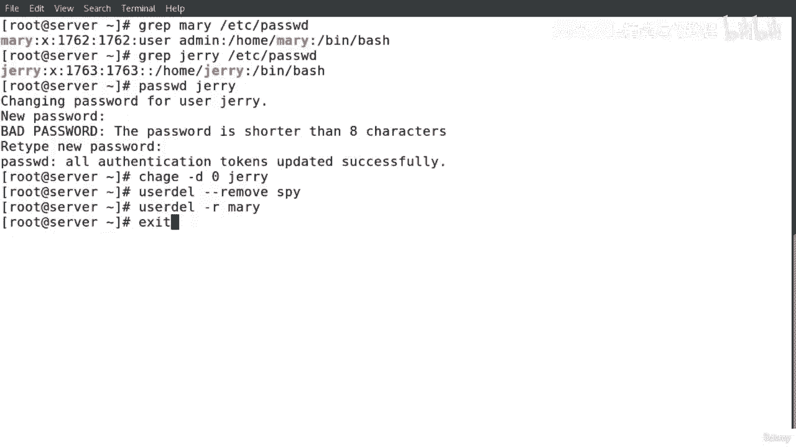
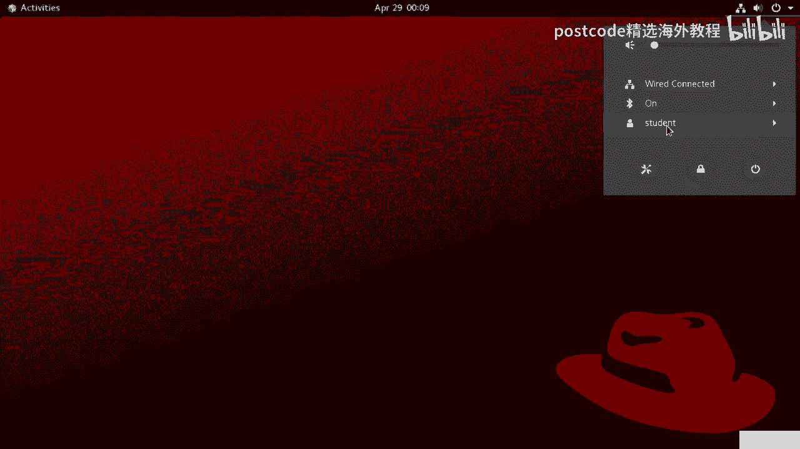
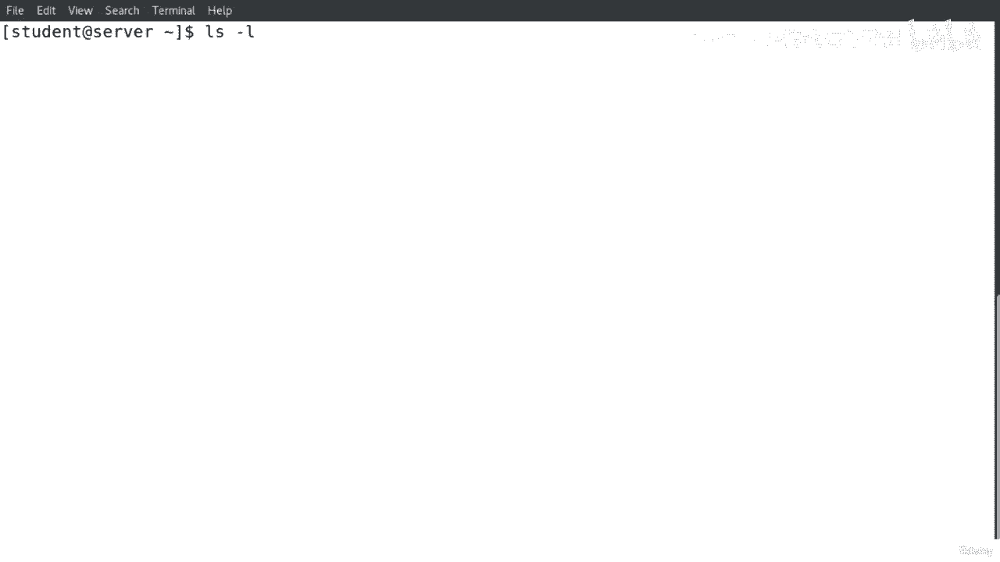
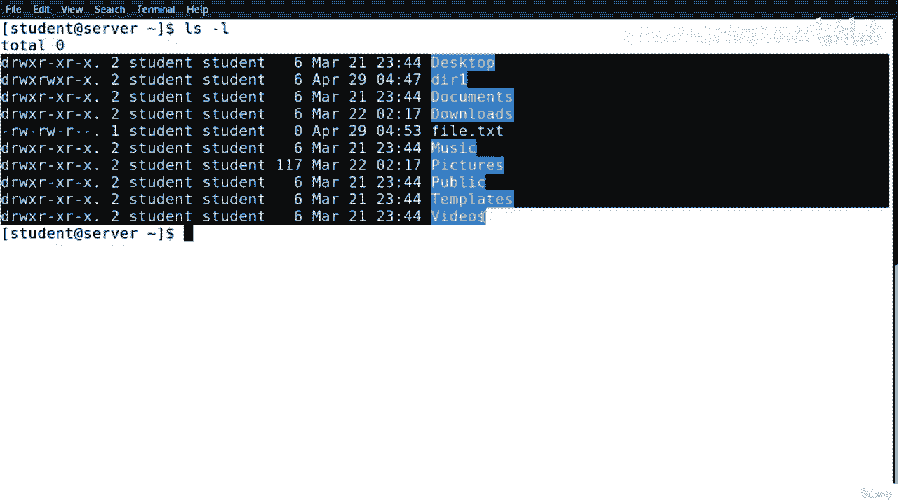
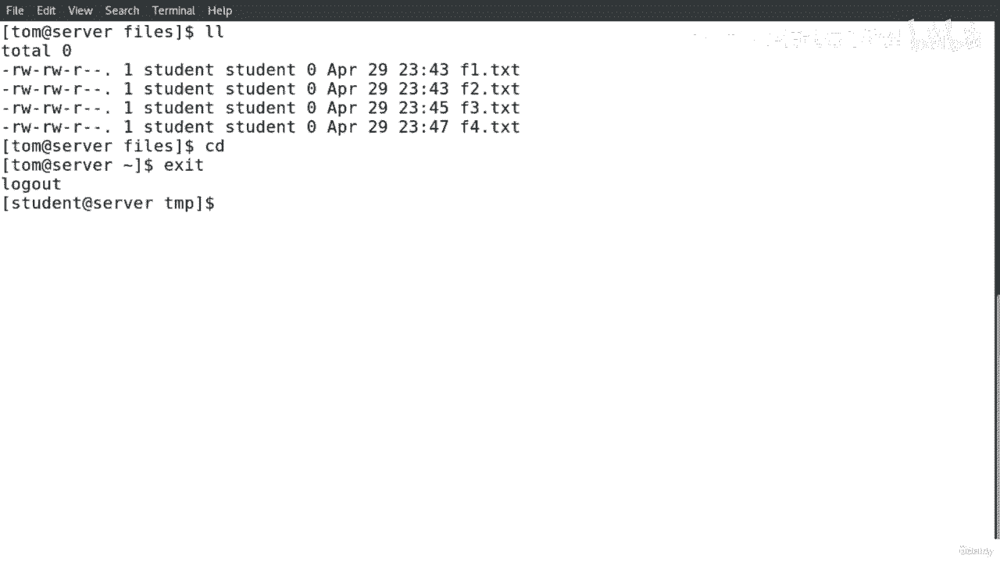

# 红帽企业Linux RHEL 9精通课程：04-04-021：管理用户和组

在本节课中，我们将学习如何在Linux系统中管理用户和组。内容包括创建用户、分配密码、修改用户属性、创建组、管理组成员关系，以及理解文件权限和所有权。这些是系统管理员日常工作的核心技能。

## 用户管理

上一节我们介绍了课程概述，本节中我们来看看如何创建和管理用户账户。

### 创建新用户

为了创建一个新用户，我们运行 `useradd` 命令，后跟选项和用户名。

```bash
useradd [选项] 用户名
```

### 列出系统用户

如果我们想列出所有用户并显示系统中的用户，我们可以运行以下命令。





```bash
ls -l /home
```


以下是使用不同选项创建新用户的示例。

```bash
useradd -u 1001 -s /bin/bash -e 2023-12-01 -c "用户描述" 用户名
```
*   `-u`：为用户分配一个用户ID。
*   `-s`：为用户指定登录shell，例如 `/bin/bash`。
*   `-e`：设置账户的到期日期。
*   `-c`：添加任何评论或描述。

选项有很多，我们可以通过 `man useradd` 命令在手册页中找到所有选项。

### Linux用户层次结构

当我们创建一个新用户时，该用户的目录就位于 `/home` 目录下。`/` 是根目录，`/home` 是用户家目录的父目录。每个用户的家目录下通常有桌面、文档、下载等子目录。所有用户的文件和目录都位于 `/home` 下。

### 管理用户密码

在创建用户后，我们需要为用户分配密码。

```bash
passwd 用户名
```

此命令用于分配新密码或更改用户的现有密码。

为了列出有关用户和密码的详细信息，我们可以运行以下命令。

```bash
cat /etc/passwd
```

### 管理密码策略

如果我们想列出或更改用户密码的到期信息，可以运行 `chage` 命令。

```bash
chage [选项] 用户名
```

例如，强制用户在下一次登录时更改密码。

```bash
chage -d 0 用户名
```

### 删除用户

如果我们想从系统中删除用户，运行 `userdel` 命令。

```bash
userdel [选项] 用户名
```

最佳实践是，如果我们想要删除一个用户帐户及其所有相关文件，使用 `-r` 选项。

```bash
userdel -r 用户名
# 或使用长选项格式
userdel --remove 用户名
```

## 组管理

上一节我们介绍了用户管理，本节中我们来看看如何管理组以及用户与组的关系。

### 创建新组

如果您想创建一个新组，我们运行以下命令。

```bash
groupadd [选项] 组名
```

我们可以通过 `man groupadd` 命令找到所有选项。

### 列出系统组

如果我们想列出系统中的所有组，可以运行以下命令。



```bash
cat /etc/group
```



### 修改用户属性与组关系

`usermod` 命令用于修改用户账户属性，包括将用户添加到组。

```bash
usermod [选项] 组名 用户名
```

如果我们想将用户添加到特定组，那么我们运行这个命令。我们还可以通过运行 `usermod` 命令来修改用户的属性。

在 `usermod` 的手册页中可以找到很多选项，例如：
*   `-aG`：将用户追加到一个或多个附属组。
*   `-g`：更改用户的主要组。
*   `-L`：锁定用户账户。
*   `-c`：修改注释字段。

### 主要组与附属组

每个用户都有一个主要组。但是，我们可以将许多附属组分配给一个用户。

*   `-g` 选项用于分配或更改用户的主要组。
*   `-aG` 选项用于将用户添加到一个或多个附属组。

### 删除组

如果我们想删除一个组，运行以下命令。

```bash
groupdel 组名
```

删除后，可以运行 `cat /etc/group` 命令来确认组已被删除。

## 文件所有权和权限

上一节我们介绍了组管理，本节中我们深入探讨文件的所有权和权限，这是Linux系统安全的基础。

### 理解权限列表

当我们运行 `ls -l` 命令时，会看到类似以下的输出：

```
drwxr-xr-x. 2 tom linux 4096 Oct 27 10:00 directory
-rw-r--r--. 1 tom tom    0 Oct 27 10:00 file.txt
```

*   第一个字符代表文件类型：`d` 表示目录，`-` 表示普通文件，`l` 表示符号链接。
*   接下来的九个字符分为三组，每组三个，分别代表：
    *   所有者权限
    *   所属组权限
    *   其他用户权限
*   每组中的字符表示：`r` 读，`w` 写，`x` 执行。
*   后面的数字表示链接数。
*   `tom` 是文件的所有者。
*   `linux` 是文件的所属组。
*   接着是文件大小、修改日期和文件名。

### 权限值

每个权限都有对应的数字值：
*   `r` (读) = 4
*   `w` (写) = 2
*   `x` (执行) = 1
*   `-` (无权限) = 0

权限组合的值是这些数字的和。例如，`rwx` 是 7 (4+2+1)，`r-x` 是 5 (4+0+1)。

### 权限对文件和目录的影响

*   **对文件**：
    *   `r`：可以读取文件内容。
    *   `w`：可以修改文件内容。
    *   `x`：可以执行文件（如脚本或程序）。
*   **对目录**：
    *   `r`：可以列出目录内容（如使用 `ls`）。
    *   `w`：可以在目录内创建、删除、重命名文件或子目录。
    *   `x`：可以进入该目录（如使用 `cd`）。

## 更改权限和所有权

上一节我们理解了权限的含义，本节中我们学习如何修改它们。

### 更改权限 (`chmod`)

修改文件或目录权限的命令是 `chmod`。

**符号模式**：使用 `u` (用户/所有者), `g` (组), `o` (其他), `a` (所有) 与 `+` (添加), `-` (移除), `=` (设置) 结合 `r`, `w`, `x`。

```bash
chmod u=rwx,g=rx,o=r 文件名
chmod g+w,o-x 文件名
chmod a=rwx 文件名
```

**数字模式**：直接使用三位八进制数字。

```bash
chmod 755 文件名 # 对应 rwxr-xr-x
chmod 644 文件名 # 对应 rw-r--r--
```

### 更改所有权 (`chown`)

更改文件或目录的所有者和/或所属组。

```bash
# 只更改所有者
chown 新所有者 文件或目录
# 同时更改所有者和所属组
chown 新所有者:新所属组 文件或目录
# 只更改所属组 (也可以使用 `chgrp` 命令)
chown :新所属组 文件或目录
# 或
chgrp 新所属组 文件或目录
```

## 特殊权限

除了基本的读、写、执行权限，Linux还有三种特殊权限位。

### 设置用户ID (SUID)

当在可执行文件上设置SUID后，用户执行该文件时，将以文件所有者的身份运行，而不是执行者自己的身份。这通常用于需要提升权限的命令。

```bash
chmod u+s 文件名
```
SUID的数字值是 **4**，会显示在所有者执行位（`x`）的位置，如果文件原本有执行权限则显示为 `s`，否则显示为 `S`。例如 `/bin/passwd` 命令。

### 设置组ID (SGID)

对于文件：与SUID类似，但以文件所属组的身份运行。
对于目录：在该目录下创建的新文件或子目录，将继承该目录的所属组，而不是创建者的主要组。

```bash
chmod g+s 文件名或目录名
```
SGID的数字值是 **2**，显示在所属组执行位的位置。

### 粘滞位 (Sticky Bit)

通常用于目录（如 `/tmp`）。设置了粘滞位的目录，即使所有用户都有写权限，也只有文件的所有者、目录的所有者或root用户才能删除或重命名该目录下的文件。

```bash
chmod o+t 目录名
```
粘滞位的数字值是 **1**，显示在其他用户执行位的位置。

**特殊权限的数字表示法**：将它们放在普通三位权限数字之前，组成一个四位数。例如 `4755` (SUID), `2755` (SGID), `1755` (Sticky Bit), `6755` (SUID+SGID)。

## 文件属性 (`chattr`)

除了权限，我们还可以为文件或目录设置属性，以防止某些修改，这提供了另一层保护。

### 添加和移除属性

使用 `chattr` 命令。

```bash
# 添加属性
chattr +属性 文件名
# 移除属性
chattr -属性 文件名
# 查看属性
lsattr 文件名
```

### 常用属性

*   `a` (append only)：文件只能以追加方式写入，不能删除或修改已有内容。root用户可设置。
*   `i` (immutable)：文件不可被修改、删除、重命名或创建链接。root用户可设置。

## 使用 `sudo` 授权

`sudo` 命令允许授权用户以其他用户（通常是root）的身份执行命令，而无需知道root密码。

### 配置 `sudo` 权限

最佳实践是通过 `visudo` 命令编辑 `/etc/sudoers` 文件，因为该命令会检查语法错误。

```bash
visudo
```

### 配置示例

在 `/etc/sudoers` 文件中添加行来授权：

```bash
# 允许用户 tom 无需密码运行 /sbin/fdisk 命令
tom ALL=(root) NOPASSWD: /sbin/fdisk

# 允许用户 jerry 无需密码运行任何命令 (危险！)
jerry ALL=(ALL) NOPASSWD: ALL

# 允许用户 mary 无需密码切换到 root 用户
mary ALL=(ALL) NOPASSWD: /bin/su -

# 允许组 network 的成员无需密码切换到 root 用户
%network ALL=(ALL) NOPASSWD: /bin/su -

# 允许组 linux 的成员无需密码运行任何命令
%linux ALL=(ALL) NOPASSWD: ALL
```
*   `%` 符号表示后面跟的是组名。

## 访问控制列表 (ACL)

标准Linux权限（所有者、组、其他）有时不够灵活。ACL允许我们为特定的用户或组设置更精细的文件/目录访问权限。

### 管理ACL

首先，确保系统已安装ACL工具包。

```bash
yum install acl
```

设置ACL使用 `setfacl`，查看ACL使用 `getfacl`。

```bash
# 为用户 tom 添加对 directory 的 rwx 权限
setfacl -m u:tom:rwx directory

# 为组 dbgroup 添加对 file.txt 的 rw 权限
setfacl -m g:dbgroup:rw file.txt

# 查看文件或目录的ACL
getfacl directory

# 递归地为目录及其现有内容设置ACL
setfacl -R -m u:tom:rwx directory

# 设置默认ACL（新创建的文件/目录将继承此ACL）
setfacl -d -m u:tom:rwx directory

# 删除特定用户的ACL条目
setfacl -x u:tom directory

# 删除所有ACL条目（恢复标准权限）
setfacl -b directory

# 删除所有默认ACL条目
setfacl -k directory
```

## 总结

本节课中我们一起学习了Linux系统管理中关于用户、组、权限和所有权的核心知识。我们涵盖了：
1.  使用 `useradd`, `usermod`, `userdel`, `passwd`, `chage` 管理用户。
2.  使用 `groupadd`, `groupdel`, `usermod` 管理组，并理解了主要组与附属组的区别。
3.  解读和修改文件权限 (`chmod`) 与所有权 (`chown`, `chgrp`)。
4.  理解并应用特殊权限：SUID, SGID, 粘滞位。
5.  使用 `chattr` 设置防止修改的文件属性。
6.  通过配置 `/etc/sudoers` 文件（使用 `visudo`）来授权用户使用 `sudo`。
7.  使用访问控制列表 (ACL) 为特定用户和组设置更精细的权限。



掌握这些技能对于有效管理和维护Linux系统的安全至关重要。