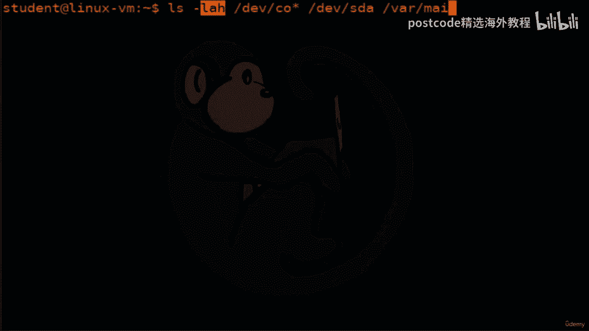
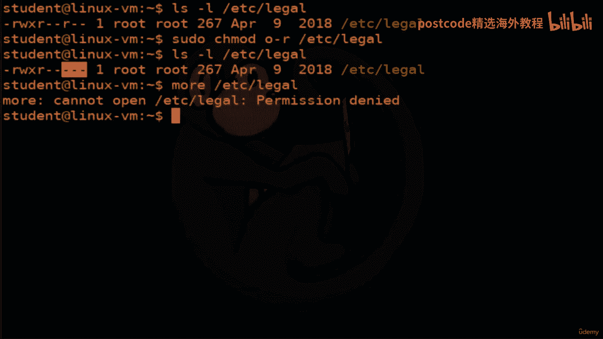
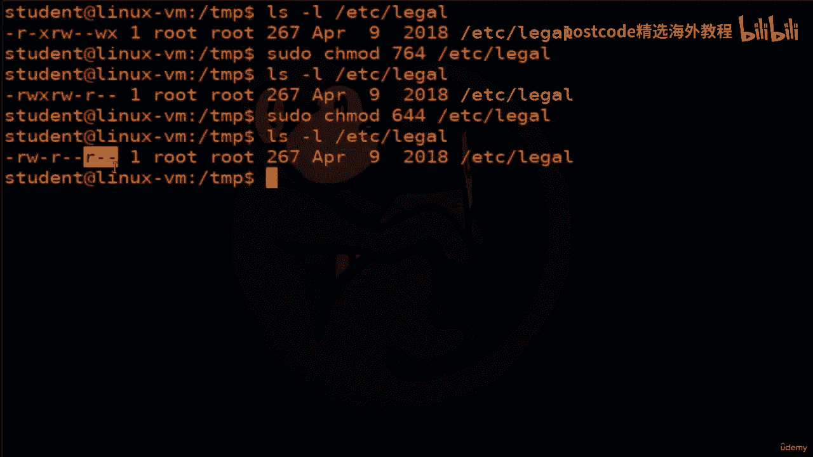

# 红帽企业Linux RHEL 9精通课程 — RHCSA与RHCE 2023认证全指南 - P46：04-04-022 File permissions - 精选海外教程postcode - BV1j64y1j7Zg

每个文件都有一个所有者，该所有者拥有读取、写入或执行该文件的某些权限，文件。每个文件还将具有允许一组用户具有读、写权限的权限，或执行该文件。最后，每个文件都将拥有非所有者和非所有者的其他人的权限。

读、写和执行的组。查看特定文件的权限的方法。

我们可以将 LZ 命令与 Dash L 选项一起使用，该选项代表长列表。

那么让我们重新回顾一下 LZ 命令，看看我们有 Dash A 的一些常见选项，其中会列出。

所有文件，包括隐藏文件和隐藏文件或以点开头的文件。

然后我们得到 LLS 减去 l。

这是长格式。现在它将显示出火灾的一大堆其他特征，稍后将对此进行解释。接下来，我们有 LSS 减去 H 以供人类阅读，并且带有破折号 h 选项，您必须将其与。

破折号 l 表示长格式。否则，如果您不这样做，它根本没有任何帮助，因为它不会显示文件大小。那么我们来看看这个文件夹。

正如您所看到的，文件大小现在是人类可读的，对吧？它使它们为 200 K、65 兆、179 K、8。4 兆等等。否则，它实际上将其拼写为精确的字节，有时有点难以阅读。

我们要看的下一个是 ls dash 大写 R 表示递归。

它要做的就是从你所在的位置遍历树。

一直到子文件夹。因此，在这种情况下，它进入我的文档文件夹并查看文件夹。

米奇老鼠，米奇老鼠，米奇老鼠。

好的。这些是 RLS 的一些更常见的选项。

现在让我们看一些具有文件权限的具体示例。我们将使用 LS dash l 来长格式所有文件的 A，包括隐藏文件和 H，供人类可读。再次记住，选项可以按任何顺序排列。

我们可以输入 ll、hhal、hla 等。它们都是一样的。因此，我们将查看文件中的这些特定文件夹。

那么让我们看一下长格式输出中的内容。正如您所看到的，每行都有几组信息。第一组是文件类型和文件的访问权限。第二组是文件的硬链接数量。第三组是文件所有者。第四组是文件组。第五组是文件大小（以字节为单位）。

第六组是修改日期。最后修改日期。

最后一列是文件的名称。

那么让我们详细看看第一组。我们在这里讨论的第一组是这些 blob，它代表文件类型和访问权限。

因此该组的第一个字符代表文件类型。如果它是破折号，则意味着这是一个常规文件，对吧？您的大部分文件都将是常规文件。另一种最常见的类型是 DHH（目录）。这些是文件夹或目录。一样。接下来流行的是四个软链接。

然后是字符设备 C。B 代表块设备。

有时您可能会看到套接字的 TSS 和命名管道的 PS。所以接下来我们要看看。第一组是所有这些的其余部分，这些称为文件权限位，它们已损坏，分成三组。前三个是文件所有者的读、写、执行的访问权限。

第二个三个权限是该组中任何人的读、写和执行权限。第三是非所有者的其他人的读、写、执行权限，并且不在组内。因此，在这种情况下，该特定文件的所有者具有读取权限。他们有正确的许可，但他们不能执行。还有其他人。

要么在群里。或者其他人没有权限做任何事情。下一个文件在这里为所有者提供。所有者可以读取、写入和执行组中的任何人，在本例中是路由，组具有读、写、执行权限。

非所有者且不在该组中的其他人也拥有读取、写入和执行权限，对于这个特定的文件。所有者可以对其进行读取和写入。如果您属于该组，在本例中为 DESC 组，那么您还可以读写，到该特定文件。最后。

如果您不是所有者并且不属于 DESC 组，则您没有权限，做任何事。更改文件的所有者。

您可以使用显示的命令。C。H。奥。W。N。

那么我们来看看c legal 下的这个文件。LZ 可以做一个破折号l长格式吗？因此，在这里您可以看到它由帐户根拥有，并且有权访问它的组也是，根组。那么让我们继续使用 ch0wn 命令。

我们基本上会告诉它，我们将把这个文件的所有者更改为学生。你必须记住。您必须使用 sudo 因为 root 实际上拥有该文件。所以来验证一下。我们就是这样做。LS 再次减去 l。果然，您会看到。

该学生现在是该文件的所有者。好吧，那如果我们想换一个组怎么办？那么，您还可以使用克隆命令来更改组。所以我们就这么做。这次一定要改变。让我们更改所有者和组。所以我们首先要指定所有者。

我们将其更改为男性所有者，然后对于团体，我们将其更改为，恶魔组。再次，我们想要向上箭头两次来执行 LZ minus l 命令来验证。

果然，我们看到主人已经变成了男性，而队伍并没有改变恶魔。

正如我之前多次说过的，在 Linux 中做任何事情通常有不止一种方法。

所以有一个特定的命令来改变文件的组属性或改变组。所以我们能做的就是通过诉讼来改变群体的合法权利。所以我们要把组改回来。从恶魔到根，我们按下回车键，没有给我们任何反馈。

我们将升级 Arrow 两次并获得我们自己的反馈。果然，该组现在已更改回 root。因此，让我继续将所有者也更改回路线。把东西放回原处。我们开始吧。美丽的。现在让我们看看如何更改文件的权限。为此。

我们将在这里更改这些位。我们将使用 chabad ch 模式命令。chabad 命令更改文件模式位，以便当您使用 LSB l 时您可以看到它们的内容，是。有两种方法可以更改这些模式位。

其中一种使用符号表示，另一种使用八进制数，代表位模式。不同的人有不同的偏好。我们将仔细研究这两个问题，以便您可以做出自己的决定。好的。正如我所说，第一种方法是使用符号表示。

这意味着因为我们可以更改用户权限、组权限和，然后其他权限，您可以使用字母 U 表示用户，G 表示组，O 表示其他。当你想改变这些位时。或者您可以为所有这些位选择 A。

然后您要做的就是选择您想要执行的操作。您想添加权限吗？您想减少权限还是想为某件事设置权限？最后，您将给它一系列字母，就像 W 和 X 一样代表，您要设置的位。那么让我们继续再做一个例子。因此。

在此文件的示例中，假设我们希望允许用户也执行该文件。假设这个文件是一个程序。现在，由于未设置执行位，因此无法执行该文件。那么让我们继续设置执行位。做到这一点的方法是我们执行用户命令。我们将添加执行出价。

再次，我们将事先执行 soo do，以确保一旦我们执行命令，让我们继续向上箭头两次以获得确认。果然，我们看到唯一发生变化的是用户权限。我们添加了执行位。所以这里我们是用户，我们将添加执行位。

那么让我们再做一个我们可以做的例子。艾哈迈德也是如此。假设我们想要去其他地方并减去读取，对吧？因为现在每个人都可以读取这个文件。假设我想让它只有所有者才能阅读。否则，如果您属于该组（根组）。

那么您就可以读取它。那么让我们继续这样做吧。好的。因此其他人正在删除读取权限。果然，我们看到读取位未设置。因此，如果您不是 root 用户，也不是 root 组的一部分，则无法读取此文件。

那么让我们尝试一下。果然，就这样了。您的许可被拒绝。

如果用逗号分隔多个设置，则可以在同一命令中组合多个设置。那么让我们继续看一下法律文件。所以现在它被设置为为用户读取、写入、执行，为组只读，并且不为用户读取、写入、执行。其他人。所以我们要做的是添加用户。

减去正确的位组，我们将添加正确的位组，少量。对于其他方面，我们将予以纠正并执行。所以我们把所有这些都放在同一条线上。所以我们去仔细检查一下。果然，我们看到用户（即所有者）的正确位已被删除。

已为该组设置了正确的位。其他属性都是正确的，并且按照我们在这里设置的方式执行。这就是如何将 Gemade 与符号表示一起使用。

使用命令的第二种方法是八进制表示。该命令看起来像这样。所以我们要说哈马德，然后我们要给它几个八进制数字，然后命名，一个文件的。我们推导这三个八进制数的方式就是这样的。首先。

我们必须决定我们希望每个集合拥有哪些权限。用户、组和其他。例如，如果我们想向用户授予读取、写入和执行权限。我们希望授予该组读写权限。我们只想将 Reed 权限授予其他人。这在此图表中有所体现。

现在我们将每个授予的权限视为一个二进制位。所以rwx变成a111。R和W是a110。然后 R 就是 100。最后，我们将这组二进制数字转换为八进制。

所以 a111 基本上是二进制的 78110 转换为八进制的 6，a100 转换为八进制的 4。让我们看一个例子。所以我们要再次查看该法律文件。现在我们已经设置了这些特定的权限位。正如我们之前所说。

我们已经确定我们实际上希望权限位为 7，六和四，因此我们可以这样做，因为 Etsy 的七、六四合法。然后我们再来看一下验证。果然，我们已经读、写、执行了，对吧。这是一个七。我们已经读和写了六。

然后只读了四。让我们再次将其恢复到原始状态。如果您不记得的话，原始版本基本上是 a644，它授予读写权限，用户，然后对其他人和组具有只读权限。所以一旦我们这样做了，我们就会做LSB。L再次验证。果然。

我们为所有者读取和写入，为其他人和组读取。这就是在 MOD 中使用八进制表示的方式。

好的。这样我们就到了本视频的结尾，我们研究了管理权限和设置所有者。

以及文件和目录的组。我们更深入地研究了带有 Dash LL 选项的 LZ 命令，并查看了这些命令，命令、语气和更改组。

