# 红帽企业Linux RHEL 9精通课程 — RHCSA与RHCE 2023认证全指南 - P47：04-04-023 Mode bits - 精选海外教程postcode - BV1j64y1j7Zg

前面我们讨论了读、写和执行三种模式。实际上还有另外三个模式位可以修改可执行位的行为。有一个 T 表示粘性位。

还有一个大写的 X 表示特殊执行位。最后，有一个 SE 在组 ID 中设置用户 ID。

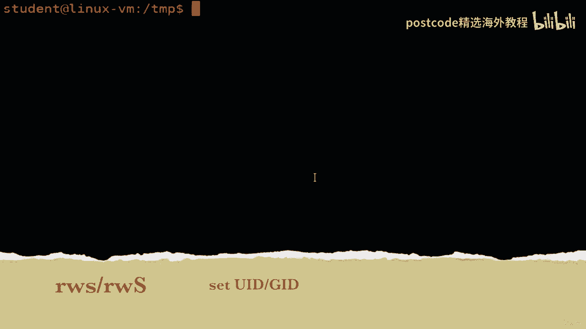

执行位实际上比我之前解释的要复杂一点，其含义是。

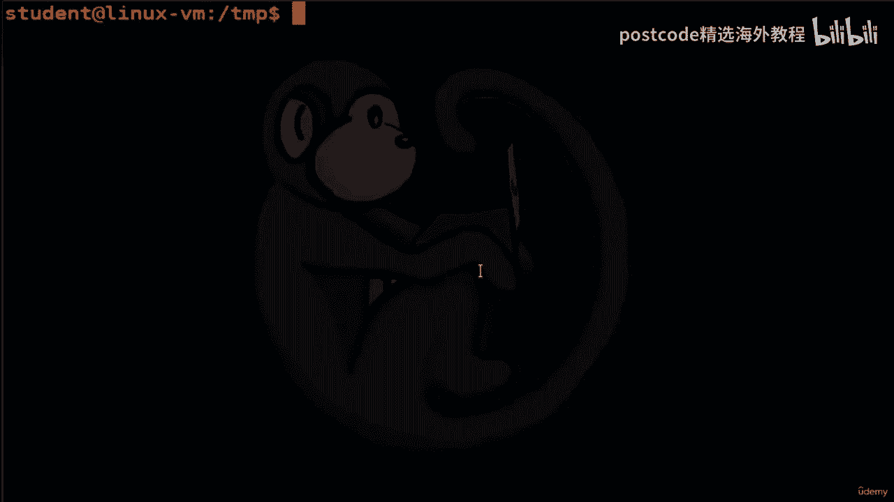

该位实际上取决于上下文，具体取决于您引用的是文件还是目录。

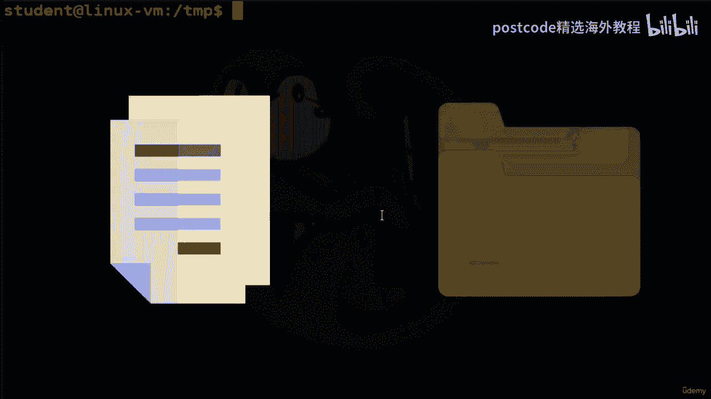

因此，对于执行位，我们之前看到的是，当它引用一个文件时，如果，执行位被设置，则该特定文件是可执行的。您可以运行该命令、shell 命令或执行二进制文件，但如果在。

文件夹，这样做的目的是让其他人可以看到该文件夹​​的内部情况。

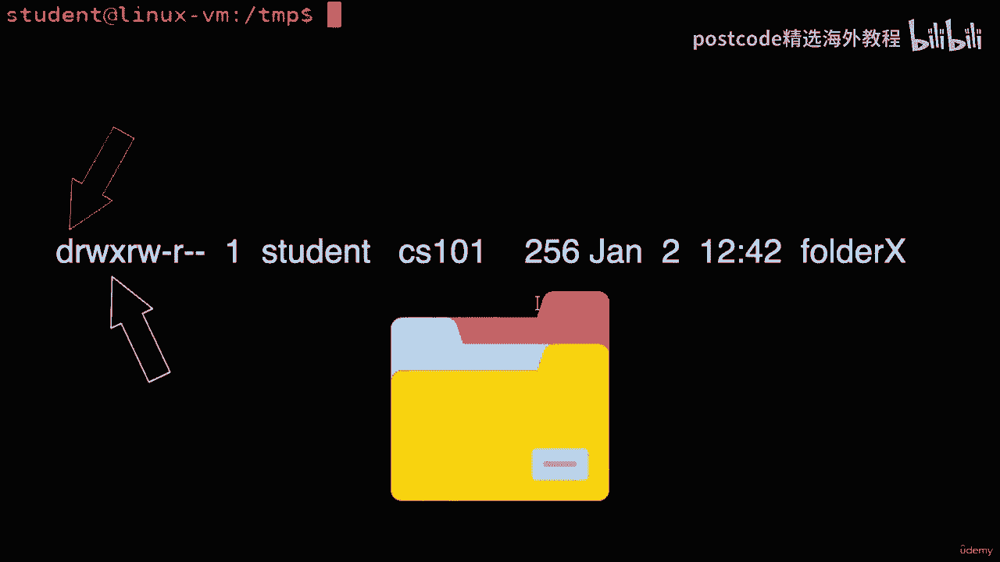

因此，让我们看一下应用于文件夹的执行位。所以我这里有一个名为 Student 的文件夹，如果我在该文件夹上执行 LZ 减去 L，我将使用破折号，dx。所以这实际上是查看目录本身。

它向我展示的是它已经重写，为用户、组执行，然后为其他人执行，读取并执行。所以基本上每个人都可以读取并执行这个文件夹。因此，如果我们看一下文件夹内部，我们有三个子文件夹，分别称为子一、子二，sub 三个。

然后是一个名为 will。txt 的文件。现在让我们将 user 替换为您创建的另一个用户。我们请来了之前视频中的艾琳。所以我要输入 Erin 的密码。现在让我们继续播种到临时文件夹中。是哪里的学生？

我们再看一下。好的。所以您可以看到该文件夹​​设置了执行位。作为Erin，我可以对名为Student的文件夹做一个LZ，我也可以看一下里面的文件。卡尔会的。这是设置执行位时的示例。

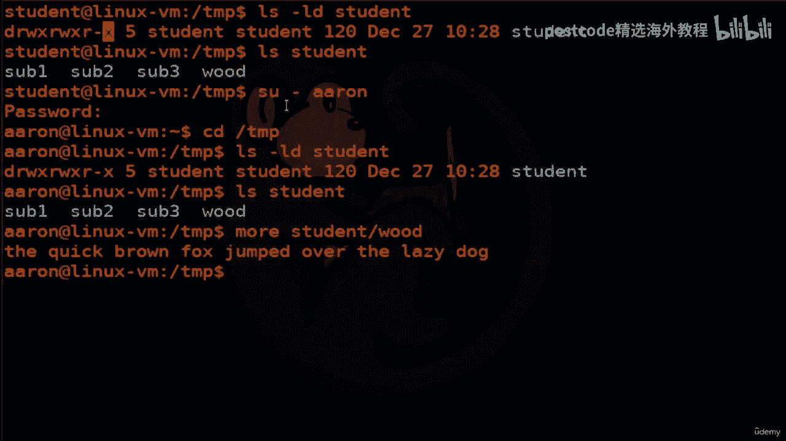

让我们以艾琳的身份离开这里，回到学生帐户。现在，让我们继续将该文件夹的模式更改为七、七、四。所以现在它删除了执行位。让我们再次以空气的形式回来。现在，如果我做一个 LHS。学生会不会给我许可被拒绝。

因为我无权执行，学生文件夹。所以它会让我看看里面，看看里面的内容。我可以帮LZ，但是我看不到那个叫would的文件。模式位大写 x 仅适用于目录，是一个特殊的执行位。

如果您想要递归地设置目录的可执行位，则可以使用此方法。

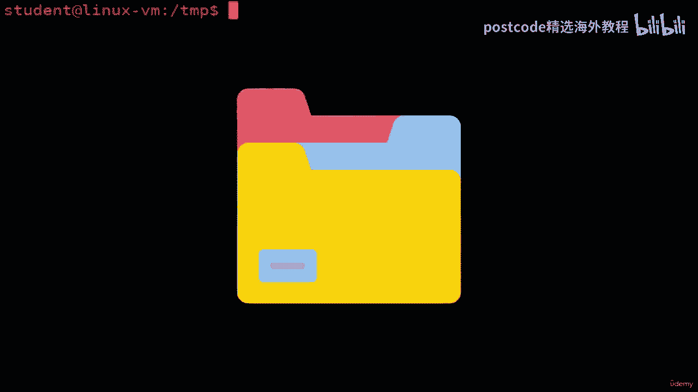

但不适用于文件，那么这就是您将使用的。那么让我们看看我们现在有什么。我们将为临时学生递归列出短划线 l 长格式和大写 R 的列表。

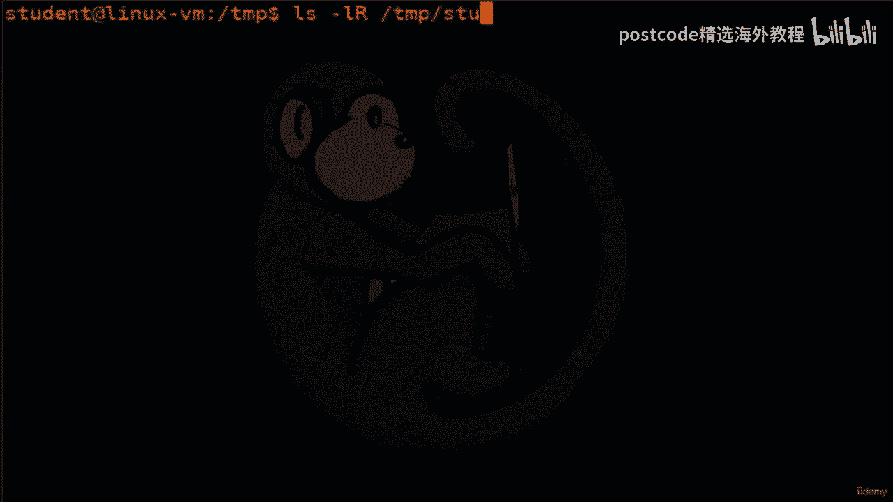

正如您所看到的，我们有一堆子文件夹和子文件夹中的一个常规文件。我们有另一个子文件夹，其中有一个常规文件。因此，我们现在要做的实例是我们希望允许其他子文件夹可执行，用户。

以便他们可以实际查看内部并看到这些文本文件。

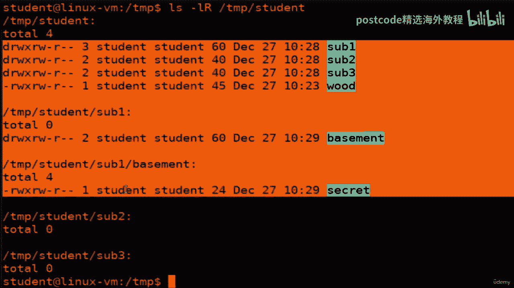

但是，我们不想为文本文件设置可执行位，因为它们不可执行，文件只是文本文件。我们要做的就是用大写 R 来表示递归，然后我们，就是说全部减去可执行文件，然后添加。特殊的可执行出价会将其应用于学生文件夹。

然后做一个LZ减去L大写R来验证。现在我们看到可执行位都已设置。适用于文件夹中的其他内容，但不适用于文件本身。这就是使用特殊大写 X 模式位的方法。模式位s代表set UID和set g ID。

即设置用户ID和组ID，set UID，而set g ID权限则用于告诉系统运行该可执行文件，就像所有者一样，或具有其权限的组。那么这到底意味着什么呢？让我们看一个例子。我们来看看密码命令。

它在我们的系统上。正如您所看到的，当您执行 LZ 减去 L 时，您会看到 root 所有者的权限，读正确并 s。然后对于一个组和其他组来说只是读取和执行。所以这里我们要讨论的是设置 UUID 字段。

如果那个 S 存在，那意味着什么，是当这个程序执行时，它将像作为路由运行一样执行它，权限，因为路由是所有者。它需要这样做，因为密码程序实际上需要写入密码文件。如果我们在 Z 密码上执行 LZ 减去 L。

我们将看到唯一可以写入该密码的人是所有者，这是路线。因此，如果我们不将密码命令作为路由执行，那么我们将无法写入该文件。这就是设置 UID 和引导模式位的目的。我们来看看如何使用它。

所以我有一个名为 Evil Dot 的文件，因为 H 是一个邪恶的表演脚本，当前模式位正在读取和，为用户、组编写，仅为其他用户阅读。那么让我们继续做用户吧。另外，我们想要设置用户 ID。

以便每当有人执行邪恶时，他们就拥有，学生帐户的权限。既然我们已经说过了，那么我们就来看看吧。果然，它改变了一点点。所以现在是大写的S。所以需要注意的一件事是，如果该位是大写的 S，那就是对我们的警告：

不对。其背后的原因是实际上未设置可执行位。请记住，在我们查看之前，当我们设置 set UID 位时，实际上并没有设置它。现在，如果我们继续设置该位用户 x。

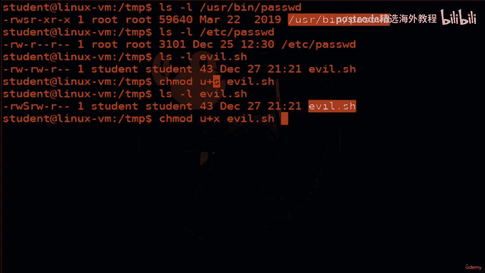

然后再看一下LRS命令。现在我们看到这已经变成了小写的s，这是正常的行为，这就是你想要的，查看。所以现在这意味着邪恶的H文件确实在SE后面设置了可执行文件。然后最重要的是，s 确保当有人运行它时。

它会作为学生帐户运行它，或者，与学生帐户的权限一样。对可执行位的最后一个修改是字母 T，它代表粘性位。

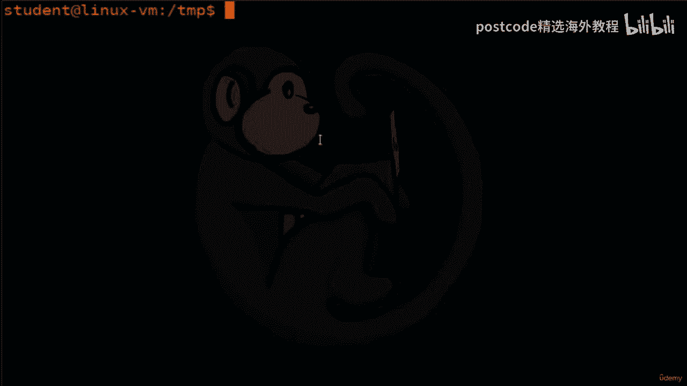

当粘滞位应用于文件时。其作用是将程序的映像保存到交换空间中，以便加载速度更快。

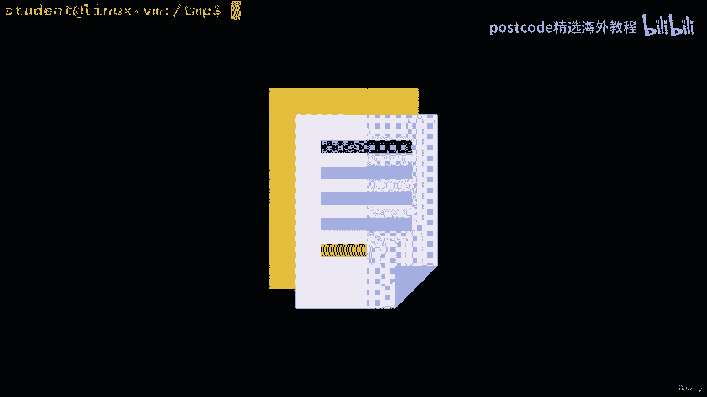

运行时。然而，出于我们的目的，因为我们运行的是 Linux，Linux 内核实际上忽略了粘性，文件上的位。但现在你知道它在 Unix 机器上做了什么。

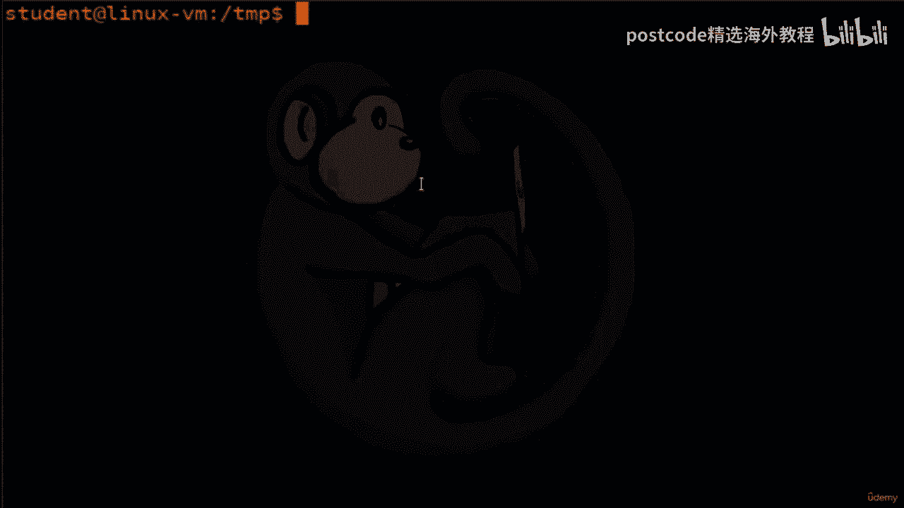

当粘滞位应用于目录时，它会设置所谓的限制删除标志。

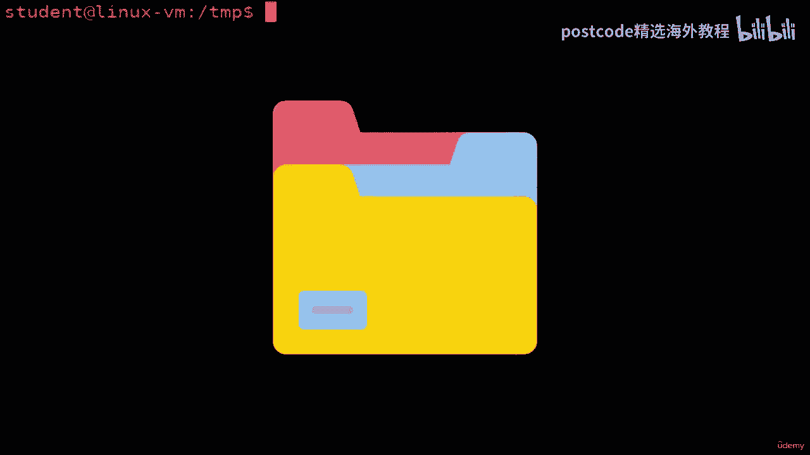

这意味着现在将阻止非特权用户删除或重命名文件。

目录，除非他们是所有者。这意味着只有当您是粘性目录的所有者时才能删除文件，文件的所有者或 root 用户。

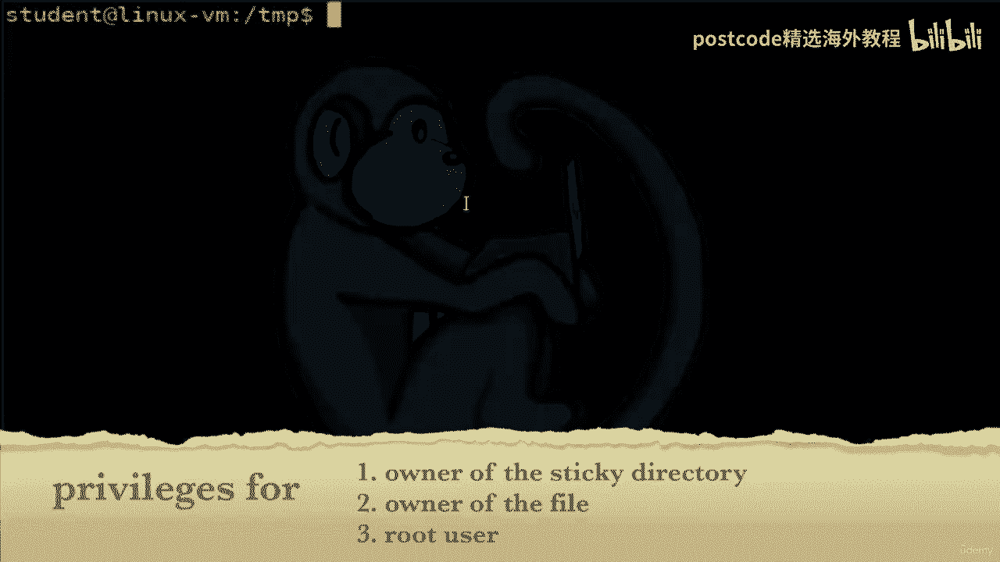

所以这对于像斜线临时文件这样的共享文件夹非常有用。那么让我们来看看这意味着什么。因此，我们将对斜杠 temp 上的目录执行 LZ 减去 l dx。正如你所看到的。

slash temp 是一个具有读、写、执行功能的目录。对于粗鲁的所有者，读取、写入、执行为根组，然后，读、写，然后是 T，这对其他人来说是粘性位。好的。所以这意味着在这个临时文件夹中。

如果其中有由某个用户创建的文件，其他用户将无法删除它，因为他们不是该文件的所有者，他们不是，root 并且他们不拥有粘性位目录。让我们看一个示例用法。我将创建一个名为“共享文件夹”的新文件夹。

然后我将在其中创建一个名为“随机文件”的新文件。然后我们将修改这个文件，以便每个人都拥有完整的读取、写入和执行权限。因此，我们还将做更多事情来验证。果然，你可以看到七、七、七为每个人带来了充分的权利。

现在我们将继续在共享文件夹上设置粘滞位，然后我们将看一下，在共享文件夹中，您可以看到粘滞位已打开。好的。所以现在我们要做的就是要求您将用户切换到 Aaron。

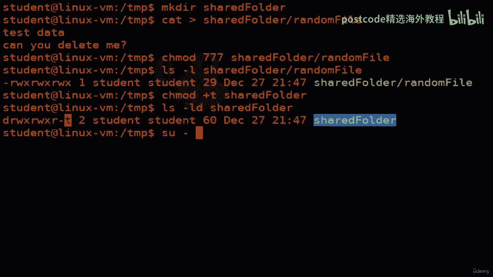

作为艾琳，我应该拥有查看该文件的完全权利。正确的。果然，这就是数据。现在的问题是，我可以删除该文件吗？答案应该是否定的。因为即使该文件可供每个人读取、写入和可执行。所以我应该能够删除它。

因为它包含的文件夹设置了粘滞位，之内。这应该可以防止我删除该文件。我们就这样吧。我们的许可被拒绝了。这就是原因。正确的。因此，尽管我拥有对该文件执行任何操作的完全权限，但还是如此。我不能。

因为粘滞位是在保存文件的文件夹上设置的，并且带有粘滞位，设置后，只有三个人可以删除其中的文件。一种是root用户。第二个是文件的所有者。第三个是粘性目录的所有者，而 Aaron 不是其中之一。因此。

它会导致拒绝移除。这就是粘性部分。好的。因此，这使我们进入了本视频的结尾，我们在其中查看了模式位之外的特殊设置。

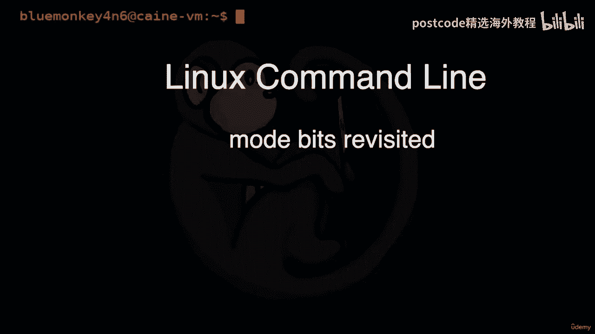