# 红帽企业Linux RHEL 9精通课程：04-04-023：特殊模式位详解


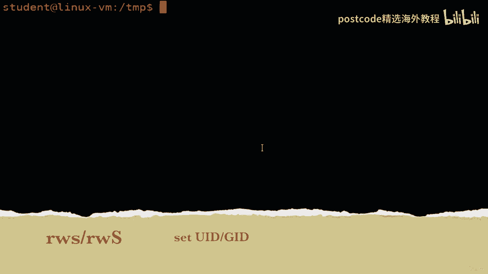

在本节课中，我们将要学习Linux文件权限中除了基本的读（r）、写（w）、执行（x）之外的特殊模式位。这些位包括粘性位（T）、特殊执行位（X）以及设置用户ID（SUID）和设置组ID（SGID）位。理解这些特殊权限对于系统管理和安全配置至关重要。

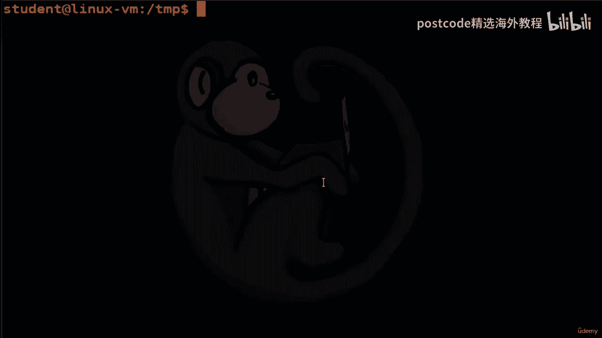

上一节我们介绍了基本的读、写和执行权限。本节中我们来看看这些更高级的特殊模式位，它们可以修改可执行位的行为，为文件和目录提供额外的控制功能。

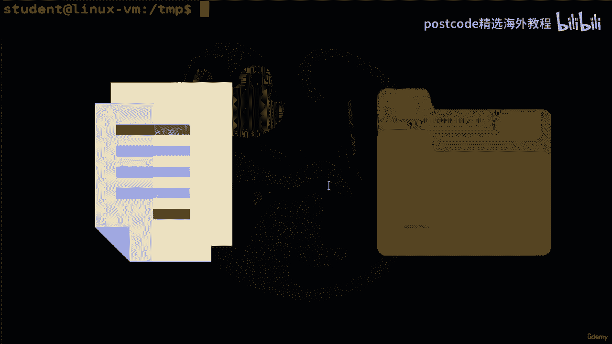

## 执行位的上下文含义


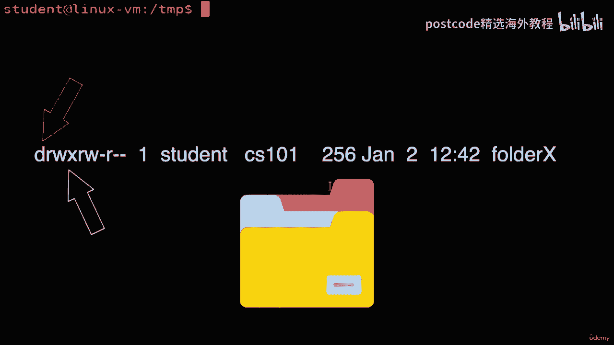

执行位的实际含义比之前解释的要复杂一些，它取决于上下文，具体取决于您引用的是文件还是目录。

*   **对于文件**：如果执行位被设置，则该特定文件是可执行的。您可以运行该命令、shell脚本或执行二进制文件。
*   **对于目录**：目录上的执行位（通常与读位结合为“读取并执行”）决定了用户是否可以访问（进入）该目录并查看其内部内容。如果没有目录的执行权限，即使有读权限，也无法列出目录内的文件列表。

让我们通过一个示例来理解目录的执行位。假设我们有一个名为 `Student` 的文件夹。

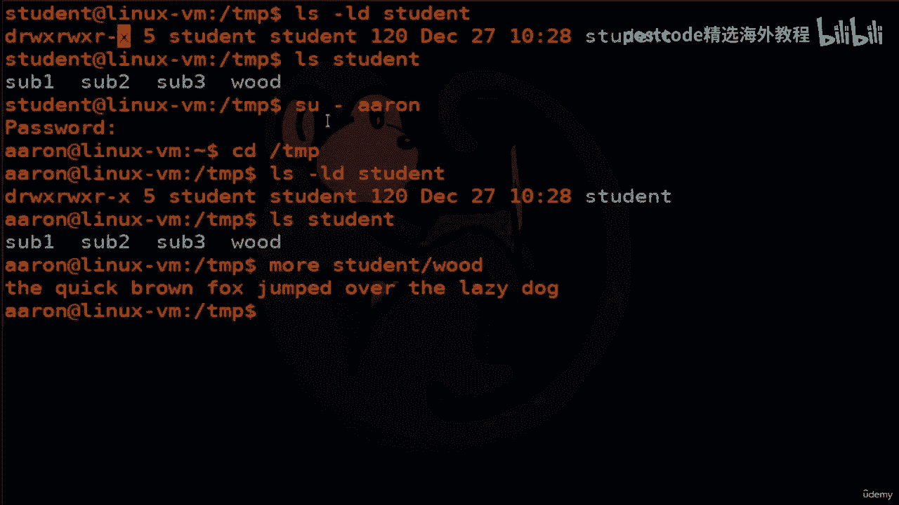

```bash
# 查看Student目录的权限
ls -ld Student
```
输出可能显示为 `drwxr-xr-x`，表示所有人都有读取并执行（进入）该目录的权限。

```bash
# 切换到另一个用户（如Erin）并尝试访问
su - Erin
cd /tmp/Student
ls -l
```
作为Erin，我可以进入`Student`目录并查看里面的文件，因为目录设置了执行位。


现在，如果我们移除目录的执行权限：
```bash
# 回到原用户（如student），修改目录权限为774 (rwxrwxr--)
chmod 774 Student
# 再次切换到Erin用户
su - Erin
ls -l Student
```
此时，执行 `ls -l Student` 会得到“权限被拒绝”的错误，因为Erin无权执行（进入）`Student`文件夹，即使他可能有读权限，也无法看到目录内的内容。

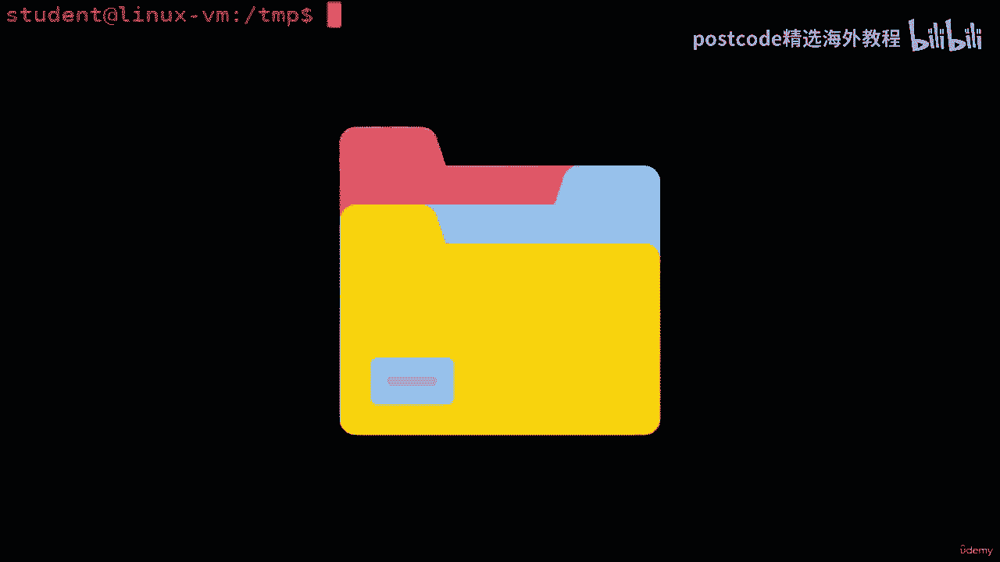

## 特殊执行位（X）

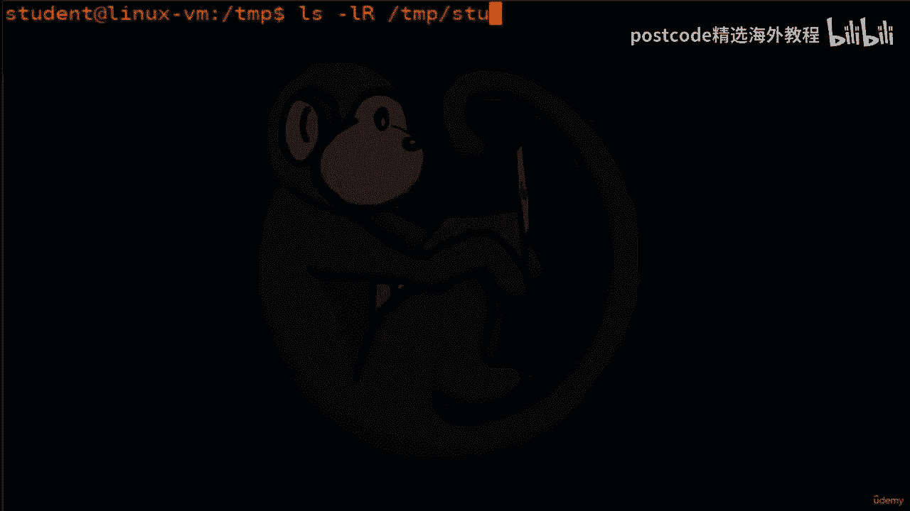

模式位大写 `X` 是一个特殊的执行位，它仅适用于目录，或者与递归操作结合使用。

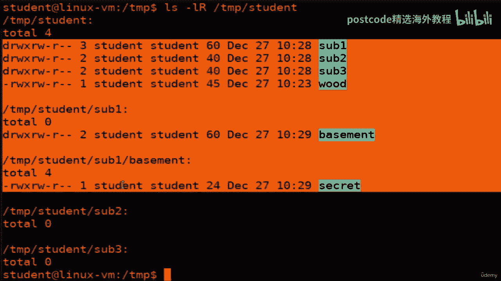

以下是使用大写 `X` 的场景：
当您想要递归地为一个目录及其所有子目录设置可执行位，但**不**想为其中的普通文件设置可执行位时，就可以使用它。这很有用，因为文本文件等通常不需要可执行权限。

假设我们有一个目录结构，其中包含子文件夹和文本文件。我们希望所有子文件夹都可进入（可执行），但保持其中的文本文件不可执行。

```bash
# 递归查看当前目录结构
ls -lR
# 使用大写X递归添加执行权限：为目录添加x，但忽略文件
chmod -R a-x,u+X *
# 再次递归查看以验证
ls -lR
```
现在，您会看到可执行位已为所有子目录设置，但文件本身的执行位没有被添加。这就是使用特殊大写 `X` 模式位的方法。

## 设置用户ID（SUID）和设置组ID（SGID）位

模式位 `s` 代表 **set UID** 和 **set GID**，即设置用户ID和组ID权限。它们用于告诉系统：运行此可执行文件时，应使用文件**所有者**或文件**所属组**的权限，而不是执行者的权限。

这到底意味着什么？让我们看一个经典例子：`/usr/bin/passwd` 命令。

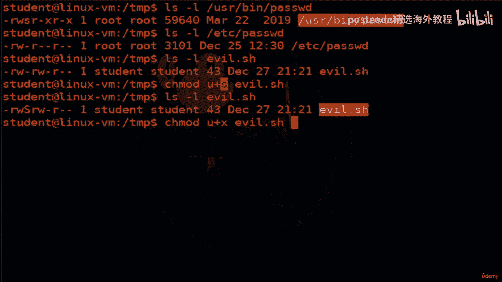

```bash
ls -l /usr/bin/passwd
```
输出可能类似于：`-rwsr-xr-x. 1 root root ...`
这里，所有者的执行位位置是 `s`（set UID）。这意味着当任何用户执行 `passwd` 命令时，该程序会像由 `root`（文件所有者）运行一样获得权限。这是必需的，因为 `passwd` 需要修改 `/etc/shadow` 文件（该文件通常只有root可写）。

我们来看看如何设置SUID位。假设我们有一个脚本 `evil.sh`。

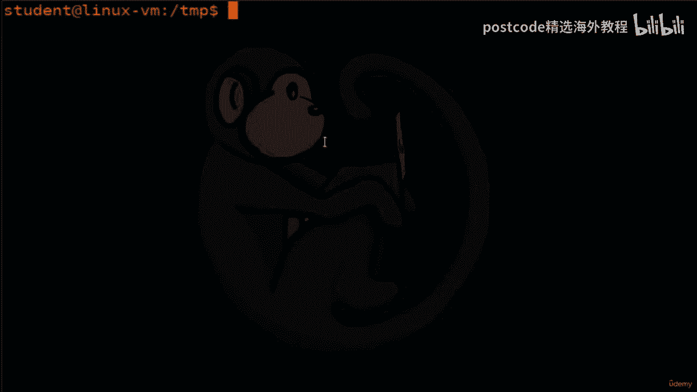

```bash
# 查看文件当前权限
ls -l evil.sh
# 设置SUID位 (u+s)
chmod u+s evil.sh
ls -l evil.sh
```
设置后，您可能会看到权限显示为 `-rwSrw-r--`。注意，这里是大写 `S`。这是一个警告：SUID位已设置，但文件本身的**可执行位（x）并未设置**。SUID位需要在可执行文件上才有意义。

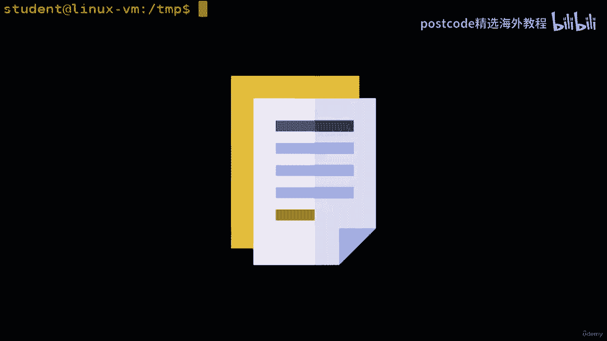

```bash
# 首先为文件所有者添加可执行权限
chmod u+x evil.sh
ls -l evil.sh
```
现在权限应显示为 `-rwsrw-r--`（小写 `s`）。这意味着 `evil.sh` 文件已设置可执行位，并且设置了SUID位。当有人运行它时，它会以文件所有者（例如student账户）的权限执行。

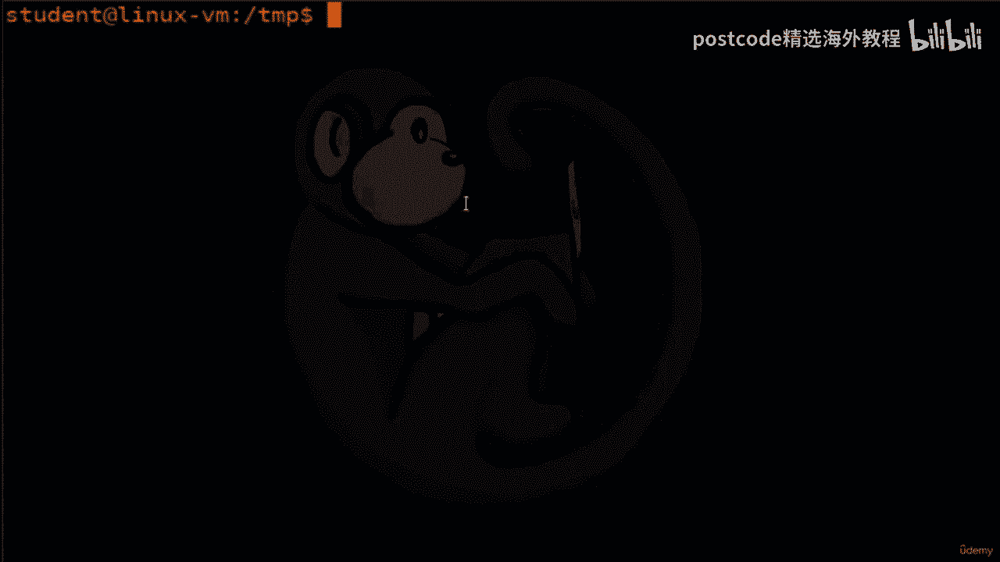

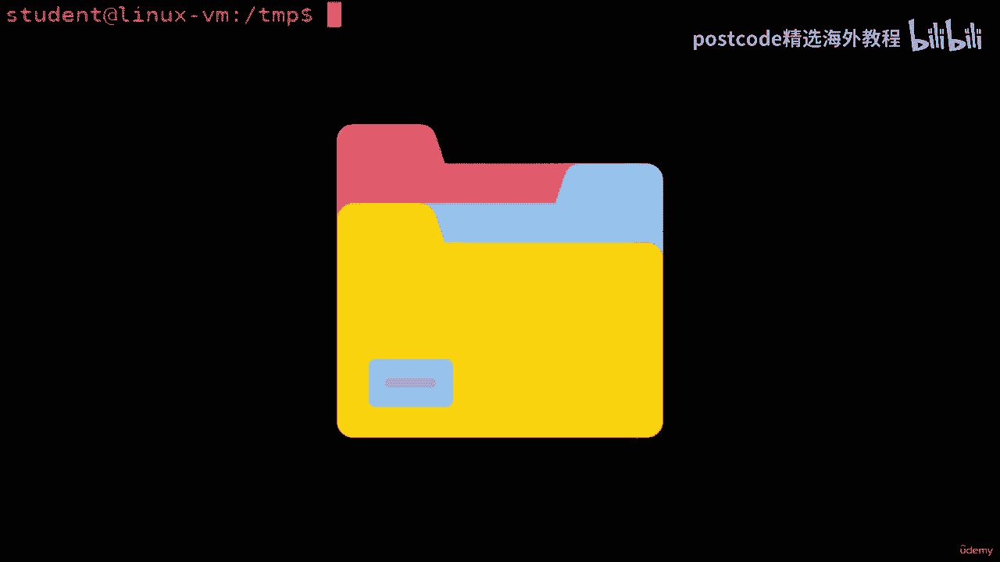

> **注意**：SGID位（`g+s`）原理类似，它使程序运行时具有文件所属组的权限。当应用于目录时，SGID位会使在该目录中创建的新文件自动继承目录的组所有权，而非创建者的主组，这对于团队协作目录非常有用。


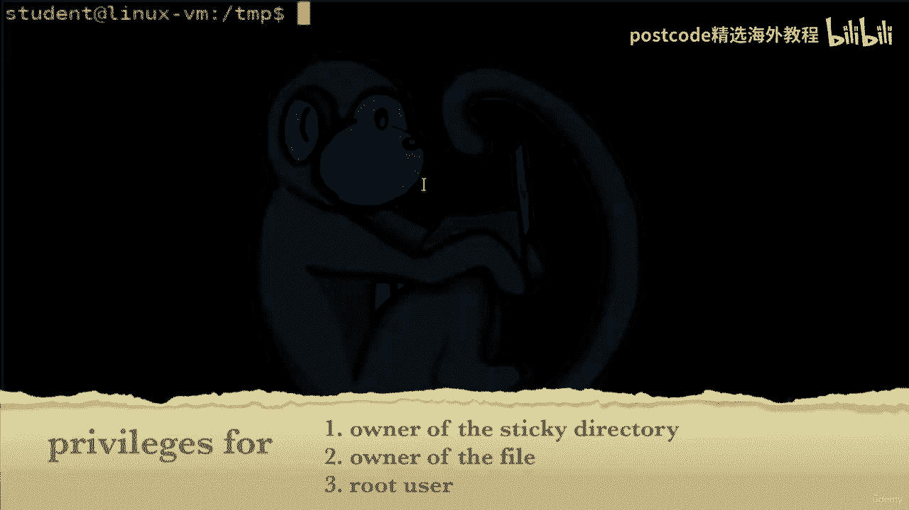

## 粘性位（T）

对可执行位的最后一个特殊修改是字母 `T`，它代表粘性位。

*   **当粘滞位应用于文件时**（主要在传统Unix系统上），其作用是将程序的映像保存到交换空间中，以便运行时加载速度更快。然而，出于我们的目的，**Linux内核实际上忽略了文件上的粘性位**。
*   **当粘滞位应用于目录时**，它会设置所谓的“限制删除标志”。这意味着将阻止非特权用户删除或重命名该目录中的文件，除非他们是以下三种身份之一：
    1.  文件的所有者。
    2.  目录的所有者。
    3.  超级用户（root）。

这对于像 `/tmp` 这样的共享文件夹非常有用，每个用户都可以在其中创建文件，但只能删除自己的文件。

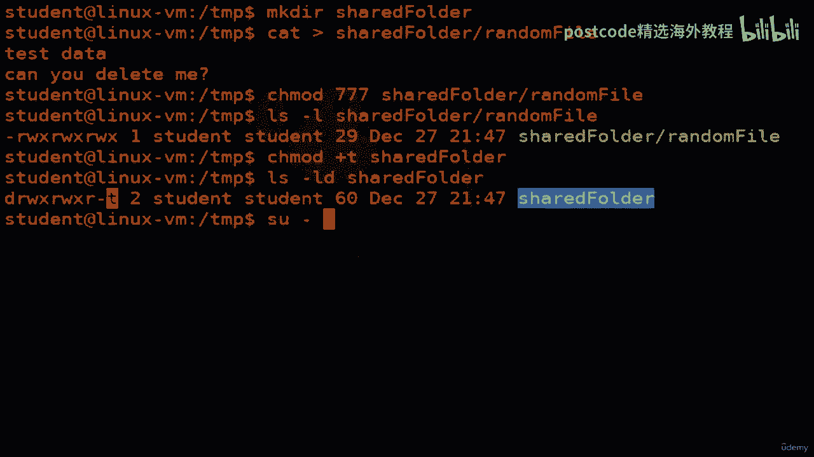

让我们查看 `/tmp` 目录的权限：
```bash
ls -ld /tmp
```
输出通常为 `drwxrwxrwt`。最后的 `t` 就是粘性位。

我们来演示其作用：
```bash
# 创建一个共享文件夹和一个文件
mkdir shared_folder
touch shared_folder/random_file
# 给文件赋予所有人完全权限
chmod 777 shared_folder/random_file
# 为目录设置粘性位
chmod o+t shared_folder
ls -ld shared_folder # 查看目录，确认粘性位已设置
```
现在，切换到另一个用户（如Erin）：
```bash
su - Erin
cd /path/to/shared_folder
cat random_file # 可以读取，因为文件有读权限
rm random_file # 尝试删除
```
尽管Erin对 `random_file` 拥有完全的读写执行权限（777），但删除操作会被拒绝。因为文件所在的目录设置了粘性位，而Erin不是该文件的所有者、目录的所有者，也不是root。

---

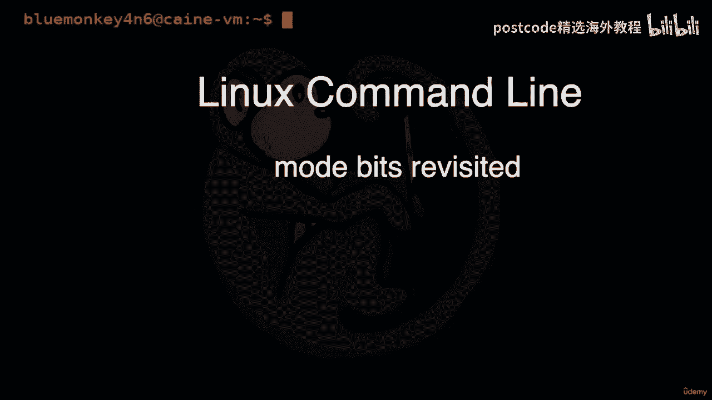

本节课中我们一起学习了Linux中的三种特殊模式位：特殊执行位（X）、设置用户/组ID位（SUID/SGID）以及粘性位（T）。这些位提供了更精细的文件系统访问控制和特殊功能，是进行高级系统管理和准备RHCSA/RHCE认证必须掌握的知识点。理解它们在不同上下文（文件 vs 目录）下的行为，对于维护系统安全和实现特定工作流程至关重要。