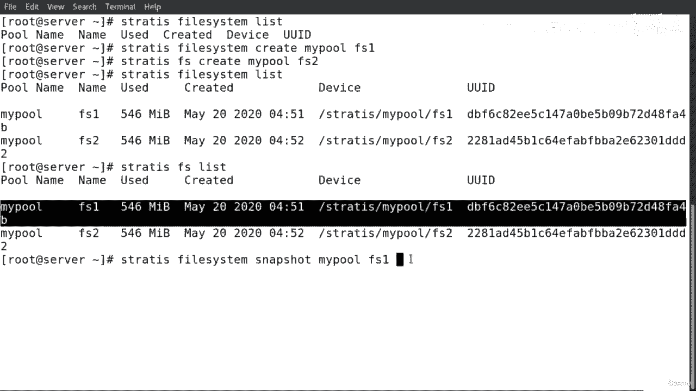
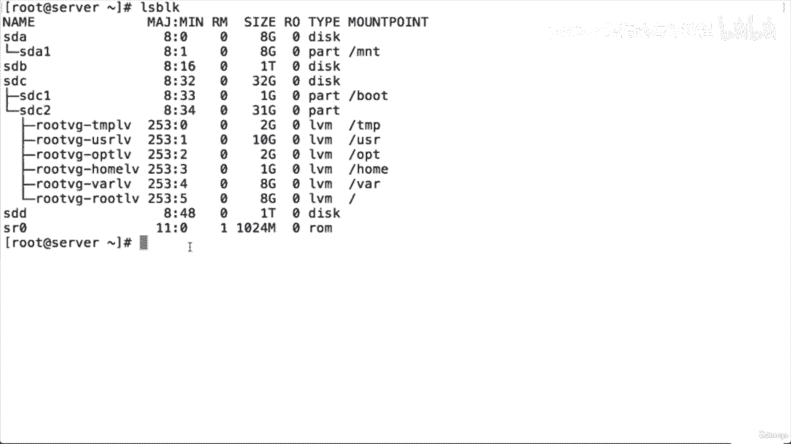

# 红帽企业Linux RHEL 9精通课程 — RHCSA与RHCE 2023认证全指南 - P48：04-04-024 Storage managements - 精选海外教程postcode - BV1j64y1j7Zg

大家好。在这个演示中，我将向您展示如何创建标准分区。第一个提示，我需要检查绘图设备列表。所以我要运行命令并阻止。正如您在这里所看到的，我们有块设备。例如，左侧是 SDB、Sdhc 和 SDD。

我将使用这个块设备来创建标准分区。如果我想使用命令块运行选项，我可以运行此选项 dash dash FS 以便，显示有关块设备的更多信息。例如，我们有文件系统类型。我们这里有标签、UID 和挂载点。

所以这里的想法与块设备相关，同样的事情也与挂载点相关，即，以slash boot为例，这里是与块设备或者分区相关联的。所以在这里，正如你所看到的，SD有两个分区，即SD一和SD二。因此。

对于 SDB 这个分区，我将创建三个分区。

现在让我们继续下一步。第二步，我将运行命令 f disk 以创建标准分区。如果该命令操作磁盘分区表。所以我要先打字。我要输入 LS 块。正如我所说，我将使用这个块设备，SDB，所以 f 盘。

然后斜杠 def 斜杠 SD，B 斜杠。所以这个块，SDB 位于斜杠 def 之下。所以我们必须写下整个路径并按回车键。因此，如果我们想获得更多信息或帮助，您可以在这里查看。如果我们要输入em。

如何使用磁盘中的命令。这里的 is 是帮助输入的缩写。您可以看到我们有这些字母，我们可以使用这些字母，例如，如果您愿意，可以使用 DH，确定分区日期。L 小写列出分区类型中的 no。

如果我想添加一个新的分区 p，如果我想更改分区表 t。

分区类型。我们这里最重要的是两种类型。

我们有 W，此 W 将表写入磁盘并退出，CU 退出而不保存更改。因为我要创建一个新分区，所以我要输入 N。进入。我将在这里使用默认值。首要的。是的。我也将在这里使用默认值。默认一。是的。

这将是显示第一个部分的第一部分。我不会输入任何内容，因为它将从第一个扇区开始分区，然后，设备。但是，在最后一个扇区中，我必须指定大小才能创建该分区。所以我要在这里输入加上 500 兆。

我们可以看到这里是加上大小和数字。然后我可以选择其中任何一个。千字节、兆字节、千兆字节或太字节，然后我按 Enter 键，然后按 P 键以引入表分区，桌子。

所以你可以看到我们这里的第一个分区是 V 分区。现在我要创建另一个分区。默认？是的。这是主要的。是的。默认两年是第二个分区。第一部门好。因此，第二个分区的第一个扇区将在最后一个扇区和第一个分区之后开始。

我要按回车键。现在我要提到的是，第二个分区的大小也是 500 兆，按 Enter 键。我会说是的。然后进行打印，正如您在此处看到的那样。我也有 PSDB，我们可以在这里看到大小和类型。现在。

我要做的就是创建第三个。所以第三个分区，三个。是的。因此，法国扇区和第三个分区将在最后一个扇区和第二个扇区之后开始，分割。现在，我还将为第三个按回车键的大小指定 500 mega。我将删除签名。

因为它有五个系统。所以我不再需要那个文件系统了。所以我要删除它，然后输入 B，正如我们在这里看到的那样。所以我们对第一个、第二个和第三个所做的事情都被擦除了，因为它有一个文件系统。所以我删除了所有内容。

所以我刚刚创建了一个新的三个分区。正如我们在这里看到的，我们有 SDB 1、SDB 2 和 SDB 3。在我要保存之前的最后一件事是，如果我想得到我将获得更多信息。列出已知的分区类型。因此。

如果我想更改该分区的类型，我将输入 L。所以我要输入 B，正如您在这里看到的，如果我想更改它，这就是类型。所以我要，例如，我在这里，让我们改变它。我要把其中一个改为 85。

所以我要在输入 T 之前输入 T，所以我要在这里说，更改分区类型。所以我要输入 T，按 Enter 键，然后输入默认值。所以这是最后一个分区。第三分区是第三深。是的。然后我要输入代码 85。

按 Enter 键，然后按 P，如您所见，我们已将类型更改为，Linux 扩展范围。所以但我需要把它改回来。我只是给你一个例子，我们如何使用 T 和 L，所以如果你想获得代码，可以使用 L。

我们可以看到每个代码旁边的 。你可以看到是什么、是什么、指示或代表什么。所以我这里把它改成83。所以我要输入 tw Enter 表示默认的三年，然后 l 我要在 Enter 处输入 83，然后。

B 正如您在这里所看到的，我们已将类型再次更改为 Linux。现在我已经创建了三个分区。下一步。我需要看看我是否会再次参加比赛，如果我不知道如何发球和退出。

正如您在这里所看到的，写入 table to exit 到办公桌并退出。如果我想退出而不保存更改，那么我要输入。问：但在我们的例子中，我要打字。

W，然后按 Enter 键。正如您在这里所看到的，分区表已处于警报状态。这意味着我们已经为其创建了三个分区。

所以我要仔细检查一下。莉兹·布洛克。如您所见，我们有三个新分区。SDB一是DB二是DB三。我们这里有尺寸，让我们看看这里的 dash dash FS。正如我们在这里看到的。

我们将为这三个分区创建一个文件系统。但在我们这样做之前。还有第三步。我将运行 power toprobe 命令以通知操作系统分区表，变化。我们需要这样做是为了告诉系统，操作系统，我们已经做出了更改。

分区表。因此，我将输入部分内容，然后输入设备 SDB。按回车键。现在我们已经运行了这个命令。我们现在可以进行第四步了。现在我要运行MC MC五系统。我就在那之前去。Lf ls 看一下，正如你所看到的。

LS 看，达什。Dash 正如您在这里所看到的，我们没有这三个分区的文件系统，所以我要，为这三个分区制作一个文件系统。

所以我将运行命令 make file system 来为这些构建一个 Linux 文件系统，分区。然后我将输入 T 作为类型二，告诉系统该文件系统的类型是什么，我们要为这个分区构建吗？

然后我将输入我想要分配给该分区的文件系统类型。例如，斜杠斜杠是DB 1。所以，正如您所看到的，我将先创建文件系统，然后创建 T 以便分配该文件系统，键入此源、此分区，我将按 Enter 键。

正如您在此处看到的，我们为此分区创建了一个 500 MB 的新文件系统。现在我要为下一个做这件事。MC 对于我们的系统仪表板。然后我将使用此处的文件系统类型 x 4，这次我将为 SDB 2 执行此操作。

按回车键。完美的。现在我要做最后一项。破折号 T，则类型 xf 则为斜杠 def 斜杠 SDB 三。按回车键。完美的。我将创建一个无屏幕块。短跑。Dash FS 正如我们在这里看到的。

我们为这些分区创建了五种系统类型。

现在让我们继续吧。第五步是什么？第一步？我需要添加新的分区和文件。这是一个文件斜线etsi。削减每一步，所以我需要在这个文件中添加新分区，以便在启动时标记它们，并根据需求。

所以这个文件斜线Etsy斜线ff步骤是一个文件，是一个包含所有变量的系统配置文件。以及可用的磁盘和磁盘分区。每当我们添加新磁盘或重新分区和现有磁盘时它们的选项。我们需要修改这个文件。

如果我们想修复与分区或设备关联的数量。让我们想象一下我们想要建造房子。所以我认为该设备。所以我要回去向你们展示我在说什么。我们看看吧。所以，正如我所说，让我们想象一下我们想要建造这座房子。

所以我认为这里的设备是db。是房子。我认为这里的分区是DB 1、DB 2和SDB 3。我认为这些是房子内的房间。所以现在我有了房子和房间，我需要为这些房间创建门。所以首先，我将创建目录以便。

让我们进入这个分区。因此，正如我们在这一侧看到的那样，如果这里没有鼠标，我们将无法访问这些分区。这样我们就有了房间。现在，我要制作门以便进入这些隔断内部。这就是我们需要添加安装的原因。这个分区在斜杠内。

什么斜线 Etsy 斜线 F 是步骤。但在开始之前，我将创建三个分区。所以我要添加这三个分区并添加斜杠挂载。它只是空的。所以第一个是 Linux，下一个是空的，然后下一个是数据库完美的。

第三个斜线安装斜线网络。正如我们在这里看到的，它进入 CD 斜线 MT 的次数较少。你可以看到我们现在有三个目录我要添加这些门 CD CD。

所以我看到了 LS BLOCK 所以我创建了这三个目录所以我要挂载，以便访问这些分区。所以我需要进入 vim、斜线 Etsy、斜线 F 停止的五个屏幕。我将在这里添加一个新行。因此，在添加新行之前。

让我先解释一下。例如，年份有什么属性？第一个是安装设备。例如，我想挂载到第一个分区的挂载设备 def 斜杠 SDB 一个。这是安装设备。现在下一个，我要做的是安装。指着门。所以我这里有房间。

现在我已经把房间想了。对不起，门。那个房间的门。所以我要输入该目录。所以第一个目录将是 Linux。完美的。现在，第三个选项是文件系统类型。因此，我们知道第一个分区的文件系统类型是 x DT 3。

那么我们有，选项。这是第四个字段是金额选项。通常我们会保留默认值。那么我们这里有两个值。两个数字。我们有备份操作。它用于倾倒或利用。如果它是一，那么转储机构应该、应该或应该备份一个分区（如果它是零）。

您不必备份分区，因此我将其保留为零。现在，正如我们在这里看到的，第二个值是文件系统检查顺序。所以我们进行了文件系统检查。当我们要重新启动系统时，分区设备是否在启动时出现错误，如果有。

如果设备或内部有任何问题，此文件将通知我们。所以存在三个值。如果我要输入零，则意味着不检查。你不知道。如果有订单，则不要检查是否有订单。首先检查分区。如果是两个，那么接下来检查分区。所以我要把它留为零。

这是第一部分，现在我们已经为第一个分区创建了挂载。现在第二个分区，我将使用标签。这是另一种方式。顺便说一句，我们可以使用。该设备或我们可以使用标签或第三个。我将把它用于第三个分区。我要使用 u u。

我应该是大写的uu i。D 。所以我们有三个。我们可以用于设备或安装设备的类型。我们可以在此处使用设备名称，也可以使用标签或您的用户 ID。我仍然需要创建 UID 并且需要复制。

所以我仍然需要创建标签并且我要，复制第三个的 UID。所以我只是为了节省，我会这么做。我将首先保存此文件，然后返回此处完成并填写其余部分，的选项。按 Enter 键。现在，如果我想创建标签。

我可以运行此命令 e 来添加标签。然后我将输入分区名称。这是B二号。我说过我要用 SDB 2 的标签。然后是空间。我将称之为标准。标准。标准。我将称之为标准。所以我要这样称呼。

参与者或者我要给这个分区标准一个标签。按回车键。完美的。现在对于第三个分区，我要做什么，我想获取 UID，所以我要输入，命令块 ID，如您在此处看到的，这是第三个分区，这是该分区的 UID，第三个分区。

所以我将复制引号之间的数字。我要复制这个。如果我想生成。你是新人吗？使用此设备的 ID。我可以这样做，你你我然后杜松子酒，它是生成的，然后设备的名称是，三。就进入了，正如我们在这里看到的。

我们已经生成了一个新的 UID，所以我将使用这个。我无法再使用旧的 UID，因为我现在已经生成了一个新的 UID。那么我们这里有标签标准，我们有什么？我们有这个 UID 只是为了仔细检查和 TT。

正如你在这里看到的，我们已经使用过这个，门，Linux。现在我们必须使用数据库。我们还需要使用这里的网络。所以我们将使用数据库，我们将使用网络。所以我要再次回到斜线 Etsy 斜线 f 步骤内。

点击此处输入标签。我要输入站立污垢标准。我要在这里给出金额。所以这里是金额设备。然后我们还要看金额点。所以我要把它交给数据库。我们知道该数据库的文件系统类型为 x， t， x， x， t 四个。

然后我们将输入默认值。然后在这里，我将把它保留为零。按回车键。我不会只去这里。那我就来贴一下。好的。我就在这里做。我不知道我是否只是。请仔细检查一下。我将把 UUID 粘贴到这里。完美的。

然后我要把它们打印出来。然后点和t。所以这里的最后一个门或者最后一个目录就是网络。然后是文件，这个分区的文件系统类型是x，f，s。然后我们将设置默认值。然后我要输入零零，然后点击“我要在此处保存文件”。

是的。要仔细检查。所以我要输入命令，告诉 Dash，然后输入三个。那么这是第一步。正如我们在这里看到的那样。

这是矿井。但我的观点是，我们将它们添加到第五步中。

所以配置文件。我也将使用该命令。LZ块。终于。看，破折号。达什是。正如我们在这里看到的，我们有文件系统类型和分区。然而，即使我们创建了挂载点，我们仍然需要执行最后一步。

我们需要将建立在磁盘上的文件系统挂载到Linux的三巨头结构中，文件系统。写在法令下。好的。我要去Mount Dash a。这是为了所有人。如果有任何订单。

它会向我们显示是否有斜杠、etsy 斜杠和费用选项卡内的订单。我要按 Enter 键，这样我们就找不到 UID，所以我要先解决这个问题。所以我们将执行块 ID，正如您在此处看到的那样。

所以我要把这个复制到这里。再次。我将详细介绍每一步。只需仔细检查即可。是的，我要在这里改变这一点。我们要在这里更改这一点。然后我就通过新的了。我想再次保存该文件。回去吧，然后我要输入自己的破折号。

进去了？是的。完美的。我们现在没有错误。我要输入LZ BLOCK Dash，dash FS。正如我们在这里看到的，我们有金额。所以这里是金额点。他们的意思是，看看他们之前向你们解释过什么。这是门。

这是门。为了什么？对于房间。这就是房子。如果我愿意的话。未标记。任何一个。让我进去一下，比如这里，vim 斜线 Etsy 斜线 F 一步。例如，这是这里的最后一个分区。如果我想取消标记这个。

所以我只想添加哈希表，我必须在这里再次保存文件，然后我回到这里，我必须做什么，我说没有标记。所以这个命令将挂载设备文件系统。所以命令是 mount 然后 def s dx b 3 然后我按回车键。然后。

如果我想再次检查，让我们阻止 dash dash fs。正如我们在这里所看到的，我们不再需要为该房间安装订购门。如果我想把它退回来，也很简单。我只能返回到文件，斜杠etsy，斜杠f步骤。进入这里。

我将删除这里的哈希值，我将在这里再次保存文件，然后，我要为所有人完成一英里短跑。然后看，破折号就像你在这里看到的那样，我们再次得到了金额点，希望是这样。

清除。我希望我解释了有关如何使用创建标准分区的所有概念，磁盘。然后，我们使用栏来支撑，然后我们如何将这些安装添加到斜杠上，如果，我们停下来。在我结束本次会议之前，我还有最后一件事要说清楚，你们想一想。

那。我认为这是一款设备。它就像一所房子，而这个就像一个房间。为了进入这个房间，我们需要一扇门，一个目录，以便访问这个，分割。我们的会议到此结束。谢谢您，下一课见。大家好。在这个演示中。

我将向您展示如何创建分区。超级空间的主要目的是成为RAM内存充分利用后的第二内存，并且系统需要更多空间。当我们安装Linux操作系统时，操作系统会创建一个交换空间并，该交换空间将用作虚拟内存。

如果我想列出系统中的交换，我可以运行命令 cut斜线 proc斜线交换。正如您所看到的，到目前为止我们有一个用于交换的分区。此外，还有另一个命令免费破折号。您可以在这里看到我们有棉签和尺寸。这是一千兆。

另外，如果我要运行 LZ 块，我可以看到拭子位于设备 ISDA 下方。如果我迈步，斜线 Etsy 斜线内也会有一个金额点。现在我想创建一个交换分区。我要使用这个设备。我还有空间，我已经使用了 1。5。

所以我可以使用 1 GB 进行交换。所以我要创建一个新分区。所以它将是 DB 4。所以我将使用 f desclash deflashdb，按 Enter 并创建。所以我将使用初级。是的。

第一个扇区将在最后一个扇区和分区三之后开始，因为这个扇区将，是一个可供a进入的分区。现在，正如我所说的，我要去的最后一个部分。为该分区分配 1 giga pi，然后按 Enter 键。是的。

正如我们在这里看到的，我们创建了一个新分区，类型是 Linux。我可以更改类型，这样如果我想将其更改为这样，我可以输入 L。例如，Linux swap 82，所以我可以输入 HT 然后输入 82。不。

不。这是分区的默认设置。是的。代码将是 80 来按回车 p。正如我们在这里看到的，在我创建这个分区后，我们已将类型更改为 Linux 交换分区，需要保存。所以我要写一个出口。现在下一步是什么？

我需要使用该部分进行探测，以便通知操作系统分区表的更改。所以部分 prop 所以实际上是 f 斜杠 sd 输入。完美的。现在下一步，我将按照我们所记得的那样运行 make swap。

正如我们在 中所解释的那样。上一届会议。如果我想格式化或分配文件系统，我将使用 MC 文件系统，但对于，交换 我将使用 MC Swap。然后在那之后，如果我想给这个标签一个标签，我可以给一个标签。

但它会，为大写。L 我将把这称为交换。然后我将为其分配设备 SDB。然后我要按回车键。完美的。我们创建了一个新的交换分区。现在我需要这样做。目前。让我检查一下这个清单。看，破折号，破折号。

所以正如我们在这里看到的，五个系统的分区都为SDB进行了交换并且它有一个交换标签，并且它还有一个 UUID。但我们仍然需要在斜杠 etsy 斜杠 f 标记内分配金额点。

所以 Etsy 斜杠 f 就是点击 Enter。我要创建一个新的。就像现在一样。我将使用标签并交换。在挂载点之前我不会使用斜杠 def 斜杠 SD。

所以我的观点是我将要使用的内容我将输入 swap 因为我们不会创建，任何仅用于交换的目录。我们要进行右交换。这是针对金额点的。那么，什么是文件系统类型交换呢？然后就是下一个选项了。这将是默认值。完美的。

然后在零零之后我点击“跳过”保存文件“是”。

仔细检查直到负数。然后 ATC f 的最后一行是点击回车。这是我们在其中添加的行。如果是点击配置文件来挂载交换分区。所以现在添加之后，我们需要安装它。破折号 802 输入清除屏幕。

让我们先按回车键来阻止破折号。不。添加之后我们需要做什么。斜杠、斜杠、Etsy 斜杠内的挂载点每一步。我们需要执行一个步骤。我们需要启用此交换。所以我要做的就是运行命令 swap。

然后我将使用仪表板脚来显示有关您的内容的更多信息和详细信息，将要做。然后斜线def，斜线SDB。供她进入。完美的。清除。然后按回车键进行交换。正如我们在这里看到的，我们有一个新的交换分区。完美的。

我们看看吧。短跑。我们可以在这里看到 Dash FS，现在我们有了挂载点。所以我们不需要忘记在金额之后以及在我们添加和配置之后使用交换，文件斜线etsi 斜线f etab。所以我们需要运行这个命令。

交换一号。例如，如果我愿意的话。禁用交换。还有另一个命令称为交换关闭。但在此之前，让我向您展示这个命令，斜线书只是为了仔细检查这里的拭子。完美的。所以我们这里有拭子，然后是免费的破折号蚀刻。

如果我们记得的话。

我们以前的尺寸。我们曾经有 1 GB。现在我们有两个，因为我们创建了一个新的交换。所以我们需要交换。还有这个选项。这是Sdx，这是现在的摘要。我想使用交换关闭。那我就得用了。冲刺脚以便。

关于我要做什么的信息比现在 def sd b for h inter c swap off 更多的信息要少。请记住，我们曾经不得不这样做，然后我将自由奔跑。但现在我们有了一个。

如果我想在 dash se 上运行交换，请按 Enter 键。如果我要在破折号 v 上返回交换分区，那么我们只有一个交换分区，然后是交换分区的名称。

是 B 表示点击输入完美自由破折号 h 和剪切斜线书交换点击输入。正如您在这里看到的，我们有两个交换，现在我们还将这个交换添加到前一个交换中，现在我们的总大小是在破折号上交换的。正如您在这里所看到的。

我们已经将此交换添加到池中。我要运行评论区。

我在这里看到的厨师，一切都很好。所以我们有两个交换，这个交换的总大小是两个演出。我们的会议到此结束。谢谢您，下一课见。

大家好，这个表里的大家，我来给大家展示一下如何创造物质价值。团体价值。一个逻辑值。使用逻辑卷管理提供标准分区的主要优点是调整大小、增加，或者减少逻辑分区也没有任何问题。在创建任何内容之前。

我将运行命令 LZ block 以检查列表，我的系统上的块设备。按回车键。正如您在左侧看到的，我的系统上有所有块设备，我将使用，这个块设备。SDC为了创造物理价值、群体体积和逻辑价值。所以第一步。

我需要创造一个物质价值。我们可以在设备上创建物理价值。或者在分区上。这次我将在这个设备上创造物理价值。SDC 所以我要打字了。P。五、，然后创建该设备的名称或路径。按 Enter 键。

正如您在这里所看到的，我们已经成功地创造了这个物理价值。现在，如果我想显示有关系统物理值的信息，我可以运行命令，pv作为a进入。如果我想获得更多信息和详细信息，还有另一个命令 PV 显示，这。

关于物理值。这是我的系统。因此，如果我要按 Enter 键，它会向我显示有关这两个的所有信息，物理价值。但我只想输入特定的物理卷，然后按 Enter 键。正如我们在这里看到的。

我们获得了有关该物理值的所有信息。您可以在此处查看物理卷大小。

这是两千兆。现在第二步。我必须创建一个价值组。所以为了创造一个价值群体。我们需要根据物理价值来创造它。所以我会将卷组视为单个存储。因此，在这个示例或这个主题中，我们创建了一个物理对象。价值。

现在我们将在该物理值上创建卷组。所以我要输入命令 Fiji。斐济创造。那么我将称之为1v1空间。那么什么是物理体积呢？这是设备斜杠 def 斜杠 SDC 按 Enter 键。正如我们在这里看到的。

我们已经成功创建了一个卷组。如果我想显示有关卷组和我的系统的信息，我可以输入 vgs set Enter，我还可以使用此命令 v display。如果我想获取有关特定卷组的所有信息。

例如 v1i 可以按 Enter 键，正如我们在这里看到的那样。仅规定有关此值组的信息。我需要创建第三步。一个逻辑值。因此，在此示例中，我将创建两个逻辑值。为了创建这两个逻辑，我需要将它们进行分组。

所以我们一步一步来。物理价值。那么价值群体呢？逻辑值。因此，我将在值组上创建逻辑值。因此，我将输入命令 LV create，然后用破折号 和 来指示该逻辑的名称，价值。所以我将其称为 LV 下划线系一。

然后是空格。现在，如果我要使用小写字母，我需要使用小写破折号 l。这意味着我需要指示卷容器上剩余空间的百分比，团体。但我将使用大写字母来设置固定大小。因此，我将为该卷组分配 1 GB。不仅仅是逻辑值。

然后我必须输入国际米兰价值组的名称。是的。完美的。现在，如果我想检查一下是否。正如您在这里所看到的，我们创建了哪一个？逻辑值，我需要创建第二个 live create dash。

所以我将把这个称为 LV 下划线第二部门。然后让我使用，我将使用小写的破折号 l 来表示百分比，的剩余空间和。值组。所以我要输入 100，然后是百分比，然后是大写字母，然后是变体的名称。

组我按 Enter 键。是的。现在我将输入 LVS，因为我们可以在这里看到我们所做的事情。我们回到这一点。我们已将该值组中剩下的任何内容分配给逻辑值。这就是我留在那里的内容。

我们已将其分配给第二个逻辑值。现在第一步，我们需要做的是，我们需要运行 make 5 系统命令来构建，Linux 文件系统。因此，我们需要将其格式化为逻辑值，并为这两个逻辑值创建一个文件系统。因此。

在开始之前，我将列出 block、dash、dash FS。正如您在此处看到的，我们没有该工具的任何文件系统，因此我将运行命令，在F。S，那么我可以这样做，或者我可以这样做 e xd for。

然后我将输入 diff，然后输入卷组的名称，然后输入逻辑值的名称，进入。完美的。对于第二个，我将做同样的事情。唯一的区别是我只需输入 t he st 并回车即可。完美的。现在我要运行命令。LS锁。短跑。

短跑。FS 正如我们在这里看到的，现在，我们为这两个系统提供了五种系统类型。知道她可以。卷。现在，在我们创建了物理组和卷组以及我们需要的逻辑卷之后，到。建立一个山点才能进入这两个神奇的山谷。

所以我们有设备，也就是房子，这里的逻辑卷。我们可以将它们视为房间。现在我们必须创建门才能访问这两个逻辑卷。所以我要少去这个目录，这样我就不会在这里创建两个目录，第一部门和第二部门。

正如我们在这里所看到的。为了赚到钱，我现在创建了两个目录。所以接下来的事情或者第五步，我需要补充一下。新的逻辑卷。并斜线 Etsy 斜线 fa 步骤以创建安装点。或者。

我将在此处输入金额设备 def view one。然后 lv 在部门一下划线。那我就必须这么做。输入我们要分配给该逻辑值的安装点，并将部门分配给一个五系统，xg4则默认。所以默认C然后零零。下一篇。

我将使用 UUID。让我先保存文件，然后再回到这里。听着，我想在这里做这个，所以我要复制这个。你的身份证。我会再回去。

Crest 现在是安装点部门，然后输入默认的文件系统类型。

零零。我们已经做了X。

转到命令 til 减去最后两行。每一步踏入。正如我们在这里看到的，这是我们添加的两行并将其放在配置文件中，为了在这里建立挂载点，但我们必须运行命令 mount 来仔细检查，一切安好。

然后我们可以创建挂载点，按回车键。完美的。我们没有收到错误。所以我要在这里再次运行命令。正如我们在这里所看到的。在这里我们得到了这两个逻辑值的挂载点，如果我想获得更多信息。

关于这里的坐骑，我可以获取握把，然后坐骑可以从这里获取有关坐骑的信息，设备。这是我们之前创建的分区，这是我们创建的两个逻辑卷，在本次会议中创建了它们。我们的会议到此结束。谢谢您，下一课见。大家好。

在这个演示中，我将向您展示如何使用 Mount Command。还有你登上指挥部。首先，我将运行命令。让我们使用 block 来列出系统上的块设备。正如我们在屏幕上看到的，我有分区和逻辑卷的数量点。

在系统上。如果我还想查看点数，我可以显示系统配置文件的内容，斜线etsi斜线F步。另外，我们可以看到这里有挂载点。对于系统上的分区和逻辑卷。有一点非常重要。我们需要了解它。如果我想永久保留安装点。

那么我必须将安装点写入，系统。配置文件斜线etsy斜线如果我一步。现在让我们举一个例子，如果我想做一个临时安装点。那么这样的话，如果是临时的，那么挂载点和系统配置我就不用写了。

归档斜线 Etsy 斜线选项卡。所以我要修改文件，斜线 Etsy 斜线步骤，并且我要评论这一行。所以我不会。使用此分区的永久安装。斜杠 def 斜杠是 DB 之一，也是为此。

逻辑值 斜杠 斜杠 v 一 斜杠 LV 下划线 部门一。我现在要保存文件。清除。因此，我将运行命令 mount，然后握紧并清空。那么现在我们做了什么。我不想做安装。

与斜线 Etsy 斜线 FS 选项卡分开。所以我需要安装。逻辑值和分区。所以我要输入你安装的命令。斜线 def 斜线 sd 可以一键输入。现在我必须这么做。你的坐骑。为了什么？对于逻辑值。

所以我必须复制这一行。所以这就是诞生的逻辑还有另外一条路。我可以用这个。LV 下划线系一。是的，因为这两个文件都指向相同的逻辑值。所以我现在要按 Enter 键。我将通过握力和空来键入安装。

正如我们在这里看到的，我们不再有这两行：分区和逻辑值。只是为了确认一下，让我们阻止按回车键。我们没有逻辑值和此分区的安装点。现在，如果我要为分区和逻辑分区做临时安装点。

value 我要输入 mount 然后输入 def，我们将从分区 def 斜杠 SD B 一开始，空间。现在我必须先写安装点，所以先写设备，然后写山点 M 和 T，然后。

这是 Linux 我按下 Enter 键，我现在要为逻辑卷执行此操作。所以肯定。我可以做这行也lv下划线部门一然后我们需要写山点。所以斜线t斜线。部门。什么？按回车键。现在我要清除屏幕。

LZ BLOCK 正如我们现在在这里看到的，我们有逻辑值的临时安装点，也用于分区。有一点非常重要。关于临时的。山点。如果我现在要重新启动系统。我将失去临时安装点。所以这真的非常重要。

保存山点和系统配置文件斜线Etsy斜线F是。如果我们不想失去山点的话。我们需要了解这一点。为我们的未来提供信息。如果我们想创建一个临时熔点，那么我们需要了解是否要重新启动，系统，那么我们就会失去山点。

所以我现在要做的就是取消临时山点的映射以进行永久山点，再次山点。所以我要清除屏幕，安装五个手柄并输入。我们有这个，还有这个。所以我要先挂载斜杠def斜杠SDB，然后按回车键挂载斜杠def斜杠。

我可以做得更好。VG一。强调愿景一破折号 LV 强调部门一。我们制作了另一个文件来安装斜杠斜杠v一个斜杠LV下划线部门。这两个文件都指向相同的。要输入的逻辑值。没有多少管夹是空的。正如我们所看到的。

我们没有逻辑分区的安装点。再次。所以我现在要做的 vimla​​shetsyslashf 现在点击回车，我要取消注释，这两个文件很好。现在我要保存文件。清除。下一步是什么？我打算去做。

在那之前我要先数一下。我要少做一点。阻止只是为了仔细检查。所以我们这里不再有 Mountain Point，因为我做了什么，我删除了临时的。所以我要输入 mount a。

我已经将其添加到斜线 Etsy 斜线内的山路中。如果我按回车键开始，然后清除屏幕和此块。正如我们在这里看到的，我们有分区的山点和逻辑值。我们的会议到此结束。谢谢您，下一课再见。大家好。在这个演示中。

我将向您展示如何减少和扩展逻辑值。我还将向您展示如何扩展团队价值。最后，我将向您展示如何消除物理值大师值。一个逻辑值。在我要创建任何东西之前，我将运行命令 elves，正如我们在这里看到的。

这是我们创建的两个逻辑卷。而且，我可以输入命令。我们看看吧。正如我们在这里看到的，这是设备，这是两个逻辑值和金额点，对于这两个逻辑卷。所以第一个例子我要减少这个的逻辑值，LV下划线部分，一。

然后我将把 LV 下划线部分扩展到你可以看到这里是这个逻辑的大小，value，这也是第二个逻辑值的大小。所以我将减少这一点并延长这一点。但在执行此操作之前，我将计算两个逻辑值的总和。因此。

我将输入 mount斜杠 def 斜杠编号，然后输入 v 1。Dash LV 强调了第一部门，我将对部门做同样的事情以进行双重检查。我们看看吧。正如我们所看到的，我们不再有逻辑卷的数量点。现在。

我们要做的就是减少这一点。LV 减少然后我将使用选项 l 即大写的 l。因为我们要使用reduce，所以我必须输入减号，然后我要reduce，例如，600兆字节。然后我必须使用选项破折号或。

这将减少文件系统的下划线和逻辑值。然后我必须输入逻辑值的路径。五、一。然后斜线。L 在输入时在部门 1 下划线。现在就要决定了。你可以找到他，埃尔维斯。正如您在此处所看到的。

我们不再为该逻辑卷提供 1 GB 的空间。所以我可以在这里仔细检查签证是什么。正如你所看到的，我们现在有 600 的自由尺寸，现在我要使用这个，600 并将其分配给该逻辑值。所以我现在要使用范围。最后。

我们延长命令。然后我将使用小写 l 因为我想分配此处剩下的内容和卷组，到这个逻辑值。所以我要使用plus。这样我们就知道这里和reduce的区别了。我已经使用了减号，对于扩展。

我将在数字或大小之前使用加号。然后我要输入 100。以及百分号可用空间。不要忘记破折号是为了调整底层文件系统的大小以及逻辑值。然后死亡联盟一刀又一刀。我将在此处输入此内容，并在第二部分下划线。

我要按回车键。我要去LVS。正如您在这里所看到的，我们已将 LV 下划线部分的逻辑值扩展为 I&#39；m go，如您所见，我们在此价值组中没有免费尺寸的电梯。现在，在下一个示例中，我将扩展值组。

维希一号为了用这个新尺寸。扩展到逻辑卷。我们看看吧。如您所见，我们有一个可用磁盘。我将使用这个单个磁盘将其分配给这个卷组。正如我所说，我将添加一个新磁盘作为存储设备到卷组中。这是我们了解的重要一点。

所以我们认为卷组就像一个单一的存储，我们可以添加许多设备，该卷组中的存储。是的。然后我将使用命令 VGextent，我将扩展这个卷组。然后我必须输入磁盘名称或路径斜杠def斜杠SDD按回车键。

正如我们在这里看到的，我们现在有 1 GB。可供该卷组使用。现在我要做一个X精灵。我将把它扩展到逻辑值。所以我要输入实时范围。然后对于第一个，我将使用固定大小，因此我将使用大写 L 加 700，兆字节。

然后破折号，或者我们不要忘记破折号 R 以便一起调整底层文件系统的大小，与逻辑值，然后是该逻辑值的名称或路径。第一部门进入完美状态，我现在要在接下来的一年里做到这一点。我现在就要使用。如果我离开怎么办？

让我检查一下这里。是的，正如你在这里看到的，如果我离开这里怎么办？我想将其分配给部门。听到lv下划线部到了这么l的程度。小写 l 那么我们就不会忘记它下面的加号和百分号。

然后我们不要忘记 r def vg1。然后斜杠 lv 下划线第二部分。有时这条路径可能行不通，所以我们可以使用另一条路径。斜线 def 斜线映射器 斜线 v 1，然后破折号 LV。下划线部门为。

但我们会在这里尝试。有效。所以我们可以双向走，因为有两个浴室或主管浴室，主管可以指出，相同的逻辑值。清除屏幕 LVS 和 V gs。正如我们在这里看到的，我们已将其大小扩展到逻辑值，我们可以看到卷。

团体。我们这里没有剩余尺码，该值组中没有剩余尺码。最后一个例子我要删除一个删除物理值和增长值以及逻辑值，价值。所以在这种情况下，我将从底部开始移除。到顶部。想输入这个命令只是为了解释一下。

因此，我将首先开始从逻辑卷中删除，然后是卷组，然后。

这。物理价值。如果我们记得我们做了什么，最后一个就是。并决定我们如何创造物质价值和价值。以及逻辑值。我们必须从我们所做的开始创造。从顶部到底部。这里的情况与删除相反。所以从下到上开始。

那么我首先要做什么。现在我就去。首先我必须去etsy斜线f站。我们已经做了这个金额。只是为了再次检查一下我们可能不会在这里这样做，所以我们没有任何金额来原始，正如我们所看到的那样。

同样在我们将此磁盘添加到卷组之后。因此它也被额外扩展并使用 1 giga 来表示逻辑值。所以现在我们不需要让我检查这里的握把和空的，因为我们可以看到我们没有数量，观点。另外。

我们可以在这里看到我们没有这两个逻辑值的金额点。所以现在的第一个命令，我要做的就是斜线 ETSI，斜线 F 是点击，然后我要去，删除这两行。我可以删除它们，或者我可以。我知道评论太行了。

所以我不想再使用它们了。完美的。只需保存文件并退出即可。是的。我现在要首先删除逻辑值。定义 V 一。然后 LV 在部门一下划线。是的。还有第二个。完美的。是的。然后我们需要继续前进。

只需在这里仔细检查一下即可。我们可以看看我们是否不再有这两个逻辑值。所以我将继续讨论变体组。我需要删除卷组。那么我要输入什么。我们删除。一组删除，然后 v 一键输入 VG 作为点击输入。

我们不再有那个价值群体了。最后一步，这两个设备或块的物理值。所以我要输入 V 删除，然后输入磁盘，此处的磁盘槽或名称 SDC 和，定义 sd d。国际米兰，正如你在这里看到的那样。是的，正如您所看到的。

我们不再有物理卷了。我们来阻止吧。我可以看到我将清除屏幕，正如您在此处看到的那样。现在，我们有两个全新的磁盘。最后一件事，如果我还想使用这个命令的一部分，以防万一，通知操作系统我们已做出更改。那么如果。

SD inter l 看起来很完美。正如您在这里所看到的，我们现在没有这两个设备的任何逻辑卷，而且我们。

没有金额积分。我们的会议到此结束。谢谢您，下一课再见。大家好。在此演示中，我将向您展示如何创建和配置策略。使用 Stratis 管理分层存储是 ET 的新功能之一。

Stratus的好处是使我们能够配置高级存储功能，例如，池害虫管理，然后配置五个系统快照和监控。我们基本上可以将策略定义为一个存储池，其中包含一个或多个磁盘或分区，为了帮助我们管理和配置复杂的存储配置。

第一步。我需要在系统上安装 Stratus，因此我将输入命令并安装 strut test。然后，我还要安装我必须输入的另一个包破折号密封件。正如您在屏幕上看到的，我已经在系统上安装了 stratus。

以防万一我们没有安装，让stratus安装系统。因此，您需要运行此命令并安装这两个软件包。第二步，我要启用地表系统的两种状态层云。Enter 已激活并启用。完美的。我要进行第三步。

我将创建一个名为 my pool 的状态池。所以我将在这里使用两个块或设备将其称为我的池。所以我打算用这个来硬盘SD、C和D。我可以从单个设备创建一个战略池。我只能使用一台设备。但在这张表中。

我将在创建我需要的策略之前使用这两个设备，擦拭块或设备。所以我要运行命令，擦除 E F&#39；s，slash deflash SDC，我也可以为另一个执行此操作，磁盘SD它输入完美。

现在我将创建层云 stre，然后创建池。然后我将称之为 Stratus，我将称之为我的泳池。然后我将输入设备的名称。它是 DC，然后是 def SD，正如我们在这里看到的，命令 stratus。

然后拉取、创建。这就是我要为这个游泳池取的名字。我要把它称为我的泳池。然后我按回车键的设备。如果我现在想列出系统中的民意调查，那就是拉列表。正如我们在这里看到的，我们拥有刚刚创建的池，大小为 3 GB。

我还可以运行命令块，正如我们在这里看到的。我们将使用这两个设备。对于我们的搜索池。你可以在这里看到，这就是 Stratos。应用 Stratos 后，您可以在此处看到 Stratos。

这两个磁盘上的配置。现在让我们继续吧。第四步，如果它是 1 并且 F 是 2 和我的池，我将创建 2xf5 系统。所以我首先要输入命令 struts。五。系统列表。正如我们所看到的。

到目前为止我们还没有任何池，所以我将创建第一个池 stratis 5 系统，然后创建我的池。这是我们刚刚创建的池的名称。FS我先把第5个系统叫做。FS 一击回车。我也会做同样的事情。

我们可以在这里做一件事，而不是输入第一个系统，我可以输入 FS 这就像，文件系统的快捷方式，我将其称为 FS 2 现在进入我要，运行 Command Stratos 的五个系统列表。正如您现在所看到的。

我们刚刚在此处创建的池下有两个新文件系统。

我的泳池。如果我愿意的话。公平配置地创建快照，以便读取或写入文件系统的副本。那么我要做什么。首先我要输入战略家五系统。列表。正如你所看到的，我们没有。到目前为止的快照。

所以我要启动 Stratis 5 系统快照，然后是我的池的名称，然后是 FS1 这是我的，将为前五个系统创建快照（第一个），然后我将称之为快照 FS。

在国际米兰。我现在要清除屏幕，然后输入命令 struts，然后 F 以免我击中，进入。正如我们在这里看到的，我们有文件系统的快照。F 是一。现在，如果我想销毁我的快照。因此，对于我刚刚创建的新快照。

我将输入命令 stratus。然后五个系统破坏了我的池。然后啪。捕捉 FS1。PITTENGER：我将运行命令威胁列表，正如我们在这里看到的那样。

我们已经没有快照了。让我们继续。现在是最后一步。如果我要进行安装。对于五个系统。但在我们进行安装之前，让我们先做一下。将磁盘添加到现有池中。正如我们在这里看到的，我将此磁盘作为 DX。

我想将此磁盘添加到现有的，水池。所以我要输入 stratus，然后按 Enter 键拉出列表。正如我们在这里看到的，到目前为止我们有一个池，大小为 3 GB。现在。

如果我想将现有磁盘添加到 dispo 该怎么办？我要做什么。我要输入命令。斯特拉托斯。然后 Poole 添加了达世币数据，以便向现有池中添加另一个磁盘。然后是我的泳池的名称。所以这是我的泳池。绝对斜线。

Def 斜杠 sd e 按 Enter 键。然后我将运行命令 stratos pool list。正如您在这里所看到的，在添加另一个之后，我们将大小从 3 GB 增加到了 4 GB，磁盘到现有池。

我的池现在可以继续安装现有文件系统以便访问它们。我已经有了这个破折号斜杠。我的意思是我已经有了这两个目录。

存储一和存储二。所以我将使用这两个目录作为安装点。

我将永久进行安装。所以我是临时的。我将向您展示该命令，但我不会进行任何临时安装。如果您想做一个临时演示，可以使用此演示。所以你必须输入命令 mount，然后 stratis，然后削减我的池。

然后削减 FS 1。这是第一个。然后我们必须输入挂载存储，挂载点，正如我们在这里看到的那样，挂载然后是路径，文件系统的名称，然后是空格斜杠。这是挂载点，我们可以对 FS 2 和存储 2 执行相同的操作。

但这次我要为文件系统做一个永久且持久的安装点，FS为一，F为二。我们需要做的第一件事是，我必须获取五个系统中每个系统的 UUID。所以我要输入命令块 ID、破折号 p。

所以破折号 P 以便返回有关的信息，分区表类型。然后我要输入命令 space stratus，stratus，然后削减我的池，然后削减 fs one，因为我们想获取第一个的 UUID。

516 我按回车键。正如我们在这里看到的，这是前五个系统的 UUID，我将在这里做同样的事情，为文件系统更换器。正如我们在这里看到的，这是文件系统的 UUID。我现在要获得 uid 的版权。

对于 FS1。突然。首先它会将其遗弃到文件中。斜线埃西。斜线F步。因为我们要做永久持久的山点。因此，我们必须保存安装和系统配置，并在每一步中归档 ETSI 斜线。我将为这两个人做同样的事情。

我将复制此 uid，再次将其粘贴到斜杠 etsi 斜杠 f 步骤中。这是国际米兰的斜线 埃西斜线 f ef 刺向国际米兰。正如您在这里看到的，我们为您提供了这个。我们现在就开始安装吧。这是第一个安装点。

即存储。存储一，文件系统类型ZFS，然后默认。使用默认值，我们必须编写 x dash system dx system dx。那么这就需要平等。对表面进行压力测试。我们必须通知系统有关层云表面的信息。

我们要将其添加到文件系统中，或者配置文件系统斜杠etsi斜杠f estab然后零零我们要做同样的事情，这里的东西是第二个挂载存储，然后是ZFS，然后是默认值。打电话给我的前任。系统。

系统 D 则需要同等的最小量，表面。然后归零。我们必须保存文件。是的。再检查一遍。一切都很好 uid 数量点 x 如果 x 如果在此处的安装中。完美的。清除屏幕。但现在我们需要做什么。

我们需要在系统上注册新配置。所以我要运行命令系统。C Ctrl 要求破折号重新加载。我按回车键。我们等待以便在系统上注册新配置。完美的。然后我将运行安装命令。破折号，完美的。一切安好。因此。

只需仔细检查 Mount Pop Grip，然后 Stratus 按 Enter 键。

正如您在此处看到的，这是两个文件系统的安装点。

现在，如果我想移除地层拉力。我需要做什么。我必须开始从中删除。从底部到顶部。所以我需要做一个会计。然后我需要销毁文件系统。那我就得毁掉这个水池了。因此，我将在这里展示系统上的池。首先，我要展示游泳池。

如您所见，到目前为止我们只有一个池。那么我将在这里展示五个系统列表。我将只为我的游泳池做这件事，因为我已经有一个游泳池，如您所见。我们有两个五系统。现在，如果我要安装这两个。

我需要从斜线 Etsy 开始。因此，我将要么删除这两行的这两行，要么对它们进行注释。因此，我将进行哈希处理，并且我将对第二行执行相同的操作。我要保存文件。完美的。现在我要做一个量。

所以我们要在这里使用幽默。Stratus 削减我的池然后削减 fs 一击输入您标记为 FS 2。然后我将运行命令。我想评论一下这个，正如你在这里看到的，Mount Five Grip Stratos。

我们没有任何用于这五个系统的安装座。所以我们迈出了第一步。现在第二步，我需要摧毁这五个系统。所以我要做第五层系统，然后销毁。F是一。哦，我忘记写我的泳池的名字了。我的泳池，然后是一个，然后是第二个。

完美的。现在，如果我想检查我的池的状态文件系统列表，请按 Enter 键。我在该池内没有任何文件系统，但如果我要输入 Stratis 来获取 Stratis 池列表。正如你在这里看到的，我们有游泳池。

我要毁掉这个游泳池。我们在这个池中没有任何文件系统，所以我要输入 stratis。然后我要输入 pool。然后摧毁。然后是我的泳池的名称。按回车键。

我将运行 Command Stratos Pool 列表。正如您在这里所看到的，我们的系统上没有任何池。如果我单击屏幕，我将运行命令 else 块，正如我们在这里看到的那样。

现在，这些设备已被擦除并干净，我们对这些块设备没有任何压力。我们的会议到此结束。

谢谢您，下一课见。大家好。在此演示中，我将向您展示如何创建视频。视频是一个虚拟的数据优化器。它发生在可以节省磁盘空间并减少复制带宽的模块上。它还位于任何块存储设备之上，并提供零块消除重复数据删除。

冗余块和数据压缩。第一步。我需要在系统上安装视频包，因此我将在此处运行命令并安装，然后是视频，然后是 k 或 D 破折号 k 视频输入。我已经在系统上安装了这些软件包。如果您没有它们。

那么您需要运行此命令。第二步我要检查视频系统的状态。CTL 状态视频。Surface Center 处于活动状态，可以运行。如果它未激活，则需要运行命令系统。看，它将启动视频该服务。接下来。

我将使用块设备 s dx 创建一个名为 my video 的视频。因此，我将驱动命令 video space， create space dash dash name equal。

我将把这个视频称为我的视频空间破折号设备。然后等斜线def斜线SDD空间破折号破折号视频逻辑那么大小相等的大小将是十兆兆，但中心。接下来，我需要注册新的 ATM 服务。所以你活着。亚当安顿下来。接下来。

我将运行命令和 kfs 来构建 Linux 文件系统。所以时间必须是 x fs 然后破折号大写 k。我将使用大写 K 这个选项来指示命令不要丢弃块，在创建文件系统期间。

我将输入路径斜线、斜线映射器、斜线我的视频，然后进入下一步。我要做一个永久的或持久的金额点。那么让我们看看这里。正如我们在这里看到的，我们没有磁盘速度的数量点。所以我将首先创建目录并添加斜杠和 T。

然后我将调用该目录，我的视频中心。现在我要修改系统配置文件，斜杠，etsi，斜杠F步骤我要添加，这里有一条新线。所以首先，安装设备映射器削减我的视频，然后接下来是安装点，安装削减我的视频。

然后文件系统类型为 ZFS。然后是默认值，逗号 x。破折号系统 d 则荷兰要求要求等于 v 做该表面。然后归零。我得把罚款存起来。现在，在我要保存文件之前，只需按系统类型检查安装设备安装点。

这里我们需要在系统 DX 表面上注册视频。完美的。所以告诉 dash 和 mine，然后削减每一步。完美的。现在我要做的就是在系统上注册新配置。所以我要运行命令系统。Ctrl，达蒙，破折号，重新加载。

因此，我必须运行此命令才能在系统上注册新配置。然后我需要尝试将安装座弹到此处。我将运行命令 mount pipeline grant 我的视频。正如我们在这里看到的，这是挂载点。看，Dash Dash。

正如你在这里看到的，这是挂载点，这是文件系统，类型。

如果我想检查卷视频的状态。当前文档视频统计信息。正如我们在这里看到的那样，进入的视频集。这是我们系统上的视频。还有另一个命令我们可以运行 def dash t。痒。我们可以在这里看到。这是他们的视频。

设备SD。现在让我们继续下一个概念，如果我想在创建后删除视频，视频。所以我们需要从下往上开始。当我们创建视频时，我们必须从上到下开始。我们必须安装。然后，检查表面。然后我们需要创建视频并添加永久挂载。

然后运行挂载命令。现在我们必须从下到上开始。所以我们需要先挂载。性病。所以这里我要每一步修改斜线DC斜线。所以我们有这条线。要么我删除这一行。你只需去看幻灯片，或者我可以评论这一行。这里这个。

我要评论这一行。我不会删除该行，所以我要尝试一下。散列并保存文件。所以别抢我的视频。所以我要让你安装这个。所以你安装slash deflash恶意软件并将我的视频进行双重检查。完美的。

我们已经没有坐骑了。来说说灰脸。我们这里已经没有坐骑了。接下来，我需要停止视频，因此我将运行命令。视频。那么停下吧。短跑。破折号名称等于我的视频点击输入。如果我想停止所有视频表面，还有另一个命令。

所以视频就停止了。冲刺，冲刺。我不会发表评论。只是如果您想停止所有视频。我们已经有了一个。现在我要删除该视频。所以视频。删除破折号。破折号名称。平等的。我的视频，Enter 已被删除。在这个街区完美。

正如我们在这里看到的，我们不再有视频了。块设备上是到期的。我们的会议到此结束。

