# 红帽企业Linux RHEL 9精通课程：P48：04-04-024：存储管理 🗂️

在本节课中，我们将要学习在RHEL 9系统中进行存储管理，包括创建标准分区、交换分区、逻辑卷（LVM）、使用Stratis管理分层存储以及配置VDO（虚拟数据优化器）。我们将从基础概念开始，逐步深入到高级存储配置。

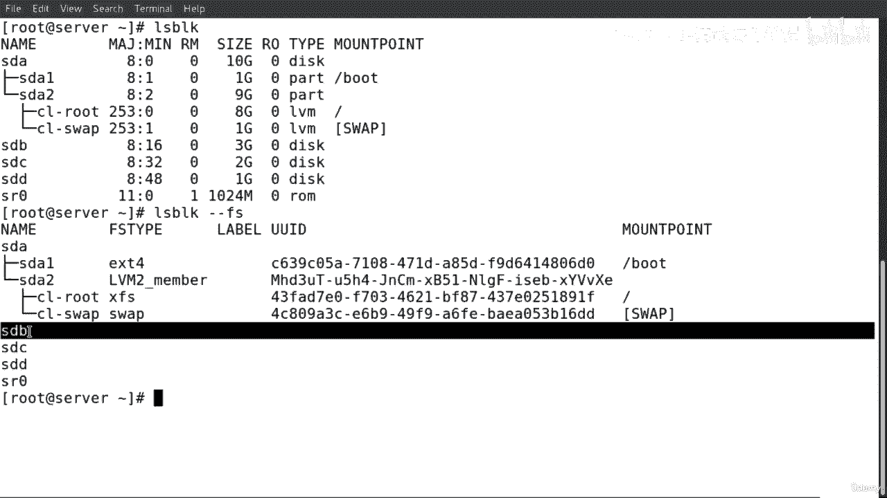

## 创建标准分区 💾

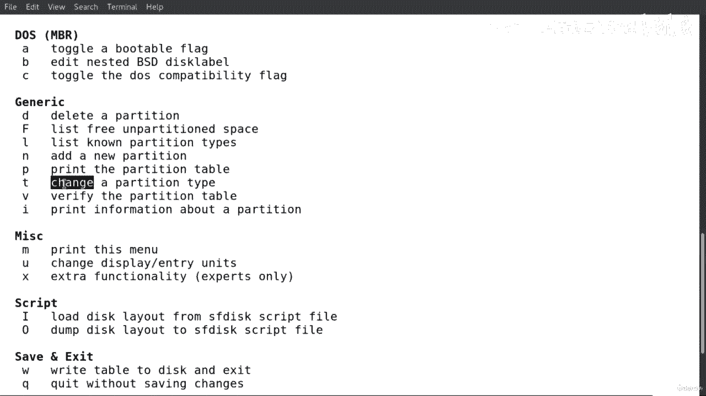

上一节我们介绍了课程概述，本节中我们来看看如何创建标准分区。标准分区是Linux系统中最基础的存储管理方式。

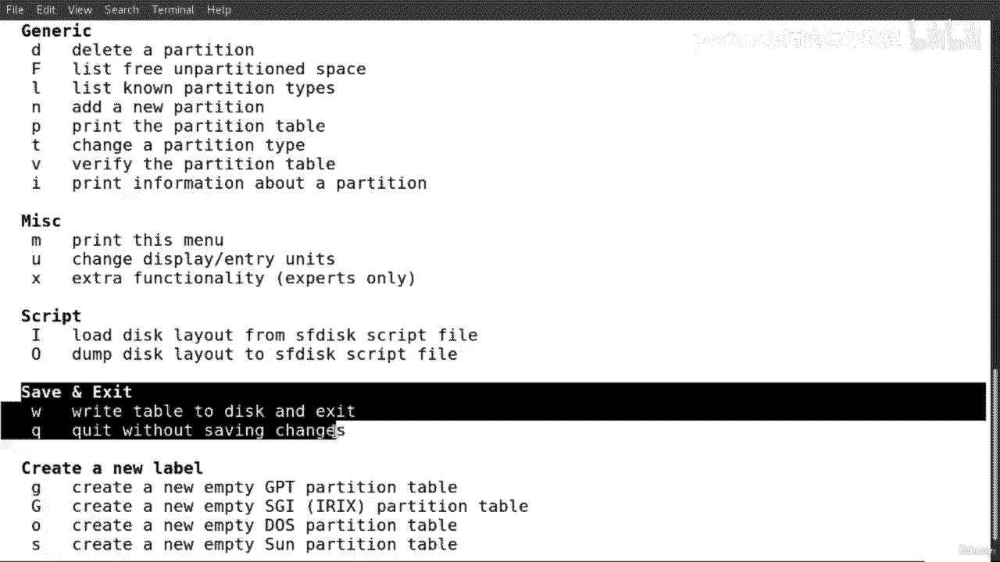

首先，我需要检查系统中的块设备列表。运行命令 `lsblk` 可以查看所有块设备。

```bash
lsblk
```

输出会显示类似 `sda`、`sdb`、`sdc` 这样的块设备。我将使用 `sdb` 设备来创建标准分区。如果想查看更详细的块设备信息，可以运行 `lsblk --fs` 命令。

```bash
lsblk --fs
```

这个命令会显示文件系统类型、标签、UUID和挂载点等信息。挂载点（如 `/boot`）是与块设备或分区相关联的访问入口。例如，`sda` 设备可能包含 `sda1` 和 `sda2` 两个分区。

接下来，我将使用 `fdisk` 命令来操作磁盘分区表。首先，输入 `fdisk /dev/sdb` 进入交互式界面。

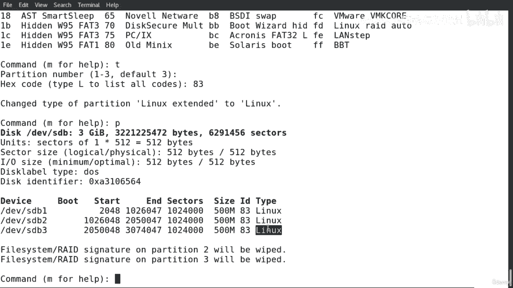

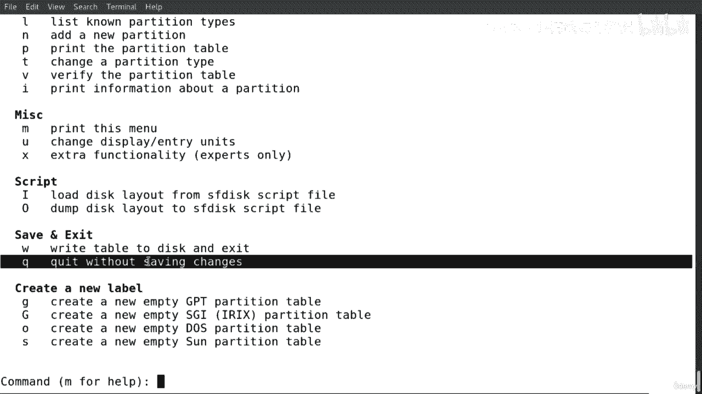

```bash
fdisk /dev/sdb
```

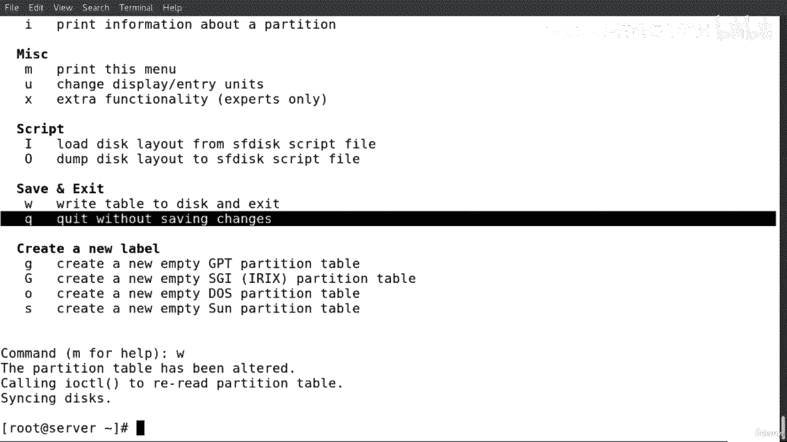

在 `fdisk` 界面中，输入 `m` 可以查看帮助信息。以下是创建分区的主要步骤：

1.  输入 `n` 创建一个新分区。
2.  选择分区类型（主分区 `p` 或扩展分区 `e`），通常使用默认的主分区。
3.  指定分区编号，使用默认值即可。
4.  指定起始扇区，通常使用默认值。
5.  指定分区大小，例如 `+500M` 表示创建一个500MB的分区。

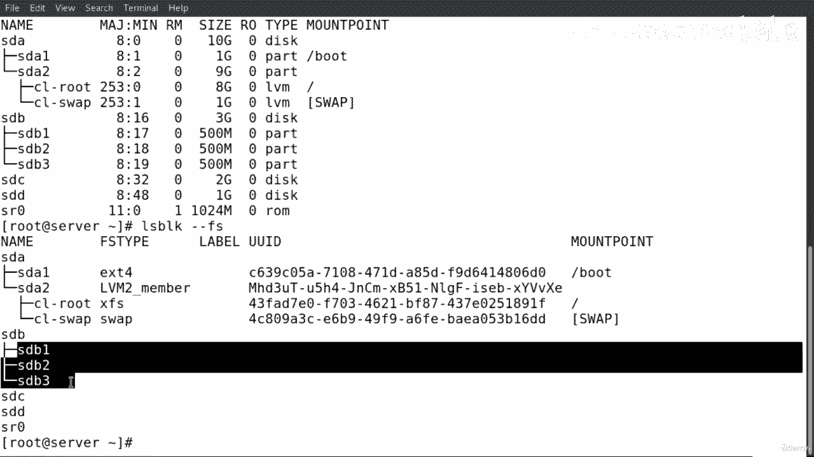

创建完成后，输入 `p` 可以打印当前的分区表进行查看。重复以上步骤可以创建多个分区。

如果需要更改分区类型（例如改为Linux交换分区），可以输入 `t`，然后输入对应的类型代码（如 `82` 代表 Linux swap）。输入 `l` 可以列出所有已知的分区类型代码。

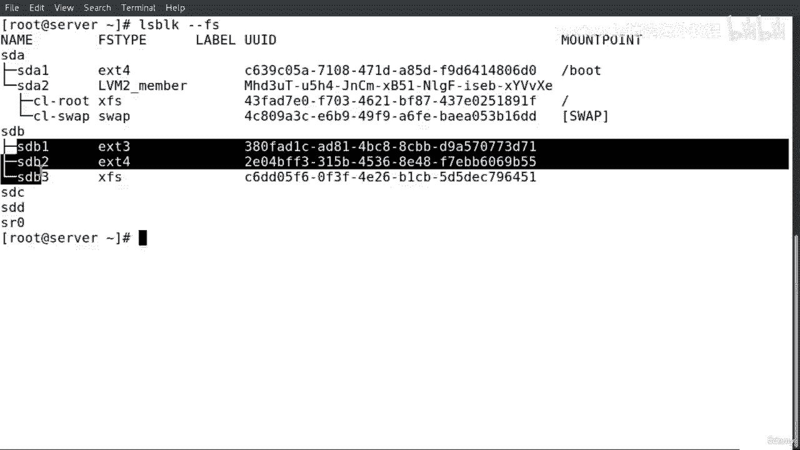

所有操作完成后，输入 `w` 将分区表写入磁盘并退出。如果不想保存更改，则输入 `q` 退出。

创建分区后，需要运行 `partprobe` 命令来通知操作系统分区表已更改。

```bash
partprobe /dev/sdb
```

接下来，需要为新建的分区创建文件系统。使用 `mkfs` 命令，并指定文件系统类型。

```bash
mkfs -t ext3 /dev/sdb1
mkfs -t ext4 /dev/sdb2
mkfs -t xfs /dev/sdb3
```

创建文件系统后，需要将其挂载到目录才能访问。首先创建挂载点目录。

```bash
mkdir /linux
mkdir /database
mkdir /network
```

然后，需要编辑 `/etc/fstab` 文件，添加永久挂载配置。这个文件包含了系统启动时需要挂载的所有设备和分区。

以下是 `/etc/fstab` 文件条目的格式说明：
*   **挂载设备**：可以是设备路径（如 `/dev/sdb1`）、标签（`LABEL=standard`）或UUID（`UUID=xxxx-xxxx`）。
*   **挂载点**：分区要挂载到的目录路径。
*   **文件系统类型**：如 `ext4`、`xfs`。
*   **挂载选项**：通常使用 `defaults`。
*   **dump**：备份标志，`0` 表示不备份。
*   **fsck**：文件系统检查顺序，`0` 表示不检查。

编辑完成后，运行 `mount -a` 命令挂载 `/etc/fstab` 中所有未挂载的设备。

```bash
mount -a
```

最后，可以使用 `lsblk --fs` 命令验证挂载是否成功。

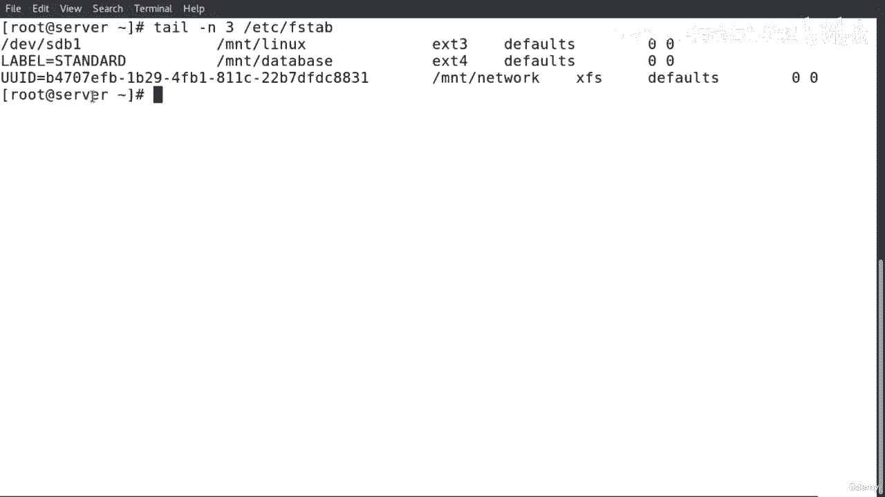

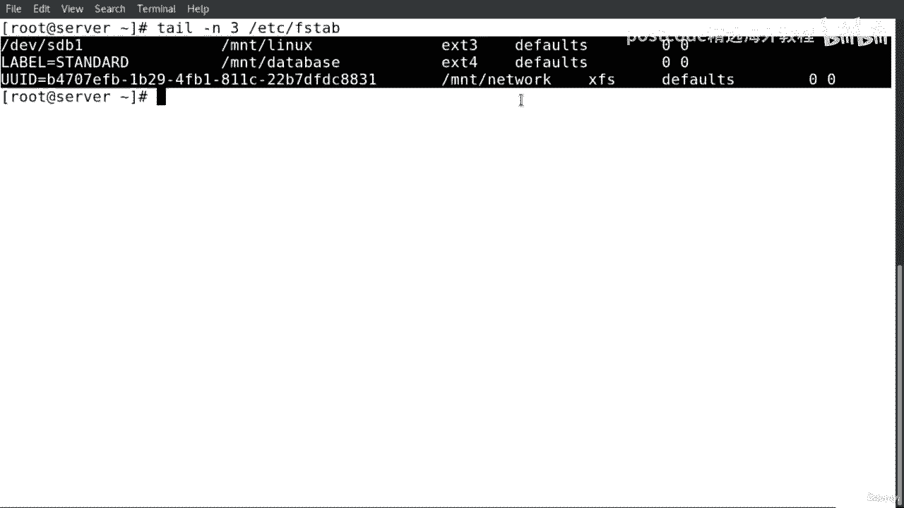

## 创建交换分区 🔄

上一节我们创建了标准分区，本节中我们来看看如何创建交换分区。交换分区在物理内存（RAM）用尽时充当虚拟内存，为系统提供额外的运行空间。

首先，检查系统中现有的交换空间。可以使用 `cat /proc/swaps` 或 `free -h` 命令。

```bash
cat /proc/swaps
free -h
```

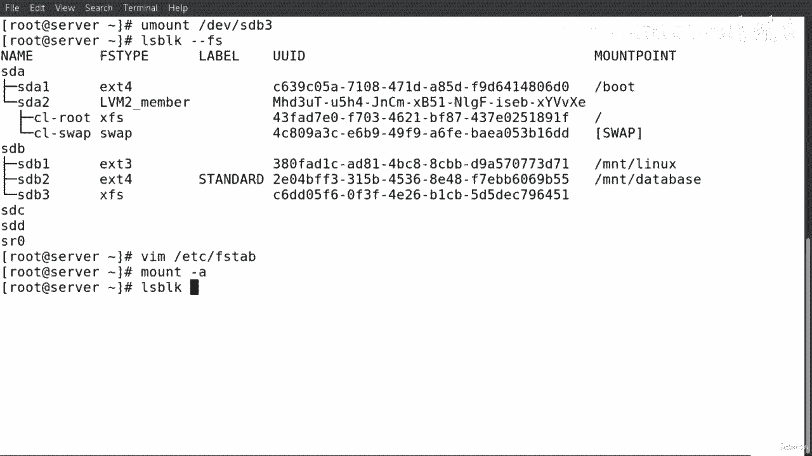

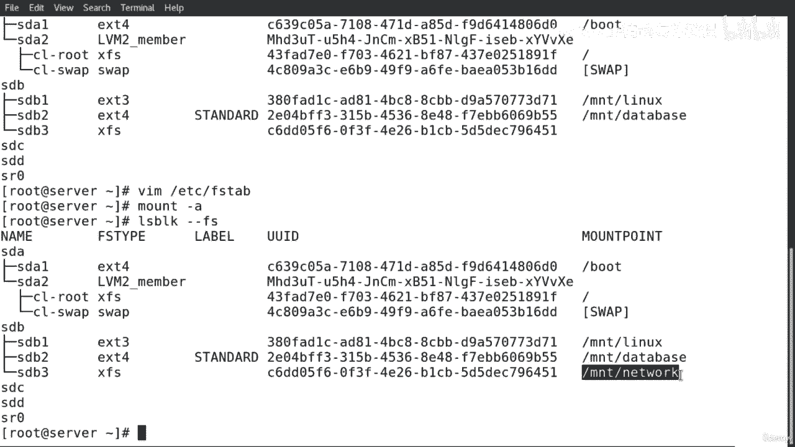

假设我们使用 `/dev/sdb` 设备，并已有一个分区 `/dev/sdb4` 可用于交换。使用 `fdisk` 进入该设备，创建一个新分区（例如 `/dev/sdb4`），并将其类型更改为 `Linux swap`（代码 `82`）。

```bash
fdisk /dev/sdb
# 在 fdisk 交互界面中：
# n -> 创建新分区
# t -> 更改类型 -> 分区号 -> 82
# w -> 保存并退出
```

保存更改后，运行 `partprobe` 通知系统。

```bash
partprobe /dev/sdb
```

接下来，使用 `mkswap` 命令格式化该分区为交换空间，并可以为其设置一个标签。

```bash
mkswap /dev/sdb4
swaplabel -L myswap /dev/sdb4
```

然后，需要编辑 `/etc/fstab` 文件，添加交换分区的配置。挂载点填写 `swap`，文件系统类型为 `swap`。

```
LABEL=myswap swap swap defaults 0 0
```

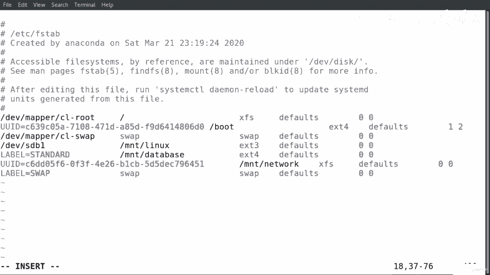

添加配置后，使用 `swapon` 命令激活新的交换分区。

```bash
swapon /dev/sdb4
```

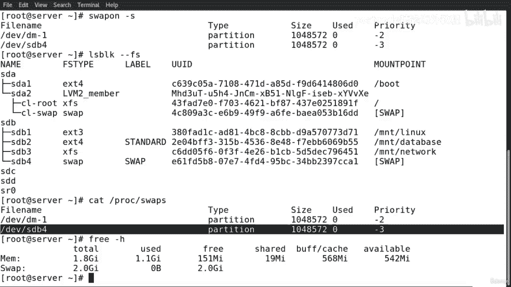

使用 `swapon -s` 或 `free -h` 命令可以验证新的交换空间是否已添加成功。如果需要临时禁用交换分区，可以使用 `swapoff` 命令。

```bash
swapoff /dev/sdb4
```

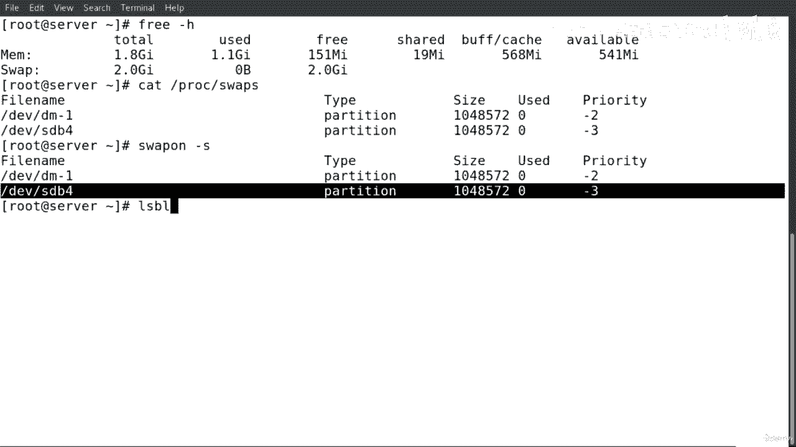

## 管理逻辑卷（LVM） 🧩

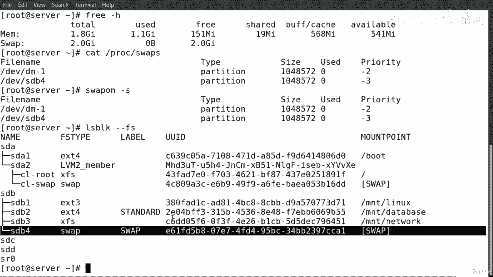

上一节我们配置了交换分区，本节中我们来看看逻辑卷管理（LVM）。LVM的主要优点是可以轻松地调整逻辑分区的大小（增加或减少），提供了比标准分区更灵活的存储管理方式。

首先，检查块设备列表，我们将使用 `/dev/sdc` 设备。

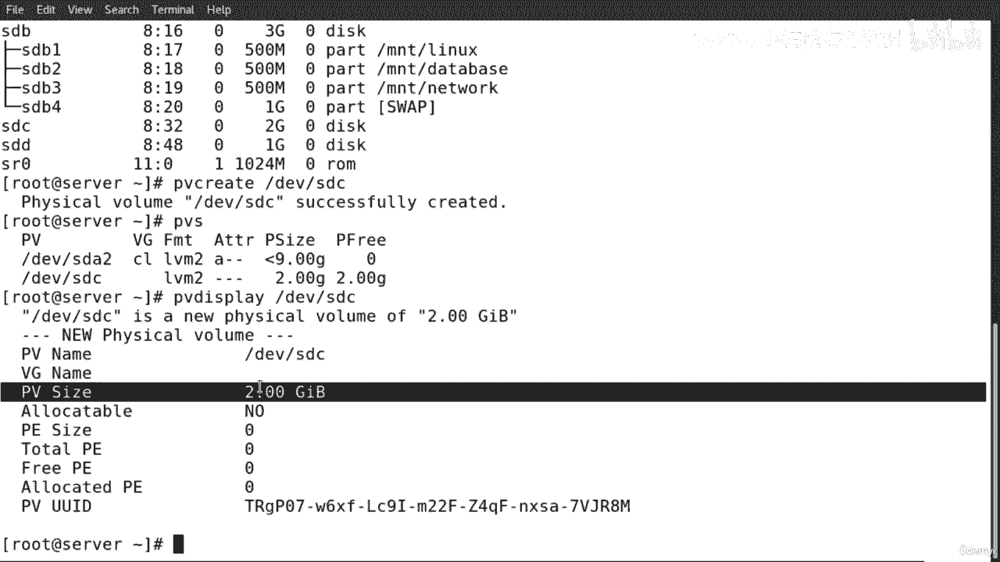

```bash
lsblk
```

LVM的创建过程分为三步：物理卷（PV） -> 卷组（VG） -> 逻辑卷（LV）。

**第一步：创建物理卷（PV）**
在设备或分区上创建物理卷。

```bash
pvcreate /dev/sdc
```

使用 `pvs` 或 `pvdisplay` 命令查看物理卷信息。

**第二步：创建卷组（VG）**
卷组由一个或多个物理卷组成，可以被视为一个统一的存储池。

```bash
vgcreate vg1 /dev/sdc
```

使用 `vgs` 或 `vgdisplay` 命令查看卷组信息。

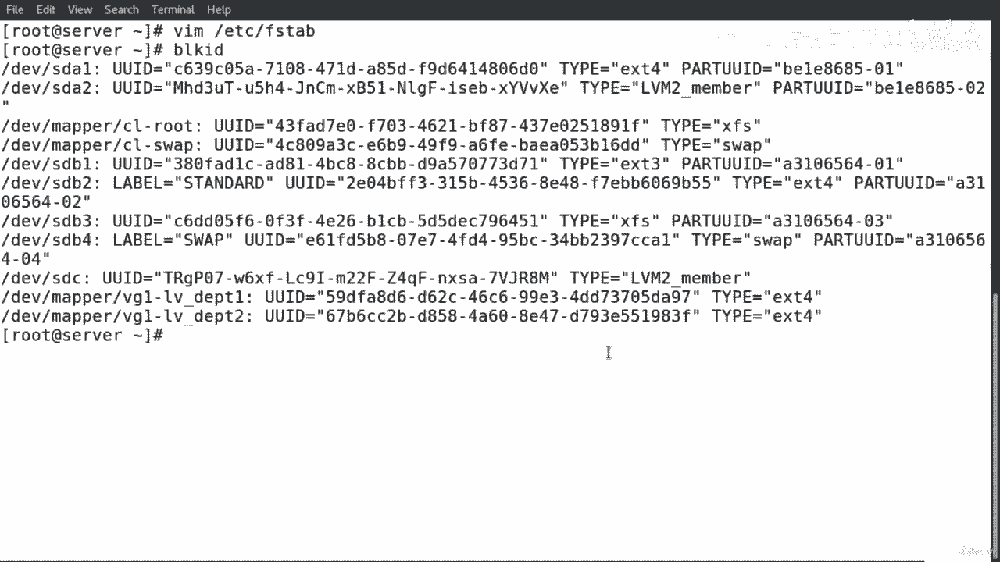

**第三步：创建逻辑卷（LV）**
在卷组上创建逻辑卷，可以创建多个。

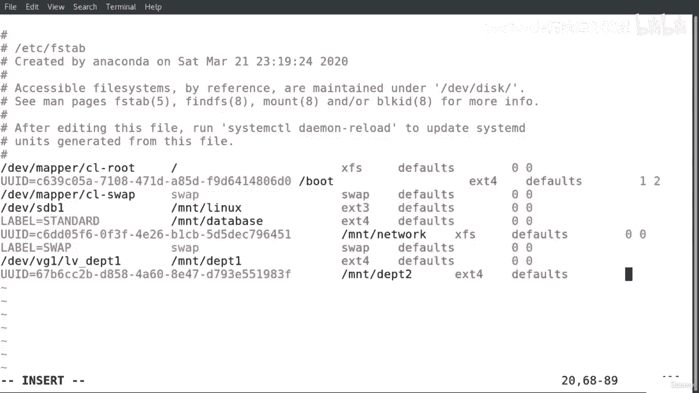

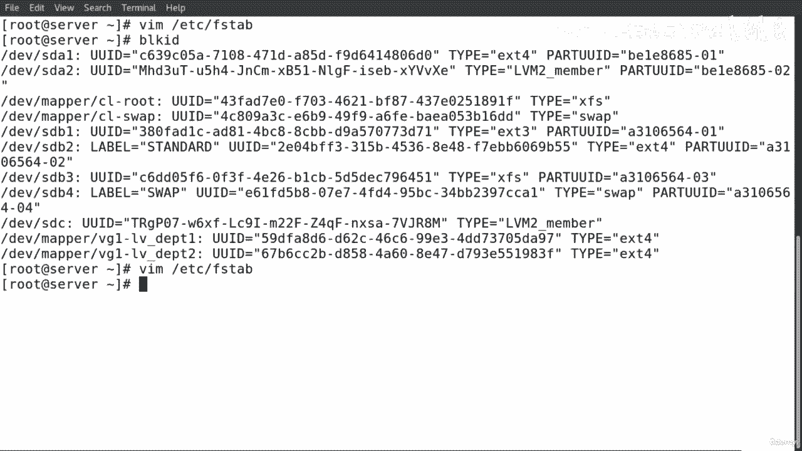

```bash
# 创建固定大小的逻辑卷 lv_dep1，大小为1GB
lvcreate -L 1G -n lv_dep1 vg1
# 使用卷组剩余空间的100%创建逻辑卷 lv_dep2
lvcreate -l 100%FREE -n lv_dep2 vg1
```

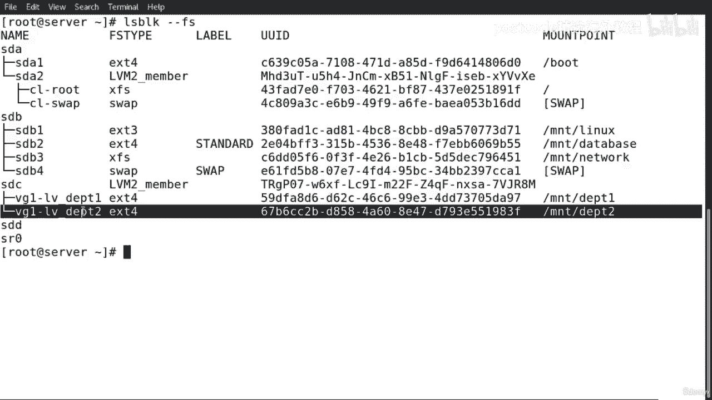

使用 `lvs` 或 `lvdisplay` 命令查看逻辑卷信息。

创建逻辑卷后，需要为其创建文件系统。

```bash
mkfs -t ext4 /dev/vg1/lv_dep1
mkfs -t xfs /dev/vg1/lv_dep2
```

接着，创建挂载点目录，并编辑 `/etc/fstab` 文件添加永久挂载配置，方法与标准分区类似。可以使用设备路径（如 `/dev/vg1/lv_dep1`）或UUID。

最后，运行 `mount -a` 挂载逻辑卷。

**扩展与缩减逻辑卷**
扩展逻辑卷和卷组是LVM的强大功能之一。

*   **缩减逻辑卷**：首先确保文件系统已卸载或支持在线缩减，然后使用 `lvreduce` 命令。
    ```bash
    lvreduce -L -600M -r /dev/vg1/lv_dep1
    ```
*   **扩展逻辑卷**：使用 `lvextend` 命令。
    ```bash
    lvextend -l +100%FREE -r /dev/vg1/lv_dep2
    ```
*   **扩展卷组**：向现有卷组添加新的物理磁盘。
    ```bash
    vgextend vg1 /dev/sdd
    ```

**删除LVM组件**
删除顺序与创建顺序相反：先删除逻辑卷（LV），再删除卷组（VG），最后删除物理卷（PV）。

1.  从 `/etc/fstab` 中移除相关挂载项，并卸载逻辑卷。
2.  删除逻辑卷：`lvremove /dev/vg1/lv_dep1`
3.  删除卷组：`vgremove vg1`
4.  删除物理卷：`pvremove /dev/sdc /dev/sdd`

## 使用Stratis管理分层存储 🚀

上一节我们探讨了LVM，本节中我们来看看RHEL 8/9引入的新特性——Stratis。Stratis简化了高级存储功能的配置，如存储池、文件系统、快照和监控。

首先，确保系统已安装Stratis软件包。

```bash
dnf install stratisd stratis-cli
```

启用并启动Stratis服务。

```bash
systemctl enable --now stratisd
```

在创建Stratis池之前，建议先擦除要使用的磁盘（如 `/dev/sdc`, `/dev/sdd`）。

```bash
wipefs -a /dev/sdc
wipefs -a /dev/sdd
```

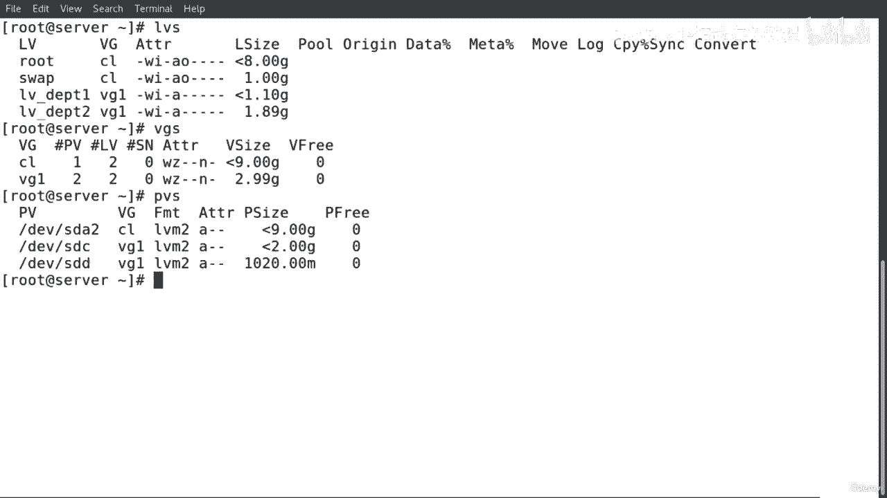

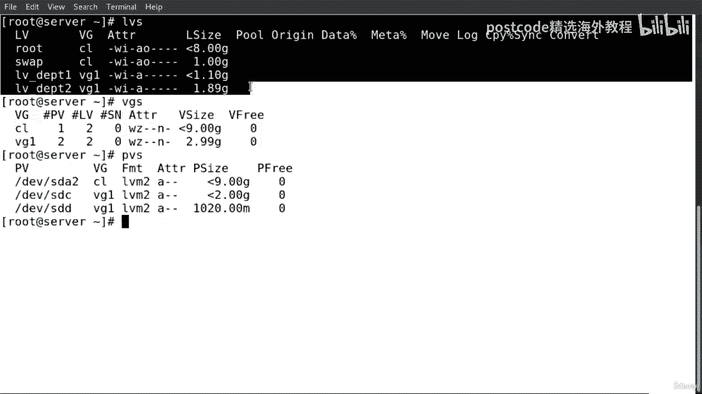

**创建Stratis池**
Stratis池由一个或多个磁盘组成。

```bash
stratis pool create mypool /dev/sdc /dev/sdd
```
使用 `stratis pool list` 查看池信息。

**在池中创建文件系统**
在池上创建文件系统非常简单。

```bash
stratis filesystem create mypool fs1
stratis filesystem create mypool fs2
```
使用 `stratis filesystem list` 查看文件系统。

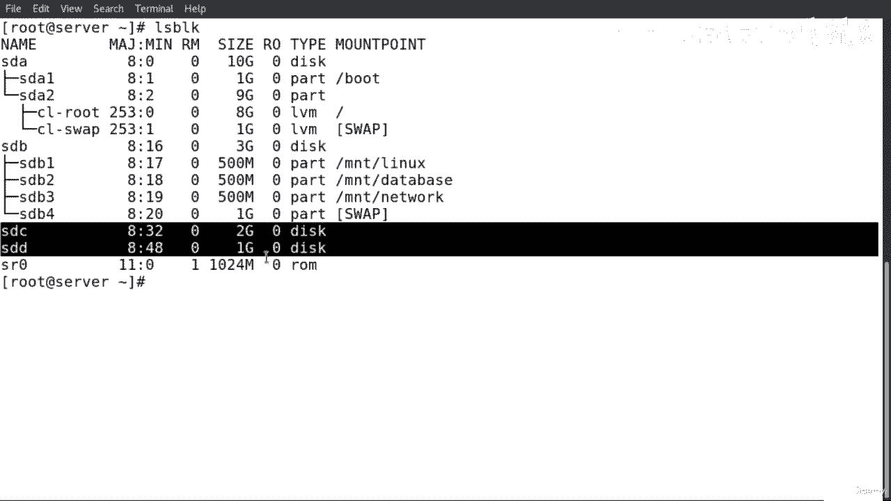

**创建快照**
可以为文件系统创建即时快照。

```bash
stratis filesystem snapshot mypool fs1 snapshot_fs1
```
使用 `stratis filesystem list` 查看快照。销毁快照使用 `stratis filesystem destroy` 命令。

**挂载文件系统**
首先获取文件系统的UUID。

```bash
blkid -p /stratis/mypool/fs1
```

然后，编辑 `/etc/fstab` 文件，添加挂载配置。文件系统类型为 `xfs`，挂载选项需要包含 `x-systemd.requires=stratisd.service`。

```
UUID=xxxx /storage1 xfs defaults,x-systemd.requires=stratisd.service 0 0
```

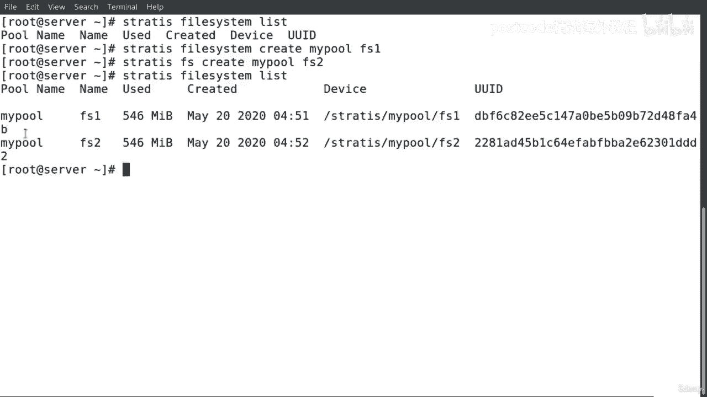

保存后，重新加载系统配置并挂载。

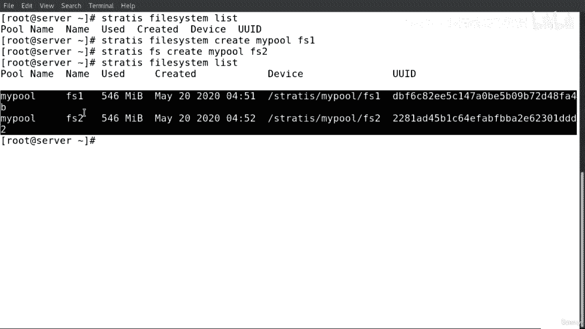

```bash
systemctl daemon-reload
mount -a
```

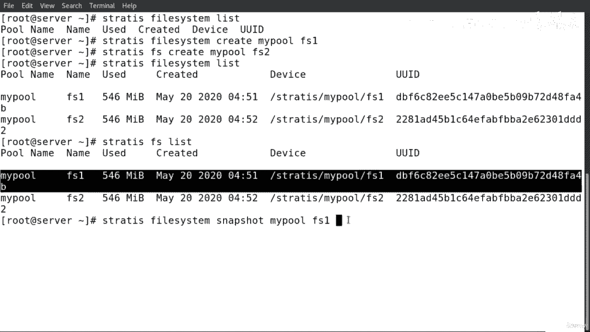

**向现有池添加磁盘**

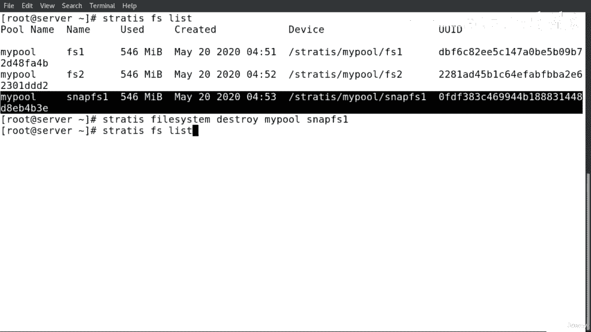

```bash
stratis pool add-data mypool /dev/sde
```

**删除Stratis配置**
删除顺序：先卸载并移除 `/etc/fstab` 中的配置，然后销毁文件系统，最后销毁池。

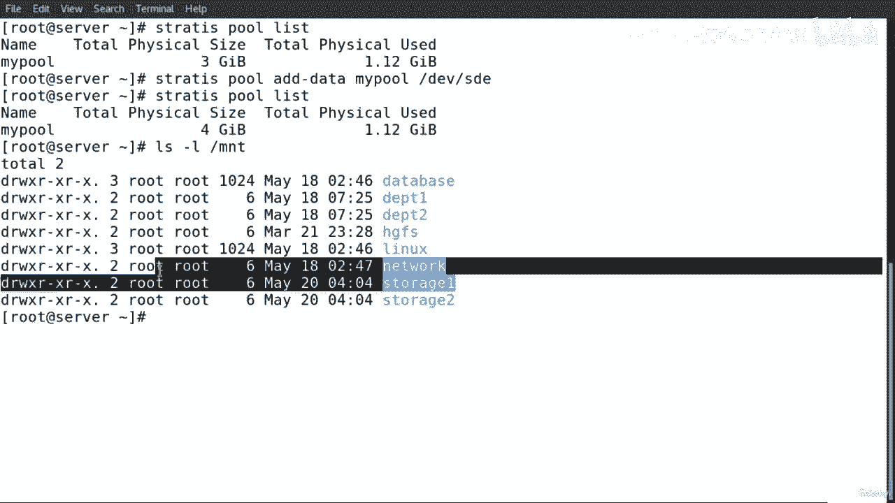

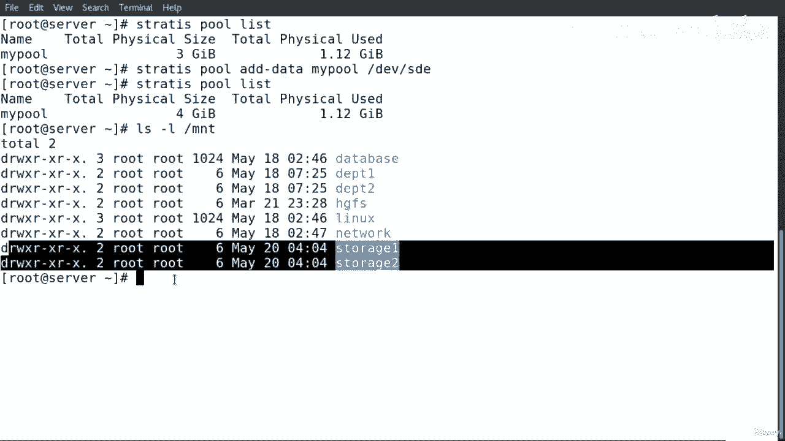

1.  注释或删除 `/etc/fstab` 中的挂载行，并卸载文件系统。
2.  销毁文件系统：`stratis filesystem destroy mypool fs1`
3.  销毁池：`stratis pool destroy mypool`

## 配置VDO（虚拟数据优化器） 📉

上一节我们使用了Stratis，本节中我们来看看VDO。VDO是一个虚拟数据优化器，位于块设备之上，通过去重、压缩和零块消除技术来节省磁盘空间。

首先，安装必要的软件包。

```bash
dnf install vdo kmod-kvdo
```

检查VDO服务状态并确保其运行。

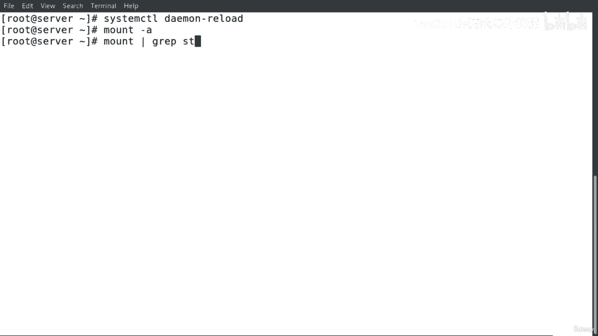

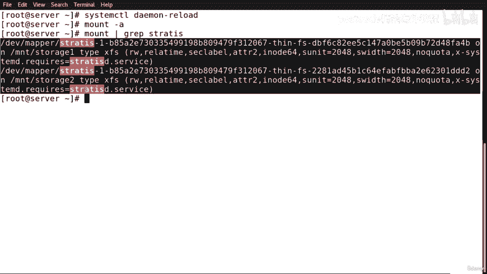

```bash
systemctl status vdo
systemctl enable --now vdo
```

**创建VDO卷**
使用 `vdo create` 命令创建一个VDO卷。

```bash
vdo create --name=myvdo --device=/dev/sdd --vdoLogicalSize=10T
```

**在VDO卷上创建文件系统**
使用 `-K` 选项避免在创建文件系统时丢弃零块。

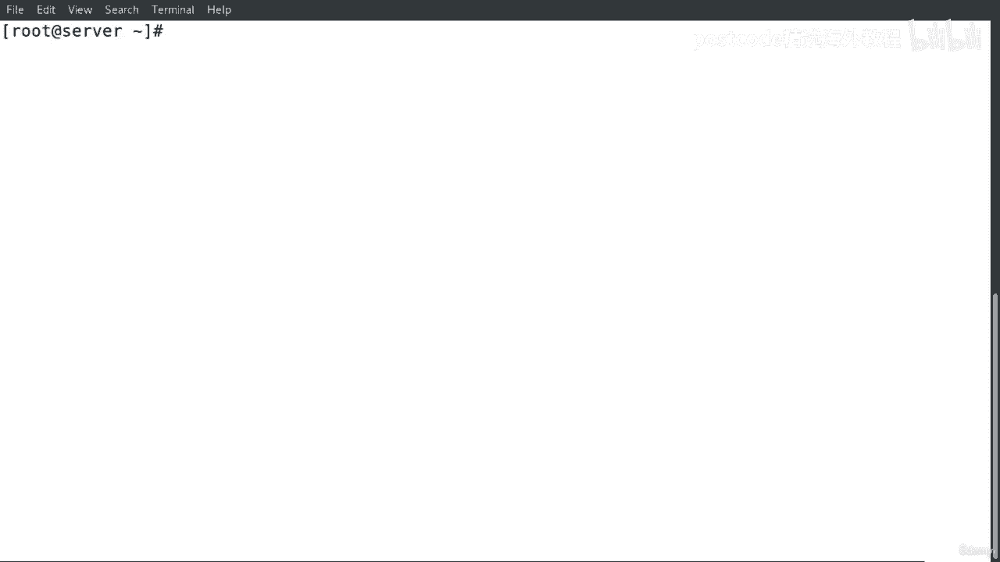

```bash
mkfs.xfs -K /dev/mapper/myvdo
```

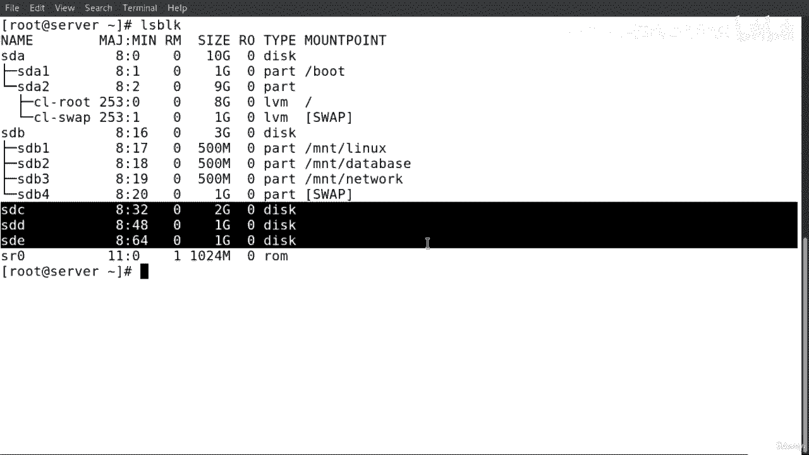

**永久挂载VDO卷**
编辑 `/etc/fstab` 文件。文件系统类型为 `xfs`，挂载选项需要包含 `x-systemd.requires=vdo.service`。

```
/dev/mapper/myvdo /myvdo xfs defaults,x-systemd.requires=vdo.service 0 0
```

保存后，重新加载系统配置并挂载。

```bash
systemctl daemon-reload
mount -a
```

可以使用 `vdostats` 命令查看VDO卷的统计信息。

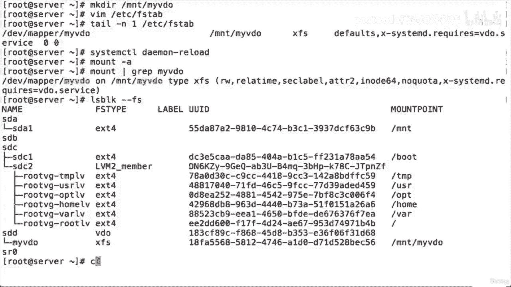

**删除VDO卷**
删除顺序：先移除 `/etc/fstab` 中的配置并卸载，然后停止VDO卷，最后删除它。

1.  注释或删除 `/etc/fstab` 中的挂载行，并卸载：`umount /myvdo`
2.  停止VDO卷：`vdo stop --name=myvdo`
3.  删除VDO卷：`vdo remove --name=myvdo`

## 总结 📚

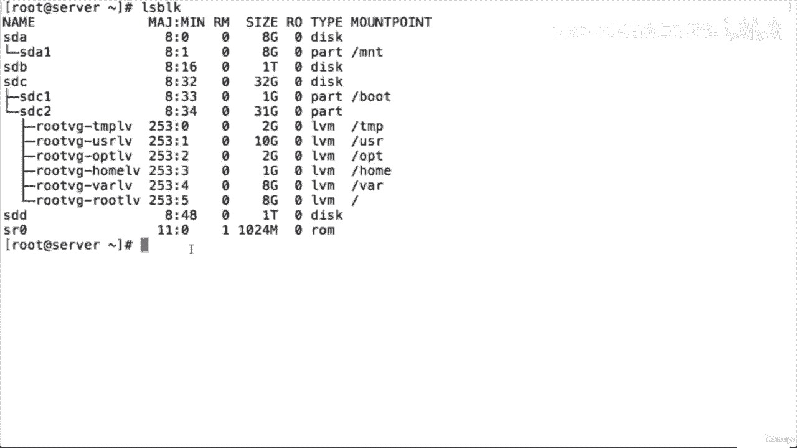

本节课中我们一起学习了RHEL 9中多种存储管理技术。我们从最基础的**标准分区**创建和挂载开始，然后学习了**交换分区**的配置以扩展虚拟内存。接着，我们深入探讨了灵活的**逻辑卷管理（LVM）**，包括创建、扩展、缩减和删除卷组与逻辑卷。之后，我们了解了新一代的**Stratis**存储管理工具，它简化了池化、文件系统和快照的配置。最后，我们学习了**VDO（虚拟数据优化器）**的配置，它通过去重和压缩有效节省存储空间。掌握这些技能对于管理复杂的Linux存储环境和通过相关认证至关重要。