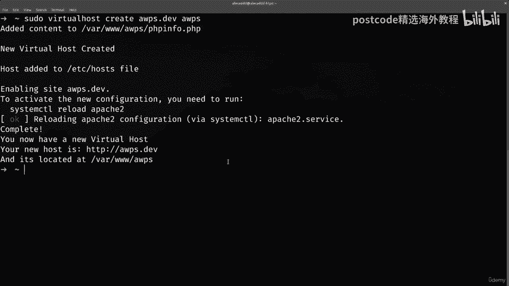

# 红帽企业Linux RHEL 9精通课程 — RHCSA与RHCE 2023认证全指南 - P49：04-04-025 Webserver - 精选海外教程postcode - BV1j64y1j7Zg

每当您需要使用 PHP、Ruby 或任何其他脚本语言开发应用程序时，要使用，最好先在您的机器上开发这些应用程序，而不是在您的计算机上，不断推送，不断上传文件到远程服务器在线以便测试，您的应用程序。

对于需要服务器的特定语言，需要设置本地服务器，为了运行。如果您只是构建一个前端应用程序（例如静态 HTML 网站），我们会看到 CSS 和 JavaScript。

您实际上并不需要为您的计算机设置本地服务器。

您只需在浏览器上打开 HTML 文件即可完成此操作。但是，如果您正在开发使用 PHP 或连接到 MySQL 等数据库的应用程序，那么您，需要在您的计算机上运行服务器。Linux 是一个完美的起点。

因为 Linux 实际上内置了一个服务器，系统类似于Linux的默认配置。它非常适合当地环境。事实上，如果您曾经有过在线购买或购买服务器的经历，您很可能会，请注意，您可以选择可以设置的机器类型。

99% 的情况下，该机器是 Linux 机器，很可能运行 Ubuntu 或其他版本，Linux 的另一个发行版。

首先，我们要在机器上安装一个灯组。我不知道您是否听说过“灯”这个词，但这只是一种表达功能齐全的奇特方式，在 PHP 中运行 SQL 的服务器。事实上。

LAMP代表Linux操作系统Apache是​​我的SQL，是数据库，而PHP是，灯堆栈是运行 Web 服务器所必需的默认软件包类型。安装 Linux 操作系统后，无论选择哪种操作系统，我们都已经。

基本上已经完成了 50%，因为我们已经有了 L、我们的 Linux 和 EH 我们的 Apache 服务器来测试。如果您的 Linux 安装运行了 Apache 服务器。

您只需打开一个新的浏览器选项卡并，默认输入本地主机。新安装的 Linux 的本地主机应该直接指向您的 Apache 欢迎屏幕或其他内容。

就像这样指定您当前实际上在 Ubuntu 上运行 Apache 2。有用。这是完美的，还有一堆配置示例。

因此，让我们首先访问终端。我们想要检查我们是否确实拥有 Apache 以及它是否正在运行以进行检查。如果我们有Apache，我们可以简单地写出哪两个Apache。

如果我们没有收到任何错误并且我们得到 Apache 的实际目录，则意味着 Apache 实际上是，安装在我们的机器上以检查 Apache 的状态。

我们可以简单的输入sudo service得知apache是​​一个服务，apache有两种状态。它会询问我们的路线密码。那是完美的。在这里，我们可以快速报告服务器的状态。它是绿色的。

它处于活动状态并正在运行，它正在模拟一堆 HTTP 地址，并且正在使用，照顾一群当地的主人。都好。如果您得到的答案是您的 Apache 服务器未运行并且处于停用状态，则其写法如下。

停用或禁用或类似未运行。您只需输入 sudo service apache start 即可解决此问题。我们想要检查的另一件事是我们想要检查我们的系统如何自动。

每次我们在酒吧中输入本地主机时，它都会进入我们的 Apache 文件夹并指向我们的，本地环境未指向 Google 或其他服务器，因为如果我在搜索中输入某些内容，吧，它直接进入谷歌并根据我写的词进行研究。

我也拼错了。但为什么当我输入 localhost 时，它不会转到 Google，而是转到 Apache。这是因为 Apache 处理这些请求和唯一的 URL。

感谢我们的主机文件并检查我们的主机文件，我们可以在 sublime 中打开它并检查配置，通过终端在 sublime 中打开它。我将输入 UBL 来调用 sublime。

然后我会说 Etsy 文件夹中的正斜杠，正斜杠主机文件在 sublime 中打开这些文件，他输入我们这里有一个我们需要特定名称的列表。

IP地址这个1到7。0。0。1是本地主机我们机器的本地IP地址或者是模拟的，或者就像网上并不存在的东西。它是仅用于本地计算机的 IP 地址。因此。

每次我们想要设置一些指向本地 Apache 服务器的内容时​​，我们都可以在这里编写。

例如，如果我有一个，那么每次我输入 test dot dev 并按下 Enter this test 或 dev，应该指向我的 Apache 安装，而不是尝试访问名为 Test 或 dev 的网站。

不存在，让我们在主机文件中完成它。我们只写一个空格并写测试点dev。一些用户喜欢重复这些行并且每行只有一个地址。这其实并不重要。你可以两者都做。这是一种类似的组织类型。如果你想点击。

保持你的主机文件更干净，你可以内联编写所有内容。这并不重要，但让我们保存这个文件。

我们将收到密码确认提示，当然，如果我们尝试访问测试开发人员。

因为我们现在指定特定主机、特定 URL 自动指向我们的本地主机，正在进入我们的 Apache 安装，最好不要尝试访问不存在的 URL，在互联网上，但指向我们的本地文件。那么此时，我们要做的就是。

我们要连接的这个本地IP地址就是本地地址，我们在主机文件中设置到服务器中的实际文件夹，这样我们就可以实际模拟网站如何，作品。指向服务器内物理文件夹的任何 IP 地址。

如果我们在 Ubuntu 的 Apache 演示屏幕中注意到这里，我们就知道我们的服务器文件夹位于，这里是 var wo html 和等等等等所有其他事情。

但我们知道安装 Ubuntu 的 apache 服务器会自动抓取所有的东西，在此位置内设置和配置的文件夹和文件。所以这就是我们必须去的地方。如果我们想检查这个位置在哪里以及里面有什么。

我们可以简单地打开文件管理器并，按住 alt 键，然后隐藏到此处。我们将向上导航几次以到达安装的根文件夹，在这里您，会注意到我们有栏，然后是 www 这里我们有 HTML 文件夹，这是默认的文件夹。

进入 Apache 的演示文稿，我们可以看到 index。html html。那很完美。因此，这是我们必须创建与本地网站相关的所有文件夹的位置。因此，就我而言，我想创建一个名为 test 的文件夹。

如果您注意到，如果您右键单击并尝试创建一个新文件夹，则可以。因为这些文件夹，这些 Apache bar 文件夹，是受 root 访问保护的。因此，如果您没有以管理员身份登录，则无法创建任何文件夹。

我们将立即解决这些问题。但建议您不要直接在文件内创建文件夹或文件或其他任何内容，经理。您应该这样做，尤其是在第一次配置期间。您应该通过终端完成所有操作，这就是我们要做的。

让我们切换回终端，为我们的测试点开发网站创建一个新文件夹。那么假设 Sudo 充当 root 管理员，mkdir 就是 bash 命令创建的命令，一个目录，它是创建目录的简写。然后。

让我们指定一个破折号 P 来表示如果我们需要创建，我们还想创建一个父目录，父目录。就我而言，我们不需要创建父目录。但如果你想创建多个目录和子目录，你应该使用 dash p 命令。

我们将在 bar www 位置中创建目录，然后我们可以调用 test。Test 是一个带有破折号 p 的新文件夹，我们可以创建另一个文件夹并像 CSS 一样直接调用它。

所以这个破折号会自动为我们创建测试和 CSS 文件夹，测试。我们不需要这样做。我们将只创建测试文件夹，按 Enter 键我们将收到插入提示，我们的管理员密码就完美了。

如果你现在回到原来的地方，我们就有了测试文件夹，非常棒。我们为新的本地环境创建了第一个文件夹。

现在我们必须更改此文件夹的权限才能创建文件。对吧，无论如何。我们想要改变它。我们必须获得更改所有权的许可才能做到这一点。让我们再次输入 sudo，然后查看 h own 来更改所有权。

并短划线 r 使其递归。因此它将包含将要创建的任何其他文件夹。将在里面创建文件夹和文件。这个主文件夹将自动获得我们正在使用的这些主文件夹的权限和所有权，现在设置。

我想为我自己（组和用户）设置权限和所有权，以便无需，检查我的用户名是什么以及如何正确书写等等等等。我们可以简单地编写变量，即该组的全局变量dollar user，然后是dollar user，为业主。

这个系统会自动获取这个全局变量，我们使用我们的名字，在我的例子中，计算机已分配，它将把所有权和组与我正在处理的那些文件相关联，要去指定分配自己。因此，让我们指定我想要的所有者。

我想将所有权更改为文件夹 bar www test。完美的。那么这部分我们要做的最后一件事就是更改 var www 的权限，默认情况下，此文件夹不可读，不可全局读取和访问。

让我们再次编写 sudo c mod 来修改权限，然后再次短划线 r 进行递归。然后我们指定权限755，让它可读和不可读，只对全局可读，文件夹 w。W。

W。完美的。现在，如果我们回到这里并询问测试，我们右键单击，我们注意到我们可以创建，一个新文件夹，我们可以创建一个新文件，我们几乎可以做所有事情。因为现在这个文件夹，如果我们访问属性并检查权限。

就属于我们，一个用户，我们可以访问所有文件。

所以这就完美了。这就是我们此时想要的，只是为了本教程并创建一个样板，让我们创建一个名为 Index Dot PHP 的新文件，方法是在栏内触摸 www 测试索引点。

php 并让我们在 sublime 中打开。当然，我们刚刚创建的这个文件是空的。

让我们创建、打开 PHP 标签并编写 echo。PHP。信息。

保存。那很完美。我们可以关闭这个文件。我们不再需要它了。

现在我们的服务器上有测试文件夹和我们刚刚创建的索引 PHP 文件。但是如果我们刷新测试，那当然总是会转到这些默认的 Apache 介绍，文件。

因为我们实际上并没有将 IP 地址连接到 Apache 服务器中的实际文件夹。这就是虚拟主机派上用场的地方，因为通过这种方式我们可以连接文档，root。

文档目录到实际服务器目录并模拟服务器目录以具有服务器名称。在我们的例子中，这将是测试定义。那么让我们开始吧。在 Apache 中创建虚拟主机非常非常简单。我将向您展示虚拟主机在 Apache 中的位置。

因此，如果我们返回根文件夹并访问 Etsy 文件夹，我们将看到 Apache 2，这是安装在我们机器上的服务器。我们在这里访问它并访问可用的站点。您会注意到我们有一个文件夹，如果我们希望的话。

我们有一个名为 000 dash default 的文件。我们会注意到几乎所有的行都被注释掉了，并且唯一的行被注释掉了，不是指文档路径的那个。这是默认的，HTML 文件夹，这些样板类型的文件。

对我们来说是必需的。我们将使用它来指定所有虚拟主机，以便将测试开发 URL 挂钩到实际主机，我们在 www apache 文件夹中创建的 test 文件夹作为一个小建议。

永远、永远、永远不要编辑启用的网站内的文件。站点已启用。这是一个由 Apache 管理并自动填充、删除或独立管理的文件夹，由阿帕奇。对于某些脚本，您不需要添加它或手动触摸这些站点内的任何内容。

每次需要创建虚拟主机时始终启用并且仅在其中编辑文件和创建文件，该站点的可用文件夹。不要感到困惑。否则，您将面临破坏 Apache 安装的风险，而我们不想这样做。

让我们返回终端并复制我们刚刚看到的默认 。com 文件。因此，我们将再次使用伪命令，然后使用代表复制的 CP。我们将把 ETSI Apache 复制到正斜杠站点。可用于工作斜线 0000。

如果我们自动按 Tab 键，系统将识别该文件，并将使用自动完成功能为我们填充它，我们将在同一位置复制它。那么让我们重复一下 ETSI Apache 两个站点，然后再重复一下站点。

可用然后我们需要指定与我们的虚拟主机扩展名相同的文件名，我们想要使用我们的网站。因此，在我的例子中，将先测试 dot dev，然后测试 com，因为它是一个配置文件。因此。

文件名始终必须与文件名相似且相同。您将用于该网站、该虚拟主机的 URL。就是这样。输入并自动我们有重复的。

我们可以检查是否返回可用的站点。我们已经有了测试定义配置，现在我们需要编辑它。

为了编辑它，我们需要访问伪文件，或者我们可以使用 sublime 并获得提示。每次保存时我们都需要确认。那么让我们来看看错误。获取我们之前的条目，在这里我们只需输入 sublime 回车即可，这很完美。

在这里我们几乎可以删除所有这些不必要的注释。我们离开这里吧。我们几乎可以删除所有东西。实际上，让我们删除所有内容并手动编写我们需要的内容。确保您正在编辑测试定义配置而不是默认配置，因为我们不想触及。

默认的，我们不想冒险破坏它。因此，首先我们需要指定服务器管理，通常服务器管理类似于文件的类型或，我们正在编辑的网站类型。所以让我们把它改成别的东西。例如，admin、et test、dot dev。

当然，在实际情况下，这将是服务器管理员的实际电子邮件地址。因此，每次出现服务器问题时，您都可以向服务器管理员发送电子邮件，这样就可以了，获取日志、报告和所有错误。目前，因为我们处于本地环境。

所以我们不需要指定真实的电子邮件，但您可以，改变它做任何你想做的事。我们需要将服务器名称更改为我们要使用的 URL，这就是我们需要指定的位置，测试点开发，然后文档根目录就是我们创建文件夹的地方。

我们的网站和我们网站的文件的地方，将会是。所以就我而言， r 位于 var www 测试中。那很完美。然后，如果您愿意，我们可以指定一堆额外信息。如果您想跟踪自定义日志中的错误，那么这很可能很重要。

以便我们可以指定美元，然后是大括号。亲爱的阿帕奇日志。这是全局变量，我们的所有日志都将保存在 Apache 服务器中，我们，将存储每个内部错误点日志，然后我们可以复制它并将其更改为自定义日志。

我们将把它改为访问点日志，而不是错误日志，并且我们将指定，该文件必须合并。这些是您需要的默认内容。你不需要像你这样的人，你就把它留在这里即可。您实际上不需要编辑。它就像 Apache 服务器的默认配置。

所以这就完美了。这是最低限度。还有很多很多其他选项，我们稍后会检查。我们稍后会看到所有其他选项。但这是拥有功能齐全的虚拟主机的最低限度。

现在我们可以保存这个文件了。我们将收到插入管理密码的提示。

那很完美。现在我们可以关闭它，为了启用和激活该文件，我们需要使用 bash 脚本，Apache 会自动为我们做这件事。为此，我们需要再次输入 sudo 然后 a 到一侧。

这意味着 Apache 两个已启用的一侧，我们，需要指定我们刚刚创建的文件。测试点开发点配置。我们不需要输入整个根目录，因为该脚本将自动查找该文件，在可用的站点内，因为它是您应该进行此类配置的唯一位置。

文件以便启用。那么让我们看看。Hunter 现在进行了站点测试，开发人员可用并已激活。

如果我们检查 Apache 两个文件夹中的文件夹并访问启用的站点，您会注意到，我们有一个 Simulink 文件，它是指向我们的测试配置的链接。这就是为什么您永远不必触摸站点启用文件夹。

因为这些文件夹会自动，由死亡脚本管理，以激活和停用这些站点内的所有站点。可用文件夹。

现在为了完成，我们需要使用此脚本重新启动或重新加载 Apache。因此，让我们复制此脚本，将其粘贴到此处，然后按 Enter 键。我们将收到管理密码的提示。

阿帕奇已重新加载。让我们回到我们的服务器。让我们回到浏览器。让我们刷新测试开发，我们有 PHP 信息文件。那很完美。如果我们在这里没有得到 PHP，如果我们没有得到任何关于 php 的信息。

这意味着你没有，php 安装在您的机器内，以在您的机器上安装 PHP。

首先您需要检查您是否拥有它。所以只需输入 php v 即可。如果没有，您可以简单地输入 sudo apt get install php 7。0。这是当前可用的 php 版本。

我强烈建议您使用 APT 包管理器。有些用户喜欢使用 homebrew 或 Linux Brew。这是 Linux 自制程序的派生，用于获取最新的存储库或最新的软件包。但如果你真的不需要这样做。

你完全可以拥有 PHP 的稳定版本或稳定版本，您想通过 Linux 的官方内置包管理器使用任何包。

易于。现在我们的虚拟主机已经启动，我们可以通过根文件夹管理所有文件。var www 测试。这是我们的测试文件。但我不喜欢的是我不想。每次我需要编辑这些文件夹时。

我都需要编辑这个文件或者我正在这个网站上工作。我需要访问我们测试中的根栏。我想创建一个指向我的主目录站点的简单链接，并在此处添加 ww w。所以我知道，如果我访问这里，我将直接进入 Apache。

每次创建文件夹时，那里什么的，这意味着我可以设置一个新的虚拟主机，一个新的网站，并且我可以保留，一切都组织得更好，分开得也更好。

当然，我们是通过终端来完成的。所以为了通过终端创建一个Simulink，我们需要输入L NW Space Dash S来创建，Simulink 指向我们想要链接的文件夹，我们想要进行复制、复制和生成。

Simulink。在我的例子中是斜杠，W，W，W，然后是目标文件夹，在我的例子中是我的家，目录，我的名字。这是拥有这台计算机的用户，然后是文件夹站点，然后是链接的名称。

这将是 www 输入。完美的。让我们回到我们的单词目录。让我们回到我们的主目录站点，然后我必须 www，如果我双击，我将，直接访问我的测试文件夹或 HTML 文件夹或其他文件夹。

我将直接重定向到我的服务器实际所在的位置。所以这真的很方便。当然，因为它是根文件夹，所以它是一个保护性文件夹，我们将拥有这些图标。如果需要，您可以更改图标，但这并不重要。

这就像进入您的服务器的非常方便的快速链接。这就是我们通过 Apache 在 Linux 上手动设置本地服务器的整个工作流程。但当然这有点复杂。我的意思是，如果我不解释任何内容，只需键入它。

就非常容易且快速。

用它。但是，如果您需要不断创建大量网站，并且需要每周生成一次新网站，您管理多个网站的网站，这会变得有点乏味，尤其是，或者即使您，创建一台本地主机、一台虚拟主机，然后几个月后您需要创建另一台，第一。

你完全忘记了所有的工作流程、一切以及你必须做的事情。这有点乏味。所以我们需要一种自动化。如果你访问我的 GitHub，我找到的一个超级漂亮的脚本 shell 脚本就会派上用场。

用于分配和虚拟主机的存储库，即由这些用户 rover 线创建的分叉 shell 脚本，创建了这个超级漂亮的 shell 脚本。我分叉了它，因为其中一个文件在生成 IP 地址时出现了一个小问题。

在主机文件中。我修复它，我推送它，所以现在我们可以快速使用它。您只需将虚拟主机 dot shell 文件下载为文件，然后移至您的 BIM 文件夹中，以便在全球范围内使用它。那么让我们开始吧。

让我们打开这个文件，将其单击为原始文件，然后将其保存在我们的主目录中。现在根据结构保存，我们需要将C mod更改为可执行。所以我们需要指定加x为虚。

主持人SH。这就是我们要做的。因此，我们将 C、H mod 加 X 写入可执行文件，然后我们就得到了工具 host s h。这是我当前刚刚下载到我的主目录中的文件。

它在中心。完美的。现在我们必须将其复制粘贴到我们的用户本地 bin 中并将其重命名为虚拟主机。因此，我们删除了 sh 扩展名，这样我们就不需要每次执行此命令时都键入它。那么让我们开始吧。让我们复制这个。

这是我们的终端，让我们将其粘贴到这里，让我们更改初始位置。

就在这里并且完成了。现在我们可以访问一堆超级漂亮的快速脚本，它们将帮助我们自动生成，我们自己手动完成的所有事情。因此，我们只需要指定几个选项，然后就会自动填充所有内容，我们。

我们可以使用的脚本只是伪脚本，因为我们需要通过路由访问它。虚拟主机 我们可以选择创建或删除新域并指定主机目录，这是可选的。例如，如果我想为 DWP 的 WordPress 安装创建一个开发站点。

我可以简单地使用。

这个脚本说伪虚拟主机，创建一个点dev，然后我希望该文件夹被称为AWP，并需要输入完成。

如果我们返回，我们就在我们的文件夹中，如果我们检查脚本做了什么。

基本上创建了一个新的虚拟主机，将我们的主机添加到 Etsy 主机文件中并重新加载 Apache，我们。现在我们这里拥有了所有内容，因此如果我们进入文件夹，我们可以检查发生了什么。

我们将看到现在我们有了 AWP，并且脚本会自动生成 PHP 信息，文件，如果我们在这里访问它，我们可以检查一切是否完美。另外。

系统会在所有 Apache 文件夹 etsy apache 两个可用站点中自动为我们创建，创建了 AWP 开发者会议，如果我们打开您会注意到这里我们有比以前更多的选项。

这是完美的，因为所有这些选择对我们都很重要。允许覆盖所有目录和以下链接的多视图。所有这些选项和要求全部授予都会自动设置虚拟主机接受，对于，例如，永久链接或允许我们将文件上传到服务器，例如通过媒体上传器。

或 WordPress 并为我们生成了一个唯一的文件来处理所有错误和访问日志，我们有一个文件来管理我们所有的网站。

所以这个剧本太棒了。真的很快。正如您所注意到的那样，速度很快。如果你不再想要这个网站，例如，你曾经在它上工作过，它真的是一个完整的网站。

网站。你想清理你的服务器，你想删除它，你可以重复使用相同的伪代码，虚拟主机，但我们可以写入、删除，然后删除本地主机，而不是创建，让我们删除 Apache 文件夹。它将要求确认删除根目录。让我们指定是的。

完美。

现在，如果我们返回并再次刷新该网站，它就不再起作用了。如果我们访问此处的文件夹，我们会在该站点内找到可用的文件夹，但我们不再有任何文件夹。AWP 位于站点内。

如果我们返回根栏 www AWP 则不再存在。当然，我们的 Simulink 内部网站也会更新。那很完美。我们要做的最后一件事是，我们需要创建一个数据库，因为服务器没有数据库，有点没用。如今。

所有像 WordPress 这样的应用程序都需要数据库。

所以首先，我们需要安装我的SQL，安装MySQL真的很简单。首先，让我们稍微清理一下这个终端，然后使用 sudo apt apt get install 我的 SQL dash 服务器。

让我们按回车键并自动说“是”。应用程序包管理器将下载我的 SQL 的所有核心文件，以便我们进行配置，并将其设置在我们的本地计算机上。所以这需要一点时间，最后我们就会得到。提示自动设置并配置。

所以我通常会得到admin，因为root和admin就像OC一样，所以重复密码。

以防万一，然后按 Enter 键，系统会自动为我们进行配置。完美的。现在要检查我的 SQL Server 是否实际运行，我们可以简单地键入 sys CTL，它是一个系统控制器。

检查我的 SQL 服务的状态，当然我们会得到一个积极的确认信息是活跃的，并在我们的 SQL RD 位置内运行。那很完美。现在我们能做什么。我们可以通过终端使用我的 SQL，但这并不是很直观。

在使用 Mac OS 多年之后，我已经习惯了 SQL Pro。不幸的是，Linux 上不存在 SQL Pro，但有一个可用的数据库管理器。

它的名字真的很漂亮，它是一个免费的通用 SQL 客户端 DB。它是开源的，而且真的很酷。那么我们就来下载吧。当然，令人惊奇的是多平台。让我们下载 64 位的 DB 包，为了启动它，我们需要运行包安装。

通过终端。因此，让我们复制该文件的名称。让我们复制该文件的名称并输入。至于结构，运行 sudo dpkg e db ，然后运行名称 dot dev 。那么让我们输入这些内容。

那么让我们运行 sudo 吧。DPC g 然后是我们下载文件夹中的位置或文件，然后是文件的名称，使用扩展名 dot dep 让我们看看。

猎人。完美的。现在下一步是简单地执行 DB 那里或简单地单击 DB where？

太好了，您的连接类型让我们转到我的 SQL，下一个本地主机端口是完美的，我们没有数据库用户名是root，解析器是admin，本地用户客户端是在用户内部。我们无权访问，我们不出售。

测试连接下载驱动程序文件我们缺少驱动程序。那很完美。让我们开始吧，连接起来。很棒的测试连接成功，一切正常，完美完成。现在，如果我们双击，我们就可以访问 MySQL 本地安装并执行我们通常执行的所有操作。

在常规数据库安装中执行此操作。所以现在这里我们可以创建一个新的数据库，例如WordPress的数据库，很多URL，对于 Drupal。无论您想要什么安装，您始终可以通过root和perfect来访问它。

我们拥有使用我们的机器开发我们想要的所有 Web 应用程序所需的一切。

所以这个视频就差不多了。如您所知，整个系统可能听起来很复杂或令人费解，但只是，因为我在安装和配置所有的过程中逐步解释了我在做什么，事物。现在您已经第一次设置它并且有了该脚本，它非常快速且简单。

并且超级自动化。即使手动执行也只需几分钟，因为您不必每次都停止，是时候解释一下，理解命令是什么了。您已经拥有这些命令，那就完美了。通过使用该脚本，虚拟主机 shell 脚本将帮助您加快整个过程。

