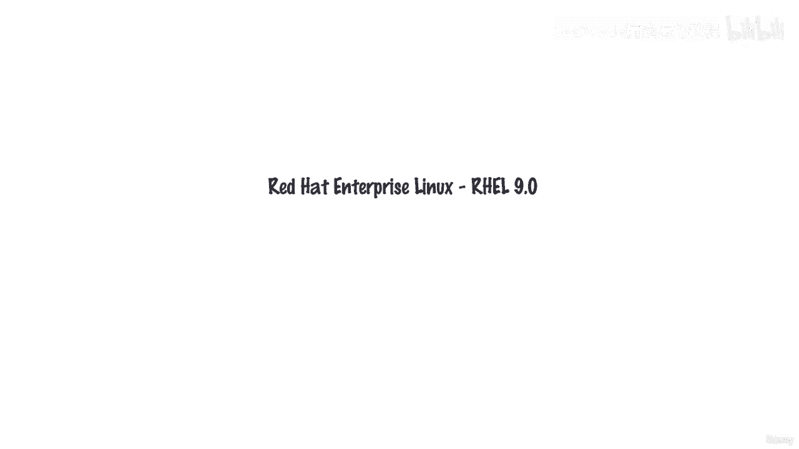
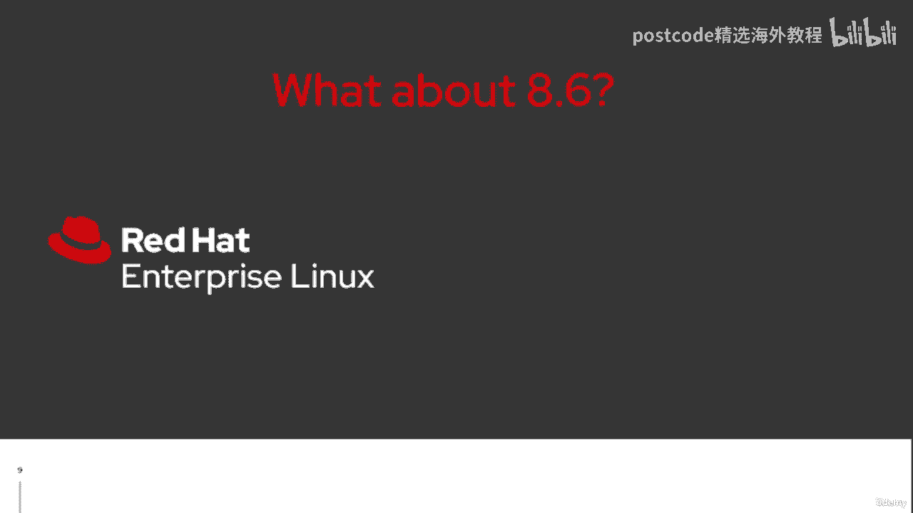
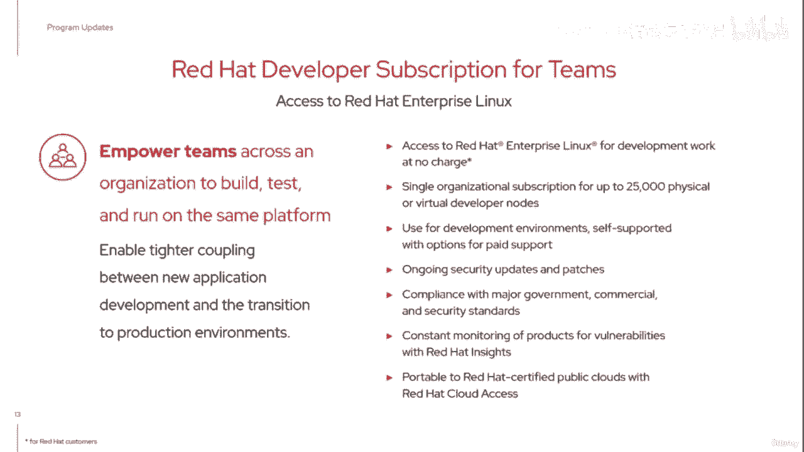
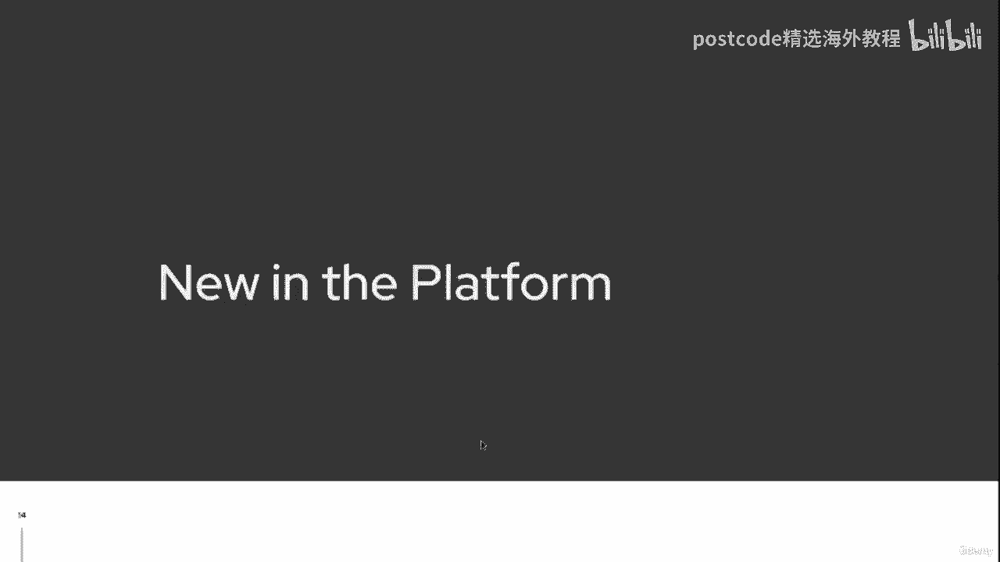
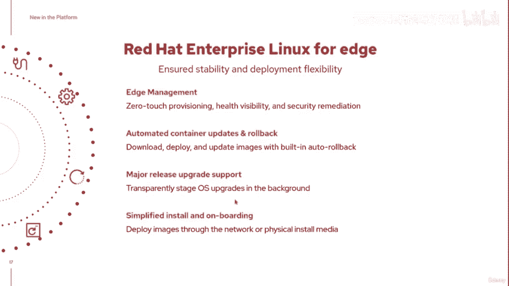
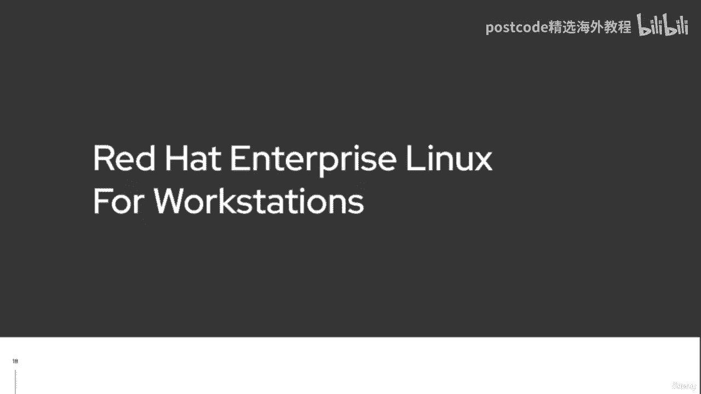
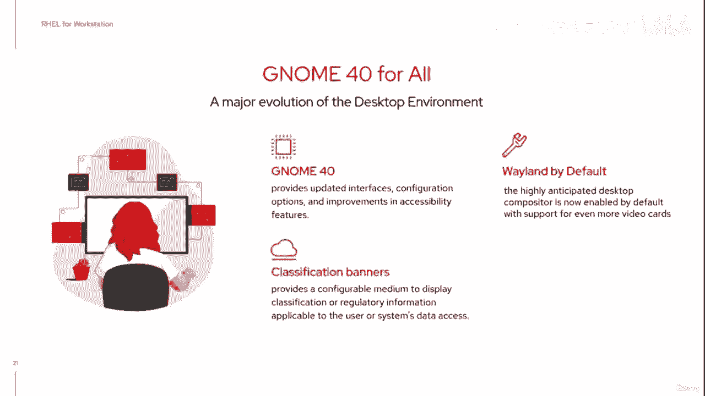

# 红帽企业Linux RHEL 9精通课程 — RHCSA与RHCE 2023认证全指南 - P4：01-01-003 Lifecycle - 精选海外教程postcode - BV1j64y1j7Zg

因此，以这四个支柱为背景，我们已经进行了哪些基础计划更新，一直在做？嗯，首先，我至少要对 Red Hat Enterprise Linux 8。6 表示认可。

你们很多人可能已经注意到，我们早些时候在峰会上同时发布了一些公告，这个月。Rail 9。0 于 5 月 18 日发布，而 RHEL 8。6 则提前一周于 5 月 11 日发布。

您将在这里听到我谈论的许多功能今天也可以在 Red Hat 上使用，企业Linux 8。6。当然，需要注意的是，现阶段 RHEL 8 的生命周期比 Rail 9 短。

说到生命周期，rel 的生命周期是什么样的？以下是我们网站上发布的 REL 9 生命周期规划指南的概述。您会发现，十年来我们一直致力于为您提供支持。您在前五年获得全力支持，然后我们进入维护阶段。

如果您愿意的话，剩下的十年。然后，对于一些需要延长寿命的客户来说，有一个延长的生命周期，你可以尝试在最后添加。但请注意，全面支持阶段中这些不同支持阶段之间有什么区别，这是您实施安全建议的地方。

您将获得高优先级的错误修复建议，并且可能会包含一些增强建议，在 REL 9 生命周期内发布一个次要版本。这就是我们倾向于引入对附加硬件的支持的地方。我们也许会提供增强的软件功能。再说一遍。

事物的演变更加迅速。每个次要版本都代表了安全错误修复和增强建议的积累，迄今为止已在该平台上发布的内容。维护支持阶段。因此，在我们的支持的后半段，我们倾向于稍微退缩。是的。

我们仍在提供关键且重要的安全建议。我们将选择一些紧急的错误修复建议，但请注意，在维护阶段，我们不做任何额外的硬件支持，也不打算做任何增强的软件，未来次要版本的功能计划。

那么这种次要版本对我们来说是什么样的呢？好吧，这是 REL 9 生命周期在未来 10 年的预计计划，年。您将看到的是，我们通常希望大约每六个月发布一个新的次要版本。再说一遍，这就是硬件支持的用武之地。

当我们重新预订各种应用程序时，可能会出现一些增强的软件功能，正在合并到 RHEL 中的流。您将看到的是，每个偶发版本都具有扩展的更新支持。虽然我们不鼓励这样做。

但我们确实发现我们的一些合作伙伴喜欢认证他们的产品，他们在特定的次要版本上的堆栈。因此，我们将为该次要版本提供扩展更新支持。但我们提前告诉您哪些次要版本将提供扩展功能，更新支持，这样您就没有猜谜游戏了。

但请注意，小版本之间有六个月的期限，我们将更新到 9。10，这将是最终版本，次要版本，因为我们将离开全面支持阶段并转向维护阶段。这让你对这些事情现在的关系有一个大概的了解。

如果您查看我们网站上的规划指南，您会发现红帽企业 Linux，八个看起来基本一样。因此，这种生命周期支持非常相似。我们提供的次要版本，扩展的更新支持，我们在前面有点不稳定。

但我们现在一直将其与偶数联系起来。例如，8。6 将是提供扩展更新支持的版本。但请注意，对于 RHEL 8，我们已经进入十年寿命的三年了。我们只有两年的时间来提供任何额外的硬件支持。

因为您希望将其放在上面，物理机器。当然，虚拟机为我们进一步扩展了这一点，我们不必担心，关于硬件支持也是如此。这些是我们对九号井的生命周期的看法。我们正在对九号铁路进行的其他重大计划更新之一是。

希望您已经，了解这一点，我们现在为个人提供的红帽开发者订阅，几年了。这里的想法是，作为个人开发人员，您可以获得红帽企业版的单一订阅，Linux。因此。

您不必一定要使用 Fedora 或 Santos 流才能使用，类似于您正在构建的内容可能希望最终部署到的内容。您可以在同一个红帽企业 Linux 上运行它来开发、测试并做好准备，部署到生产中。现在。

此订阅支持您在物理或虚拟节点上部署 REL，但它也，可部署在主要公共云上。现在，诚然，在开发者计划中，假设您是自给自足的，但您，可以接受每个次要版本、每个安全建议、错误修复建议，在次要版本之间发布。

然后继续将它们应用到您的环境中。这一切都是通过我们网站上的开发者计划自助完成的。稍后我会提供该内容的 URL。我们已经订阅这个开发者订阅有一段时间了。但现在发生的变化是，随着 REL 9 的出现。

许多组织来找我们并说，您，我们知道，我们希望能够作为一个团队来构建我们的环境。因此，我们刚刚引入了开发者订阅，而不是个人开发者订阅，适用于团队，适用于希望能够支持开发人员节点的组织。再说一次。

这预计不是您的生产环境。您打算开展什么业务来开展您的业务？组织可以在这里开发和构建他们的环境。但同样，使您正在构建的内容与您将要转换的内容之间实现更紧密的耦合，到您的生产环境。

现在还有一些其他的东西，就程序而言，是平台中的新东西。

显然，通过 Rail 9，我们已经对内核进行了改进。请记住，内核是操作系统的核心，是服务之间的桥梁，您正在运行的应用程序和系统的硬件。该内核已更新至 5。1，因为它为最新硬件提供支持。例如。

它改进了 USB 强制支持，但也有一些我们想要实现的关键功能，提到。这些功能之一是启用 Wireguard。您知道，传统上 VPN 支持是在 Linux 环境之上运行的用户空间应用程序。好吧。

wireguard 是一个实际的内核模块，所以现在我们可以简单地拥有一个轻量级服务，绑定到该内核模块，这应该为我们提供更好的加密支持和更快的响应，通过 VPN 工作的时间。这是在 9。

0 上作为技术预览提供的，但我们希望更多的人会这样做，正在与。514还改变了课程安排。我们正在跨 CPU 进程启用同步多线程。虽然我们预计这将提高大多数工作负载的性能，但这真正有趣的是。

帮助是减轻一些因事物引入或发现的漏洞，比如《幽灵》和《熔毁》。我们今年宣布支持的另一件事。1 月 1 日，我们在 ARM 上引入了对 REL 的支持。因此。

这现在意味着我们可以在另一个平台上运行相同的操作系统。我在幻灯片上展示了官方 REL 九个支持的架构。因此，对于我们许多人来说，我们使用的是传统的 x86 64，但我们也有继续支持。

支持Power处理器和IBM Z系列。现在添加的是ARM架构。警告。这不支持树莓派。好的。所以马上就把它放在那里。但对于我们在边缘环境和一些云服务器中发现的 ARM 架构，该功能现已在全球范围内推出。

并且可通过标准版的所有不同订阅选项使用，注重智能管理。因此，扩大我们的足迹，提高我们的可用性。说到边缘。

RedHat Enterprise Linux for the Edge 现在专注于我们超越现有的云服务器，但请继续支持那些在该边缘存放东西的组织。当然，边缘管理代表了额外的担忧，对吗？

如何进行远程更新、主要版本升级等，而无需前往和，触摸那些边缘设备。因此，零接触配置，可以更好地了解这些边缘设备的运行状况，能够及时执行所需的安全修复。所有这些现在都被纳入我们所提供的产品中。

这一直是我们非常关注的焦点，过去几年我们将其引入 RHEL。

另一个程序更新是为工作站引入了 RedHat Enterprise Linux。现在，这不是我们要走的，哦，又到了 Linux 桌面之年。

不，当我们在这里说工作站时，我们谈论的是那种高端要求的应用程序，你知道，也许你的建筑动画、其他视觉效果，或者也许你在科学领域，计算领域希望在那里完成额外的工作负载。

这就是我们在工作站 RHEL 中讨论的问题。您知道，这里的部分优势是工作站版 RHEL 现在意味着我们拥有 Linux 工作站，专为那些为我们提供完整十年生命周期的专业人士而设计。您知道。

这仍然是相同的经过认证的硬件，仍然是企业支持。整个合作伙伴生态系统都可以在此基础上构建。当然，工作站能够运行桌面世界。其中一部分还包括升级到 Gnome 40 等内容。

我们在桌面版本和工作站版本中都提供了该功能。新环境。

