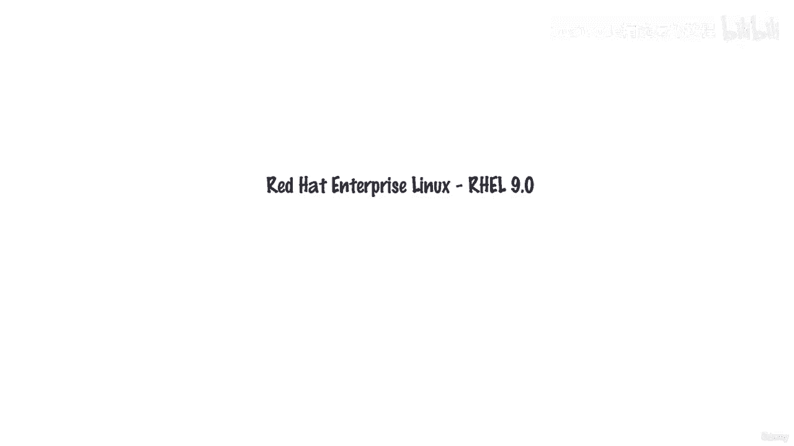
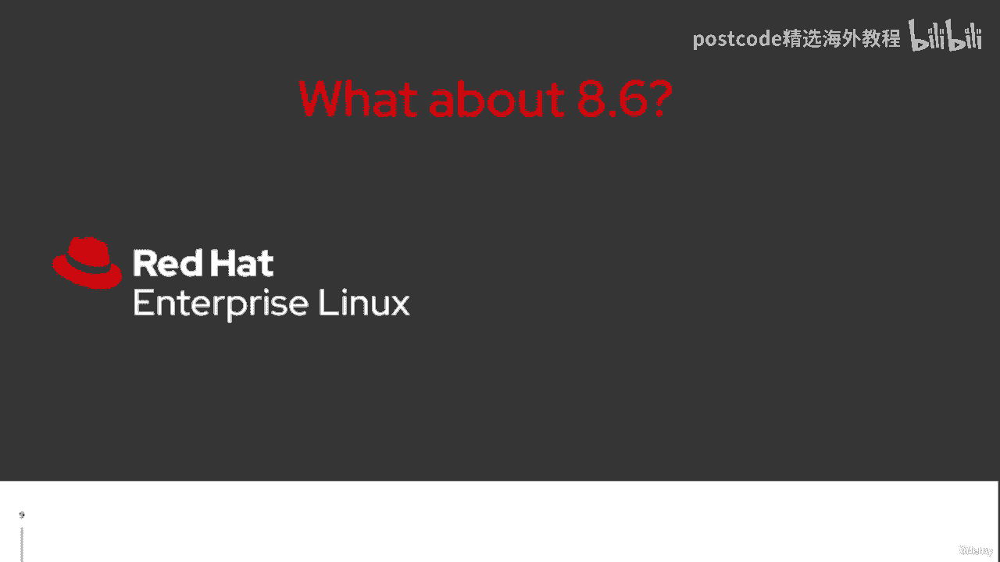
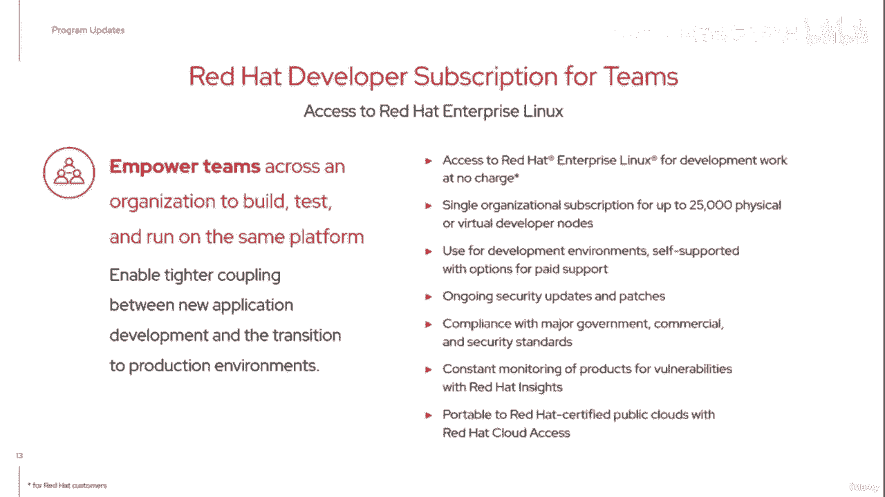
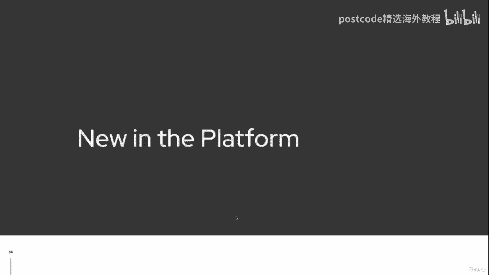
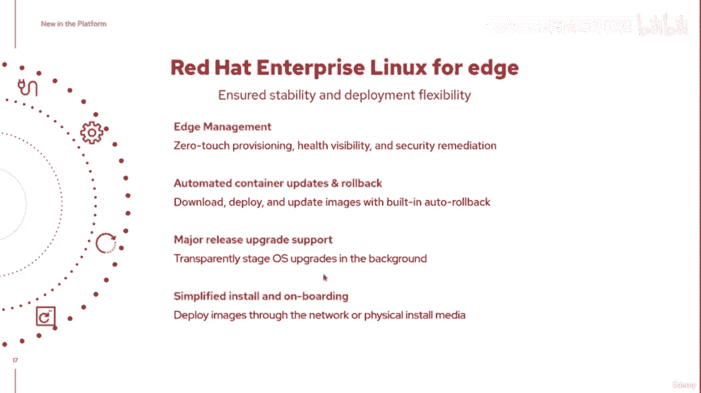
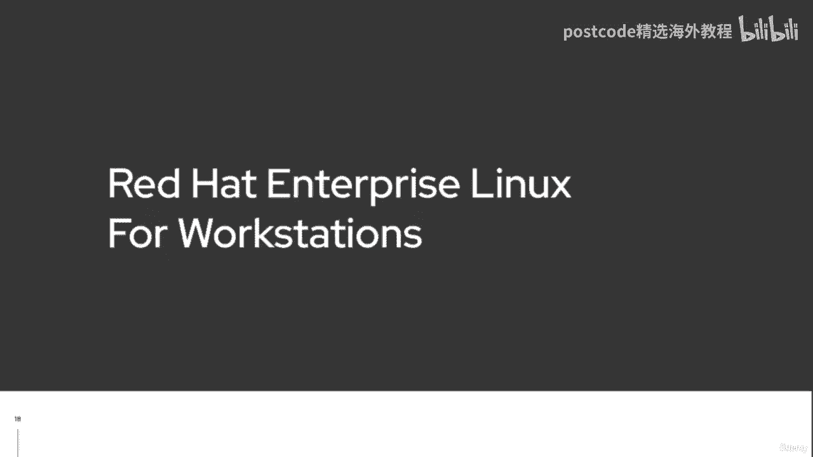
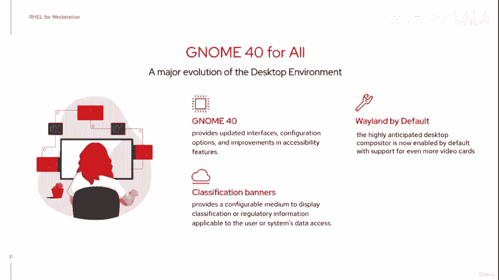

# 红帽企业Linux RHEL 9精通课程：P4：01-01-003 生命周期与计划更新

在本节课中，我们将要学习红帽企业Linux（RHEL）的生命周期模型以及RHEL 9引入的关键计划更新。我们将了解RHEL版本的支持阶段、发布节奏，以及面向开发者和企业的新功能。

## 版本发布与生命周期概述

上一节我们介绍了RHEL的四个支柱，本节中我们来看看基于这些支柱，红帽进行了哪些基础计划更新。首先，需要提及的是Red Hat Enterprise Linux 8.6。

许多用户可能已经注意到，红帽在本月早些时候的峰会上同时发布了两项公告。RHEL 9.0于5月18日发布，而RHEL 8.6则提前一周于5月11日发布。今天讨论的许多功能同样可以在Red Hat Enterprise Linux 8.6中使用。当然，需要注意的是，目前RHEL 8的生命周期比RHEL 9更短。

## RHEL 9生命周期详解

说到生命周期，RHEL的生命周期是什么样的？以下是红帽官网发布的RHEL 9生命周期规划指南概述。

红帽致力于为用户提供长达十年的支持。前五年是**全面支持阶段**，随后进入**维护支持阶段**。对于一些需要更长支持周期的客户，最后还有一个**延长的生命周期**阶段可供附加。

以下是不同支持阶段之间的区别：
*   **全面支持阶段**：在此阶段，红帽会实施安全建议、提供高优先级的错误修复，并可能包含一些功能增强。RHEL 9生命周期内的每个次要版本都在此阶段发布。这通常是引入对新硬件支持或增强软件功能的时候，技术演进更为迅速。每个次要版本都代表了截至该时间点已发布的安全修复、错误修复和增强的累积。
*   **维护支持阶段**：在支持周期的后半段，支持范围会有所收缩。红帽仍会提供关键且重要的安全建议，并选择性地提供紧急的错误修复。但在维护阶段，**不会**提供任何额外的硬件支持，也**没有计划**在未来次要版本中增加新的软件功能。

## 次要版本发布计划

那么，这种次要版本发布对我们来说具体是怎样的呢？以下是RHEL 9在未来10年内的预计发布计划。

红帽通常计划大约每六个月发布一个新的次要版本。这同样是引入硬件支持和将各种应用程序流中的增强功能合并到RHEL中的时机。

需要注意的是，每个**偶数**次要版本都提供**扩展的更新支持**。虽然不鼓励长期停留在特定版本，但红帽理解一些合作伙伴喜欢在特定的次要版本上认证他们的产品堆栈。因此，红帽会为这些版本提供扩展更新支持，并且会提前告知哪些次要版本享有此支持，避免猜测。

次要版本每六个月发布一次，直到9.10版本，这将是全面支持阶段的最后一个次要版本。之后将转入维护支持阶段。

RHEL 8的生命周期规划与RHEL 9基本相似。但请注意，对于RHEL 8，其十年生命周期已过去三年，仅剩两年时间提供额外的硬件支持（针对物理机）。当然，虚拟机环境对此限制有所放宽。

## 开发者订阅计划更新

除了生命周期，RHEL 9的另一项重大计划更新是开发者订阅。

红帽为个人开发者提供红帽开发者订阅已有数年。其理念是，作为个人开发者，您可以获得一份红帽企业Linux的单一订阅。这样，您不必仅使用Fedora或CentOS Stream来开发可能最终要部署到生产环境的内容；您可以直接在相同的RHEL系统上进行开发、测试和准备部署。

此订阅支持您在物理或虚拟节点上部署RHEL，也可部署在主要公有云上。在开发者计划中，假设您是自给自足的，但您可以获取每个次要版本、每个安全建议和错误修复，并将其应用到您的环境中。这一切都通过红帽官网的开发者计划自助完成。

随着RHEL 9的发布，许多组织表达了希望以团队形式构建环境的需求。因此，红帽引入了**面向团队的开发者订阅**，适用于希望支持其开发人员节点的组织。这同样不是用于生产环境，而是旨在让组织内部开发和构建的环境，与未来要转换到的生产环境实现更紧密的耦合。

## 平台内核与架构增强

现在，从平台本身来看，还有一些新的内容。

显然，通过RHEL 9，内核得到了改进。内核是操作系统的核心，是您运行的应用程序与系统硬件之间的桥梁。RHEL 9内核已更新至**5.14**版本，以支持最新硬件（例如改进了USB4支持），并实现了一些关键功能。

以下是引入的关键功能之一：
*   **启用WireGuard VPN**：传统上，VPN支持是在Linux环境之上运行的用户空间应用程序。WireGuard是一个内核模块，现在可以运行一个绑定到该内核模块的轻量级服务，从而提供更好的加密支持和更快的VPN响应时间。该功能在RHEL 9.0中作为技术预览提供。

内核5.14还更改了进程调度方式，跨CPU启用了同步多线程。虽然这有望提高大多数工作负载的性能，但其真正的好处在于有助于减轻一些漏洞（如Spectre和Meltdown）的影响。

红帽今年宣布的另一项重要支持是**对ARM架构的支持**。这意味着相同的操作系统现在可以在另一个主流平台上运行。

以下是官方RHEL 9支持的架构：
*   x86_64（传统架构）
*   Power处理器（IBM）
*   IBM Z系列
*   **ARM架构**（新增）

**注意**：此ARM支持**不包含**树莓派。但对于边缘环境和一些云服务器中使用的ARM架构，该功能现已全面推出，并可通过所有不同的标准订阅选项获得。

## 边缘计算与工作站版本

说到边缘计算，**Red Hat Enterprise Linux for Edge**现在专注于超越现有的云服务器，支持那些在边缘部署设备的组织。边缘管理带来了额外的挑战，例如如何进行远程更新、主要版本升级而无需物理接触设备。因此，零接触配置、更好地了解边缘设备运行状况以及及时执行安全修复等功能，现已整合到RHEL产品中。这是红帽过去几年非常关注的一个领域。

另一项程序更新是引入了**Red Hat Enterprise Linux for Workstations**。

这里所说的“工作站”并非指普通的Linux桌面，而是指运行高端要求应用程序的平台，例如建筑动画、视觉效果制作或科学计算等需要完成额外工作负载的场景。工作站版RHEL的优势在于，它为专业用户提供了具备完整十年生命周期的Linux工作站。它基于相同的认证硬件，拥有企业级支持，整个合作伙伴生态系统都可以在此基础上构建。当然，工作站能够运行桌面环境，这部分也包括升级到**GNOME 40**等更新，该更新在桌面版和工作站版中均有提供。

## 总结

本节课中我们一起学习了RHEL 9的生命周期模型，包括其十年支持周期内的全面支持与维护支持阶段，以及每半年一次的次要版本发布节奏。我们还探讨了面向个人和团队的开发者订阅计划，了解了RHEL 9在内核（如WireGuard支持、ARM架构支持）和面向特定场景的产品（如边缘计算版和工作站版）方面的关键更新。这些更新共同构成了RHEL 9为企业级计算提供的坚实基础。