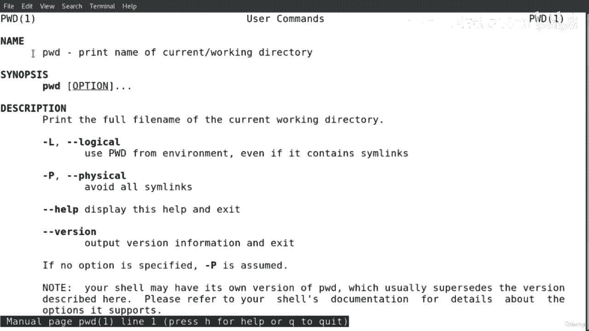
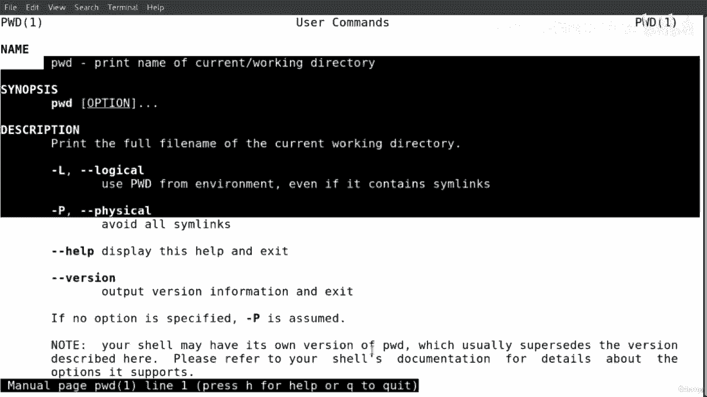
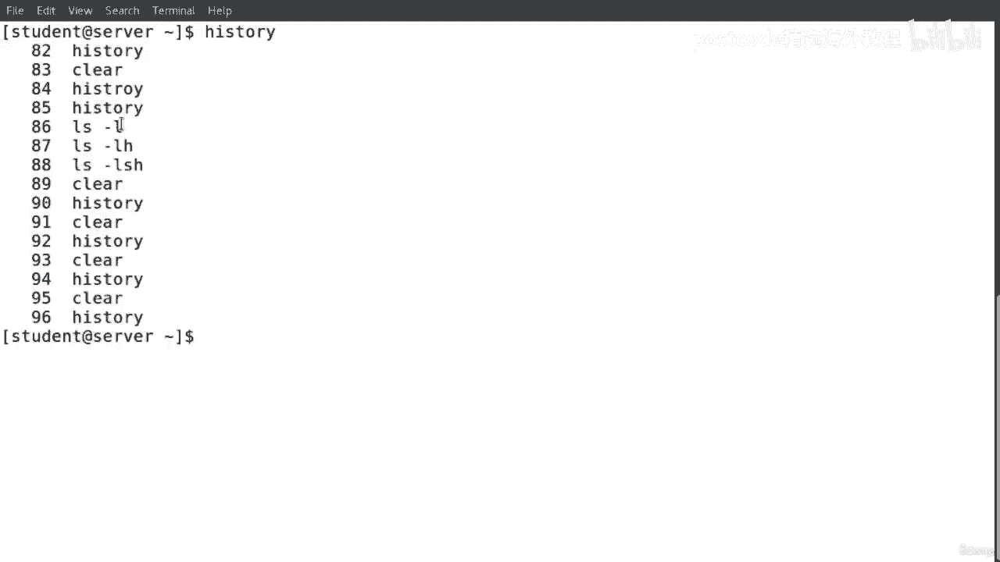
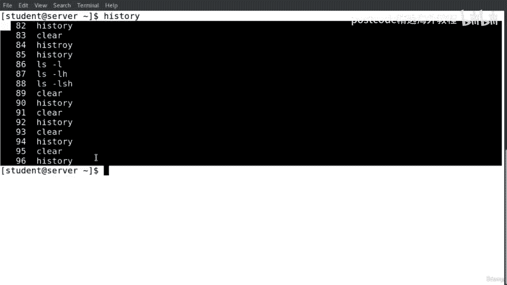
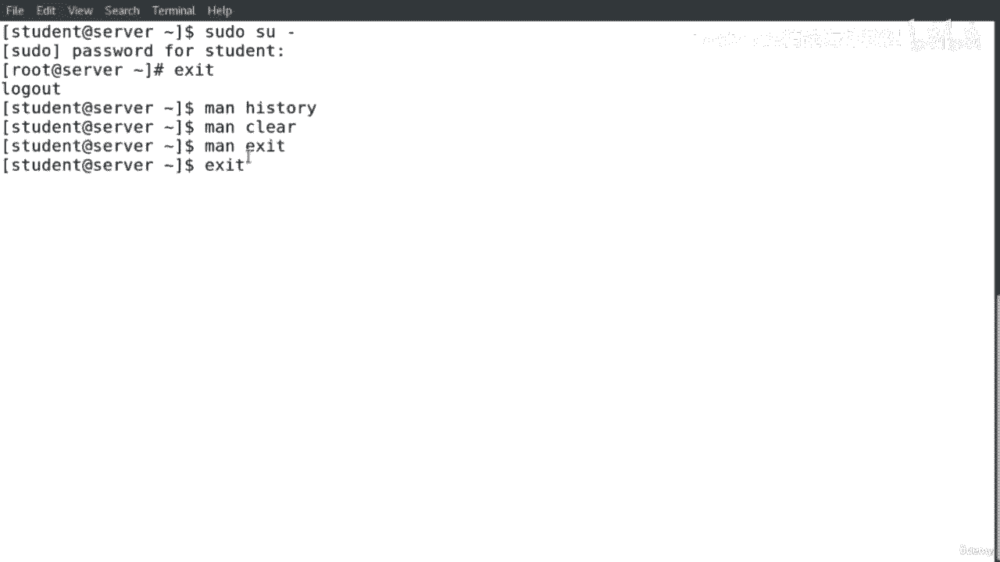
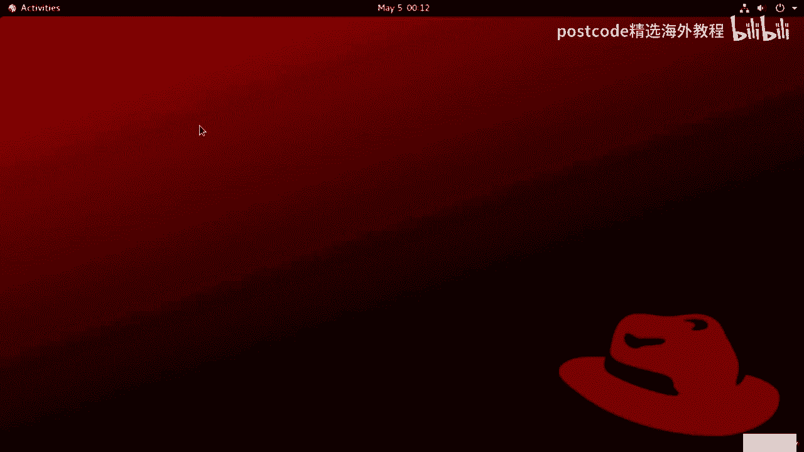
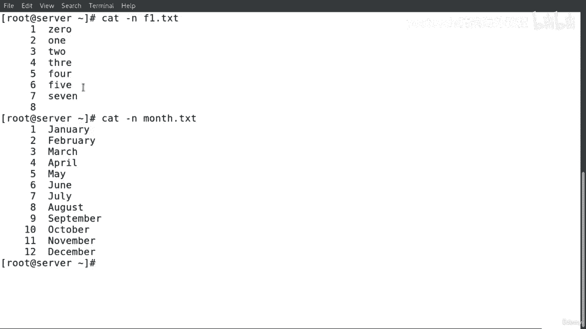
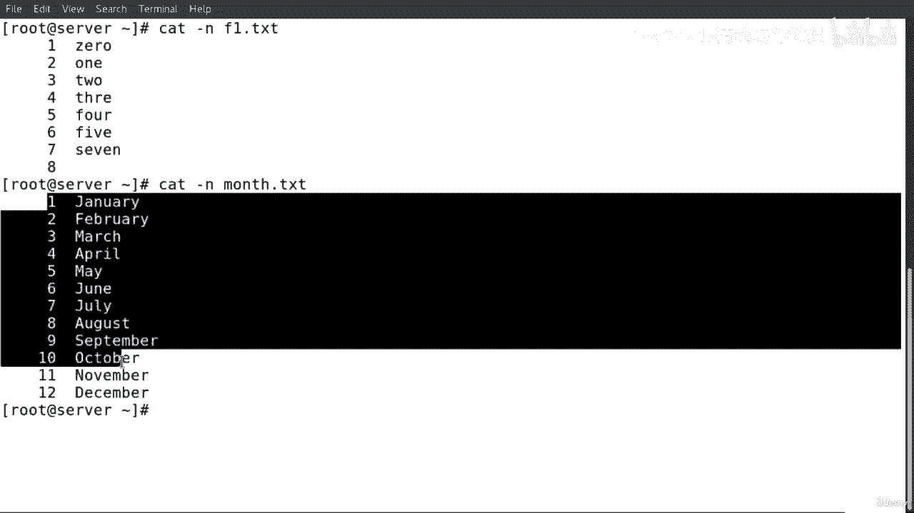

# 红帽企业Linux RHEL 9精通课程 — RHCSA与RHCE 2023认证全指南 - P50：04-04-026 Summary - 精选海外教程postcode - BV1j64y1j7Zg

Hello， everyone。In this lesson， I'm going to talk about the hierarchy structure and the directory tree in the Linux operating system。

In any operating system， we have directories and five systems。For example。

When we install when avering system， all directories under five systems are installed on the C drive。

Same thing for the operating system。All directories and file systems are installed on Macintosh hard drive。

 However， we can create directories and file system， either on Windows。Or Mac operating system。

Most Linux distributions have similar directories and file systems。

All these directories and file systems are installed under the forward slash。

As we can see here in this diagram， this is the forward slash， and we call this。

A road directory or a road file system。We consider the root directory or the root file system。

 the top level or the parent of all the directories and the file systems at Linux。

We can imagine this hierarchy selection as a family tree and Linux。

 as we can see in this diagram the top level。Or the parent of all the directors and the file system a Linux is the forward slash。

 Then whatever comes under the forward slash， we consider them a children。

These children also are parents for other directives and fire system under them。

Let's see for example， we have the slash， let's start first with the slash， the forward slash。

So the forward slash， as we said， it's the root directory or the root five system。

 and we consider the forward slash the top level and all the directories and the file system。

And then it's come。Under the forward slash。We also have the slash route。

 we consider the slash route the home directory for the user route。We have the slash diff。

This secretary has devices， files and details about the system devices。For an instant。

Physical devices and other information about devices。We have also the slash home。

 we consider the slash home， the home directory for every user and the system。

All personal directs and file and so on for every user are saved。And or under the slashwood。

 as we can see here， we have Tom and Mary， those two users under Tom， we have。ADiry documents。

 and we have also here a text file welcome text。 the same thing here for Mary。

 we have a directory pictures。And then we have photo that B B N G here。We have the slash temp here。

 as we can see。Here in this diagram， this directory basically is like a storage。 However。

 it stores temporary files whenever we report the system。

 everything is going to be deleted from the slash temp。We have the slash ETC。

This directory has many directories files。🤢，Shid scripts and programs with their configuration files that execute a Linux distribution。

 for an instance， BaWD， group， security， Ftab， and Chrome tabab and so on。

Also here we have the slash boot。This circuit has boot files and information about configuration for boot files and details about kernel of the Linux distribution。

For instance， some of these directories and files under the slash put are grip and grip。

2 you can see we have the grip2 and we have the grip。 Also we have a text file here。

 the grip that saves you， which is the configuration file here。

We also has here here because you can see here in this diagram， we have the slash bar。

This director has some data and information that most of the time。It changes on updates。

They are common directories in the slash file， for instance， log， mail。

 S and Op file all those directories。The most important director inside the slash file is the log file。

It just slash bar slash log stores this okay， this directory does slash log stores and save system log files and activities for files systems。

 for an instance。Boood that log， messages， yam log， mail log and so on。We have also here the s box。

 this contains information about current Linux kernel， for an instance， up time， devices。

 memory information， swapwas， partitions， and CPU， and un information and so on。

And theres also other directories and we can notice here in this diagram there are many directories under those directories I just mentioned about some of those。

 and we can save directors and files under these directories。That conclude our session。

 Thank you and see you in the next listen。Hello everyone in this lesson I'm going to talk about the root directory and the hierarchy of users and Linux。

As we can see in this diagram that there is a difference between forward slash。And slash route。

The forward slash is the road directory or road file system。

And it has nothing to do with the home directory for user route。We can consider the forward slash。

Is like the top level or the parent of all the directories and file systems and Linux。

The home directory， the s route for user， for route user comes under the。

Top level which is the forward slash。So we need to understand the difference between。These two terms。

 the forward slash。The root directory or root file system and the home directory for user root。

 So they slash route。So we can see here we can save files and directories under the slash route。

Every user in Linux system has its home directory， as we can see here。For example。

 we have Tom Mary John。These three users。😮，We can save。

Personal files and directories under these directories。And the same thing here， we can see here。

 this is the。The route or the home directory for use the route。

And we can save also files and directories under the s shot。So what is the root user？

Is the sober user in the system that has full refreshlees， for example， modifying and installing。

 deleting， adding users and so on。 Basically， we consider the root user。Is like the admin。

The manager of the system。It has a full control of the system and all over the users in the system。🤢。

We can see also here， we have。3 users， we have Tom Mary Jon。

These users have directories under their home directory。

 so this is what we are going to say that what is the bath of this user is a slash home slash Tomm。

 for example， and slash theto and would be the same thing for Mary and John。If a user can access。

Their home directory。ForExamp， Tom can access his own directory。Marary the same can。

 she can access her own directory and the same thing for Jean。However。

 these users can access other users directly except the user， unless if somebody， for example。

 Mary gives a permission to Tom to access her home directlyy。But for the route you。

The root user doesn't need to get any access。 The root user have a full control of this。

Users are all the directories system and the fire System Atlantic。

So we need to understand between the root users and the order users on the system。

That's it for decision session， thank you and see you in the next listen。Hello， everyone。

In this lesson， I'm going to talk about the absolute bath and the relative path。Also。

 I'm going to talk about the command options and arguments。L Linux。

We have two different types of bathing。We have the absolute path， and we have the relative path。

In absolute path， we have to write the complete path。And also， we have to start the bathing from。

The route directory， the forward slash， then well continue writing the the name of the directories and we separate them。

By typing the slash， So you can see here in this example。

 So this is the command Cd we want to change。The current directory in order to go to the directory。

Dsive。So you can see here this is the forward slash。 This is the root directory。

 Then this is the directory hall slash to。 So we separate between the directories by typing the slash。

Then slash LFC C S， then slash test。So this is the way how we write the absolute bath。

We can go now to the relative path。The ri bath is basically defined as a short bath。

As we already inside the directory。Or the working directory。

 We don't start the bath from the road directory， the forward slash。 for example， we can see here。

 We are already。Inside。The current working directory。

 And we would like only just to go to the next directory so we don't have to。Right the complete path。

So this is the relative path。 Its short。 We just。Again， I just change the current path。To the next。

But here。We have for the absolute path。 we write the complete path from the beginning。T that。

Majority of the commands usually have options， and we run these options after the commentss。

We can write or run these options either as a short not or a long not。 So as we can see here。

 this is the command we have L So is to list the directory contents。

And then we have the options on this option， either we write them as a short rotation or a long rotation。

 for example。We have the dashes。So we is this is the short not and we can also write the long notation dash dash size。

And we can see here is the argument comes after because the argument comes after the options here。

For an instance， we have it slash file and slash， This is the we would like to list the content of what。

Of the row directory and here would like to list the content， for example。

 for the slash home sdown s LF CSs。So for the options， we can write them either short notation。

 as we can see here or a long notation and the arguments comes after。

 so we just need to remember these commands。Options， then arguments。

The me reason for rewriting options and arguments after the commands。

Is to adjust the behavior of these command。 Therefore， when。

 when we pass options and arguments to the command， for example， here there is。

 we want to adjust the behavior and execution of these commands in order to receive different results。

That's it for this session， thank you and see you in1 next。Hello， everyone。In this demomo。

 I'm going to show you how to use PWD command and Cd command。

The PwD command is used to print the name of the current working directory。 For example。

 I'm going to type PwD hit enterter， as we can see here。🤢。

PWD print the name of the current work directory。So the current work directly。

 we are in slash home slash student。Get now let's move on to the next command， the C command。

The C command is used to change the current of or director， for example。I'm going to type C。

And already created the director's called。Diiry one， then I hit enter， so C space。

 then the name of the directory hit enter。And I'm going to type PwD to print。

The name of the current working directory， as we can see here。

 we moved on from the previous directory。the world can tree。To the menu working directory。

 So we are right now in directory。What。If I would like to change the current。

Dirreectory and go back to the home directory of this current user。I'm going to type only C。

Then I hit enter。ThePWD is to make sure。Yeah。We went back to the。Previous director。

So what is this directory， a slash home slash student and what is the previous one？

So this one is the current one， the previous one we were on。Slash home slash studio slash directchi。

If I would like to move on。Two steps， not just only to the。Next directory is the directory after。

 so I'm going to type C。Then the name of the 3D CDd， then spacee。

 then the name of the directory directory 1， then the name of the next directory directory2。

Then I hit enter。AndPWD。And hit enter。As we can see here， we moved on two steps。To direct。就。Now。

 if i would like to change。And or switch back to the directory that we were working before。

 also to print the current working directory。I type the command C in space dash。Then I hit enter。

As you can see here。We the this command prints the。

The working director that we were working before and also。Prince， the current work and directory。Now。

 let's move on。To change to the， okay， let's type BwD now just to make sure we are here in this working directory。

Now， if I hit Cd， then dot。It's not going to change anything just it's going just to change the working directory to the current working directory。

Now， if I would like to go back to that。And move on next to like two more steps。So directory1。

 then directory2， So Cd space directory  one slash directory 2， and then I hit enter。DWD， perfect。

 So we'll move down two more steps。 Now if I would like to change。

The directory and go back to the home directory of the current user， there is another command C then。

Tell that。Space delta then I hit to enter Pw D。 we can see over here that we went back to the。

Home directory of the current user。来什么饭吃的。OrIf I want to move on to the next directory Cd directory one and I hit enter。

Now， if I would like to change the directory and go back one more step to the previous directory。

 I can type the command Cd and dot dot。🤢，And I hit entered。D Wg。We can see over here。

 we went back to the home Ja。Of the current user。If I want to go back right now。

 thus I want to move on right now to the directory  one and directory 2 also。

 so two more steps then I hit entered。Then what I'm going to do right now。

I would like to change and go back one more step to the previous directory also so I can do C。

 then dot， dot， then slash。And I had entered。DWg。Can see here。

We went back one more step to the previous directory。Now， if I would like to move on。

 let's move on to the next one， bar 32。PWD can see here this is the working director right now。

We move on to the directory too。Now， if I would like to go back from directory2 to just two more steps。

 if I would like to go back two more steps from the current directory here。🤢。

To the home director of thewahi to this one。There is another command we can type C。

 the dot dot slash dot dot slash， it means that two more steps back。Then I hit entered。

You can P WD and I hit entered。 Okay， can see over here。 we went back to the。

From we went back two more steps from the current working directory。

To the home director of this current user。If we would like to get more information about these two commands。

 we can just type man。Then PWD。Man space BwD， then we hit enter。

So then we can find more information about this command。 So we hit Q to go back to the。

Ce to quit to go back to the。To the main page。 So down we here we type also man Cd。

 space C has entered。And I hit enter so I can see here more information about CQ to go back。

that's it for decision， Thank you and see you in the next lesson。Hello， everyone。In this demo。

 I'm going to show you how to use LS command。To list directory contents we run the LS command。Now。

 if I would like to show a long listing format I run the option L， so first I'm going to type LS。

 then dash L。And hitch enter。See here， we have different output。Then the previous output。Now。

 if I would like to pass an argument。With this command or it is also at the same time。

 I would like to show a long listing format。 and here we have a directory one。I would like to show。

The content。And also， at the same time， I would like to show a long listing format。

 so I'm going to hit enter。 as we can see here， we passed an argument with this command。

Now if I would like to show all the heading files in the current directorory。

So I'm going to type Ls at the same time， I would like to show a long listing format。

Going to type dash L， then dash a， dash a。In order to show all the heading files in a hit entered。

Can we go up there。You see here， this is the command as as I can see here。

We showed all the heading files。And we can see here dash a。Doesn't。Ignore entries， searching。

With that or that dot。This is a short notation， D dashhi， if I would like to use。

The long rotation so I can type。Dash dash all。It gifts us the same。哦。Okay。

 let's move on now if I would like to print the size or the the allocated size of each file。🤢。

And I'll go here at the top。Also at the same time， I would like to show a long listing format。

 so I'm going to type first， I'm going to type L， then dash L。Den dash is。And I hit enter。

As we can see here。It shows what。A size for each of this。Either the directory or the file。Also。

 I can wait I can't have it this way unless dash L S。Then at the same time， most。

 I'm going to use the previous。All option that dash in order to show all the heading files。

 I'm going to type a with。Then I hit to enter。As you can see here。So in this command， what they did。

I use three options。Dash L in order to show the long listing format。

Then dash S to print the size or to show the size and the a in order to show the heading files。

Let's go back here。There is also this is the short notation for the size， if I would like to show。

Size I can just type it like that。 that's the long notation and hit entered。As we can see here。

 I didnt use the dashel here。No glisting formatting。 You can see here the size beside each of this。

 either the directory or the。fi。Okay， now next I'm going to display the output in a human readable。

 so I'm going to type first and clean the screen L。Dash ill。Then S。Then Ech。So the itch。

Is going to display the output in a humor readable。 so as maker read it so can hit entered。

As we can see here。We have the kilopi and order that the rest of the fires doesn't have anything inside it。

So you can read it。Same thing here as is， if I want to write long not， so it will be human。Readable。

 D， D， human D， readable。Dos too get fast。But no， but this time I have to pass the dash estate in order to show it to us。

And I human read， but we can see it here。Now， let's move on。 if I would like to。

Refer the order with sorting around the option dash R。 So Ls。

 Also at the same time I'm going to use the long list formatting L then。off。

So this one is going to reverse the ordering with sorting。

If I would like to sort best on the alphabet。By enter extension， so let's clear the screen first。

 I'm going to type L， then dash it little listing formatting then uppercase X。As we can see here。Now。

 if I would like to list the subdirecties recursively， so what I'm going to do， I'm going to type L。

Dash， this is for the longneliness of money then dash。Upper case R。You can see here， we list。

What we did。 So this command listed the subdirectors exccursively。

If I would like to sort by modification time and newsest first， let's clear the screen。

 I'm going to type Ls。🤢，Dash Al de no format and dash T。Ha entered。

So this is the option dashT is to source by modification time on the news first。

You can see here the date。Can do it the same thing here if I would like to combine the two option。

With one dash。G us the same output。Cleared the screen。Now。

 if I would like to use like to list entries by lines insert search of by calling。

 so I'm going to type the LS dash， and this is the list to list。就。

The formatting or the long listing formatting， then after that， the dash X。As we can see here。

 this is the list and。By lines， inserted by Collins。So。Thatest the so we gonna be by Cols。Now。

 if I would like to use the dash you with the dash L E。In order to source by and show access time。

So what I'm going to do。I'm going to type LS dash U。Then dash ill then dashti。

So this one shows access time and source by。And also。Can show the newest first。나 그냥。

Now let's move on if I would like to show the fridge。哦。Dallas， command。

I'm going to type the long limitation dash dash first。For more information。

 if I would like to get more information about this command， I go to the main page， man。

Then spaceless。So can see here get more information about this command。

 and I can see all those options that I can use with the command。

And go back so let's conclude our session。 Thank you and see you in the next lesson。Hello everyone。

 in this demo I'm going to show you how to use date command， calendar command and up time command。

The debt command display the current date。I'm going to type the command date and hit entered as we can see。

 this is the Q date。Now， if I would like to display the version。Of this command。

 I'm going to type the command。Then the option， long notation， So dash dash version。

 then I hit to enter。As you can see here。It shows information about。The comment。Now。

 if I would like to display the calendar of the current month， I'm going to type CL then I hit enter。

So you can see here this calendar for this current month。Now。

 if I would like to display the calendar of as a specific month， I'm going to type on the CAL then。

The么。For example， June 2020， then hit enter。Seemed that if I would like to show。诶낚史。January 2020。

 and it entered the same thing if I want to show the December 22，2022。

Is going to show the same thing here。Now， if i would like to show the。The current time。

 and I would like also to show how many users are currently logged into the system and display also the load average。

 I'm going to use the command up time。So this is the uptime command。As we can see here。

Shows the current time。And then it shows up to what it's running up to the system is up or running for one hour right now。

 and it shows how many users we have only one user right now is currently logged into the system。

 Then it shows here the load average。Now if I would like to show the up time in a pretty format。

 so I'm going to type。U。Up time then dash P。You can see here， it shows。

The up time in a pretty format manner and same thing， if I would like to show the。

If I would like to show it in a long notation is going to show me the same output。

 but this time will be dash dash pretty。If I would like to show system up。Time， for example。

 like up time， then dash is。So this running things up。This time。Same thing if I were up time。

 dash dash since。It's going to show us the sent up。If I would like to show the version。

So we'll say up time then。Dash。An uppercase， V。can see here is to display the version information。

 I can do the same thing if I want to run。A long musician。

If I would like to find more information about the uptime command， I'm going to go to the mapb。

Can I see here。Formation about this command and also the options and go back also the same thing。

 If I would like to get more information about the calendar， man calendar or CL。Same thing。

 information about dead， same thing， man。 and I go to the date。H。Go back， let's conclude our session。

 thank you and see you on the next lesson。Hello everyone In this demo。

 I'm going to show you how to use LSCPU command and free command。

LS CPU command disciplines information about the processor and a CPU information or architecture。

 for example， I'm going to type LSCBU then I hit enter。

 you can see here you got information about the processor and the CPU。

And if I would like to get more information about this command， I go to the map page main LS CPU。

Can you get more information about this comment。I go back。Clear the screen。Now， if I would like to。

Dispplay information about the memory I use the command free， then hit enter。You can see here。

This comment shows discipline information about the memory。If I would like to。

Disipplay the output in a human readable。 So I'm going to use the option dash H。

This is a short notation。 I can use the。Long not， dash dash human。And chose as the same up。

That's in a humor readable。Now， if I would like to show the version of this command dash。

U case V and I hit enter reference when it shows us information about。Delation。Of the free comment。

 now， if I would like to show details about low and high memory statistics， I'm going to try free。

Then dash l。Its entered。Now， if I would like， as you can see here， is not an human readable。

 So what I'm going to do， I'm going to use that dash edge。Now， as you can see here， we have the。

In a human read。A， so went to clear。Scream。Now if I would like to show a total like a land showing column of total of the the。

 I'm going to type dash， so three first， then dash T。H entered。 you can see here this is the total。

Callling。If I want to show it in a humor readable， I'm going to put them and this together the T and the H。

 So I'm not going do the same thing like。Like every option will be separate。

 so I'm going to tap them together when hit's entered。Can see here。 you have the total。

Im going to call and torture right now here and also I get the result in a human readable。

That's it for decision， thank you and see you in the next lesson。Hello， everyone。In this demo。

 I'm going to show you how to use DF command and D command。DF command。

Disipplay the disk usage and partitions on the system。 For example。

 I'm going to type Df then I hit enter。As we can see here。

 it shows the disk usage and partitions on the system。

If I would like to show the output in a humor readable way。 So I'm going to type the option dash H。

 this is a short notation at enter。How about if I would like to show。

The out in same thing human read but。Long rotation I'm going to type dash dash a human dash readable then I hit enter。

As we can see here， it shows us。Disip output in a human rhythm。Now。

 if I would like to print the file system type， so I'm going to type Df。Dash， aque tea。So here。

 as we can see here， it's added a new calling and it shows five system type。

Cl now if I would like the same thing。I'm going to use the same command Df。But not a short notation。

 I'm going to use the。No not， so it would be dash dash print， dash type。Same thing。

If I would like to show or display the Albert in a humor readable。 And also at the same time。

 I would like to print the file system type， I'm going to。Run the command D F with the option。

A barti， then H the H， I can rack it together with the T， or I can do it this way， separate。

And hit enter。As we can see here。We print the system type。

 and also at the same time we display data within a human readable。Wait。

 now let's move on to the next command， the deal。So， do you。Disciples an estimated five space usage。

 So I'm going to。Hit enter。As you can see here， we got a long output。Let's screen the screen。

 I'm going to insert some。I'm going to type some options。 So I'm going this time。

 I'm going to use the humor readable， the dash edge。

 So the reason I would like to display output in a humor readable way and I hit enter。

As we can see here， we can read the rum right now and in a hum readable way。

Clear the screen and going up。Now again， I'm going to use if I would like to like show a total。

I'm going to type。The grand totals， I'm going to use that the option dash C and hit entered。

As we can see here at the bottom， it shows us the total。

How about if I would like to show it also with the humor readable way。In enter。

 you can see the difference right。As it clear the screen in order to get more information about this command。

 I I can go to the man B。 so man D you and get more information about it。But this command here。

And also the options that I can use with this command。

 the same thing for you would like also to get more information about the Df command man Df。

You see here is a main page and also the options that I can。Use them with Df。I go back。

That conclude our session， thank you and see you in the next lesson。Hello everyone in this demo。

 I'm going to show you how to use history command， clear command， and exit command。

To show the history and determination， we time the command history。So as we can see here。

 the history command keeps a list of all the commands that have been used from the session。🤢。

And also it allows us to replay or to use these commands in any instance of retiibring them。

If I would like to tell the shell to return the command on the line of the history， for example。

This slide， I'm going to type extension mark， then the number。This slide87， and I hit enter。

You can see here。This is the output of the line 87。Now。

 if I would like to delete a particular command。I'm going to type historyory then dash D。

Then I'm going to pick a number here。 For example， I'm going to pick 96。Let's clear the screen。

I'm going to 베스트 right now。As we can see here， we don't have that command anymore。Now。

 if I would like to delete the entire。U the entire contents of the history file。

 so I'm going to type history in dash C。Clear， then I'm going to type history again。

 So I just have the last two types I just。就 think my be。Now， if I would like to clear the screen。

Over the chair session， I'm going to type clear。If I would like to exit the terminal， for example。

 less， I'm going to log in as a root user。Now I only just looked in as a root user。

 Now if I go back to exit， I'm going to type exit。As we can see here。

 if you would like to get more information about the history command， we can go to the main page。

 man history。Same thing if you like to get more information about the clear。Go to the mainbe。

 clear the chair screen。Now， if I would like to get also more information about the exit。

 we can go to there。Main page of the exit command。 Also。

 there is another thing if I would like to exit。Theter。So right now I'm root user。

 so I hit or I type exit then I hit enter。

As we can see here， we close the chairman。That's it for decision。

Thank you and see you in the next lesson。Hello everyone， And this demo。

 I'm going to show you how to use what is command， T command， and man command。

What is command discipline one line manual page？I'm going to type。What is then Ls。So we can see here。

 display one line manual based description。 I'm going to type。Also。

 what is manbe or the man command can see here， give us information and display one line manual1b descriptions。

And if I'm going to type， what is LSCBU。Same thing。

Now let's move on to the next command type command。

 The type command shows the type of every Linux command。 I'm going to write type and what is。

You can see here it shows the type of E。Linux scuma， I'm going to write type M， same thing here。

 type info。Same thing here shows the type of every Linux command now。

The last command is the manb command。 so the manbe。

 we can use this command in order to show us more information and details about the command。

 It's an interface to the online reference many one。 For example。

 let's type al right man L you can see here information about this command and also the option and go back to the man B man。

The the main page。 This is the main page。 Then I'm going to type right now， man， D F。

And see information about the Df command。And also the option go back here。

 so we'll write type also man， man， you can see here the man man is an interface to the online reference manual was。

Okay， that's it for decision， thank you and see you in the next lesson。

Hello everyone In this demo I'm going to show you how to use the W command and the last command。

In order to show who is logged into the system and what they're doing， we type the command value。

If I would like to use the short format and I don't want to print the login time and the GCPU or the PCcPU times。

 then I'm going to type W。shorthor mutation is。Or I can。Type the long notation， dash that short。

 and it gives us the same output。If I would like to display version information about W。Command。

 and I went to type W dash our case fee。If I would like to show the old style output。

 then I'm going to type W dash O。If I would like to show information about a specific user。

 for example， student。And I hit enter， so we get information about。User student。

If I would like to show。The output， and I want to print the outputs with no heater。

 I'm going to type W， then dash H。Or I can say this is a short notation and also maybe I can use the log notation。

 so dash dash， no， then dash。Hey there。And it gives us the same out。然那什么饭就得。Next command。

 the last command， last command shows the listing of the last。Logged in users。So for example。

 I'm going to type last， as you can see here， we have the list of the users here。And if I would like。

 I'm going to clear the screen。To display the system shut down En a run level change I'm going to run。

The last command， then dash。X。And see here we got an information。

The system shut down enter and run let changes。this is the auto information。

 If we use the the option dash X。Let's move on to the next one if I would like to display the house name。

In the last column。For example， I'm going to type。Last then the option dash a， as we can see here。

 we can get to display the system。Or the host names in the last columns here can see it here。

Now if I would like to discipline。Full user names and domains names in the output。

 I'm going to use last10 dash W。As we can see here。

Its display full users names and domains names on the system。

If you would like to get more information about these two commands， we can go to the main page man W。

You can see here， this is the man of。Of the W command。

 you can see here also the options that we can use with this command can go back。

 It can go also to the main page of the last。Comt。That's it for decision。

Thank you and see you in the next lesson。Hello everyone In this demo。

 I'm going to show you how to use the Uname command and the host name command。

If I would like to bring system information， I'm going to use the Unname command。Now。

 if I would like to print all information about the system。

 so I'm going to use the UNM command and dash all So an option as a short notation。

 I can use also the log notation dash dash all。Now， if I would like to bring the kernel name。

 so I'm going to type view name。Dan dashes。If I would like to bring the kernel release。

 I'm going to type Unname in dash R。If I would like to bring the kernel version。

 so I'm going to type U name then dash lowercase V。If I would like to print the possess type。

 you named in the option。Dash P， I can also use the long notation dash dash processor。Now。

 if I would like to bring the machine hardware name， so I'm going to type U name， then dash M。

Or I can use the long notation dash dash machine。If I would like to get more information about this command。

 I can go to the main page， so man， then you name。And we can see here。

 we can get more information about this command and the options that we can use with this command。

 Let's go back。Now I'm going to move on to the next command。 Next command is the host name。

If I would like to show or set the host or the system host name。

 so I'm going to use the command host name。If I would like to display and show a short。

The short host name， so I'm going to type host name， then option dash S， the short notation。

 I can use also the long notation dash dash short。If I would like to print the version information on a standard output and exit successfully。

 so I'm going to type post name， then dash uppercase V。Now。

 if I would like to display the network addresses。Of the host name。

 So I'm going to type host name then。Dash lowercase I。

If I would like to display all network addresses of the host， so I'm going to type host names。

Then upper case by。If I would like to get more information about this command。

 I can go to the main page of this command and we can see here we can get more details and also the options that we can use with this command。

Last， and finally， if I want to change the host name。

 so the host name here I have a red hat if I would like to change it to， for example， server。

I'm going to open a new tab。And we can see you here。We have a new host name。

 so we have server that's it for decision， Thank you and see you in the next lesson。

Hello everyone In this demo， I'm going to show you how to create new files and new directories。

If I would like to create an empty file， I'm going to use the command touch。

Then the name of the text file， for example， F2 do Txt。H enter， then I'm going to type S dash。

 Can see over here we have a new text file。Now， if I would like to create multiple files。

 So I'm going to type touch then， for example if。3， the t x T， then a4， the T x t。And L S dash up。

 we can see here。 we have the F3 and the F4。If I would like to change the file modification time。

 for example， for this file。I'm going to change the time here。 So what I'm going to do。

 I'm going to type touch， then the short notation M commodification。 then the name of the file。

 I'm going to type L S dash L for。Despite， as we can see here， we have change that。

Time for this fight。Now let's move on if I would like to avoid creating new files， for example。

If I would like to create the new files， but at the same time。

 the system will not going to create this new file。

 so I'm going to type the option dash C in the name of the file， for example。

 5 so F5 x0 and we hit enter。And add S dash up， as we can see here。

 we don't have this file because of the short notation。The option dash see。Now。

 let's move on to the next command， the MK D Ir。 So this is making directory。

 So we use this command if we would like to create a directory for thet command。

If we would like to create an empty6 file。So if I would like to catch a new director， for example。

 D IR1。And L S dash， as we can see here， we have a new directory。Now。

 if I would like to create multiple。Directies at the same time。

 so I'm going to type the same command， make directory then D IR 2， then D IR 3， D IR 4。

 so we have to make sure there is spaces between the names of those directories and I hit enter L S dash L as we can see here we have。

New data chase here。D 2，3 and 4。Now， if I would like to make parentjecties， for example。M K， D IR。

 then Linux， then I'm going to create also directory inside this this directory， then slash red hat。

 then slash send to。Sent to OS， perfect。 and I'm going to hit enter。

But the system will not allow me to create this directory， so I have to add an option。Dash b。

To make parent directories， then I hit enter， then Ls dash L。 So I'm going here， as we can see here。

 we have this new directory， so I'm going to go inside this directory。LS。

 can see here we have this new directive。 I'm going to go inside red hat Ls。

We can see here we have this。You can also B theD in order to print。The current working director。

 as you can see here， we have the Linux。Then if I'm going to go inside this into a S here。

 for example。And PW D about 브랜드 as we can see here。We have Linux near red hat then send to us。

Now let's move on to the next command。Sometimes when executing making directory commands。

 there is no feedback for successful operations， so to see the details of the making directory process。

If I want the system to show me a message that this directory have been created or whatever。

 so I'm going to use the。The command M KDRR， then the option dash V。

Then the name of the directory I'm going to call this5。As you can see here， I send you a message。

It showshows us that the command created it directory D IR 5。

If I would like to give more information about this command， I can go to the main page。

And we can see here the MK directory this command makes directories or career directories。

 and we can see here else， this is all the options that we can use with this command。

That's it for decision。 Thank you and see you in the next lesson。

Hello everyone in this demo I'm going to show you how to use CP command and MV command。

CP command copiess files and directories， for example。

 if I would like to copy the6 file F1 the TT2 directory1， so I'm going to type C。

 then the name of the T file F1 the T0， then the name of the directory。

Now I'm going to check if I do have that expire inside this director。I do have F1 that x0。

If I would like to copy a directory to another directory。So C， then I have to add the option dash or。

So this is for the recursive in case if we have subdirecties inside directory2。2， Direct1。

Let's check it out now。You can see here， as we can see here on the screen。

 I have the2 inside directory what。In case if I would like to copy the content of Ana file。

 for example here。我也下啊。Content T 12，3 inside the T5， F1， dot Tt。Let's check X52， the F2 do Tt。

 We don't have any content there， so I'm going to use the CP。F1， that Txt， then F2。

 So what I'm going to do， I'm going to copy the content。Of check F1， the6 T2 F2。 Let's check F2 now。

Perfect， I as to considerr in the screen， we have 1，2，3。If I would like to copy。Multiple files。

 for example。F2 and F3 to direction 3。나 액 원。Let's ship the to you want right now。As we can see here。

 we have。Tex5， the F2， the Tt and F3， the Txt。If I would like to copy be。More than one directory。

 for example， I would like to copy directory 3 and 4 to directory 1。

 so I'm going to type C and we don't have to forget dashard or recursive in case if there is any subdirecties inside these directories。

 so then directory 3，Andjo x34。So we're going to copy these two directories3 and4 two。

 director 3 one。Let's shake the G1 right now。As we can see here， we have directlyy 3 and4。

If I would like to find more information about this command， C， we can go to the main page。

You can find more details， and also the options。That we can use you use them with the。

With the CB command。Okay， let's go back。Now， let's move on to。The next command， the MV command。

 if we would like to find more information about this command， we can go to the main page。

 So this command， the MV command。Moves are renames， names of files and directories。

And you can see here here the options that we can use with the Mficoma， as go back and。

Do some examples。 So I would like to。Move。F1， the TXT2 directory box， so I'm going to type Mv。

F1 T T2 box1。We two box。 So then I am going to hit enter。

 I'm going to check right now that directory box。As we can see here， we have。

They found the TXD glass double check here。And on the main directory or the home directory right now。

 we don't have a1 that takes T anymore in the current directory。Now。

 if I would like to move multiple files， for example， F2，3 and 4， same thing So M V。F2， then F3。

 and F4 to director 3。O， okay， let's check right now。AndB， as we can see here， we have。Tix file2，3。

 and 4。Let's check right now， the current directory。As we can see here。

 we don't have all these text files if I would like to move。A director3， so I'm going to type Mv。

 then I'm going to move Direct1。Two box。 So Im going to type the you want。Then box， LS， dash L。

 then I to go to this directory， as we can see here， we have directory one。

And check right now here in the current directory， we don't have directory one right now here in this current directory。

If I would like to move。More than one director。So what I'm going to do。

 I'm going to do the same thing MV。Then， for example， directory2。Then director3。Then the 34。2。

 two box Sir。Let's check right now the directory box。 as we can see here， we have directory 2，3，4。

Let's check right now the current directory， so we don't have directory 2 and3 and4。

If I would like to rename， for example， the text file here， so I'm going to use the same command M V。

诶 네。text。Text T E， then text the Txt， then I'm going to call this one file the TXt。

Lets check right now， as you can see here， so we change the name to file the Txt。

 if I would like to change the name of any directory would be the same thing。 for example， box。

 I'm going to use Mv。Box。To record this one。You like here 그 tree。Perfect on dash show。

As we can see here， we change the name of the directory from box to directory。That's it for decision。

 Thank you。 And see you in the next lesson。Hello everyone In this demo I'm going to show you how to remove directories and files If I would like to remove an empty directory I'm going to run the command or MDDIR in the name of the directory for example。

 directory for hit enter now I'm going to double check if I do have the directory I don't have directory for here anymore。

Assume that I have a direct and subdirects。And I would like to remove the subdirecty。

So what I'm going to do， I'm going to use the same command R MDIR， and I have here。D1 and inside D1。

 there is D2。I'm going to remove D2， then I hit enter。That little chick。D1， as we can see here。

 we don't have D2。Any more。If I would like to delete parents or the directory and even the subdirecty。

🤢，For example， here， we have Linux and inside Linux。

 we have another directory or a subjecty it's called D hat so I'm going to type ourMDIR。

 then I have to type the option dash P。This appearance。

 so he' is going to delete the directory and the subdirecty。 So Linux， then red hat I hit enter。

L S dash L。As we can see here， we don't have。The Linux directory anymore。

If I would like to get more information about this command， I can go to the man page。

and we can get more details and information about r m。D IR comment。

There is another command also we can use let's go to the main page of the RM。

So RM removes files and directors。So for the previous command， the RMDR。

 that one is just to remove directories， but for the RM it remove so the RM removes the files and directories。

So okay， let's go back here and what I would like to do right now， I would like to remove。

 for example， the text file。😔，Here R M and F1， the Txt。That step of shake。

So we don't have the text file anymore。 if one does TxT。If I would like to remove。A directory。

 for example。Seem that I would like to remove direction 3， so R M。Howeverwi。4。This command。

 we have to use the recursive the dash R in case if there is any subdirecties inside the direct。

 So and then I'm going to type D IR 3 hit enter L S dashL。As we can see here。

 we don't have D3 here anymore。Now， if I would like。To run the option dash I， for example， here。

 the RN dash I in order to promote or to ask us the system will ask the user。Before every remover。

 if you are sure do you want to delete this text file， for example， if I would like to delete F4。

We want the type of force， so the system will promote a question， so it is going see it here。

Now I have to answer yes， hit enter a list dash L you can see here。 so we don't have。F4 anymore。

And there is also another option。Its dash， if iss for。

Dash F like force if I would like to force the system to remove the file， for example。

 Im going to force the system to delete this director。 I'm going to hit enter S dash L。

 as we can see here， we don't have D1 anymore。If I would like to remove all the text files。

 so I'm going to Rm。Dash R。Then I'm going to type star that Txt。

 So on this command I'm going to tell the system that I would like to remove all the text file。

 so anything doesn't matter we start with what that Txt as long as the file ends with the Txt。

 so the system will remove that text file。🤢，H enter L dash l。As we can see here。

We don't have any fixed anymore。 if I would like to remove the diies。 Also。

 I'm going to do the same thing R M D R。So our aim dash dash R this is for the recursive。

 then I'm going to type D I R then star。So as we can notice here。We have one and 2。 so， and they are。

 they have the same name。 They， they like they share the D IR and the D IR at the beginning。

 So I would like to， I'm going to。Teill the system2， delete all the directors。

 It doesn't matter what's the ending。Of this directory， I'm what to enter right now LSL。

 as we can see here， we don't have the directories here anymore。I would like to get more information。

 as I mentioned， I can go to the of the RM。You can see here we can find more information about this command and also we can find the options that we can use with this command。

Let's conclude our session。Thank you and see you in the next lesson。Hello， everyone。In this demo。

 I'm going to show you how to use the T command。The tar command is an archive in utility。For example。

 if I would like to create a tar archive file for directory files。

First I'm going to type the tar command， then I'm going to use the option dash C。

In order to create a new D archive file。And also， I'm going to use the option V ver both show that that tar file progress and the option F。

It's for the fine name type of the archive file。Then space。

 and I'm going to call this the tar Arch file F1， and I have also to type the extension of this file。

 so will be that tar space。 then the name of the directory hit enter Ls dashL as we can see here we have a new tar archive file。

Now， if I would like to create a compressed G zip archive file， I use the option dash Z。

So I'm going to type the tar command。 then dash。 see。 then the dash Z is for the Gi zip。Ar file。

 then V F。Space， I'm going to call this one F2 do tar。

 then also I have to to type the extension for the compressed GZ archive file。Dot。Zi。Zit。😡。

Then the name of the directory， as we can see over here， we have the command and the options。

 and we have the Z。 then the name of the。The compressed Gzearkafi then the name of the directory。

At enter。 there is another way also we can do over here。

 If I would like to combine this two extension together， I can write it this way T G Z at enter。

L S dash L， as we can see over here， I have two compressed G zip archive Phi。

If I would like to create a compressed B Z 2 archive file， I use the option dash。Lower case J。 So C。

 lowercase J than V F。In space， and I'm going to call this one F3 dot tar。Then that be zipped too。

Then the name of the directory files。At entered， there is also another way and a short way。

 I can do it this way。 So it will be dot B Z2。 I will keep this the race as as it is as for here at the J。

This is for the。Compressed B zip。To archive file， then I hit enter a dash L。As we can see over here。

 we have these two files。 This is the first one。 this is the compressed bi zip。Two areal。

 and this is the second ones。If I would like to create a compressed Xz archive file。

 so I'm going to type tart dash。C， this is to create， as we said， the new Dar archive file。

 and for the compressed exit archive file， I'm going to use the uppercase J。🤢，Then the Vf。Space。

 I'm going to call this one a4 doctor。Then dot X Z。

 then the name of the directory hit enter L S dash L。 as we can see here。

 I have the compressed X Z archive5。Now， if I would like to list the contents of the chart。

Arive file。 I'm going to check chart。Then dash T， So the T is to list the contents of the tar archiv file。

 then Vf。Then the name off。Da。If one， the name of that。5。It enter。As we can see here。After we。

Added the option， dashty。In order to list the contents of the tar archive file。If I would like to。

Enter or extract a tar file。I'm going to type。First， let's I'm going to move the。

One of the tars fires here。To the directory box， for example。Then I'm going to C D to the box。

Alas dashel。 So we have this。The tar file， then I'm going to enter or extract this tar file。

Go to cha。Dash x。V F then the name of the。Tar file hit enter， then LS dashil。As we can see here。

 we have the directory files。Let's go back。And there is also another way if I would like to enter or extract in a different directories。

So I can use the option dash uppercase C。 So I'm going to。Type the commandar， then dash X。

This one is for Antar or or extract。The cha file， then Vf。真的 name我负责。

File directly for the chart file。For example， we're going to use this one。The G it。The Jesus said。

 then after that， I'm going to type dash uppercase see。I' am going to add this。诶。

The after I'm going to extract。The file to this directory to the directory box， hit enter。

Then I'm going to。Diirecty box just to make sure that we have the file over there。As we can see。

We have the new directory here， but。If I would like to get more information about。This command。

 I can go to the main page。Of the cha command。And we can for find more details and also all the options that we can use with this comment。

That conclude our session， thank you and see you in the next lesson。Hello everyone In this demomo。

 I'm going to show you how to use the CA command and the echoco command。First。

 let's start with the cat command。 Cat is the shortcut for the concateate It basically fu the content of the file and prints on the standard output。

🤢，Let's do some example if I would like to show the content of the58C slash bath Wd。

 so as we can see here。I type the CA command first， then slash， it is see then slash。

Best W D page enter， as we can see， we get the output。And we show the content of this file。

 You can do another example for another file。 it is C slash shadow。Hdge enter， as we can see here。

 we can see the content of this file。I also can view the contents of multiple files。 for example。

 I have to write first CA command， then F1。That takes D， then F2， that takes T I to enter。

 as we can see here。The first Albert。For the first file， a1 dot takes0 and the second output。

Is for the second5。F26， I can do it also for these two files。 it is C slash pass。

WD and ETC slash shadow。It enter， as we can see， we got。The output for both files。Cl。Now。

 let's move on。If I would like to see the line numbers of a file， I can run the option， for example。

 here， dash in so you can use this option then。The name of the file or the text file here to enter。

 as we can see over here， I can do the same thing here in。Or for the most。And I hit to enter。

 as we can see over here， this is the numbers， the line numbers。

Of the5。Now I'm going to move on to the next command， the Eco command。

Eco command display a line of a text or a string on a standard output or a file。 For example。

 if I would like to display a line of a text on a standard output。

 I am going to type first the Eco command， then I can write a text or a string。

 for example here Holo。Or then explanation mark hit enter， as we can see over here。

Its this command display a line of a text or string on the output。Order on a send Albert order file。

 Now we gonna do the file。If I would like to redirect the operators to a file and not to standard your output。

 I'm going to type Eco first。Dim。The strength that I would like to redirect Ho， for example， Ho word。

Exition mark， then I'm going to use the sine space sign greater than。

Then I'm going to direct just outcome to a text file。🤢，So as we can see。

 we have the echoco command first space then the string。Then space。

 then assign greater than then space， then the name of the5 hit enter。

 Now I'm going to do CA file the text。As we can see here， we have。

The texts that that we redirect the text to。To the file statistics。

If I would like to remove all the spaces in between the text， I can run the option。🤢，Dash e。Then。

 between a quotation mark。I am going to type Ho， and also I have to add slash B。

So the slash B is to remove all the spaces in between the text then。I'm going to tie board。Danlei。

Close the quotation and hit enter。As we can see here， what we did。

We removed all the spaces in between the text。Now， if I would like to。

To print files of a specific kind echo。Dian。I'm going to do for the text file。 So I'm going to。

I'm going to type starface then that Tt。 So what I'm going to do in this command。

 I'm going to print all the files of。The Txt type， then hit enter， as we can see here。It's print。

Or discipline a line of all。The files for the the Tx T extension。

If I would like to get more information about the command cat。

 I can go to the main page and I can find the options for this command and the same thing for the command。

呃えコ。You can find also all the options and details about this comment。That conclude our session。

 Thank you and see you in the next lesson。Hello everyone In this video I'll show you how to use the head tail and sword commands。

 So in many cases you might only be interested to display the first few lines of a file and for that case。

 you can use the head command for example， if I run the command head s Esy s pathwd it will show me the first few lines of the file s Esy s pathwd。

 In fact， the head command displays the first 10 lines by default All right。

The head command can accept more than one file as an argument， for example。

 the file on the command head s Esy slash passwd s Esy slash group。

It will show you the first 10 lines of both files here okay so you can pass multiple files as an argument to the head command as you can see the first 10 lines of the slash E C slash grew file and the first 10 lines of the s et C s pathwd file you might be wondering what if I want to view。

The first three lines of a file in that case， you can use the dash an option or pass the dash an option followed by the number of lines followed by your file。

So here。I'm showing the first three lines of the file s Esy s passWD。

And here I'm going to show the first seven lines because I like number seven， it's my lucky number。

So here I show the first seven lines of my file slash etsy s group okay。

 amazing now what about the opposite case， what about if you want to see or display the last few lines of a file？

In that case， you can use the tail command， make sense， the opposite of head is still。

Tale s Esy s pastwD will show you the last 10 lines by default of a file， and in a similar fashion。

 you can use multiple files here。Let's see the different file。Slash Esy slash services is a very。

Nice file here it shows you all the different Linux services and the port number they use and the protocol as well。

Okay， so here。I see the last 10 lines of the file slash Esy slash services and the last 10 lines of the file slash Esy slash path Wd。

And the till command also accepts the dash in option。So let's see the last three services。😔。

And let's see the last seven lines of the file slash essay slash group。😔，Okay， amazing stuff now。

The only remaining command that I will discuss in this video is the thought command。

 and as you may have expected， the thought command simply sorts a file。To demonstrate。

 I created two files。One called the fruit dot TXT and one called a number do TXT。

The fruit to TXT contains all the fruits I like。😔，And I really want to get a kiwi right now。

And the number to Txt contained the numbers from 1 to 10 in a random order， as you can see here now。

What if I want to sort the file through do Txt alphabetically， I can run the command sort。🤢。

Fruit do TXT， as you can see now my favorite fruits are sorted alphabetically apple， banana， berry。

 kiwi， mango， orange， strawberry Okay what if I do the same thing on the number do TXT。Wait a minute。

 they are not sorted。 It definitely change something here， but they are not sorted。

 That's because if you want to sort numbers， you have to pass。The dash an option。To the sort command。

Number to TxT， as you can see here， my file is sorted。So here's again。If I see the file。Now。

 if I run the dash in。As you can see， it displays the output in a sorted way。😔，All right。

 so this takes us to the end of this video。 I hope you guys enjoyed it， Co。

Hello everyone in this demo， I'm going to show you how to use the pipe command and the grip command。

First， let's start with the pie command。 The pipe command helps to use two or more commands as one command in order to retrieve and obtain one output。

Let's show some examples how to use cos with pipe Com。I'm going to type first。The command。

 cat slash  E0 seat slash baability space in the pipe。Then the second command is this。

 as we can see here， this is the first command。Then the pipe， then less hit enter。

And I'm going to do another example here， the CA slash ETC slash shadow。Then space five then more。

It entered， as we can see here， we get one up。I'm going to do another example here， slash pin。

 then pipe。And I'm going to use the command WC， WC print， new line word and Pi counts for each file。

And also， I'm going to use the option dashL in order to get the number of lines hit enter。

 as we can see here， we got one up。Let's do another example here for the file month。

So the first command is cat math thattic exceed and pipe。In this case。

 I'm going to use the commandly C， then dash C in order to get the number of characters I hit enter。

As we can see here， we get one output。I'm going to do this time Cat for this file。 F。

 the Tx T and the pipe。Then， W C。Dash W。So the dash W is the option gets the number of folds at a hit enter。

Now let's move on to another example that I'm going to show the content of the F2 that Ht。

 as we can see over here， now I'm going to use the。

Head command dash in the number means that I would like to show the first is3。

Lines and the file F2 that takes T。 And also at the same time， I would like to use the pipe。Until。

Dash and the number one。 So what I'm going to tell the system， since we have the pipe here。

I'm not going to show the firstest three lines。 I'm going to show the last line。Here， for example。

 here。The freightest command shows the freight is3 line 1，20 and 2， but with detailed dash in1。

I'm going to show only the last line here I hit entered， as we can see here， we got the last line。

If I'm going to change the number here to2。So let's take the first command here。

I'm going to show the first three lines， however， with the pipe tell dash and then the number two。

 it means that I would like to show the last two lines and hit enter， as we can see here。

 we get the last two lines here。Now let's move on to the next command。

 the grip command grip command prints lines matching a batter， for example， grip。Then no， log in。

4 the5 ATC slash bass deputy。Perfect， I'm not going to use the pipe here。

 I just want to get the outcome first。 Then we're going to use the pipe to compare the outcome between this outcome and the next outcome。

 So I'm going to hit enter as we can see here。 we get a long outcome， as we can see here。

 because we didn't use the pipe with another。Comt， so I'm going to use the same command here。

Then space5， WC， then dash L in order to get the number of lines ahead enter， as we can see here。

 we get totally different out。诶。Going to do another example also here， Cat number。First。

 I'm going to run the。The command， I'm not going to use the pipe command here hit enter。

 as we can see， we get the numbers from 1 to 20。 Now， I'm going to use the pipe command。

Then I'm going to use sort。And I hit enter。As we can see over here。

We sorted the content of the file based on the number， it started from one， then two and so on。

If I wouldnt do。cat。month。I'm going to do this example of the month and the pipe。

 Then I would like to grab a。And I hit enter。As we can see over here， we got the outcomes that has。

Do what。The letter A。If I will do the same thing but a different letter grip P， for example。

 so with the P， I'm going to get outcome。With litter。B。If I will use the head command。Head minus n。

 then number 5。 It means that I would like to show the first。5 flies and。Fileman the takesti。

 then the pipe sort。Hitch enter。So， we get the first。5 lines。

 then what the pipe we ser them based on the alphabets。Do the last example here tell。Minus n。

Then number three， I'm going to do it for the month。The textt file， then the pipe， then sort。

Command dash R or the recursive。 then hit enter。 as we can see here， we got。An outcome， based on。

The reverse way for the source comment。That conclude our session。

 thank you and see you in the next lesson。Hello， everyone。In this demo。

 I'm going to show you how to use the D command。The di command compares files line by line。

 for example。I would like to compare this two file， the F1， the Tt。Then the F2 that Txt。

So what I did， I wrote。The de command first， then space。Then the name of the first text file here。

 I have f1 dot Tt and space then the name of the second text file。 So F2 dot Tt hit enter。

And I also can do the same command with option Y。In order to display the Albert in two columns side by side。

And I hit enter， Okay， let's analyze the output here as we can see here so。The first line here。

 as we can see here， comparing to this one。It means this。It tells us to delete0 from the file。

And the second line， as we can see here， is the same， so we don't need to do anything。

 so here to the delete So D。It means to delete this。And as we can see here。

 we have to delete the value zero。And here in the second line， as we can see2。Add2。

 So it means over here， we need to add 20 to the first line。The third line。

 we just need to do anything。Fourth one here， as we can see over here。

 we need to delete this one and to add3。And we can see here the line7in and eighth。

 we need to change them with line sevenin here， so as we can see here the sevenin。

 we need to change it with what with 10。And the last line8， we need to delete it。

 as we can see over here。 So 7 and8， it change it with 7。

 so it means that we need to delete 7 and we need to add 10。So let's repeat this again， D represent。

 delete and a add C to change。I prefer this one。 So this one the dash U in order to display the output in two columns side by side so we can see the difference。

 This is the first text file F1 the T T， and this is the second。As we can see over here。

 this is the second X F2 that isD。If I would like to report only when file differs， so if there is。

II changed the dash to dash Q I use this one before I run these two commands in order to report only when files differ and hit enter。

 as we can see here， this is the message from the system to tell us this there is difference between these two files。

And I'm going to do another example De minus C。 So the minus c as we can see here。

 if I would like to produce the output and the contents format。 So I run this option。

 then the name of the first file， then here is the name of the text file hit enter。So it means here。

This is the first file， and this is the second file。As we can see over here also。

 this is the numbers of the lines and also here is the numbers of the lines。us。

 it means that to delete。If there is nothing beside the line， it means there is nothing to do。

 is the same so one。Is the same here like one。 So with only， we need to delete0。

And the explanation mark， as we can see here， we need to change those lines。🤢，And the same thing。

 we need to change this with this one。 so we need to。And the same thing here。

 we need to change that one。If we would like to get more information about this command about the the command。

 you're going to go to the mapage and we can find more information and details and also the options that we can use with this command。

Let's conclude our session， thank you and see you in the next lesson。Hello everyone and this demomo。

 I'm going to explain the difference between Sucom and SU Com。

I use the Su command when I would like to run a single command with wood privileges。 However。

 I need to be in the suitable file。🤢，Or to be in a group in the suitable fight。

So let's do an example here， for example， if I would like to display the content of the shadow file。

The system will not allow me to show that file， because I don't have a permission to view the content of this file。

So it's permission tonight， so since student is part or it is in a group。

 it is in a root group and the Su file so I can use the Suu command in order to view that file。

 so I'm going to type Sudo first。🤢，Then the command cat， slash ETC slash shadow， I hit into。

Then I have two type the password word。A change and I can display the content of the shadow file。

Same thank you for the F this command。SDA H enter。I don't have any permission the permission denied。

 So I'm going to use the Su command in order to use。对啊。If disc， command。I hit enter。

 as we can see here right now。I can run。The if this command。When I use the su do。Com on。

 why because student is in a group。In the S file， so the student has privilegees to run single command in the system with root privilegees。

🤢，Now let's move on to the next command， the command issue is the issue。

Is used to switch to another user So the S。I is the short for switch and U is the short for user。

But you can also switch to the root user by invoking the command with no parameters。

 So let's do first， the first example here S dash then。Then at the name of the user。

 saw an example here， If I would like to use the option dash or dash L， or dash， dash log。嗯。

In order to what， in order to start the shell as a log and shell with the environment similar to。🤢。

A real logging。 what it means， I'm going to open a new shell for user tone。

 so I'm going to hit enter。Im going to type the password right now， I have a new shelf for user top。

I'm going to exit now。If if I'm going to do just the S without dash， then the name of the user Tom。

 I hit enter。🤢，Going to type the password。As we can see here。

 we didn't orbit like a new shared with the environment similar。 So I'm still。

In the shell of the city。 So if I'm going to type Ls。

I have a permission denied because I don't have the privileges。

In order or the permission order to list or view the content of user term。

 so we have to pay attention to this point， So is the best way to use SU， then dash。

 then the name of the user。And there is also another thing if right now I'm a user student。

 if I would like to switch to a root user， I can type Su do。Then issue， dash， hit enter。Now。

 I'm a root user。So I don't need like since I switch the user。From a student to root。

 I don't have to use the pseudo command， I can run any command， for example， here ATC。And schedule。

As you can see。Now， let's run also the F disk without F disk。Slash slash dev slash SD。

 you can see here， we can run the command without。数 do come。아멍 그 왜。Exit as also。

 I can log into the root user by typing S。Then dash like that。 hit enter。Thatward， right now。

 I what it。 I switched from。A student user to a route user For more information about the command。

 Su do， we can go to the main page and we can find more details and the options also that we can use with。

Su command， the same thing for the SU man SU， and we can run a command with substitute user and a group ID so we can find also the options over here。

That conclude our session， thank you and see you in the next lesson。Hello everyone in this demo。

 I'm going to show you how to use the find command。Find command searches for list。

 files and directories。I also can use conditions with fine command。For example， I can use names。

 file type， size， users， groups， permissions and so on let's apply some examples to show how to use the find command first I'm going to type find then I would like to type from where to start the search so in this case I would like to type dot。

Which means I would like to start the search from this。Current working director。

 So the current working director is the slash route， then。Type。That's the type like the type。

 either files or directors that I would like to to do with a search。

 So in this example I would like to do a search for files then I hit enter。As we can see here。

 we get all the files under this current working directory。If I would like to do another example。

 same thing， I will do this time under slash home， So I would like to start the search from。

Slash home， then the type。Diirory hit enter。 So as we can see。

 we got all the directories under the slash how。If I would like to find all the text files using。

The option。Dash name。 So let's do that I'm going to do the search from the current working in director。

 then the name。Then the name I would like to mention what exactly Im going to search。

 so I'm going to search for the that takes， So I'm going， as we can see here。😔。

I'm going to look for all the names， it doesn't matter our case， our case。

 because we wrote here the star。🤢，Then that Tx T。 So this is the extension that I would like to look for all the files that has the extension TxT。

 as we can see here， I have to type。The star that takess the under quotation mark， then I hit enter。

As we can see here， we got all the。F， it doesn't matter。 we didn't。In this case。

 we didn't mention the type because we already says that we would like to get all the files or the text files under the current working director。

If I would like to do the ignore case， let's see if we do have， for example。

 we don't I'm going to first I'm going to create。Two directions， so as we can see here。

That's lowercase down here。I'm going to do this upper case and a hit enter。And less that know。

You can see here we have two directories。Now if i would like to do the search。

And this current work in generic tree。And。Dash name。Then D D IR。And we will enters。

 as we can see here， we got one output。 However， if I would do the dash I in name。

So I name means that it's ignoring case or is going to ignore either upper case or lower case。 Hey。

 tin， as we can see here， we got what。Two outcomes。 so because we added the I here。

 so it is the ignoring case。So it doesn't matter if it's upper case or lower case。Now。

 if I would like to。Use the dash delete to delete this directory。 So first。

 I'm going to find that the current working directory I name。Before going to do that L S dashL。

 So what I'm going to do here， I'm going to delete these two directories。 So find， then dot， then I。

 name， then D I R， then。I'm going to add another option here， dash delete and hit enter LS F。

 as we can see here， we don't have these two directories anymore。If I would like to。

Use the option here under whom I'm going to do。Option， dash size。 So I'm gonna look。

4 does it matter file or directories under the slash home？The working director here。The slash home。

Thenin。I'm going to says， for example， 20 mega。 so I'm going to look for all five directories that has the size 20 mega I hit enter。

 We didn't get any outcome， however I can change。The search from where I can start。

 so I'm going to start from the top from the top level from the root directory or the root file system I hit enter。

And I wait for a bit。As we can see here， we got all all the files and directories that has size 20。

Now let's move on if I would like to use another option。

 So I'm going to do here the current working directory first， then the type， I'm going to do file。

Then dash so in this case in this example I'm going to use the permission。

 so this is the short for permission dash perm， so then I'm going to type the permission 066 we will talk more about the permissions and the file ownership and permission levels in the next level and the next chapter。

When we're going to explain more about how we can use these permissions， hit enter。

We didn't get an outcome。 However， I can start from the top level at enter， as we can see over here。

We got all the files and directories that has the permission，0，6，6，6。

And now we're going do the example about how we can use the users。 So clear find。

I'm going to start here in this current working directory。Then type。

I'm going to do directory this time， then dash user。

 So I'm going to look for all the directories that belongs to this user to the user student。

And I hit enter。Didn't get anything。 However， if I will change。To start from the top level。

 hit enter。As we can see here， we got all the。Direory， directory is here， and they' just user。

Or that or the or the directors that belongs to this user。I can do the same thing if I would like to。

 for example。Do group。Then we have a group student。Hey， ginger。So you can see who we get。

All the directions that belongs to group students。Now， let's move on to another example here。

So another example if I would like to do。Sish。If I would like to search ticks within multiple files。

So the multiple files here， for example。I'm going to do。Ct month first， as we can see here。

 we have this6 file。And I would like to search， for example， for。The month March。

 I'm going to search for a keyword here。 So I'm going to do fine first then dot。

The current working director then the type， so the type would be F so the5 text5， then the name here。

So in this here， the name I have to say。which I did before。

 so I name so I'm going to look for it doesn't matter which is the file。

 so is not a specific I I'm not looking for a specific file。For that T X T， then after that dash。

 So I'm going to use another option here， E X E C。 So E X， E C， this is the option that I would like。

 So this is an execute command。I'm going to execute this command after the siege。

Then I'm going to use the grip command， then after the grip。Between a single quotation， for example。

 I'm going。Search for。The world marsh。 Then I closed the。Thetation mark the single quotation mark。

So the single。Quotation mark here。 Then after that， what I'm going to use that with the prices。

I have to do like that。 dance space， then the back slash， then semicollon。

So we need to understand the structure if I would like to use the execute command。

This is how it works。So I'm going to use the execute in order to run another command。

After the or the search command。Then。Griip， so what I'm going to do grip the word marsh。

 Then I have to close it with the pricess。Space， then the back slash in a semi hit enter。

 as we can see here， we got。The keyword Mosh。 I can to do。 I can also do it for another word。

 for example， April。I hit enter。 and as we can see， we get the same output。

Wch is that one keyword here， if I have。The keyword in a different X file。 Let's do it here。

 for example， let' see what we have。And is that ill。And catch。I will do here for the number。

So I'm going to add， for example， here。What。AP， for example。

Then I'm going to close this one and save the file。So let's just check that we have here。

 the keyword and here the month。Okay， so we have。The keywords and these two files。 So in this case。

 if I'm going to do the search share。Defined it means that I'm going get two outcomes。 hit enter。

 as we can see here， we got two。Whatat's of April。Now lets move fun。전아 comment。

So the another command is the same that I'm going to use the execute command， but in this case。

 I would like to copy。All that takess。Dash I need， so I have the phrase option， the type。Fre， then。

Agnore case。 doesn't matter your uppercase or our case。 Then between double quotation。

 I'm going to do star at T X T。 So I'm going to look for all the text files。Doest matter the name。

 What before the Dsti。The extension here， then E。 So I'm going to execute。

And I'm going to use the copy， So what I'm going to do。

 I'm going to copy all the text files in this current working directory。To where。

To a directory under the slash home。So here in this case， since we're going to use the C。

 which is the copy， then I have to use the prices。Before。家。

Directory that I would like to save all the files inside that director， then。Space， then back。

 slash semi column hit enter。And it is dash L。As we can see here， Now， first we have to create。

 I didn't create the。The directory I'm going to create the directory here。

making director we can fast exist。 O， let me remove that director first D I r。

Then I'm going to make the director here。😔，Perfect， then I'm going to run the command again。

As we can see here。We copied all the text files。To this directory。So we're going to reboot。

 so find this current current work and the type itss file then。Dash I name。 So the ignore case。

 it doesn't matter this between the quotation mark。

 So all the text files that has the extension that dx。

 it doesn't matter ignore the names so all the names here or the numbers。

 then since we're going to use the execute。Copy， so once you're going to use another command。

Then we have to use this the presses， we're going to use the presses with the copy here。

 and then after the presses， we're going to use the direction sheet that we would like to save all the filess。

To this strategy and we don't forget that we have to close。就。

The execute command with the back slash in a semi。 Let's go inside Ok， L S dash L。

 as we can see here， we have this director。I'm going to go inside this galaxy。It is dash。

As we can see here。What we did， we copied all。The files from the current working directory to this directory。

Bwg。As you can see here， we are under this current working direction。Now， let's move on to next。

Command， so since I'm inside this current working directory， what I'm going to do here。

I'm going to delete all the files in this current working director， so BWD。

 this is the current working director right now。And。Find just carry to working director。あい name。Then。

going to do the T X T。 So the I names ignore case doesn't matter upper or lower case。 than all the。

Phi that has the extension that Tx T。Then。Execute。Perfect RM dash RFf。

 because I would like to delete all the files in this current working directory here。

Then what I'm going to do after that， close the presses。In space。Then what I'm going to do。

This is the backslash semicollon。H entered a list dash。 As we can see here。

 we don't have any file because we removed all the text files from this。Current working director。

If I would like to find more information about this find command， I cant go to the manb。

 as we can see here， we can get all the details and the options and also about this command。

As you can see over here。The dash execute in the command so we can get more information about how to use and also here how to use this command with。

The prices and plus。 and you can see here can use it with this back slash， as we can see over here。

Here in this， we can use the prices and with。诶。B slash。Okay， let's conclude our session。

Thank you and see you in the next lesson。Hello， everyone。In this demo。

 I'm going to show you how to create a hard link and a soft link。

The first thing I'm going to talk about is a hard link。

We can define a hard link as an exact replica of a fire。Different names for the exact same file。

Hard links have the same i notes number and the actual file contents。If I remove the original file。

 then the link doesn't get affected and it shows the contents of the file。

If I'm going to remove any link， it doesn't affect other links。However。

 it will only affect or reduce the lane count。We can not create hard links for directories。

Let's create a directory and also I'm going to create a text file inside the directory。

 so I'm going to undo make directory， then I'm going to call this hard link， C D hard link touch。

File the T X T and CA file that T T， as we can see over you。

 we don't have any text inside this text file。 Now I'm going to create the hard link So L M。

This is the command for creating a hard link。hen the name of the text file then is the short name I'm going to use F1。

Hitch enter。 then I'm going to add a text to。Yeah。And new link here if one。So I'm going to say hello。

 what。To a1 cat， F1 cat file that T T， as we can see over here， we do have the same。

Contents inside this inside these text files， I also can do the same thing here。

Red hat and sent to O S。 going to about2 the file the T T card file the T T。Then cat a one。

As you can see over here， we do have the same content in both files。

If I'm going to rundocom LS dash LIS， so the dash I。

Prince the index number of each file and as for the size。 As we can see here on the screen。

 we do have the same ionoid number。 This is the Ioid number。And also we。Have the same。

File permissions in both text files。 We're going to talk about the file permissions in the next chapter。

We also have the same。Size for both text fights。The Ioid number。Is the an number。

 This number is the data structure that contains information information and attributes about file under directories。

 this information attributes， for example， file types， permissions， user I group ID number of links。

For example， softlink and hardlink， file size and time stamps。Now， let's move on。

And could year and remove。I'm going to remove the original file right now。RM。

 this is the original file here。OrM。Then the file the T T。Heang L S dash ill。哎。

As we can see over here， we still have the same ion number， however。As you can see。

 I mentioned at the beginning of this session。This is the only thing that affected。

It's the link count is going to reduce。 We used to have two。And right now， we have only what。

The second thing I'm going to talk about is a soft drink right now。

 we're going to move on to the soft link。Softlink is also called samp link if we hear a sic link。

 it means a soft link。Basically， it's a file that points to another file。

It's like a shortcut in Microsoft 20s。Both the soft link and original file have different ideal notess。

In the hard link， we have the same Iode number， but in the soft link。

And the original file doesn't have the same。I note number。

Softlinknk has the bath for the original file， but not the content。

If I'm going to remove the soft print。Is not going to affect the original file。However。

 when I remove the original file， the soft link will be useless。And it points to non existing5。

We can。Create a soft drink for， fire and energy。Now I'm going to create a new directory。

And I'm going to call this one soft link。C， D， soft link， clear the screen。

 and I'm going to create a file here at X file touch。fi。The dD。I'm going to hit enter right now。

And I'm going to do the same thing。 Let me run LSliI。So you can see if this is the I number。

This is the link count。Now， I'm going to。Before I'm going to add a text to this file。

 I'm going to create the soft ring， so the soft drink。

Its basically the only difference between the soft ring and the hard link。

 So I'm going to type the same command。 Then for the soft ring， I'm going to type dash S。

 This is it means a sample link or a soft link。Then the name of the five file de takesty and also I'm going to give like a short name。

L F1。Hit enter Ellis， dash M I， hit enter， as we can see over here。We do have。Different。

 I know numbers in the soft link here。And the symbolic link has。This is the simplelins。

 You can see the difference that that we used to have for the hardlink。It has L。

This is the symbolic link。 This is before the permission。 This is the permission。

 As I said that we' are going to talk about the permission in the next chapter。

 this is represent the link。The permissions also are， as we can see， also are different。

 We have different permissions for。The soft link and the original file。If I'm going to add a text。

 let me add a text echo。Then， hello， what。To the symbolic link or the soft link。Catch， if one。

Rat filed the text。 As we can see over here， we do have the same content。And both files。

Now let's remove the original file。As I sit。When I explain the soft link or the symbolic link。

When I remove the soft link。Is not going to affect the original file。However。

 when are you remove the original file？The soft link will be useless。 this one will be useless。

And it points to an unexisting file。Let's do an example。 So R M。I'm going to。

Remove the original 5 H enter LS dash L， as we can see over here。I said that。

The samplepoic link will be useless and it points to an existing file。 and if I'm going to。🤢。

To display the content of the F1。Hitch enter， as we can see over here。😮，What it shows me。

 it shows me that there is no such file or a。Because of what。

 because we have removed the original file。Thus conclude our session。

 Thank you and see you on the next lesson。Hello， everyone。In this demo。

 I'm going to show you how to use G Edit Editor and Na Editor。

G edit it's a powerful graphical user interface text editor。

It's the defaultex editor of Agnom desktopktop environment。

There are some features of using G Edit Edor， for example。

Highlighting syntax of programming languages and do review， search replace， fonts and colors。

If I would like to open up a file in G it simple， I just can type the command G8。

 then the name of the file file 1 T T so we can create a new text file。

 or I can just type the command G8 after I finished typing for example here will。To real it。嗯T hello。

Or then if I would like to save the file， I can hit the button save here。

If I would like to delete simple， its a graphical user interfacefas editor I would like to find more option about the G Edit editor here we can find this is the option that we can use for the G editit editor。

Now， I'm going to save the file。File that Txt， I'm going to call this one file 1。Theing C save。

Close the file。Then LS L， as we can see over here， this is the T file。That we just have created。

I'm going to open in。Show the content of the text file， as we can see here。

 this is the content inside this text file。Now let's move on to the second editor。The nano editor。

It's a very friendly and popular command Linux text editor。And it's really simple to use。

And if I would like to open up a file。In nano simple， I just type the command nanono。

Then the name of the file， for example， file  one， let X hit enter。And as you can see here。

 this is the nano Ed。 If I would like to exit I。'm going to hit control X。 So to exit the file。

 Now I'm going to create a new file。 Na， just I'm going to type the nano command hit enter。

 I'm going to type Na editor。It's a fair。Friendly。dext。De this serve。And just maybe type welcome。

2 nano。Edjectitive。also here， Hello world。after I'm done writing think if I would like to save the file so I can hit the bottom control。

 then oh in order to save or right to the file is going to give me an option as we can see find name to right。

 and I'm going to call this one file to that t exists。Tep enterer。

 we saved the content and we have created a new。Tix file。If I would like to get help。

I'm going to press control then， as we can see over here， control G。

As we can see if this is the help page of the。Nanno editor， if I would like to close the help page。

 control X， as we can see over here， this is。everything。

 like if you're going to use any of those letters， we have to use the control before。Those litter。

For example， if I would like to move。Let me move the cursor here。Now。

 if I would like to move the cursor to the end of the files， I'm going to。Hit button and control E。

 as we can see， we move the cursor to the end。 now I'm going to move it to the beginning， so C a。

If I would like to scroll to the next page， I know that I don't have like an next page here。

 but for your information， control Y， if I would like to scroll to the previous page， control V。

If I would like to search or find some text。So， I'm going to hit control。W。

I'm going to search for the world， for example。No know。hi entered as you can see this is the cursor。

Move to the first。Search of the first word text that we。Looked for Now let's move on。

 if I would like to delete the character at the cursor position。 So here I'm going to delete the n。

 So control D。Now， if I would like to cut the current line。So control O。I go down here。

 if I would like to。Best。The line， So I'm going to。Hit the bottom control。 then you。

As we can see here。If I would like to read from another file at the cursor position。

So I'm going to hit control R。Then file1 that takes D。 So I'm going to bring the content。

And the file1 that62。The file2 that60 attention， as we can see here。

 this is the content of the file 1 that60。Now， if I would like to replace a word or a term。

So I'm going to have to control， then the。Yeah。Back slash。As we can see， search will replace a nano。

 So I'm going to。Search for the world。A N o。Then hit enter。 now I said replace width。

 So I'm going to type9 or like that。All of them are uppercase hit enter iss going to give me the option right now。

Replace this。 in instance as it is or no， if you want to do it all。 so just press a。

Don't press control a， yes a， the lit a。As you can see over here， we have replaced the word2。

아宝 이렇게스 나。Now， if I would like to go to a specific line， so I'm going to hit control。

 then the question mark。As you can see it enter the line number。Call in numbers， So I'm going to。

Move the cursor to line 3。H enter， as we can see over here， so move the cursor to line 3。

 I can do it， for example， to line 10。As we can see here， we move the cursor to line1。

That conclude our session。 Thank you and see you on the next lesson。Hello， everyone。In this demo。

 I'm going to show you how to use VI Edor。The VI editoror is the most popular text editor in the Linux distributions。

VI considers the number one choice for the most Linux ci admitmins。

There is an advanced version of the VI editor and it's called them VIM。

And it's the short for the VI improved。The VI of Vm is a user friendly and it's available in most Linux distributions。

And it works the same among Linux distributions。Just in case if we don't have that。

The V I improved or the same version on my system。 I can。And it started by running this command。

Yum and install then then。If I would like to open up a file and them or V I just document， then。

 for example， then file 1 that T T Cat enter。As you can see， this is the。Them environment or editor。

Now， if I would like to type any word， it will not do anything because the VI editor or the Vm has two different working modes。

It has the command mode and the insert mode。When Fer I open the VI editor， it opens the command mode。

 this is the command mode right now。So in a command mode， I can only do just move the cursor。

 scroll down between pageses， I can delete characters， words， lines， I can copy。Cutting and pasting。

 searching and replacing。And saving think I can save also my changes after I。Do any change and。

This6 five。The insert mode， this is the second type。We only can insert tick into the file。

When I would like to switch between the mos， for example， from the night。

 I would like to switch from the。Command mode to the insert mode。 I hit the lower case I。

As we can see over here is insert。Because I pressed the。K eye。So the lower case I in order to。

Add an inserttic， for example， I'm going to。And he。咁。Is the V I。嗯。Pro。Version。If I would like to。

 for example， add another here， so welcome。To read。Had and sent to O S。Now。

 if I would like to switch back。From the insert mode。To the。Comman mountt。

So I can't tie what the escape key。If I type the SK， just an noticeice here down。

So right now I switch back from the inserts mode to the command mode。

Now let's explain some of the commands that we can use。And of them。E editortor here。

I just already explained that， if I would like to。Switch to the insert mod。 I just type lowercase。 I。

 yes I。Then I can search inex file here。Yeah， maybe you can say hello。We and welcome。就。얘 내 주。

I hit skip in order to switch back to the command mode now。I can move the cursor。Now。

 if I would like to insert after the cursor。So let's move the cursor here。

And I would like to insert after I can type the lowercase A。Then I can insert anything here。

Vm and VI， for example。He hate escape to go back to the command。What。😮，Now。

 if I would like to insert at the end of the line， so let's go I'm going to hit the uppercase A so uppercase A。

As we can see over here。So the cursor move to the end right now we。

Change from the command mode to the insert mode。If I would like。

 I'm going to hit the S key in order to go back to the command mode。

 now if I would like to insert a new line， so I'm going to type or hit the lower case O。

As you can see， right now， we insert a new line。We're going to hit。S button。

In order to go back to the command。Mot。Now， if I would like to move the cursor to the end of the line。

 I'm going to here now I'm going to move to the end of the line。I'm going to type the dollar sign。

Now， if I would like to move。The cursor to the beginning to the beginning of the line。

 So there is the。This command let me show you to you here。 This one records this one。

 So just type it。 I'm going to go back right now to the。Comment more just I'm going to type that。

So it' moved me to the beginning of the light right now。

If I would like to jump to the end of the file， so I'm going to type uppercase G。So as you can see。

 we jump to the。End of the file。 Now， if I would like to jump to the beginning of the file。

 So I was going to type。lowerower case Ggi， so G double G G。

 So I move the cursor to the beginning of the file。If I would like to delete。

Or cut a character at the cursor position。 So I'm going to type X， as we can see here。But now。

 I deleted or。Cutted the character there。 Now， if I would like to delete the current word。

I'm going to type the DW。If I would like to delete。three wordss starting from the cursor。Position。

 so I'm going to type3 dW。I'm going to do it again。 So 3 Dw。 So as we can see here， we have deleted3。

Watch。Starting at the Cur acquisition。Now， if I would like to delete the entire line。

 so I'm going to type Didi， Ill lowercase Ddi didi。

If I would like to delete three lines starting from the cursor， I'm going to type 3DD。

 so I just deleted three lines right now。If I would like to copy the word at the cursor。So。

 I'm going to type。Y W。Now， if I would like to copy three words。🤢，Starting the cursors。

So the cursor position， I'm going to type3， then YW3， YW。

If I would like to copy three lines starting at the cursor position。

 so I'm going to type3 then lowercaseYY，3YY。Now， if i would like to undo the last change。

So I'm going to type the lowercase E， as we can see here。If I would like to。

Pa at the current cursorors， I'm going to move the cursor here， I'm going to type the lower case P。

So， as we can see here， we have。Best it。After the cursor。What is。

Now if I would like to set line numbers and the text I'm going to type Colin。

 then I'm going to type I see here down。🤢，So after I hit column I'm going to type column then sit number。

 I hit enter， as we can see here right now， we have showed line numbers in the text P。Now。

 if I would like to move the cursor to a specific number， so I'm going to turn。Call in。

 then I would like to move to line 7， for example， hit entered， as you can see here。

 we have moved the cursor to line 7。If I would like to search for reward， so I'm going to type。

The forward slash like that。The forward slash。 Then I would like to search， for example。

 for the word read。He enter， as we can see here right now。This is the word that we have。Siousious。

Now， if I would like to replace the first matching word in the line。For example， Ok。

 let's do an example here。Before that， I would like to add。Here。

 maybe at the beginning of the file here。아랑 진짜잖센즈。😔，No know， maybe I'm going just to dry bread， yeah。

Like that。And the same thing here。Red。I'm going also to do it here， right。

Then I'm going to switch back right now to the command mode。

 Now I would like to replace the fairest matching word in the line。To the words， I'm going to type。

Call and then。Percentage S， then slash。Red， so I'm going to search for this word and I'm going to change it to uppercase red。

We' going to hit enter， we will notice that it will just change。The fair is worth。

That is matching in the line。 So he's going to ignore the second one。As you can see over here。Now。

 if I would like to replace all the instances。Would would like to replace everything。

 So I'm going to type U in order to and do the last change。 Now I would like to replace everything。

 So I'm going to type column then percentage。S。Then slash。Red。

Slash then I'm going to replace it to red hat like that。I had then after that， slash G。

G is like the short for global for everything。 I hit enter now， as you can see right now。

 we have changed the world from red to red hat。As we can see here on the screen。Right now。

 if I would like to save the file after I changed writing and modifying my text file。

 So I'm going to type callin。W。Or there is another one， column x。

And even if I would like to use after that。The examination mark it means that save and force the safe。

So we can use both either x or W so I can hit enter。 Then I'm going to open the file again。

 as we can see here， we already have saved the file and we open it again。Now。

 if I would like to quit， let me do a change here。So I'm going to switch from the command mode to the in mode。

 I'm going to type here。Hello。What and welcome。To人。8。Okay。

 now I'm going to hit the skip button in order to go back to the command mode。Now。

 I would like to quit。Without saving。 So I'm going to talk。Calllin。Then you。

Is not going to save the last line。 at enter。 she said no writing since the last change offer。

 said sometimes you need to do the force like that。If it's going give you a message。 So returner。

 we have。Quated the VI editor。 So I'm going back again， as we can see over here。

We didn't save the last line that we have wrote over。Now， if I would like to save， then quit。

 so I'm going to tap the command column in。🤢，WQ， so it's going to save quit and also can use the acceleration mark in order to force it。

🤢，It enter， and we have saved an exit or quit the them editor。That conclude our session。

 thank you and see you in the next lesson。

