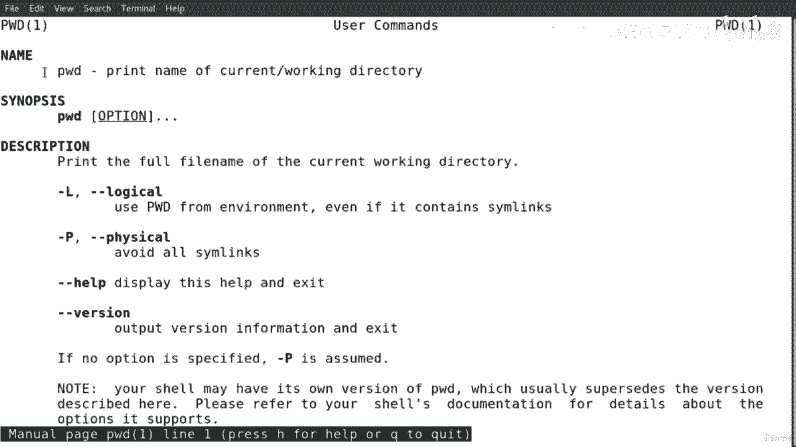
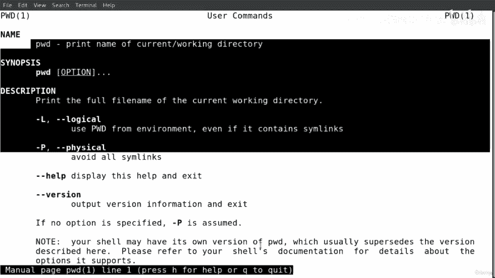
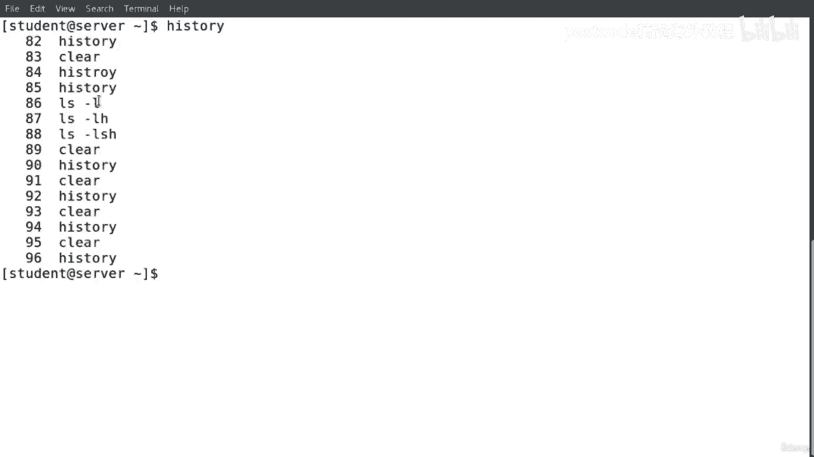
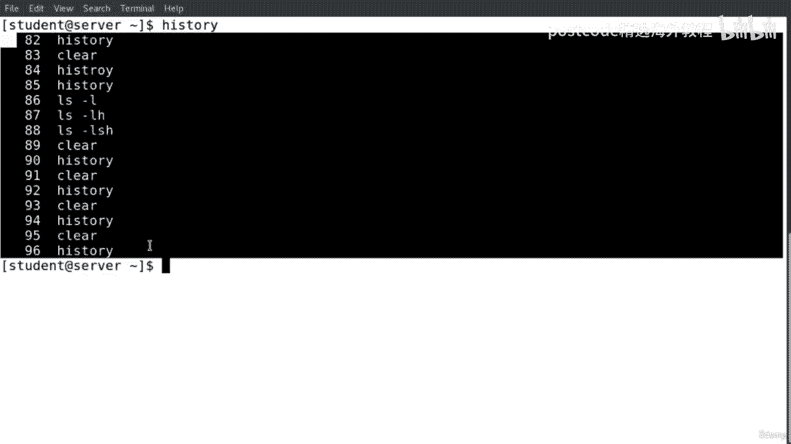
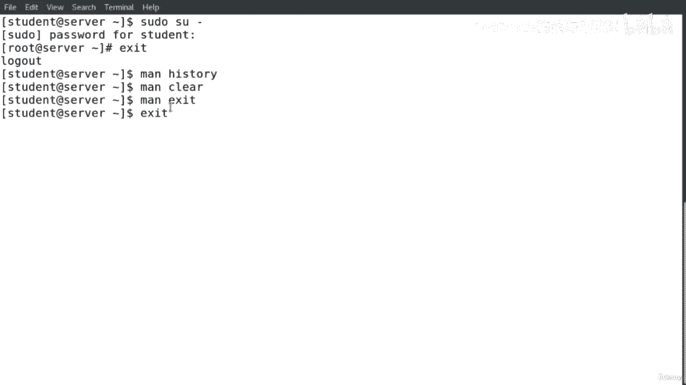
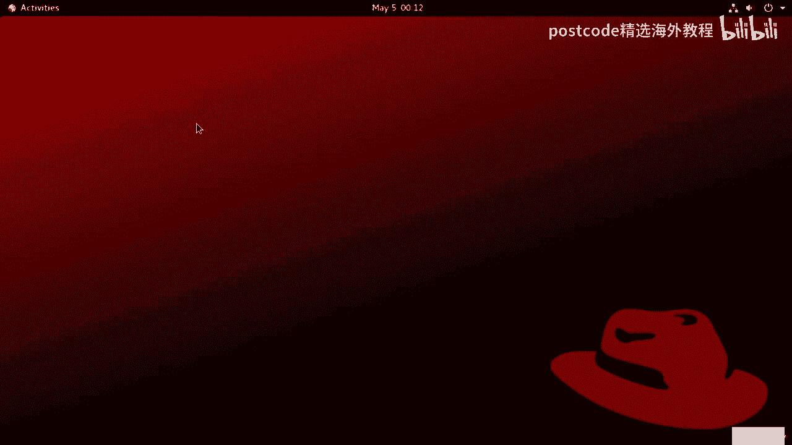
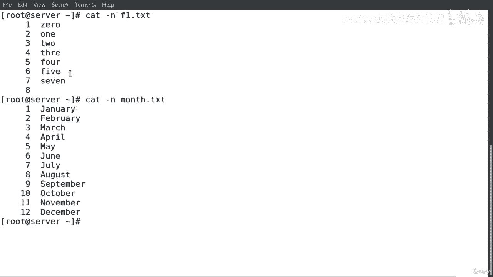
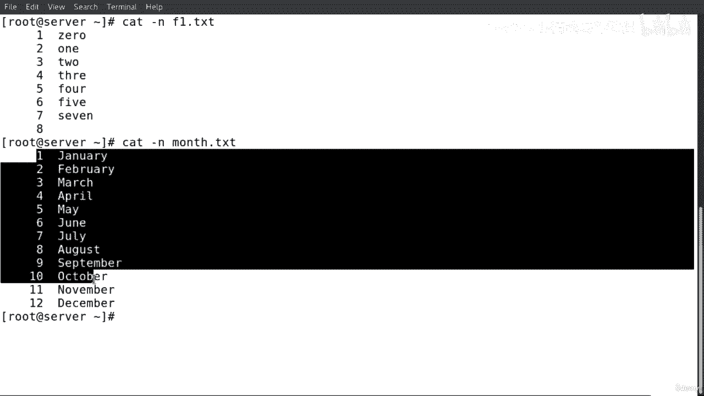
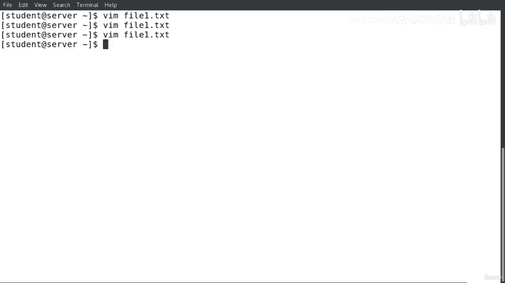

# Linux基础入门：04-04-026：文件系统、命令与编辑器总结 📚

在本节课中，我们将系统性地回顾Linux操作系统的核心概念，包括文件系统层次结构、常用命令以及文本编辑器的使用。我们将从最基础的目录树开始，逐步深入到文件操作、权限管理和高效编辑技巧，旨在为你构建一个清晰、实用的Linux知识框架。

## 文件系统层次结构 🌳

在任何操作系统中，都存在目录和文件系统。例如，在Windows中，所有目录和文件系统通常安装在C盘。在Mac操作系统中，它们安装在Macintosh硬盘上。然而，我们也可以在Windows或Mac操作系统中创建额外的目录和文件系统。

大多数Linux发行版具有相似的目录和文件系统。所有这些目录和文件系统都安装在根目录 `/` 之下。

我们可以将这种层次结构想象成一个家族树。在Linux中，根目录 `/` 被视为所有目录和文件系统的顶层或父级。然后，`/` 下的所有内容都被视为其子级。这些子级本身也可能是其下其他目录和文件系统的父级。

以下是根目录下一些关键目录的说明：

*   **`/`**：根目录或根文件系统，是所有目录和文件系统的顶层。
*   **`/root`**：用户 `root` 的家目录。
*   **`/dev`**：包含设备文件以及系统设备的详细信息，例如物理设备和其他设备信息。
*   **`/home`**：系统中每个用户的个人家目录。所有用户的个人目录和文件等都保存在 `/home` 下。例如，用户 `tom` 和 `mary` 的目录分别为 `/home/tom` 和 `/home/mary`。
*   **`/tmp`**：用于存储临时文件。每当系统重启时，`/tmp` 目录中的所有内容都会被删除。
*   **`/etc`**：包含许多目录、文件、脚本和程序及其配置文件，用于执行Linux发行版。例如，`passwd`、`group`、`security`、`fstab` 和 `chrony.conf` 等。
*   **`/boot`**：包含引导文件、引导配置信息以及Linux发行版内核的详细信息。例如，`/boot` 下的 `grub` 和 `grub2` 目录，以及配置文件 `grub.cfg`。
*   **`/var`**：包含一些数据和信息，这些内容经常会更新。`/var` 下的常见目录包括 `log`、`mail`、`spool` 等。其中最重要的目录是 `/var/log`，它存储和保存系统日志文件及文件系统活动，例如 `boot.log`、`messages`、`yum.log`、`mail.log` 等。
*   **`/proc`**：包含有关当前Linux内核的信息，例如运行时间、设备、内存信息、交换分区、分区、CPU和用户信息等。

此外，图中还有许多其他目录，我们可以在这些目录下保存目录和文件。

## 根目录与用户层次 👥

我们需要理解 `/`（根目录）和 `/root`（root用户的家目录）之间的区别。

*   `/` 是根目录或根文件系统，它与用户 `root` 的家目录无关。我们可以将 `/` 视为Linux中所有目录和文件系统的顶层或父级。
*   用户 `root` 的家目录 `/root` 位于顶层 `/` 之下。

因此，我们需要理解这两个术语之间的区别：`/`（根目录或根文件系统）和用户 `root` 的家目录 `/root`。

在Linux系统中，每个用户都有自己的家目录。例如，用户 `tom`、`mary` 和 `john`。我们可以在这些目录下保存个人文件和目录。同样，我们也可以在 `/root` 下保存文件和目录。

那么，什么是 `root` 用户？`root` 用户是系统中拥有完全权限的超级用户，例如修改、安装、删除、添加用户等。基本上，我们将 `root` 用户视为系统的管理员或管理者。它拥有对系统及系统中所有用户的完全控制权。

用户 `tom`、`mary` 和 `john` 在其家目录下拥有目录。例如，`tom` 的路径是 `/home/tom`，`mary` 和 `john` 的情况类似。用户可以访问自己的家目录。例如，`tom` 可以访问他自己的目录，`mary` 也可以访问她自己的目录，`john` 也是如此。然而，这些用户不能访问其他用户的目录，除非有人（例如 `mary`）授予 `tom` 访问她家目录的权限。

但对于 `root` 用户，它不需要获得任何访问权限。`root` 用户拥有对所有用户、所有目录、系统和Linux文件系统的完全控制权。因此，我们需要理解系统中的 `root` 用户和其他用户之间的区别。

## 绝对路径与相对路径 🧭

在Linux中，我们有两种不同类型的路径：绝对路径和相对路径。

*   **绝对路径**：我们必须写出完整路径，并且必须从根目录 `/` 开始，然后继续写入目录名称，并用 `/` 分隔它们。例如，命令 `cd /home/student/lfcs/test` 就是一个绝对路径。
*   **相对路径**：基本上被定义为短路径。当我们已经在某个目录或工作目录中时，我们不需要从根目录 `/` 开始路径。例如，如果我们已经在当前工作目录中，并且只想转到下一个目录，那么我们就不需要写出完整路径。这就是相对路径，它是短的。

大多数命令通常都有选项，我们在命令后运行这些选项。我们可以将这些选项写为短符号或长符号。例如，命令 `ls -l` 中的 `-l` 是短符号，我们也可以写成长符号 `--long`。参数位于选项之后。例如，`ls -l /home/student/lfcs` 中的 `/home/student/lfcs` 就是参数。

在命令后重写选项和参数的主要原因是调整这些命令的行为。因此，当我们向命令传递选项和参数时，我们想要调整这些命令的行为和执行方式，以获得不同的结果。

## 基础导航命令 🚶

上一节我们了解了路径的概念，本节中我们来看看如何在实际中切换目录。

**`pwd` 命令** 用于打印当前工作目录的名称。例如，输入 `pwd` 并回车，它会显示当前工作目录的路径。

**`cd` 命令** 用于更改当前工作目录。例如，输入 `cd directory1` 并回车，即可切换到 `directory1` 目录。使用 `pwd` 可以确认我们已移动到新的工作目录。

如果想返回当前用户的家目录，只需输入 `cd` 并回车。使用 `pwd` 确认我们已返回家目录。



要切换到之前工作过的目录，可以使用 `cd -` 命令。这个命令会打印出之前的工作目录，并切换到那里。



`cd .` 不会改变任何东西，它只是将工作目录更改为当前工作目录（即原地不动）。

`cd ..` 可以返回上一级目录。

`cd ~` 可以快速返回当前用户的家目录。

要一次移动多个目录层级，可以组合路径，例如 `cd directory1/directory2`。

要获取关于 `pwd` 和 `cd` 命令的更多信息，可以使用 `man pwd` 和 `man cd` 命令查看手册页。

## 列出目录内容 📋

`ls` 命令用于列出目录内容。如果我们想以长列表格式显示，可以运行选项 `-l`。例如，`ls -l`。

如果我们想传递一个参数给这个命令，同时以长列表格式显示某个目录的内容，可以运行 `ls -l directory1`。

如果我们想显示当前目录中的所有隐藏文件，可以运行 `ls -la`。选项 `-a` 表示不忽略以 `.` 开头的条目。我们也可以使用长符号 `--all`。

如果我们想打印每个文件的大小，同时以长列表格式显示，可以运行 `ls -l -s`。我们也可以将选项组合在一起，例如 `ls -lsa` 可以同时显示长列表格式、文件大小和所有隐藏文件。

要以人类可读的格式显示输出，可以使用选项 `-h`，例如 `ls -lh`。长符号是 `--human-readable`。

要反转排序顺序，可以使用选项 `-r`，例如 `ls -lr`。

要按文件扩展名的字母顺序排序，可以使用选项 `-X`，例如 `ls -lX`。

要递归列出子目录，可以使用选项 `-R`，例如 `ls -lR`。

要按修改时间排序，最新的排在最前面，可以使用选项 `-t`，例如 `ls -lt`。

要按行而不是按列列出条目，可以使用选项 `-1`（数字一），例如 `ls -1`。

要显示访问时间并按访问时间排序，可以使用选项 `-u` 和 `-t`，例如 `ls -u -t`。

要获取关于 `ls` 命令的更多信息，可以查看手册页 `man ls`。

## 系统信息命令 ℹ️

**`date` 命令** 显示当前日期。输入 `date` 并回车即可。要显示该命令的版本，可以使用选项 `--version`。

**`cal` 命令** 显示当前月份的日历。输入 `cal` 并回车即可。要显示特定月份的日历，可以指定月份和年份，例如 `cal 6 2020`。

**`uptime` 命令** 显示当前时间、当前登录到系统的用户数量以及系统负载平均值。输入 `uptime` 并回车即可。要以简洁格式显示运行时间，可以使用选项 `-p`。要以长符号显示，可以使用 `--pretty`。要显示系统启动时间，可以使用选项 `-s` 或 `--since`。要显示版本信息，可以使用选项 `-V`。

要获取关于 `uptime`、`cal` 和 `date` 命令的更多信息，可以查看它们的手册页。

**`lscpu` 命令** 显示有关处理器和CPU架构的信息。输入 `lscpu` 并回车即可。要获取更多信息，可以查看手册页 `man lscpu`。

**`free` 命令** 显示内存信息。输入 `free` 并回车即可。要以人类可读的格式显示输出，可以使用选项 `-h`（短符号）或 `--human`（长符号）。要显示版本信息，可以使用选项 `-V`。要显示低内存和高内存统计的详细信息，可以使用选项 `-l`。要显示总计列，可以使用选项 `-t`。可以组合选项，例如 `free -th` 可以同时显示总计和人类可读格式。

**`df` 命令** 显示磁盘使用情况和系统上的分区信息。输入 `df` 并回车即可。要以人类可读的格式显示输出，可以使用选项 `-h`。长符号是 `--human-readable`。要打印文件系统类型，可以使用选项 `-T` 或长符号 `--print-type`。可以组合选项，例如 `df -Th` 可以同时打印文件系统类型并以人类可读格式显示。





**`du` 命令** 显示文件空间使用量的估计值。输入 `du` 并回车即可。要以人类可读的格式显示输出，可以使用选项 `-h`。要显示总计，可以使用选项 `-c`。可以组合选项，例如 `du -ch`。

要获取关于 `du` 和 `df` 命令的更多信息，可以查看它们的手册页。

## 会话管理命令 💾



**`history` 命令** 显示命令历史记录。输入 `history` 并回车即可。`history` 命令保存了会话中所有使用过的命令列表，并允许我们在任何实例中重放或使用这些命令。



如果我们想告诉shell执行历史记录中特定行的命令，可以使用感叹号 `!` 后跟行号。例如，`!87`。

如果我们想删除特定命令，可以输入 `history -d` 后跟行号。例如，`history -d 96`。

如果我们想删除历史记录文件的全部内容，可以输入 `history -c`。

**`clear` 命令** 用于清除屏幕。

**`exit` 命令** 用于退出终端。例如，如果我们以 `root` 用户身份登录，输入 `exit` 将关闭终端。

要获取关于 `history`、`clear` 和 `exit` 命令的更多信息，可以查看它们的手册页。

## 命令信息查询 🔍

**`whatis` 命令** 显示一行手册页描述。例如，`whatis ls` 会显示关于 `ls` 命令的一行描述。

**`type` 命令** 显示每个Linux命令的类型。例如，`type whatis` 会显示 `whatis` 命令的类型。

**`man` 命令** 用于显示有关命令的更多信息和详细信息。它是联机参考手册的接口。例如，`man ls` 会显示关于 `ls` 命令的信息和选项。

## 用户信息查询 👀

**`w` 命令** 用于显示谁登录到系统以及他们在做什么。输入 `w` 并回车即可。

如果我们想使用短格式，并且不想打印登录时间和JCPU或PCPU时间，可以使用短符号 `-s` 或长符号 `--short`。

要显示关于 `w` 命令的版本信息，可以使用选项 `-V`。

要显示旧式输出，可以使用选项 `-o`。

要显示特定用户的信息，例如 `student`，可以运行 `w student`。

要打印没有标题的输出，可以使用选项 `-h` 或长符号 `--no-header`。

**`last` 命令** 显示最后登录用户的列表。输入 `last` 并回车即可。

要显示系统关机和运行级别更改，可以运行 `last -x`。

要在最后一列显示主机名，可以使用选项 `-a`。

要在输出中显示完整的用户名和域名，可以使用选项 `-w`。

要获取关于 `w` 和 `last` 命令的更多信息，可以查看它们的手册页。

## 系统与主机名信息 🖥️

**`uname` 命令** 用于获取系统信息。要打印所有系统信息，可以使用选项 `-a` 或长符号 `--all`。

要获取内核名称，可以使用 `uname -s`。
要获取内核发布版本，可以使用 `uname -r`。
要获取内核版本，可以使用 `uname -v`。
要打印处理器类型，可以使用 `uname -p` 或长符号 `--processor`。
要获取机器硬件名称，可以使用 `uname -m` 或长符号 `--machine`。

要获取关于 `uname` 命令的更多信息，可以查看手册页 `man uname`。

**`hostname` 命令** 用于显示或设置系统的主机名。输入 `hostname` 并回车即可。

要显示短主机名，可以使用选项 `-s` 或长符号 `--short`。
要打印版本信息并成功退出，可以使用选项 `-V`。
要显示主机名的网络地址，可以使用选项 `-i`。
要显示主机的所有网络地址，可以使用选项 `-I`。

要获取关于 `hostname` 命令的更多信息，可以查看手册页。

最后，如果我们想更改主机名，例如从 `redhat` 改为 `server`，可以运行 `hostname server`。

## 创建文件与目录 📁

**`touch` 命令** 用于创建空文件。例如，`touch f2.txt` 会创建一个名为 `f2.txt` 的空文本文件。

要创建多个文件，可以运行 `touch f3.txt f4.txt`。

要更改文件的修改时间，可以使用选项 `-m`。例如，`touch -m f1.txt`。

要避免创建新文件（即如果文件不存在则不创建），可以使用选项 `-c`。例如，`touch -c f5.txt` 不会创建 `f5.txt`。

**`mkdir` 命令** 用于创建目录。例如，`mkdir dir1` 会创建一个名为 `dir1` 的目录。

要同时创建多个目录，可以运行 `mkdir dir2 dir3 dir4`。

要创建父目录（即如果路径中的上级目录不存在则一并创建），可以使用选项 `-p`。例如，`mkdir -p linux/redhat/centos`。

有时执行 `mkdir` 命令时，成功操作没有反馈。要查看创建目录过程的详细信息，可以使用选项 `-v`。例如，`mkdir -v dir5` 会显示“已创建目录 dir5”的消息。

要获取关于 `mkdir` 命令的更多信息，可以查看手册页。

## 复制与移动文件/目录 📤

**`cp` 命令** 用于复制文件和目录。例如，要将文件 `f1.txt` 复制到 `directory1`，可以运行 `cp f1.txt directory1`。

要复制目录到另一个目录，必须使用递归选项 `-r`，以防目录中有子目录。例如，`cp -r directory2 directory1`。

要复制一个文件的内容到另一个文件，可以运行 `cp f1.txt f2.txt`。

要复制多个文件，例如 `f2.txt` 和 `f3.txt` 到 `directory3`，可以运行 `cp f2.txt f3.txt directory3`。

要复制多个目录，例如 `directory3` 和 `directory4` 到 `directory1`，可以运行 `cp -r directory3 directory4 directory1`。

要获取关于 `cp` 命令的更多信息，可以查看手册页。

**`mv` 命令** 用于移动或重命名文件和目录。例如，要将文件 `f1.txt` 移动到 `box` 目录，可以运行 `mv f1.txt box`。





要移动多个文件，例如 `f2.txt`、`f3.txt` 和 `f4.txt` 到 `directory3`，可以运行 `mv f2.txt f3.txt f4.txt directory3`。

要移动一个目录，例如 `directory1` 到 `box`，可以运行 `mv directory1 box`。

要移动多个目录，例如 `directory2`、`directory3` 和 `directory4` 到 `box`，可以运行 `mv directory2 directory3 directory4 box`。

要重命名一个文件，例如将 `text.txt` 改为 `file.txt`，可以运行 `mv text.txt file.txt`。

重命名目录的方式相同。例如，将 `box` 改为 `directory`，可以运行 `mv box directory`。

要获取关于 `mv` 命令的更多信息，可以查看手册页。

## 删除文件与目录 🗑️

**`rmdir` 命令** 用于删除空目录。例如，`rmdir directory4` 会删除 `directory4` 目录。

假设我们有一个目录 `d1`，其中包含子目录 `d2`。要删除 `d2`，可以运行 `rmdir d1/d2`。

要删除父目录（即目录及其子目录），可以使用选项 `-p`。例如，`rmdir -p linux/redhat` 会删除 `linux` 目录及其下的 `redhat` 子目录。

要获取关于 `rmdir` 命令的更多信息，可以查看手册页。

**`rm` 命令** 用于删除文件和目录。例如，要删除文本文件 `f1.txt`，可以运行 `rm f1.txt`。

要删除一个目录，例如 `directory3`，必须使用递归选项 `-r`，以防目录中有子目录。例如，`rm -r dir3`。

选项 `-i` 会在每次删除前提示用户确认。例如，`rm -i f4.txt`。

选项 `-f` 会强制删除文件。例如，`rm -rf d1` 会强制删除目录 `d1`。

要删除所有文本文件，可以使用通配符 `*`。例如，`rm *.txt` 会删除所有扩展名为 `.txt` 的文件。

要删除所有目录，可以运行 `rm -r dir*`。

要获取关于 `rm` 命令的更多信息，可以查看手册页。

## 归档与压缩文件 📦

**`tar` 命令** 是一个归档实用程序。例如，要为目录文件创建 `tar` 归档文件，可以运行：
```bash
tar -cvf f1.tar directory
```
其中，`-c` 表示创建新归档，`-v` 表示显示进度，`-f` 指定归档文件名。

要创建压缩的 gzip 归档文件，可以使用选项 `-z`。例如：
```bash
tar -czvf f2.tar.gz directory
```
也可以使用扩展名 `.tgz`。

要创建压缩的 bzip2 归档文件，可以使用选项 `-j`。例如：
```bash
tar -cjvf f3.tar.bz2 directory
```
也可以使用扩展名 `.bz2`。

要创建压缩的 xz 归档文件，可以使用选项 `-J`。例如：
```bash
tar -cJvf f4.tar.xz directory
```

要列出 `tar` 归档文件的内容，可以使用选项 `-t`。例如：
```bash
tar -tvf f1.tar
```

要提取或解压 `tar` 文件，可以使用选项 `-x`。例如：
```bash
tar -xvf f1.tar
```

要提取到不同的目录，可以使用选项 `-C`。例如：
```bash
tar -xvf f2.tar.gz -C /path/to/directory
```

要获取关于 `tar` 命令的更多信息，可以查看手册页。

## 查看与创建文件内容 📄

**`cat` 命令** 是 concatenate 的缩写，它读取文件内容并打印到标准输出。例如，`cat /etc/passwd` 会显示 `/etc/passwd` 文件的内容。

我们也可以查看多个文件的内容。例如，`cat f1.txt f2.txt`。

要查看文件的行号，可以使用选项 `-n`。例如，`cat -n f1.txt`。

**`echo` 命令** 在标准输出或文件中显示一行文本或字符串。例如，`echo "Hello World!"` 会在标准输出显示 "Hello World!"。

要将输出重定向到文件而不是标准输出，可以使用重定向符号 `>`。例如，`echo "Hello World!" > file.txt` 会将文本写入 `file.txt` 文件。

要删除文本中的所有空格，可以使用选项 `-e` 和 `\b`。例如，`echo -e "H\be\bl\bl\bo"`。

要打印特定类型的文件，可以使用通配符。例如，`echo *.txt` 会打印所有 `.txt` 文件。

要获取关于 `cat` 和 `echo` 命令的更多信息，可以查看它们的手册页。

## 文件内容处理：head, tail, sort 📊

在许多情况下，我们可能只对显示文件的前几行感兴趣，这时可以使用 `head` 命令。例如，`head /etc/passwd` 会显示 `/etc/passwd` 文件的前10行（默认）。

`head` 命令可以接受多个文件作为参数。例如，`head /etc/passwd /etc/group`。

如果我们想查看文件的前N行，可以使用选项 `-n`。例如，`head -n 3 /etc/passwd` 显示前3行。

相反，如果我们想显示文件的最后几行，可以使用 `tail` 命令。例如，`tail /etc/passwd` 显示最后10行。

同样，`tail` 也可以接受多个文件参数和 `-n` 选项。例如，`tail -n 7 /etc/group`。

**`sort` 命令** 用于对文件进行排序。例如，有一个文件 `fruits.txt` 包含水果名称，运行 `sort fruits.txt` 会按字母顺序排序。

如果要对数字进行排序，必须使用选项 `-n`。例如，`sort -n numbers.txt`。

## 管道与过滤命令 🔧

**管道命令 `|`** 帮助我们将两个或多个命令组合使用，以获得一个输出。例如：
```bash
cat /etc/passwd | less
cat /etc/shadow | more
ls /bin | wc -l
cat months.txt | wc -c
cat f2.txt | wc -w
```

另一个例子，显示 `f2.txt` 的前三行，然后通过管道传递给 `tail` 显示最后一行：
```bash
head -n 3 f2.txt | tail -n 1
```

**`grep` 命令** 打印匹配模式的行。例如，`grep "nologin" /etc/passwd`。

结合管道使用：
```bash
grep "nologin" /etc/passwd | wc -l
cat numbers.txt | sort
cat months.txt | grep "a"
head -n 5 months.txt | sort
tail -n 3 months.txt | sort -r
```

## 文件比较命令 ⚖️

**`diff` 命令** 逐行比较文件。例如，`diff f1.txt f2.txt`。

要并排显示输出，可以使用选项 `-y`。例如，`diff -y f1.txt f2.txt`。

输出中，`d` 表示删除，`a` 表示添加，`c` 表示更改。

如果只想报告文件是否不同，可以使用选项 `-q`。例如，`diff -q f1.txt f2.txt`。

要以上下文格式生成输出，可以使用选项 `-c`。例如，`diff -c f1.txt f2.txt`。

要获取关于 `diff` 命令的更多信息，可以查看手册页。

## 用户切换与权限提升 👑

**`sudo` 命令** 允许我们以 root 权限运行单个命令。但是，用户必须在 `sudoers` 文件中或属于 `sudo` 组。例如，普通用户无法查看 `/etc/shadow` 文件，但使用 `sudo cat /etc/shadow` 并输入密码后就可以。

**`su` 命令** 用于切换到另一个用户。`su` 是 switch user 的缩写。如果不带参数调用，可以切换到 `root` 用户。

例如，`su - tom` 会为用户 `tom` 启动一个登录 shell，环境类似于真实登录。而 `su tom`（没有 `-`）则不会切换完整环境，可能没有权限访问用户 `tom` 的文件。

从普通用户切换到 `root` 用户，可以运行 `sudo su -` 或 `su -` 并输入 `root` 密码。

要获取关于 `sudo` 和 `su` 命令的更多信息，可以查看它们的手册页。

## 查找文件与目录 🔎

**`find` 命令** 搜索文件列表、文件和目录。我们还可以将条件与 `find` 命令一起使用，例如名称、文件类型、大小、用户、组、权限等。

以下是一些使用示例：

查找当前目录下的所有文件：
```bash
find . -type f
```

查找 `/home` 下的所有目录：
```bash
find /home -type d
```

查找当前目录下所有 `.txt` 文件：
```bash
find . -name "*.txt"
```

忽略大小写进行查找：
```bash
find . -iname "dir"
```

查找并删除文件：
```bash
find . -name "dir" -delete
```

查找大小大于20MB的文件：
```bash
find / -size +20M
```

查找具有特定权限的文件：
```bash
find / -perm 0666
```

查找属于特定用户或组的文件：
```bash
find / -user student
find / -group student
```

在多个文件中搜索关键词：
```bash
find . -type f -name "*.txt" -exec grep "April" {} \;
```

复制所有 `.txt` 文件到另一个目录：
```bash
find . -type f -iname "*.txt" -exec cp {} /path/to/directory \;
```

删除所有 `.txt` 文件：
```bash
find . -type f -iname "*.txt" -exec rm -rf {} \;
```

要获取关于 `find` 命令的更多信息，可以查看手册页。

## 硬链接与软链接 🔗

**硬链接** 可以定义为一个文件的精确副本。同一个文件的不同名称。硬链接具有相同的 inode 编号和实际文件内容。如果删除原始文件，链接不会受到影响，它仍然显示文件的内容。如果删除任何链接，不会影响其他链接，只会减少链接计数。我们不能为目录创建硬链接。

创建硬链接：
```bash
ln file.txt f1
```
硬链接和原始文件具有相同的 inode 编号、权限和大小。

**软链接（符号链接）** 是一个指向另一个文件的文件。它就像 Windows 中的快捷方式。软链接和原始文件有不同的 inode 编号。软链接包含原始文件的路径，但不包含内容。如果删除软链接，不会影响原始文件。但是，如果删除原始文件，软链接将变得无用，并指向不存在的文件。我们可以为文件和目录创建软链接。

创建软链接：
```bash
ln -s file.txt f1
```
软链接的 inode 编号和权限与原始文件不同，并且在文件权限前有一个 `l` 标识。

## 图形与命令行文本编辑器 ✏️

**`gedit` 编辑器** 是一个强大的图形用户界面文本编辑器，是 GNOME 桌面环境的默认文本编辑器。它有一些功能，例如编程语言的语法高亮、搜索替换、字体和颜色。

要打开文件，只需运行 `gedit filename.txt`。它是一个图形用户界面编辑器，易于使用。

**`nano` 编辑器** 是一个非常友好和流行的 Linux 命令行文本编辑器，使用简单。

要打开文件，运行 `nano filename.txt`。要退出，按 `Ctrl+X`。要保存，按 `Ctrl+O`。要获取帮助，按 `Ctrl+G`。

一些常用快捷键：
*   `Ctrl+E`：移动到行尾
*   `Ctrl+A`：移动到行首
*   `Ctrl+Y`：向下翻页
*   `Ctrl+V`：向上翻页
*   `Ctrl+W`：搜索文本
*   `Ctrl+D`：删除光标处的字符
*   `Ctrl+K`：剪切当前行
*   `Ctrl+U`：粘贴
*   `Ctrl+R`：从另一个文件读取
*   `Ctrl+\`：替换单词
*   `Ctrl+_`：跳转到指定行

## VI/VIM 文本编辑器 🖋️

**VI 编辑器** 是 Linux 发行版中最流行的文本编辑器。VI 被认为是大多数 Linux 系统管理员的首选。VI 有一个高级版本叫做 VIM（VI Improved）。VIM 用户友好，并且在大多数 Linux 发行版中都可用。

VI 或 VIM 有两种不同的工作模式：命令模式和插入模式。当我们打开 VI 编辑器时，它处于命令模式。在命令模式下，我们只能移动光标、在页面间滚动、删除字符、单词、行、复制、剪切和粘贴、搜索和替换以及保存更改。插入模式是我们只能向文件中插入文本的模式。

要在模式之间切换，例如从命令模式切换到插入模式，按小写 `i`。要从插入模式切换回命令模式，按 `Esc` 键。

一些常用命令：
*   `i`：在光标前插入
*   `a`：在光标后插入
*   `A`：在行尾插入
*   `o`：在当前行下方插入新行
*   `$`：移动到行尾
*   `0`：移动到行首
*   `G`：跳转到文件末尾
*   `gg`：跳转到文件开头
*   `x`：删除光标处的字符
*   `dw`：删除当前单词
*   `3dw`：从光标处开始删除3个单词
*   `dd`：删除整行
*   `3dd`：从光标处开始删除3行
*   `yw`：复制光标处的单词
*   `3yw`：从光标处开始复制3个单词
*   `3yy`：从光标处开始复制3行
*   `u`：撤销上一次更改
*   `p`：在光标后粘贴
*   `:set number`：显示行号
*   `:7`：跳转到第7行
*   `/word`：搜索单词
*   `:%s/old/new/g`：全局替换所有匹配的单词
*   `:w`：保存文件
*   `:q`：退出（如果未保存会警告）
*   `:q!`：不保存强制退出
*   `:wq` 或 `:x`：保存并退出

---



本节课中我们一起学习了Linux操作系统的核心组成部分。我们从文件系统的层次结构开始，理解了根目录 `/` 与各关键目录的作用。然后，我们掌握了大量的基本命令，包括导航 (`pwd`, `cd`)、查看内容 (`ls`, `cat`, `head`, `tail`)、文件操作 (`touch`, `mkdir`, `cp`, `mv`, `rm`)、归档压缩 (`tar`)、查找比较 (`find`, `diff`, `grep`) 以及获取系统信息 (`date`, `uptime`, `df`, `free`等)。我们还深入探讨了路径概念、管道 `|` 的威力、用户切换 (`su`, `sudo`)、以及链接（硬链接与软链接）的创建与区别。最后，我们介绍了三种重要的文本编辑器：图形化的 `gedit`、简单易用的 `nano` 和功能强大的 `vi/vim`，并了解了它们的基本操作模式与常用命令。这些知识构成了在Linux系统中进行日常文件管理、系统监控和文本编辑的坚实基础。