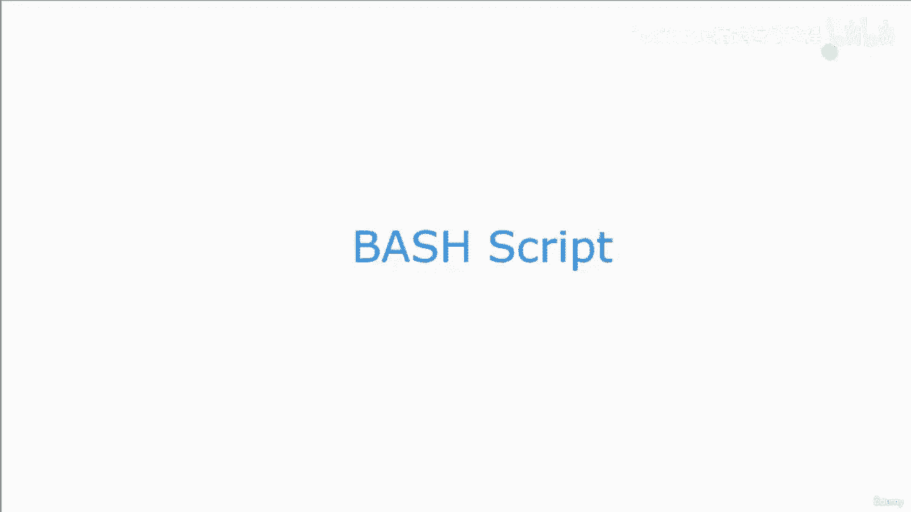
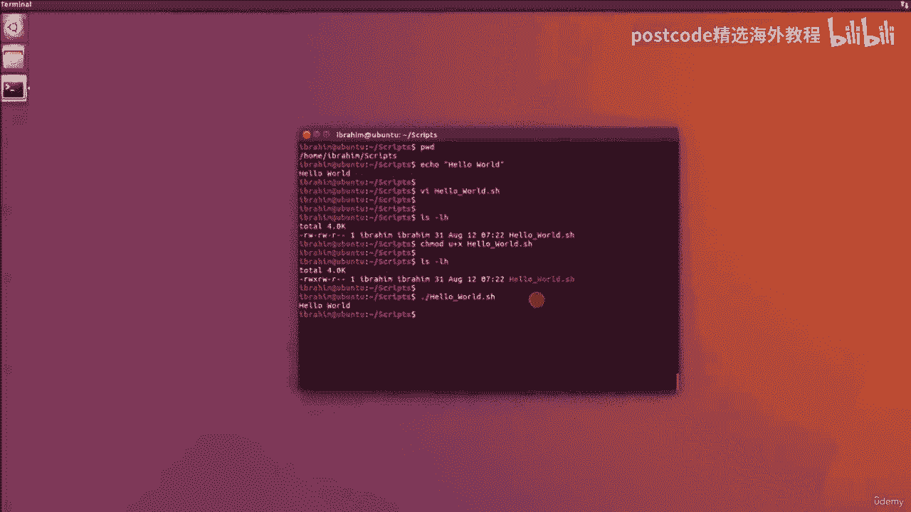

# 红帽企业Linux RHEL 9精通课程 — RHCSA与RHCE 2023认证全指南 - P51：05-05-001 Bash shell - 精选海外教程postcode - BV1j64y1j7Zg

Abbas 脚本是一个可执行文件，我们可以在命令行界面中运行它，它是排序的，就像使用 bash 语言编写的 Linux 命令行界面程序一样。我想说，如果您想要编写脚本。

那么 bash 语言并不是最好的语言，非常复杂的任务。在这种情况下，我可能会推荐 Perl 或 Python 之类的东西，但 Bash 真的很方便，在很多情况下。因此，在接下来的课程中。

我们将逐步解释如何编写 bash 脚本并，它可以用来做什么。

所以我继续创建了一个名为 Scripts Under Slash Home Slash Ibrahim 的目录，我们将，将该目录用于所有即将到来的课程。因此。

我们要采用的第一个脚本是 Hello World 脚本。这是一个将打印出 Hello World 的脚本。如果我想做到这一点，只需使用该脚本的命令行，我只需编写 Echo。你好世界。它进来了。

这样就可以了。但是如果我想要一个脚本来为我做这件事怎么办？我将使用文本编辑器 VI，并为我们要创建的文件或脚本命名。你好下划线世界点h。现在这里的点 sh 将会真正有用。

因为它会告诉 VI 这是一个 bash，脚本。因此，它将在该文件中使用一些颜色编码，以使我们更容易阅读，它。所以让我们按回车键。我将在这里进入插入模式。现在。

我们需要在任何糟糕的脚本中始终编写的第一行称为 Shebang 行，即，井号和感叹号。该行上的斜线 pin 斜线 bash 是定义可执行文件类型的行。是 bash 还是 Python？是珀尔吗？

所以第一行非常重要。之后，我们将简单地编写命令 echo，然后编写一个 hello world。现在您可以看到我所指的颜色编码。它让眼睛变得更好一点。它将按退出键，我将编写并退出。现在。

如果我点击 lz，l 我就有了 bash 脚本，但它不可执行。如果您还记得权限课程中的内容，我们需要将此文件设为可执行文件，以便您可以使用，AC mod。

我将授予用户执行该文件的权限并按 Enter 键。再做一次LZ dash lh，你会看到现在我有执行它的权限。现在，每当您需要运行脚本时，您都可以使用点正斜杠，然后使用该脚本的名称，脚本。顺便说一句。

如果您还记得的话，那个点只是表示父目录路径的另一种方式。所以这和斜线 home、斜线 Ibrahim 斜线脚本一样有效。它们实际上是同一件事。好的。当然，这要短得多并且更容易写。

所以我们只需要写 sh 的斜线 hello world，如果我按 Enter 键，你就会看到。

