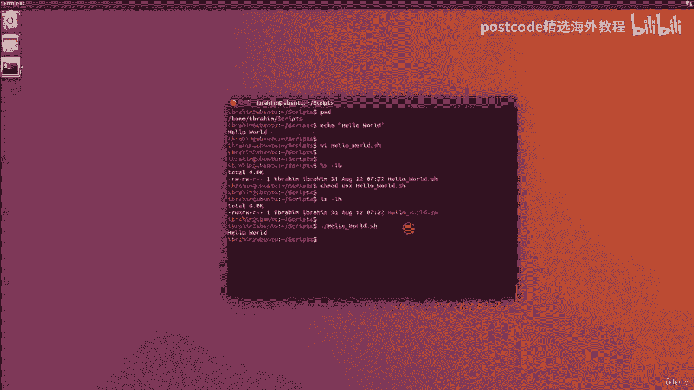

# Bash脚本编程入门：05-05-001：Bash Shell基础

在本节课中，我们将要学习Bash脚本编程的基础知识。Bash脚本是一种在命令行界面中运行的可执行文件，它使用Bash语言编写，能够自动化执行一系列Linux命令。虽然对于非常复杂的任务，Python或Perl可能是更好的选择，但Bash在处理系统管理和文件操作等任务时非常方便和高效。

## 创建第一个Bash脚本：Hello World

上一节我们介绍了Bash脚本的基本概念，本节中我们来看看如何创建并运行一个简单的脚本。我们将从一个经典的“Hello World”程序开始。

首先，我们需要一个存放脚本的目录。这里我们创建了一个名为 `Scripts` 的目录。

```bash
mkdir ~/Scripts
```


接下来，我们进入这个目录并创建脚本文件。

```bash
cd ~/Scripts
```

现在，我们使用文本编辑器（如VI）来创建脚本文件。文件扩展名 `.sh` 有助于编辑器识别文件类型并提供语法高亮。

```bash
vi hello_world.sh
```

在VI编辑器中，按 `i` 键进入插入模式，然后输入以下内容。

任何Bash脚本的第一行必须是 **Shebang** 行，它定义了用于执行脚本的解释器。对于Bash脚本，这一行是 `#!/bin/bash`。

```bash
#!/bin/bash
echo "Hello World"
```

输入完成后，按 `Esc` 键退出插入模式，然后输入 `:wq` 保存文件并退出VI编辑器。

## 赋予脚本执行权限

创建脚本文件后，它默认没有执行权限。我们需要使用 `chmod` 命令修改文件权限。

以下是修改文件权限的命令：

```bash
chmod u+x hello_world.sh
```

这个命令为文件所有者（用户）添加了执行（`x`）权限。现在，我们可以运行这个脚本了。

## 运行Bash脚本

要运行脚本，我们需要在命令行中指定脚本的路径。一个常用的方法是使用 `./` 前缀，它代表当前目录。

运行脚本的命令如下：

```bash
./hello_world.sh
```

执行后，终端将输出 `Hello World`。这表明我们的第一个Bash脚本成功运行了。

## 脚本运行方式解析

你可能注意到我们使用了 `./hello_world.sh` 来运行脚本。这里的点（`.`）是当前目录的简写。因此，`./hello_world.sh` 等价于 `/home/Ibrahim/Scripts/hello_world.sh`，但前者更简短便捷。



本节课中我们一起学习了Bash脚本的基础：从编写Shebang行、创建简单的“Hello World”脚本，到使用 `chmod` 命令赋予执行权限，最后成功运行脚本。这是你自动化命令行任务的第一步。在接下来的课程中，我们将逐步深入，探索Bash脚本更强大的功能。