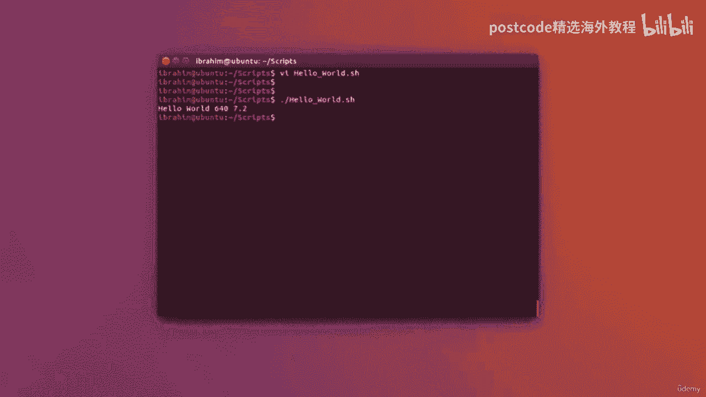

# 红帽企业Linux RHEL 9精通课程 — RHCSA与RHCE 2023认证全指南 - P52：05-05-002 Variables - 精选海外教程postcode - BV1j64y1j7Zg

现在让我们看一下相同的 hello world 示例，但这次使用变量。所以我要在这个文件中对 hello world 做一个 VI，我要做的就是在这里写，a等于然后开双码。我要向世界问好。

我不会立即回显 hello world，而是回显变量的值，A。因此，为了做到这一点，您可以编写 echo dot sign a。现在美元符号用于让 shell 脚本理解您不想回显该字母，A。

但 A 现在实际上指的是一个变量，这将完全相同。那么让我们定义另一个变量。让我们定义名为 B 的变量，并为该变量指定一个数字。例如，让我们看看 640，我没有使用双 Coatsworth 来让它理解。

这实际上是一个数字。我可以输入带小数点的数字，例如 7。2。所有这些都是变量。所以我可以在这里锚定 A，然后我会在它旁边，然后在它旁边让回显，看。这是正确的。

