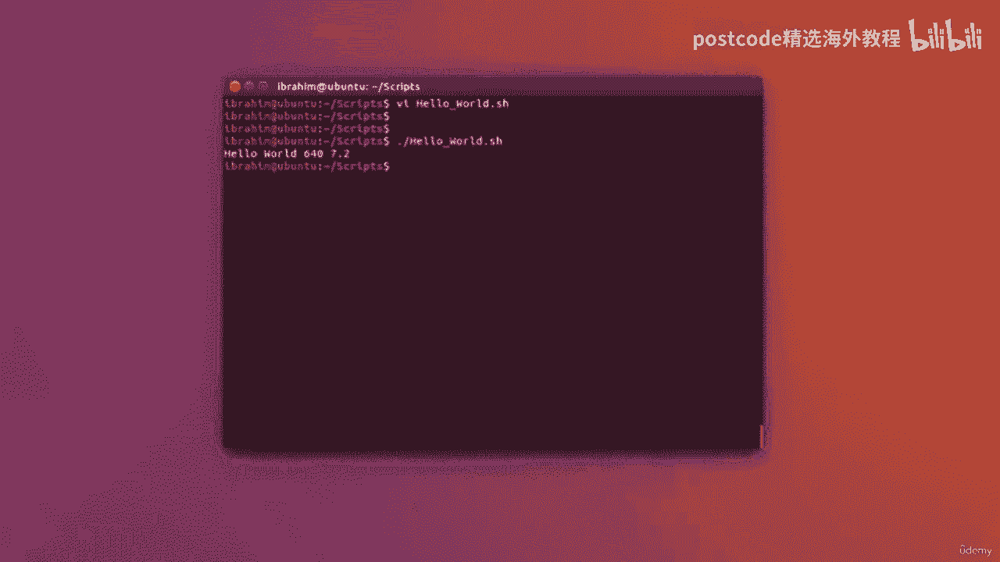

# 红帽企业Linux RHEL 9精通课程：05-05-002：变量

## 概述
在本节课中，我们将学习如何在Shell脚本中使用变量。变量是存储数据的容器，它能让我们的脚本更加灵活和可重用。我们将通过一个简单的“Hello World”示例来演示如何定义和使用变量。

## 从直接输出到使用变量
上一节我们介绍了基本的脚本编写和输出。本节中，我们来看看如何通过变量来改进我们的脚本。

现在让我们看一下相同的“Hello World”示例，但这次使用变量。我将在这个文件中使用VI编辑器进行编辑。我要做的就是在这里写：`A`等于，然后打开双引号。我要输入“Hello World”。

我不会立即回显“Hello World”，而是回显变量`A`的值。因此，为了做到这一点，您可以编写 `echo $A`。这里的美元符号`$`用于让Shell脚本理解您不想回显字母“A”本身，而是想引用名为`A`的变量。这将产生完全相同的输出效果。

## 定义不同类型的变量
接下来，让我们定义另一个变量。我们将定义一个名为`B`的变量，并为该变量指定一个数字。例如，让我们看看`640`。注意，我没有使用双引号，这是为了让Shell理解这实际上是一个数字。

我可以输入带小数点的数字，例如`7.2`。所有这些都是变量。所以我可以在这里引用`A`，然后我会在它旁边，再让脚本回显变量`B`的值。让我们看看这是否正确。

以下是定义和使用变量的关键步骤：
1.  **定义变量**：使用 `变量名=值` 的格式。对于字符串值，通常用双引号括起来；对于数字，可以不用引号。
    *   示例：`A="Hello World"`
    *   示例：`B=640`
    *   示例：`C=7.2`
2.  **引用变量**：在变量名前加上美元符号`$`来获取其存储的值。
    *   示例：`echo $A` 会输出 “Hello World”。
    *   示例：`echo $B` 会输出 “640”。

## 总结
本节课中我们一起学习了Shell脚本中变量的基本用法。我们了解到变量是一个存储数据的命名容器，通过`变量名=值`的方式定义，并通过`$变量名`的方式引用。使用变量可以使脚本更易于维护和修改，是编写复杂脚本的基础。