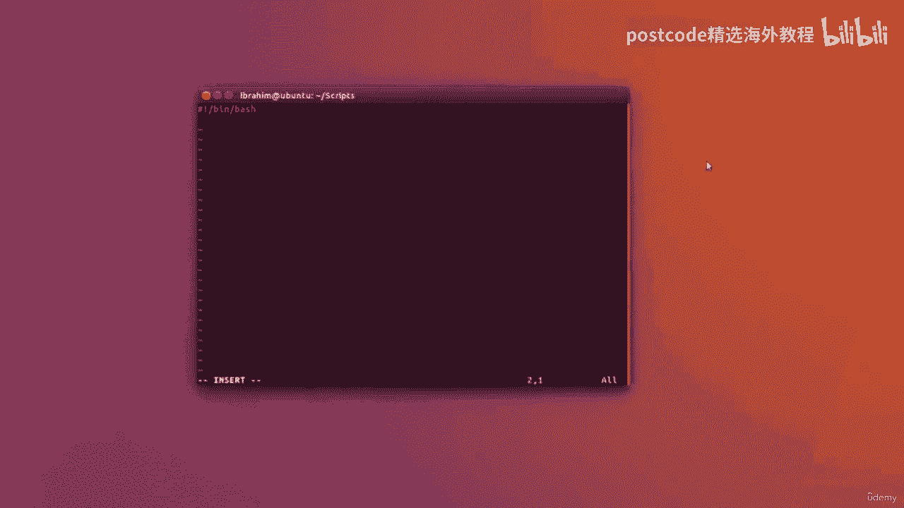
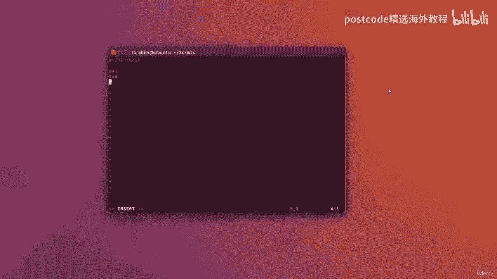
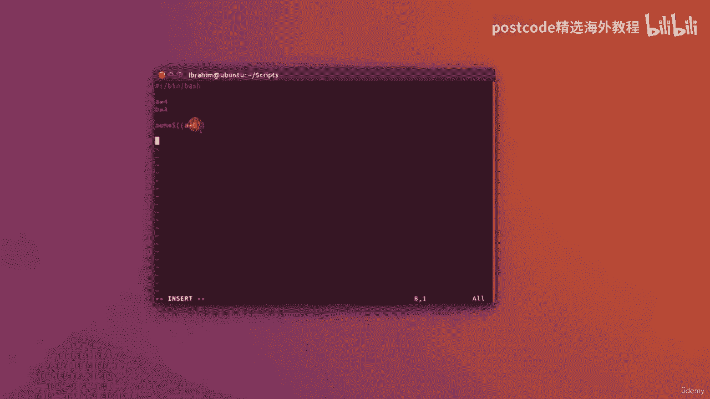

# 红帽企业Linux RHEL 9精通课程 — RHCSA与RHCE 2023认证全指南 - P53：05-05-003 Arithmatic - 精选海外教程postcode - BV1j64y1j7Zg

在本课中，我们将了解如何处理 bash 脚本中的数字。

因此，我将打开一个新文件并将其命名为“numbers dot SH”。

对于这个例子，我将输入我的哈希、感叹号、斜杠 bin 斜杠 bash，然后我将。

放入两个变量 A 等于 4，B 则赋予其值为 3。

现在，举例来说，我想要一个名为 sum 的变量。

值 A 加 B。

现在，我该如何定义呢？我需要这样写。

您必须将数学运算封装在带有两个左括号和右括号的美元符号中。

正如您在这里注意到的，我们不会在括号内的变量之前放置美元符号，因为。

它已经在外面了。所以这里不需要在变量 A 或 B 之前放置美元符号，就像我们对 Echo 所做的那样。

因为其实这里有这个就足够了。

让我们尝试另一个操作。举例来说，我也想得到差异，而这正是。

与左括号和右括号相同。

然后在其中我将写 A 减 B 或任何我想做的数学运算。

现在要回显结果，我只需写 Echo，我们可以说，例如，总和是。

可以在这里输入美元符号总和。

不同之处在于在这里放一个美元符号。

让我们写下来然后退出。我将在该文件上更改 mod plus X，然后让我们运行一下。

