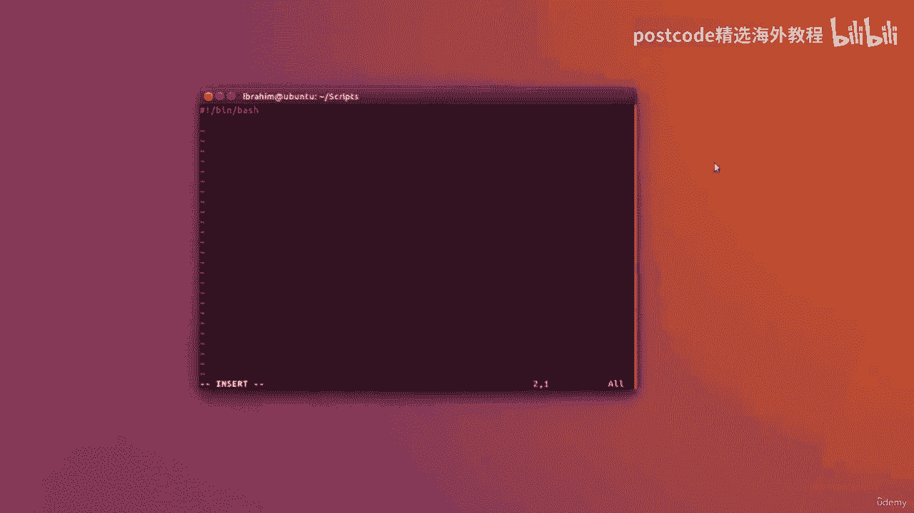
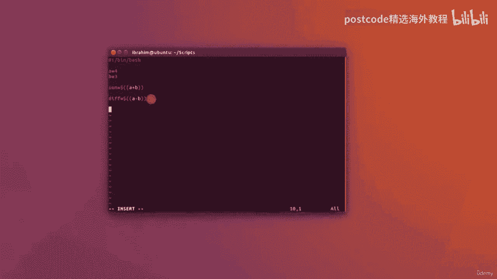
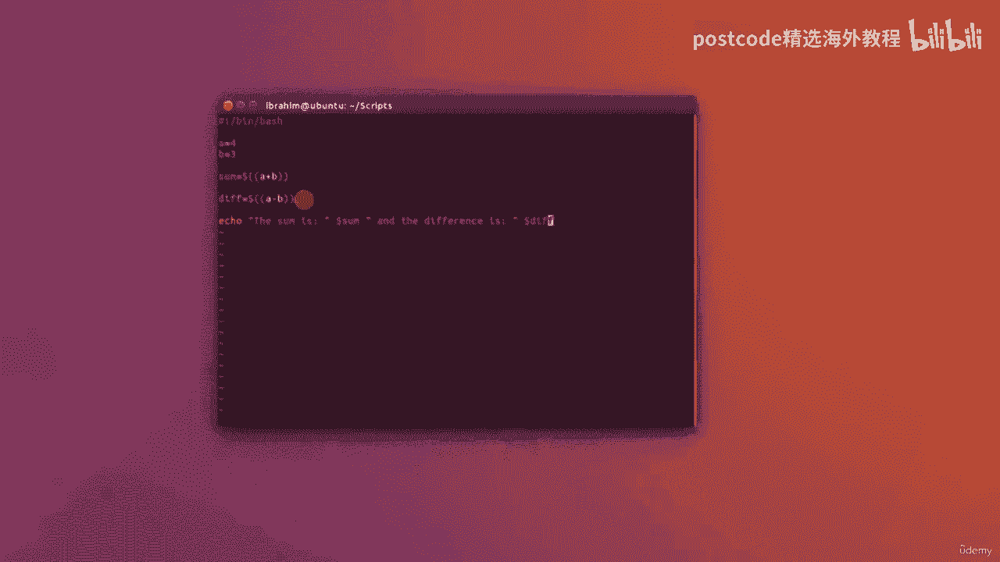
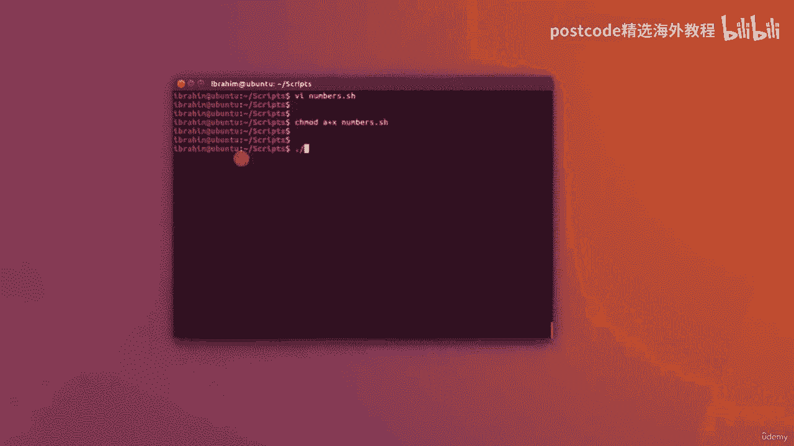
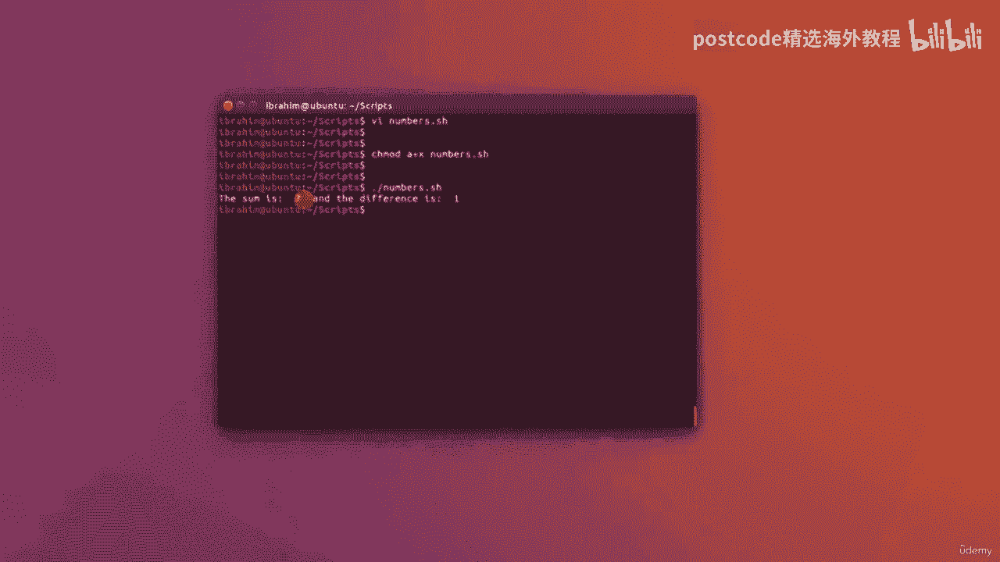

# RHEL 9 精通课程：05-05-003：Bash 脚本中的算术运算 🔢


在本节课中，我们将学习如何在 Bash 脚本中处理数字和进行算术运算。这是编写自动化脚本和进行系统管理时的一项基础且重要的技能。


上一节我们介绍了变量和基本脚本结构，本节中我们来看看如何让脚本进行数学计算。




## 创建脚本文件


首先，我们需要创建一个新的脚本文件。以下是创建和初始化脚本的步骤：


1.  打开终端。
2.  使用文本编辑器（如 `vim` 或 `nano`）创建一个名为 `numbers.sh` 的新文件。
3.  在文件的第一行，写入 Bash 脚本的标准起始行，称为“shebang”：
    ```bash
    #!/bin/bash
    ```


## 定义变量与算术运算


接下来，我们将在脚本中定义两个变量，并对它们进行算术运算。


1.  定义两个变量 `A` 和 `B`，并为其赋值：
    ```bash
    A=4
    B=3
    ```
2.  现在，我们想计算这两个变量的和。在 Bash 中，进行算术运算需要使用特定的语法。核心概念是使用 `$(( ... ))` 结构。例如，计算变量 `A` 和 `B` 的和：
    ```bash
    sum=$(( A + B ))
    ```
    **注意**：在 `$(( ... ))` 内部，引用变量时**不需要**在变量名前加美元符号 `$`。
3.  同样地，我们可以计算两个变量的差：
    ```bash
    diff=$(( A - B ))
    ```


## 输出运算结果


定义好存放计算结果的变量后，我们可以使用 `echo` 命令将结果输出到屏幕上。


1.  输出求和的结果：
    ```bash
    echo “总和是 $sum”
    ```
2.  输出求差的结果：
    ```bash
    echo “差值是 $diff”
    ```
    **注意**：在 `echo` 语句中引用变量时，**需要**在变量名前加美元符号 `$`。




## 运行脚本


脚本编写完成后，需要赋予其执行权限并运行它。




以下是运行脚本的步骤：


1.  使用 `chmod` 命令为脚本文件添加可执行权限：
    ```bash
    chmod +x numbers.sh
    ```
2.  运行脚本：
    ```bash
    ./numbers.sh
    ```
    运行后，终端将显示类似以下的结果：
    ```
    总和是 7
    差值是 1
    ```





本节课中我们一起学习了在 Bash 脚本中进行算术运算的方法。关键点在于掌握 `$(( 表达式 ))` 的语法结构，并注意在表达式内部和外部引用变量的区别。这是构建更复杂脚本逻辑的基础。