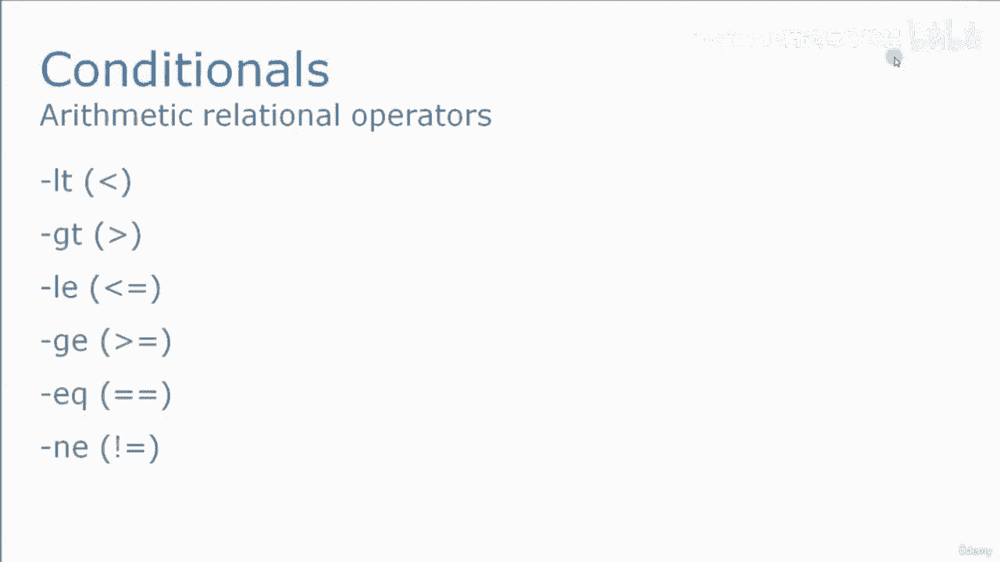
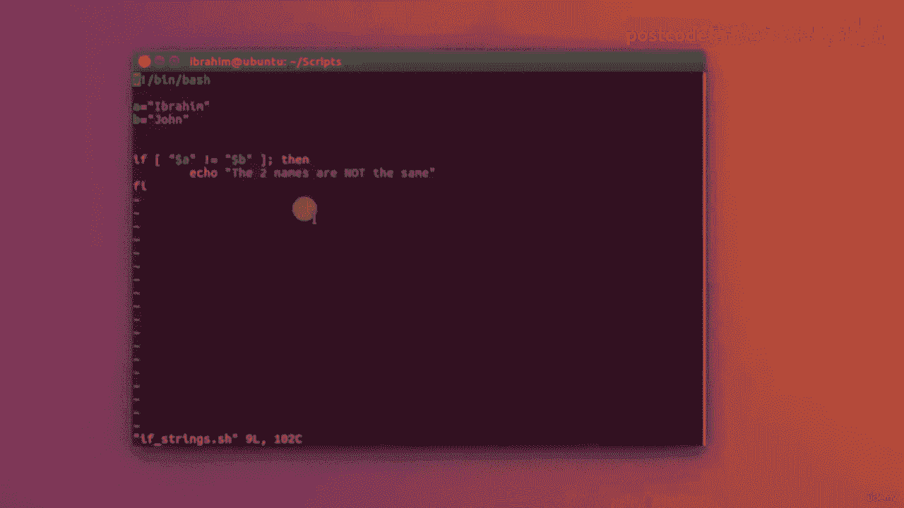

# 红帽企业Linux RHEL 9精通课程 — RHCSA与RHCE 2023认证全指南 - P54：05-05-004 Conditions - 精选海外教程postcode - BV1j64y1j7Zg

现在让我们看一下可以与条件一起使用的算术关系运算符。其中主要是小于大于。少于。或者相等。比。更棒。或者相等。相等或不相等。这就是我们用糟糕的脚本编写它们的方式。

它将是 dash t、dash GTI、Dash L、e 等。因此，让我们转到终端并看一个示例。

我们将此 if 点称为 H。要把 bin bash 放进去，现在我要写 A 等于 B 等于三。假设现在我想编写一个 if 条件来检查 A 是否大于 B。如果是，它将打印出 A 比 B 大。

那么该怎么写呢？我们首先写 F，然后打开和关闭方括号。现在，在这些方括号内，我们将编写以下内容。我们将编写变量 A，以便分配大于美元符号 b 的破折号。现在，在这里注意这些空间非常重要。

因为这些空间对于制作，命令工作。如果不输入这些空格，该命令将给出语法错误。所以一定要小心。在那部分之后，我们加了一个分号。就在那时。现在我要写什么是行动？如果这个条件为真。所以也许我在这里想说的是。

如果a的值大于B的值，那么我想要你，执行以下操作。所以我要写 Echo A 比 B 大。我可以在这里再写一行，它也会被执行，对吗？例如，这是另一行，也将在 then 后的每一行中打印出来。

如果满足此条件，则执行，直到我们发现 if 条件结束为止，如果向后写。所以，作为一种组织代码并使其更具可读性的方法，我通常，在 if 条件之间用制表符放置任意行。这样。

您可以更轻松地阅读并立即识别哪些行，都在 if 条件之内。因此，让我们立即退出并保存该脚本，然后尝试运行并执行该脚本并查看结果。正如您所看到的打印结果，A 比 B 大。这是另一行也将按预期打印出来。

例如，如果我继续将 A 从 4 更改为 2。所以它现在比 B 小，我们运行这个脚本，你会看到我们没有任何输出。这是为什么？因为条件没有满足。所以我实际上可以在结束 F 条件之前在这里做一些事情。

我可以在这里说别的。那么如果不满足这个条件，该怎么办呢？例如，我要写 Echo。条件没有满足。A不大于B。如果满足这个条件，那么这两行将被执行。否则该行将被执行。让我们写完然后退出，看看结果如何。

你会看到它说条件没有得到满足。A不大于B。让我们更深入地研究 F 条件并解释 LS if 条件，它可以，与它一起使用。因此，所有 VI 都放入我们正在使用的同一个文件中，作为示例，我们会说我们想要写入。

下列。我要删除这个 LS 条件，我要说如果 A 大于 B，那么我想要，回显 A 大于 B。好的。否则如果。怎么写。否则，如果我们写它。L。F。所以如果你想写的话。别的。

如果你想写另一个条件来检查它的lifl f。所以lf。认为她的星座 A 小于女儿星座。B 然后我将回显 A 小于 B，然后我将输入其他内容。回显最后一个可能的结果，即 A 等于 B，顺便说一下。

这个分号只是，一条新线。因此，例如，您可以简单地编写条件，然后在另一行编写。那么就和当时写分号一模一样了。但我只是更习惯这样写。因此，让我们编写并退出并尝试再次运行该脚本。我们将看到它说 A 小于 B。

这在我们的例子中是正确的。如果我放一个更大的。然后再次。正确的。然后退出。它会说 A 大于 B 并测试最后一种情况，如果我将两者放在相同的位置，价值。它会说 A 等于我。

这就是在 bash 中编写 if 条件的方式。您可以使用任何您想要的算术运算符。可以与 if 条件一起使用的 And or 运算符。所以我要打开一个新脚本，我们将其称为“如果下划线和下划线或点”为 H。

插入模式，将shebang行放入bin bash中。现在我要回声了。请在此处输入您也可以使用的名称。我将把它读入我要回显的变量 A 中。请输入另一个名称，我将把它读入变量 B，现在我要检查，下列的。

我要说如果，美元符号 A 等于 John。所以使用结束运算符。通过输入两个 and 符号来检查另一个条件。假设美元符号 B 也等于 John，然后会回声。这些名字是约翰。好的。否则。

如果我要说美元符号 A 等于 mark，or 在 OR 中使用两个管道符号完成。女儿符号 b 等于 mark。然后我要重复其中一个名字，那就是马克。

然后输入 else echo out no Conditions 并关闭 F 条件。所以我在这里所做的是 if 条件将检查 John 是否是变量中的值，A 和 John 也是变量 B 中的值。

它将执行这一行。因此，对于结束运算符，如果两端都为真，则该行将使用 R 执行，运算符如果其中一行为 true，则将被执行。因此，如果 B 等于 Mark 或 A 等于 mark，则该行将被执行。

否则我们将写“未找到条件”。因此，让我们编写并退出并测试一下。因此，我将更改该脚本的 mont 加上 x，然后我将运行它。请输入姓名。假设我说约翰并输入另一个约翰。两个名字都是约翰。我们下次再试试吧。

当我说约翰，让我们说易卜拉欣时，没有找到任何条件。让我们试试马克和马克。它会说其中一个名字是马克，即使它们都是真的，因为仍然有条件，是真的。最后但并非最不重要的一点是，例如，如果我说马克，再一次说约翰。

它会说其中之一，名字是马克，因为那个或条件，其中一个迹象实际上是真实的。最后一个例子我想解释一下 if 条件是 if 使用字符串。所以让我们打开一个新文件，我将放入斜线针斜线bash，我将看到 A 是。

例如，等于 Ibrahim，B 等于 John。我想检查两个名称是否相同，两个变量是否具有相同的值。所以我要像上次一样写 if 打开和关闭方括号，我需要放置变量，在双码之间。

这是我将使用双代码的第一个更改。就像这样。这里的运算符将是等号而不是破折号 eq，其余的都是相同的。然后回声。例如，两个名称相同，并且结束 if 条件。所以，让我们放弃并尝试一下吧。

您会看到它不会打印出任何内容，因为它们不匹配。但如果我改变其中之一。以约翰为例。正确并退出。如果我再运行一次，它会说这两个名字是相同的。因此，如果我们谈论字符串，那么我们将使用普通符号而不是破折号。

GTI，破折号、l 等，但我们将使用普通符号。所以我们要使用 equal。我们也可以使用不等于。所以我可以在这里说，例如，不等于。所以在这种情况下，如果它们不相等，他们会说这两个名字不一样。

让我们改变这一点。回到易卜拉欣。好的。让我们写下来然后退出。如果您运行相同的脚本，则会显示这两个名称不同。因此，如果我们谈论数字，我们将使用破折号、LT、破折号 G、T、破折号 E、Q 等。

以及所有这些运营商。如果我们谈论文本，那么我们将使用普通运算符，例如等号。

