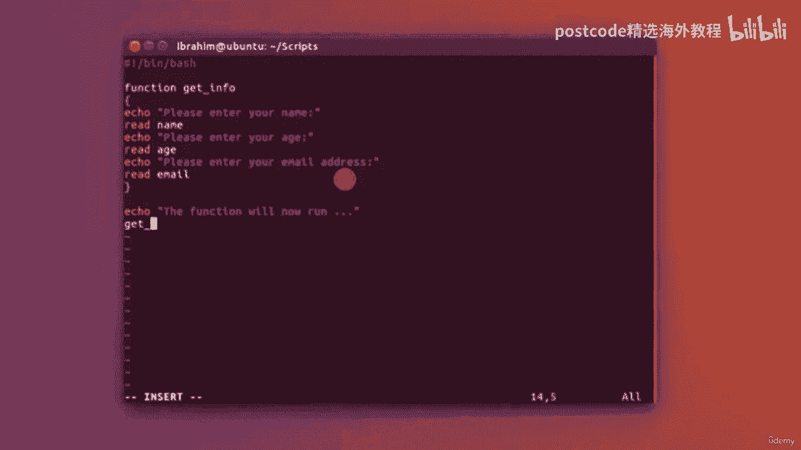
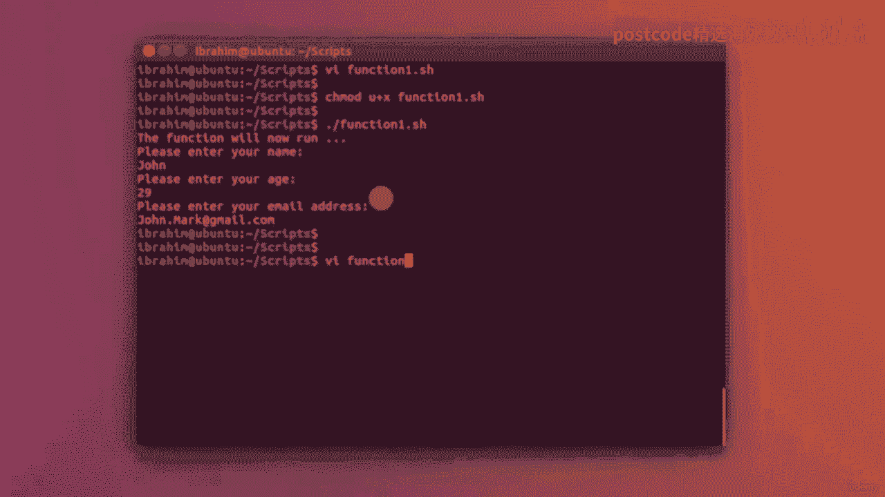
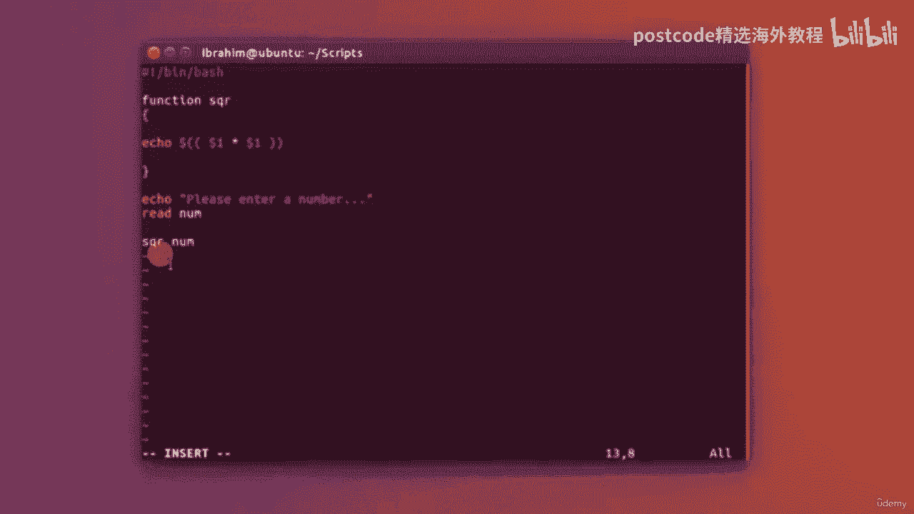
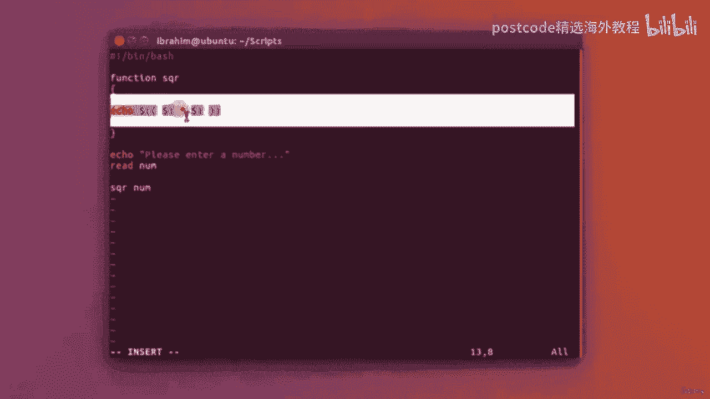
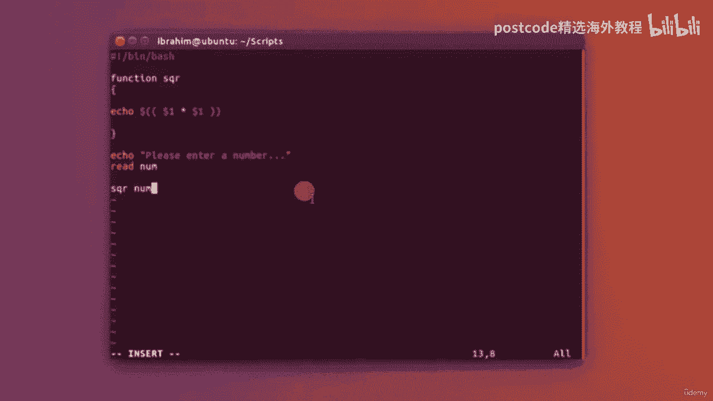
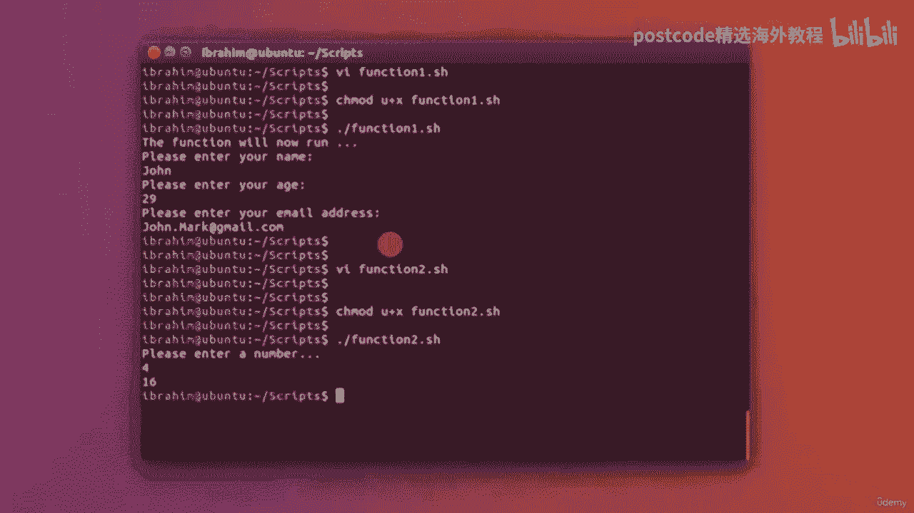
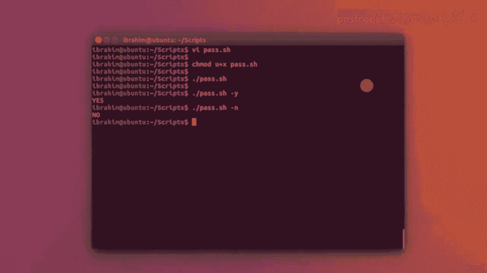
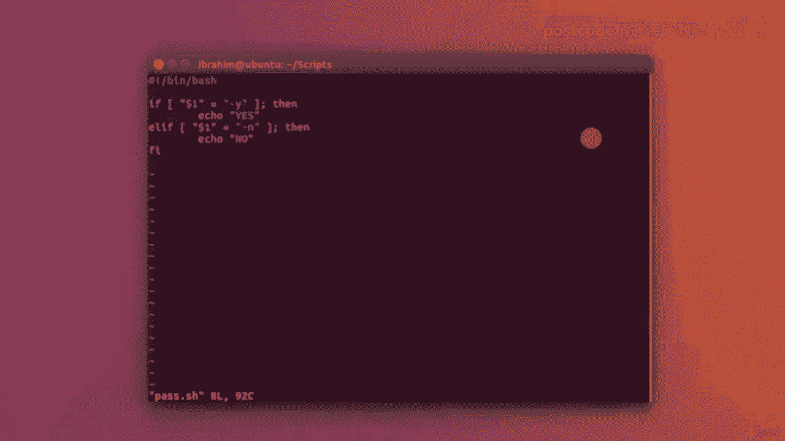

# 红帽企业Linux RHEL 9精通课程 — RHCSA与RHCE 2023认证全指南 - P55：05-05-005 Functions - 精选海外教程postcode - BV1j64y1j7Zg

让我们看一下函数以及如何定义它们以及它们如何在您的脚本中变得有用。为此，我将打开一个新文件。我们将其称为函数一，因为我们将举两个例子。但在我的运输线路中，要定义一个函数，您需要先右击函数。

然后再输入该函数的名称，功能。在我们的场景中，我将其命名为“获取下划线信息”。然后打开和关闭大括号。在这些大括号之间，您将编写您的函数。所以这将是函数名称。

每当我在脚本中写入 get underscore info 时，这些行都会被执行。这就是为什么它在组织代码和重用代码方面非常有用。该函数可能有 2030 行长，您不需要每次都编写它，功能。

您可以简单地定义它一次，然后根据需要使用它。因此，在我们的例子中，我们将通过此获取一些个人信息，获取信息。所以我要写Echo。请输入您的姓名，我会将其写入姓名中。然后我要说的是 Echo。

请输入您的年龄。再次，我将把它读入一个名为 H 的变量中。最后但并非最不重要的一点是，我要附和。请输入您的电子邮件地址，我会将其读入电子邮件中。这就是我的职责。下面，我将编写 echo 函数。好吧。

现在运行并简单地编写，在此处获取下划线信息。

因此，让我们保存它，看看它会如何智能更改并运行脚本。该函数现在将运行。请输入你的名字。例如，我要写信给约翰。请输入您的年龄（一直到 29 岁）。请输入电子邮件地址。假设 John 在 gmail。

com 上点标记，然后我们就开始了。这是第一个例子。第二个示例是使用可以向其传递参数的函数。

我要再次放入我的 shebang 线。现在我要定义一个函数。我将其称为 S、Q、R，该函数将简单地接受一个数字并回显出正方形，那个数字。因此，为了实现这一点。

只需编写 echo、点或符号以及打开和关闭双括号，因为我们将要处理算术运算，我将简单地写为 Dollar，一。倍一。因此，就像通过脚本本身传递参数一样，我们可以通过以下方式将参数传递给函数：

使用美元符号一个变量或分配任何数字。这实际上取决于您想要传递多少个参数，函数将处理多少个参数，和。非常简单，我现在可以在这里写 Echo。请输入一个数字。将该输入读入一个我们将调用 NUM 的变量。

然后简单地传入该变量 num，到函数 q r 。

同样，这个函数可能是一个非常复杂的数学运算，您只需编写。

一次，然后在整个代码中重复使用。

那么让我们测试一下这个。我要更改 mod du plus x。就像这样，让我们​​运行一下并尝试一下。请输入一个数字。比如说，四个。答案应该是16。就这样。

因此，在本课中，我们将介绍如何将参数传递给脚本。因此，就像 LZ 可以采用破折号 L 或破折号 H 等一样，我们将看看如何传递参数，到我们的脚本之一。所以我要输入 VI 进入 pass dot sh。

然后输入 shebang 行，然后输入 Dash。为了检查过去的参数，我们将使用变量美元符号一。所以美元符号，$1 符号或主要是美元符号，任何数字都将成为传递的参数，运行脚本。所以这将是第一个参数。

这将是第二个参数，等等。所以我可以做一个 if 条件，假设。我要放。美元符号一等于破折号。为什么，例如。然后我要回声。是的。否则如果。美元符号一等于。

然后我将回显“no close”这个词来结束 if 条件，保存并退出。我将更改该脚本的 mod u plus x，然后我们将运行它。现在，如果我在没有任何参数的情况下运行它，它不会给出任何结果。然而。

如果我输入一个破折号 y，它将打印出 yes。如果我加一个破折号，它就会打印出 no。

