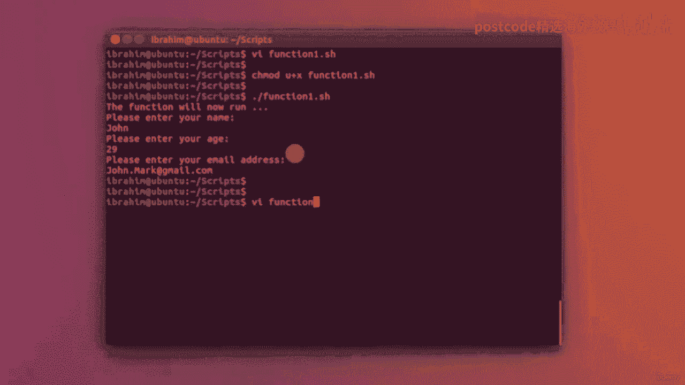
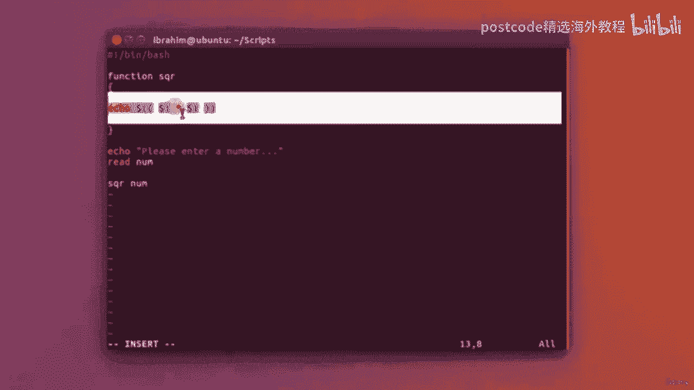
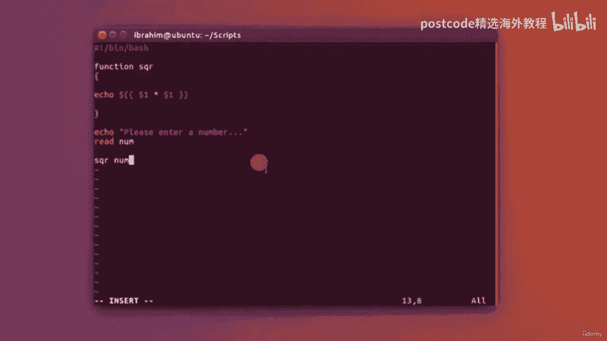
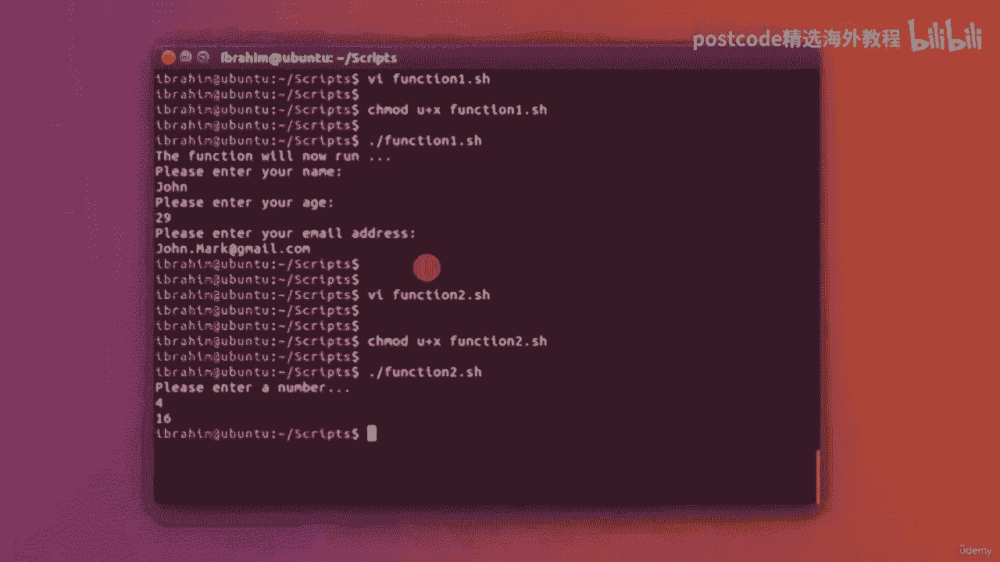
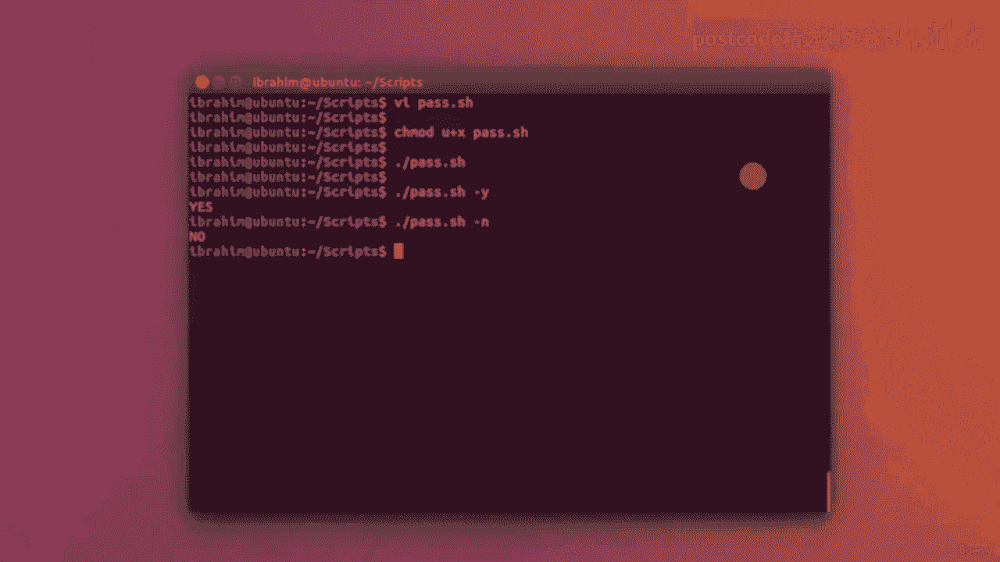

# RHEL 9 脚本编程：05-05-005：函数与参数传递

在本节课中，我们将学习如何在Shell脚本中定义和使用函数，以及如何向脚本和函数传递参数。函数是组织和重用代码的强大工具，能让你的脚本更简洁、更易维护。

## 什么是函数？ 🧩

函数是一段可以重复调用的代码块。定义函数后，你可以在脚本中多次使用它，而无需重复编写相同的代码。这极大地提高了代码的复用性和可读性。

### 如何定义函数

在Shell脚本中，定义函数的基本语法如下：

```bash
function_name() {
    # 函数内部的命令
}
```

或者，你也可以使用 `function` 关键字：

```bash
function function_name {
    # 函数内部的命令
}
```

## 第一个示例：获取用户信息 📝

让我们通过一个简单的例子来理解函数的定义和调用。我们将创建一个函数来获取用户的姓名、年龄和电子邮件地址。

首先，我们创建一个名为 `function_one.sh` 的脚本文件。

```bash
#!/bin/bash


# 定义一个名为 get_info 的函数
get_info() {
    echo "请输入您的姓名："
    read name
    echo "请输入您的年龄："
    read age
    echo "请输入您的电子邮件地址："
    read email
}

# 调用函数
get_info

# 输出获取到的信息（可选）
echo "用户信息："
echo "姓名：$name"
echo "年龄：$age"
echo "邮箱：$email"
```

**代码解释：**
1.  `get_info()` 定义了一个函数。
2.  函数体内部使用 `echo` 提示用户输入，并用 `read` 命令将输入值保存到变量中。
3.  在脚本主体部分，通过 `get_info` 来调用这个函数。
4.  调用函数后，脚本会执行函数内的所有命令。



**运行脚本：**
保存文件后，需要先赋予执行权限，然后运行。

```bash
chmod +x function_one.sh
./function_one.sh
```

运行后，脚本会依次提示你输入信息，并将结果显示出来。

## 第二个示例：带参数的函数 ➕

函数不仅可以执行固定操作，还可以接收外部传入的参数，使其更加灵活。接下来，我们创建一个计算数字平方的函数。

我们创建第二个脚本文件 `function_two.sh`。

```bash
#!/bin/bash

# 定义一个名为 sqr 的函数，它接收一个参数
sqr() {
    # $1 代表传递给函数的第一个参数
    # 使用双括号进行算术运算
    echo $(( $1 * $1 ))
}


echo "请输入一个数字："
read num

# 调用函数，并将变量 num 的值作为参数传递
result=$(sqr $num)
echo "数字 $num 的平方是：$result"
```



**代码解释：**
1.  函数 `sqr()` 使用 `$1` 来获取调用时传入的第一个参数。
2.  `$(( ... ))` 是Shell中进行算术运算的语法。
3.  `result=$(sqr $num)` 这行代码调用了 `sqr` 函数，并将 `$num` 变量的值传递给它。函数执行的结果（即 `echo` 输出的内容）会被捕获并赋值给 `result` 变量。



**运行脚本：**
```bash
chmod +x function_two.sh
./function_two.sh
```
输入数字（例如4），脚本会计算出它的平方（16）并显示。

## 向脚本本身传递参数 🚀

上一节我们介绍了如何向函数传递参数，本节中我们来看看如何向整个脚本传递参数。这类似于许多Linux命令（如 `ls -l`）使用选项的方式。



我们创建一个脚本 `pass.sh` 来演示。

```bash
#!/bin/bash

# $1 代表执行脚本时传入的第一个参数
# $2 代表第二个参数，以此类推

if [ "$1" = "-y" ]; then
    echo "yes"
elif [ "$1" = "-n" ]; then
    echo "no"
else
    echo "未提供有效参数或参数无法识别。"
fi
```

**代码解释：**
1.  `$1` 是一个特殊变量，用于获取运行脚本时提供的第一个参数。
2.  脚本使用 `if-elif-else` 结构来判断 `$1` 的值。
3.  如果第一个参数是 `-y`，则输出 “yes”；如果是 `-n`，则输出 “no”；否则输出提示信息。

**运行脚本：**
```bash
chmod +x pass.sh

# 不传递参数
./pass.sh
# 输出：未提供有效参数或参数无法识别。

# 传递参数 -y
./pass.sh -y
# 输出：yes

# 传递参数 -n
./pass.sh -n
# 输出：no
```

通过这种方式，你可以让脚本根据不同的输入参数执行不同的逻辑，使其功能更加强大和通用。



## 总结 📚


本节课中我们一起学习了Shell脚本中函数的核心用法：
1.  **函数的定义与调用**：使用 `function_name() { ... }` 的语法来封装可重用的代码块。
2.  **带参数的函数**：在函数内部使用 `$1`、`$2` 等来接收参数，使函数逻辑动态化。
3.  **脚本参数传递**：利用 `$1`、`$2` 等特殊变量，让脚本能够接收并处理命令行参数。

掌握函数和参数传递是编写高效、模块化Shell脚本的关键步骤。通过将复杂任务分解为多个函数，并利用参数控制其行为，你可以构建出结构清晰、易于调试和维护的自动化脚本。